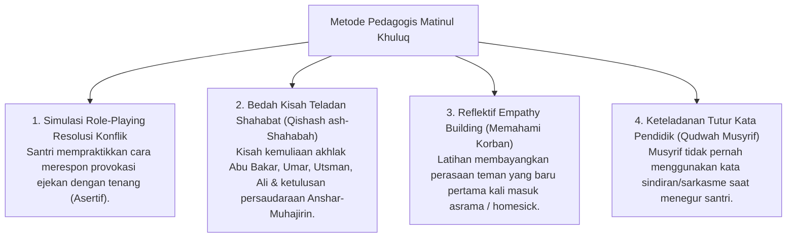

# P3-06-12-Metode-Pedagogi-dan-Didaktik-Akhlak (Matinul Khuluq)

## Tujuan
Menetapkan metode pedagogis dan pendekatan didaktik interaktif dalam menanamkan adab pergaulan islami dan pencegahan perundungan bagi santri.

---

## 1. 4 Metode Pedagogi Pengajaran Akhlak

---

## 2. Status Dokumen
* **Status**: 🌟 **A+ (Tervalidasi & Siap Diimplementasikan)**
* **Level**: Project 3 - `03 Capacity Framework / 06 Matinul Khuluq / 12 Methods`
