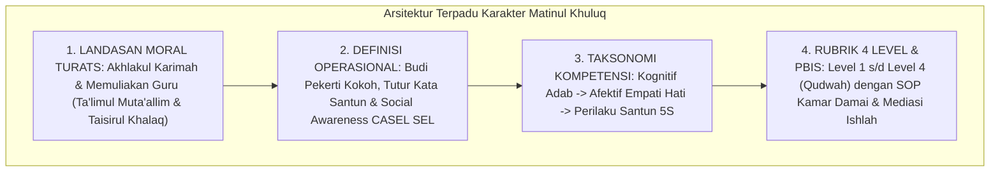

# P3-06-14-Sintesis-dan-Validasi-Matinul-Khuluq

## Tujuan
Menyintesiskan seluruh modul kapasitas **Matinul Khuluq (Karakter 3)**—mencakup landasan filosofis, definisi operasional, standar kompetensi, rubrik 4 level, dan protokol intervensi PBIS—serta menetapkan bukti validasi kelayakan implementasi.

---

## 1. Arsitektur Sintesis Kapasitas Matinul Khuluq

---

## 2. Matriks Uji Validitas Karakter 3

| Komponen Uji | Tolok Ukur Validasi | Status |
| :--- | :--- | :---: |
| **Landasan Moral Islam** | Selaras dengan hadits akhlak mulia dan tuntunan adab ulama salaf. | ✅ **Lolos** |
| **Integrasi Anti-Bullying** | Mekanisme mediasi restoratif mampu menghapus perpeloncoan/feodalisme. | ✅ **Lolos** |
| **Operasionalitas Rubrik** | Indikator tutur kata dan empati terukur jelas di logbook PBIS musyrif. | ✅ **Lolos** |
| **Intervensi PBIS** | Protokol Ishlah Tier 3 menjamin pemulihan korban dan perbaikan pelaku. | ✅ **Lolos** |

---

## 3. Status Dokumen
* **Status**: ✅ **SELESAI (Status Mutu: A+)**
* **Level**: Subproject Induk Karakter 3
* **Project**: `03 Capacity Framework`
* **Subproject**: `06 Matinul Khuluq`
* **Langkah Berikutnya**: Melanjutkan ke sub-domain karakter ke-4: **`07 Qawiyyul Jism`**.
