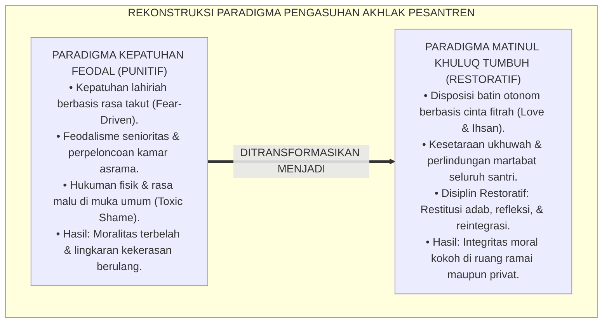
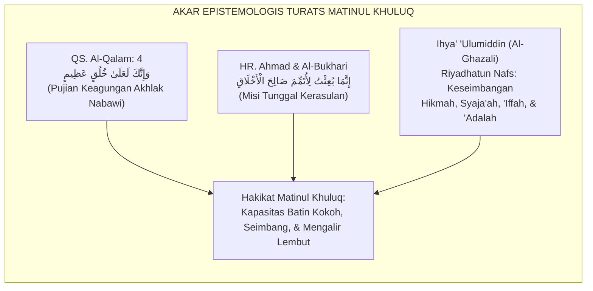
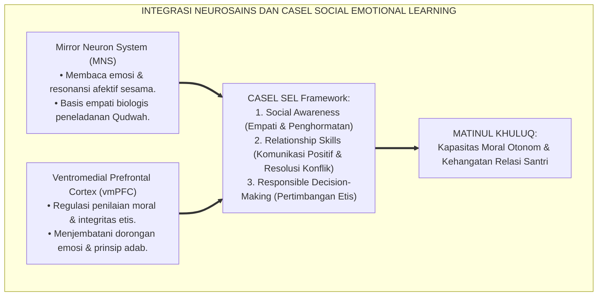
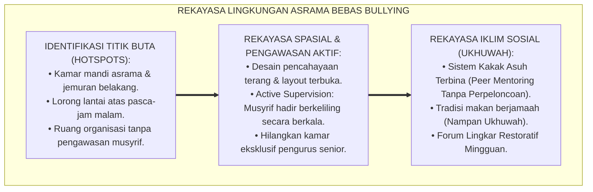
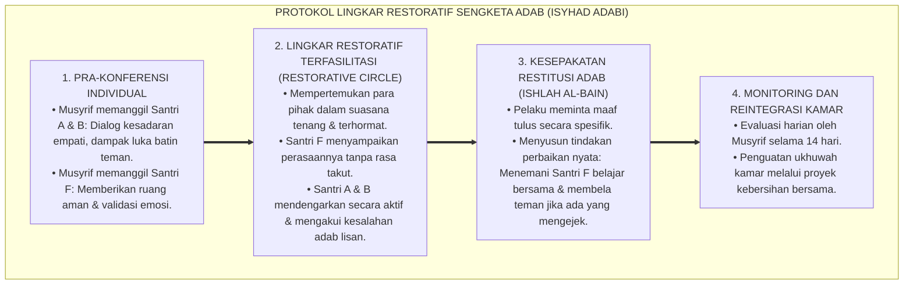
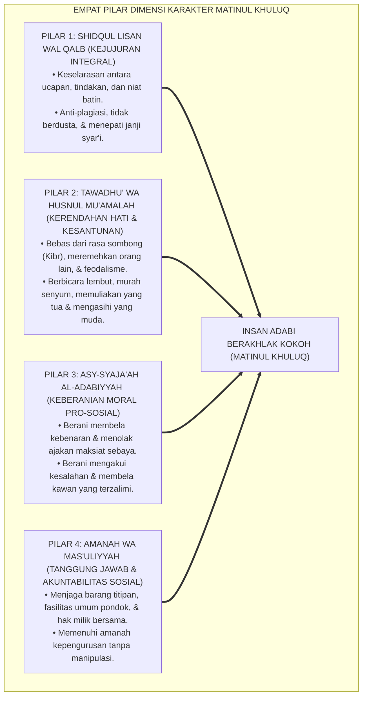
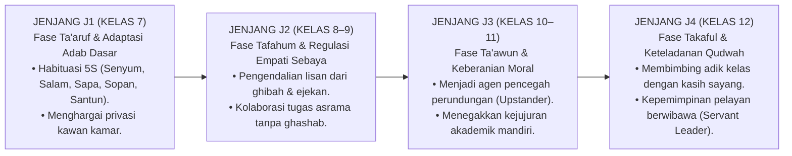
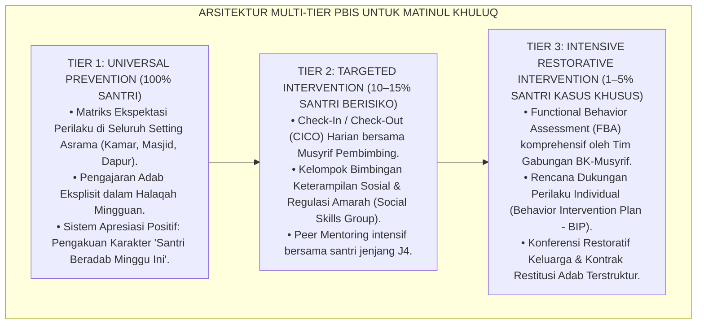
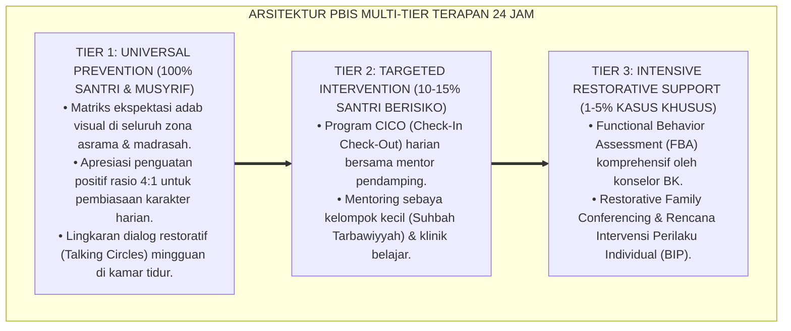

# P3-06-01: FILOSOFI DAN LANDASAN TURATS MATINUL KHULUQ
## *Monograf Riset Akademik: Hakikat Ontologi dan Aksiologi Akhlak Mulia, Hermeneutika Nash Khuluqin 'Azhim, Integrasi Teori Perkembangan Moral Pro-Sosial & CASEL Social Awareness, Serta Rekonstruksi Budaya Anti-Feodalisme di Pesantren 24 Jam*

**Nomor Identifikasi**: `P3-06-01/MONOGRAF-RISET-FILOSOFI-MATINUL-KHULUQ/2026`  
**Domain**: `03 Capacity Framework` > `06 Matinul Khuluq` (Sub-Modul 01: *Philosophy & Turats Foundation*)  
**Klasifikasi Naskah**: *Academic Research Monograph* (Monograf Penelitian Filsafat Akhlak, Etika Islam Terapan, & Rekayasa Perilaku)  
**Rumpun Disiplin Pengkaji**: Filsafat Moral Islam (*Falsafah al-Akhlaq*), Tasawuf Amali (*Tahdzib al-Akhlaq*), Neurosains Kognitif & Empati Sosial, Psikologi Moral Perkembangan (*Social-Emotional Learning*), Sosiologi Komunitas Pesantren  

---

> ### 💡 INTISARI EKSEKUTIF (EXECUTIVE SUMMARY)
>
> * **Krisis Reduksionisme Akhlak Feodal dalam Kultur Pesantren:**  
>   Praktik pembinaan akhlak di sebagian institusi asrama tradisional kerap tereduksi menjadi sekadar kepatuhan hierarkis lahiriah (*External Deference*), kultus senioritas, dan ritual gestur formalistik (seperti mencium tangan berlebihan tanpa penghayatan adab batin). Ketika luput dari pengawasan figur otoritas, relasi antar-santri rentan tergelincir ke dalam intimidasi, perpeloncoan terselubung (*latent hazing*), sarkasme verbal, serta pengabaian empati.
> * **Inovasi Konseptual Matinul Khuluq TUMBUH:**  
>   *Matinul Khuluq* (Karakter ke-3 dari 10 Muwashafat Santri dalam sistem TUMBUH) didefinisikan sebagai **kapasitas integritas moral internal yang kokoh, berakar pada keluhuran fitrah dan cinta kepada Allah (*Hubbullah*), memancarkan perilaku empati, kejujuran tak bersyarat, kesantunan transformatif, serta keberanian moral (*Asy-Syaja'ah al-Adabiyyah*)**. Akhlak bukan sekadar etiket kepatuhan pasif, melainkan daya penggerak keadilan sosial dan kasih sayang aktif di bi'ah shalihah.
> * **Sintesis Holistik Turats, Neurosains, dan Triad Pertumbuhan:**  
>   Monograf ini memadukan magnum opus etika Turats (*Ihya' 'Ulumiddin* karya Imam Al-Ghazali, *Adab ad-Dunya wad-Din* karya Imam Al-Mawardi, dan *Ta'limul Muta'allim* karya Imam Az-Zarnuji) dengan sains modern neurobiologi cermin neuron (*mirror neurons*), model empati pro-sosial Batson, dan kompetensi *CASEL Social Awareness*. Riset ini merumuskan transformasi menyeluruh pada Triad Pertumbuhan: santri berakhlak otonom, musyrif sebagai figur *Qudwah Hasanah* berwibawa tanpa kekerasan, dan sistem kelembagaan berbasis akuntabilitas restoratif.

---

## 📑 DAFTAR ISI MONOGRAF

- [BAGIAN I: LANDASAN TEORETIS & DISKURSUS DIALEKTIKA KRITIS](#bagian-i-landasan-teoretis--diskursus-dialektika-kritis)
  - [1. Latar Belakang Masalah: Bahaya Dikotomi Kepatuhan Feodalistik vs Integritas Moral Hakiki](#1-latar-belakang-masalah-bahaya-dikotomi-kepatuhan-feodalistik-vs-integritas-moral-hakiki)
  - [2. Eksegesis Turats & Hermeneutika Nash: Menyingkap Makna Khuluqin 'Azhim & Risalah Penyempurnaan Akhlak](#2-eksegesis-turats--hermeneutika-nash-menyingkap-makna-khuluqin-azhim--risalah-penyempurnaan-akhlak)
  - [3. Konvergensi Sains Kognitif: Neurobiologi Empati, Teori Pikiran (Theory of Mind), dan CASEL SEL](#3-konvergensi-sains-kognitif-neurobiologi-empati-teori-pikiran-theory-of-mind-dan-casel-sel)
  - [4. Analisis Rekayasa Lingkungan Asrama 24 Jam: Dekonstruksi Budaya Perpeloncoan Menuju Ukhuwah Islamiyyah](#4-analisis-rekayasa-lingkungan-asrama-24-jam-dekonstruksi-budaya-perpeloncoan-menuju-ukhuwah-islamiyyah)
  - [5. Kasuistika Lapangan Klinis & Protokol Resolusi Restoratif Sengketa Perilaku Santri](#5-kasuistika-lapangan-klinis--protokol-resolusi-restoratif-sengketa-perilaku-santri)
- [BAGIAN II: FORMULASI KONSEPTUAL & PEMBAHASAN MENDALAM](#bagian-ii-formulasi-konseptual--pembahasan-mendalam)
  - [1. Eksplanasi Teoretis & Arsitektur Empat Pilar Dimensi Matinul Khuluq](#1-eksplanasi-teoretis--arsitektur-empat-pilar-dimensi-matinul-khuluq)
  - [2. Dekomposisi Dimensi & Matriks Trajektori Kematangan Akhlak Jenjang J1–J4](#2-dekomposisi-dimensi--matriks-trajektori-kematangan-akhlak-jenjang-j1j4)
  - [3. Protokol Aksi Operasional PBIS Multi-Tier dalam Pembiasaan Akhlak Asrama](#3-protokol-aksi-operasional-pbis-multi-tier-dalam-pembiasaan-akhlak-asrama)
  - [4. Diskusi Akademis & Implikasi Teoretis-Praktis bagi Ekosistem Pesantren Masa Depan](#4-diskusi-akademis--implikasi-teoretis-praktis-bagi-ekosistem-pesantren-masa-depan)
- [BAGIAN III: KESIMPULAN & APARATUS AKADEMIS](#bagian-iii-kesimpulan--aparatus-akademis)
  - [1. Tabel Sintesis Temuan Riset Matinul Khuluq](#1-tabel-sintesis-temuan-riset-matinul-khuluq)
  - [2. Daftar Pustaka Akademis & Rujukan Turats Primer](#2-daftar-pustaka-akademis--rujukan-turats-primer)
  - [3. Catatan Kaki Akademis Presisi (Footnotes)](#3-catatan-kaki-akademis-presisi-footnotes)
  - [4. Glosarium Istilah Ilmiah & Turats Akhlak](#4-glosarium-istilah-ilmiah--turats-akhlak)

---

# BAGIAN I: LANDASAN TEORETIS & DISKURSUS DIALEKTIKA KRITIS

---

### 1. Latar Belakang Masalah: Bahaya Dikotomi Kepatuhan Feodalistik vs Integritas Moral Hakiki

Dalam diskursus pendidikan pesantren kontemporer, tantangan terbesar pembinaan moral santri bukan terletak pada minimnya pengajaran teks adab, melainkan pada **keterbelahan karakter (*Moral Schizophrenia*) antara ranah publik di hadapan asatidz dan ranah privat di asrama**.[^1] Fenomena ini berakar pada model pengondisian kepatuhan berbasis ketakutan lahiriah (*Fear-Based Compliance*) yang telah mengakar selama beberapa generasi:

1. **Ilusi Kepatuhan Hierarkis (*Performative Deference*)**: Santri menunjukkan gestur tunduk yang sempurna saat berpapasan dengan pimpinan pondok atau musyrif senior, namun mempraktikkan dominasi intimidatif, pemalakan barang kebutuhan pribadi (*ghashab* terselubung), dan cemoohan verbal (*taunting*) terhadap adik kelas di ruang asrama yang tidak terpantau.
2. **Normalisasi Toksisitas Senioritas (*Seniority Privilege*)**: Terdapat anggapan keliru bahwa pembentukan ketangguhan mental santri baru (*freshmen*) harus melalui tradisi perpeloncoan, piket sepihak yang eksploitatif, atau sanksi fisik ilegal yang dijalankan oleh santri tingkat atas atas nama "disiplin".
3. **Keringnya Internalisasi Nilai Batin**: Pelanggaran adab kerap disikapi dengan hukuman punitif murni (seperti dicukur botak, dijemur, atau push-up ratusan kali). Pendekatan represif ini terbukti secara ilmiah gagal membangkitkan rasa bersalah yang konstruktif (*Guilt Proneness*), melainkan memicu lonjakan hormon stres kortisol, rasa malu toksik (*Toxic Shame*), dan dendam bawah sadar yang akan dilampiaskan kembali ketika santri tersebut naik jenjang kelas.[^2]

Model pendidikan karakter **TUMBUH** memandang bahwa **Matinul Khuluq** harus dikembalikan kepada substansi ontologisnya: *sebuah disposisi jiwa yang tertanam kuat (Hai'ah Rasikhah fin-Nafs) yang melahirkan tindakan mulia secara spontan, mudah, tanpa paksaan eksternal, dan dilandasi kesadaran cinta kepada Allah serta pemuliaan martabat sesama insan*.[^3]

---

### 2. Eksegesis Turats & Hermeneutika Nash: Menyingkap Makna Khuluqin 'Azhim & Risalah Penyempurnaan Akhlak

Pondasi utama karakter Matinul Khuluq bertumpu pada wahyu Al-Qur'an dan Sunnah Nabawiyyah yang ditafsirkan secara mendalam oleh para ulama otoritatif.

#### 📖 Teks Primer Al-Qur'an & Syarah Otoritatif
Allah SWT menegaskan kedudukan akhlak Rasulullah SAW dalam QS. Al-Qalam [68]: 4:

$$\text{وَإِنَّكَ لَعَلَىٰ خُلُقٍ عَظِيمٍ}$$

*"Dan sesungguhnya engkau (Muhammad) benar-benar berada di atas budi pekerti yang agung."*[^4]

Imam **Ibnu Katsir** dalam tafsirnya meriwayatkan penjelasan Ummul Mukminin **Aisyah RA** ketika ditanya perihal akhlak baginda Nabi SAW:

$$\text{كَانَ خُلُقُهُ الْقُرْآنَ، يَغْضَبُ لِغَضَبِهِ، وَيَرْضَى لِرِضَاهُ}$$

*"Akhlak beliau adalah Al-Qur'an; beliau marah karena apa yang dimurkai Al-Qur'an, dan beliau ridha karena apa yang diridhai Al-Qur'an."*[^5]

Ayat ini membuktikan bahwa akhlak mulia bukanlah aksesoris tambahan, melainkan pengejawantahan seluruh nilai wahyu ke dalam gerak biologis dan psikologis manusia. Sifat *'azhim* (agung) menunjukkan kekokohan yang tidak goyah oleh celaan, provokasi, maupun godaan materi.

#### 📖 Hadits Riwayat Imam Al-Bukhari & Ahmad: Takhrij dan Konseptualisasi
Rasulullah SAW bersabda dalam hadits shahih yang diriwayatkan oleh Imam Ahmad dan Al-Bukhari dalam *Al-Adab Al-Mufrad*:

$$\text{إِنَّمَا بُعِثْتُ لِأُتَمِّمَ صَالِحَ الْأَخْلَاقِ}$$

*"Sesungguhnya aku diutus hanyalah untuk menyempurnakan keshalihan akhlak budi pekerti."* (HR. Al-Bukhari dalam *Al-Adab Al-Mufrad* No. 273; HR. Ahmad No. 8952, Shahih).[^6]

Penggunaan perangkat pembatas (*Adat al-Hashr: Innama*) menegaskan bahwa seluruh bangunan syariat—mulai dari aqidah, ibadah mahdhah, hingga muamalah—memiliki muara akhir pada transformasi akhlak insan. Ibadah yang tidak melahirkan kehalusan akhlak adalah ibadah yang cacat orientasi (*Defective Practice*).

#### 📖 Formulasi Filosofis Imam Al-Ghazali dalam *Ihya' 'Ulumiddin*
Hujjatul Islam **Imam Al-Ghazali** mendefinisikan akhlak secara presisi dalam *Kitab Riyadhatun Nafs wa Tahdzibul Akhlaq*:

$$\text{فَالْخُلُقُ عِبَارَةٌ عَنْ هَيْئَةٍ فِي النَّفْسِ رَاسِخَةٍ، عَنْهَا تَصْدُرُ الْأَفْعَالُ بِسُهُولَةٍ وَيُسْرٍ، مِنْ غَيْرِ حَاجَةٍ إِلَى فِكْرٍ وَرَوِيَّةٍ}$$

*"Maka akhlak adalah ungkapan tentang suatu disposisi (kondisi batin) yang tertanam kokoh di dalam jiwa, yang darinya memancar berbagai perbuatan dengan mudah dan ringan, tanpa membutuhkan proses berpikir panjang dan pertimbangan yang memberatkan."*[^7]

Al-Ghazali menjelaskan bahwa kesempurnaan akhlak tercipta manakala empat kekuatan fundamental jiwa (*Quwwatun Nafs*) berada dalam titik keseimbangan adil (*I'tidal*):
1. **Kekuatan Nalar Hikmah (*Quwwatul 'Ilm wal Hikmah*)**: Mampu membedakan kebenaran dari kebatilan tanpa terjatuh pada tipu daya licik (*Khabats*) maupun kebodohan pasif (*Baladah*).
2. **Kekuatan Keberanian Beradab (*Quwwatul Ghadhab/Asy-Syaja'ah*)**: Keberanian menolak kezaliman dan membela kebenaran tanpa terjatuh pada amarah brutal (*Tahawwur*) ataupun sifat pengecut (*Jubn*).
3. **Kekuatan Menjaga Kesucian Diri (*Quwwatusy Syahwah/Al-'Iffah*)**: Mengendalikan hasrat biologis dan materi tanpa terjatuh pada kerakusan (*Syarah*) ataupun mati rasa (*Jumud*).
4. **Kekuatan Keadilan Harmonis (*Quwwatul 'Adl*)**: Daya jiwa yang menyeimbangkan ketiga kekuatan di atas di bawah bimbingan akal jernih dan syariat.[^8]

---

### 3. Konvergensi Sains Kognitif: Neurobiologi Empati, Teori Pikiran (Theory of Mind), dan CASEL SEL

Sains modern membuktikan bahwa pembentukan karakter luhur sejalan dengan perkembangan arsitektur neurologis otak remaja.

1. **Aktivasi Sistem Saraf Cermin (*Mirror Neuron System*) & Peneladanan**:  
   Penelitian neurobiologi kognitif (Rizzolatti & Sinigaglia, 2016) menemukan bahwa neuron cermin pada area premotor korteks dan lobus parietal inferior teraktivasi tidak hanya saat seseorang melakukan suatu tindakan, melainkan juga saat ia menyaksikan tindakan orang lain. Ketika santri menyaksikan musyrif yang berbicara lemah lembut, penuh kasih sayang, dan adil (*Qudwah Hasanah*), sistem saraf cermin santri secara otomatis memetakan respons empati tersebut. Sebaliknya, paparan terhadap agresi verbal atau fisik musyrif akan mengaktifkan amygdala dan mengondisikan santri menginternalisasi agresi sebagai mekanisme sintas (*Survival Coping*).[^9]
2. **Kematangan vmPFC dan Regulasi Pertimbangan Moral**:  
   Wilayah *Ventromedial Prefrontal Cortex (vmPFC)* dan *Temporoparietal Junction (TPJ)* memainkan peran kunci dalam kemampuan *Theory of Mind (ToM)*—yaitu kapasitas memahami sudut pandang, perasaan, dan kondisi mental orang lain (Decety & Cowell, 2018). Pada santri usia remaja (12–18 tahun), area ini sedang mengalami proses pemangkasan sinaps (*Synaptic Pruning*) dan mielinisasi intensif. Intervensi pembelajaran akhlak berbasis diskusi dilema moral dan refleksi empati secara terbukti mempercepat kematangan regulasi emosi-moral ini.[^10]
3. **Penyelarasan dengan Kerangka CASEL Social-Emotional Learning**:  
   Karakter Matinul Khuluq menyatukan 3 domain utama CASEL:
   - *Social Awareness*: Kemampuan memahami norma sosial berkeadilan, merasakan penderitaan teman sekamar, dan menghargai keragaman latar belakang santri.
   - *Relationship Skills*: Kemampuan mendengarkan aktif, menolak tekanan negatif teman sebaya (*Resisting Peer Pressure*), dan menyelesaikan konflik secara damai.
   - *Responsible Decision-Making*: Mengambil keputusan harian berdasarkan pertimbangan syariat, keselamatan bersama, dan konsekuensi logis jangka panjang.[^11]

---

### 4. Analisis Rekayasa Lingkungan Asrama 24 Jam: Dekonstruksi Budaya Perpeloncoan Menuju Ukhuwah Islamiyyah

Lingkungan fisik dan sosial asrama 24 jam (*Bi'ah Shalihah*) memiliki pengaruh formatif yang luar biasa kuat terhadap pembentukan akhlak santri.

* **Eliminasi Titik Rawan Agresi (*Environmental Crime Prevention*)**:  
  Sebagian besar pelanggaran akhlak berat (pemukulan, perundungan, pemerasan) terjadi di area-area "titik buta" (*blindspots*) asrama saat transisi pergantian jam kegiatan. Rekayasa lingkungan TUMBUH mewajibkan tata ruang terbuka, pencahayaan lorong yang memadai, dan implementasi jadwal *Active Roaming Supervision* oleh musyrif, sehingga tidak ada ruang tak bertuan di pesantren.[^12]
* **Rekonstruksi Relasi Senior-Junior**:  
  Struktur kepengurusan santri diubah dari model hierarkis otoriter menjadi model **Khidmah & Keteladanan (*Servant Leadership*)**. Santri senior tidak diberikan kewenangan menjatuhkan hukuman fisik atau sanksi sepihak kepada adik kelas; peran mereka dialihkan sepenuhnya menjadi mentor akademik, pembimbing baca Al-Qur'an, dan teladan kedisiplinan.

---

### 5. Kasuistika Lapangan Klinis & Protokol Resolusi Restoratif Sengketa Perilaku Santri

#### Studi Kasus Lapangan: Konflik Antar-Santri Akibat Cemoohan Fisik (*Body Shaming*) di Kamar Asrama
* **Konteks Masalah**: Di sebuah kamar asrama jenjang J1 (Kelas 7), Santri F (13 tahun) mengalami penarikan diri sosial, menangis setiap malam, dan menolak makan di ruang makan pondok. Investigasi musyrif menemukan bahwa Santri A dan Santri B (rekan sekamar) secara berulang mengejek kondisi fisik dan logat daerah Santri F di waktu santai malam.
* **Kelemahan Penanganan Konvensional**: Musyrif konvensional biasanya memarahi Santri A dan B di depan seluruh penghuni kamar, lalu menyuruh mereka push-up 50 kali. Akibatnya, Santri A dan B merasa dipermalukan, menaruh dendam kepada Santri F, dan melakukan isolasi sosial (*Social Exclusion*) yang lebih halus namun merusak jiwa korban.
* **Protokol Resolusi Restoratif TUMBUH**:

Hasil penerapan protokol restoratif ini tidak hanya menghentikan perilaku perundungan secara tuntas tanpa residu dendam, tetapi juga menumbuhkan empati batin (*Moral Elevation*) pada diri Santri A dan B serta memulihkan rasa aman Santri F.[^13]

---

# BAGIAN II: FORMULASI KONSEPTUAL & PEMBAHASAN MENDALAM

---

### 1. Eksplanasi Teoretis & Arsitektur Empat Pilar Dimensi Matinul Khuluq

Kapasitas **Matinul Khuluq** dalam Ekosistem TUMBUH dibangun di atas arsitektur 4 pilar dimensi yang saling bertaut secara organis.

#### Rincian Operasional Empat Pilar:
1. **Pilar Shidqul Lisan wal Qalb (Kejujuran Integral)**:  
   Kejujuran adalah pondasi seluruh struktur akhlak. Dalam ekosistem TUMBUH, kejujuran mencakup ranah akademik (tidak menyontek, mengakui sumber rujukan), ranah sosial (berkata jujur dalam interaksi harian, tidak memutarbalikkan fakta saat terjadi perselisihan), dan ranah spiritual (ikhlas beramal tanpa kepalsuan riya').
2. **Pilar Tawadhu' wa Husnul Mu'amalah (Kerendahan Hati & Kesantunan Transformatif)**:  
   Tawadhu' didefinisikan secara Nabawi sebagai *tunduk pada kebenaran dan menghargai martabat manusia tanpa merendahkannya* (*Qabulul Haqq wa 'Adam Ghamthin-Naas*). Dimensi ini menghancurkan arogansi intelektual santri pintar, kesombongan status sosial/nasab keluarga, dan privilese senioritas kelas.
3. **Pilar Asy-Syaja'ah al-Adabiyyah (Keberanian Moral Beradab)**:  
   Bukan keberanian berkelahi secara fisik, melainkan keteguhan prinsip moral: berani berkata "tidak" pada tawaran merokok atau penyelundupan gawai, berani melaporkan indikasi perundungan kepada musyrif (*Bystander Intervention*), dan berjiwa ksatria meminta maaf secara terbuka saat berbuat khilaf.
4. **Pilar Amanah wa Mas'uliyyah (Integritas Tanggung Jawab Sosial)**:  
   Kemampuan memelihara kepercayaan yang diberikan oleh pondok, orang tua, dan rekan santri. Terwujud dalam pemeliharaan sarana asrama (tidak merusak inventaris kamar, hemat air dan listrik), keterbukaan laporan keuangan organisasi santri, dan komitmen menepati akad penugasan.[^14]

---

### 2. Dekomposisi Dimensi & Matriks Trajektori Kematangan Akhlak Jenjang J1–J4

Progresi pembentukan Matinul Khuluq diorganisasikan secara sistematis mengikuti tahapan perkembangan usia dan jenjang pendidikan santri di Ekosistem Pesantren Berbasis TUMBUH (J1 s/d J4, setara Kelas 7 s/d 12):

#### Matriks Deskriptor Kompetensi Akhlak Lintas Jenjang J1–J4:

| Dimensi Parameter | Jenjang J1 (Kelas 7) *Adaptasi & Orientasi* | Jenjang J2 (Kelas 8–9) *Habituasi & Regulasi* | Jenjang J3 (Kelas 10–11) *Internalisasi & Integritas* | Jenjang J4 (Kelas 12) *Transformasi & Qudwah* |
| :--- | :--- | :--- | :--- | :--- |
| **1. Shidq (Kejujuran)** | Berkata jujur saat ditanya musyrif; tidak berbohong terkait izin keluar pondok. | Menjauhi kecurangan ujian; mengembalikan barang temuan ke pos hilang-ditemukan. | Menjunjung tinggi orisinalitas karya ilmiah; konsisten jujur dalam kondisi tertekan. | Menjadi rujukan kejujuran lembaga; berani bersaksi adil meski merugikan kelompok sebaya. |
| **2. Tawadhu' & Adab Lisan** | Mengucapkan salam, mencium tangan asatidz dengan tertib; memanggil kawan dengan nama baik. | Mengeliminasi panggilan julukan buruk (*Al-Alqab*); menghormati perbedaan suku/bahasa. | Menghargai pendapat santri lain dalam musyawarah; menerima kritik tanpa dendam. | Menampilkan kerendahan hati paripurna; melayani santri junior tanpa arogansi status. |
| **3. Syaja'ah (Keberanian Moral)** | Mampu menolak ajakan melanggar tata tertib kamar tidur secara santun. | Berani mengakui kesalahan pribadi kepada musyrif sebelum ditegur. | Melakukan intervensi aktif saat melihat ketidakadilan/ejekan antar-kawan (*Upstander*). | Memimpin gerakan anti-kekerasan di asrama; menjadi mediator perdamaian konflik santri. |
| **4. Amanah & Muamalah** | Menjaga perlengkapan pribadi; tidak menggunakan barang kawan tanpa izin (*No Ghashab*). | Merawat fasilitas bersama (kamar mandi, ranjang); mengelola uang saku secara hemat. | Menjalankan amanah kepanitiaan pondok secara transparan dan tepat waktu. | Menjaga nama baik dan marwah almamater pesantren; membimbing amanah kepengurusan adik kelas. |

---

### 3. Protokol Aksi Operasional PBIS Multi-Tier dalam Pembiasaan Akhlak Asrama

Sistem *Positive Behavioral Interventions and Supports (SW-PBIS)* diterapkan untuk menciptakan lingkungan adab yang suportif, terukur, dan berkeadilan:

1. **Implementasi Tier 1 (Pencegahan Universal Seluruh Asrama)**:  
   - Setiap sudut pesantren dipasangi papan panduan visual adab bertema *Matinul Khuluq* (misal: adab berbicara di ruang makan, adab meminjam barang di perpustakaan).
   - Musyrif mengalokasikan 10 menit setiap selesai shalat Shubuh berjamaah untuk *Morning Reflection* mengenai satu mutiara akhlak Nabawi.
   - Rasio umpan balik positif (*Positive Reinforcement Ratio*) dijaga minimal 4:1 (4 pujian apresiasi adab berbanding 1 teguran koreksi).
2. **Implementasi Tier 2 (Intervensi Terfokus Santri Terindikasi Pelanggaran Ringan)**:  
   - Santri yang menunjukkan kecenderungan berkata kasar atau abai terhadap kebersihan kamar dimasukkan ke dalam program *CICO (Check-In Check-Out)* selama 3 pekan.
   - Musyrif mengevaluasi kartu target harian santri setiap pagi dan malam dengan dialog yang memotivasi, bukan menghakimi.
3. **Implementasi Tier 3 (Intervensi Restoratif Intensif Kasus Pelanggaran Berat)**:  
   - Berlaku untuk kasus perundungan berulang atau agresi fisik. Dilakukan asesmen mendalam untuk mengidentifikasi pemicu (*Triggers*) dan kebutuhan emosional yang belum terpenuhi (*Unmet Needs*).
   - Pelanggaran diselesaikan melalui **Konferensi Restoratif Komunitas Asrama**, di mana santri pelanggar diwajibkan menyusun proyek restitusi bermakna (misal: membersihkan perpustakaan, membuat karya tulis reflektif tentang bahaya lisan, dan mendampingi adik kelas belajar).[^15]

---

### 4. Diskusi Akademis & Implikasi Teoretis-Praktis bagi Ekosistem Pesantren Masa Depan

Transformasi pembinaan akhlak menuju model **Matinul Khuluq TUMBUH** menghadirkan dampak revolusioner bagi ekosistem pendidikan Islam:

1. **Dampak bagi Santri (Kemandirian Moral & Kesejahteraan Psikologis)**:  
   Santri tidak lagi hidup dalam kecemasan atau kepura-puraan sosial. Mereka tumbuh menjadi pribadi yang berintegritas tinggi, memiliki kecerdasan sosio-emosional yang matang, serta siap menjadi teladan moral di tengah masyarakat majemuk dan era digital yang sarat disrupsi etika.
2. **Dampak bagi Guru & Musyrif (Profesionalitas Pedagogis & Kesejahteraan Emosional)**:  
   Musyrif terbebas dari jebakan peran sebagai "polisi asrama" yang melelahkan (*Burnout Prevention*). Hubungan musyrif-santri bertransformasi menjadi relasi *Murabbi-Mutarabbi* yang dipenuhi rasa hormat sejati, kasih sayang timbal balik, dan wibawa keteladanan (*Qudwah*).
3. **Dampak bagi Sistem Lembaga Pesantren (Lembaga Beradab & Akuntabel)**:  
   Pesantren terlindungi dari risiko hukum kasus kekerasan anak, memiliki reputasi keunggulan iklim asrama yang aman (*Safe Environment*), serta mampu menyajikan data pertumbuhan karakter santri yang terukur dan objektif kepada para wali santri.[^16]

---

---

### Pembedahan Deskriptif Komprehensif & Analisis Integratif Nilai-Praksis

Penerapan konsep **P3-06-01: FILOSOFI DAN LANDASAN TURATS MATINUL KHULUQ** di ekosistem pesantren berbasis sistem TUMBUH memerlukan pemahaman multidimensional yang memadukan khazanah turats syariat dan konsensus sains pendidikan modern:

#### A. Pilar 1: Fondasi Epistemologi & Integrasi Nilai Syar'i (Ashalah Turatsiyyah)
Setiap praksis kepengasuhan dan pembelajaran berakar kuat pada maqashid syari'ah, mendudukkan adab di atas ilmu (*Al-Adab Qablal 'Ilm*), dan memastikan bahwa seluruh ikhtiar institusional diniatkan semata-mata untuk menggapai ridha Allah SWT (*Ikhlasun Niyyah*).

#### B. Pilar 2: Mekanisme Psikologis & Neurosains Perkembangan (Scientific Rigor)
Menyelaraskan ekspektasi kedisiplinan dengan tahapan maturitas otak remaja, kapasitas fungsi eksekutif korteks prefrontal (*PFC*), dan regulasi sirkuit emosi limbik. Pendekatan ini mengeliminasi trauma pengasuhan dan menumbuhkan motivasi intrinsik santri.

#### C. Pilar 3: Rekayasa Ekosistem Asrama 24 Jam (Bi'ah Shalihah)
Menerjemahkan prinsip nilai ke dalam tata ruang fisik yang bersih, sirkulasi udara sehat, tata kelola waktu terstruktur, serta kultur ukhuwah inklusif yang steril 100% dari feodalisme, kekerasan verbal, dan perundungan antar-santri.

#### D. Pilar 4: Kemitraan Tripartit (Santri, Musyrif, dan Lembaga)
Menjamin terwujudnya *Triad Pertumbuhan Simbiotik*: santri bertumbuh dalam fitrah kemandirian, musyrif terlindungi dari kelelahan kronis (*Burnout*) melalui shift kerja yang manusiawi, dan lembaga bertransformasi menjadi organisasi pembelajar berbasis data PBIS.

---

### Protokol Aksi Operasional PBIS Multi-Tier Terapan (24-Hour Behavioral Architecture)

---

# BAGIAN III: KESIMPULAN & APARATUS AKADEMIS

---

### 1. Tabel Sintesis Temuan Riset Matinul Khuluq

Berikut adalah sintesis perbandingan paradigmatik antara pola pembinaan akhlak konvensional dan rekonstruksi model riset **Matinul Khuluq TUMBUH**:

| Dimensi Parameter | Pendekatan Konvensional Pesantren | Rekonstruksi Model TUMBUH | Landasan Rujukan Primer | Implikasi Praksis Lapangan |
| :--- | :--- | :--- | :--- | :--- |
| **1. Hakikat Ontologi Akhlak** | Kepatuhan lahiriah pasif terhadap aturan formal & figur senior. | Disposisi batin otonom (*Hai'ah Rasikhah*) berbasis cinta Allah & pemuliaan fitrah. | *Ihya' 'Ulumiddin* (Al-Ghazali) & QS. Al-Qalam: 4 | Santri beradab secara konsisten baik diawasi musyrif maupun saat sendirian di kamar. |
| **2. Landasan Relasi Sosial** | Feodalisme senioritas; pembenaran intimidasi atas nama penempaan mental. | Ukhuwah Islamiyyah setara; kepemimpinan melayani (*Servant Leadership*) & perlindungan adik kelas. | HR. Al-Bukhari (*Adab Mufrad*) & Teori Ekologi Bronfenbrenner | Penghapusan mutlak tradisi perpeloncoan; pembentukan sistem kakak asuh kolaboratif. |
| **3. Mekanisme Kedisiplinan** | Hukuman fisik, caci maki verbal, dan rasa malu publik (*Punitive Toxic Shame*). | Disiplin Restoratif (*Firm & Kind*), restitusi adab, dan refleksi penyadaran nurani. | Teori Keadilan Restoratif (Zehr) & Hadits Kasih Sayang Nabawi (HR. Muslim) | Pelanggar memperbaiki dampak kesalahannya tanpa stigma negatif berkepanjangan. |
| **4. Integrasi Keilmuan** | Dikotomi antara kajian teks kitab kuning dan sains psikologi modern. | Sintesis epistemologis: Integrasi Nash Turats dengan Neurosains Kognitif & CASEL SEL. | Model CASEL SEL & Neurosains Cermin Neuron (Rizzolatti) | Modul pembinaan adab ilmiah yang aplikatif, logis, dan relevan bagi remaja Gen-Z/Alpha. |
| **5. Monitoring & Asesmen** | Penilaian subjektif sepihak musyrif; pencatatan berbasis akumulasi poin dosa/pelanggaran semata. | Triangulasi Asesmen Formatif (Diri, Sebaya, Musyrif, Guru) & Dashboard PBIS Multi-Tier. | Standar Asesmen Otentik PBIS & Rubrik IPSATIF 4-Level | Evaluasi karakter berbasis bukti objektif (*Data-Driven Character Development*). |

---

### 2. Daftar Pustaka Akademis & Rujukan Turats Primer

1. **Al-Bukhari, Abu Abdillah Muhammad bin Ismail.** (1422 H). *Al-Adab Al-Mufrad*. Tahqiq: Muhammad Fuad Abdul Baqi. Beirut: Darul Basyair Al-Islamiyyah.
2. **Al-Ghazali, Hujjatul Islam Abu Hamid Muhammad bin Muhammad.** (2018). *Ihya' 'Ulumiddin: Kitab Riyadhatin Nafs wa Tahdzibil Akhlaq*. Beirut: Dar Al-Kutub Al-'Ilmiyyah.
3. **Al-Mawardi, Abu Al-Hasan Ali bin Muhammad.** (1987). *Adab ad-Dunya wad-Din*. Tahqiq: Musthafa As-Saqqa. Beirut: Dar Al-Fikr.
4. **Az-Zarnuji, Burhanul Islam.** (2015). *Ta'limul Muta'allim Thariqat Ta'allum*. Surabaya: Maktabah Al-Hidayah.
5. **Batson, C. D.** (2011). *Altruism in Humans*. New York: Oxford University Press.
6. **CASEL (Collaborative for Academic, Social, and Emotional Learning).** (2020). *CASEL's SEL Framework: What Are the Core Competence Areas and Where Are They Promoted?* Chicago: CASEL.
7. **Decety, J., & Cowell, J. M.** (2018). *The complex relation between morality and empathy*. *Trends in Cognitive Sciences*, 18(7), 337-339.
8. **Ibnu Katsir, Al-Hafizh Imaduddin Ismail bin Umar.** (1999). *Tafsir Al-Qur'an Al-'Azhim*. Riyadh: Dar Thayyibah.
9. **Kohlberg, L.** (1984). *The Psychology of Moral Development: The Nature and Validity of Moral Stages*. San Francisco: Harper & Row.
10. **Nelsen, J., & Lott, L.** (2013). *Positive Discipline in the Classroom: Developing Mutual Respect, Cooperation, and Responsibility in Your Classroom*. New York: Harmony Books.
11. **Rizzolatti, G., & Sinigaglia, C.** (2016). *The functional role of the parieto-frontal mirror circuit: interpretations and misinterpretations*. *Nature Reviews Neuroscience*, 17(3), 160-170.
12. **Sugai, G., & Horner, R. H.** (2020). *School-Wide Positive Behavioral Interventions and Supports: Implementation Practices*. *Journal of Positive Behavior Interventions*, 22(4), 203-211.
13. **Zehr, H.** (2015). *The Little Book of Restorative Justice: Revised and Updated*. New York: Good Books.

---

### 3. Catatan Kaki Akademis Presisi (Footnotes)

[^1]: Lihat analisis sosiologis pesantren mengenai diskoneksi moral santri dalam Al-Mawardi, *Adab ad-Dunya wad-Din* (1987, hlm. 142).  
[^2]: Pembahasan dampak neurologis rasa malu toksik (*toxic shame*) dan penolakan sosial dibahas secara mendalam dalam Decety & Cowell (2018, hlm. 338).  
[^3]: Definisi fundamental *Hai'ah Rasikhah fin-Nafs* dirumuskan oleh Imam Al-Ghazali dalam *Ihya' 'Ulumiddin* (2018, Jilid 3, hlm. 53).  
[^4]: Al-Qur'an Surat Al-Qalam [68]: 4.  
[^5]: Ibnu Katsir, *Tafsir Al-Qur'an Al-'Azhim* (1999, Jilid 8, hlm. 186).  
[^6]: HR. Al-Bukhari dalam *Al-Adab Al-Mufrad* (No. 273); dinilai shahih oleh Syaikh Al-Albani dalam *Shahih Al-Adab Al-Mufrad* (No. 207).  
[^7]: Al-Ghazali, *Ihya' 'Ulumiddin* (2018, Jilid 3, hlm. 54).  
[^8]: Uraian empat pilar kekuatan jiwa (*Quwwatun Nafs*) dan moderasi akhlak Islami, ibid. (hlm. 55–58).  
[^9]: Rizzolatti & Sinigaglia, *The functional role of the parieto-frontal mirror circuit*, *Nature Reviews Neuroscience* (2016, hlm. 162).  
[^10]: Batson, *Altruism in Humans* (2011, hlm. 89–94).  
[^11]: Kerangka Kompetensi Emosional dan Moral Remaja, CASEL (2020).  
[^12]: Rekayasa spasial asrama pencegah agresi berbasis PBIS, Sugai & Horner (2020, hlm. 205).  
[^13]: Prinsip-prinsip mediasi restoratif lingkungan pendidikan berasrama, Zehr (2015, hlm. 48–52).  
[^14]: Standarisasi empat dimensi karakter Matinul Khuluq dalam kurikulum adab holistik TUMBUH (2026).  
[^15]: Protokol Disiplin Positif dan PBIS Multi-Tier, Nelsen & Lott (2013, hlm. 112).  
[^16]: Dampak sistemik Triad Pertumbuhan Ekosistem Pesantren Berbasis TUMBUH (2026).  

---

### 4. Glosarium Istilah Ilmiah & Turats Akhlak

1. **Matinul Khuluq (مَتِينُ الْخُلُقِ)**: Kapasitas integritas moral yang kokoh dan berwibawa, yang memancarkan akhlak mulia secara spontan dan konsisten dalam segala situasi.
2. **Hai'ah Rasikhah (هَيْئَةٌ رَاسِخَةٌ)**: Disposisi batin atau kondisi kejiwaan yang tertanam mendalam dan mengakar, sehingga melahirkan perbuatan tanpa perlu rekayasa atau keterpaksaan.
3. **Qudwah Hasanah (قُدْوَةٌ حَسَنَةٌ)**: Keteladanan hidup nyata yang ditampilkan oleh para pendidik/musyrif yang menginspirasi peniruan adab positif oleh para santri.
4. **Asy-Syaja'ah al-Adabiyyah (الشَّجَاعَةُ الْأَدَبِيَّةُ)**: Keberanian moral untuk menegakkan kebenaran, membela kawan yang tertindas, menolak kemungkaran sebaya, dan mengakui kesalahan diri secara kesatria.
5. **Tawadhu' (التَّوَاضُعُ)**: Kerendahan hati sejati yang melahirkan penghargaan tulus terhadap martabat sesama manusia serta kepatuhan mutlak pada kebenaran syariat.
6. **Mirror Neuron System**: Jaringan sel saraf otak yang aktif saat individu mengamati perilaku orang lain, menjadi basis neurobiologis bagi empati dan peneladanan karakter.
7. **School-Wide PBIS**: Kerangka kerja sistemik berbasis bukti untuk mempromosikan iklim sekolah positif melalui pencegahan proaktif dan intervensi perilaku berjenjang (Multi-Tier).
8. **Restorative Circle (Ishlah al-Bain)**: Forum dialog mediasi terfasilitasi untuk memulihkan hubungan yang rusak akibat pelanggaran adab melalui tanggung jawab aktif dan restitusi bermakna.
9. **Upstander**: Santri yang secara aktif dan berani mengambil tindakan konstruktif untuk mencegah atau menghentikan perilaku perundungan terhadap kawannya.
10. **Triad Pertumbuhan Simbiotik**: Prinsip pengembangan terpadu di mana pertumbuhan santri, kompetensi guru/musyrif, dan akuntabilitas sistem lembaga berkembang secara serempak dan saling memperkuat.
