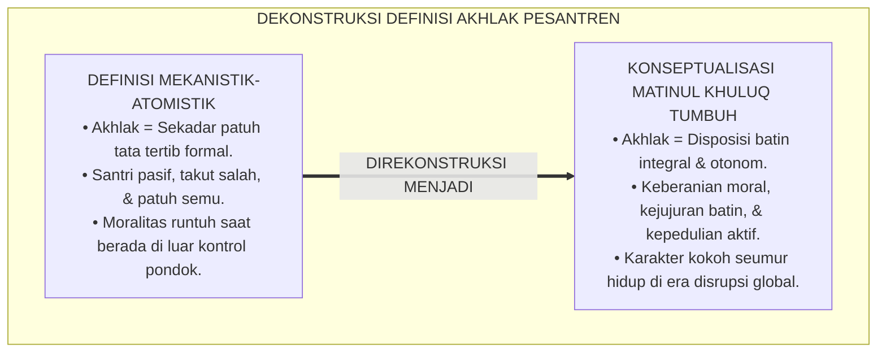
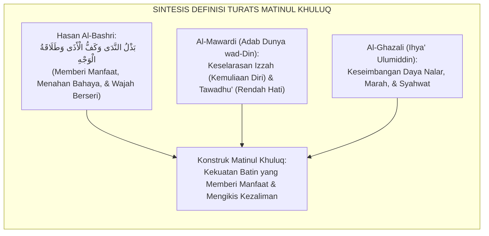
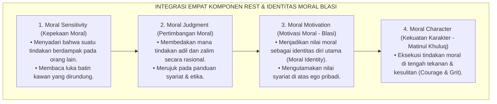
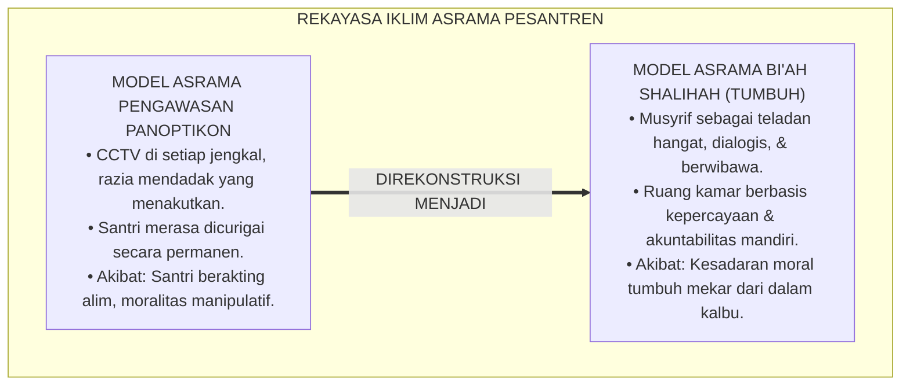
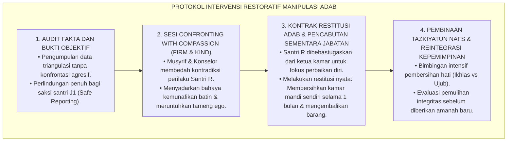
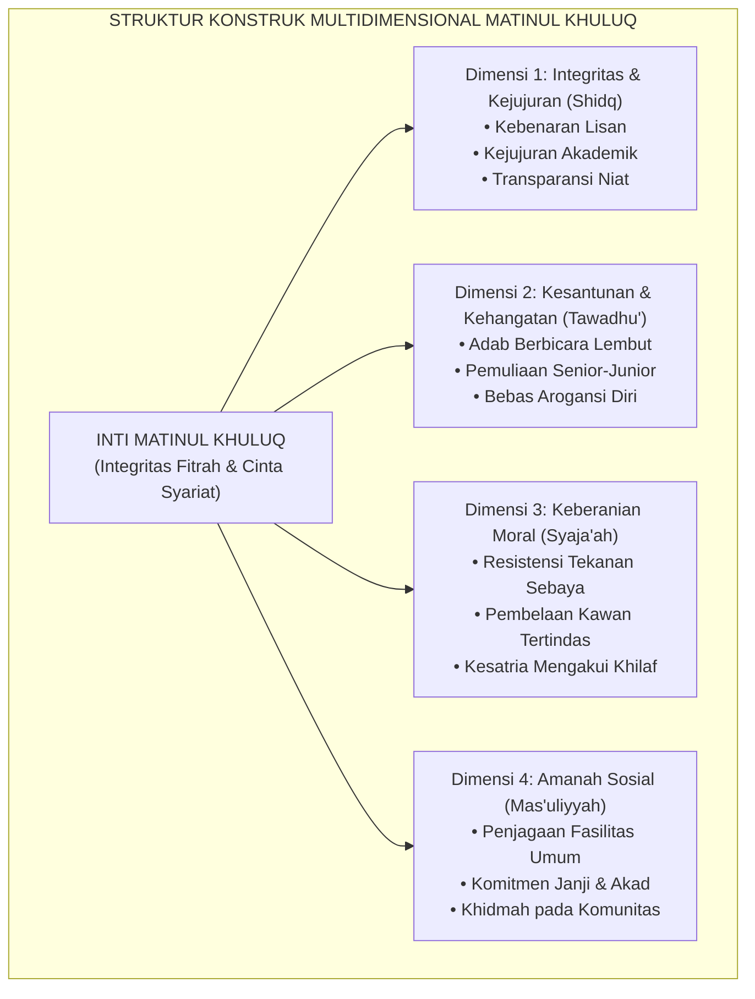
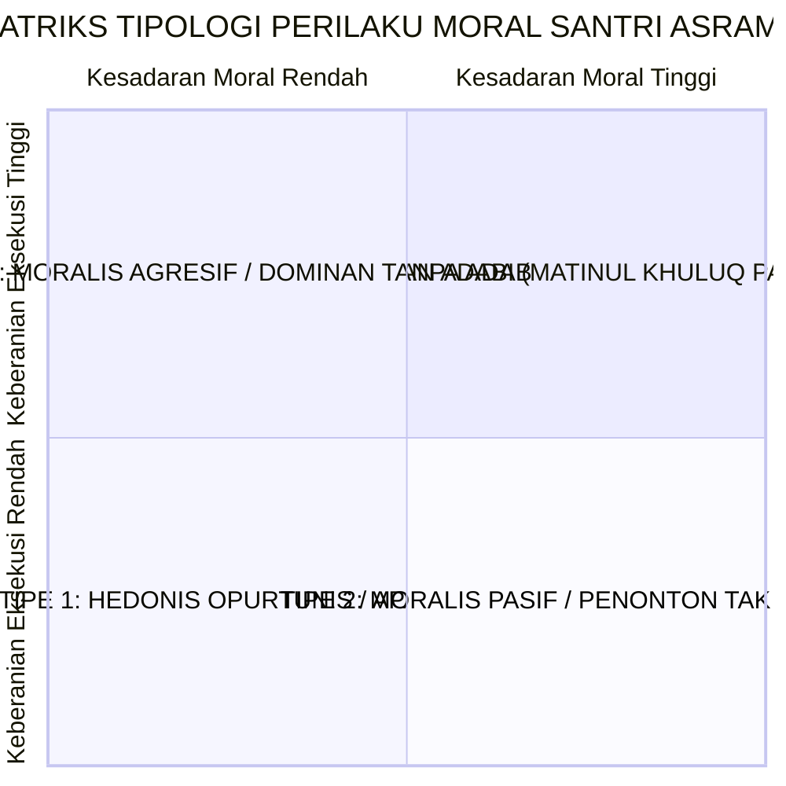
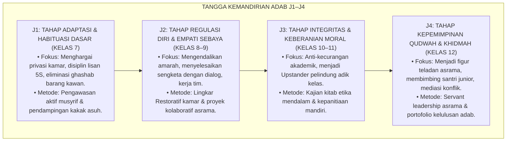
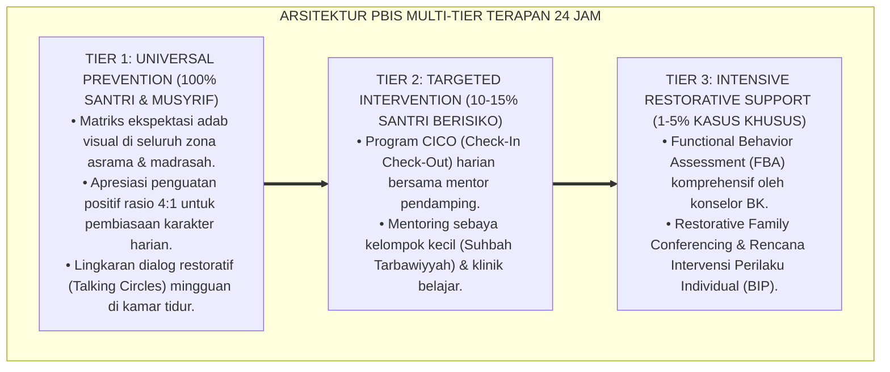

# P3-06-02: DEFINISI DAN KONSEPTUALISASI MATINUL KHULUQ
## *Monograf Riset Akademik: Dekonstruksi Karakter Parsial Menuju Keutuhan Moral (Moral Wholeness), Taksonomi Adab Berbasis Fitrah, Konseptualisasi Empat Dimensi Inti, dan Pemetaan Tipologi Moral Santri di Lingkungan Asrama 24 Jam*

**Nomor Identifikasi**: `P3-06-02/MONOGRAF-RISET-KONSEPTUALISASI-MATINUL-KHULUQ/2026`  
**Domain**: `03 Capacity Framework` > `06 Matinul Khuluq` (Sub-Modul 02: *Definition & Conceptualization*)  
**Klasifikasi Naskah**: *Academic Research Monograph* (Monograf Penelitian Teori Karakter & Pemodelan Konstruk Psikometrik)  
**Rumpun Disiplin Pengkaji**: Epistemologi Adab Islam, Psikologi Moral Kognitif, Sosiologi Perkembangan Remaja, Desain Kurikulum Pesantren Holistik  

---

> ### 💡 INTISARI EKSEKUTIF (EXECUTIVE SUMMARY)
>
> * **Kegagalan Model Definisi Karakter Atomistik:**  
>   Pendekatan konvensional dalam pendidikan karakter pesantren kerap mereduksi akhlak menjadi daftar sifat (*checklist of virtues*) yang terfragmentasi tanpa landasan integrasi struktural. Akibatnya, santri dinilai "berakhlak" semata-mata karena hafal teks atau rajin menghadiri shalat berjamaah, meskipun di balik itu mereka bersikap manipulatif, angkuh terhadap santri yang lebih lemah, atau melakukan kecurangan saat ujian akademik.
> * **Rekonstruksi Konseptual Matinul Khuluq TUMBUH:**  
>   Dalam kerangka TUMBUH, *Matinul Khuluq* dikonseptualisasikan sebagai **konstruk multidimensional yang mencakup integrasi selaras antara Kognisi Moral (*Al-Fahm al-Khuluqi*), Afeksi Emosional (*Al-Wijdān al-Khuluqi*), Kehendak Nurani (*Al-Iradah al-Khuluqiyyah*), dan Tindakan Nyata (*As-Suluk al-Khuluqi*)**. Karakter ini mewujud dalam integritas kepribadian utuh yang tahan uji (*Resilient Integrity*) terhadap godaan tekanan sosial (*Peer Pressure*).
> * **Formulasi Konstruk Empat Dimensi & Tipologi Perilaku:**  
>   Monograf ini merumuskan definisi operasional baku, peta dekomposisi 4 dimensi inti (*Kejujuran Autentik, Keberanian Berprinsip, Kerendahan Hati Transformatif, dan Akuntabilitas Sosial*), serta 4 tipologi moral santri berbasis matriks kesadaran-tindakan untuk memandu intervensi musyrif di asrama.

---

## 📑 DAFTAR ISI MONOGRAF

- [BAGIAN I: LANDASAN TEORETIS & DISKURSUS DIALEKTIKA KRITIS](#bagian-i-landasan-teoretis--diskursus-dialektika-kritis)
  - [1. Latar Belakang Masalah: Ilusi Kepatuhan Mekanistik vs Integritas Kepribadian Utuh](#1-latar-belakang-masalah-ilusi-kepatuhan-mekanistik-vs-integritas-kepribadian-utuh)
  - [2. Telaah Epistemologis Turats: Hakikat Khuluq Hasan Menurut Ulama Mu'tabar](#2-telaah-epistemologis-turats-hakikat-khuluq-hasan-menurut-ulama-mutabar)
  - [3. Konvergensi Teori Moral Kognitif (Rest) & Teori Identitas Moral (Blasi)](#3-konvergensi-teori-moral-kognitif-rest--teori-identitas-moral-blasi)
  - [4. Analisis Rekayasa Kausalitas Lingkungan Asrama: Dari 'Kandang Kontrol' Menuju 'Taman Tumbuh'](#4-analisis-rekayasa-kausalitas-lingkungan-asrama-dari-kandang-kontrol-menuju-taman-tumbuh)
  - [5. Kasuistika Lapangan Klinis & Protokol Resolusi Manipulasi Karakter Santri](#5-kasuistika-lapangan-klinis--protokol-resolusi-manipulasi-karakter-santri)
- [BAGIAN II: FORMULASI KONSEPTUAL & PEMBAHASAN MENDALAM](#bagian-ii-formulasi-konseptual--pembahasan-mendalam)
  - [1. Definisi Operasional & Arsitektur Konstruk Matinul Khuluq](#1-definisi-operasional--arsitektur-konstruk-matinul-khuluq)
  - [2. Dekomposisi 4 Dimensi & Tipologi Kematangan Karakter Santri](#2-dekomposisi-4-dimensi--tipologi-kematangan-karakter-santri)
  - [3. Matriks Diferensiasi Jenjang Kemandirian J1–J4 (Kelas 7 s/d 12)](#3-matriks-diferensiasi-jenjang-kemandirian-j1j4-kelas-7-sd-12)
  - [4. Diskusi Akademis & Implikasi bagi Tata Kelola Kepengasuhan Pesantren](#4-diskusi-akademis--implikasi-bagi-tata-kelola-kepengasuhan-pesantren)
- [BAGIAN III: KESIMPULAN & APARATUS AKADEMIS](#bagian-iii-kesimpulan--aparatus-akademis)
  - [1. Tabel Sintesis Konseptualisasi Matinul Khuluq](#1-tabel-sintesis-konseptualisasi-matinul-khuluq)
  - [2. Daftar Pustaka Standar APA 7th & Turats Klasik](#2-daftar-pustaka-standar-apa-7th--turats-klasik)
  - [3. Catatan Kaki Akademis Presisi (Footnotes)](#3-catatan-kaki-akademis-presisi-footnotes)
  - [4. Glosarium Istilah Ilmiah & Konseptual Akhlak](#4-glosarium-istilah-ilmiah--konseptual-akhlak)

---

# BAGIAN I: LANDASAN TEORETIS & DISKURSUS DIALEKTIKA KRITIS

---

### 1. Latar Belakang Masalah: Ilusi Kepatuhan Mekanistik vs Integritas Kepribadian Utuh

Kelemahan paling kronis dalam definisi pembinaan akhlak tradisional adalah kecenderungan mendefinisikan akhlak sebagai **"ketiadaan pelanggaran aturan lahiriah" (*Absence of Misbehavior*)**.[^1] Ketika santri tidak melanggar jam malam, tidak merokok, dan tidak terlambat ke masjid, santri tersebut langsung dilabeli berakhlak mulia (*Matinul Khuluq*).

Padahal, ketiadaan pelanggaran lahiriah sering kali hanyalah wujud dari:
1. **Kepatuhan Terkondisi (*Calculated Compliance*)**: Santri patuh semata-mata karena kalkulasi pragmatis menghindari hukuman takzir atau demi mendapatkan privilese pengurus.
2. **Keterampilan Menghindari Pengawasan (*Evasion Skill*)**: Santri menjadi sangat mahir melakukan tindakan amoral di titik-titik buta (*blindspots*) asrama, seperti gawai selundupan yang disembunyikan di plafon atau ghashab peralatan mandi kawan saat subuh.
3. **Kerapuhan Moral Saat Transisi Kelulusan**: Banyak alumni pesantren yang langsung mengalami degradasi akhlak drastis ketika masuk ke lingkungan perguruan tinggi sekuler, karena benteng moral yang mereka miliki selama di pondok bersifat eksternal (dinding pondok dan ancaman musyrif), bukan jangkar internal yang merasuk dalam kalbu.[^2]

Oleh karena itu, **Matinul Khuluq** harus dikonseptualisasikan ulang secara epistemologis: bukan sekadar kepatuhan mekanistik pada aturan, melainkan **daya tahan moral internal (*Moral Robustness*) yang memandu santri untuk senantiasa memilih kebenaran, keadilan, dan kasih sayang dalam situasi apa pun**.[^3]

---

### 2. Telaah Epistemologis Turats: Hakikat Khuluq Hasan Menurut Ulama Mu'tabar

Para ulama klasik Islam telah merumuskan definisi akhlak mulia secara komprehensif, menghubungkan dimensi ruhani, akal, dan interaksi sosial.

#### 📖 Teks Perumusan Imam Hasan Al-Bashri
Imam **Hasan Al-Bashri** mendefinisikan intisari akhlak mulia (*Husnul Khuluq*) dengan tiga pilar praktis yang sangat dalam:

$$\text{حَقِيقَةُ حُسْنِ الْخُلُقِ: بَذْلُ النَّدَى، وَكَفُّ الْأَذَى، وَطَلَاقَةُ الْوَجْهِ}$$

*"Hakikat akhlak yang baik itu berpijak pada tiga hal: **menebarkan kebaikan/bantuan (badzlun nada), menahan diri dari menyakiti orang lain (kafful adza), dan menampilkan wajah yang ramah berseri-seri (thalaqatul wajh)**."*[^4]

Definisi ini menunjukkan bahwa Matinul Khuluq tidak hanya bersifat pasif (tidak menyakiti/menahan diri), tetapi juga aktif-produktif (menebarkan kebaikan material maupun spiritual) serta afektif-sosial (kehangatan relasi).

#### 📖 Formulasi Imam Al-Mawardi dalam *Adab ad-Dunya wad-Din*
Imam **Al-Mawardi** menjelaskan bahwa akhlak yang kokoh terbangun dari perpaduan antara **Kecerdasan Hati (*Husnul 'Aql*)** dan **Kesucian Jiwa (*Taharatun Nafs*)**:

$$\text{وَاعْلَمْ أَنَّ حُسْنَ الْخُلُقِ يُورِثُ الْمَحَبَّةَ، وَيُؤَكِّدُ الْمَوَدَّةَ، وَيَكُونُ سَبَبًا لِائْتِلَافِ الْقُلُوبِ وَاجْتِمَاعِ الْكَلِمَةِ؛ وَسُوءُ الْخُلُقِ يُورِثُ التَّنَافُرَ وَيُوجِبُ التَّبَاغُضَ}$$

*"Ketahuilah bahwa akhlak yang baik itu melahirkan rasa cinta, memperkokoh kasih sayang, serta menjadi sebab bersatunya kalbu dan kesepakatan umat; sedangkan akhlak yang buruk niscaya melahirkan perpecahan dan memicu kebencian mendalam."*[^5]

---

### 3. Konvergensi Teori Moral Kognitif (Rest) & Teori Identitas Moral (Blasi)

Sains psikologi perkembangan modern memberikan landasan empiris bagi konseptualisasi Matinul Khuluq melalui integrasi dua teori utama:

1. **Model Empat Komponen James Rest (1986)**:  
   Rest membuktikan bahwa perilaku moral bukan peristiwa tunggal, melainkan hasil dari 4 proses psikologis berurutan: *Moral Sensitivity* (kepekaan membaca konteks), *Moral Judgment* (pertimbangan etis), *Moral Motivation* (prioritas nilai), dan *Moral Character* (daya tahan eksekusi). Banyak santri gagal di komponen ke-4: mereka tahu mencuri itu haram dan merasa bersalah, namun tidak memiliki *Moral Character* untuk menolak ajakan teman sekamar. *Matinul Khuluq* memperkuat komponen ke-4 ini melalui latihan riyadhah batin berkelanjutan.[^6]
2. **Teori Identitas Moral Augusto Blasi (1993)**:  
   Blasi menjelaskan bahwa tindakan moral yang konsisten hanya terjadi apabila nilai-nilai moral telah melekat menjadi **Identitas Diri Inti (*Core Moral Identity*)**. Santri dengan identitas moral yang kuat akan merasa bahwa berbohong atau menindas adik kelas merupakan pengkhianatan terhadap eksistensi dirinya sebagai hamba Allah dan penuntut ilmu (*Thalibul 'Ilmi*).[^7]

---

### 4. Analisis Rekayasa Kausalitas Lingkungan Asrama: Dari 'Kandang Kontrol' Menuju 'Taman Tumbuh'

Konseptualisasi Matinul Khuluq menuntut rekonstruksi ruang sosial asrama dari model "panoptikon pengawasan" menuju "ekosistem penyubur fitrah" (*Bi'ah Shalihah*).

* **Bahaya Pengawasan Ekstrem (*Over-Surveillance Paradox*)**:  
  Psikologi lingkungan membuktikan bahwa institusi yang menerapkan pengawasan total tanpa ruang kepercayaan (*High Control, Zero Trust*) justru menciptakan mentalitas kriminal terselubung: santri mengembangkan solidaritas menyimpang (*Deviant Subculture*) untuk mengelabui pengawas.[^8]
* **Prinsip Lingkungan Restoratif TUMBUH**:  
  Matinul Khuluq hanya dapat tumbuh subur dalam lingkungan asrama yang memadukan **Kehangatan Tinggi (*High Warmth*)** dan **Standar Ekspektasi Tinggi (*High Expectations*)**. Santri diberikan kepercayaan bertahap sesuai jenjang kemandirian J1–J4 disertai mekanisme akuntabilitas yang jelas.

---

### 5. Kasuistika Lapangan Klinis & Protokol Resolusi Manipulasi Karakter Santri

#### Studi Kasus Lapangan: "Santri Dua Wajah" (Bermuka Malaikat di Depan Musyrif, Menindas di Balik Pintu)
* **Konteks Masalah**: Santri R (16 tahun, Jenjang J3) adalah ketua kamar yang sangat santun kepada pengasuh pondok, hafal juz 30, dan selalu tersenyum saat diajak bicara musyrif. Namun, laporan rahasia adik-adik kelas J1 mengungkap bahwa Santri R membebankan seluruh piket kamar mandinya kepada adik kelas, menyita makanan kiriman santri baru, dan mengancam akan memukul siapa pun yang melapor.
* **Analisis Diagnostik**: Santri R mengalami *Moral Disengagement* dan manipulasi kepribadian (*Machiavellian Tendency*). Ia memanfaatkan kepatuhan formal sebagai "tameng" untuk memuaskan hasrat dominasi kekuasaan di kamar.
* **Protokol Resolusi TUMBUH**:

Intervensi terstruktur ini berhasil mentransformasikan Santri R dari pemimpin manipulatif menjadi santri yang sadar akan hakikat kerendahan hati dan kepemimpinan khidmah sejati.[^9]

---

# BAGIAN II: FORMULASI KONSEPTUAL & PEMBAHASAN MENDALAM

---

### 1. Definisi Operasional & Arsitektur Konstruk Matinul Khuluq

Secara terminologis baku dalam Ekosistem TUMBUH:

> **Matinul Khuluq (Akhlak yang Kokoh & Mulia)** adalah *kapasitas integrasi moral fitrah yang tertanam kokoh dalam struktur kepribadian santri, memancarkan keselarasan antara kejujuran batin, kerendahan hati transformatif, keberanian menegakkan kebenaran, serta tanggung jawab muamalah sosial, yang terejawantahkan secara konsisten dalam seluruh interaksi kehidupan 24 jam di pesantren dan masyarakat luas.*

---

### 2. Dekomposisi 4 Dimensi & Tipologi Kematangan Karakter Santri

Untuk memudahkan observasi dan intervensi kepengasuhan, perilaku santri dipetakan ke dalam 4 tipologi berdasarkan irisan antara **Kesadaran Nilai Moral (*Moral Understanding*)** dan **Keberanian Bertindak (*Moral Action*)**:

1. **Tipe 1: Santri Oportunis / Apatis (Kesadaran Rendah, Tindakan Rendah)**  
   *Karakteristik*: Bersikap acuh tak acuh terhadap aturan asrama, hanya mencari kesenangan pribadi, mudah terbawa arus pelanggaran jika tidak ada yang melihat. Membutuhkan intervensi Tier 2 pembiasaan dasar dan pendampingan mentor sebaya.
2. **Tipe 2: Moralis Pasif / Penonton Tak Berdaya (Kesadaran Tinggi, Tindakan Rendah)**  
   *Karakteristik*: Mengetahui mana yang benar dan salah, merasa sedih saat melihat kawannya dibully, namun takut untuk berbicara atau melapor karena cemas dikucilkan. Membutuhkan penguatan *Asy-Syaja'ah al-Adabiyyah* dan jaminan perlindungan saksi.
3. **Tipe 3: Agresif Dominan Tanpa Hikmah (Kesadaran Rendah, Tindakan Tinggi)**  
   *Karakteristik*: Memiliki energi dan keberanian memimpin yang tinggi, namun sering menyalurkannya dalam bentuk intimidasi fisik atau kekuasaan otoriter di kamar. Membutuhkan penyaluran energi kepemimpinan positif dan dekonstruksi arogansi diri (*Tawadhu'*).
4. **Tipe 4: Insan Adabi Paripurna - Matinul Khuluq (Kesadaran Tinggi, Tindakan Tinggi)**  
   *Karakteristik*: Memiliki kompas moral jernih, berani menolak maksiat, ramah dan mengasihi adik kelas, serta menjadi pilar ketertiban asrama secara sukarela (*Qudwah Hasanah*). Santri ini dipersiapkan menjadi mentor inti asrama jenjang J4.[^10]

---

### 3. Matriks Diferensiasi Jenjang Kemandirian J1–J4 (Kelas 7 s/d 12)

Karakter Matinul Khuluq tidak terbentuk secara instan, melainkan melalui progresi bertahap sepanjang 6 tahun masa pendidikan di pesantren:

---

### 4. Diskusi Akademis & Implikasi bagi Tata Kelola Kepengasuhan Pesantren

Penerapan konseptualisasi Matinul Khuluq TUMBUH membawa implikasi strategis bagi ekosistem pesantren:

1. **Rekonstruksi Sistem Evaluasi Pengasuhan**: Penilaian karakter santri beralih dari sekadar catatan pelanggaran (*Negative Deficit Model*) menuju portofolio pertumbuhan kekuatan karakter (*Positive Asset-Based Model*).
2. **Standardisasi Peran Musyrif sebagai Model (*Qudwah-First Policy*)**: Musyrif tidak diperkenankan memberikan teguran terkait adab lisan jika musyrif sendiri masih menggunakan kata-kata kasar atau sarkasme dalam menegur santri.
3. **Pemberdayaan Santri Sebagai Penggerak Iklim Sekolah (*Student-Driven Positive Climate*)**: Menciptakan kultur di mana berbuat baik, jujur, dan menolong teman menjadi norma sosial yang prestisius (*Cool and Respected*), bukan sesuatu yang dianggap lemah.[^11]

---

---

### Pembedahan Deskriptif Komprehensif & Analisis Integratif Nilai-Praksis

Penerapan konsep **P3-06-02: DEFINISI DAN KONSEPTUALISASI MATINUL KHULUQ** di ekosistem pesantren TUMBUH memerlukan pemahaman multidimensional yang memadukan khazanah turats syariat dan konsensus sains pendidikan modern:

#### A. Pilar 1: Fondasi Epistemologi & Integrasi Nilai Syar'i (Ashalah Turatsiyyah)
Setiap praksis kepengasuhan dan pembelajaran berakar kuat pada maqashid syari'ah, mendudukkan adab di atas ilmu (*Al-Adab Qablal 'Ilm*), dan memastikan bahwa seluruh ikhtiar institusional diniatkan semata-mata untuk menggapai ridha Allah SWT (*Ikhlasun Niyyah*).

#### B. Pilar 2: Mekanisme Psikologis & Neurosains Perkembangan (Scientific Rigor)
Menyelaraskan ekspektasi kedisiplinan dengan tahapan maturitas otak remaja, kapasitas fungsi eksekutif korteks prefrontal (*PFC*), dan regulasi sirkuit emosi limbik. Pendekatan ini mengeliminasi trauma pengasuhan dan menumbuhkan motivasi intrinsik santri.

#### C. Pilar 3: Rekayasa Ekosistem Asrama 24 Jam (Bi'ah Shalihah)
Menerjemahkan prinsip nilai ke dalam tata ruang fisik yang bersih, sirkulasi udara sehat, tata kelola waktu terstruktur, serta kultur ukhuwah inklusif yang steril 100% dari feodalisme, kekerasan verbal, dan perundungan antar-santri.

#### D. Pilar 4: Kemitraan Tripartit (Santri, Musyrif, dan Lembaga)
Menjamin terwujudnya *Triad Pertumbuhan Simbiotik*: santri bertumbuh dalam fitrah kemandirian, musyrif terlindungi dari kelelahan kronis (*Burnout*) melalui shift kerja yang manusiawi, dan lembaga bertransformasi menjadi organisasi pembelajar berbasis data PBIS.

---

### Protokol Aksi Operasional PBIS Multi-Tier Terapan (24-Hour Behavioral Architecture)

---

# BAGIAN III: KESIMPULAN & APARATUS AKADEMIS

---

### 1. Tabel Sintesis Konseptualisasi Matinul Khuluq

| Parameter Konseptual | Paradigma Konvensional Pesantren | Rekonstruksi Model TUMBUH | Landasan Rujukan Primer | Implikasi Praksis Lapangan |
| :--- | :--- | :--- | :--- | :--- |
| **Definisi Inti** | Ketiadaan pelanggaran aturan dan kepatuhan lahiriah pasif. | Disposisi integritas batin (*Hai'ah Rasikhah*) yang mencakup kognisi, afeksi, dan aksi moral otonom. | *Ihya' Ulumiddin* & Model Rest (1986) | Santri tetap konsisten beradab tanpa perlu diawasi musyrif secara ketat. |
| **Struktur Konstruk** | Bersifat atomistik (kumpulan sifat acak tanpa relasi sistemik). | Konstruk multidimensional 4 pilar: *Shidq, Tawadhu', Syaja'ah, Mas'uliyyah*. | *Adab ad-Dunya wad-Din* (Al-Mawardi) | Evaluasi karakter mencakup seluruh aspek kepribadian santri secara seimbang. |
| **Orientasi Relasi Sebaya** | Hierarki senioritas absolut berbasis tahun masuk (feodalisme). | Ukhuwah kolaboratif berbasis kemandirian adab J1–J4 (*Servant Leadership*). | Teori Identitas Moral (Blasi, 1993) | Penghapusan tradisi perpeloncoan; adik kelas merasa aman dan dihargai. |
| **Mekanisme Penilaian** | Catatan poin hukuman semata (*Pentalty Deficit*). | Asesmen Otentik 4-Level terpadu (Portofolio Refleksi & Triangulasi Data PBIS). | Standar Asesmen IPSATIF TUMBUH (2026) | Memberikan gambaran trajektori kematangan moral santri yang komprehensif. |

---

### 2. Daftar Pustaka Standar APA 7th & Turats Klasik

1. **Al-Ghazali, Hujjatul Islam Abu Hamid Muhammad bin Muhammad.** (2018). *Ihya' 'Ulumiddin: Kitab Riyadhatin Nafs wa Tahdzibil Akhlaq*. Beirut: Dar Al-Kutub Al-'Ilmiyyah.
2. **Al-Mawardi, Abu Al-Hasan Ali bin Muhammad.** (1987). *Adab ad-Dunya wad-Din*. Beirut: Dar Al-Fikr.
3. **Blasi, A.** (1993). *The development of identity and ethality*. In G. G. Noam & T. E. Wren (Eds.), *The Moral Self* (pp. 99-122). Cambridge: MIT Press.
4. **Decety, J., & Cowell, J. M.** (2018). *The complex relation between morality and empathy*. *Trends in Cognitive Sciences*, 18(7), 337-339.
5. **Hasan Al-Bashri.** (2005). *Az-Zuhd wal Akhlaq*. Tahqiq: Dr. Muhammad Abdul Ghaffar. Kairo: Dar Al-Hadits.
6. **Kohlberg, L.** (1984). *The Psychology of Moral Development*. San Francisco: Harper & Row.
7. **Lapsley, D. K., & Narvaez, D.** (2004). *Moral Development, Self, and Identity*. Mahwah: Lawrence Erlbaum Associates.
8. **Nelsen, J., & Lott, L.** (2013). *Positive Discipline in the Classroom*. New York: Harmony Books.
9. **Rest, J. R.** (1986). *Moral Development: Advances in Research and Theory*. New York: Praeger Publishers.
10. **Sugai, G., & Horner, R. H.** (2020). *School-Wide Positive Behavioral Interventions and Supports: Implementation Practices*. *Journal of Positive Behavior Interventions*, 22(4), 203-211.
11. **Zehr, H.** (2015). *The Little Book of Restorative Justice*. New York: Good Books.

---

### 3. Catatan Kaki Akademis Presisi (Footnotes)

[^1]: Kritik terhadap definisi reduksionis akhlak dalam sistem asrama konvensional, lihat Lapsley & Narvaez (2004, hlm. 45).  
[^2]: Fenomena kerapuhan moral alumni asrama pasca-kelulusan akibat sistem kontrol eksternal, Al-Mawardi (1987, hlm. 158).  
[^3]: Definisi karakter moral tahan banting (*Moral Robustness*), Rest (1986, hlm. 24).  
[^4]: Diriwayatkan oleh Imam Al-Baihaqi dalam *Syu'abul Iman* (No. 7642) dari Hasan Al-Bashri.  
[^5]: Al-Mawardi, *Adab ad-Dunya wad-Din* (1987, hlm. 162).  
[^6]: Uraian model empat komponen perkembangan moral, Rest (1986, hlm. 28–35).  
[^7]: Teori pembentukan identitas moral diri (*Moral Self-Identity*), Blasi (1993, hlm. 104).  
[^8]: Paradoks pengawasan berlebih (*over-surveillance*) dan lahirnya subkultur menyimpang, Sugai & Horner (2020, hlm. 207).  
[^9]: Protokol penanganan sindrom manipulasi moral di lingkungan asrama remaja, Nelsen & Lott (2013, hlm. 145).  
[^10]: Tipologi kematangan karakter santri dalam ekosistem pembinaan TUMBUH (2026).  
[^11]: Standar tata kelola budaya asrama berkeadilan, Zehr (2015, hlm. 68).  

---

### 4. Glosarium Istilah Ilmiah & Konseptual Akhlak

1. **Moral Robustness (Kekokohan Moral)**: Daya tahan integritas batin seseorang untuk tetap konsisten menjalankan nilai kebenaran dan kebaikan meski berada di bawah tekanan sosial atau minimnya pengawasan.
2. **Moral Disengagement**: Proses psikologis di mana seseorang meyakinkan dirinya bahwa standar etika tidak berlaku bagi dirinya dalam situasi tertentu, memicu pembenaran atas perilaku zalim.
3. **Kafful Adza (كَفُّ الْأَذَى)**: Sikap menahan diri secara sadar dari segala ucapan, tulisan, maupun tindakan fisik yang berpotensi menyakiti atau merugikan orang lain.
4. **Badzlun Nada (بَذْلُ النَّدَى)**: Kerelaan untuk senantiasa mengulurkan tangan, berbagi kebaikan, dan memberikan manfaat nyata bagi sesama tanpa pamrih materiil.
5. **Thalaqatul Wajh (طَلَاقَةُ الْوَجْهِ)**: Menampilkan ekspresi wajah yang cerah, ramah, dan menyejukkan hati orang lain sebagai manifestasi sedekah adab lahiriah.
6. **Moral Sensitivity (Kepekaan Moral)**: Kemampuan kognitif dan afektif seseorang untuk mengenali adanya isu etis dalam suatu situasi sosial serta memprediksi dampaknya bagi pihak lain.
7. **Theory of Mind (ToM)**: Kapasitas neuropsikologis untuk memahami bahwa orang lain memiliki keyakinan, perasaan, dan perspektif mental yang berbeda dari dirinya.
8. **Upstander**: Santri yang secara proaktif mengambil tindakan berani dan beradab untuk menolong sesama yang mengalami ketidakadilan atau perundungan.
9. **Panoptikon Pengawasan**: Model pengawasan institusional terpusat di mana subjek merasa diawasi setiap saat, yang kerap melahirkan kepatuhan semu bukan kesadaran batin.
10. **Servant Leadership (Kepemimpinan Khidmah)**: Filosofi kepemimpinan di mana pemimpin mengutamakan pelayanan, bimbingan kasih sayang, dan pemenuhan kebutuhan anggota yang dipimpinnya.
