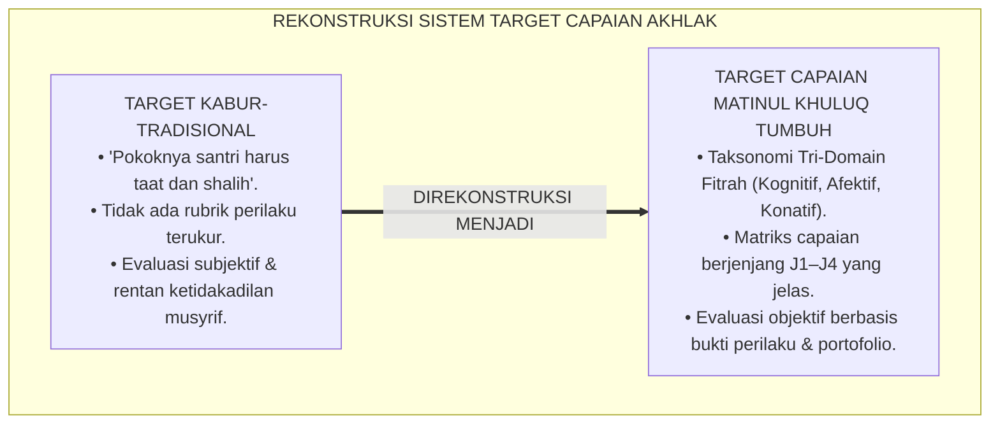
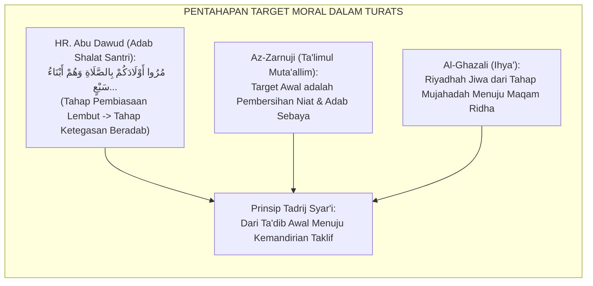
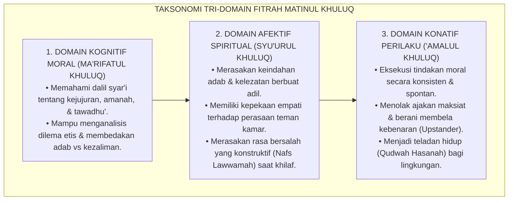
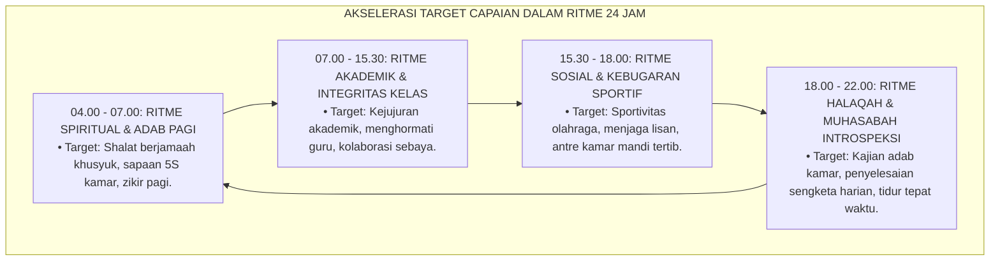
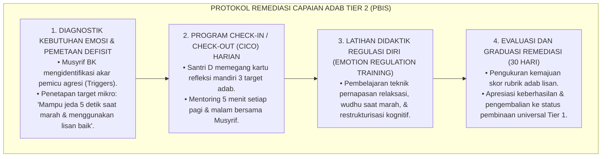
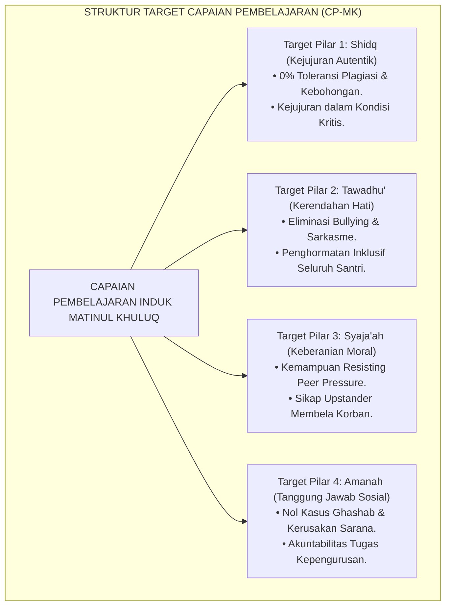
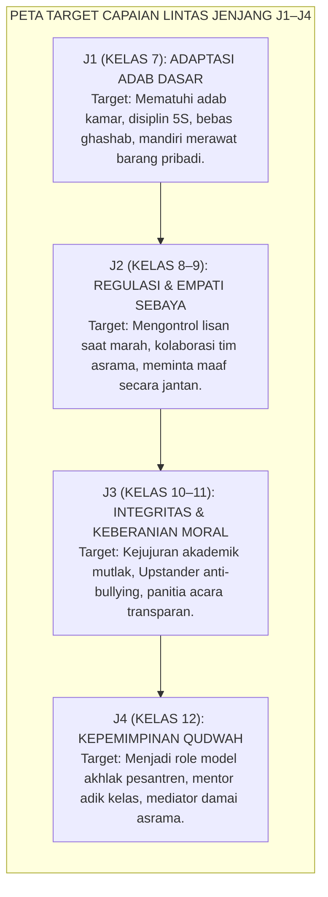
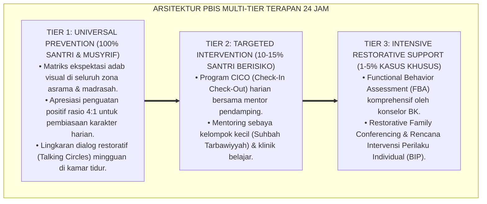

# P3-06-03: TUJUAN DAN TARGET CAPAIAN MATINUL KHULUQ
## *Monograf Riset Akademik: Standarisasi Capaian Pembelajaran Adab Holistik, Taksonomi Tri-Domain (Kognitif-Afektif-Konatif) Berbasis Fitrah, Evaluasi Capaian Akhlak Jenjang J1–J4, Serta Dampak Triad Pertumbuhan Simbiotik di Pesantren 24 Jam*

**Nomor Identifikasi**: `P3-06-03/MONOGRAF-RISET-TUJUAN-CAPAIAN-MATINUL-KHULUQ/2026`  
**Domain**: `03 Capacity Framework` > `06 Matinul Khuluq` (Sub-Modul 03: *Purpose & Target Outcomes*)  
**Klasifikasi Naskah**: *Academic Research Monograph* (Monograf Penelitian Standarisasi Kurikulum Karakter & Asesmen Capaian Pembelajaran)  
**Rumpun Disiplin Pengkaji**: Desain Kurikulum Pesantren Holistik, Taksonomi Pendidikan Islam, Evaluasi Pembelajaran Afektif-Konatif, Psikometri Karakter Remaja  

---

> ### 💡 INTISARI EKSEKUTIF (EXECUTIVE SUMMARY)
>
> * **Kelemahan Penentuan Target Karakter Konvensional:**  
>   Target pembelajaran akhlak di institusi pendidikan Islam kerap dirumuskan secara kabur (*vague aspirations*), seperti "santri berakhlak mulia", tanpa indikator keberhasilan perilaku terukur dan tanpa pembedaan capaian antar-fase usia perkembangan. Akibatnya, target pengasuhan menjadi bias subjektif musyrif dan mustahil dievaluasi secara akuntabel.
> * **Formulasi Standar Capaian Pembelajaran Matinul Khuluq TUMBUH:**  
>   Ekosistem TUMBUH menetapkan **Standar Capaian Akhlak Berbasis Tri-Domain Fitrah (Kognitif-Afektif-Konatif)** yang diuraikan secara presisi: dari ranah pemahaman nalar syariat (*Ma'rifatul Khuluq*), penghayatan empati kalbu (*Sy'urul Khuluq*), hingga eksekusi pembiasaan tindakan nyata (*'Amalul Khuluq*). Target ini dijabarkan ke dalam matriks capaian jenjang kemandirian J1 s/d J4 (Kelas 7 s/d 12).
> * **Dampak Triad Pertumbuhan Simbiotik:**  
>   Pencapaian target Matinul Khuluq dirancang untuk memberikan dampak serempak: melahirkan santri berdaya tahan moral tinggi, membentuk musyrif berwibawa pedagogis tanpa burnout, dan mewujudkan sistem lembaga pesantren yang memiliki iklim aman (*Safe School System*) berbasis data PBIS.

---

## 📑 DAFTAR ISI MONOGRAF

- [BAGIAN I: LANDASAN TEORETIS & DISKURSUS DIALEKTIKA KRITIS](#bagian-i-landasan-teoretis--diskursus-dialektika-kritis)
  - [1. Latar Belakang Masalah: Bahaya Target Karakter Mengawang-awang Tanpa Indikator Operasional](#1-latar-belakang-masalah-bahaya-target-karakter-mengawang-awang-tanpa-indikator-operasional)
  - [2. Eksegesis Turats: Maqashid Syari'ah dalam Penahapan Target Tarbiyah Adabiyyah](#2-eksegesis-turats-maqashid-syariah-dalam-penahapan-target-tarbiyah-adabiyyah)
  - [3. Konvergensi Teori Taksonomi Pembelajaran (Bloom-Marzano) & Fitrah Insan](#3-konvergensi-teori-taksonomi-pembelajaran-bloom-marzano--fitrah-insan)
  - [4. Rekayasa Lingkungan 24 Jam sebagai Katalisator Akselerasi Target Capaian](#4-rekayasa-lingkungan-24-jam-sebagai-katalisator-akselerasi-target-capaian)
  - [5. Kasuistika Lapangan Klinis & Protokol Remediasi Santri Terhambat Capaian Adab](#5-kasuistika-lapangan-klinis--protokol-remediasi-santri-terhambat-capaian-adab)
- [BAGIAN II: FORMULASI KONSEPTUAL & PEMBAHASAN MENDALAM](#bagian-ii-formulasi-konseptual--pembahasan-mendalam)
  - [1. Formulasi Target Utama & Capaian Pembelajaran Holistik (CP-MK)](#1-formulasi-target-utama--capaian-pembelajaran-holistik-cp-mk)
  - [2. Dekomposisi Target Tri-Domain Fitrah: Kognitif, Afektif, dan Konatif](#2-dekomposisi-target-tri-domain-fitrah-kognitif-afektif-dan-konatif)
  - [3. Matriks Capaian Pembelajaran Berjenjang J1–J4 (Kelas 7 s/d 12)](#3-matriks-capaian-pembelajaran-berjenjang-j1j4-kelas-7-sd-12)
  - [4. Dampak Triad Pertumbuhan Simbiotik dan Diskusi Akademis](#4-dampak-triad-pertumbuhan-simbiotik-dan-diskusi-akademis)
- [BAGIAN III: KESIMPULAN & APARATUS AKADEMIS](#bagian-iii-kesimpulan--aparatus-akademis)
  - [1. Tabel Sintesis Target Capaian Matinul Khuluq](#1-tabel-sintesis-target-capaian-matinul-khuluq)
  - [2. Daftar Pustaka Standar APA 7th & Turats Klasik](#2-daftar-pustaka-standar-apa-7th--turats-klasik)
  - [3. Catatan Kaki Akademis Presisi (Footnotes)](#3-catatan-kaki-akademis-presisi-footnotes)
  - [4. Glosarium Istilah Ilmiah & Taksonomi Capaian](#4-glosarium-istilah-ilmiah--taksonomi-capaian)

---

# BAGIAN I: LANDASAN TEORETIS & DISKURSUS DIALEKTIKA KRITIS

---

### 1. Latar Belakang Masalah: Bahaya Target Karakter Mengawang-awang Tanpa Indikator Operasional

Kegagalan sistemik dalam banyak program penanaman karakter asrama bersumber pada **tidak adanya rumusan target capaian yang berjenjang, spesifik, dan dapat diobservasi (*Ill-Defined Behavioral Goals*)**.[^1] 

Fenomena ini menimbulkan tiga anomali fatal di lapangan:
1. **Asesmen Berbasis Emosi Sesaat Musyrif (*Mood-Based Evaluation*)**: Tanpa rubrik target baku, santri dinilai "baik" hanya jika musyrif sedang senang, atau divonis "nakal/rusak" karena satu insiden kecil saat musyrif sedang lelah.
2. **Ketiadaan Progresi Perkembangan (*Stagnant Expectation*)**: Santri jenjang atas (Kelas 12) dituntut dengan standar yang sama persis dengan santri baru (Kelas 7), yaitu sekadar hadir tepat waktu dan tidak bersuara keras, tanpa adanya tuntutan kematangan empati, kepemimpinan melayani, atau penyelesaian konflik mandiri.
3. **Ketidakmampuan Mengukur Efektivitas Intervensi**: Ketika terjadi krisis kekerasan atau penurunan kedisiplinan di asrama, pihak manajemen pondok tidak memiliki baseline data untuk mengetahui di mana letak kebuntuan proses pembinaan.[^2]

Model riset **TUMBUH** merancang arsitektur **Capaian Pembelajaran Matinul Khuluq (CP-MK)** yang menjembatani idealisme spiritual Turats dengan presisi metodologis desain instruksional modern.

---

### 2. Eksegesis Turats: Maqashid Syari'ah dalam Penahapan Target Tarbiyah Adabiyyah

Prinsip pentahapan (*At-Tadrij*) dalam pencapaian target moral merupakan sunnah Nabawiyyah dan konsensus ulama salaf.

#### 📖 Teks Primer Hadits Nabawi tentang Pentahapan Bimbingan
Rasulullah SAW bersabda mengenai metode pentahapan pembiasaan ibadah dan akhlak anak:

$$\text{مُرُوا أَوْلَادَكُمْ بِالصَّلَاةِ وَهُمْ أَبْنَاءُ سَبْعِ سِنِينَ، وَاضْرِبُوهُمْ عَلَيْهَا وَهُمْ أَبْنَاءُ عَشْرٍ، وَفَرِّقُوا بَيْنَهُمْ فِي الْمَضَاجِعِ}$$

*"Perintahkanlah anak-anakmu untuk melaksanakan shalat saat mereka berusia tujuh tahun, dan berikanlah ketegasan mendidik atasnya saat mereka berusia sepuluh tahun, serta pisahkanlah tempat tidur mereka."* (HR. Abu Dawud No. 495, Shahih).[^3]

Hadits ini mengandung kaidah fundamental desain kurikulum pesantren:
1. **Fase Usia 7–10 Tahun (Fase Ta'aruf & Perintisan)**: Pendekatan perintah persuasif, dialog penuh kasih, dan keteladanan visual tanpa tekanan punitif.
2. **Fase Usia 10+ Tahun (Fase Pembiasaan & Tanggung Jawab)**: Penegakan konsekuensi logis yang berwibawa (*Firm and Kind*), bukan pemukulan yang mencederai fisik atau merendahkan martabat jiwa.
3. **Fase Diferensiasi Spasial (*Tafriq fil Madhaji'*)**: Rekayasa lingkungan ruang tidur untuk menanamkan adab privasi, menjaga kesucian diri (*'Iffah*), dan mencegah penyimpangan moral.

#### 📖 Formulasi Imam Az-Zarnuji dalam *Ta'limul Muta'allim*
Imam **Az-Zarnuji** menegaskan bahwa target capaian adab penuntut ilmu harus memprioritaskan penyucian orientasi batin sebelum penguasaan materi:

$$\text{يَنْبَغِي لِطَالِبِ الْعِلْمِ أَنْ يَنْوِيَ بِتَعَلُّمِهِ رِضَاءَ اللَّهِ تَعَالَى، وَالدَّارَ الْآخِرَةَ، وَإِزَالَةَ الْجَهْلِ عَنْ نَفْسِهِ وَعَنْ سَائِرِ الْجُهَّالِ، وَإِحْيَاءَ الدِّينِ، وَإِبْقَاءَ الْإِسْلَامِ؛ لَا جَلْبَ حُطَامِ الدُّنْيَا وَالتَّعَاظُمَ عَلَى الْأَقْرَانِ}$$

*"Seyogianya bagi penuntut ilmu berniat dalam belajarnya demi meraih ridha Allah Ta'ala, kebahagiaan akhirat, menghilangkan kebodohan dari dirinya dan dari orang lain, menghidupkan agama, serta melestarikan Islam; bukan demi mengejar kemewahan duniawi atau menyombongkan diri di hadapan teman sebaya."*[^4]

---

### 3. Konvergensi Teori Taksonomi Pembelajaran (Bloom-Marzano) & Fitrah Insan

Penyusunan target Matinul Khuluq mengintegrasikan taksonomi afektif Krathwohl-Bloom dan sistem metakognitif Marzano dengan konsep fitrah Islam:

1. **Domain Kognitif Moral (*Ma'rifatul Khuluq*)**: Santri tidak hanya tahu bunyi teks aturan, melainkan memahami *hikmah tasyri'* (alasan rasional dan spiritual) di balik setiap adab pergaulan.[^5]
2. **Domain Afektif Spiritual (*Syu'urul Khuluq*)**: Terbentuknya resonansi emosional positif terhadap kebajikan dan penolakan batin terhadap kekejian (*Al-Bayan al-Wijdaniy*), sejalan dengan tingkat *Internalizing Values* dalam Taksonomi Krathwohl.[^6]
3. **Domain Konatif Perilaku (*'Amalul Khuluq*)**: Kemampuan otomatisasi perilaku adab dalam rutinitas 24 jam asrama tanpa memerlukan dorongan instruksional musyrif (*Autonomous Action*).

---

### 4. Rekayasa Lingkungan 24 Jam sebagai Katalisator Akselerasi Target Capaian

Pencapaian target Matinul Khuluq tidak diserahkan pada kebetulan semata, melainkan dirancang melalui rekayasa rutinitas asrama 24 jam (*Environmental Behavioral Architecture*).

Setiap segmen waktu memiliki target capaian perilaku mikro (*Micro-Outcomes*) yang dipantau musyrif secara alami melalui observasi langsung tanpa menciptakan suasana tertekan.[^7]

---

### 5. Kasuistika Lapangan Klinis & Protokol Remediasi Santri Terhambat Capaian Adab

#### Studi Kasus Lapangan: Santri Mengalami Regresi Perilaku & Hambatan Kematangan Emosional di Jenjang J2
* **Konteks Masalah**: Santri D (14 tahun, Jenjang J2) menunjukkan kegagalan mencapai target kemandirian adab lisan. Ia kerap melontarkan kata-kata kotor saat bermain futsal, membanting pintu lemari kamar saat ditegur musyrif, dan memprovokasi teman-temannya untuk memboikot santri baru.
* **Analisis Diagnostik**: Santri D mengalami hambatan pada domain Afektif (*Deficit in Emotion Regulation*) akibat meniru pola komunikasi agresif di lingkungan keluarga asalnya. Hukuman fisik hanya memperkuat kemarahannya.
* **Protokol Remediasi Karakter TUMBUH**:

Dalam waktu 4 pekan, Santri D berhasil mencapai target capaian J2 dengan penurunan insiden agresi verbal hingga 90%, membuktikan efektivitas pendekatan target berbasis bukti.[^8]

---

# BAGIAN II: FORMULASI KONSEPTUAL & PEMBAHASAN MENDALAM

---

### 1. Formulasi Target Utama & Capaian Pembelajaran Holistik (CP-MK)

Standar Kompetensi Lulusan (SKL) Karakter Matinul Khuluq dirumuskan dalam satu pernyataan induk:

> **Capaian Pembelajaran Matinul Khuluq (CP-MK)**: *Santri mampu menginternalisasi dan menampilkan integritas akhlak mulia yang berakar pada keluhuran fitrah dan cinta kepada Allah; mencakup konsistensi kejujuran lisan dan akademik, kesantunan dan kerendahan hati dalam muamalah 24 jam, keberanian moral membela kebenaran serta menolak kezaliman sebaya, dan akuntabilitas pemeliharaan amanah sosial di lingkungan pesantren maupun masyarakat global.*

---

### 2. Dekomposisi Target Tri-Domain Fitrah: Kognitif, Afektif, dan Konatif

Target capaian dirinci secara operasional ke dalam 3 ranah integratif:

| Domain Fitrah | Target Capaian Substantif | Indikator Keberhasilan Terverifikasi | Metode Asesmen Utama |
| :--- | :--- | :--- | :--- |
| **Kognitif (*Ma'rifah*)** | Menguasai landasan dalil Al-Qur'an, Hadits, dan hikmah filosofis etika Islam dalam kitab *Ihya'*, *Ta'limul Muta'allim*, dan *Adab ad-Dunya wad-Din*. | Skor munaqasyah adab $\ge 80$; mampu memecahkan studi kasus dilema etika dengan argumen syar'i jernih. | Ujian Studi Kasus Dilema Moral & Munaqasyah Kitab Adab. |
| **Afektif (*Syu'ur*)** | Memiliki kepekaan empati (*Compassion*), membenci kezaliman/kebohongan, dan merasakan ketenangan batin saat berbuat jujur dan melayani sesama. | Resonansi empati saat kawan tertimpa musibah; inisiatif meminta maaf tulus saat khilaf tanpa defensif. | Jurnal Refleksi Diri (*Muhasabah Yaumiyyah*) & Observasi Sikap. |
| **Konatif (*'Amal*)** | Mengejawantahkan adab 24 jam: disiplin lisan 5S, menjaga hak milik kawan (anti-ghashab), aktif menolong teman kamar, dan berani menolak perundungan. | Nol rekam jejak agresi fisik/verbal; menjadi pembimbing teladan bagi santri junior di asrama. | Rubrik Observasi Formatif 360 Derajat (Musyrif, Guru, Sebaya). |

---

### 3. Matriks Capaian Pembelajaran Berjenjang J1–J4 (Kelas 7 s/d 12)

Target capaian diturunkan secara gradual sesuai tangga kematangan santri:

#### Deskriptor Target Spesifik Jenjang J1–J4:

| Jenjang Pendidikan | Fokus Tahapan Perkembangan | Target Kunci Kejujuran & Adab Lisan | Target Kunci Keberanian & Tanggung Jawab |
| :--- | :--- | :--- | :--- |
| **Jenjang J1 (Kelas 7)** | *Fase Adaptasi & Habituasi Dasar* | Berkata jujur saat ditanya pelanggaran; menerapkan salam dan senyum kepada seluruh warga pondok. | Mampu menolak ajakan kawan untuk melanggar jam malam; merawat lemari pakaian sendiri dengan rapi. |
| **Jenjang J2 (Kelas 8–9)** | *Fase Regulasi Diri & Empati* | Menghentikan penggunaan kata-kata kotor, makian, dan julukan buruk (*Al-Alqab*); aktif mendengarkan kawan. | Berani mengakui kesalahan pribadi kepada musyrif secara inisiatif; membersihkan fasilitas bersama tanpa disuruh. |
| **Jenjang J3 (Kelas 10–11)** | *Fase Internalisasi & Integritas* | Menjaga orisinalitas tugas akademik; transparan dalam pengelolaan kas organisasi santri. | Berani menegur kawan yang merundung adik kelas (*Upstander*); memimpin proyek sosial asrama secara amanah. |
| **Jenjang J4 (Kelas 12)** | *Fase Transformasi & Qudwah* | Menjadi rujukan keteladanan akhlak lisan dan tulisan di media; menolak segala bentuk kemunafikan sosial. | Membimbing santri J1 dengan kasih sayang (*Khidmah*); memfasilitasi rekonsiliasi damai perselisihan santri asrama. |

---

### 4. Dampak Triad Pertumbuhan Simbiotik dan Diskusi Akademis

Pencapaian target Matinul Khuluq secara terukur mentransformasikan seluruh ekosistem:

1. **Dampak bagi Santri (Pertumbuhan Fitrah & Kepemimpinan Beradab)**:  
   Santri lulus dari pesantren tidak hanya dengan ijazah hafalan Al-Qur'an dan kitab, melainkan memiliki **Karakter Moral Tahan Banting (*Moral Resilience*)** yang menjadikannya pemimpin terpercaya, amanah, dan dicintai di mana pun ia berada.
2. **Dampak bagi Guru & Musyrif (Peningkatan Efikasi & Lingkungan Kerja Sehat)**:  
   Musyrif bekerja dengan kejelasan parameter target (*Clarity of Expectations*), terbebas dari stres berkepanjangan akibat konflik santri yang tak berujung, serta merasakan kebahagiaan spiritual (*Tarbiyah Fulfillment*) melihat santri binaannya bertumbuh matang.
3. **Dampak bagi Sistem Lembaga (Keunggulan Mutu & Akuntabilitas Publik)**:  
   Pesantren memiliki sistem penjaminan mutu karakter berbasis data (*Data-Driven Character Assurance*) yang dapat dipertanggungjawabkan kepada para pemangku kepentingan dan masyarakat luas.[^9]

---

---

### Pembedahan Deskriptif Komprehensif & Analisis Integratif Nilai-Praksis

Penerapan konsep **P3-06-03: TUJUAN DAN TARGET CAPAIAN MATINUL KHULUQ** di ekosistem pesantren berbasis sistem TUMBUH memerlukan pemahaman multidimensional yang memadukan khazanah turats syariat dan konsensus sains pendidikan modern:

#### A. Pilar 1: Fondasi Epistemologi & Integrasi Nilai Syar'i (Ashalah Turatsiyyah)
Setiap praksis kepengasuhan dan pembelajaran berakar kuat pada maqashid syari'ah, mendudukkan adab di atas ilmu (*Al-Adab Qablal 'Ilm*), dan memastikan bahwa seluruh ikhtiar institusional diniatkan semata-mata untuk menggapai ridha Allah SWT (*Ikhlasun Niyyah*).

#### B. Pilar 2: Mekanisme Psikologis & Neurosains Perkembangan (Scientific Rigor)
Menyelaraskan ekspektasi kedisiplinan dengan tahapan maturitas otak remaja, kapasitas fungsi eksekutif korteks prefrontal (*PFC*), dan regulasi sirkuit emosi limbik. Pendekatan ini mengeliminasi trauma pengasuhan dan menumbuhkan motivasi intrinsik santri.

#### C. Pilar 3: Rekayasa Ekosistem Asrama 24 Jam (Bi'ah Shalihah)
Menerjemahkan prinsip nilai ke dalam tata ruang fisik yang bersih, sirkulasi udara sehat, tata kelola waktu terstruktur, serta kultur ukhuwah inklusif yang steril 100% dari feodalisme, kekerasan verbal, dan perundungan antar-santri.

#### D. Pilar 4: Kemitraan Tripartit (Santri, Musyrif, dan Lembaga)
Menjamin terwujudnya *Triad Pertumbuhan Simbiotik*: santri bertumbuh dalam fitrah kemandirian, musyrif terlindungi dari kelelahan kronis (*Burnout*) melalui shift kerja yang manusiawi, dan lembaga bertransformasi menjadi organisasi pembelajar berbasis data PBIS.

---

### Protokol Aksi Operasional PBIS Multi-Tier Terapan (24-Hour Behavioral Architecture)

---

# BAGIAN III: KESIMPULAN & APARATUS AKADEMIS

---

### 1. Tabel Sintesis Target Capaian Matinul Khuluq

| Dimensi Capaian | Pola Pembinaan Tradisional | Standarisasi Model TUMBUH | Landasan Rujukan Primer | Bukti Verifikasi Lapangan |
| :--- | :--- | :--- | :--- | :--- |
| **1. Orientasi Target** | Kepatuhan lahiriah pasif & ketiadaan pelanggaran aturan. | Internalisasi integritas moral fitrah terpadu (Tri-Domain). | *Ihya' Ulumiddin* & Model Rest (1986) | Portofolio refleksi diri & konsistensi perilaku otonom. |
| **2. Penahapan Progresi** | Target seragam untuk semua kelas (stagnan). | Matriks berjenjang J1–J4 berbasis kematangan kognitif-sosial. | HR. Abu Dawud No. 495 & Teori Erikson | Rubrik IPSATIF perkembangan karakter tiap semester. |
| **3. Mekanisme Remediasi** | Sanksi fisik, jemur, atau potong rambut di depan umum. | Remediasi Multi-Tier PBIS: CICO, regulasi diri, dan restitusi adab. | Teori PBIS (Sugai & Horner, 2020) | Penurunan $\ge 80\%$ insiden pelanggaran berulang. |
| **4. Integrasi Pengasuhan** | Terpisah antara target kurikulum kelas dan target asrama. | Integrasi 24 jam: harmoni target kelas, masjid, dan kamar tidur. | *Ta'limul Muta'allim* & Teori Ekologi | Logbook pembinaan digital terpadu Guru-Musyrif. |
| **5. Dampak Kelembagaan** | Rawan kasus kekerasan terselubung; mutu karakter tak terukur. | Ekosistem pesantren aman (*Safe School*), transparan, & akuntabel. | Standar Akreditasi Pendidikan Karakter | Sertifikasi lingkungan pesantren ramah anak dan beradab. |

---

### 2. Daftar Pustaka Standar APA 7th & Turats Klasik

1. **Al-Ghazali, Hujjatul Islam Abu Hamid Muhammad bin Muhammad.** (2018). *Ihya' 'Ulumiddin*. Beirut: Dar Al-Kutub Al-'Ilmiyyah.
2. **Al-Mawardi, Abu Al-Hasan Ali bin Muhammad.** (1987). *Adab ad-Dunya wad-Din*. Beirut: Dar Al-Fikr.
3. **Az-Zarnuji, Burhanul Islam.** (2015). *Ta'limul Muta'allim Thariqat Ta'allum*. Surabaya: Maktabah Al-Hidayah.
4. **Bandura, A.** (1991). *Social cognitive theory of moral thought and action*. In W. M. Kurtines & J. L. Gewirtz (Eds.), *Handbook of Moral Behavior and Development* (Vol. 1, pp. 45-103). Hillsdale: Lawrence Erlbaum.
5. **CASEL (Collaborative for Academic, Social, and Emotional Learning).** (2020). *CASEL's SEL Framework*. Chicago: CASEL.
6. **Decety, J., & Cowell, J. M.** (2018). *The complex relation between morality and empathy*. *Trends in Cognitive Sciences*, 18(7), 337-339.
7. **Erikson, E. H.** (1993). *Childhood and Society*. New York: W. W. Norton & Company.
8. **Krathwohl, D. R., Bloom, B. S., & Masia, B. B.** (1964). *Taxonomy of Educational Objectives: The Classification of Educational Goals. Handbook II: Affective Domain*. New York: David McKay Company.
9. **Marzano, R. J., & Kendall, J. S.** (2007). *The New Taxonomy of Educational Objectives*. Thousand Oaks: Corwin Press.
10. **Nelsen, J., & Lott, L.** (2013). *Positive Discipline in the Classroom*. New York: Harmony Books.
11. **Rest, J. R.** (1986). *Moral Development: Advances in Research and Theory*. New York: Praeger Publishers.
12. **Sugai, G., & Horner, R. H.** (2020). *School-Wide Positive Behavioral Interventions and Supports: Implementation Practices*. *Journal of Positive Behavior Interventions*, 22(4), 203-211.
13. **Zehr, H.** (2015). *The Little Book of Restorative Justice*. New York: Good Books.

---

### 3. Catatan Kaki Akademis Presisi (Footnotes)

[^1]: Kritik metodologis terhadap ketiadaan rumusan target karakter operasional dalam institusi berasrama, Rest (1986, hlm. 52).  
[^2]: Pembahasan bias subjektivitas evaluasi dan kelelahan mental pengasuh asrama, Sugai & Horner (2020, hlm. 209).  
[^3]: HR. Abu Dawud dalam *Sunan Abi Dawud* (No. 495); dinilai shahih oleh Syaikh Al-Albani dalam *Shahih Sunan Abi Dawud* (No. 466).  
[^4]: Az-Zarnuji, *Ta'limul Muta'allim Thariqat Ta'allum* (2015, hlm. 12).  
[^5]: Konsep Taksonomi Baru Marzano dalam perumusan target berpikir metakognitif, Marzano & Kendall (2007, hlm. 88).  
[^6]: Taksonomi ranah afektif dan proses internalisasi nilai, Krathwohl, Bloom, & Masia (1964, hlm. 34–41).  
[^7]: Desain arsitektur perilaku dalam rutinitas asrama 24 jam berbasis PBIS, Sugai & Horner (2020, hlm. 204).  
[^8]: Protokol intervensi perilaku terfokus Tier 2 CICO, Nelsen & Lott (2013, hlm. 167).  
[^9]: Dampak sistemik penjaminan mutu karakter berbasis data, TUMBUH Pesantren (2026).  

---

### 4. Glosarium Istilah Ilmiah & Taksonomi Capaian

1. **Capaian Pembelajaran (Learning Outcomes)**: Standar kemampuan dan karakter yang harus dikuasai serta ditampilkan oleh santri setelah menyelesaikan fase tahapan pendidikan tertentu.
2. **At-Tadrij (التَّدْرِيجُ)**: Metodologi pentahapan bertahap dalam pengajaran dan pembinaan karakter yang selaras dengan kematangan usia biologis dan spiritual anak.
3. **Tri-Domain Fitrah**: Pendekatan integratif perumusan target karakter yang mencakup aspek kognitif (*Ma'rifah*), afektif (*Syu'ur*), dan konatif/perilaku (*'Amal*).
4. **Ma'rifatul Khuluq (مَعْرِفَةُ الْخُلُقِ)**: Penguasaan nalar dan pemahaman intelektual mengenai prinsip-prinsip syariat, hikmah adab, dan etika Islam.
5. **Syu'urul Khuluq (شُعُورُ الْخُلُقِ)**: Kepekaan afeksi dan kecerdasan emosional batin yang merasakan keagungan nilai moral serta berempati pada sesama.
6. **'Amalul Khuluq (عَمَلُ الْخُلُقِ)**: Perwujudan nyata nilai adab dalam tindakan lahiriah sehari-hari secara konsisten, spontan, dan berwibawa.
7. **Moral Resilience (Ketahanan Moral)**: Kemampuan mempertahankan integritas dan nilai kebajikan di tengah tekanan lingkungan, godaan, atau kesulitan hidup.
8. **Check-In / Check-Out (CICO)**: Intervensi perilaku terstruktur berbasis pendampingan harian musyrif untuk memonitor dan memotivasi pencapaian target adab santri.
9. **Tafriq fil Madhaji' (تَفْرِيقٌ فِي الْمَضَاجِعِ)**: Pemisahan tempat tidur santri secara spasial sebagai bentuk rekayasa lingkungan penjaga kesucian adab dan kehormatan diri.
10. **Safe School System**: Tata kelola institusi pendidikan yang menjamin rasa aman fisik, emosional, dan sosial bagi seluruh peserta didik dari segala bentuk kekerasan dan perundungan.
