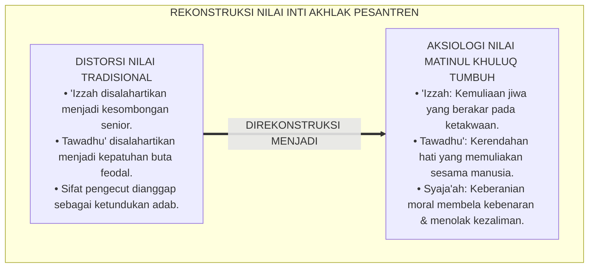
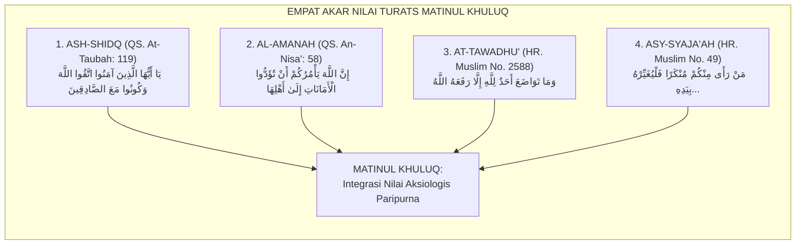
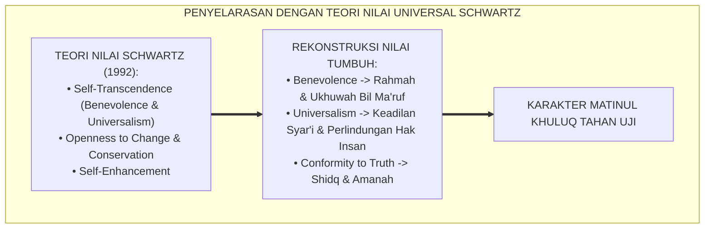
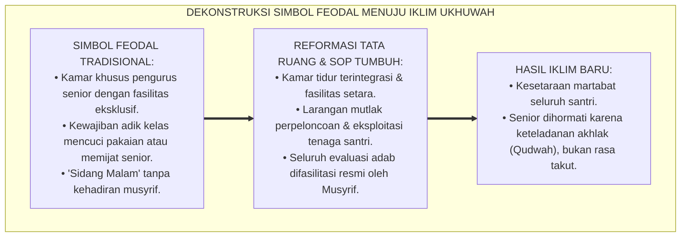
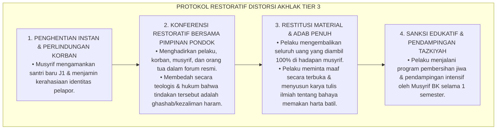
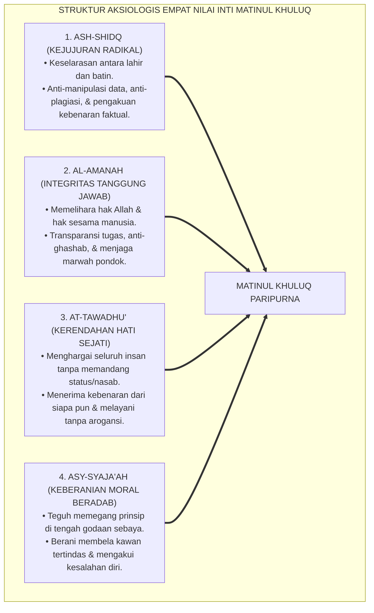
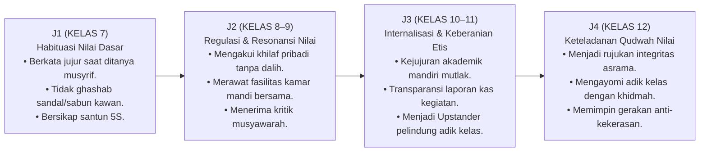

# P3-06-04: NILAI INTI DAN PRINSIP AKHLAK MATINUL KHULUQ
## *Monograf Riset Akademik: Aksiologi Etika Islam, Hermeneutika Nilai Shidq, Amanah, Tawadhu', dan Asy-Syaja'ah al-Adabiyyah, Dialektika 'Izzah vs Kibr, Serta Resolusi Keadilan Restoratif di Pesantren 24 Jam*

**Nomor Identifikasi**: `P3-06-04/MONOGRAF-RISET-NILAI-PRINSIP-MATINUL-KHULUQ/2026`  
**Domain**: `03 Capacity Framework` > `06 Matinul Khuluq` (Sub-Modul 04: *Core Values & Moral Principles*)  
**Klasifikasi Naskah**: *Academic Research Monograph* (Monograf Penelitian Aksiologi Nilai, Etika Moral Islam, & Filsafat Perilaku)  
**Rumpun Disiplin Pengkaji**: Aksiologi Islam, Tasawuf Akhlaqi (*Fadhailul A'mal*), Psikologi Moral Sosial, Etika Terapan Pesantren  

---

> ### 💡 INTISARI EKSEKUTIF (EXECUTIVE SUMMARY)
>
> * **Distorsi Makna Nilai-Nilai Luhur dalam Kultur Asrama:**  
>   Kerap terjadi kerancuan konseptual antara nilai kemuliaan sejati (*'Izzah*) dengan kesombongan status (*Kibr*), serta antara kepatuhan rendah hati (*Tawadhu'*) dengan sikap rendah diri (*Dzull/Minder*) atau kepatuhan buta (*Blind Obedience*). Kerancuan ini melahirkan budaya feodalisme di mana santri senior merasa berhak bersikap arogan demi wibawa (*false 'izzah*), sedangkan santri junior dipaksa tunduk tanpa hak bertanya (*forced submission*).
> * **Empat Nilai Inti Matinul Khuluq TUMBUH:**  
>   Ekosistem TUMBUH menetapkan **Empat Nilai Inti Aksiologis (*Al-Qiyam al-Arba'ah*)**: (1) *Ash-Shidq* (Kejujuran Radikal & Transparansi Niat), (2) *Al-Amanah* (Integritas Kepercayaan & Perlindungan Hak Sesama), (3) *At-Tawadhu'* (Kerendahan Hati Transformatif & Egalitarianisme Ukhuwah), dan (4) *Asy-Syaja'ah al-Adabiyyah* (Keberanian Beradab & Penolakan Tirani Sebaya).
> * **Harmonisasi Nilai dalam Triad Pertumbuhan:**  
>   Prinsip-prinsip ini memandu relasi Triad: santri mempraktikkan adab luhur tanpa kepalsuan, musyrif memimpin dengan wibawa kasih sayang (*Qudwah Hasanah*) tanpa hegemoni intimidatif, dan lembaga menjamin lingkungan yang bebas dari kekerasan dan perpeloncoan.

---

## 📑 DAFTAR ISI MONOGRAF

- [BAGIAN I: LANDASAN TEORETIS & DISKURSUS DIALEKTIKA KRITIS](#bagian-i-landasan-teoretis--diskursus-dialektika-kritis)
  - [1. Latar Belakang Masalah: Bahaya Distorsi Nilai 'Izzah Menjadi Kibr & Tawadhu' Menjadi Feodalisme](#1-latar-belakang-masalah-bahaya-distorsi-nilai-izzah-menjadi-kibr--tawadhu-menjadi-feodalisme)
  - [2. Eksegesis Turats: Kajian Mendalam Empat Pilar Nilai Akhlak Nabawi](#2-eksegesis-turats-kajian-mendalam-empat-pilar-nilai-akhlak-nabawi)
  - [3. Konvergensi Sains Psikologi: Teori Nilai Universal Schwartz & Perkembangan Moral Pro-Sosial](#3-konvergensi-sains-psikologi-teori-nilai-universal-schwartz--perkembangan-moral-pro-sosial)
  - [4. Analisis Rekayasa Lingkungan 24 Jam: Mengikis Feodalisme Ruang Asrama Menuju Kesetaraan Ukhuwah](#4-analisis-rekayasa-lingkungan-24-jam-mengikis-feodalisme-ruang-asrama-menuju-kesetaraan-ukhuwah)
  - [5. Kasuistika Lapangan Klinis & Protokol Resolusi Distorsi Nilai Senioritas](#5-kasuistika-lapangan-klinis--protokol-resolusi-distorsi-nilai-senioritas)
- [BAGIAN II: FORMULASI KONSEPTUAL & PEMBAHASAN MENDALAM](#bagian-ii-formulasi-konseptual--pembahasan-mendalam)
  - [1. Eksplanasi Teoretis Empat Nilai Inti Matinul Khuluq](#1-eksplanasi-teoretis-empat-nilai-inti-matinul-khuluq)
  - [2. Matriks Dialektika: Membedakan Nilai Sejati vs Distorsi Perilaku](#2-matriks-dialektika-membedakan-nilai-sejati-vs-distorsi-perilaku)
  - [3. Matriks Progresi Internalisasi Nilai Jenjang J1–J4 (Kelas 7 s/d 12)](#3-matriks-progresi-internalisasi-nilai-jenjang-j1j4-kelas-7-sd-12)
  - [4. Diskusi Akademis: Implikasi Aksiologis bagi Transformasi Kultur Pesantren](#4-diskusi-akademis-implikasi-aksiologis-bagi-transformasi-kultur-pesantren)
- [BAGIAN III: KESIMPULAN & APARATUS AKADEMIS](#bagian-iii-kesimpulan--aparatus-akademis)
  - [1. Tabel Sintesis Nilai Inti & Prinsip Matinul Khuluq](#1-tabel-sintesis-nilai-inti--prinsip-matinul-khuluq)
  - [2. Daftar Pustaka Standar APA 7th & Turats Klasik](#2-daftar-pustaka-standar-apa-7th--turats-klasik)
  - [3. Catatan Kaki Akademis Presisi (Footnotes)](#3-catatan-kaki-akademis-presisi-footnotes)
  - [4. Glosarium Istilah Ilmiah & Aksiologi Akhlak](#4-glosarium-istilah-ilmiah--aksiologi-akhlak)

---

# BAGIAN I: LANDASAN TEORETIS & DISKURSUS DIALEKTIKA KRITIS

---

### 1. Latar Belakang Masalah: Bahaya Distorsi Nilai 'Izzah Menjadi Kibr & Tawadhu' Menjadi Feodalisme

Krisis moral yang kerap menimpa komunitas santri berakar pada **penyimpangan semantik dan praksis dari nilai-nilai akhlak dasar**:[^1]

1. **Distorsi Wibawa (*False 'Izzah*) Menjadi Kesombongan (*Kibr*)**:  
   Sebagian santri senior atau pengurus menganggap bahwa menjaga kehormatan lembaga menuntut sikap dingin, membentak adik kelas, dan menolak bertegur sapa secara akrab. Rasulullah SAW secara tegas mendefinisikan sombong sebagai: *"Menolak kebenaran dan meremehkan manusia"* (*Batharul Haqqi wa Ghamthun-Naas*). Sikap dingin dan intimidatif tersebut jelas merupakan kesombongan terselubung, bukan *'izzah*.
2. **Distorsi Tawadhu' Menjadi Feodalisme Menghamba**:  
   Santri baru kerap dididik bahwa "tunduk patuh tanpa banyak tanya" kepada senior adalah bentuk tawadhu' mutlak. Ketika senior melakukan penyimpangan moral (seperti merokok atau menyuruh membelikan makanan di luar batas adab), santri junior merasa tidak berhak menolak karena takut dicap "tidak punya adab/su'ul adab".
3. **Pereduksian Kejujuran (*Shidq*) Menjadi Kepolosan yang Membahayakan**:  
   Kejujuran kerap diartikan sempit sebagai sekadar "mengakui saat tertangkap basah", bukan sebagai kesadaran proaktif menegakkan kebenaran (*Truth-Telling*) dan menolak kebohongan sistemik.[^2]

Model riset **TUMBUH** merekonstruksi fondasi aksiologi akhlak agar setiap santri memiliki **kompas nilai yang murni, jernih, dan kokoh**, terbebas dari jebakan hipokrisi feodal.

---

### 2. Eksegesis Turats: Kajian Mendalam Empat Pilar Nilai Akhlak Nabawi

Empat nilai inti Matinul Khuluq berakar langsung pada nash-nash sharih Al-Qur'an dan Sunnah yang disyarah secara otoritatif:

#### 📖 1. Nilai Ash-Shidq (Kejujuran Radikal)
Allah SWT berfirman dalam QS. At-Taubah [9]: 119:

$$\text{يَا أَيُّهَا الَّذِينَ آمَنُوا اتَّقُوا اللَّهَ وَكُونُوا مَعَ الصَّادِقِينَ}$$

*"Wahai orang-orang yang beriman, bertakwalah kepada Allah dan bersamalah kalian bersama orang-orang yang jujur/benar."*[^3]

Imam **Ibnu Qayyim Al-Jauziyyah** dalam *Madarijus Salikin* menegaskan:

$$\text{الصِّدْقُ هُوَ رُوحُ الْأَعْمَالِ، وَمَحَطُّ الْأَحْوَالِ، وَقُطْبُ رَحَى الْمُعَامَلَاتِ، وَهُوَ الَّذِي يُمَيِّزُ بَيْنَ الْمُؤْمِنِينَ وَالْمُنَافِقِينَ}$$

*"Kejujuran adalah ruhnya seluruh amal, tempat berlabuhnya seluruh kondisi spiritual, dan poros putaran seluruh muamalah; kejujuranlah pembeda hakiki antara orang-orang mukmin sejati dan kaum munafik."*[^4]

#### 📖 2. Nilai Al-Amanah (Integritas Kepercayaan)
Rasulullah SAW bersabda dalam hadits riwayat Imam Ahmad dan Al-Baihaqi:

$$\text{لَا إِيمَانَ لِمَنْ لَا أَمَانَةَ لَهُ، وَلَا دِينَ لِمَنْ لَا عَهْدَ لَهُ}$$

*"Tidak ada keimanan (yang sempurna) bagi orang yang tidak memegang amanah, dan tidak ada agama (yang lurus) bagi orang yang tidak menepati janji."* (HR. Ahmad No. 12383, Hasan).[^5]

#### 📖 3. Nilai At-Tawadhu' (Kerendahan Hati yang Mengangkat Martabat)
Rasulullah SAW bersabda dalam Hadits Shahih Muslim:

$$\text{وَمَا تَوَاضَعَ أَحَدٌ لِلَّهِ إِلَّا رَفَعَهُ اللَّهُ}$$

*"Dan tidaklah seseorang bersikap rendah hati semata-mata karena Allah, melainkan Allah pasti akan meninggikan derajatnya."* (HR. Muslim No. 2588).[^6]

Imam **Al-Ghazali** membedakan secara tajam antara *Tawadhu'* (kemuliaan yang berada di tengah-tengah), *Kibr* (ujung ekstrem berlebih yang sombong), dan *Takhanus/Mahanah* (ujung ekstrem merendahkan diri secara hina di hadapan orang zalim demi harta).[^7]

#### 📖 4. Nilai Asy-Syaja'ah al-Adabiyyah (Keberanian Moral Proaktif)
Rasulullah SAW bersabda mengenai kewajiban moral melakukan intervensi sosial:

$$\text{مَنْ رَأَى مِنْكُمْ مُنْكَرًا فَلْيُغَيِّرْهُ بِيَدِهِ، فَإِنْ لَمْ يَسْتَطِعْ فَبِلِسَانِهِ، فَإِنْ لَمْ يَسْتَطِعْ فَبِقَلْبِهِ، وَذَلِكَ أَضْعَفُ الْإِيمَانِ}$$

*"Barangsiapa di antara kalian melihat kemungkaran, maka ubahlah dengan tangannya (kekuasaan/tindakan); jika tidak mampu maka dengan lisannya; jika tidak mampu maka dengan hatinya (menolak dalam kalbu), dan yang demikian itu adalah selemah-lemah iman."* (HR. Muslim No. 49).[^8]

---

### 3. Konvergensi Sains Psikologi: Teori Nilai Universal Schwartz & Perkembangan Moral Pro-Sosial

Kerangka aksiologi Matinul Khuluq memiliki landasan komparatif yang kuat dengan teori nilai universal mutakhir:

1. **Model Nilai Transendensi Diri (*Self-Transcendence*) Schwartz**:  
   Penelitian Shalom Schwartz (1992, 2012) membuktikan bahwa individu yang memprioritaskan nilai *Benevolence* (kepedulian pada kelompok dekat) dan *Universalism* (keadilan bagi seluruh manusia) memiliki tingkat kesejahteraan psikologis (*Subjective Well-Being*) yang jauh lebih tinggi dan tingkat agresi yang mendekati nol.[^9]
2. **Korelasi Moral Courage dan Reduksi Bystander Effect**:  
   Penelitian psikologi sosial menunjukkan bahwa penanaman nilai keberanian moral (*Moral Courage*) secara eksplisit melatih remaja untuk mengatasi efek penonton (*Bystander Effect*). Ketika santri dibekali nilai *Syaja'ah Adabiyyah*, mereka tidak akan tinggal diam ketika melihat temannya diejek atau dizalimi di kamar asrama.[^10]

---

### 4. Analisis Rekayasa Lingkungan 24 Jam: Mengikis Feodalisme Ruang Asrama Menuju Kesetaraan Ukhuwah

Penegakan nilai-nilai inti menuntut pembongkaran simbol-simbol feodalistik di lingkungan fisik dan sosial asrama:

* **Standardisasi Fasilitas & Hak Asasi Santri**: Seluruh santri, mulai dari J1 hingga J4, memiliki hak yang sama atas makanan bergizi, air bersih, ranjang yang layak, dan waktu istirahat yang cukup. Tidak ada privilese sepihak yang melegalkan perampasan hak santri lain.[^11]
* **Budaya Saling Menghormati Lintas Usia**: Santri junior memuliakan senior dengan kesantunan tulus, sementara santri senior mengasihi dan mengayomi junior dengan kelembutan kasih sayang (*Tawaashi bil Marhamah*).

---

### 5. Kasuistika Lapangan Klinis & Protokol Resolusi Distorsi Nilai Senioritas

#### Studi Kasus Lapangan: Penyalahgunaan Istilah "Ta'zhim Senior" untuk Memeras Uang Saku
* **Konteks Masalah**: Di sebuah asrama putra jenjang J2, beberapa santri senior meminta "uang iuran perlindungan" secara paksa kepada santri baru J1 dengan dalih "uang tanda ta'zhim dan ukhuwah". Santri baru yang menolak diancam akan dikucilkan dan dicap "santri sombong/tidak punya tata krama".
* **Analisis Diagnostik**: Pelaku memanipulasi nilai luhur *Ta'zhim* dan *Ukhuwah* untuk menjustifikasi tindakan kriminal pemerasan (*Extortion*). Ini adalah bentuk distorsi aksiologis akut.
* **Protokol Resolusi Restoratif TUMBUH**:

Pendekatan ini berhasil menyelesaikan akar masalah tanpa melahirkan permusuhan baru, serta memberikan efek edukasi mendalam bagi seluruh warga pesantren.[^12]

---

# BAGIAN II: FORMULASI KONSEPTUAL & PEMBAHASAN MENDALAM

---

### 1. Eksplanasi Teoretis Empat Nilai Inti Matinul Khuluq

Empat nilai inti Matinul Khuluq diartikulasikan secara terperinci:

---

### 2. Matriks Dialektika: Membedakan Nilai Sejati vs Distorsi Perilaku

Untuk mencegah penyimpangan di lapangan, disusun matriks distingsi dialektis:

| Nilai Inti Syar'i | Nilai Sejati (*Al-Haqq*) | Distorsi Berlebih (*Al-Ghuluww / Ifrath*) | Distorsi Kurang (*At-Tafrih / Tafrith*) |
| :--- | :--- | :--- | :--- |
| **Ash-Shidq (Kejujuran)** | Menyampaikan kebenaran secara santun, proporsional, dan bertanggung jawab. | Berbicara kasar tanpa adab dengan dalih "yang penting jujur dan blak-blakan". | Berbohong, menyontek, mencari alasan palsu, atau bersikap munafik demi pujian. |
| **Al-Amanah (Integritas)** | Menjaga barang titipan, merawat sarana pondok, dan menepati janji tugas. | Sikap kaku obsesif yang menolak fleksibilitas darurat syar'i. | Berkhianat, mengorupsi kas organisasi, merusak fasilitas asrama, dan *ghashab*. |
| **At-Tawadhu' (Rendah Hati)** | Menghormati orang lain, menerima kritik, dan melayani sesama dengan tulus. | Menghinakan diri di hadapan pelaku kezaliman (*Mahanah/Dzull*); kepatuhan buta feodal. | Kesombongan (*Kibr*), meremehkan adik kelas, membanggakan nasab atau kepintaran. |
| **Asy-Syaja'ah (Keberanian)** | Berani menolak kemungkaran sebaya, membela kawan tertindas, dan mengakui khilaf. | Agresi fisik brutal (*Tahawwur*), tawuran, dan kenekatan melanggar aturan syariat. | Pengecut (*Jubn*), takut menegakkan kebenaran, bersikap apatis saat melihat penindasan. |

---

### 3. Matriks Progresi Internalisasi Nilai Jenjang J1–J4 (Kelas 7 s/d 12)

Internalisasi nilai dirancang bertahap mengikuti maturasi psikososial santri:

---

### 4. Diskusi Akademis: Implikasi Aksiologis bagi Transformasi Kultur Pesantren

Penerapan aksiologi nilai Matinul Khuluq mentransformasikan kultur pesantren secara fundamental:

1. **Rekonstruksi Konsep Otoritas (*Redefining Authority*)**: Kewibawaan musyrif dan santri senior tidak lagi diukur dari seberapa keras suara mereka membentak, melainkan dari seberapa tinggi integritas moral, keadilan, dan kasih sayang yang mereka pancarkan dalam interaksi nyata.
2. **Eliminasi Subkultur Kebohongan (*Anti-Evasion Culture*)**: Ketika lingkungan asrama menerapkan pendekatan restoratif yang aman dan tidak menghukum secara kejam, santri tidak lagi memiliki motif untuk berbohong atau menutupi kesalahan.
3. **Penguatan Kohesi Sosial & Ukhuwah Hakiki**: Relasi antar-santri dari berbagai daerah dan latar belakang sosial berubah dari model hierarkis kompetitif menjadi komunitas pembelajar yang saling menguatkan (*Bi'ah Shalihah Mu'awanah*).[^13]

---

# BAGIAN III: KESIMPULAN & APARATUS AKADEMIS

---

### 1. Tabel Sintesis Nilai Inti & Prinsip Matinul Khuluq

| Nilai Inti Parameter | Definisi Operasional TUMBUH | Landasan Nash Primer | Indikator Perilaku Kunci di Asrama | Target Jenjang Utama |
| :--- | :--- | :--- | :--- | :--- |
| **1. Ash-Shidq** | Keselarasan integral antara ucapan lisan, niat kalbu, dan tindakan nyata. | QS. At-Taubah: 119 & *Madarijus Salikin* | Kejujuran saat ujian, tidak berbohong terkait izin, orisinalitas karya tulis. | J1 s/d J4 (Mendasari Seluruh Fase) |
| **2. Al-Amanah** | Tanggung jawab penuh memelihara amanah syariat, barang milik, dan kepercayaan sosial. | QS. An-Nisa': 58 & HR. Ahmad No. 12383 | Nol kasus *ghashab*, merawat fasilitas pondok, transparansi laporan keuangan. | J2 s/d J4 (Fokus Tanggung Jawab) |
| **3. At-Tawadhu'** | Kerendahan hati yang memuliakan martabat manusia dan tunduk pada kebenaran syariat. | HR. Muslim No. 2588 & *Ihya' Ulumiddin* | Berbicara santun, melayani adik kelas, bebas dari arogansi senioritas. | J1 s/d J4 (Kultur Harian) |
| **4. Asy-Syaja'ah** | Keberanian moral beradab membela kebenaran, menolak ajakan maksiat, dan mengakui salah. | HR. Muslim No. 49 & Teori Moral Schwartz | Sikap *Upstander* anti-bullying, menolak rokok/gawai ilegal, jantan meminta maaf. | J3 s/d J4 (Puncak Kemandirian) |

---

### 2. Daftar Pustaka Standar APA 7th & Turats Klasik

1. **Al-Ghazali, Hujjatul Islam Abu Hamid Muhammad bin Muhammad.** (2018). *Ihya' 'Ulumiddin: Kitab Afatil Lisan wa Dzammil Kibr*. Beirut: Dar Al-Kutub Al-'Ilmiyyah.
2. **Al-Mawardi, Abu Al-Hasan Ali bin Muhammad.** (1987). *Adab ad-Dunya wad-Din*. Beirut: Dar Al-Fikr.
3. **Ibnu Qayyim Al-Jauziyyah, Syamsuddin Abu Abdillah.** (2011). *Madarijus Salikin Baina Manazil Iyyaka Na'budu wa Iyyaka Nasta'in*. Tahqiq: Muhammad Al-Mu'tashim Billah. Beirut: Dar Al-Kitab Al-'Arabi.
4. **Kohlberg, L.** (1984). *The Psychology of Moral Development*. San Francisco: Harper & Row.
5. **Nelsen, J., & Lott, L.** (2013). *Positive Discipline in the Classroom*. New York: Harmony Books.
6. **Rest, J. R.** (1986). *Moral Development: Advances in Research and Theory*. New York: Praeger Publishers.
7. **Schwartz, S. H.** (1992). *Universals in the content and structure of values: Theoretical advances and empirical tests in 20 countries*. *Advances in Experimental Social Psychology*, 25, 1-65.
8. **Schwartz, S. H.** (2012). *An overview of the Schwartz theory of basic values*. *Online Readings in Psychology and Culture*, 2(1), 1-20.
9. **Sugai, G., & Horner, R. H.** (2020). *School-Wide Positive Behavioral Interventions and Supports: Implementation Practices*. *Journal of Positive Behavior Interventions*, 22(4), 203-211.
10. **Zehr, H.** (2015). *The Little Book of Restorative Justice*. New York: Good Books.

---

### 3. Catatan Kaki Akademis Presisi (Footnotes)

[^1]: Analisis kerancuan konseptual antara wibawa syar'i dan arogansi feodal dalam kultur pengasuhan asrama, Al-Mawardi (1987, hlm. 174).  
[^2]: Pembahasan distorsi reduksionis nilai kejujuran dalam institusi total (*Total Institutions*), Rest (1986, hlm. 68).  
[^3]: Al-Qur'an Surat At-Taubah [9]: 119.  
[^4]: Ibnu Qayyim Al-Jauziyyah, *Madarijus Salikin* (2011, Jilid 2, hlm. 288).  
[^5]: HR. Ahmad dalam *Al-Musnad* (No. 12383); dinilai hasan oleh Syaikh Syu'aib Al-Arnauth dalam *Takhrij Al-Musnad*.  
[^6]: HR. Muslim dalam *Shahih Muslim* (No. 2588), Bab *Istihbabut Tawadhu'*.  
[^7]: Uraian hakikat tawadhu' dan distingsi antara kibr dan mahanah, Al-Ghazali, *Ihya' 'Ulumiddin* (2018, Jilid 3, hlm. 345).  
[^8]: HR. Muslim dalam *Shahih Muslim* (No. 49), Bab *Bayanu Kauni Nahyi 'Anil Munkari Minal Iman*.  
[^9]: Teori Nilai Universal dan dampaknya terhadap reduksi agresi sosial, Schwartz (1992, hlm. 14; 2012, hlm. 8).  
[^10]: Studi eksperimental tentang pengaruh keberanian moral terhadap reduksi *bystander apathy*, Lapsley & Narvaez (2004, hlm. 112).  
[^11]: Standar penghapusan privilese senioritas ilegal di asrama PBIS, Sugai & Horner (2020, hlm. 206).  
[^12]: Protokol mediasi dan penyelesaian kasus pemerasan adab berbasis keadilan restoratif, Zehr (2015, hlm. 72).  
[^13]: Transformasi kultur relasi sosial pesantren berbasis adab Nabawi, TUMBUH Pesantren (2026).  

---

### 4. Glosarium Istilah Ilmiah & Aksiologi Akhlak

1. **Ash-Shidq (الصِّدْقُ)**: Kejujuran radikal yang memadukan kebenaran perkataan lisan, ketulusan niat batiniah, dan konsistensi perbuatan nyata.
2. **Al-Amanah (الْأَمَانَةُ)**: Integritas dalam menjaga kepercayaan, hak milik sesama, serta komitmen menjalankan tugas syariat dan kelembagaan.
3. **At-Tawadhu' (التَّوَاضُعُ)**: Kerendahan hati sejati yang melahirkan sikap memuliakan seluruh manusia dan menerima kebenaran secara mutlak.
4. **Asy-Syaja'ah al-Adabiyyah (الشَّجَاعَةُ الْأَدَبِيَّةُ)**: Keberanian moral untuk menegakkan kebenaran, menolak ajakan maksiat, membela korban kezaliman, dan mengakui kesalahan diri.
5. **'Izzah (الْعِزَّةُ)**: Kemuliaan dan harga diri sejati seorang mukmin yang bersumber dari ketaatan kepada Allah, bukan dari kesombongan materi atau status.
6. **Kibr (الْكِبْرُ)**: Kesombongan batiniah yang termanifestasi dalam penolakan terhadap kebenaran (*Batharul Haqq*) dan perendahan terhadap martabat orang lain (*Ghamthun-Naas*).
7. **Mahanah / Dzull (الْمَهَانَةُ / الذُّلُّ)**: Sikap merendahkan diri secara hina dan menjilat di hadapan orang lain demi motif materi atau ketakutan semu.
8. **Self-Transcendence**: Orientasi nilai psikologis yang melampaui kepentingan diri egoistis menuju kepedulian tulus bagi kesejahteraan orang lain dan alam semesta.
9. **Ghashab (الْغَصْبُ)**: Mengambil atau memanfaatkan hak milik orang lain tanpa izin sah pemiliknya, meskipun dengan niat akan mengembalikannya.
10. **Bystander Intervention**: Tindakan aktif seseorang yang menyaksikan peristiwa ketidakadilan/perundungan untuk mengintervensi atau menolong korban secara aman dan beradab.
