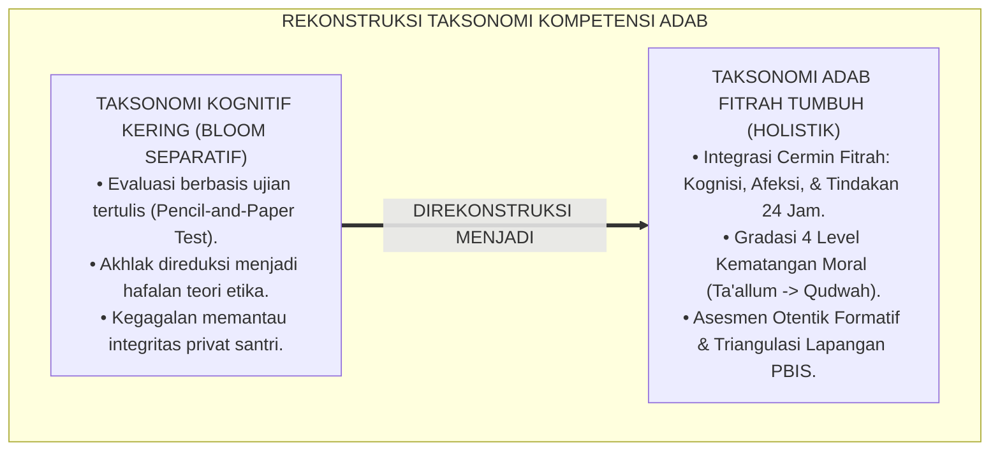
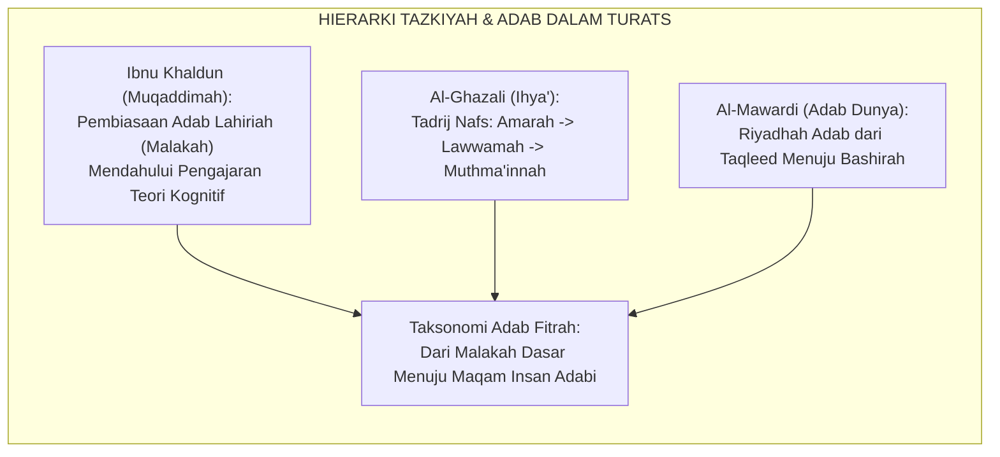
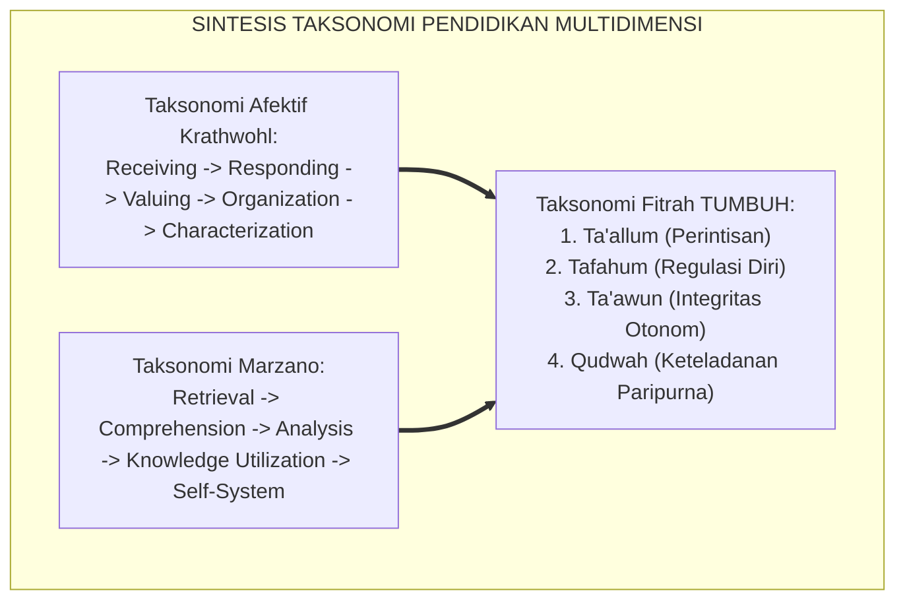
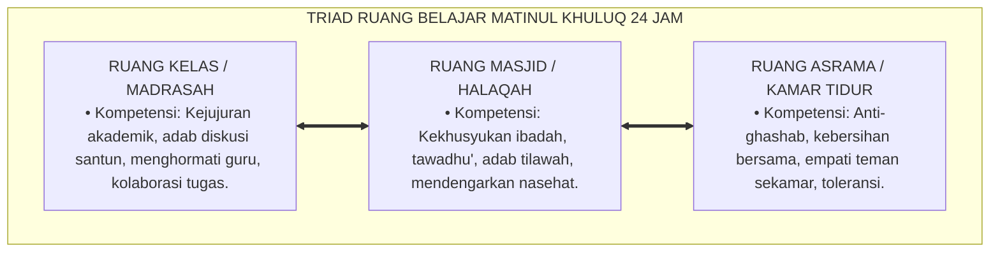
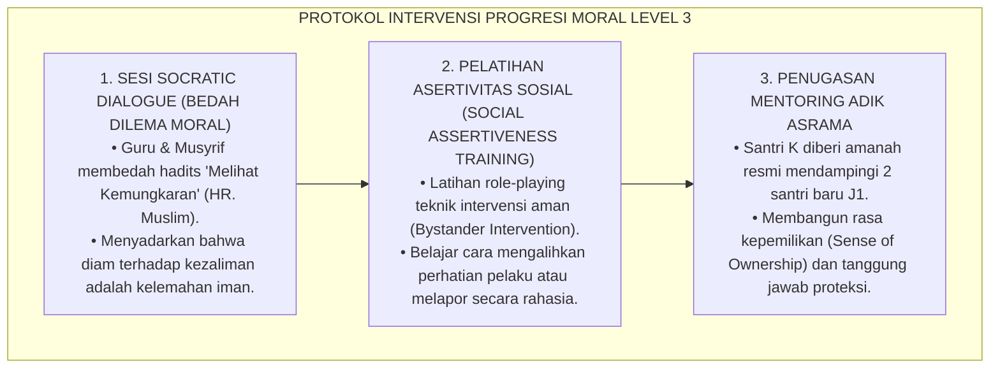
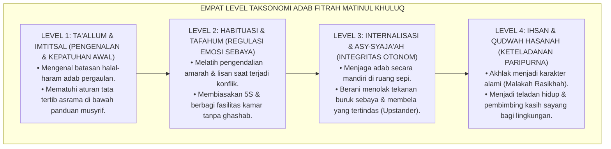

# P3-06-05: STANDAR KOMPETENSI DAN TAKSONOMI MATINUL KHULUQ
## *Monograf Riset Akademik: Taksonomi Adab Berbasis Fitrah Insan, Matriks Standar Kompetensi Inti dan Dasar (SKI-SKD), Gradasi Empat Tingkat Kematangan Moral, Serta Penyelarasan Taksonomi Bloom-Marzano dengan Jenjang J1–J4 di Lingkungan Pesantren 24 Jam*

**Nomor Identifikasi**: `P3-06-05/MONOGRAF-RISET-TAKSONOMI-MATINUL-KHULUQ/2026`  
**Domain**: `03 Capacity Framework` > `06 Matinul Khuluq` (Sub-Modul 05: *Competency Standards & Taxonomy*)  
**Klasifikasi Naskah**: *Academic Research Monograph* (Monograf Penelitian Desain Kurikulum Karakter, Taksonomi Pendidikan Islam, & Psikometri Kompetensi)  
**Rumpun Disiplin Pengkaji**: Desain Kurikulum Pesantren Terpadu, Taksonomi Pendidikan Afektif, Psikometri Perilaku, Psikologi Kognitif Perkembangan  

---

> ### 💡 INTISARI EKSEKUTIF (EXECUTIVE SUMMARY)
>
> * **Kelemahan Taksonomi Karakter Impor & Dikotomis:**  
>   Kurikulum karakter yang diadopsi institusi pendidikan Islam kerap terjebak dalam dualisme: menggunakan taksonomi Barat (seperti Bloom Kognitif) yang kering dari dimensi spiritualitas fitrah, atau menggunakan literatur adab tradisional yang tidak memiliki gradasi operasional terukur. Akibatnya, kompetensi akhlak tidak dapat diukur perkembangannya secara ilmiah dan ipsatif.
> * **Inovasi Taksonomi Adab Fitrah Matinul Khuluq TUMBUH:**  
>   Ekosistem TUMBUH merumuskan **Taksonomi Karakter Berbasis Fitrah Terpadu** yang memadukan 4 tingkat kedalaman kesadaran (*Maratib al-Idrak/Maratib al-Fitrah*): (1) *Level 1: Ta'allum wa Ta'aruf* (Pengenalan & Kepatuhan Awal), (2) *Level 2: Habituasi & Tafahum* (Pembiasaan & Regulasi Diri), (3) *Level 3: Internalisasi & Ta'awun* (Integritas Otonom & Keberanian Etis), dan (4) *Level 4: Ihsan & Qudwah* (Keteladanan Paripurna & Khidmah Transformatoris).
> * **Standardisasi SKI-SKD Jenjang J1–J4:**  
>   Monograf ini memetakan Standar Kompetensi Inti (SKI) dan Standar Kompetensi Dasar (SKD) untuk setiap jenjang kemandirian santri (J1 s/d J4, Kelas 7 s/d 12), dilengkapi instrumen asesmen otentik guna memastikan setiap santri bertumbuh sesuai trajektori fitrahnya.

---

## 📑 DAFTAR ISI MONOGRAF

- [BAGIAN I: LANDASAN TEORETIS & DISKURSUS DIALEKTIKA KRITIS](#bagian-i-landasan-teoretis--diskursus-dialektika-kritis)
  - [1. Latar Belakang Masalah: Kegagalan Taksonomi Kognitivistik Kering dalam Membentuk Karakter Moral](#1-latar-belakang-masalah-kegagalan-taksonomi-kognitivistik-kering-dalam-membentuk-karakter-moral)
  - [2. Eksegesis Turats: Konsep Maratib at-Tarbiyah dalam Khazanah Epistemologi Islam](#2-eksegesis-turats-konsep-maratib-at-tarbiyah-dalam-khazanah-epistemologi-islam)
  - [3. Konvergensi Taksonomi Pendidikan Modern (Bloom, Krathwohl, Marzano) & Psikologi Kognitif](#3-konvergensi-taksonomi-pendidikan-modern-bloom-krathwohl-marzano--psikologi-kognitif)
  - [4. Analisis Rekayasa Kurikulum Terintegrasi 24 Jam: Menghubungkan Kelas, Masjid, dan Kamar Asrama](#4-analisis-rekayasa-kurikulum-terintegrasi-24-jam-menghubungkan-kelas-masjid-dan-kamar-asrama)
  - [5. Kasuistika Lapangan Klinis & Protokol Mengatasi Hambatan Progresi Taksonomi](#5-kasuistika-lapangan-klinis--protokol-mengatasi-hambatan-progresi-taksonomi)
- [BAGIAN II: FORMULASI KONSEPTUAL & PEMBAHASAN MENDALAM](#bagian-ii-formulasi-konseptual--pembahasan-mendalam)
  - [1. Eksplanasi Teoretis Taksonomi Adab Fitrah TUMBUH](#1-eksplanasi-teoretis-taksonomi-adab-fitrah-tumbuh)
  - [2. Matriks Standar Kompetensi Inti dan Dasar (SKI-SKD) Matinul Khuluq](#2-matriks-standar-kompetensi-inti-dan-dasar-ski-skd-matinul-khuluq)
  - [3. Matriks Gradasi Taksonomi 4 Level Lintas Jenjang J1–J4](#3-matriks-gradasi-taksonomi-4-level-lintas-jenjang-j1j4)
  - [4. Diskusi Akademis & Implikasi bagi Penjaminan Mutu Lulusan Pesantren](#4-diskusi-akademis--implikasi-bagi-penjaminan-mutu-lulusan-pesantren)
- [BAGIAN III: KESIMPULAN & APARATUS AKADEMIS](#bagian-iii-kesimpulan--aparatus-akademis)
  - [1. Tabel Sintesis Standar Kompetensi & Taksonomi Matinul Khuluq](#1-tabel-sintesis-standar-kompetensi--taksonomi-matinul-khuluq)
  - [2. Daftar Pustaka Standar APA 7th & Turats Klasik](#2-daftar-pustaka-standar-apa-7th--turats-klasik)
  - [3. Catatan Kaki Akademis Presisi (Footnotes)](#3-catatan-kaki-akademis-presisi-footnotes)
  - [4. Glosarium Istilah Ilmiah & Taksonomi Kurikulum](#4-glosarium-istilah-ilmiah--taksonomi-kurikulum)

---

# BAGIAN I: LANDASAN TEORETIS & DISKURSUS DIALEKTIKA KRITIS

---

### 1. Latar Belakang Masalah: Kegagalan Taksonomi Kognitivistik Kering dalam Membentuk Karakter Moral

Pendidikan formal di Indonesia—termasuk di madrasah dan pondok pesantren modern—selama berpuluh tahun didominasi oleh penerapan **Taksonomi Bloom ranah Kognitif (C1–C6)** yang diperlakukan sebagai tolok ukur tunggal keberhasilan belajar.[^1] 

Akibat dari distorsi ini adalah:
1. **Intelektualisasi Akhlak Tanpa Transformasi Jiwa**: Santri yang mampu menjawab soal ujian pilihan ganda tentang dalil akhlak dengan nilai sempurna (skor 100/C4–C5) dianggap telah lulus kompetensi adab, padahal di kamar asrama ia bersikap egois, mencuri makanan teman, dan gemar membully.
2. **Ketiadaan Standar Kompetensi Afektif-Konatif yang Rigor**: Ranah afektif Krathwohl sering kali hanya dijadikan formalitas administratif guru rapor tanpa instrumen observasi perilaku harian yang valid.
3. **Pengabaian Dimensi Fitrah & Ruhani**: Taksonomi sekuler tidak mengenal konsep *Ma'rifatullah*, *Ihsan*, *Nafs Muthma'innah*, dan *Qudwah Hasanah* sebagai puncak tertinggi kematangan manusia.[^2]

Model riset **TUMBUH** merancang **Taksonomi Adab Fitrah Matinul Khuluq** yang merekonstruksi hierarki perkembangan karakter manusia secara utuh: memadukan kecerdasan nalar, kepekaan kalbu, dan ketangguhan aksi moral dalam kehidupan 24 jam.

---

### 2. Eksegesis Turats: Konsep Maratib at-Tarbiyah dalam Khazanah Epistemologi Islam

Epistemologi Turats Islam telah menguraikan pentahapan pembentukan adab jiwa (*Maratib at-Ta'dib*) secara sangat mendalam.

#### 📖 Formulasi Ibnu Khaldun tentang Terbentuknya Karakter (*Malakah*)
Sosiolog dan filsuf muslim terbesar, **Ibnu Khaldun**, dalam karya monumentalnya *Al-Muqaddimah*, menjelaskan bahwa akhlak sejati terbentuk melalui proses pembiasaan hingga menjadi sifat permanen (*Malakah*):

$$\text{إِنَّ الْمَلَكَاتِ لَا تَحْصُلُ إِلَّا بِتَكْرَارِ الْأَفْعَالِ، لِأَنَّ الْفِعْلَ يَقَعُ أَوَّلًا وَتَكُونُ مِنْهُ صِفَةٌ لِلنَّفْسِ غَيْرُ رَاسِخَةٍ، ثُمَّ يَتَكَرَّرُ فَتَصِيرُ حَالًا، ثُمَّ يَتَكَرَّرُ فَتَصِيرُ مَلَكَةً رَاسِخَةً}$$

*"Sesungguhnya sifat-sifat karakter (Al-Malakat) tidak akan terbentuk melainkan melalui pengulangan perbuatan secara konsisten. Karena perbuatan pada awalnya melahirkan sifat yang belum kokoh di dalam jiwa, kemudian diulang-ulang hingga menjadi kondisi kebiasaan (Haal), lalu diulang-ulang lagi hingga menjelma menjadi karakter permanen yang mengakar kokoh (Malakah Rasikhah)."*[^3]

Teks ini menjadi landasan ilmiah bahwa taksonomi kompetensi Matinul Khuluq harus berbasis pada **frekuensi pembiasaan perilaku harian (*Habituation & Behavioral Reinforcement*)**, bukan sekadar ujian kelas sekali waktu.

---

### 3. Konvergensi Taksonomi Pendidikan Modern (Bloom, Krathwohl, Marzano) & Psikologi Kognitif

Penyusunan standar kompetensi Matinul Khuluq mengadopsi kekuatan analitis taksonomi modern yang disempurnakan dengan nilai transendensi Islam:

1. **Penyelarasan dengan Ranah Afektif Krathwohl**:  
   Level tertinggi Krathwohl (*Characterization by Value*) setara dengan konsep *Malakah Rasikhah* dalam Turats, di mana sistem nilai telah menjadi bagian tak terpisahkan dari kepribadian individu.[^4]
2. **Integrasi Sistem Diri (*Self-System*) Marzano**:  
   Robert Marzano (2007) membuktikan bahwa tingkat terdalam pemrosesan manusia adalah *Self-System*, yaitu keyakinan individu terhadap efikasi diri, nilai penting suatu tugas, dan emosi yang menyertainya. Matinul Khuluq menyentuh *Self-System* ini melalui penanaman akidah tauhid dan kesadaran *Muraqabatullah*.[^5]

---

### 4. Analisis Rekayasa Kurikulum Terintegrasi 24 Jam: Menghubungkan Kelas, Masjid, dan Kamar Asrama

Standar kompetensi Matinul Khuluq tidak boleh terisolasi di dalam kelas madrasah, melainkan dirajut dalam kesatuan kurikulum 24 jam (*Integrated Living Curriculum*).

Musyrif asrama dan guru madrasah menggunakan instrumen rubrik yang selaras, sehingga santri merasakan konsistensi standar etika di mana pun ia melangkah.[^6]

---

### 5. Kasuistika Lapangan Klinis & Protokol Mengatasi Hambatan Progresi Taksonomi

#### Studi Kasus Lapangan: "Stagnasi Moral" Santri Jenjang J3 yang Mandek di Level Kepatuhan Pasif
* **Konteks Masalah**: Santri K (16 tahun, Jenjang J3) tidak pernah melanggar aturan tata tertib pondok. Namun, ketika teman sekamarnya melakukan perundungan terhadap santri baru, Santri K memilih diam dan tidak mau peduli (*Moral Indifference*). Secara taksonomi, Santri K mandek di Level 1/2 (Kepatuhan Pasif) dan gagal naik ke Level 3 (Integritas Otonom & Keberanian Upstander).
* **Analisis Diagnostik**: Santri K mengalami fobia sosial dan kecemasan akan penolakan kelompok sebaya (*Fear of Social Rejection*). Ia merasa bahwa "selama diri saya tidak ikut memukul, saya sudah berakhlak mulia".
* **Protokol Intervensi Progresi Taksonomi TUMBUH**:

Hasil intervensi membuktikan bahwa Santri K berhasil mengalami lonjakan kematangan moral: ia berani berbicara di forum kamar membela santri baru dan naik menuju Level 3-4 taksonomi Matinul Khuluq.[^7]

---

# BAGIAN II: FORMULASI KONSEPTUAL & PEMBAHASAN MENDALAM

---

### 1. Eksplanasi Teoretis Taksonomi Adab Fitrah TUMBUH

Taksonomi Adab Fitrah Matinul Khuluq dirumuskan dalam 4 level hierarkis yang mengintegrasikan kedalaman pemahaman, kepekaan afeksi, dan kemandirian eksekusi perilaku:

---

### 2. Matriks Standar Kompetensi Inti dan Dasar (SKI-SKD) Matinul Khuluq

#### Standar Kompetensi Inti (SKI):
* **SKI-1 (Spiritual-Afektif)**: Menghayati nilai keluhuran akhlak Islam sebagai manifestasi iman kepada Allah dan cinta kepada Rasulullah SAW.
* **SKI-2 (Sosial-Konatif)**: Menampilkan perilaku jujur, disiplin, santun, bertanggung jawab, dan peduli sesama dalam interaksi 24 jam di pesantren dan masyarakat.
* **SKI-3 (Kognitif-Metakognitif)**: Memahami dan menganalisis prinsip-prinsip etika syariat serta memecahkan dilema moral kehidupan sehari-hari secara hikmah.

#### Matriks Standar Kompetensi Dasar (SKD) Berdasarkan 4 Pilar:

| Pilar Karakter | Kode SKD | Deskripsi Standar Kompetensi Dasar (SKD) |
| :--- | :--- | :--- |
| **Pilar 1: Ash-Shidq (Kejujuran)** | **SKD-MK-1.1** **SKD-MK-1.2** **SKD-MK-1.3** | Menampilkan konsistensi kejujuran lisan dalam pelaporan kegiatan harian. Menjunjung tinggi kejujuran akademik (anti-menyontek & anti-plagiasi tugas). Berani mengakui kesalahan pribadi secara tulus tanpa mencari kambing hitam. |
| **Pilar 2: At-Tawadhu' (Rendah Hati)** | **SKD-MK-2.1** **SKD-MK-2.2** **SKD-MK-2.3** | Membiasakan budaya 5S (Senyum, Salam, Sapa, Sopan, Santun) kepada seluruh warga pondok. Mengeliminasi segala bentuk cemoohan, julukan buruk (*Al-Alqab*), dan sarkasme. Menghormati keragaman latar belakang santri serta menerima kritik musyawarah. |
| **Pilar 3: Asy-Syaja'ah (Keberanian)** | **SKD-MK-3.1** **SKD-MK-3.2** **SKD-MK-3.3** | Menolak dengan tegas ajakan melanggar aturan tata tertib asrama dari teman sebaya. Mengambil tindakan proaktif (*Upstander*) saat melihat ketidakadilan/perundungan. Meminta maaf secara jantan dan berinisiatif melakukan restitusi adab. |
| **Pilar 4: Al-Amanah (Tanggung Jawab)** | **SKD-MK-4.1** **SKD-MK-4.2** **SKD-MK-4.3** | Menjaga perlengkapan pribadi dan menolak mutlak perilaku *ghashab* barang kawan. Merawat sarana dan prasarana umum pesantren (kamar mandi, ranjang, perpustakaan). Menjalankan amanah kepengurusan organisasi santri secara transparan dan akuntabel. |

---

### 3. Matriks Gradasi Taksonomi 4 Level Lintas Jenjang J1–J4

| Dimensi Pilar | Jenjang J1 (Kelas 7) *Level 1: Ta'allum* | Jenjang J2 (Kelas 8–9) *Level 2: Habituasi* | Jenjang J3 (Kelas 10–11) *Level 3: Internalisasi* | Jenjang J4 (Kelas 12) *Level 4: Qudwah* |
| :--- | :--- | :--- | :--- | :--- |
| **Pilar 1: Ash-Shidq** | Berkata jujur saat ditanya; mencatat mutaba'ah ibadah secara apa adanya. | Menolak kerja sama curang saat ujian; mengembalikan barang temuan ke posko. | Menjaga orisinalitas riset ilmiah; konsisten jujur dalam kondisi tertekan. | Menjadi barometer integritas lembaga; berani bersaksi adil untuk kebenaran. |
| **Pilar 2: At-Tawadhu'** | Mengucapkan salam, mencium tangan asatidz; memanggil kawan dengan nama baik. | Mengendalikan lisan saat marah; tidak membanggakan status sosial/nasab. | Menghargai perbedaan pendapat dalam halaqah; melayani adik kelas tanpa rasa superior. | Menampilkan kerendahan hati ulama; mengayomi seluruh santri dengan kehangatan. |
| **Pilar 3: Asy-Syaja'ah** | Berani menolak ajakan keluar asrama tanpa izin; melapor musyrif saat kesulitan. | Berani mengakui kesalahan kamar sebelum ditegur; membela kawan yang diejek. | Menjadi *Upstander* anti-bullying; memimpin de-eskalasi perselisihan sebaya. | Memimpin peradaban adab pondok; menjadi mediator damai sengketa komunitas. |
| **Pilar 4: Al-Amanah** | Merapikan tempat tidur sendiri; tidak memakai sandal kawan tanpa izin (*No Ghashab*). | Membersihkan fasilitas umum sesuai jadwal piket; hemat menggunakan air/listrik. | Mengelola keuangan organisasi secara terbuka; menyelesaikan program tepat waktu. | Menjaga marwah kehormatan almamater; mentransfer amanah nilai ke generasi adik kelas. |

---

### 4. Diskusi Akademis & Implikasi bagi Penjaminan Mutu Lulusan Pesantren

Implementasi taksonomi kompetensi Matinul Khuluq menghadirkan standar baru bagi akreditasi pendidikan pesantren:

1. **Portofolio Kompetensi Adab Berkelanjutan (*Continuous Character Portfolio*)**: Setiap santri memiliki rekam jejak digital perkembangan karakter yang memuat bukti refleksi diri, penilaian rekan sebaya, dan catatan observasi musyrif.
2. **Kriteria Kelulusan Holistik (*Comprehensive Graduation Criteria*)**: Santri dinyatakan lulus bukan semata-mata karena telah menyelesaikan hafalan Al-Qur'an dan kitab matan, melainkan wajib mencapai minimal **Level 3 (Internalisasi Integritas)** pada seluruh pilar Matinul Khuluq.
3. **Pemberdayaan Santri Jenjang J4 Sebagai Katalisator Qudwah**: Santri kelas 12 menjadi pilar utama pembina iklim asrama, menciptakan siklus kaderisasi kepemimpinan adab yang berkesinambungan (*Self-Sustaining Culture*).[^8]

---

# BAGIAN III: KESIMPULAN & APARATUS AKADEMIS

---

### 1. Tabel Sintesis Standar Kompetensi & Taksonomi Matinul Khuluq

| Tingkat Taksonomi | Karakteristik Kunci | Indikator Perilaku Teramati | Target Jenjang | Metode Evaluasi Utama |
| :--- | :--- | :--- | :--- | :--- |
| **Level 1: Ta'allum (Perintisan)** | Mengenal aturan dasar & patuh di bawah pengawasan aktif. | Menerapkan salam 5S, tidak berbohong saat ditanya, merapikan kasur. | Jenjang J1 (Kelas 7) | Observasi Harian Musyrif & Kartu Pembiasaan Dasar. |
| **Level 2: Habituasi (Regulasi Diri)** | Mampu meregulasi emosi & menjaga adab muamalah sebaya. | Tidak berkata kotor saat marah, anti-ghashab barang, kerja sama piket. | Jenjang J2 (Kelas 8–9) | Check-In Check-Out (CICO) & Penilaian Antar-Teman. |
| **Level 3: Internalisasi (Integritas)** | Menjaga integritas otonom & berani bersikap adil (*Upstander*). | Kejujuran akademik mutlak, membela korban bully, laporan kas transparan. | Jenjang J3 (Kelas 10–11) | Portofolio Karya Ilmiah & Ujian Kasus Dilema Etis. |
| **Level 4: Qudwah (Keteladanan)** | Menjadi teladan hidup (*Role Model*) & memimpin khidmah ummat. | Membimbing adik kelas penuh kasih, mediator damai, integritas teruji publik. | Jenjang J4 (Kelas 12) | Munaqasyah Adab Kelulusan & Review 360 Derajat. |

---

### 2. Daftar Pustaka Standar APA 7th & Turats Klasik

1. **Al-Ghazali, Hujjatul Islam Abu Hamid Muhammad bin Muhammad.** (2018). *Ihya' 'Ulumiddin*. Beirut: Dar Al-Kutub Al-'Ilmiyyah.
2. **Al-Mawardi, Abu Al-Hasan Ali bin Muhammad.** (1987). *Adab ad-Dunya wad-Din*. Beirut: Dar Al-Fikr.
3. **Bloom, B. S. (Ed.).** (1956). *Taxonomy of Educational Objectives: The Classification of Educational Goals. Handbook I: Cognitive Domain*. New York: David McKay Company.
4. **Ibnu Khaldun, Abdurrahman bin Muhammad.** (2004). *Muqaddimah Ibni Khaldun*. Tahqiq: Dr. Abdullah Muhammad Ad-Darwis. Damaskus: Dar Ya'rib.
5. **Krathwohl, D. R., Bloom, B. S., & Masia, B. B.** (1964). *Taxonomy of Educational Objectives: The Classification of Educational Goals. Handbook II: Affective Domain*. New York: David McKay Company.
6. **Marzano, R. J., & Kendall, J. S.** (2007). *The New Taxonomy of Educational Objectives*. Thousand Oaks: Corwin Press.
7. **Nelsen, J., & Lott, L.** (2013). *Positive Discipline in the Classroom*. New York: Harmony Books.
8. **Rest, J. R.** (1986). *Moral Development: Advances in Research and Theory*. New York: Praeger Publishers.
9. **Sugai, G., & Horner, R. H.** (2020). *School-Wide Positive Behavioral Interventions and Supports: Implementation Practices*. *Journal of Positive Behavior Interventions*, 22(4), 203-211.
10. **Zehr, H.** (2015). *The Little Book of Restorative Justice*. New York: Good Books.

---

### 3. Catatan Kaki Akademis Presisi (Footnotes)

[^1]: Kritik terhadap reduksionisme taksonomi kognitif murni dalam evaluasi karakter budi pekerti, Rest (1986, hlm. 72).  
[^2]: Pembahasan ketiadaan dimensi transendensi fitrah dalam model taksonomi Barat sekuler, Marzano & Kendall (2007, hlm. 115).  
[^3]: Ibnu Khaldun, *Al-Muqaddimah* (2004, Jilid 2, hlm. 294), Fashl *Fi Anna Al-Malakat Innamata Tahshulu Bitakraril Af'al*.  
[^4]: Tahapan internalisasi nilai dalam ranah afektif, Krathwohl, Bloom, & Masia (1964, hlm. 48–56).  
[^5]: Konsep *Self-System Thinking* dan motivasi afektif dalam penguasaan kompetensi, Marzano & Kendall (2007, hlm. 120).  
[^6]: Desain kurikulum terpadu 24 jam berbasis PBIS, Sugai & Horner (2020, hlm. 208).  
[^7]: Protokol intervensi akselerasi taksonomi moral remaja asrama, Nelsen & Lott (2013, hlm. 182).  
[^8]: Standar penjaminan mutu kelulusan berbasis karakter terintegrasi, TUMBUH Pesantren (2026).  

---

### 4. Glosarium Istilah Ilmiah & Taksonomi Kurikulum

1. **Malakah Rasikhah (مَلَكَةٌ رَاسِخَةٌ)**: Karakter batiniah yang mengakar permanen dan kokoh dalam jiwa, melahirkan perbuatan mulia secara spontan dan konsisten.
2. **Taksonomi Fitrah**: Hierarki tahapan perkembangan kompetensi karakter yang menyelaraskan potensi nalar (*'Aql*), rasa kalbu (*Qalb*), dan raga (*Jasad*) menuju derajat *Insan Kamil*.
3. **Standar Kompetensi Inti (SKI)**: Tingkat kemampuan menyeluruh yang mencakup aspek sikap spiritual, sikap sosial, pengetahuan, dan keterampilan yang harus dimiliki santri.
4. **Standar Kompetensi Dasar (SKD)**: Kemampuan spesifik dan terukur yang dijabarkan dari SKI untuk setiap muwashafat karakter.
5. **Ta'allum wa Imtitsal (تَعَلُّمٌ وَامْتِثَالٌ)**: Tingkat taksonomi awal yang berfokus pada pengenalan dalil aturan dan kepatuhan terbimbing di bawah pengawasan.
6. **Habituasi & Tafahum (تَفَاهُمٌ وَاعْتِيَادٌ)**: Tingkat taksonomi kedua yang menekankan pembiasaan rutinitas adab dan kemampuan meregulasi emosi dalam interaksi sosial sebaya.
7. **Internalisasi & Asy-Syaja'ah (اسْتِبْطَانٌ وَشَجَاعَةٌ)**: Tingkat taksonomi ketiga di mana nilai moral telah diinternalisasi menjadi prinsip hidup otonom yang memicu keberanian moral (*Upstander*).
8. **Ihsan & Qudwah Hasanah (إِحْسَانٌ وَقُدْوَةٌ حَسَنَةٌ)**: Tingkat taksonomi puncak di mana santri menjadi figur teladan hidup yang melayani dan membimbing lingkungan sekitarnya.
9. **Self-System (Sistem Diri)**: Lapisan terdalam psikologis manusia yang menentukan prioritas nilai, efikasi diri, dan kesediaan mengerahkan usaha dalam bertindak.
10. **Ipsatif Assessment**: Metode evaluasi perkembangan di mana capaian santri dibandingkan dengan titik awal performa dirinya sendiri secara longitudinal, bukan dibandingkan dengan santri lain.
