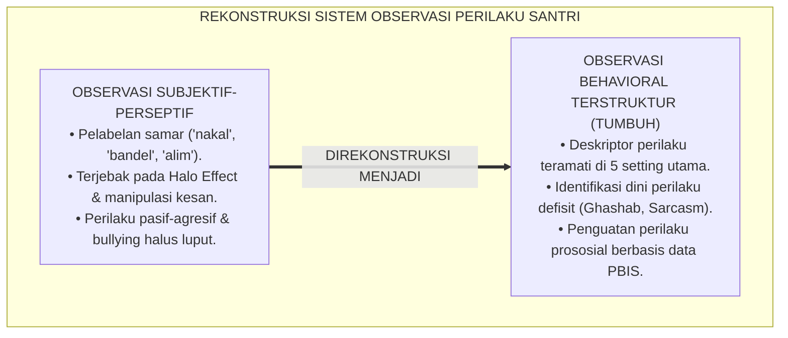
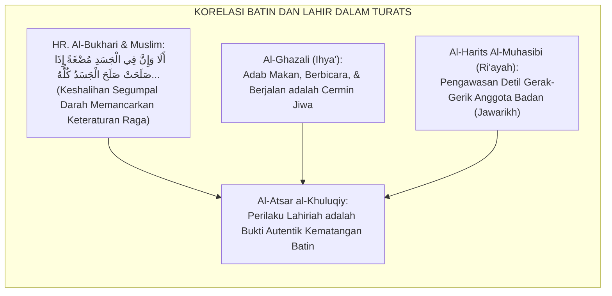
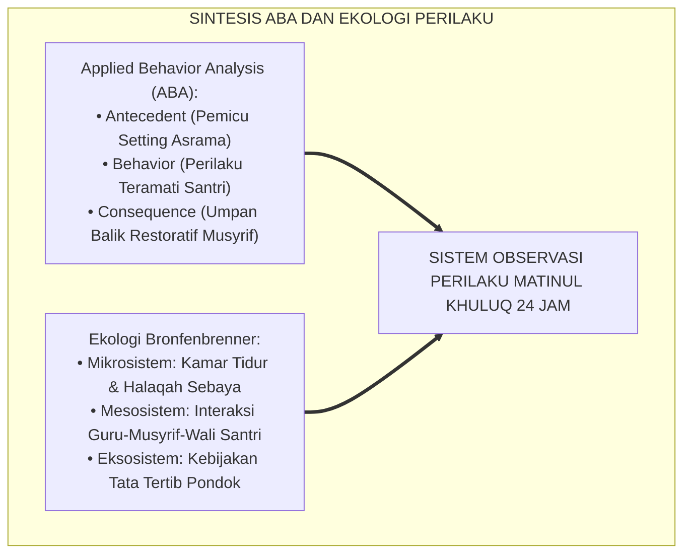
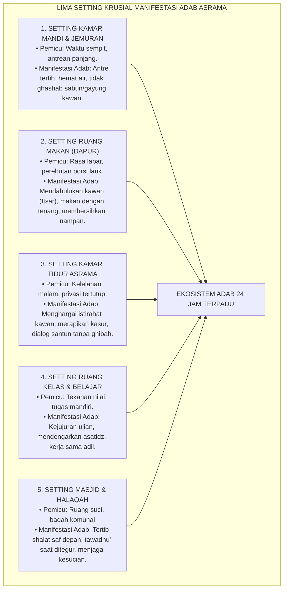
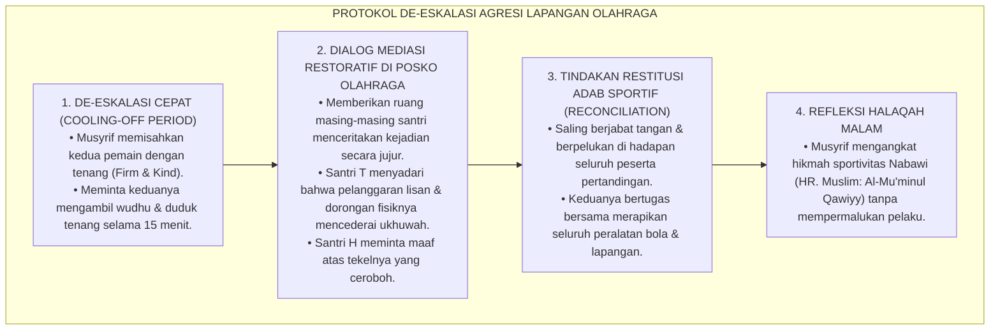
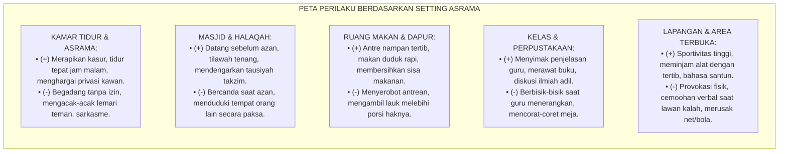

# P3-06-06: MANIFESTASI PERILAKU SANTRI MATINUL KHULUQ
## *Monograf Riset Akademik: Tipologi Indikator Perilaku Teramati (Observable Behaviors), Pemetaan Setting 24 Jam (Kamar, Kelas, Masjid, Dapur, & Ruang Olahraga), Eliminasi Perilaku Anti-Sosial (Ghashab, Bullying, Sarkasme), dan Rekonstruksi Budaya Bi'ah Shalihah di Pesantren*

**Nomor Identifikasi**: `P3-06-06/MONOGRAF-RISET-MANIFESTASI-PERILAKU-MATINUL-KHULUQ/2026`  
**Domain**: `03 Capacity Framework` > `06 Matinul Khuluq` (Sub-Modul 06: *Behavioral Manifestations*)  
**Klasifikasi Naskah**: *Academic Research Monograph* (Monograf Penelitian Observasi Perilaku, Rekayasa Ekologi Asrama, & Analitik PBIS)  
**Rumpun Disiplin Pengkaji**: Analisis Perilaku Terapan (*Applied Behavior Analysis*), Sosiologi Mikro Komunitas Santri, Ekologi Perkembangan Remaja, Manajemen Disiplin Positif  

---

> ### 💡 INTISARI EKSEKUTIF (EXECUTIVE SUMMARY)
>
> * **Kelemahan Penilaian Karakter Berbasis Persepsi:**  
>   Evaluasi akhlak di pesantren konvensional kerap bertumpu pada kesan subjektif (*Halo Effect* / *Impression Management*) tanpa instrumen observasi perilaku faktual. Akibatnya, santri yang pandai menarik muka manis di depan guru dinilai berakhlak tinggi, sedangkan santri pendiam atau korban perundungan kerap terabaikan atau bahkan dicap bermasalah saat mengekspresikan frustrasinya.
> * **Pemetaan Manifestasi Perilaku 24 Jam TUMBUH:**  
>   Ekosistem TUMBUH merumuskan **Katalog Manifestasi Perilaku Teramati (*Observable Behavioral Matrix*)** yang membagi perilaku santri ke dalam dua kutub distingtif: *Indikator Perilaku Konstruktif-Adabi (Benchmark Perilaku Diharapkan)* dan *Indikator Perilaku Defisit/Destruktif (Titik Intervensi Restoratif)*, yang dipetakan secara presisi di seluruh setting spasial asrama 24 jam.
> * **Standardisasi Observasi & Triad Pengasuhan:**  
>   Matriks perilaku ini menjadi panduan operasional bersama bagi guru madrasah dan musyrif asrama untuk memantau, mendokumentasikan, dan memperkuat pembiasaan adab lisan, integritas muamalah, dan ukhuwah santri secara objektif dan non-stigmatisasi.

---

## 📑 DAFTAR ISI MONOGRAF

- [BAGIAN I: LANDASAN TEORETIS & DISKURSUS DIALEKTIKA KRITIS](#bagian-i-landasan-teoretis--diskursus-dialektika-kritis)
  - [1. Latar Belakang Masalah: Bahaya Bias Persepsi & Ketiadaan Indikator Perilaku Operasional](#1-latar-belakang-masalah-bahaya-bias-persepsi--ketiadaan-indikator-perilaku-operasional)
  - [2. Eksegesis Turats: Konsep Al-Atsar al-Khuluqiy (Jejak Perilaku Lahiriah dari Kesiapan Batin)](#2-eksegesis-turats-konsep-al-atsar-al-khuluqiy-jejak-perilaku-lahiriah-dari-kesiapan-batin)
  - [3. Konvergensi Sains Analisis Perilaku Terapan (ABA) & Psikologi Ekologi Bronfenbrenner](#3-konvergensi-sains-analisis-perilaku-terapan-aba--psikologi-ekologi-bronfenbrenner)
  - [4. Analisis Rekayasa Kausalitas Setting 24 Jam: Mikro-Ekologi Kamar Mandi, Ruang Makan, & Kamar Tidur](#4-analisis-rekayasa-kausalitas-setting-24-jam-mikro-ekologi-kamar-mandi-ruang-makan--kamar-tidur)
  - [5. Kasuistika Lapangan Klinis & Protokol De-eskalasi Perilaku Agresif di Lapangan Olahraga](#5-kasuistika-lapangan-klinis--protokol-de-eskalasi-perilaku-agresif-di-lapangan-olahraga)
- [BAGIAN II: FORMULASI KONSEPTUAL & PEMBAHASAN MENDALAM](#bagian-ii-formulasi-konseptual--pembahasan-mendalam)
  - [1. Katalog Manifestasi Perilaku Berdasarkan Empat Pilar Matinul Khuluq](#1-katalog-manifestasi-perilaku-berdasarkan-empat-pilar-matinul-khuluq)
  - [2. Pemetaan Matriks Perilaku Lintas Setting Spasial Asrama 24 Jam](#2-pemetaan-matriks-perilaku-lintas-setting-spasial-asrama-24-jam)
  - [3. Matriks Diferensiasi Perilaku Positif vs Perilaku Defisit Berdasarkan Jenjang J1–J4](#3-matriks-diferensiasi-perilaku-positif-vs-perilaku-defisit-berdasarkan-jenjang-j1j4)
  - [4. Diskusi Akademis & Implikasi bagi Kebijakan Disiplin Positif Pesantren](#4-diskusi-akademis--implikasi-bagi-kebijakan-disiplin-positif-pesantren)
- [BAGIAN III: KESIMPULAN & APARATUS AKADEMIS](#bagian-iii-kesimpulan--aparatus-akademis)
  - [1. Tabel Sintesis Manifestasi Perilaku Matinul Khuluq](#1-tabel-sintesis-manifestasi-perilaku-matinul-khuluq)
  - [2. Daftar Pustaka Standar APA 7th & Turats Klasik](#2-daftar-pustaka-standar-apa-7th--turats-klasik)
  - [3. Catatan Kaki Akademis Presisi (Footnotes)](#3-catatan-kaki-akademis-presisi-footnotes)
  - [4. Glosarium Istilah Ilmiah & Observasi Perilaku](#4-glosarium-istilah-ilmiah--observasi-perilaku)

---

# BAGIAN I: LANDASAN TEORETIS & DISKURSUS DIALEKTIKA KRITIS

---

### 1. Latar Belakang Masalah: Bahaya Bias Persepsi & Ketiadaan Indikator Perilaku Operasional

Dalam evaluasi keseharian di asrama pesantren, penilaian adab santri kerap terjerembab ke dalam **tiga jebakan metodologis (*Methodological Traps*)**:[^1]

1. **Bias Kesan Menipu (*Halo Effect Trap*)**: Santri yang memiliki artikulasi verbal bagus atau berwajah menarik kerap diasumsikan secara otomatis memiliki akhlak yang baik, meskipun di kamar asrama ia sering menyakiti teman sekamarnya.
2. **Ketiadaan Batasan Operasional (*Lack of Behavioral Operationalization*)**: Istilah-istilah seperti "tidak sopan" atau "nakal" digunakan secara longgar oleh musyrif tanpa deskriptor perilaku yang spesifik. Akibatnya, seorang santri bisa dihukum hanya karena menatap mata musyrif saat berbicara (yang sebenarnya merupakan tanda menyimak aktif), sementara santri lain yang menyindir temannya secara halus (*Passive-Aggressive Sarcasm*) dibiarkan lolos.
3. **Kegagalan Mengidentifikasi Perilaku Terselubung (*Covert Anti-Social Behaviors*)**: Bentuk-bentuk kezaliman modern di asrama—seperti pengucilan sosial (*Social Ostracism*), sindiran digital di grup tertutup, atau perampasan halus barang kebutuhan (*Micro-Ghashab*)—kerap tidak terdeteksi karena instrumen pengawasan musyrif hanya menyasar pelanggaran kasar yang tampak kasat mata (*Overt Misbehavior*).[^2]

Model riset **TUMBUH** merumuskan sistem indikator perilaku yang **konkret, teramati (*observable*), terukur (*measurable*), dan bebas dari bias subjektif**.

---

### 2. Eksegesis Turats: Konsep Al-Atsar al-Khuluqiy (Jejak Perilaku Lahiriah dari Kesiapan Batin)

Dalam pandangan ulama Turats, kondisi batin yang bersih (*Thaharatul Batin*) niscaya memancarkan indikator fisik dan perilaku lahiriah yang dapat dikenali.

#### 📖 Teks Hadits Shahih tentang Integrasi Qalb dan Jawarikh
Rasulullah SAW bersabda dalam Hadits Shahih Al-Bukhari dan Muslim dari An-Nu'man bin Basyir RA:

$$\text{أَلَا وَإِنَّ فِي الْجَسَدِ مُضْغَةً، إِذَا صَلَحَتْ صَلَحَ الْجَسَدُ كُلُّهُ، وَإِذَا فَسَدَتْ فَسَدَ الْجَسَدُ كُلُّهُ، أَلَا وَهِيَ الْقَلْبُ}$$

*"Ingatlah, sesungguhnya di dalam tubuh itu ada segumpal daging; apabila ia baik, maka baiklah seluruh tubuh itu, dan apabila ia rusak, maka rusaklah seluruh tubuh itu. Ingatlah, segumpal daging itu adalah kalbu!"* (HR. Al-Bukhari No. 52; HR. Muslim No. 1599).[^3]

Hadits ini menjadi landasan ilmiah bahwa seluruh gerak anggota badan—cara berbicara, cara memandang teman, cara merawat barang, dan cara berjalan—merupakan manifestasi langsung (*Direct Manifestation*) dari kondisi spiritual kalbu santri.

#### 📖 Formulasi Imam Al-Harits Al-Muhasibi dalam *Ar-Ri'ayah li Huquqillah*
Imam **Al-Harits Al-Muhasibi** menjelaskan bahwa pembinaan adab menuntut pengamatan mendalam terhadap gerak-gerik panca indra (*Dhabthul Jawarikh*):

$$\text{فَإِذَا اسْتَقَامَ الْقَلْبُ عَلَى صِدْقِ الْمُرَاقَبَةِ، ظَهَرَتْ ثَمَرَاتُهُ عَلَى الْجَوَارِحِ: فَعَفَّ اللِّسَانُ عَنِ الْغِيبَةِ وَالْفُحْشِ، وَغَضَّ الْبَصَرُ عَنِ الْعَوْرَاتِ، وَكَفَّتِ الْيَدُ عَنْ تَنَاوُلِ حُقُوقِ الْإِخْوَانِ}$$

*"Maka apabila kalbu telah istiqamah di atas kesadaran muraqabah yang jujur, niscaya tampaklah buah manisnya pada anggota raga: lisan akan terjaga dari ghibah dan kekejian, pandangan mata akan tertunduk dari aurat, dan tangan akan tertahan dari mengambil hak-hak saudara sesama santri."*[^4]

---

### 3. Konvergensi Sains Analisis Perilaku Terapan (ABA) & Psikologi Ekologi Bronfenbrenner

Pengamatan manifestasi perilaku santri memadukan prinsip *Applied Behavior Analysis (ABA)* dan teori sistem ekologi:

1. **Model A-B-C Analisis Perilaku Terapan (*Antecedent-Behavior-Consequence*)**:  
   Perilaku tidak terjadi dalam ruang hampa. Pelanggaran adab (misal: berebut gayung di kamar mandi subuh) memiliki *Antecedent* (antrean panjang, minimnya pengawasan, rasa kantuk) dan *Consequence* (hukuman atau pembiaran). Memahami rantai ini memungkinkan musyrif merekayasa pemicu agar melahirkan perilaku adab yang diharapkan.[^5]
2. **Pengaruh Mikrosistem Asrama (Bronfenbrenner, 1979)**:  
   Kamar tidur santri adalah mikrosistem paling berpengaruh. Norma informal yang terbangun di kamar tidur (*Dorm Room Peer Norms*) jauh lebih kuat membentuk perilaku harian santri dibandingkan ceramah umum di aula.[^6]

---

### 4. Analisis Rekayasa Kausalitas Setting 24 Jam: Mikro-Ekologi Kamar Mandi, Ruang Makan, & Kamar Tidur

Karakter Matinul Khuluq diuji dan dimanifestasikan secara nyata pada titik-titik krusial kehidupan asrama:

---

### 5. Kasuistika Lapangan Klinis & Protokol De-eskalasi Perilaku Agresif di Lapangan Olahraga

#### Studi Kasus Lapangan: Insiden Perkelahian Santri Akibat Sengketa Permainan Sepak Bola
* **Konteks Masalah**: Saat pertandingan olahraga sore, Santri T (15 tahun, J2) ditekel secara tidak sengaja oleh Santri H (15 tahun, J2). Santri T langsung bangkit, melontarkan makian kotor, dan mendorong Santri H hingga memicu ketegangan antar-kamar pendukung.
* **Kelemahan Penanganan Konvensional**: Musyrif konvensional langsung menghentikan pertandingan, memarahi kedua belah pihak di lapangan, dan melarang olahraga selama sebulan. Akibatnya, ketegangan terpendam dan berlanjut menjadi perkelahian diam-diam di lorong asrama pada malam hari.
* **Protokol De-eskalasi & Resolusi Restoratif TUMBUH**:

Insiden ini berhasil diubah menjadi momen pembelajaran (*Teachable Moment*) yang menguatkan persaudaraan dan sportivitas seluruh santri.[^7]

---

# BAGIAN II: FORMULASI KONSEPTUAL & PEMBAHASAN MENDALAM

---

### 1. Katalog Manifestasi Perilaku Berdasarkan Empat Pilar Matinul Khuluq

Tabel berikut menyajikan pemetaan komparatif antara manifestasi perilaku beradab yang diharapkan (*Target Benchmarks*) dan perilaku defisit yang harus dieliminasi (*Deficit Indicators*):

| Pilar Matinul Khuluq | Manifestasi Perilaku Konstruktif-Adabi (*Target Benchmarks*) | Manifestasi Perilaku Defisit/Destruktif (*Intervention Targets*) |
| :--- | :--- | :--- |
| **1. Ash-Shidq (Kejujuran)** | • Menyampaikan kronologi kejadian apa adanya tanpa manipulasi. • Mengakui secara jujur saat belum mengerjakan tugas/hafalan. • Mengembalikan barang milik orang lain yang ditemukan di posko. • Menjaga orisinalitas riset dan ujian akademik. | • Berbohong atau mengarang cerita saat diinterogasi musyrif. • Mencontek, membuka catatan ilegal, atau menyuruh kawan mengerjakan tugas. • Menyembunyikan barang temuan untuk kepentingan pribadi. • Mencari pembenaran palsu saat terlambat bangun shalat. |
| **2. At-Tawadhu' (Rendah Hati)** | • Menyapa dan mengucapkan salam 5S dengan senyuman tulus. • Memanggil nama teman dengan panggilan yang baik dan disukai. • Mendengarkan kritik teman atau musyrif dengan tenang. • Rela membersihkan area umum tanpa memandang status kelas. | • Melontarkan ejekan fisik (*Body Shaming*), logat, atau latar belakang keluarga. • Menyebut kawan dengan julukan hewan atau gelar yang merendahkan. • Bersikap arogan, menolak ditegur, dan membentak adik kelas. • Menolak tugas piket karena merasa "sudah senior". |
| **3. Asy-Syaja'ah (Keberanian)** | • Mengatakan "tidak" secara santun saat diajak melanggar tata tertib. • Menegur atau membela kawan yang sedang diejek (*Upstander*). • Berani meminta maaf secara terbuka ketika berbuat salah. • Menyampaikan aspirasi asrama secara santun melalui forum resmi. | • Takut menolak ajakan merokok/gawai karena cemas dikucilkan sebaya. • Menjadi penonton pasif saat melihat perundungan di kamar tidur. • Bersikap defensif, lari dari tanggung jawab, atau menyalahkan orang lain. • Menyebarkan provokasi atau gosip (*Ghibah*) di belakang layar. |
| **4. Al-Amanah (Tanggung Jawab)** | • Menjaga perlengkapan mandi/pakaian pribadi secara rapi. • Meminjam barang kawan dengan izin resmi dan mengembalikannya utuh. • Menjaga kebersihan dan fasilitas kamar mandi umum. • Menyelesaikan tugas organisasi dan keuangan secara transparan. | • Menggunakan sandal, sabun, atau pakaian kawan tanpa izin (*Ghashab*). • Merusak fasilitas ranjang, lemari, atau mencoret-coret dinding kamar. • Mengabaikan jadwal piket kamar mandi sehingga kotor dan bau. • Menggunakan uang kas organisasi santri untuk kepentingan pribadi. |

---

### 2. Pemetaan Matriks Perilaku Lintas Setting Spasial Asrama 24 Jam

---

### 3. Matriks Diferensiasi Perilaku Positif vs Perilaku Defisit Berdasarkan Jenjang J1–J4

| Jenjang Pendidikan | Indikator Perilaku Konstruktif Utama (*Benchmark J1–J4*) | Indikator Perilaku Kritis yang Wajib Diintervensi |
| :--- | :--- | :--- |
| **Jenjang J1 (Kelas 7)** | • Menerapkan adab 5S kepada seluruh ustadz, musyrif, dan santri senior. • Menata lemari pakaian sendiri dan tidak memakai barang orang lain. • Tepat waktu bangun Shubuh dan tidur malam secara mandiri. | • Menangis histeris berkepanjangan tanpa mau berinteraksi (*Severe Homesickness*). • Mengambil sabun/sandal teman tanpa izin (*Micro-Ghashab* awal). • Berkata bohong karena takut dihukum musyrif. |
| **Jenjang J2 (Kelas 8–9)** | • Menjaga lisan dari umpatan kotor saat bermain atau bercanda. • Menyelesaikan tugas piket kamar mandi bersama tanpa mengeluh. • Mengakui kesalahan secara langsung kepada musyrif. | • Menggunakan julukan buruk (*Al-Alqab*) untuk merendahkan kawan sekamar. • Melakukan aksi boikot sosial (*Silent Treatment*) terhadap santri tertentu. • Membantah teguran musyrif dengan nada tinggi atau membanting pintu. |
| **Jenjang J3 (Kelas 10–11)** | • Menjunjung kejujuran akademik mutlak (nol toleransi menyontek). • Berani menegur kawan yang berbuat zalim (*Upstander Action*). • Mengelola kegiatan ekstrakurikuler dengan laporan terbuka. | • Memanfaatkan status kelas atas untuk menyuruh santri baru secara sepihak. • Melakukan kecurangan akademik atau plagiasi tugas karya tulis. • Bersikap apatis dan pura-pura tidak melihat perundungan. |
| **Jenjang J4 (Kelas 12)** | • Menjadi teladan hidup (*Qudwah*) dalam kedisiplinan dan ibadah asrama. • Membimbing santri junior dengan kelembutan dan perhatian tulus. • Memediasi dan mendamaikan potensi konflik antar-santri. | • Menunjukkan arogansi senioritas atau menuntut privilese berlebih. • Membiarkan tradisi perpeloncoan kamar tetap berlangsung. • Melanggar aturan perizinan pondok dengan dalih "sudah kelas akhir". |

---

### 4. Diskusi Akademis & Implikasi bagi Kebijakan Disiplin Positif Pesantren

Penerapan katalog manifestasi perilaku Matinul Khuluq membawa dampak transformatif:

1. **Objektivitas Asesmen Harian (*Objective Behavioral Tracking*)**: Guru dan musyrif memiliki instrumen bahasa perilaku yang sama (*Common Behavioral Language*), sehingga tidak ada lagi santri yang menjadi korban ketidakadilan persepsi.
2. **Penguatan Intervensi Berbasis Penguatan Positif (*Positive Reinforcement Dominance*)**: Musyrif dilatih untuk menangkap basah perilaku baik santri (*Catching Students Being Good*)—misalnya mengapresiasi santri yang berinisiatif memungut sampah di lorong atau santri yang meminjamkan buku dengan santun.
3. **Penciptaan Bi'ah Shalihah yang Nyata dan Terasa**: Pesantren bertransformasi menjadi lingkungan yang memancarkan ketenangan (*Sakinah*), di mana setiap santri merasa aman, dihormati martabatnya, dan termotivasi untuk saling berlomba dalam kebaikan (*Fastabiqul Khairat*).[^8]

---

# BAGIAN III: KESIMPULAN & APARATUS AKADEMIS

---

### 1. Tabel Sintesis Manifestasi Perilaku Matinul Khuluq

| Setting Kehidupan 24 Jam | Tantangan Perilaku Kunci | Manifestasi Perilaku Diharapkan (TUMBUH) | Protokol Pengawasan Musyrif | Bukti Terukur Capaian |
| :--- | :--- | :--- | :--- | :--- |
| **1. Kamar Tidur & Asrama** | Privasi, kebersihan, ghashab, begadang. | Merapikan kasur mandiri, izin resmi pinjam barang, istirahat tepat waktu. | *Active Roaming Supervision* & Apresiasi Kamar Terbersih Mingguan. | 0 kasus *ghashab*; kamar rapi dan wangi setiap inspeksi. |
| **2. Kamar Mandi & Sanitasi** | Antrean panjang, berebut air, kebersihan. | Antre tertib, hemat air, membersihkan lantai pasca-mandi, sabun pribadi. | Visual Cue Adab Mandi & Pembagian Jadwal Tertib per Kamar. | Tidak ada penumpukan antrean; lantai bersih bebas sampah plastik. |
| **3. Ruang Makan / Dapur** | Berebut lauk, buang sisa makanan, adab makan. | Mengambil porsi adil, makan duduk tertib, membersihkan nampan dan meja. | Musyrif makan bersama santri (*Qudwah*) & Edukasi Anti-Mubazir. | Sisa makanan mendekati nol (*Zero Food Waste*); meja makan bersih. |
| **4. Kelas & Madrasah** | Menyontek, gaduh, adab terhadap guru. | Kejujuran ujian 100%, menyimak takzim, menghargai pendapat kawan. | Manajemen Kelas Positif & Kontrak Belajar Beradab Bersama. | Orisinalitas tugas 100%; suasana kelas interaktif dan khidmat. |
| **5. Masjid & Ibadah** | Terlambat, bercanda saat qamat, saf renggang. | Hadir sebelum azan, saf depan rapi rapat, zikir khusyuk dan tertib. | Musyrif berdiri di barisan saf & menyambut santri di pintu masjid. | Kehadiran tepat waktu $\ge 98\%$; masjid hening dan khusyuk. |

---

### 2. Daftar Pustaka Standar APA 7th & Turats Klasik

1. **Al-Bukhari, Abu Abdillah Muhammad bin Ismail.** (1422 H). *Shahih Al-Bukhari*. Beirut: Dar Thawq An-Najah.
2. **Al-Ghazali, Hujjatul Islam Abu Hamid Muhammad bin Muhammad.** (2018). *Ihya' 'Ulumiddin*. Beirut: Dar Al-Kutub Al-'Ilmiyyah.
3. **Al-Muhasibi, Al-Harits bin Asad.** (1985). *Ar-Ri'ayah li Huquqillah*. Tahqiq: Dr. Abdul Qadir Ahmad 'Atha. Kairo: Dar Al-Kutub Al-Haditsah.
4. **Bandura, A.** (1986). *Social Foundations of Thought and Action: A Social Cognitive Theory*. Englewood Cliffs: Prentice-Hall.
5. **Bronfenbrenner, U.** (1979). *The Ecology of Human Development: Experiments by Nature and Design*. Cambridge: Harvard University Press.
6. **Cooper, J. O., Heron, T. E., & Heward, W. L.** (2020). *Applied Behavior Analysis* (3rd ed.). Boston: Pearson.
7. **Muslim bin Al-Hajjaj An-Naisaburi.** (2006). *Shahih Muslim*. Riyadh: Dar Thayyibah.
8. **Nelsen, J., & Lott, L.** (2013). *Positive Discipline in the Classroom*. New York: Harmony Books.
9. **Sugai, G., & Horner, R. H.** (2020). *School-Wide Positive Behavioral Interventions and Supports: Implementation Practices*. *Journal of Positive Behavior Interventions*, 22(4), 203-211.
10. **Zehr, H.** (2015). *The Little Book of Restorative Justice*. New York: Good Books.

---

### 3. Catatan Kaki Akademis Presisi (Footnotes)

[^1]: Pembahasan bias persepsi dan efek halo dalam observasi perilaku siswa di institusi pendidikan, Cooper, Heron, & Heward (2020, hlm. 64).  
[^2]: Fenomena agresi terselubung dan bullying relasional di lingkungan asrama remaja, Bandura (1986, hlm. 142).  
[^3]: HR. Al-Bukhari dalam *Shahih Al-Bukhari* (No. 52) dan HR. Muslim dalam *Shahih Muslim* (No. 1599).  
[^4]: Al-Harits Al-Muhasibi, *Ar-Ri'ayah li Huquqillah* (1985, hlm. 82).  
[^5]: Prinsip Analisis Perilaku Terapan (ABA) model Tiga Rantai Kontingensi (A-B-C), Cooper, Heron, & Heward (2020, hlm. 88–95).  
[^6]: Teori Sistem Ekologi Perkembangan Manusia, Bronfenbrenner (1979, hlm. 45–52).  
[^7]: Protokol de-eskalasi emosi dan mediasi damai dalam kegiatan fisik remaja, Nelsen & Lott (2013, hlm. 194).  
[^8]: Dampak sistemik rekayasa lingkungan asrama ramah adab berbasis PBIS, Sugai & Horner (2020, hlm. 210).  

---

### 4. Glosarium Istilah Ilmiah & Observasi Perilaku

1. **Observable Behaviors (Perilaku Teramati)**: Manifestasi tindakan nyata santri yang dapat dilihat, didengar, dan diukur frekuensinya secara objektif oleh pengamat tanpa interpretasi spekulatif.
2. **Halo Effect**: Bias kognitif di mana kesan positif awal terhadap seseorang pada satu aspek mempengaruhi persepsi menyeluruh terhadap karakternya secara tidak adil.
3. **Micro-Ghashab**: Praktik memakai atau mengambil barang-barang kebutuhan harian teman (sandal, sabun, odol, deterjen) dalam jumlah kecil tanpa izin yang sering dianggap remeh namun merusak integritas moral.
4. **Antecedent-Behavior-Consequence (A-B-C)**: Kerangka kerja analisis perilaku yang meneliti peristiwa pemicu sebelum tindakan (A), bentuk perilaku nyata (B), dan dampak atau respons lingkungan setelah tindakan (C).
5. **Upstander Action**: Tindakan aktif santri yang berani melakukan intervensi moral atau melapor secara aman untuk menghentikan kezaliman terhadap temannya.
6. **Social Ostracism**: Bentuk perundungan relasional di mana seorang santri diabaikan, diboikot, atau dikucilkan secara sistematis dari pergaulan kamar atau kelompok sebaya.
7. **Dhabthul Jawarikh (ضَبْطُ الْجَوَارِحِ)**: Pengendalian dan pendisiplinan seluruh anggota raga (lisan, mata, telinga, tangan, kaki) agar selaras dengan panduan adab syariat.
8. **Itsar (الْإِيثَارُ)**: Sikap mulia mendahulukan kepentingan dan kebutuhan saudara sesama mukmin di atas kepentingan diri sendiri dalam urusan duniawi.
9. **Active Roaming Supervision**: Metode pengawasan aktif di mana musyrif bergerak secara teratur berkeliling di berbagai area asrama sambil berinteraksi hangat dengan para santri.
10. **Positive Reinforcement Ratio (Rasio 4:1)**: Standar pengasuhan PBIS di mana musyrif memberikan minimal 4 pengakuan/apresiasi perilaku positif untuk setiap 1 koreksi pelanggaran.
