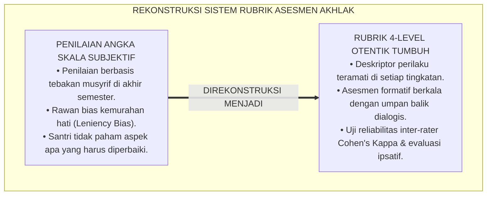
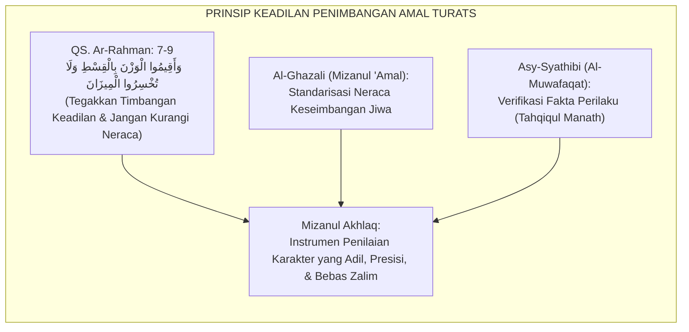
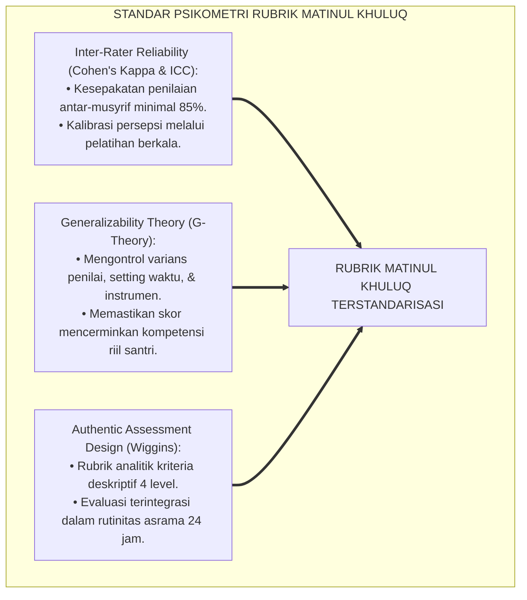
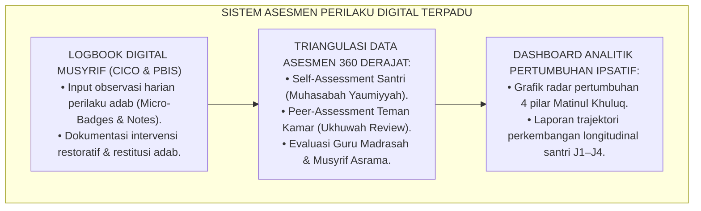
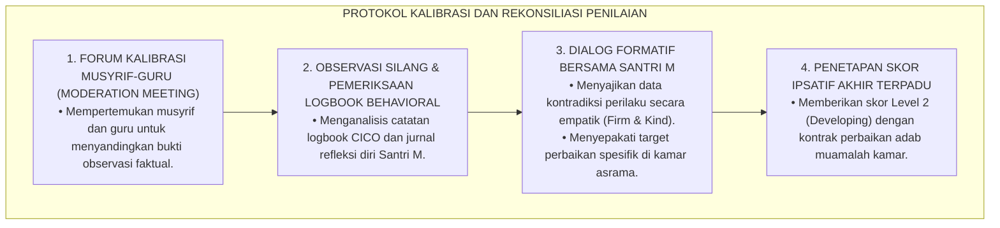
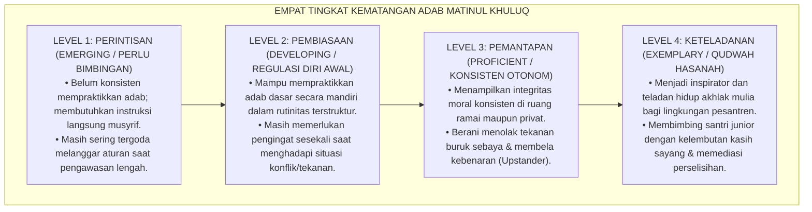
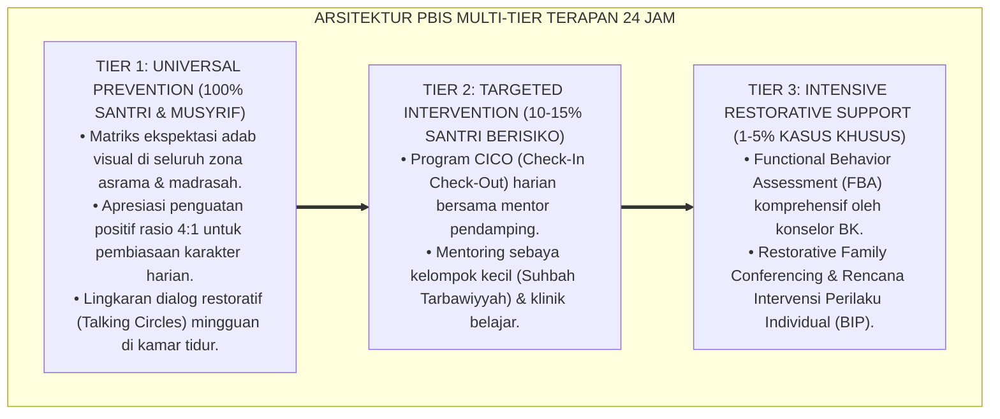

# P3-06-07: RUBRIK INDIKATOR PERILAKU 4-LEVEL MATINUL KHULUQ
## *Monograf Riset Akademik: Perancangan Rubrik Asesmen Otentik Berbasis Kriteria (Criterion-Referenced Rubrics), Gradasi Deskriptor Kinerja 4 Level Kematangan Moral, Protokol Pengujian Validitas Konstruk & Reliabilitas Inter-Rater, Serta Implementasi Evaluasi Ipsatif di Pesantren 24 Jam*

**Nomor Identifikasi**: `P3-06-07/MONOGRAF-RISET-RUBRIK-4LEVEL-MATINUL-KHULUQ/2026`  
**Domain**: `03 Capacity Framework` > `06 Matinul Khuluq` (Sub-Modul 07: *4-Level Behavior Rubric*)  
**Klasifikasi Naskah**: *Academic Research Monograph* (Monograf Penelitian Asesmen Otentik, Psikometri Rubrik Perilaku, & Metodologi Evaluasi Karakter)  
**Rumpun Disiplin Pengkaji**: Psikometri Pendidikan, Desain Rubrik Asesmen Otentik, Evaluasi Karakter Pesantren, Metodologi Observasi Berkelanjutan  

---

> ### 💡 INTISARI EKSEKUTIF (EXECUTIVE SUMMARY)
>
> * **Krisis Instrumen Penilaian Sikap Konvensional:**  
>   Penilaian sikap spiritual dan sosial di madrasah/pesantren kerap menggunakan skala Likert sederhana (misal: skor 1 s/d 4) tanpa deskriptor perilaku yang operasional. Akibatnya, angka nilai rapor ditentukan oleh preferensi subjektif guru/musyrif (*Rater Bias*), rentan terhadap efek kemurahan hati (*Leniency Effect*), dan tidak memberikan umpan balik diagnostik yang bermakna bagi santri.
> * **Arsitektur Rubrik 4-Level Matinul Khuluq TUMBUH:**  
>   Ekosistem TUMBUH merumuskan **Rubrik Asesmen Otentik 4-Level Berbasis Kriteria Kinerja (*Criterion-Referenced Behavioral Rubrics*)** untuk keempat pilar Matinul Khuluq: (1) *Level 1: Perintisan / Berkembang dengan Panduan (Emerging / Inisiatif Rendah)*, (2) *Level 2: Pembiasaan / Berkembang Mandiri Terbatas (Developing / Regulasi Diri Awal)*, (3) *Level 3: Pemantapan / Konsisten Otonom (Proficient / Integritas Matang)*, dan (4) *Level 4: Keteladanan / Qudwah Hasanah (Exemplary / Inspirator Lingkungan)*.
> * **Metodologi Pengujian & Evaluasi Ipsatif:**  
>   Monograf ini menetapkan protokol pengujian reliabilitas lintas-penilai (*Inter-Rater Reliability Cohen's Kappa $\ge 0.85$*), pedoman triangulasi data 360 derajat (Santri, Sebaya, Guru, Musyrif), serta penerapan evaluasi ipsatif longitudinal sepanjang 6 tahun jenjang J1–J4.

---

## 📑 DAFTAR ISI MONOGRAF

- [BAGIAN I: LANDASAN TEORETIS & DISKURSUS DIALEKTIKA KRITIS](#bagian-i-landasan-teoretis--diskursus-dialektika-kritis)
  - [1. Latar Belakang Masalah: Bahaya Angka Rapor Fiktif & Subjektivitas Penilaian Karakter](#1-latar-belakang-masalah-bahaya-angka-rapor-fiktif--subjektivitas-penilaian-karakter)
  - [2. Eksegesis Turats: Konsep Mizanul Akhlaq & Keadilan dalam Penimbangan Perilaku Manusia](#2-eksegesis-turats-konsep-mizanul-akhlaq--keadilan-dalam-penimbangan-perilaku-manusia)
  - [3. Konvergensi Sains Psikometri: Teori Generalisabilitas, Reliabilitas Inter-Rater, & Rubrik Otentik](#3-konvergensi-sains-psikometri-teori-generalisabilitas-reliabilitas-inter-rater--rubrik-otentik)
  - [4. Rekayasa Sistem Asesmen 24 Jam: Integrasi Logbook Digital Musyrif & Evaluasi Ipsatif](#4-rekayasa-sistem-asesmen-24-jam-integrasi-logbook-digital-musyrif--evaluasi-ipsatif)
  - [5. Kasuistika Lapangan Klinis & Protokol Resolusi Anomali Penilaian Antar-Musyrif](#5-kasuistika-lapangan-klinis--protokol-resolusi-anomali-penilaian-antar-musyrif)
- [BAGIAN II: FORMULASI KONSEPTUAL & PEMBAHASAN MENDALAM](#bagian-ii-formulasi-konseptual--pembahasan-mendalam)
  - [1. Arsitektur Komprehensif Rubrik 4-Level Karakter Matinul Khuluq](#1-arsitektur-komprehensif-rubrik-4-level-karakter-matinul-khuluq)
  - [2. Matriks Rinci Deskriptor Kinerja 4 Level Berdasarkan Empat Pilar Inti](#2-matriks-rinci-deskriptor-kinerja-4-level-berdasarkan-empat-pilar-inti)
  - [3. Panduan Pembobotan, Skoring Ipsatif, dan Penentuan Kenaikan Jenjang J1–J4](#3-panduan-pembobotan-skoring-ipsatif-dan-penentuan-kenaikan-jenjang-j1j4)
  - [4. Diskusi Akademis & Implikasi bagi Tata Kelola Evaluasi Mutu Pendidikan Karakter](#4-diskusi-akademis--implikasi-bagi-tata-kelola-evaluasi-mutu-pendidikan-karakter)
- [BAGIAN III: KESIMPULAN & APARATUS AKADEMIS](#bagian-iii-kesimpulan--aparatus-akademis)
  - [1. Tabel Sintesis Struktur Rubrik 4-Level Matinul Khuluq](#1-tabel-sintesis-struktur-rubrik-4-level-matinul-khuluq)
  - [2. Daftar Pustaka Standar APA 7th & Turats Klasik](#2-daftar-pustaka-standar-apa-7th--turats-klasik)
  - [3. Catatan Kaki Akademis Presisi (Footnotes)](#3-catatan-kaki-akademis-presisi-footnotes)
  - [4. Glosarium Istilah Ilmiah & Psikometri Asesmen](#4-glosarium-istilah-ilmiah--psikometri-asesmen)

---

# BAGIAN I: LANDASAN TEORETIS & DISKURSUS DIALEKTIKA KRITIS

---

### 1. Latar Belakang Masalah: Bahaya Angka Rapor Fiktif & Subjektivitas Penilaian Karakter

Dalam tradisi evaluasi pendidikan Islam formal, penilaian karakter santri sering kali menghadapi krisis akurasi yang akut:[^1]

1. **Sindrom Angka Rapor Fiktif (*Inflated Subjective Grading*)**: Guru atau musyrif yang dikejar tenggat waktu pengisian rapor kerap memberikan nilai seragam (misal: nilai A atau skor 85–90 untuk seluruh santri) tanpa didasarkan pada instrumen observasi autentik. Penilaian ini menipu orang tua santri dan menutup mata institusi terhadap masalah moral yang sebenarnya terjadi.
2. **Efek Kemurahan Hati & Efek Keras Hati (*Leniency and Severity Bias*)**: Tanpa rubrik deskriptor baku, seorang santri yang dinilai oleh musyrif A yang ramah bisa mendapatkan skor sempurna, sedangkan santri yang dinilai oleh musyrif B yang perfeksionis akan mendapatkan skor buruk, meskipun perilaku riil kedua santri tersebut identik.
3. **Ketiadaan Umpan Balik Transformatif (*Lack of Formative Feedback*)**: Angka nilai murni ("75") tidak memberitahu santri apa kelemahan spesifiknya dan tindakan apa yang harus ia perbaiki untuk mencapai derajat adab yang lebih tinggi.[^2]

Model riset **TUMBUH** merancang **Rubrik 4-Level Berbasis Kriteria Faktual (*Criterion-Referenced Rubrics*)** yang memberikan peta navigasi pertumbuhan adab yang transparan, akuntabel, dan memberdayakan.

---

### 2. Eksegesis Turats: Konsep Mizanul Akhlaq & Keadilan dalam Penimbangan Perilaku Manusia

Prinsip keadilan dan ketelitian dalam menilai amal manusia merupakan perintah sharih dalam wahyu Al-Qur'an.

#### 📖 Teks Al-Qur'an tentang Neraca Penimbangan yang Adil
Allah SWT berfirman dalam QS. Ar-Rahman [55]: 7–9:

$$\text{وَالسَّمَاءَ رَفَعَهَا وَوَضَعَ الْمِيزَانَ ۝ أَلَّا تَطْغَوْا فِي الْمِيزَانِ ۝ وَأَقِيمُوا الْوَزْنَ بِالْقِسْطِ وَلَا تُخْسِرُوا الْمِيزَانَ}$$

*"Dan Allah telah meninggikan langit dan Dia meletakkan neraca (keadilan). Agar kalian tidak melampaui batas pada neraca itu. Dan tegakkanlah timbangan itu dengan adil dan janganlah kalian mengurangi neraca itu."*[^3]

Ayat ini menegaskan bahwa setiap proses evaluasi moral wajib menggunakan instrumen timbangan (*Al-Mizan*) yang presisi dan adil. Memberikan penilaian buruk tanpa bukti atau menaikkan nilai secara fiktif termasuk dalam larangan *Takhsirul Mizan* (mengurangi timbangan keadilan).

#### 📖 Formulasi Imam Al-Ghazali dalam *Mizanul 'Amal*
Imam **Al-Ghazali** dalam risalah monumentalnya *Mizanul 'Amal* menjelaskan bahwa pengukuran kesempurnaan akhlak menuntut pemahaman terhadap batas-batas moderasi (*I'tidal*) perilaku:

$$\text{فَالْمِيزَانُ هُوَ الْعَدْلُ الَّذِي يُعْرَفُ بِهِ حَدُّ الِاعْتِدَالِ بَيْنَ الْإِفْرَاطِ وَالتَّفْرِيطِ؛ وَلَا يُمْكِنُ تَقْوِيمُ النَّفْسِ إِلَّا بِمَعْرِفَةِ مَوْضِعِ النَّقْصِ وَمَرَاتِبِ التَّرَقِّي فِي الْفَضِيلَةِ}$$

*"Maka neraca penimbang itu adalah keadilan yang melaluinya diketahui batas moderasi yang seimbang antara sikap berlebih-lebihan (Ifrath) dan sikap teledor (Tafrith); dan tidaklah mungkin memperbaiki jiwa manusia melainkan dengan mengetahui secara persis letak kekurangannya serta tahapan kenaikan derajatnya dalam kebajikan."*[^4]

---

### 3. Konvergensi Sains Psikometri: Teori Generalisabilitas, Reliabilitas Inter-Rater, & Rubrik Otentik

Sains psikometri modern menetapkan standar ilmiah bagi keabsahan instrumen asesmen perilaku:

1. **Uji Reliabilitas Antar-Penilai (*Inter-Rater Reliability*)**:  
   Untuk mengeliminasi bias subjektif musyrif, rubrik TUMBUH diuji menggunakan koefisien *Cohen's Kappa* ($\kappa$) untuk penilai ganda dan *Intraclass Correlation Coefficient (ICC)* untuk multi-penilai. Target reliabilitas ditetapkan pada nilai $\kappa \ge 0.85$, menjamin bahwa dua musyrif berbeda yang mengamati santri yang sama akan menghasilkan skor penilaian yang setara.[^5]
2. **Desain Asesmen Otentik Grant Wiggins (1998)**:  
   Rubrik dirancang tidak untuk menilai hafalan teori, melainkan menilai kinerja adab santri dalam situasi nyata (*Real-Life Performance Tasks*)—seperti saat santri membagi giliran antre kamar mandi, mengelola uang saku, atau menyelesaikan sengketa kawan kamar.[^6]

---

### 4. Rekayasa Sistem Asesmen 24 Jam: Integrasi Logbook Digital Musyrif & Evaluasi Ipsatif

Asesmen karakter Matinul Khuluq dioperasionalkan melalui ekosistem digital terpadu:

* **Pendekatan Evaluasi Ipsatif (*Ipsative Evaluation*)**:  
  Skor santri tidak diperbandingkan dengan santri lain secara kompetitif (*Norm-Referenced*), melainkan diperbandingkan dengan titik awal performa dirinya sendiri pada semester sebelumnya. Hal ini menumbuhkan *Growth Mindset* dan motivasi intrinsik untuk bertumbuh.[^7]

---

### 5. Kasuistika Lapangan Klinis & Protokol Resolusi Anomali Penilaian Antar-Musyrif

#### Studi Kasus Lapangan: Disparitas Penilaian Ekstrem antara Musyrif Kamar dan Guru Kelas
* **Konteks Masalah**: Santri M (15 tahun, Jenjang J2) mendapatkan nilai adab Level 4 (Sangat Baik) dari guru fiqih di madrasah karena rajin bertanya dan sopan di kelas. Namun, musyrif asrama memberikan nilai Level 1 (Kritis) karena Santri M kerap melalaikan piket kamar dan sering meminjam barang kawan tanpa izin.
* **Analisis Diagnostik**: Terjadi *Contextual Behavioral Disparity*. Santri M menampilkan kepatuhan selektif di ruang kelas formal namun mengalami kemunduran adab di ruang privat asrama.
* **Protokol Kalibrasi dan Triangulasi TUMBUH**:

Proses kalibrasi ini mencegah salah diagnosis dan melahirkan rencana pembinaan yang tepat sasaran bagi santri.[^8]

---

# BAGIAN II: FORMULASI KONSEPTUAL & PEMBAHASAN MENDALAM

---

### 1. Arsitektur Komprehensif Rubrik 4-Level Karakter Matinul Khuluq

Empat level kematangan karakter Matinul Khuluq distandarisasi sebagai berikut:

---

### 2. Matriks Rinci Deskriptor Kinerja 4 Level Berdasarkan Empat Pilar Inti

#### Matriks Rubrik Analitik Matinul Khuluq:

| Pilar Karakter | Level 1: Perintisan (*Emerging*) | Level 2: Pembiasaan (*Developing*) | Level 3: Pemantapan (*Proficient*) | Level 4: Keteladanan (*Exemplary/Qudwah*) |
| :--- | :--- | :--- | :--- | :--- |
| **1. Ash-Shidq (Kejujuran Radikal)** | Mengakui kesalahan hanya jika terdesak bukti; masih mencoba mencari alasan pembelaan diri; rentan menyontek saat ujian. | Berkata jujur saat ditanya musyrif tanpa berbelit-belit; menjauhi kecurangan ujian mandiri; mencatat mutaba'ah secara riil. | Berinisiatif mengakui khilaf pribadi sebelum ditegur; menjunjung tinggi orisinalitas riset; konsisten jujur dalam kondisi tertekan. | Menjadi rujukan integritas lembaga; berani bersaksi adil untuk membela kebenaran meski merugikan kelompok sebaya. |
| **2. At-Tawadhu' (Rendah Hati & Kesantunan)** | Menyapa guru/musyrif hanya jika berpapasan langsung; sesekali masih menggunakan julukan buruk (*Al-Alqab*) saat bercanda di kamar. | Menerapkan budaya 5S secara rutin; menjaga lisan dari kata kotor; menghormati santri senior dan menyayangi adik kelas. | Mengendalikan lisan dan emosi saat didebat; menerima kritik musyawarah dengan lapang dada; merawat fasilitas bersama tanpa pamrih. | Menampilkan kerendahan hati ulama; melayani kebutuhan santri lain dengan tulus (*Khidmah*); bebas mutlak dari arogansi status/nasab. |
| **3. Asy-Syaja'ah (Keberanian Moral Beradab)** | Cenderung pasif dan diam saat melihat perundungan di asrama; takut menolak ajakan kawan yang melanggar aturan. | Mampu menolak ajakan melanggar tata tertib secara santun; berani meminta maaf secara langsung saat berbuat salah kepada teman. | Menjadi *Upstander* yang aktif menghentikan ejekan terhadap santri lemah; berani melapor musyrif untuk melindungi keselamatan kawan. | Memimpin gerakan budaya anti-kekerasan di asrama; memfasilitasi dialog restoratif untuk mendamaikan perselisihan santri. |
| **4. Al-Amanah (Integritas Tanggung Jawab)** | Masih sering menggunakan barang teman tanpa izin (*Micro-Ghashab*); mengabaikan tugas piket kamar jika tidak diawasi. | Meminjam barang dengan izin resmi dan mengembalikannya tepat waktu; menjalankan jadwal piket kebersihan kamar mandi. | Merawat sarana prasarana pondok dengan penuh rasa memiliki (*Sense of Ownership*); transparan dalam laporan keuangan panitia. | Mengelola amanah kepemimpinan organisasi santri secara profesional dan akuntabel; menjadi teladan pemeliharaan aset almamater. |

---

### 3. Panduan Pembobotan, Skoring Ipsatif, dan Penentuan Kenaikan Jenjang J1–J4

#### Rumus Perhitungan Skor Indeks Karakter Matinul Khuluq ($IK_{MK}$):
Skor akhir karakter dihitung melalui pembobotan triangulasi multi-sumber:

$$IK_{MK} = (0.20 \times S_{Self}) + (0.20 \times S_{Peer}) + (0.30 \times S_{Teacher}) + (0.30 \times S_{Mentor})$$

*Keterangan*:
* $S_{Self}$: Skor Refleksi Diri Santri (Skala 1.00 s/d 4.00)
* $S_{Peer}$: Skor Sosiometrik Rata-rata Teman Sekamar (Skala 1.00 s/d 4.00)
* $S_{Teacher}$: Skor Observasi Guru Madrasah (Skala 1.00 s/d 4.00)
* $S_{Mentor}$: Skor Observasi Musyrif Asrama 24 Jam (Skala 1.00 s/d 4.00)

#### Standar Kriteria Kenaikan Jenjang Kemandirian (J1 s/d J4):
* **Kenaikan dari Jenjang J1 ke J2**: Santri wajib mencapai minimal **$IK_{MK} \ge 2.00$ (Level Pembiasaan)** pada seluruh pilar.
* **Kenaikan dari Jenjang J2 ke J3**: Santri wajib mencapai minimal **$IK_{MK} \ge 2.75$**.
* **Kenaikan dari Jenjang J3 ke J4**: Santri wajib mencapai minimal **$IK_{MK} \ge 3.25$ (Level Pemantapan Otonom)**.
* **Kelulusan Paripurna Pesantren (J4)**: Santri wajib mencapai rata-rata **$IK_{MK} \ge 3.50$ (Level Qudwah Hasanah)** dan lulus munaqasyah portofolio adab.[^9]

---

### 4. Diskusi Akademis & Implikasi bagi Tata Kelola Evaluasi Mutu Pendidikan Karakter

Penerapan rubrik 4-level Matinul Khuluq membawa perubahan revolusioner pada kultur pesantren:

1. **Eliminasi Subjektivitas dan Feodalisme Asesmen**: Keputusan pembinaan santri didasarkan pada data faktual rubrik, bukan pada kedekatan personal santri dengan musyrif tertentu (*Anti-Nepotism Evaluation*).
2. **Pemberdayaan Santri Melalui Self-Regulation**: Ketika santri memahami deskriptor rubrik Level 4, mereka secara aktif mengevaluasi diri sendiri dan menetapkan target pertumbuhan karakternya secara mandiri (*Autonomous Self-Regulation*).
3. **Akuntabilitas Mutu Lembaga bagi Wali Santri**: Pesantren mampu menyajikan laporan perkembangan karakter berkala yang komprehensif, ilmiah, dan menenteramkan hati para orang tua santri.[^10]

---

---

### Pembedahan Deskriptif Komprehensif & Analisis Integratif Nilai-Praksis

Penerapan konsep **P3-06-07: RUBRIK INDIKATOR PERILAKU 4-LEVEL MATINUL KHULUQ** di ekosistem pesantren TUMBUH memerlukan pemahaman multidimensional yang memadukan khazanah turats syariat dan konsensus sains pendidikan modern:

#### A. Pilar 1: Fondasi Epistemologi & Integrasi Nilai Syar'i (Ashalah Turatsiyyah)
Setiap praksis kepengasuhan dan pembelajaran berakar kuat pada maqashid syari'ah, mendudukkan adab di atas ilmu (*Al-Adab Qablal 'Ilm*), dan memastikan bahwa seluruh ikhtiar institusional diniatkan semata-mata untuk menggapai ridha Allah SWT (*Ikhlasun Niyyah*).

#### B. Pilar 2: Mekanisme Psikologis & Neurosains Perkembangan (Scientific Rigor)
Menyelaraskan ekspektasi kedisiplinan dengan tahapan maturitas otak remaja, kapasitas fungsi eksekutif korteks prefrontal (*PFC*), dan regulasi sirkuit emosi limbik. Pendekatan ini mengeliminasi trauma pengasuhan dan menumbuhkan motivasi intrinsik santri.

#### C. Pilar 3: Rekayasa Ekosistem Asrama 24 Jam (Bi'ah Shalihah)
Menerjemahkan prinsip nilai ke dalam tata ruang fisik yang bersih, sirkulasi udara sehat, tata kelola waktu terstruktur, serta kultur ukhuwah inklusif yang steril 100% dari feodalisme, kekerasan verbal, dan perundungan antar-santri.

#### D. Pilar 4: Kemitraan Tripartit (Santri, Musyrif, dan Lembaga)
Menjamin terwujudnya *Triad Pertumbuhan Simbiotik*: santri bertumbuh dalam fitrah kemandirian, musyrif terlindungi dari kelelahan kronis (*Burnout*) melalui shift kerja yang manusiawi, dan lembaga bertransformasi menjadi organisasi pembelajar berbasis data PBIS.

---

### Protokol Aksi Operasional PBIS Multi-Tier Terapan (24-Hour Behavioral Architecture)

---

# BAGIAN III: KESIMPULAN & APARATUS AKADEMIS

---

### 1. Tabel Sintesis Struktur Rubrik 4-Level Matinul Khuluq

| Parameter Evaluasi | Pola Penilaian Konvensional | Standarisasi Rubrik TUMBUH | Landasan Rujukan Primer | Implikasi Praksis Lapangan |
| :--- | :--- | :--- | :--- | :--- |
| **1. Bentuk Instrumen** | Skala angka tunggal (1–100) tanpa deskriptor. | Rubrik Analitik 4-Level Berbasis Kriteria Kinerja Otentik. | *Mizanul 'Amal* & Teori Wiggins (1998) | Umpan balik diagnostik yang jelas dan terarah bagi santri. |
| **2. Sumber Penilai** | Penilaian tunggal sepihak musyrif / guru. | Triangulasi 360 Derajat: Diri, Teman Kamar, Guru, Musyrif. | Teori Generalisabilitas Psikometri | Skor reliabel bebas dari bias personal pengasuh. |
| **3. Reliabilitas Data** | Tidak pernah diuji reliabilitasnya ($\kappa$ tidak diketahui). | Terkalibrasi berkala (*Inter-Rater Reliability Cohen's Kappa $\ge 0.85$*). | Standar Psikometri Pendidikan Kontemporer | Konsistensi penegakan standar adab di seluruh asrama. |
| **4. Orientasi Asesmen** | Asesmen sumatif yang menghakimi (*Judgmental*). | Asesmen formatif & ipsatif yang menumbuhkan (*Growth-Oriented*). | Model Evaluasi Ipsatif & PBIS Multi-Tier | Santri termotivasi memperbaiki diri tanpa trauma rasa malu. |
| **5. Dampak Lulusan** | Nilai rapor tinggi tidak menjamin akhlak di luar pondok. | Jaminan kompetensi lulusan berkarakter *Qudwah Hasanah* teruji. | Standar Kelulusan Holistik TUMBUH (2026) | Alumni menjadi teladan integritas moral di masyarakat luas. |

---

### 2. Daftar Pustaka Standar APA 7th & Turats Klasik

1. **Al-Ghazali, Hujjatul Islam Abu Hamid Muhammad bin Muhammad.** (2018). *Mizanul 'Amal*. Tahqiq: Dr. Sulaiman Dunya. Kairo: Dar Al-Ma'arif.
2. **Asy-Syathibi, Abu Ishaq Ibrahim bin Musa.** (2003). *Al-Muwafaqat fi Ushulisy Syari'ah*. Tahqiq: Masyhur bin Hasan Al Salman. Kairo: Dar Ibn 'Affan.
3. **Brookhart, S. M.** (2018). *How to Create and Use Rubrics for Formative Assessment and Grading*. Alexandria: ASCD.
4. **Cohen, J.** (1960). *A coefficient of agreement for nominal scales*. *Educational and Psychological Measurement*, 20(1), 37-46.
5. **Crocker, L., & Algina, J.** (2008). *Introduction to Classical and Modern Test Theory*. Mason: Cengage Learning.
6. **Hughes, G.** (2014). *Ipsative Assessment: Motivation through Marking Progress*. London: Palgrave Macmillan.
7. **Marzano, R. J., & Kendall, J. S.** (2007). *The New Taxonomy of Educational Objectives*. Thousand Oaks: Corwin Press.
8. **Nelsen, J., & Lott, L.** (2013). *Positive Discipline in the Classroom*. New York: Harmony Books.
9. **Sugai, G., & Horner, R. H.** (2020). *School-Wide Positive Behavioral Interventions and Supports: Implementation Practices*. *Journal of Positive Behavior Interventions*, 22(4), 203-211.
10. **Wiggins, G.** (1998). *Educative Assessment: Designing Assessments to Inform and Improve Student Performance*. San Francisco: Jossey-Bass.
11. **Zehr, H.** (2015). *The Little Book of Restorative Justice*. New York: Good Books.

---

### 3. Catatan Kaki Akademis Presisi (Footnotes)

[^1]: Kritik terhadap bias subjektivitas dan kelemahan skala angka tunggal dalam penilaian sikap, Brookhart (2018, hlm. 18).  
[^2]: Pembahasan ketiadaan fungsi diagnostik pada sistem rapor konvensional, Wiggins (1998, hlm. 42).  
[^3]: Al-Qur'an Surat Ar-Rahman [55]: 7–9.  
[^4]: Al-Ghazali, *Mizanul 'Amal* (2018, hlm. 86).  
[^5]: Uji reliabilitas instrumen pengamatan perilaku menggunakan Cohen's Kappa, Cohen (1960, hlm. 39; Crocker & Algina, 2008, hlm. 145).  
[^6]: Prinsip dasar perancangan asesmen otentik kinerja nyata, Wiggins (1998, hlm. 78–84).  
[^7]: Teori evaluasi ipsatif dan penguatan motivasi pertumbuhan internal, Hughes (2014, hlm. 35).  
[^8]: Protokol moderasi dan kalibrasi penilaian lintas pendidik di lingkungan berasrama, Brookhart (2018, hlm. 112).  
[^9]: Standar formula indeks karakter dan kriteria kelulusan holistik TUMBUH (2026).  
[^10]: Dampak penjaminan mutu asesmen karakter berbasis data terintegrasi, Sugai & Horner (2020, hlm. 211).  

---

### 4. Glosarium Istilah Ilmiah & Psikometri Asesmen

1. **Criterion-Referenced Rubric (Rubrik Berbasis Kriteria)**: Instrumen penilaian yang mengukur performa santri berdasarkan deskriptor kriteria keberhasilan yang telah ditetapkan secara baku, bukan dengan membandingkan antar-santri.
2. **Inter-Rater Reliability (Reliabilitas Antar-Penilai)**: Tingkat kesepakatan atau konsistensi skor yang diberikan oleh dua atau lebih penilai independen saat mengamati perilaku santri yang sama.
3. **Cohen's Kappa ($\kappa$)**: Koefisien statistik yang mengukur reliabilitas kesepakatan antar-penilai kualitatif dengan memperhitungkan faktor peluang kebetulan (*Agreement by Chance*).
4. **Ipsative Assessment (Asesmen Ipsatif)**: Metode penilaian yang membandingkan capaian terkini santri dengan capaian dirinya sendiri di masa lalu untuk melihat trajektori kemajuan individu.
5. **Mizanul 'Amal (مِيزَانُ الْعَمَلِ)**: Neraca penimbangan amal yang adil, proporsional, dan presisi dalam membedakan antara kebajikan hakiki, penyimpangan, dan derajat keshalihan.
6. **Leniency Bias**: Kecenderungan penilai (musyrif/guru) untuk memberikan skor yang terlalu tinggi atau terlalu baik kepada santri karena rasa sungkan atau ingin menghindari konflik.
7. **Authentic Assessment (Asesmen Otentik)**: Evaluasi yang menuntut santri untuk menerapkan nilai moral dan keterampilannya dalam konteks kehidupan nyata sehari-hari.
8. **Tahqiqul Manath (تَحْقِيقُ الْمَنَاطِ)**: Proses verifikasi fakta lapangan secara mendalam untuk memastikan apakah suatu hukum atau nilai etika syariat telah terpenuhi dalam suatu kasus nyata.
9. **Indeks Karakter ($IK$)**: Skor komposit terbobot yang merefleksikan tingkat kematangan pilar karakter santri berdasarkan triangulasi data multi-penilai.
10. **Qudwah Hasanah (قُدْوَةٌ حَسَنَةٌ)**: Tingkat pencapaian tertinggi (Level 4) di mana santri telah mengintegrasikan nilai adab secara paripurna sehingga menjadi teladan inspiratif bagi komunitas.
