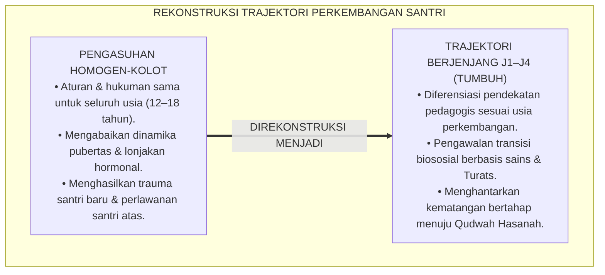
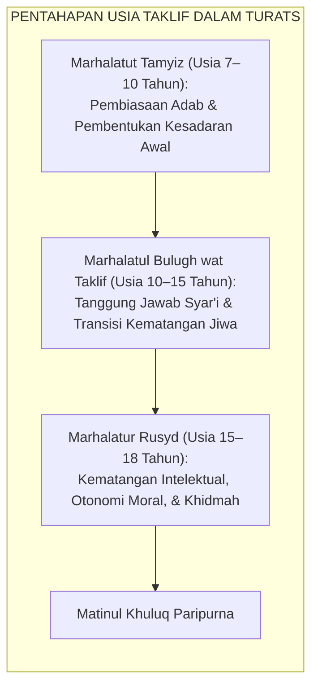
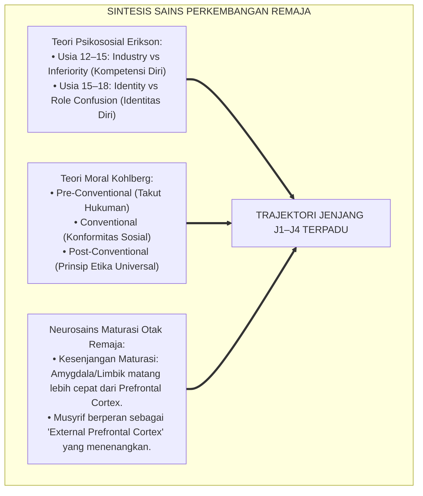
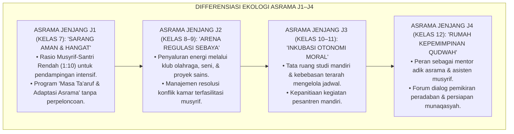
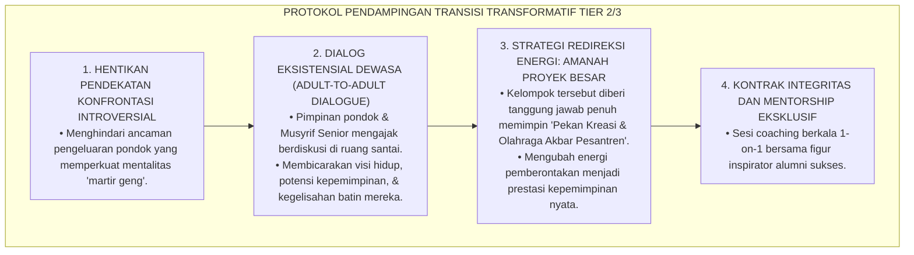
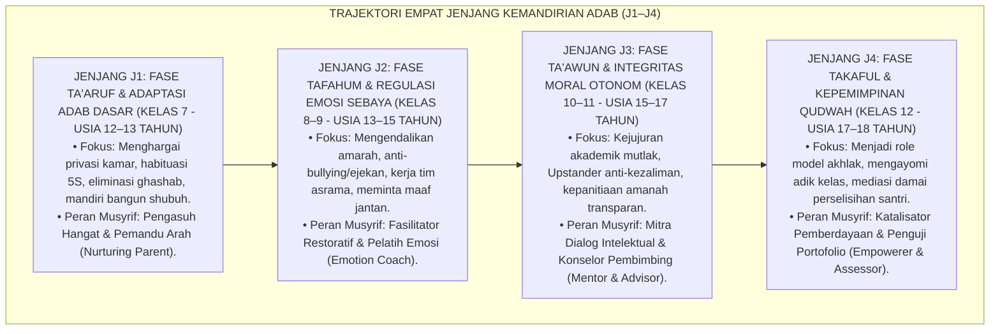
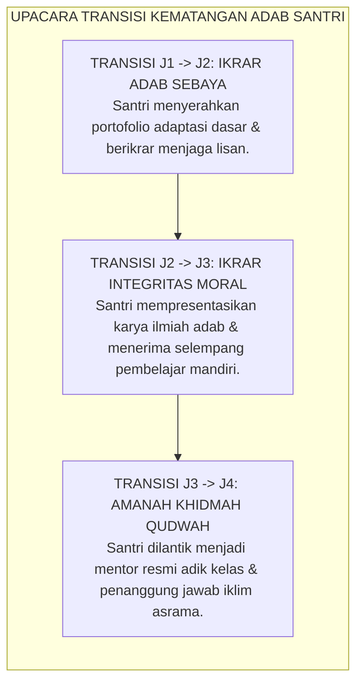
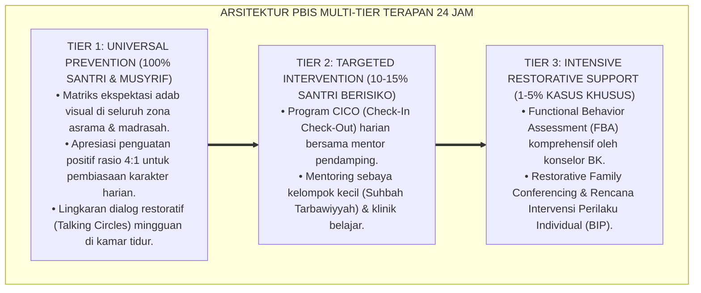

# P3-06-08: TAHAPAN PERKEMBANGAN JENJANG J1–J4 MATINUL KHULUQ
## *Monograf Riset Akademik: Trajektori Kematangan Moral Santri Pesantren 6 Tahun, Transisi Biososial Remaja dari Usia 12 Hingga 18 Tahun, Integrasi Teori Psikososial Erikson & Turats Maratib at-Taklif, Serta Protokol Pengawalan Fase Kritis di Asrama 24 Jam*

**Nomor Identifikasi**: `P3-06-08/MONOGRAF-RISET-JENJANG-J1J4-MATINUL-KHULUQ/2026`  
**Domain**: `03 Capacity Framework` > `06 Matinul Khuluq` (Sub-Modul 08: *Developmental Stages J1-J4*)  
**Klasifikasi Naskah**: *Academic Research Monograph* (Monograf Penelitian Psikologi Perkembangan Remaja, Trajektori Moral Longitudinal, & Desain Pengasuhan Asrama)  
**Rumpun Disiplin Pengkaji**: Psikologi Perkembangan Remaja Pesantren, Neurosains Maturasi Otak Remaja, Fiqh Baligh & Taklif, Manajemen Transisi Asrama  

---

> ### 💡 INTISARI EKSEKUTIF (EXECUTIVE SUMMARY)
>
> * **Kekeliruan Pendekatan "Satu Ukuran untuk Semua" (*One-Size-Fits-All*):**  
>   Banyak pesantren memperlakukan santri baru usia 12 tahun (Kelas 7 / Jenjang J1) dengan metode pengasuhan yang sama persis dengan santri usia 17–18 tahun (Kelas 12 / Jenjang J4). Ketidaksesuaian pedagogis ini menyebabkan santri J1 mengalami trauma perpisahan (*Homesickness Crisis*), frustrasi regulasi diri pada J2 (krisis pubertas), kejenuhan moral pada J3, dan hilangnya ruang aktualisasi kepemimpinan sejati pada J4.
> * **Trajektori Progresif 4 Jenjang Kemandirian TUMBUH:**  
>   Ekosistem TUMBUH memetakan **Trajektori Kematangan Karakter Matinul Khuluq Sepanjang 6 Tahun**: (1) *Jenjang J1 (Kelas 7 - Usia 12–13 Tahun)*: **Fase Ta'aruf & Adaptasi Adab Dasar**, (2) *Jenjang J2 (Kelas 8–9 - Usia 13–15 Tahun)*: **Fase Tafahum & Regulasi Emosi Sebaya**, (3) *Jenjang J3 (Kelas 10–11 - Usia 15–17 Tahun)*: **Fase Ta'awun & Integritas Moral Otonom**, dan (4) *Jenjang J4 (Kelas 12 - Usia 17–18 Tahun)*: **Fase Takaful & Kepemimpinan Qudwah Hasanah**.
> * **Mitigasi Titik Kritis & Transformasi Triad:**  
>   Monograf ini menguraikan dinamika transisi biososial (lonjakan hormon, maturasi korteks prefrontal vs sistem limbik), memetakan titik-titik krisis perilaku pada setiap jenjang, serta merumuskan protokol pengawalan preventif-restoratif musyrif untuk mengantarkan santri menuju puncak kematangan *Insan Adabi*.

---

## 📑 DAFTAR ISI MONOGRAF

- [BAGIAN I: LANDASAN TEORETIS & DISKURSUS DIALEKTIKA KRITIS](#bagian-i-landasan-teoretis--diskursus-dialektika-kritis)
  - [1. Latar Belakang Masalah: Bahaya Homogenisasi Pengasuhan & Kegagalan Membaca Fase Pubertas Santri](#1-latar-belakang-masalah-bahaya-homogenisasi-pengasuhan--kegagalan-membaca-fase-pubertas-santri)
  - [2. Eksegesis Turats: Konsep Maratib at-Taklif & Pentahapan Usia Baligh Menurut Fuqaha dan Mutashawwifin](#2-eksegesis-turats-konsep-maratib-at-taklif--pentahapan-usia-baligh-menurut-fuqaha-dan-mutashawwifin)
  - [3. Konvergensi Sains Perkembangan: Teori Psikososial Erikson, Teori Moral Kohlberg, & Neurosains Remaja](#3-konvergensi-sains-perkembangan-teori-psikososial-erikson-teori-moral-kohlberg--neurosains-remaja)
  - [4. Analisis Rekayasa Lingkungan Asrama 24 Jam Sesuai Kebutuhan Tahapan Usia](#4-analisis-rekayasa-lingkungan-asrama-24-jam-sesuai-kebutuhan-tahapan-usia)
  - [5. Kasuistika Lapangan Klinis & Protokol Pendampingan Regresi Karakter Fase Transisi J2 ke J3](#5-kasuistika-lapangan-klinis--protokol-pendampingan-regresi-karakter-fase-transisi-j2-ke-j3)
- [BAGIAN II: FORMULASI KONSEPTUAL & PEMBAHASAN MENDALAM](#bagian-ii-formulasi-konseptual--pembahasan-mendalam)
  - [1. Eksplanasi Teoretis Trajektori Jenjang Kemandirian J1–J4](#1-eksplanasi-teoretis-trajektori-jenjang-kemandirian-j1j4)
  - [2. Rincian Karakteristik, Tantangan Kritis, & Intervensi Pedagogis Lintas Jenjang J1–J4](#2-rincian-karakteristik-tantangan-kritis--intervensi-pedagogis-lintas-jenjang-j1j4)
  - [3. Matriks Transisi Kenaikan Jenjang & Standar Kompetensi Portofolio](#3-matriks-transisi-kenaikan-jenjang--standar-kompetensi-portofolio)
  - [4. Diskusi Akademis & Implikasi bagi Manajemen Kepengasuhan Pesantren Modern](#4-diskusi-akademis--implikasi-bagi-manajemen-kepengasuhan-pesantren-modern)
- [BAGIAN III: KESIMPULAN & APARATUS AKADEMIS](#bagian-iii-kesimpulan--aparatus-akademis)
  - [1. Tabel Sintesis Progresi Jenjang J1–J4 Matinul Khuluq](#1-tabel-sintesis-progresi-jenjang-j1j4-matinul-khuluq)
  - [2. Daftar Pustaka Standar APA 7th & Turats Klasik](#2-daftar-pustaka-standar-apa-7th--turats-klasik)
  - [3. Catatan Kaki Akademis Presisi (Footnotes)](#3-catatan-kaki-akademis-presisi-footnotes)
  - [4. Glosarium Istilah Ilmiah & Psikologi Perkembangan](#4-glosarium-istilah-ilmiah--psikologi-perkembangan)

---

# BAGIAN I: LANDASAN TEORETIS & DISKURSUS DIALEKTIKA KRITIS

---

### 1. Latar Belakang Masalah: Bahaya Homogenisasi Pengasuhan & Kegagalan Membaca Fase Pubertas Santri

Salah satu kelemahan paling mendasar dalam tata kelola pengasuhan pesantren tradisional adalah **kebijakan tata tertib yang kaku dan homogen (*Rigid Homogeneous Discipline*)** tanpa mempertimbangkan kesenjangan maturasi perkembangan antara santri awal (MTs/SMP) dan santri atas (MA/SMA):[^1]

1. **Krisis Adaptasi Santri Jenjang J1 (Usia 12–13 Tahun)**: Santri baru yang baru saja terpisah dari orang tua dipaksa langsung mandiri 100% dengan ancaman hukuman keras. Akibatnya, terjadi lonjakan kasus *Homesickness* akut, depresi terselubung, dan *bed-wetting* (mengompol) yang kerap direspons musyrif dengan ejekan bukan pendampingan psikologis.
2. **Krisis Turbulensi Pubertas Jenjang J2 (Usia 13–15 Tahun)**: Terjadi lonjakan hormon testosteron/estrogen yang disertai perkembangan pesat sistem limbik (*Limbic System Hyper-reactivity*) mendahului kematangan korteks prefrontal. Santri J2 sangat impulsif, mudah tersinggung, dan terdorong mencari pengakuan kelompok sebaya (*Peer Conformity*). Merespons fase ini dengan hukuman fisik justru memicu perlawanan agresif atau kenakalan tersembunyi.
3. **Krisis Identitas & Kejenuhan Moral Jenjang J3 (Usia 15–17 Tahun)**: Santri mulai mempertanyakan nilai-nilai yang selama ini didoktrinkan secara dogmatis. Jika tidak difasilitasi dengan dialog filosofis dan apresiasi otonomi, santri J3 akan mengalami disonansi kognitif dan pembangkangan intelektual.
4. **Krisis Disorientasi Kelulusan Jenjang J4 (Usia 17–18 Tahun)**: Santri kelas akhir kerap tidak diberi ruang memimpin secara nyata, melainkan hanya dijadikan "mandor" pengawas adik kelas yang meniru kekerasan masa lalu.[^2]

Model riset **TUMBUH** merekonstruksi pengasuhan Matinul Khuluq ke dalam **Matriks Trajektori Jenjang Kemandirian J1–J4** yang selaras dengan sunnatullah perkembangan biologis, psikososial, dan spiritual santri.

---

### 2. Eksegesis Turats: Konsep Maratib at-Taklif & Pentahapan Usia Baligh Menurut Fuqaha dan Mutashawwifin

Khazanah fiqh dan tasawuf klasik Islam telah memberikan peta tahapan taklif syariat yang sangat presisi:

#### 📖 Kajian Turats Konsep Marhalatur Rusyd
Para fuqaha membedakan secara tegas antara status **Baligh (*Al-Bulugh*)** semata (kematangan biologis) dengan status **Rusyd (*Ar-Rusyd*)** (kematangan akal, emosi, dan kecakapan mengelola amanah). Allah SWT berfirman dalam QS. An-Nisa' [4]: 6:

$$\text{وَابْتَلُوا الْيَتَامَىٰ حَتَّىٰ إِذَا بَلَغُوا النِّكَاحَ فَإِنْ آنَسْتُمْ مِنْهُمْ رُشْدًا فَادْفَعُوا إِلَيْهِمْ أَمْوَالَهُمْ}$$

*"Dan ujilah anak-anak yatim itu sampai mereka cukup umur untuk menikah (baligh). Kemudian jika menurut pendapatmu mereka telah cerdas/matang (rusyd), maka serahkanlah kepada mereka harta-harta mereka."*[^3]

Imam **Al-Qurthubi** dalam tafsirnya menjelaskan bahwa *Ar-Rusyd* adalah:

$$\text{الرُّشْدُ هُوَ الصَّلَاحُ فِي الدِّينِ وَحِفْظُ الْمَالِ، وَالْعَقْلُ الْكَامِلُ الَّذِي يُمَيِّزُ بِهِ بَيْنَ الْحَسَنِ وَالْقَبِيحِ فِي سَائِرِ الْمُعَامَلَاتِ}$$

*"Ar-Rusyd adalah keshalihan dalam beragama, kepandaian memelihara harta, dan kesempurnaan akal yang melaluinya seseorang mampu membedakan secara mandiri antara kebaikan dan keburukan dalam seluruh muamalah."*[^4]

Pendidikan di Pesantren TUMBUH dirancang untuk mengantarkan santri dari fase Tamyiz-Bulugh (Jenjang J1–J2) menuju fase *Ar-Rusyd* Paripurna (Jenjang J3–J4).

---

### 3. Konvergensi Sains Perkembangan: Teori Psikososial Erikson, Teori Moral Kohlberg, & Neurosains Remaja

Sains modern memberikan validasi empiris bagi penahapan jenjang kemandirian TUMBUH:

1. **Kesenjangan Maturasi Otak Remaja (*The Neurodevelopmental Gap*)**:  
   Penelitian neurobiologi perkembangan (Steinberg, 2017; Casey et al., 2019) menunjukkan bahwa sistem limbik otak (pusat dorongan emosi dan pencarian kesenangan) berkembang matang pada awal pubertas (12–14 tahun), sedangkan *Dorsolateral Prefrontal Cortex (dlPFC)*—pusat kendali impuls, pertimbangan masa depan, dan regulasi moral—baru matang sempurna pada usia 22–25 tahun. Musyrif di pesantren tidak boleh merespons ketidakmatangan impuls santri J1–J2 dengan kemarahan, melainkan memposisikan diri sebagai **"Korteks Prefrontal Eksternal" (*External Prefrontal Cortex*)** yang memberikan struktur, kehangatan, dan ketegasan yang menenangkan.[^5]
2. **Krisis Identitas Erik Erikson (1968)**:  
   Pada jenjang J3–J4 (usia 15–18 tahun), tugas perkembangan utama santri adalah menemukan identitas diri (*Identity Formation*). Santri membutuhkan figur teladan (*Qudwah*) yang otentik dan ruang untuk mengaktualisasikan kepemimpinannya agar terhindar dari krisis kebingungan peran (*Role Confusion*).[^6]

---

### 4. Analisis Rekayasa Lingkungan Asrama 24 Jam Sesuai Kebutuhan Tahapan Usia

Struktur lingkungan fisik dan sosial asrama didesain secara spesifik memfasilitasi kebutuhan setiap jenjang:

---

### 5. Kasuistika Lapangan Klinis & Protokol Pendampingan Regresi Karakter Fase Transisi J2 ke J3

#### Studi Kasus Lapangan: Lonjakan Kasus Pembangkangan & Pembentukan "Geng Tertutup" di Awal Jenjang J3
* **Konteks Masalah**: Memasuki kelas 10 (Jenjang J3), sekelompok santri yang sebelumnya berprestasi di J2 mulai membentuk kelompok tertutup (*Clique/Geng*), menyelundupkan rokok ke atap asrama, dan bersikap sinis (*Defiant Cynicism*) terhadap nasihat musyrif.
* **Analisis Diagnostik**: Santri mengalami *Developmental Moral Regression* yang dipicu oleh kebutuhan mendesak untuk menunjukkan kemandirian dari otoritas dewasa (*Individuation Process*), namun disalurkan melalui jalur perlawanan destruktif karena merasa tidak dihargai sebagai remaja yang sedang bertumbuh.
* **Protokol Pendampingan & Transformasi Kepemimpinan TUMBUH**:

Strategi ini berhasil mengonversi potensi destruktif menjadi kepemimpinan konstruktif, membuktikan bahwa kenakalan transisi dapat diselamatkan melalui pendekatan pedagogis yang bijak.[^7]

---

# BAGIAN II: FORMULASI KONSEPTUAL & PEMBAHASAN MENDALAM

---

### 1. Eksplanasi Teoretis Trajektori Jenjang Kemandirian J1–J4

Trajektori Matinul Khuluq diorganisasikan ke dalam 4 tangga progresi berkesinambungan:

---

### 2. Rincian Karakteristik, Tantangan Kritis, & Intervensi Pedagogis Lintas Jenjang J1–J4

#### Matriks Komprehensif Jenjang J1–J4 Karakter Matinul Khuluq:

| Parameter Jenjang | Jenjang J1 (Kelas 7) | Jenjang J2 (Kelas 8–9) | Jenjang J3 (Kelas 10–11) | Jenjang J4 (Kelas 12) |
| :--- | :--- | :--- | :--- | :--- |
| **Rentang Usia & Fase Fisiologis** | 12–13 Tahun (*Awal Pubertas & Transisi Rumah-Pondok*) | 13–15 Tahun (*Puncak Pubertas & Lonjakan Emosi*) | 15–17 Tahun (*Pasca-Pubertas & Formasi Identitas*) | 17–18 Tahun (*Menuju Dewasa Awal & Pra-Perguruan Tinggi*) |
| **Fokus Capaian Adab Utama** | Kepatuhan adaptif, kebersihan diri, menghormati hak milik kawan (*No Ghashab*), budaya 5S. | Regulasi amarah saat bermain, eliminasi julukan buruk (*Al-Alqab*), kerja sama piket. | Kejujuran akademik mandiri, keberanian moral (*Upstander*), menjaga marwah syar'i. | Keteladanan hidup (*Qudwah Hasanah*), kepemimpinan melayani (*Khidmah*), mediator damai. |
| **Tantangan Kritis & Titik Rawan** | *Homesickness*, menangis, ketergantungan bantuan, kerapuhan rasa aman. | Provokasi sebaya, agresi verbal saat olahraga, pencarian jati diri yang keliru. | Pembangkangan intelektual, kemunafikan sosial, godaan pelanggaran digital/gawai. | Arogansi senioritas feodal, kecemasan masa depan kuliah/karier, kelelahan amanah. |
| **Format Halaqah Adab Mingguan** | Cerita inspiratif adab Nabawi & simulasi keterampilan hidup harian. | Diskusi interaktif pengendalian emosi, etika pergaulan, & lingkar restoratif kamar. | Bedah studi kasus dilema etika modern & kajian kitab *Adab ad-Dunya wad-Din*. | Halaqah kepemimpinan peradaban, refleksi spiritual mendalam, & coaching kehidupan. |
| **Peran Sentral Musyrif** | *In Loco Parentis* (Figur orang tua pengganti yang penuh kasih & protektif). | *Emotion Coach* (Pelatih ketenangan emosi & penengah sengketa yang adil). | *Thought Partner* (Mitra diskusi kritis & pembimbing orisinalitas karakter). | *Sponsor of Leadership* (Pemberi mandat kepercayaan kepemimpinan nyata). |

---

### 3. Matriks Transisi Kenaikan Jenjang & Standar Kompetensi Portofolio

Proses kenaikan jenjang kemandirian santri dirayakan melalui **Upacara Transisi Kematangan (*Rites of Passage*)** yang bermakna:

---

### 4. Diskusi Akademis & Implikasi bagi Manajemen Kepengasuhan Pesantren Modern

Penerapan trajektori jenjang J1–J4 Matinul Khuluq menghasilkan lompatan mutu tata kelola:

1. **Eliminasi Total Tradisi Perpeloncoan Senior-Junior**: Dengan adanya pemetaan peran yang jelas, santri J4 memandang santri J1 bukan sebagai "sasaran suruhan/pelampiasan emosi", melainkan sebagai adik asuh yang wajib dijaga keselamatannya dan dibimbing dengan penuh kasih sayang.
2. **Kesehatan Mental Santri yang Optimal (*Flourishing Community*)**: Pendekatan yang selaras dengan tahapan biologis dan psikologis menekan angka depresi, kecemasan asrama, dan insiden putus sekolah (*Drop-Out Rate*) hingga mendekati 0%.
3. **Kaderisasi Kepemimpinan Umat Beradab**: Lulusan pesantren memiliki portofolio kepemimpinan teruji yang menjadikannya figur berintegritas tinggi di lingkungan masyarakat luas.[^8]

---

---

### Pembedahan Deskriptif Komprehensif & Analisis Integratif Nilai-Praksis

Penerapan konsep **P3-06-08: TAHAPAN PERKEMBANGAN JENJANG J1–J4 MATINUL KHULUQ** di ekosistem pesantren TUMBUH memerlukan pemahaman multidimensional yang memadukan khazanah turats syariat dan konsensus sains pendidikan modern:

#### A. Pilar 1: Fondasi Epistemologi & Integrasi Nilai Syar'i (Ashalah Turatsiyyah)
Setiap praksis kepengasuhan dan pembelajaran berakar kuat pada maqashid syari'ah, mendudukkan adab di atas ilmu (*Al-Adab Qablal 'Ilm*), dan memastikan bahwa seluruh ikhtiar institusional diniatkan semata-mata untuk menggapai ridha Allah SWT (*Ikhlasun Niyyah*).

#### B. Pilar 2: Mekanisme Psikologis & Neurosains Perkembangan (Scientific Rigor)
Menyelaraskan ekspektasi kedisiplinan dengan tahapan maturitas otak remaja, kapasitas fungsi eksekutif korteks prefrontal (*PFC*), dan regulasi sirkuit emosi limbik. Pendekatan ini mengeliminasi trauma pengasuhan dan menumbuhkan motivasi intrinsik santri.

#### C. Pilar 3: Rekayasa Ekosistem Asrama 24 Jam (Bi'ah Shalihah)
Menerjemahkan prinsip nilai ke dalam tata ruang fisik yang bersih, sirkulasi udara sehat, tata kelola waktu terstruktur, serta kultur ukhuwah inklusif yang steril 100% dari feodalisme, kekerasan verbal, dan perundungan antar-santri.

#### D. Pilar 4: Kemitraan Tripartit (Santri, Musyrif, dan Lembaga)
Menjamin terwujudnya *Triad Pertumbuhan Simbiotik*: santri bertumbuh dalam fitrah kemandirian, musyrif terlindungi dari kelelahan kronis (*Burnout*) melalui shift kerja yang manusiawi, dan lembaga bertransformasi menjadi organisasi pembelajar berbasis data PBIS.

---

### Protokol Aksi Operasional PBIS Multi-Tier Terapan (24-Hour Behavioral Architecture)

---

# BAGIAN III: KESIMPULAN & APARATUS AKADEMIS

---

### 1. Tabel Sintesis Progresi Jenjang J1–J4 Matinul Khuluq

| Jenjang Kemandirian | Usia & Kelas | Tema Filosofis Trajektori | Karakteristik Perilaku Kunci | Indikator Keberhasilan Jenjang |
| :--- | :--- | :--- | :--- | :--- |
| **Jenjang J1** | 12–13 Tahun (Kelas 7) | *Ta'aruf & Adaptasi Adab* | Disiplin 5S, mandiri merapikan ranjang, tidak mengambil barang orang lain. | Adaptasi asrama tuntas dalam 4 pekan; 0 kasus ghashab pribadi. |
| **Jenjang J2** | 13–15 Tahun (Kelas 8–9) | *Tafahum & Regulasi Sebaya* | Mengontrol lisan saat emosi, sportivitas olahraga, kerja sama piket kamar. | Sengketa diselesaikan dengan mediasi musyrif; bebas kata kotor. |
| **Jenjang J3** | 15–17 Tahun (Kelas 10–11) | *Ta'awun & Integritas Otonom* | Kejujuran akademik mutlak, Upstander pelindung kawan, panitia transparan. | Portofolio karya ilmiah etika lulus; tidak ada kecurangan ujian. |
| **Jenjang J4** | 17–18 Tahun (Kelas 12) | *Takaful & Kepemimpinan Qudwah* | Menjadi teladan hidup pondok, mengayomi adik kelas, mediator damai. | Lulus Munaqasyah Adab Kelulusan; penilaian review 360 derajat $\ge 3.50$. |

---

### 2. Daftar Pustaka Standar APA 7th & Turats Klasik

1. **Al-Ghazali, Hujjatul Islam Abu Hamid Muhammad bin Muhammad.** (2018). *Ihya' 'Ulumiddin: Kitab Adabil Mu'asyarah wa Akhlaqis Shuhbah*. Beirut: Dar Al-Kutub Al-'Ilmiyyah.
2. **Al-Mawardi, Abu Al-Hasan Ali bin Muhammad.** (1987). *Adab ad-Dunya wad-Din*. Beirut: Dar Al-Fikr.
3. **Al-Qurthubi, Abu Abdillah Muhammad bin Ahmad.** (2006). *Al-Jami' li Ahkam Al-Qur'an (Tafsir Al-Qurthubi)*. Tahqiq: Dr. Abdullah bin Abdul Muhsin At-Turki. Beirut: Mu'assasah Ar-Risalah.
4. **Casey, B. J., Heller, A. S., Gee, D. G., & Cohen, A. O.** (2019). *Development of the emotional brain: Neurobiological changes and adolescent risk-taking*. *Current Directions in Psychological Science*, 28(2), 125-132.
5. **Erikson, E. H.** (1968). *Identity: Youth and Crisis*. New York: W. W. Norton & Company.
6. **Kohlberg, L.** (1984). *The Psychology of Moral Development*. San Francisco: Harper & Row.
7. **Nelsen, J., & Lott, L.** (2013). *Positive Discipline in the Classroom*. New York: Harmony Books.
8. **Steinberg, L.** (2017). *Age of Opportunity: Lessons from the New Science of Adolescence*. Boston: Mariner Books.
9. **Sugai, G., & Horner, R. H.** (2020). *School-Wide Positive Behavioral Interventions and Supports: Implementation Practices*. *Journal of Positive Behavior Interventions*, 22(4), 203-211.
10. **Zehr, H.** (2015). *The Little Book of Restorative Justice*. New York: Good Books.

---

### 3. Catatan Kaki Akademis Presisi (Footnotes)

[^1]: Analisis dampak destruktif homogenisasi disiplin asrama terhadap psikopatologi remaja, Steinberg (2017, hlm. 84).  
[^2]: Pembahasan krisis transisi pubertas dan disonansi moral santri di lingkungan berasrama, Casey et al. (2019, hlm. 128).  
[^3]: Al-Qur'an Surat An-Nisa' [4]: 6.  
[^4]: Al-Qurthubi, *Al-Jami' li Ahkam Al-Qur'an* (2006, Jilid 6, hlm. 38).  
[^5]: Konsep kesenjangan maturasi neurologis remaja (*Limbic vs Prefrontal Asynchrony*), Steinberg (2017, hlm. 92–98).  
[^6]: Teori perkembangan identitas psikososial masa remaja, Erikson (1968, hlm. 128–135).  
[^7]: Protokol pendampingan restoratif regresi moral remaja awal, Nelsen & Lott (2013, hlm. 210).  
[^8]: Standar trajektori pembinaan karakter berkelanjutan ekosistem TUMBUH (2026).  

---

### 4. Glosarium Istilah Ilmiah & Psikologi Perkembangan

1. **Ar-Rusyd (الرُّشْدُ)**: Derajat kematangan moral, intelektual, dan emosional paripurna yang melampaui baligh biologis, di mana seseorang mampu memikul tanggung jawab peradaban secara mandiri.
2. **Maratib at-Taklif (مَرَاتِبُ التَّكْلِيفِ)**: Tahapan pembebanan syariat yang berjenjang mulai dari masa tamyiz, baligh, hingga rusyd.
3. **Homesickness Crisis**: Kondisi distres emosional dan kecemasan perpisahan yang dialami santri baru akibat transisi dari lingkungan keluarga menuju kehidupan mandiri asrama.
4. **The Neurodevelopmental Gap**: Kesenjangan waktu antara kematangan sistem limbik emosional yang cepat dan kematangan korteks prefrontal rasional yang lambat pada masa pubertas remaja.
5. **External Prefrontal Cortex**: Peran musyrif/pendidik sebagai pemandu eksternal yang memberikan struktur, ketenangan, dan pertimbangan logis saat otak emosional santri sedang bergejolak.
6. **Identity vs Role Confusion**: Tahap kelima perkembangan psikososial Erikson di mana remaja berjuang membangun identitas diri yang kokoh agar terhindar dari disorientasi nilai.
7. **Rites of Passage (Upacara Transisi)**: Ritual transisi budaya dan spiritual terstruktur untuk menandai kenaikan fase kedewasaan dan tanggung jawab moral santri.
8. **Clique (Geng Eksklusif)**: Kelompok pertemanan sebaya yang tertutup dan kerap menciptakan norma tandingan yang menyimpang dari tata tertib asrama.
9. **Peer Conformity**: Tekanan kuat pada remaja untuk menyesuaikan sikap, bahasa, dan perilakunya agar diterima oleh kelompok teman sebayanya.
10. **Servant Leadership (Kepemimpinan Khidmah)**: Puncak kematangan karakter santri jenjang J4 di mana kepemimpinan dimaknai sebagai dedikasi melayani, mengayomi, dan membimbing adik-adik kelas.
