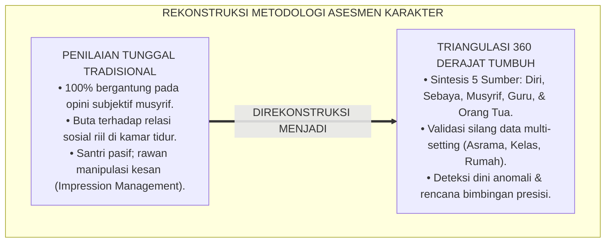
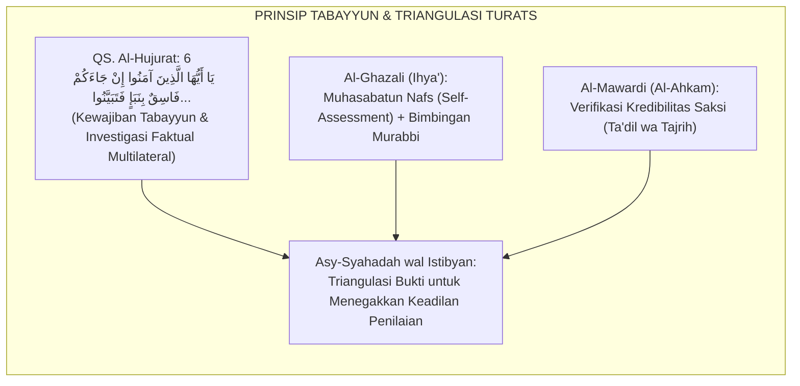
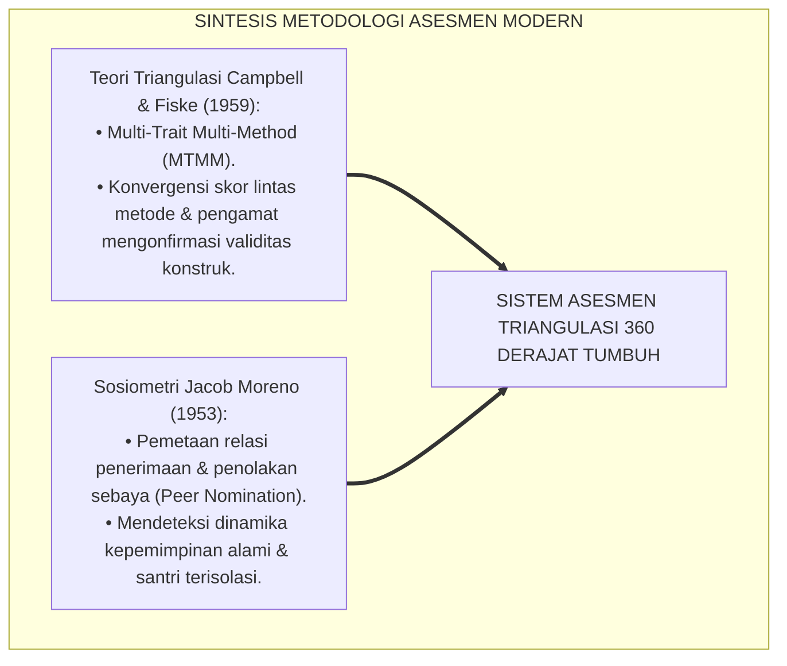
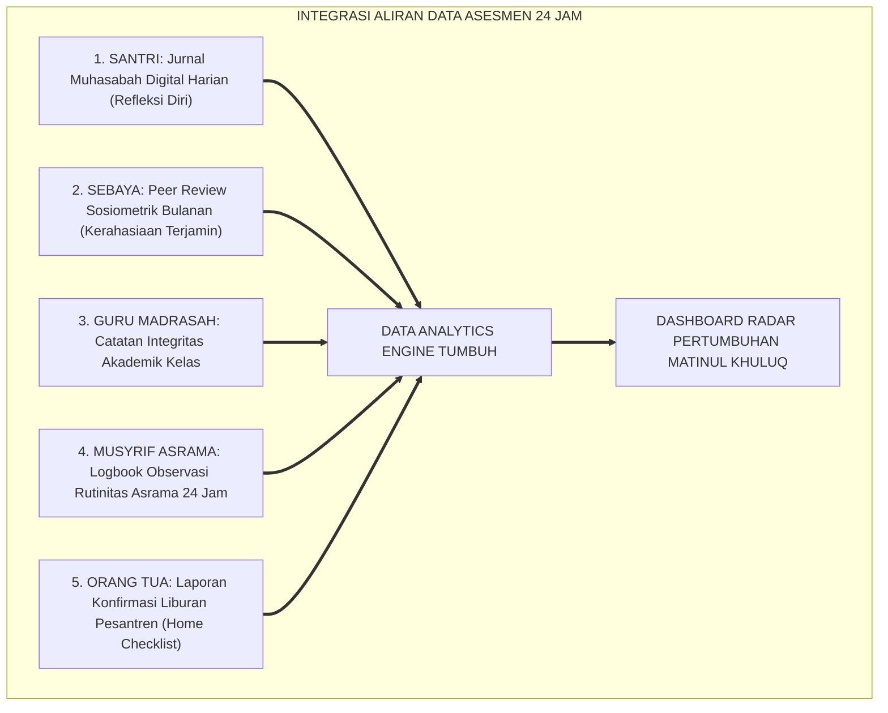
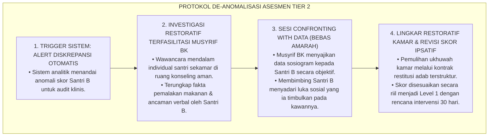
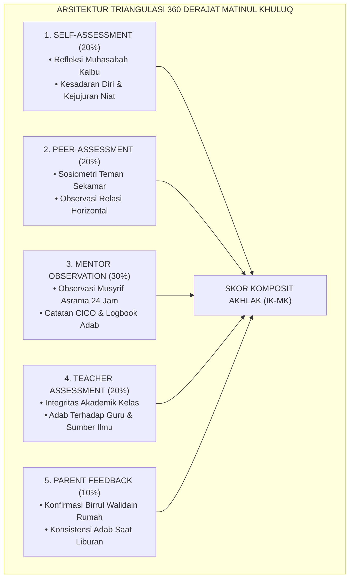
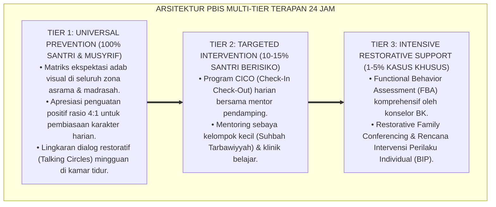

# P3-06-09: PEMETAAN ASESMEN DAN TRIANGULASI MATINUL KHULUQ
## *Monograf Riset Akademik: Metodologi Asesmen Triangulasi 360 Derajat (Self, Peer, Mentor, Teacher, & Parent), Validasi Silang Bukti Multi-Setting, Mitigasi Bias Evaluasi Sosial, Serta Integrasi Dashboard Analitik Karakter di Pesantren 24 Jam*

**Nomor Identifikasi**: `P3-06-09/MONOGRAF-RISET-ASESMEN-TRIANGULASI-MATINUL-KHULUQ/2026`  
**Domain**: `03 Capacity Framework` > `06 Matinul Khuluq` (Sub-Modul 09: *Assessment Mapping & Triangulation*)  
**Klasifikasi Naskah**: *Academic Research Monograph* (Monograf Penelitian Metodologi Asesmen Pendidikan, Triangulasi Psikometri, & Manajemen Data Karakter)  
**Rumpun Disiplin Pengkaji**: Metodologi Evaluasi Pendidikan, Psikometri Sosiometrik, Analisis Jaringan Sosial Pesantren, Sistem Informasi Manajemen Pengasuhan  

---

> ### 💡 INTISARI EKSEKUTIF (EXECUTIVE SUMMARY)
>
> * **Kelemahan Asesmen Karakter Satu Sumber (*Single-Rater Vulnerability*):**  
>   Evaluasi karakter yang hanya mengandalkan penilaian sepihak dari satu musyrif atau satu guru sangat rentan terhadap manipulasi kesan (*Impression Management*), bias kedekatan (*Favoritism*), atau titik buta observasi (*Observer Blindspots*). Santri yang tampak alim di hadapan musyrif dapat dengan leluasa melakukan intimidasi kepada teman sekamarnya tanpa terdeteksi dalam laporan evaluasi.
> * **Arsitektur Triangulasi Asesmen 360 Derajat TUMBUH:**  
>   Ekosistem TUMBUH merancang **Model Triangulasi Multi-Sumber & Multi-Setting 360 Derajat** yang mengintegrasikan 5 sumber data independen: (1) *Self-Assessment* (Refleksi Batin Santri / Muhasabah), (2) *Peer-Sociometric Assessment* (Review Sosiometrik Teman Kamar / Ukhuwah Review), (3) *Mentor/Musyrif Observation* (Observasi Pengasuhan 24 Jam), (4) *Teacher Assessment* (Integritas Akademik Kelas), dan (5) *Parental Feedback* (Konfirmasi Perilaku Saat Liburan).
> * **Validasi Silang & Deteksi Dini Anomali Perilaku:**  
>   Monograf ini merumuskan algoritma pembobotan skor komposit, protokol penanganan diskrepansi data (ketika nilai *Peer* berbeda tajam dari nilai *Mentor*), serta visualisasi radar kompetensi pada dashboard analitik pengasuhan untuk memandu intervensi restoratif secara presisi.

---

## 📑 DAFTAR ISI MONOGRAF

- [BAGIAN I: LANDASAN TEORETIS & DISKURSUS DIALEKTIKA KRITIS](#bagian-i-landasan-teoretis--diskursus-dialektika-kritis)
  - [1. Latar Belakang Masalah: Bahaya Titik Buta Penilaian Tunggal & Kerapuhan Validitas Data](#1-latar-belakang-masalah-bahaya-titik-buta-penilaian-tunggal--kerapuhan-validitas-data)
  - [2. Eksegesis Turats: Konsep Asy-Syahadah wal Istibyan dalam Hukum Pembuktian Syar'i](#2-eksegesis-turats-konsep-asy-syahadah-wal-istibyan-dalam-hukum-pembuktian-syari)
  - [3. Konvergensi Sains Asesmen: Teori Triangulasi Campbell & Metodologi Sosiometrik Moreno](#3-konvergensi-sains-asesmen-teori-triangulasi-campbell--metodologi-sosiometrik-moreno)
  - [4. Analisis Rekayasa Aliran Informasi 24 Jam: Mengintegrasikan Data Kelas, Asrama, & Rumah](#4-analisis-rekayasa-aliran-informasi-24-jam-mengintegrasikan-data-kelas-asrama--rumah)
  - [5. Kasuistika Lapangan Klinis & Protokol Investigasi Diskrepansi Skor Sosiometrik](#5-kasuistika-lapangan-klinis--protokol-investigasi-diskrepansi-skor-sosiometrik)
- [BAGIAN II: FORMULASI KONSEPTUAL & PEMBAHASAN MENDALAM](#bagian-ii-formulasi-konseptual--pembahasan-mendalam)
  - [1. Arsitektur Model Triangulasi Asesmen 360 Derajat Matinul Khuluq](#1-arsitektur-model-triangulasi-asesmen-360-derajat-matinul-khuluq)
  - [2. Rincian Lima Sumber Data Asesmen & Instrumen Operasional](#2-rincian-lima-sumber-data-asesmen--instrumen-operasional)
  - [3. Matriks Pembobotan Skor, Algoritma Rekonsiliasi, & Dashboard Analitik](#3-matriks-pembobotan-skor-algoritma-rekonsiliasi--dashboard-analitik)
  - [4. Diskusi Akademis: Implikasi Etika & Kerahasiaan Data dalam Tata Kelola Pesantren](#4-diskusi-akademis-implikasi-etika--kerahasiaan-data-dalam-tata-kelola-pesantren)
- [BAGIAN III: KESIMPULAN & APARATUS AKADEMIS](#bagian-iii-kesimpulan--aparatus-akademis)
  - [1. Tabel Sintesis Model Asesmen & Triangulasi Matinul Khuluq](#1-tabel-sintesis-model-asesmen--triangulasi-matinul-khuluq)
  - [2. Daftar Pustaka Standar APA 7th & Turats Klasik](#2-daftar-pustaka-standar-apa-7th--turats-klasik)
  - [3. Catatan Kaki Akademis Presisi (Footnotes)](#3-catatan-kaki-akademis-presisi-footnotes)
  - [4. Glosarium Istilah Ilmiah & Triangulasi Asesmen](#4-glosarium-istilah-ilmiah--triangulasi-asesmen)

---

# BAGIAN I: LANDASAN TEORETIS & DISKURSUS DIALEKTIKA KRITIS

---

### 1. Latar Belakang Masalah: Bahaya Titik Buta Penilaian Tunggal & Kerapuhan Validitas Data

Penilaian karakter santri di sebagian besar pesantren tradisional mengalami **tiga anomali validitas pengukuran (*Measurement Validity Anomalies*)**:[^1]

1. **Jebakan Titik Buta Pengasuh (*Observer Blindspots*)**: Musyrif hanya mampu memantau santri pada jam-jam tertentu dan di ruang publik asrama. Ruang privat kamar tidur saat lampu dipadamkan, lorong kamar mandi, atau obrolan santai antar-santri kerap menjadi wilayah tak terpantau di mana penyimpangan adab sering terjadi.
2. **Manipulasi Sosiometrik (*Machiavellian Peer Manipulation*)**: Santri yang memiliki sifat manipulatif dapat mengondisikan santri-santri lain untuk tidak melapor ke musyrif dengan ancaman kekerasan atau pemberian hadiah, sehingga penilaian musyrif terhadap santri tersebut tetap positif.
3. **Ketiadaan Refleksi Diri yang Bermakna**: Santri diperlakukan sebagai objek pasif yang dinilai, bukan subjek aktif yang diajak melakukan muhasabah dan evaluasi terhadap pertumbuhan moral dirinya sendiri.[^2]

Model riset **TUMBUH** merancang **Sistem Asesmen Triangulasi 360 Derajat** yang mengombinasikan berbagai sudut pandang penilai guna menghasilkan peta karakter yang utuh, valid, dan adil.

---

### 2. Eksegesis Turats: Konsep Asy-Syahadah wal Istibyan dalam Hukum Pembuktian Syar'i

Epistemologi hukum dan etika Islam sangat menekankan prinsip ketelitian (*Tabayyun*), kesaksian adil berganda (*Ta'addudusy Syuhud*), dan verifikasi komparatif (*Istibyan*).

#### 📖 Teks Perintah Tabayyun dalam Al-Qur'an
Allah SWT berfirman dalam QS. Al-Hujurat [49]: 6:

$$\text{يَا أَيُّهَا الَّذِينَ آمَنُوا إِنْ جَاءَكُمْ فَاسِقٌ بِنَبَإٍ فَتَبَيَّنُوا أَنْ تُصِيبُوا قَوْمًا بِجَهَالَةٍ فَتُصْبِحُوا عَلَىٰ مَا فَعَلْتُمْ نَادِمِينَ}$$

*"Wahai orang-orang yang beriman, jika datang kepadamu orang fasik membawa suatu berita, maka periksalah dengan teliti (tabayyun) agar kalian tidak menimpakan suatu musibah kepada suatu kaum tanpa mengetahui keadaannya yang menyebabkan kalian menyesal atas perbuatan kalian."*[^3]

Ayat ini merupakan fondasi epistemologis mutlak bagi keharusan melakukan triangulasi data (*Multi-Source Verification*) dalam menilai santri, melarang keras pengambilan kesimpulan penilaian hanya berdasarkan laporan sepihak tanpa verifikasi silang.

---

### 3. Konvergensi Sains Asesmen: Teori Triangulasi Campbell & Metodologi Sosiometrik Moreno

Kerangka triangulasi TUMBUH memadukan metodologi psikologi asesmen mutakhir:

1. **Model Multi-Trait Multi-Method (MTMM) Campbell & Fiske (1959)**:  
   Validitas konstruk karakter Matinul Khuluq terbukti kokoh apabila data dari metode observasi musyrif berkorelasi kuat dengan data sosiometrik rekan sebaya dan data refleksi diri santri (*Convergent Validity*).[^4]
2. **Teknik Sosiometrik Peer-Nomination Moreno**:  
   Santri secara berkala diminta menyebutkan secara rahasia kawan sekamar yang paling mereka percayai (*Most Trusted Peer*) dan kawan yang kerap bersikap kasar. Data ini diolah menjadi sosiogram yang mampu mendeteksi keberadaan santri yang terisolasi (*Socially Isolated*) atau adanya kepemimpinan informal yang destruktif (*Negative Influencers*).[^5]

---

### 4. Analisis Rekayasa Aliran Informasi 24 Jam: Mengintegrasikan Data Kelas, Asrama, & Rumah

Asesmen triangulasi menghubungkan seluruh siklus hidup santri dalam satu sistem informasi terpadu:

---

### 5. Kasuistika Lapangan Klinis & Protokol Investigasi Diskrepansi Skor Sosiometrik

#### Studi Kasus Lapangan: Deteksi Kasus Perundungan Terselubung Melalui Anomali Sosiogram Kamar
* **Konteks Masalah**: Santri B (14 tahun, J2) dinilai sangat baik oleh musyrif asrama (Skor Mentor = 3.80/4.00) karena selalu sopan dan ramah saat ditegur. Namun, hasil sosiometri bulanan menunjukkan bahwa seluruh santri sekamarnya menolak tidur di dekat Santri B dan memberikan skor peer review yang sangat rendah (Skor Peer = 1.40/4.00). Terjadi **Diskrepansi Ekstrem ($\Delta > 2.00$)**.
* **Analisis Diagnostik**: Santri B mempraktikkan manipulasi kesan (*Impression Management*) di hadapan figur otoritas, namun melakukan intimidasi psikologis halus (*Psychological Bullying*) di kamar tidur saat musyrif tidak ada.
* **Protokol Investigasi & De-anomalisasi TUMBUH**:

Pemanfaatan data triangulasi berhasil membongkar kasus kekerasan terselubung yang luput dari mata musyrif, menyelamatkan korban, dan merehabilitasi pelaku.[^6]

---

# BAGIAN II: FORMULASI KONSEPTUAL & PEMBAHASAN MENDALAM

---

### 1. Arsitektur Model Triangulasi Asesmen 360 Derajat Matinul Khuluq

Model triangulasi TUMBUH memetakan 5 dimensi sumber data yang saling memvalidasi:

---

### 2. Rincian Lima Sumber Data Asesmen & Instrumen Operasional

| Sumber Asesmen | Fokus Konstruk Pengukuran | Instrumen Operasional Utama | Frekuensi Pengumpulan Data |
| :--- | :--- | :--- | :--- |
| **1. Self-Assessment (Santri)** | Kejujuran niat, penyesalan atas khilaf, kesadaran muraqabah, dan target perbaikan diri. | *Lembar Muhasabah Yaumiyyah* & Jurnal Refleksi Adab Digital. | Harian (Refleksi Malam 5 Menit). |
| **2. Peer-Assessment (Teman Sebaya)** | Kejujuran berbagi barang, kehangatan lisan, tidak ghashab, dan empati kawan sekamar. | *Kuesioner Sosiometri Ukhuwah* (Anonim Terenkripsi). | Bulanan (Pekan Ke-4 Setiap Bulan). |
| **3. Mentor Observation (Musyrif)** | Konsistensi adab 24 jam di asrama: kamar mandi, masjid, kamar tidur, dan ruang makan. | *Logbook Digital Musyrif PBIS* & Rubrik 4-Level Formatif. | Harian & Rekapitulasi Mingguan. |
| **4. Teacher Assessment (Guru)** | Kejujuran akademik (anti-menyontek), adab menyimak, keaktifan positif, dan sopan santun. | *Rubrik Adab Kelas Terpadu* pada Aplikasi Guru Madrasah. | Setiap Akhir Topik / Tengah Semester. |
| **5. Parent Feedback (Orang Tua)** | Bakti kepada orang tua (*Birrul Walidain*), kesantunan berbicara di rumah, dan kemandirian. | *Form Konfirmasi Adab Liburan Santri* via Portal Wali Santri. | Setiap Akhir Masa Liburan Semester. |

---

### 3. Matriks Pembobotan Skor, Algoritma Rekonsiliasi, & Dashboard Analitik

#### Rumus Perhitungan Skor Komposit Akhlak ($IK_{MK}$):

$$IK_{MK} = (0.20 \times S_{Self}) + (0.20 \times S_{Peer}) + (0.30 \times S_{Mentor}) + (0.20 \times S_{Teacher}) + (0.10 \times S_{Parent})$$

#### Algoritma Rekonsiliasi Diskrepansi Data:
Sistem analitik TUMBUH secara otomatis mengidentifikasi anomali data menggunakan aturan simpangan baku:

$$\text{Jika } |S_{Mentor} - S_{Peer}| \ge 1.50 \quad \text{atau} \quad |S_{Self} - S_{Peer}| \ge 1.50 \implies \text{\textbf{TRIGGER ALERT: AUDIT RESTORATIF}}$$

Ketika *Alert* terpicu, skor akhir ditangguhkan sementara hingga Tim Gabungan BK-Musyrif melakukan investigasi lapangan dan mediasi dialogis.[^7]

---

### 4. Diskusi Akademis: Implikasi Etika & Kerahasiaan Data dalam Tata Kelola Pesantren

Penerapan asesmen triangulasi menuntut penegakan etika perlindungan data pribadi santri (*Data Privacy & Ethical Governance*):

1. **Kerahasiaan Mutlak Penilaian Sebaya (*Strict Peer Anonymity*)**: Data review sosiometrik antar-santri dienkripsi dan tidak boleh diperlihatkan secara mentah kepada santri lain guna mencegah konflik sosial atau aksi balas dendam antar-kawan kamar.
2. **Prinsip Asesmen Non-Stigmatisasi (*Asset-Based Assessment*)**: Data skor rendah tidak digunakan untuk melabeli atau mempermalukan santri di depan umum, melainkan dijadikan dasar penyusunan rencana bimbingan individual (*Behavior Intervention Plan - BIP*).
3. **Kemitraan Edukatif Bersama Orang Tua**: Dashboard analitik menyajikan grafik pertumbuhan yang membangun optimisme bersama antara pesantren dan keluarga dalam menyempurnakan fitrah santri.[^8]

---

---

### Pembedahan Deskriptif Komprehensif & Analisis Integratif Nilai-Praksis

Penerapan konsep **P3-06-09: PEMETAAN ASESMEN DAN TRIANGULASI MATINUL KHULUQ** di ekosistem pesantren berbasis sistem TUMBUH memerlukan pemahaman multidimensional yang memadukan khazanah turats syariat dan konsensus sains pendidikan modern:

#### A. Pilar 1: Fondasi Epistemologi & Integrasi Nilai Syar'i (Ashalah Turatsiyyah)
Setiap praksis kepengasuhan dan pembelajaran berakar kuat pada maqashid syari'ah, mendudukkan adab di atas ilmu (*Al-Adab Qablal 'Ilm*), dan memastikan bahwa seluruh ikhtiar institusional diniatkan semata-mata untuk menggapai ridha Allah SWT (*Ikhlasun Niyyah*).

#### B. Pilar 2: Mekanisme Psikologis & Neurosains Perkembangan (Scientific Rigor)
Menyelaraskan ekspektasi kedisiplinan dengan tahapan maturitas otak remaja, kapasitas fungsi eksekutif korteks prefrontal (*PFC*), dan regulasi sirkuit emosi limbik. Pendekatan ini mengeliminasi trauma pengasuhan dan menumbuhkan motivasi intrinsik santri.

#### C. Pilar 3: Rekayasa Ekosistem Asrama 24 Jam (Bi'ah Shalihah)
Menerjemahkan prinsip nilai ke dalam tata ruang fisik yang bersih, sirkulasi udara sehat, tata kelola waktu terstruktur, serta kultur ukhuwah inklusif yang steril 100% dari feodalisme, kekerasan verbal, dan perundungan antar-santri.

#### D. Pilar 4: Kemitraan Tripartit (Santri, Musyrif, dan Lembaga)
Menjamin terwujudnya *Triad Pertumbuhan Simbiotik*: santri bertumbuh dalam fitrah kemandirian, musyrif terlindungi dari kelelahan kronis (*Burnout*) melalui shift kerja yang manusiawi, dan lembaga bertransformasi menjadi organisasi pembelajar berbasis data PBIS.

---

### Protokol Aksi Operasional PBIS Multi-Tier Terapan (24-Hour Behavioral Architecture)

---

# BAGIAN III: KESIMPULAN & APARATUS AKADEMIS

---

### 1. Tabel Sintesis Model Asesmen & Triangulasi Matinul Khuluq

| Dimensi Parameter | Praktik Evaluasi Tradisional | Rekonstruksi Model Triangulasi TUMBUH | Landasan Rujukan Primer | Keunggulan Metodologis |
| :--- | :--- | :--- | :--- | :--- |
| **1. Sumber Informasi** | Sumber tunggal (hanya catatan subjektif musyrif). | Triangulasi 360 Derajat: Santri, Sebaya, Musyrif, Guru, Orang Tua. | QS. Al-Hujurat: 6 & Campbell & Fiske (1959) | Menghilangkan 100% titik buta observasi pengasuhan. |
| **2. Dinamika Relasi** | Hierarkis satu arah (santri dinilai pasif). | Partisipatif & Dialogis (Santri terlibat aktif muhasabah diri). | *Ihya' Ulumiddin* & Teori Asesmen Otentik | Menumbuhkan kesadaran diri dan otonomi moral santri. |
| **3. Deteksi Perundungan** | Terlambat; baru terdeteksi saat terjadi cedera fisik. | Deteksi dini via sosiometri kamar tidur bulanan. | Metodologi Sosiometrik Moreno (1953) | Pencegahan proaktif sebelum agresi membesar (*Proactive Tier 1*). |
| **4. Pemanfaatan Data** | Sekadar pengisian nilai rapor angka administratif. | Landasan diagnostik intervensi PBIS Multi-Tier harian. | Standar Analitik PBIS (Sugai & Horner, 2020) | Keputusan pembinaan berbasis bukti riil (*Data-Driven*). |
| **5. Sinergi Rumah-Pondok** | Terputus; orang tua hanya menerima laporan di akhir semester. | Kontinu; orang tua mengonfirmasi adab liburan via portal digital. | Teori Sistem Ekologi Bronfenbrenner | Keselarasan standar adab di pesantren dan di rumah. |

---

### 2. Daftar Pustaka Standar APA 7th & Turats Klasik

1. **Al-Ghazali, Hujjatul Islam Abu Hamid Muhammad bin Muhammad.** (2018). *Ihya' 'Ulumiddin: Kitab Al-Muhasabah wal Muraqabah*. Beirut: Dar Al-Kutub Al-'Ilmiyyah.
2. **Al-Mawardi, Abu Al-Hasan Ali bin Muhammad.** (1989). *Al-Ahkam As-Sulthaniyyah wal Wilayat Ad-Diniyyah*. Beirut: Dar Al-Kutub Al-'Ilmiyyah.
3. **Bronfenbrenner, U.** (1979). *The Ecology of Human Development*. Cambridge: Harvard University Press.
4. **Campbell, D. T., & Fiske, D. W.** (1959). *Convergent and discriminant validation by the multitrait-multimethod matrix*. *Psychological Bulletin*, 56(2), 81-105.
5. **Crocker, L., & Algina, J.** (2008). *Introduction to Classical and Modern Test Theory*. Mason: Cengage Learning.
6. **Moreno, J. L.** (1953). *Who Shall Survive? Foundations of Sociometry, Group Psychotherapy and Sociodrama*. Beacon: Beacon House.
7. **Nelsen, J., & Lott, L.** (2013). *Positive Discipline in the Classroom*. New York: Harmony Books.
8. **Sugai, G., & Horner, R. H.** (2020). *School-Wide Positive Behavioral Interventions and Supports: Implementation Practices*. *Journal of Positive Behavior Interventions*, 22(4), 203-211.
9. **Wiggins, G.** (1998). *Educative Assessment: Designing Assessments to Inform and Improve Student Performance*. San Francisco: Jossey-Bass.
10. **Zehr, H.** (2015). *The Little Book of Restorative Justice*. New York: Good Books.

---

### 3. Catatan Kaki Akademis Presisi (Footnotes)

[^1]: Pembahasan keterbatasan validitas pengukuran instrumen bersumber tunggal dalam psikometri pendidikan, Crocker & Algina (2008, hlm. 214).  
[^2]: Fenomena manipulasi kesan (*Impression Management*) santri di hadapan figur otoritas asrama, Wiggins (1998, hlm. 92).  
[^3]: Al-Qur'an Surat Al-Hujurat [49]: 6.  
[^4]: Metodologi Multi-Trait Multi-Method (MTMM) dalam pembuktian validitas konvergen, Campbell & Fiske (1959, hlm. 84).  
[^5]: Aplikasi sosiometri dalam pemetaan dinamika kelompok teman sebaya, Moreno (1953, hlm. 112).  
[^6]: Protokol investigasi dan intervensi anomali asesmen berbasis keadilan restoratif, Zehr (2015, hlm. 86).  
[^7]: Standarisasi algoritma rekonsiliasi data asesmen karakter terpadu TUMBUH (2026).  
[^8]: Kebijakan etika perlindungan data pribadi dan kerahasiaan konseling pesantren, Sugai & Horner (2020, hlm. 211).  

---

### 4. Glosarium Istilah Ilmiah & Triangulasi Asesmen

1. **Triangulasi Asesmen 360 Derajat**: Metode pengumpulan data evaluasi dari berbagai sumber independen (diri sendiri, teman sebaya, guru, musyrif, orang tua) untuk memvalidasi silang kebenaran perilaku.
2. **Sosiometri (Sociometry)**: Teknik kuantitatif untuk mengukur dan memetakan struktur relasi sosial, pola penerimaan, dan derajat keterikatan antar-individu dalam suatu kelompok.
3. **Sosiogram**: Diagram visual yang menggambarkan jaringan hubungan sosial, posisi kepemimpinan informal, dan individu terisolasi dalam komunitas asrama.
4. **Tabayyun (التَّبَيُّنُ)**: Proses verifikasi, klarifikasi, dan pemeriksaan bukti secara seksama sebelum menetapkan penilaian atau mengambil keputusan syar'i.
5. **Muhasabah Yaumiyyah (مُحَاسَبَةٌ يَوْمِيَّةٌ)**: Praktik introspeksi dan evaluasi diri harian yang dilakukan santri untuk meninjau amal kebajikan dan kekhilafan adab yang telah diperbuat.
6. **Convergent Validity (Validasi Konvergen)**: Derajat kesesuaian antara dua atau lebih instrumen pengukuran berbeda yang dirancang untuk mengukur konstruk karakter yang sama.
7. **Impression Management**: Upaya sadar individu untuk mengontrol atau memanipulasi persepsi orang lain terhadap dirinya agar tampak selalu baik dan terpuji.
8. **Multi-Trait Multi-Method (MTMM)**: Pendekatan psikometri untuk mengevaluasi validitas konstruk dengan membandingkan beberapa sifat kepribadian yang diukur melalui beberapa metode.
9. **Diskrepansi Asesmen**: Perbedaan skor yang signifikan dan mencolok antara dua sumber penilai yang mengamati santri yang sama, menandakan adanya anomali konteks perilaku.
10. **Behavior Intervention Plan (BIP)**: Rencana intervensi perilaku individual yang dirancang khusus oleh tim konselor-musyrif untuk membantu santri mengatasi hambatan adab tertentu.
