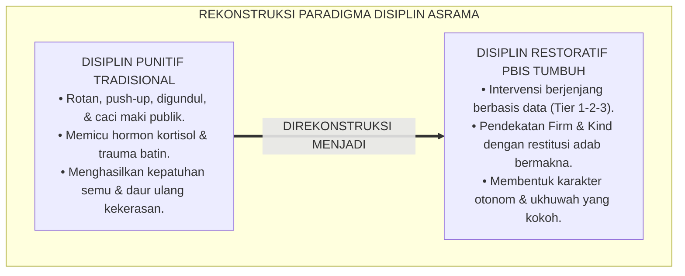
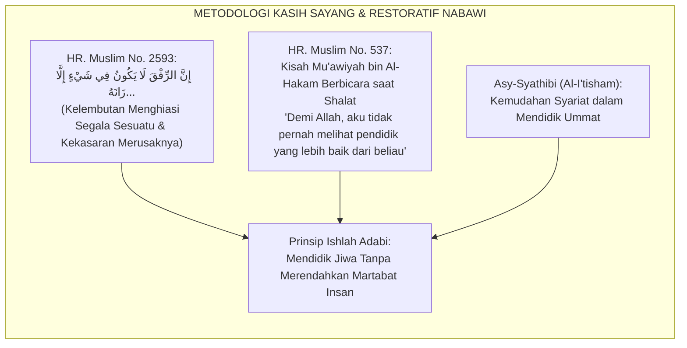
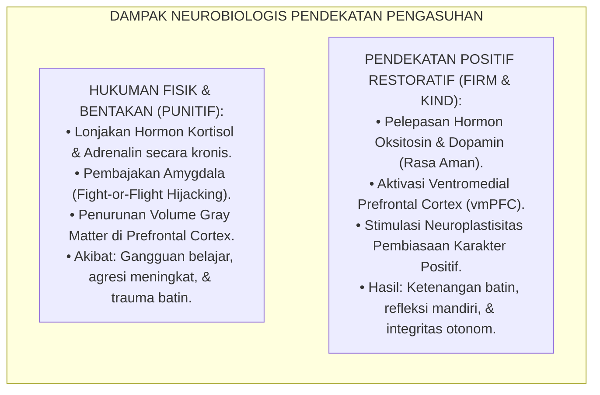
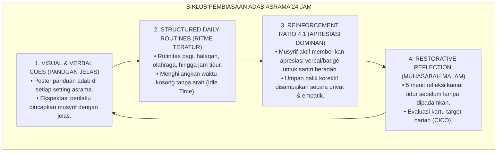
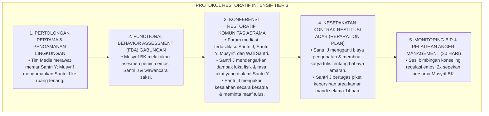
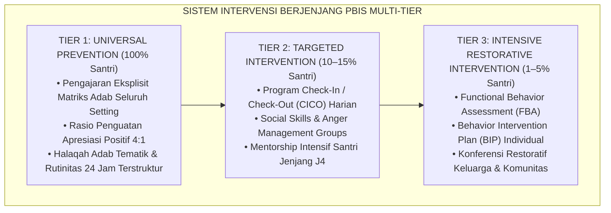
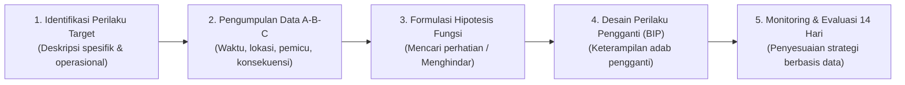
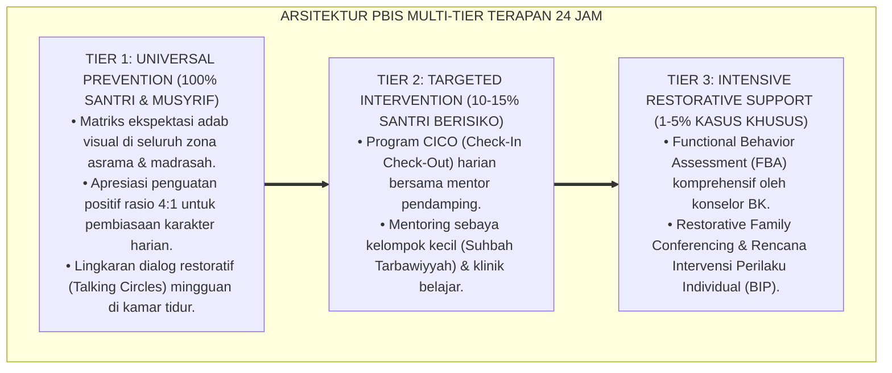

# P3-06-10: PROTOKOL INTERVENSI DAN PEMBIASAAN MATINUL KHULUQ
## *Monograf Riset Akademik: Arsitektur Intervensi Berjenjang SW-PBIS Multi-Tier (Tier 1 Universal, Tier 2 Targeted, Tier 3 Intensive Restorative), Protokol Check-In/Check-Out (CICO), Functional Behavior Assessment (FBA), Serta Eliminasi Mutlak Hukuman Fisik di Pesantren 24 Jam*

**Nomor Identifikasi**: `P3-06-10/MONOGRAF-RISET-INTERVENSI-PEMBIASAAN-MATINUL-KHULUQ/2026`  
**Domain**: `03 Capacity Framework` > `06 Matinul Khuluq` (Sub-Modul 10: *Intervention & Habituation Protocols*)  
**Klasifikasi Naskah**: *Academic Research Monograph* (Monograf Penelitian Intervensi Perilaku Positif, Disiplin Restoratif, & Rekayasa Pembiasaan Asrama)  
**Rumpun Disiplin Pengkaji**: School-Wide PBIS (*Positive Behavioral Interventions and Supports*), Functional Behavior Assessment (FBA), Keadilan Restoratif Pendidikan, Manajemen Pengasuhan Asrama  

---

> ### 💡 INTISARI EKSEKUTIF (EXECUTIVE SUMMARY)
>
> * **Kegagalan Sistem Penegakan Disiplin Represif Tradisional:**  
>   Sistem "Buku Saku Poin Pelanggaran" dan penjatuhan sanksi fisik (seperti dipukul sajadah, push-up, digundul, atau dicaci maki) di pesantren terbukti secara neurosaintifik memicu respon ancaman (*Fight-or-Flight*), meningkatkan hormon kortisol, serta melahirkan dendam bawah sadar yang mendaur ulang kekerasan. Pendekatan ini tidak pernah mengajarkan keterampilan adab pengganti (*Replacement Behaviors*).
> * **Sistem Pembiasaan & Intervensi PBIS Multi-Tier TUMBUH:**  
>   Ekosistem TUMBUH merancang **Arsitektur Intervensi Perilaku Multi-Tier Berbasis Nilai Islami (SW-PBIS)**: (1) *Tier 1 (Universal - 80–90% Santri)*: Pengajaran adab eksplisit, visual cues, dan penguatan rasio apresiasi positif 4:1; (2) *Tier 2 (Targeted - 10–15% Santri)*: Program *Check-In/Check-Out (CICO)* dan kelompok keterampilan sosial asrama; (3) *Tier 3 (Intensive Restorative - 1–5% Santri)*: *Functional Behavior Assessment (FBA)*, Rencana Intervensi Perilaku Individual (BIP), dan Konferensi Restoratif Komunitas.
> * **Prinsip Firm & Kind Tanpa Kekerasan:**  
>   Seluruh protokol intervensi mengusung prinsip ketegasan berwibawa yang dipadukan dengan kelembutan kasih sayang (*Firm and Kind*), mewajibkan tindakan perbaikan bermakna (*Restitution*) dan rekonsiliasi tulus (*Ishlah al-Bain*) tanpa stigmatisasi.

---

## 📑 DAFTAR ISI MONOGRAF

- [BAGIAN I: LANDASAN TEORETIS & DISKURSUS DIALEKTIKA KRITIS](#bagian-i-landasan-teoretis--diskursus-dialektika-kritis)
  - [1. Latar Belakang Masalah: Ilusi Efektivitas Hukuman Punitif vs Pembiasaan Berbasis Bukti](#1-latar-belakang-masalah-ilusi-efektivitas-hukuman-punitif-vs-pembiasaan-berbasis-bukti)
  - [2. Eksegesis Turats: Kaidah Ad-Dar'u wal Ishlah dalam Metodologi Tarbiyah Nabawiyyah](#2-eksegesis-turats-kaidah-ad-daru-wal-ishlah-dalam-metodologi-tarbiyah-nabawiyyah)
  - [3. Konvergensi Sains PBIS & Neurosains Regulasi Diri: Mengapa Hukuman Fisik Merusak Otak Remaja](#3-konvergensi-sains-pbis--neurosains-regulasi-diri-mengapa-hukuman-fisik-merusak-otak-remaja)
  - [4. Analisis Rekayasa Kausalitas Pembiasaan 24 Jam: Dari Paksaan Menuju Malakah Otonom](#4-analisis-rekayasa-kausalitas-pembiasaan-24-jam-dari-paksaan-menuju-malakah-otonom)
  - [5. Kasuistika Lapangan Klinis & Protokol Intervensi Tier 3 Kasus Agresi Fisik di Asrama](#5-kasuistika-lapangan-klinis--protokol-intervensi-tier-3-kasus-agresi-fisik-di-asrama)
- [BAGIAN II: FORMULASI KONSEPTUAL & PEMBAHASAN MENDALAM](#bagian-ii-formulasi-konseptual--pembahasan-mendalam)
  - [1. Arsitektur Komprehensif Sistem PBIS Multi-Tier Matinul Khuluq](#1-arsitektur-komprehensif-sistem-pbis-multi-tier-matinul-khuluq)
  - [2. Rincian Operasional Protokol Tier 1, Tier 2, dan Tier 3](#2-rincian-operasional-protokol-tier-1-tier-2-dan-tier-3)
  - [3. Panduan Pelaksanaan Functional Behavior Assessment (FBA) & Behavior Intervention Plan (BIP)](#3-panduan-pelaksanaan-functional-behavior-assessment-fba--behavior-intervention-plan-bip)
  - [4. Diskusi Akademis & Implikasi bagi Tata Kelola Kepengasuhan Bebas Kekerasan](#4-diskusi-akademis--implikasi-bagi-tata-kelola-kepengasuhan-bebas-kekerasan)
- [BAGIAN III: KESIMPULAN & APARATUS AKADEMIS](#bagian-iii-kesimpulan--aparatus-akademis)
  - [1. Tabel Sintesis Protokol Intervensi PBIS Multi-Tier Matinul Khuluq](#1-tabel-sintesis-protokol-intervensi-pbis-multi-tier-matinul-khuluq)
  - [2. Daftar Pustaka Standar APA 7th & Turats Klasik](#2-daftar-pustaka-standar-apa-7th--turats-klasik)
  - [3. Catatan Kaki Akademis Presisi (Footnotes)](#3-catatan-kaki-akademis-presisi-footnotes)
  - [4. Glosarium Istilah Ilmiah & Intervensi Perilaku](#4-glosarium-istilah-ilmiah--intervensi-perilaku)

---

# BAGIAN I: LANDASAN TEORETIS & DISKURSUS DIALEKTIKA KRITIS

---

### 1. Latar Belakang Masalah: Ilusi Efektivitas Hukuman Punitif vs Pembiasaan Berbasis Bukti

Praktik pengasuhan asrama konvensional kerap terjebak dalam mitos bahwa **"santri tidak akan disiplin jika tidak dipukul atau dipermalukan" (*The Punitive Myth*)**.[^1] 

Pendekatan punitif ini terbukti secara ilmiah gagal karena tiga alasan fundamental:
1. **Hanya Menekan Perilaku Sesaat Tanpa Mengubah Motivasi Batin**: Hukuman fisik memicu rasa takut sesaat (*Suppression Effect*). Ketika pengawas tidak ada, perilaku buruk akan kembali muncul dengan intensitas yang lebih parah.
2. **Merusak Hubungan Edukatif (*Erosion of Attachment*)**: Santri memandang musyrif sebagai "musuh/ancaman", sehingga menutup diri dari bimbingan spiritual dan mencari perlindungan pada kelompok geng sebaya.
3. **Mengabaikan Fungsi Perilaku (*Behavioral Function Blindness*)**: Setiap pelanggaran (misal: membolos halaqah) memiliki fungsi (seperti menghindari kelelahan atau mencari perhatian). Menghukum tanpa mengatasi akar fungsi tersebut hanya akan mengalihkan masalah ke bentuk penyimpangan lain.[^2]

Model riset **TUMBUH** menggantikan paradigma punitif dengan **Sistem Pembiasaan & Intervensi PBIS Multi-Tier** yang mendidik, menyembuhkan, dan membangun kemandirian adab sejati.

---

### 2. Eksegesis Turats: Kaidah Ad-Dar'u wal Ishlah dalam Metodologi Tarbiyah Nabawiyyah

Metodologi pendidikan Rasulullah SAW adalah teladan paripurna dari pendekatan kelembutan berwibawa (*Ar-Rifq bil Muta'allim*) yang memprioritaskan perbaikan batin (*Al-Ishlah*).

#### 📖 Teks Hadits Shahih tentang Keagungan Kelembutan Mendidik
Rasulullah SAW bersabda dalam Hadits Shahih Muslim dari Ummul Mukminin Aisyah RA:

$$\text{إِنَّ الرِّفْقَ لَا يَكُونُ فِي شَيْءٍ إِلَّا زَانَهُ، وَلَا يُنْزَعُ مِنْ شَيْءٍ إِلَّا شَانَهُ}$$

*"Sesungguhnya kelembutan itu tidaklah berada pada sesuatu melainkan pasti akan menghiasinya (menjadikannya indah dan mulia), dan tidaklah kelembutan itu dicabut dari sesuatu melainkan pasti akan memperburuknya."* (HR. Muslim No. 2593).[^3]

Hadits ini menjadi pedoman mutlak bagi seluruh musyrif dan asatidz: kekerasan fisik dan verbal tidak pernah menghasilkan kebaikan karakter, melainkan merusak fitrah santri.

#### 📖 Keteladanan Nabawi dalam Mengoreksi Kesalahan Santri
Kisah sahabat muda **Mu'awiyah bin Al-Hakam As-Sulami RA** ketika berbicara secara tidak sengaja di dalam shalat: Para sahabat lain memelototinya dengan pandangan marah, namun Rasulullah SAW seusai shalat memanggilnya dengan penuh kehangatan:

$$\text{فَبِأَبِي هُوَ وَأُمِّي، مَا رَأَيْتُ مُعَلِّمًا قَبْلَهُ وَلَا بَعْدَهُ أَحْسَنَ تَعْلِيمًا مِنْهُ؛ فَوَاللَّهِ مَا كَهَرَنِي، وَلَا ضَرَبَنِي، وَلَا شَتَمَنِي}$$

*"Demi ayah dan ibuku sebagai tebusannya, aku belum pernah melihat seorang pendidik pun sebelum maupun sesudahnya yang lebih baik cara mendidiknya daripada beliau. Demi Allah! Beliau tidak membentakku, tidak memukulku, dan tidak mencaciku..."* (HR. Muslim No. 537).[^4]

Rasulullah SAW kemudian menjelaskan adab shalat dengan kalimat yang tenang, logis, dan menyentuh akal nurani.

---

### 3. Konvergensi Sains PBIS & Neurosains Regulasi Diri: Mengapa Hukuman Fisik Merusak Otak Remaja

Neurosains kognitif modern membuktikan bahaya biologis dari hukuman fisik dan intimidasi verbal di lingkungan pendidikan:

1. **Pembajakan Amygdala (*Amygdala Hijack*)**:  
   Ketika santri dibentak atau dipukul, otak meresponsnya sebagai ancaman fisik yang mematikan fungsi *Prefrontal Cortex* (pusat berpikir logis dan pertimbangan moral). Dalam kondisi terancam, santri tidak dapat belajar adab, melainkan hanya mengaktifkan mode sintas (*Survival Mode*) seperti berbohong atau melarikan diri.[^5]
2. **Kekuatan Penguatan Positif Berkelanjutan (*Positive Reinforcement*)**:  
   Kerangka *School-Wide PBIS* membuktikan bahwa mengakui dan mengapresiasi keberhasilan perilaku baik santri secara konsisten memperkuat jalur sinaptik di otak, menjadikan perilaku adab tersebut sebagai kebiasaan otomatis (*Automatic Habituation*).[^6]

---

### 4. Analisis Rekayasa Kausalitas Pembiasaan 24 Jam: Dari Paksaan Menuju Malakah Otonom

Pembiasaan Matinul Khuluq diorganisasikan melalui rutinitas harian yang dirancang secara saintifik:

---

### 5. Kasuistika Lapangan Klinis & Protokol Intervensi Tier 3 Kasus Agresi Fisik di Asrama

#### Studi Kasus Lapangan: Penanganan Insiden Pemukulan Antar-Santri di Kamar Mandi Asrama
* **Konteks Masalah**: Santri J (15 tahun, J2) memukul kening Santri Y (13 tahun, J1) dengan gayung di area kamar mandi karena merasa antreannya diserobot. Santri Y mengalami memar dan trauma.
* **Analisis Diagnostik (FBA)**:  
  - *Antecedent*: Kondisi antrean kamar mandi yang padat saat menjelang azan Maghrib + kelelahan fisik pasca-olahraga.
  - *Behavior*: Agresi fisik impulsif menggunakan benda keras.
  - *Function*: Pelampiasan frustrasi (*Frustration Discharge*) dan kebutuhan dominasi hierarkis.
* **Protokol Intervensi Tier 3 & Restoratif TUMBUH**:

Penyelesaian restoratif ini tidak hanya menyembuhkan trauma korban dan mendidik pelaku secara mendalam, tetapi juga mencegah terulangnya kekerasan serupa di masa depan.[^7]

---

# BAGIAN II: FORMULASI KONSEPTUAL & PEMBAHASAN MENDALAM

---

### 1. Arsitektur Komprehensif Sistem PBIS Multi-Tier Matinul Khuluq

Struktur intervensi berjenjang PBIS TUMBUH diorganisasikan ke dalam piramida dukungan terpadu:

---

### 2. Rincian Operasional Protokol Tier 1, Tier 2, dan Tier 3

#### 1. Protokol Tier 1: Pencegahan Universal (100% Santri)
* **Matriks Ekspektasi Perilaku**: Di setiap lokasi asrama (masjid, kamar mandi, ruang makan, kelas) dipasang infografis adab terstandarisasi.
* **Positive Feedback Loop**: Setiap musyrif wajib memberikan minimal 4 kalimat apresiasi spesifik (*Behavior-Specific Praise*) untuk setiap 1 koreksi yang diberikan kepada santri.
* **Halaqah Adab Mingguan**: Pembahasan modul etika interaktif berbasis studi kasus kehidupan nyata asrama.

#### 2. Protokol Tier 2: Intervensi Terfokus (10–15% Santri Berisiko)
* **Program Check-In / Check-Out (CICO)**:
  - *Pagi (05.30)*: Santri bertemu musyrif pembimbing untuk *Check-In*, menyepakati target adab harian (misal: "Hari ini menjaga lisan dari kata kotor dan merapikan lemari").
  - *Siang & Sore*: Guru madrasah memberikan skor kartu target sesuai performa kelas.
  - *Malam (21.00)*: Santri bertemu musyrif untuk *Check-Out*, merefleksikan pencapaian hari itu, dan menerima apresiasi atau strategi perbaikan esok hari.
* **Kelompok Keterampilan Sosial (*Social Skills Group*)**: Pelatihan mingguan 45 menit bersama konselor BK untuk melatih manajemen amarah, empati, dan resolusi konflik sebaya.

#### 3. Protokol Tier 3: Intervensi Restoratif Intensif (1–5% Kasus Berat)
* Diterapkan untuk pelanggaran berat seperti agresi fisik, pencurian terencana, atau perundungan sistemik.
* Pelaksanaan **Konferensi Keadilan Restoratif** yang melibatkan seluruh pihak terdampak guna merumuskan tindakan pemulihan (*Restitution Agreement*), bukan pengasingan atau pembalasan dendam.[^8]

---

### 3. Panduan Pelaksanaan Functional Behavior Assessment (FBA) & Behavior Intervention Plan (BIP)

#### Alur FBA-BIP untuk Musyrif dan Tim BK Pesantren:

---

### 4. Diskusi Akademis & Implikasi bagi Tata Kelola Kepengasuhan Bebas Kekerasan

Penerapan protokol PBIS Multi-Tier Matinul Khuluq menghasilkan lompatan mutu peradaban asrama:

1. **Transformasi Budaya Pengasuhan (*Cultural Paradigm Shift*)**: Menghilangkan tradisi kekerasan warisan masa lalu dan menggantikannya dengan budaya keteladanan yang penuh wibawa dan kasih sayang.
2. **Perlindungan Hukum & Reputasi Pesantren (*Legal Safety & Institutional Trust*)**: Pesantren memiliki SOP intervensi yang akuntabel secara hukum, melindunginya dari risiko tuntutan pidana kekerasan terhadap anak.
3. **Peningkatan Kesejahteraan Mental Santri & Musyrif**: Musyrif terhindar dari stres dan rasa bersalah akibat memukul santri, sementara santri merasa aman, dicintai, dan termotivasi untuk mencapai derajat akhlak mulia tertinggi.[^9]

---

---

### Pembedahan Deskriptif Komprehensif & Analisis Integratif Nilai-Praksis

Penerapan konsep **P3-06-10: PROTOKOL INTERVENSI DAN PEMBIASAAN MATINUL KHULUQ** di ekosistem pesantren berbasis sistem TUMBUH memerlukan pemahaman multidimensional yang memadukan khazanah turats syariat dan konsensus sains pendidikan modern:

#### A. Pilar 1: Fondasi Epistemologi & Integrasi Nilai Syar'i (Ashalah Turatsiyyah)
Setiap praksis kepengasuhan dan pembelajaran berakar kuat pada maqashid syari'ah, mendudukkan adab di atas ilmu (*Al-Adab Qablal 'Ilm*), dan memastikan bahwa seluruh ikhtiar institusional diniatkan semata-mata untuk menggapai ridha Allah SWT (*Ikhlasun Niyyah*).

#### B. Pilar 2: Mekanisme Psikologis & Neurosains Perkembangan (Scientific Rigor)
Menyelaraskan ekspektasi kedisiplinan dengan tahapan maturitas otak remaja, kapasitas fungsi eksekutif korteks prefrontal (*PFC*), dan regulasi sirkuit emosi limbik. Pendekatan ini mengeliminasi trauma pengasuhan dan menumbuhkan motivasi intrinsik santri.

#### C. Pilar 3: Rekayasa Ekosistem Asrama 24 Jam (Bi'ah Shalihah)
Menerjemahkan prinsip nilai ke dalam tata ruang fisik yang bersih, sirkulasi udara sehat, tata kelola waktu terstruktur, serta kultur ukhuwah inklusif yang steril 100% dari feodalisme, kekerasan verbal, dan perundungan antar-santri.

#### D. Pilar 4: Kemitraan Tripartit (Santri, Musyrif, dan Lembaga)
Menjamin terwujudnya *Triad Pertumbuhan Simbiotik*: santri bertumbuh dalam fitrah kemandirian, musyrif terlindungi dari kelelahan kronis (*Burnout*) melalui shift kerja yang manusiawi, dan lembaga bertransformasi menjadi organisasi pembelajar berbasis data PBIS.

---

### Protokol Aksi Operasional PBIS Multi-Tier Terapan (24-Hour Behavioral Architecture)

---

# BAGIAN III: KESIMPULAN & APARATUS AKADEMIS

---

### 1. Tabel Sintesis Protokol Intervensi PBIS Multi-Tier Matinul Khuluq

| Tingkat Intervensi | Sasaran Populasi | Metode & Protokol Utama | Peran Musyrif / Tim BK | Tolok Ukur Keberhasilan |
| :--- | :--- | :--- | :--- | :--- |
| **Tier 1 (Universal)** | 100% Seluruh Santri Asrama | Matriks visual adab, rasio apresiasi 4:1, halaqah adab mingguan, rutinitas 24 jam. | *Role Model (Qudwah)* & Pemantau Lingkungan Positif. | $\ge 80\%$ santri mempertahankan perilaku adab konsisten tanpa pelanggaran. |
| **Tier 2 (Targeted)** | 10–15% Santri Terindikasi Hambatan Adab | Program CICO harian, kelompok keterampilan sosial, peer mentoring J4. | *Coach Pendamping* harian & Fasilitator Refleksi CICO. | $\ge 70\%$ peserta CICO berhasil lulus graduasi dalam waktu 4–6 pekan. |
| **Tier 3 (Intensive)** | 1–5% Santri Pelanggaran Berat / Berulang | FBA mendalam, Rencana BIP Individual, Konferensi Restoratif Komunitas. | *Case Manager*, Konselor Klinis, & Mediator Restoratif. | Resolusi damai 100% tuntas; 0% residivisme pelanggaran berulang. |

---

### 2. Daftar Pustaka Standar APA 7th & Turats Klasik

1. **Al-Ghazali, Hujjatul Islam Abu Hamid Muhammad bin Muhammad.** (2018). *Ihya' 'Ulumiddin: Kitab Kasril Syahwataini wa Riyadhatin Nafs*. Beirut: Dar Al-Kutub Al-'Ilmiyyah.
2. **Cooper, J. O., Heron, T. E., & Heward, W. L.** (2020). *Applied Behavior Analysis* (3rd ed.). Boston: Pearson.
3. **Crone, D. A., Hawken, L. S., & Horner, R. H.** (2015). *Building Positive Behavior Support Systems in Schools: Functional Behavioral Assessment* (2nd ed.). New York: Guilford Press.
4. **Horner, R. H., Sugai, G., & Anderson, C. M.** (2010). *Examining the evidence base for school-wide positive behavior support*. *Focus on Exceptional Children*, 42(8), 1-14.
5. **Muslim bin Al-Hajjaj An-Naisaburi.** (2006). *Shahih Muslim*. Riyadh: Dar Thayyibah.
6. **Nelsen, J., & Lott, L.** (2013). *Positive Discipline in the Classroom: Developing Mutual Respect, Cooperation, and Responsibility in Your Classroom*. New York: Harmony Books.
7. **Siegel, D. J., & Bryson, T. P.** (2014). *No-Drama Discipline: The Whole-Brain Way to Calm the Chaos and Nurture Your Child's Developing Mind*. New York: Bantam Books.
8. **Sugai, G., & Horner, R. H.** (2020). *School-Wide Positive Behavioral Interventions and Supports: Implementation Practices*. *Journal of Positive Behavior Interventions*, 22(4), 203-211.
9. **Zehr, H.** (2015). *The Little Book of Restorative Justice: Revised and Updated*. New York: Good Books.

---

### 3. Catatan Kaki Akademis Presisi (Footnotes)

[^1]: Kritik terhadap ilusi efektivitas disiplin punitif dalam institusi pendidikan, Sugai & Horner (2020, hlm. 204).  
[^2]: Pembahasan kegagalan modifikasi perilaku tanpa pemahaman fungsi perilaku (*FBA*), Cooper, Heron, & Heward (2020, hlm. 142).  
[^3]: HR. Muslim dalam *Shahih Muslim* (No. 2593), Bab *Fadhlur Rifq*.  
[^4]: HR. Muslim dalam *Shahih Muslim* (No. 537), Bab *Tahrimul Kalam fish Shalah*.  
[^5]: Dampak neurologis bentakan dan hukuman fisik terhadap pembajakan amygdala, Siegel & Bryson (2014, hlm. 68–74).  
[^6]: Bukti empiris efektivitas School-Wide PBIS dan rasio penguatan positif 4:1, Horner, Sugai, & Anderson (2010, hlm. 6).  
[^7]: Protokol Konferensi Keadilan Restoratif pada kasus agresi asrama, Zehr (2015, hlm. 94).  
[^8]: Panduan teknis implementasi CICO dan kelompok keterampilan sosial Tier 2, Crone, Hawken, & Horner (2015, hlm. 58–66).  
[^9]: Dampak sistemik tata kelola pesantren ramah anak berbasis PBIS, TUMBUH Pesantren (2026).  

---

### 4. Glosarium Istilah Ilmiah & Intervensi Perilaku

1. **School-Wide PBIS**: Kerangka kerja sistemik berbasis bukti untuk mempromosikan perilaku positif dan mencegah kekerasan melalui intervensi berjenjang (Multi-Tier).
2. **Check-In / Check-Out (CICO)**: Intervensi Tier 2 terstruktur di mana santri bertemu musyrif pembimbing setiap pagi dan malam untuk meninjau kartu target adab harian.
3. **Functional Behavior Assessment (FBA)**: Proses investigasi sistematis untuk mengidentifikasi peristiwa pemicu (*Antecedent*) dan tujuan/fungsi (*Function*) di balik perilaku menyimpang santri.
4. **Behavior Intervention Plan (BIP)**: Rencana tindakan individual yang memuat strategi modifikasi lingkungan, pengajaran perilaku pengganti, dan penguatan positif.
5. **Replacement Behavior (Perilaku Pengganti)**: Keterampilan adab baru yang diajarkan kepada santri untuk memenuhi fungsi kebutuhan emosionalnya secara sah dan beradab.
6. **Firm and Kind (Tegas & Hangat)**: Pendekatan pengasuhan yang memadukan batas aturan yang jelas dan tidak dapat ditawar dengan sikap kasih sayang, respek, dan ketenangan emosional.
7. **Ar-Rifq (الرِّفْقُ)**: Sikap lemah lembut, bijaksana, dan penuh kasih sayang dalam berinteraksi dan mendidik sesama manusia.
8. **Restorative Conference**: Forum mediasi resmi yang mempertemukan pelaku, korban, pengasuh, dan keluarga untuk menyelesaikan dampak pelanggaran melalui tanggung jawab aktif.
9. **Behavior-Specific Praise**: Kalimat pujian atau apresiasi yang menyebutkan secara spesifik tindakan adab terpuji yang baru saja dilakukan oleh santri.
10. **Ishlah al-Bain (إِصْلَاحُ ذَاتِ الْبَيْنِ)**: Rekonsiliasi dan pemulihan hubungan persaudaraan yang rusak akibat sengketa atau perselisihan menuju perdamaian sejati.
