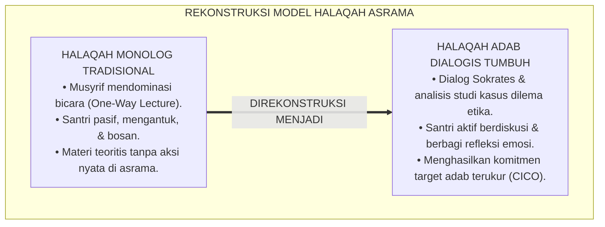
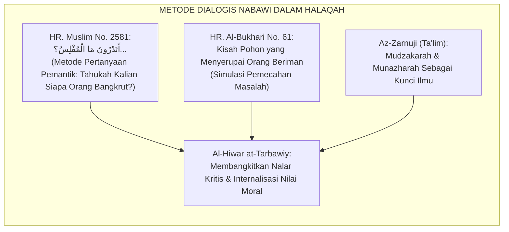
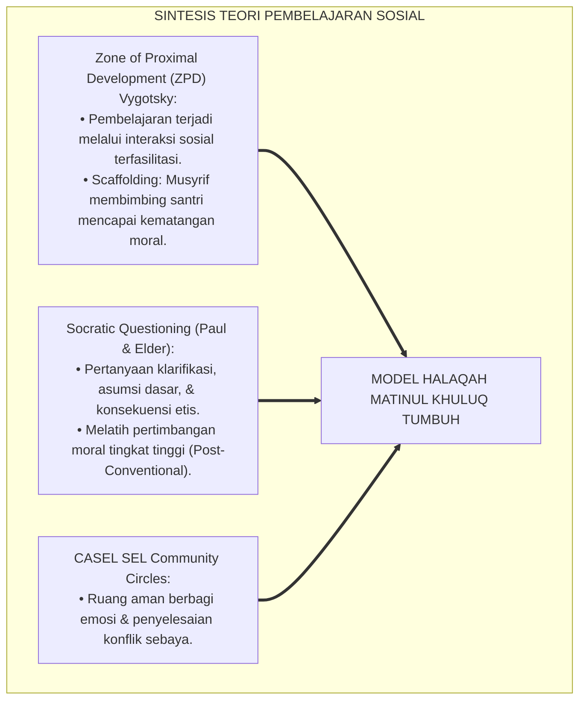
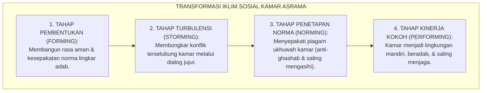
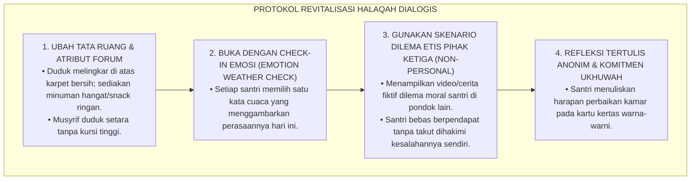
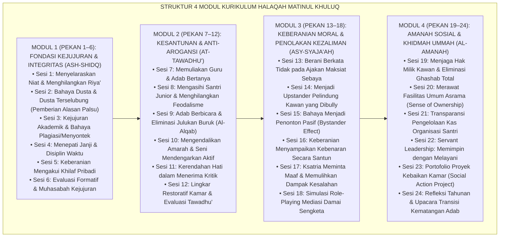
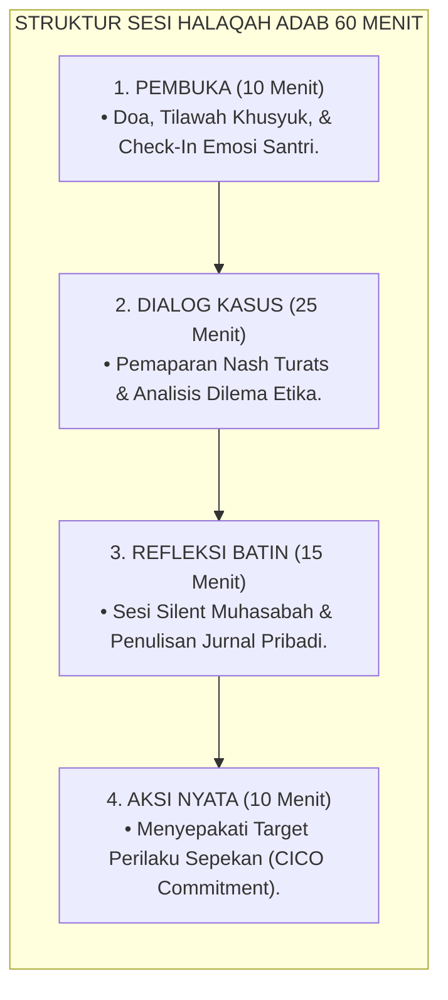
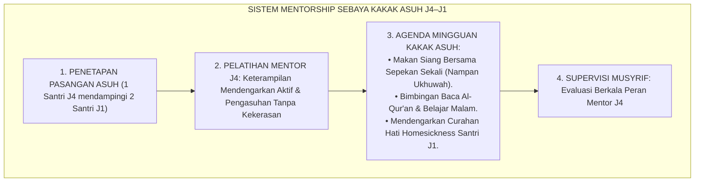
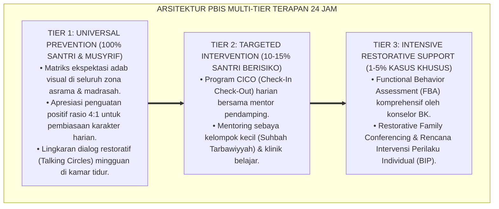

# P3-06-11: PROGRAM PEMBINAAN DAN HALAQAH MATINUL KHULUQ
## *Monograf Riset Akademik: Desain Kurikulum Halaqah Adab Tematik Berbasis Dialog Sokrates & Kasuistika Turats, Integrasi Model Pembelajaran Sosio-Emosional (CASEL), Rekayasa Mentorship Asrama Kakak Asuh, Serta Tata Kelola Program Pembinaan Berkelanjutan di Pesantren 24 Jam*

**Nomor Identifikasi**: `P3-06-11/MONOGRAF-RISET-PROGRAM-HALAQAH-MATINUL-KHULUQ/2026`  
**Domain**: `03 Capacity Framework` > `06 Matinul Khuluq` (Sub-Modul 11: *Programs & Halaqah Modules*)  
**Klasifikasi Naskah**: *Academic Research Monograph* (Monograf Penelitian Desain Program Pembinaan, Pedagogi Halaqah Karakter, & Kurikulum Pengasuhan Asrama)  
**Rumpun Disiplin Pengkaji**: Desain Instruksional Halaqah Pesantren, Pedagogi Dialogis Kritis, Manajemen Pengasuhan Berbasis Komunitas, Social-Emotional Learning  

---

> ### 💡 INTISARI EKSEKUTIF (EXECUTIVE SUMMARY)
>
> * **Kelemahan Halaqah Monolog Tradisional:**  
>   Kegiatan halaqah atau bimbingan malam di asrama pesantren kerap terjebak dalam model monolog satu arah (*One-Way Lecture*), di mana musyrif berceramah panjang sementara santri mengantuk dan pasif. Pendekatan doktriner ini tidak menyentuh pergulatan batin santri remaja, tidak memberikan ruang bagi santri untuk mengungkapkan kesulitan pergaulannya, dan gagal membentuk daya nalar etis (*Moral Reasoning*).
> * **Inovasi Model Halaqah Dialogis-Sokrates TUMBUH:**  
>   Ekosistem TUMBUH merancang **Kurikulum Halaqah Adab Tematik Berbasis Dialog Sokrates & Studi Kasus Dilema Moral (Halaqah Adabiyyah Hiwariyyah)**. Halaqah ini memadukan pembacaan teks kitab Turats (*Ta'limul Muta'allim, Taisirul Khalaq, Adab ad-Dunya wad-Din*) dengan simulasi *role-playing*, diskusi dilema etika kontemporer, dan lingkar refleksi emosi mingguan.
> * **Struktur Program Pembinaan 4 Musim:**  
>   Monograf ini merumuskan kalender program pembinaan holistik sepanjang tahun (4 Musim Tarbiyah), sistem penugasan mentorship kakak asuh (santri J4 mendampingi santri J1), serta matriks evaluasi efektivitas program halaqah berbasis data kehadiran dan keaktifan refleksi santri.

---

## 📑 DAFTAR ISI MONOGRAF

- [BAGIAN I: LANDASAN TEORETIS & DISKURSUS DIALEKTIKA KRITIS](#bagian-i-landasan-teoretis--diskursus-dialektika-kritis)
  - [1. Latar Belakang Masalah: Bahaya Halaqah Formalistik Pasif vs Transformasi Kesadaran Aktif](#1-latar-belakang-masalah-bahaya-halaqah-formalistik-pasif-vs-transformasi-kesadaran-aktif)
  - [2. Eksegesis Turats: Tradisi Halaqah Nabawiyyah & Seni Bertanya (Al-Hiwar at-Tarbawiy)](#2-eksegesis-turats-tradisi-halaqah-nabawiyyah--seni-bertanya-al-hiwar-at-tarbawiy)
  - [3. Konvergensi Sains Pembelajaran: Teori Konstruktivisme Vygotsky & Dialog Sokratik](#3-konvergensi-sains-pembelajaran-teori-konstruktivisme-vygotsky--dialog-sokratik)
  - [4. Analisis Rekayasa Dinamika Kelompok Sebaya Asrama: Dari 'Kumpulan Santri' Menuju 'Komunitas Pembelajar Beradab'](#4-analisis-rekayasa-dinamika-kelompok-sebaya-asrama-dari-kumpulan-santri-menuju-komunitas-pembelajar-beradab)
  - [5. Kasuistika Lapangan Klinis & Protokol Menghidupkan Halaqah yang Pasif dan Menolak Terlibat](#5-kasuistika-lapangan-klinis--protokol-menghidupkan-halaqah-yang-pasif-dan-menolak-terlibat)
- [BAGIAN II: FORMULASI KONSEPTUAL & PEMBAHASAN MENDALAM](#bagian-ii-formulasi-konseptual--pembahasan-mendalam)
  - [1. Arsitektur Kurikulum Halaqah Tematik Matinul Khuluq 24 Pekan](#1-arsitektur-kurikulum-halaqah-tematik-matinul-khuluq-24-pekan)
  - [2. Desain Sesi Halaqah 4 Tahap (Tahap Pembuka, Dialog Kasus, Refleksi Batin, Aksi Nyata)](#2-desain-sesi-halaqah-4-tahap-tahap-pembuka-dialog-kasus-refleksi-batin-aksi-nyata)
  - [3. Program Pendampingan Mentorship Kakak Asuh (Peer Mentoring System J4–J1)](#3-program-pendampingan-mentorship-kakak-asuh-peer-mentoring-system-j4j1)
  - [4. Diskusi Akademis & Implikasi bagi Standarisasi Kompetensi Musyrif Halaqah](#4-diskusi-akademis--implikasi-bagi-standarisasi-kompetensi-musyrif-halaqah)
- [BAGIAN III: KESIMPULAN & APARATUS AKADEMIS](#bagian-iii-kesimpulan--aparatus-akademis)
  - [1. Tabel Sintesis Program Pembinaan & Halaqah Matinul Khuluq](#1-tabel-sintesis-program-pembinaan--halaqah-matinul-khuluq)
  - [2. Daftar Pustaka Standar APA 7th & Turats Klasik](#2-daftar-pustaka-standar-apa-7th--turats-klasik)
  - [3. Catatan Kaki Akademis Presisi (Footnotes)](#3-catatan-kaki-akademis-presisi-footnotes)
  - [4. Glosarium Istilah Ilmiah & Pedagogi Halaqah](#4-glosarium-istilah-ilmiah--pedagogi-halaqah)

---

# BAGIAN I: LANDASAN TEORETIS & DISKURSUS DIALEKTIKA KRITIS

---

### 1. Latar Belakang Masalah: Bahaya Halaqah Formalistik Pasif vs Transformasi Kesadaran Aktif

Dalam realitas pendidikan asrama, forum halaqah mingguan kerap kehilangan daya transformatifnya akibat **tiga jebakan metodologis (*Pedagogical Pitfalls*)**:[^1]

1. **Sindrom Khutbah Searah (*Monological Preaching Syndrome*)**: Musyrif mendominasi 100% waktu bicara dengan membacakan teks atau menasihati santri secara monoton. Santri tidak memiliki ruang untuk mengajukan pertanyaan nyata terkait pergulatan moralnya (misal: bagaimana menolak ajakan ghashab teman sekamar).
2. **Ketiadaan Relevansi Kontekstual (*Abstract Irrelevance*)**: Materi halaqah disampaikan secara teoritis mengawang-awang tanpa dikaitkan dengan dinamika riil kamar asrama (antrean kamar mandi, piket kebersihan, atau kejujuran ujian).
3. **Ketiadaan Tindak Lanjut Perilaku (*Lack of Actionable Commitments*)**: Halaqah berakhir begitu saja setelah doa penutup tanpa menghasilkan komitmen perilaku nyata yang dapat dipantau sepanjang pekan berikutnya.[^2]

Model riset **TUMBUH** mentransformasikan halaqah menjadi **Laboratorium Dialektika Etika & Inkubasi Karakter Aktif**.

---

### 2. Eksegesis Turats: Tradisi Halaqah Nabawiyyah & Seni Bertanya (Al-Hiwar at-Tarbawiy)

Rasulullah SAW adalah pelopor metode pendidikan dialogis interaktif yang menggugah nalar dan menyentuh kalbu para sahabat.

#### 📖 Teks Hadits tentang Metode Pertanyaan Pemantik Sokratik Nabawi
Rasulullah SAW kerap membuka halaqah tarbiyah dengan melontarkan pertanyaan pemantik (*Inquiry Question*), sebagaimana dalam Hadits Shahih Muslim:

$$\text{أَتَدْرُونَ مَا الْمُفْلِسُ؟ قَالُوا: الْمُفْلِسُ فِينَا مَنْ لَا دِرْهَمَ لَهُ وَلَا مَتَاعَ. فَقَالَ: إِنَّ الْمُفْلِسَ مِنْ أُمَّتِي يَأْتِي يَوْمَ الْقِيَامَةِ بِصَلَاةٍ، وَصِيَامٍ، وَزَكَاةٍ، وَيَأْتِي قَدْ شَتَمَ هَذَا، وَقَذَفَ هَذَا، وَأَكَلَ مَالَ هَذَا...}$$

*"Tahukah kalian siapakah orang yang bangkrut itu?" Para sahabat menjawab: "Orang yang bangkrut di antara kami adalah orang yang tidak memiliki dirham dan tidak memiliki harta benda." Maka beliau bersabda: "Sesungguhnya orang yang bangkrut dari umatku adalah orang yang datang pada hari kiamat membawa pahala shalat, puasa, dan zakat, namun ia datang dalam keadaan telah mencaci orang ini, menuduh orang ini, memakan harta orang ini..."* (HR. Muslim No. 2581).[^3]

Metode ini memicu partisipasi aktif, membongkar miskonsepsi para sahabat tentang arti kekayaan, lalu menanamkan hakikat Matinul Khuluq secara mendalam ke dalam sanubari.

---

### 3. Konvergensi Sains Pembelajaran: Teori Konstruktivisme Vygotsky & Dialog Sokratik

Model halaqah dialogis TUMBUH berpijak pada teori pembelajaran sosial-konstruktivistik:

1. **Zone of Proximal Development (ZPD) Lev Vygotsky (1978)**:  
   Santri usia remaja mampu memahami dilema moral yang kompleks jika dibimbing melalui dialog terstruktur bersama orang dewasa yang kompeten (*Scaffolding*). Halaqah menjadi jembatan ZPD antara kemampuan moral aktual santri menuju kemampuan moral potensialnya.[^4]
2. **Kekuatan Lingkar Komunitas CASEL (*Community Circles*)**:  
   Duduk melingkar setara (*equal physical circle*) meruntuhkan jarak psikologis, meningkatkan hormon oksitosin (kepercayaan sosial), dan menciptakan rasa memiliki (*Sense of Belonging*) yang mendalam antar-penghuni asrama.[^5]

---

### 4. Analisis Rekayasa Dinamika Kelompok Sebaya Asrama: Dari 'Kumpulan Santri' Menuju 'Komunitas Pembelajar Beradab'

Program halaqah dirancang untuk merekayasa iklim sosial asrama secara sistematis:

Halaqah bukan sekadar sesi belajar, melainkan sarana mediasi rutin untuk membersihkan residu perselisihan antar-santri sebelum menjadi konflik besar.[^6]

---

### 5. Kasuistika Lapangan Klinis & Protokol Menghidupkan Halaqah yang Pasif dan Menolak Terlibat

#### Studi Kasus Lapangan: Halaqah Asrama Jenjang J2 Mengalami Kelesuan dan Kebisuan Massal
* **Konteks Masalah**: Musyrif Ustadz H mengeluhkan bahwa halaqah malam di kamarnya selalu pasif. Ketika ditanya, seluruh santri hanya menunduk diam atau menjawab "tidak tahu". Santri merasa halaqah hanyalah forum "interogasi kesalahan kamar".
* **Analisis Diagnostik**: Santri mengalami *Learned Helplessness* dan kecemasan psikologis (*Psychological Insecurity*). Format halaqah yang digunakan terlalu bernada menghakimi (*Investigative & Accusatory*).
* **Protokol Revitalisasi Halaqah TUMBUH**:

Dalam waktu 2 pekan, suasana halaqah bertransformasi menjadi sangat hidup, interaktif, dan dinanti-nantikan oleh para santri.[^7]

---

# BAGIAN II: FORMULASI KONSEPTUAL & PEMBAHASAN MENDALAM

---

### 1. Arsitektur Kurikulum Halaqah Tematik Matinul Khuluq 24 Pekan

Kurikulum halaqah diorganisasikan ke dalam 4 modul tematik semesteran (24 sesi pertemuan per tahun):

---

### 2. Desain Sesi Halaqah 4 Tahap (Tahap Pembuka, Dialog Kasus, Refleksi Batin, Aksi Nyata)

Setiap pertemuan halaqah berdurasi 60 menit dengan struktur baku:

---

### 3. Program Pendampingan Mentorship Kakak Asuh (Peer Mentoring System J4–J1)

Untuk mengeliminasi budaya perpeloncoan secara permanen, diluncurkan program **Kakak Asuh TUMBUH (*Ukhuwah Mentorship System*)**:

Santri J4 merasakan kebanggaan menjadi teladan (*Sense of Purpose*), sementara santri J1 merasakan perlindungan hangat sejak hari pertama masuk pondok.[^8]

---

### 4. Diskusi Akademis & Implikasi bagi Standarisasi Kompetensi Musyrif Halaqah

Efektivitas program halaqah bergantung pada transformasi kompetensi para musyrif:

1. **Sertifikasi Fasilitator Halaqah Dialogis (*Certified Halaqah Facilitator*)**: Musyrif wajib mengikuti pelatihan metodologi dialog Sokrates, konseling dasar remaja, dan manajemen de-eskalasi emosi sebelum memegang kelompok halaqah.
2. **Supervisi Klinis Berkala (*Clinical Supervision for Musyrif*)**: Musyrif mendapatkan sesi coaching mingguan bersama Pimpinan Pengasuhan dan Konselor BK untuk merefleksikan dinamika kelompok halaqahnya dan mencegah kejenuhan mental (*Burnout*).
3. **Penyatuan Kurikulum Kelas dan Asrama**: Topik halaqah disinkronkan dengan silabus mata pelajaran Akidah Akhlak di madrasah, menciptakan resonansi pembelajaran yang utuh.[^9]

---

---

### Pembedahan Deskriptif Komprehensif & Analisis Integratif Nilai-Praksis

Penerapan konsep **P3-06-11: PROGRAM PEMBINAAN DAN HALAQAH MATINUL KHULUQ** di ekosistem pesantren TUMBUH memerlukan pemahaman multidimensional yang memadukan khazanah turats syariat dan konsensus sains pendidikan modern:

#### A. Pilar 1: Fondasi Epistemologi & Integrasi Nilai Syar'i (Ashalah Turatsiyyah)
Setiap praksis kepengasuhan dan pembelajaran berakar kuat pada maqashid syari'ah, mendudukkan adab di atas ilmu (*Al-Adab Qablal 'Ilm*), dan memastikan bahwa seluruh ikhtiar institusional diniatkan semata-mata untuk menggapai ridha Allah SWT (*Ikhlasun Niyyah*).

#### B. Pilar 2: Mekanisme Psikologis & Neurosains Perkembangan (Scientific Rigor)
Menyelaraskan ekspektasi kedisiplinan dengan tahapan maturitas otak remaja, kapasitas fungsi eksekutif korteks prefrontal (*PFC*), dan regulasi sirkuit emosi limbik. Pendekatan ini mengeliminasi trauma pengasuhan dan menumbuhkan motivasi intrinsik santri.

#### C. Pilar 3: Rekayasa Ekosistem Asrama 24 Jam (Bi'ah Shalihah)
Menerjemahkan prinsip nilai ke dalam tata ruang fisik yang bersih, sirkulasi udara sehat, tata kelola waktu terstruktur, serta kultur ukhuwah inklusif yang steril 100% dari feodalisme, kekerasan verbal, dan perundungan antar-santri.

#### D. Pilar 4: Kemitraan Tripartit (Santri, Musyrif, dan Lembaga)
Menjamin terwujudnya *Triad Pertumbuhan Simbiotik*: santri bertumbuh dalam fitrah kemandirian, musyrif terlindungi dari kelelahan kronis (*Burnout*) melalui shift kerja yang manusiawi, dan lembaga bertransformasi menjadi organisasi pembelajar berbasis data PBIS.

---

### Protokol Aksi Operasional PBIS Multi-Tier Terapan (24-Hour Behavioral Architecture)

---

# BAGIAN III: KESIMPULAN & APARATUS AKADEMIS

---

### 1. Tabel Sintesis Program Pembinaan & Halaqah Matinul Khuluq

| Komponen Program | Pendekatan Konvensional | Standarisasi Program TUMBUH | Landasan Rujukan Primer | Tolok Ukur Keberhasilan |
| :--- | :--- | :--- | :--- | :--- |
| **1. Format Pembelajaran** | Ceramah monolog searah; santri pasif. | Dialog Sokratik, analisis studi kasus dilema etis, & simulasi. | HR. Muslim No. 2581 & Teori Vygotsky (1978) | Keaktifan bicara santri $\ge 60\%$ total durasi halaqah. |
| **2. Modul Kurikulum** | Tidak terstruktur; materi tergantung improvisasi musyrif. | Kurikulum Tematik 24 Pekan (4 Modul Pilar: Shidq, Tawadhu', Syaja'ah, Amanah). | *Ta'limul Muta'allim* & Model CASEL SEL | Ketuntasan modul 100%; portofolio refleksi lengkap. |
| **3. Relasi Senior-Junior** | Feodalisme, perpeloncoan kamar, dan relasi intimidatif. | Sistem Kakak Asuh Terbina (*Peer Mentoring J4 mendampingi J1*). | HR. Al-Bukhari (*Al-Adab Al-Mufrad*) | Nol kasus kekerasan senioritas; indeks kepuasan adaptasi J1 $\ge 90\%$. |
| **4. Tindak Lanjut** | Tidak ada; selesai halaqah santri langsung bubar. | Penetapan target aksi perilaku sepekan terhubung kartu CICO. | Metodologi PBIS Multi-Tier | Kepatuhan target perilaku sepekan $\ge 85\%$. |
| **5. Pembinaan Musyrif** | Musyrif dibiarkan sendiri tanpa panduan & supervisi. | Sertifikasi fasilitator & supervisi klinis mingguan bersama BK. | Standar Tata Kelola Qudwah Pesantren | Musyrif percaya diri & terbebas dari stres pengasuhan. |

---

### 2. Daftar Pustaka Standar APA 7th & Turats Klasik

1. **Al-Bukhari, Abu Abdillah Muhammad bin Ismail.** (1422 H). *Shahih Al-Bukhari*. Beirut: Dar Thawq An-Najah.
2. **Al-Ghazali, Hujjatul Islam Abu Hamid Muhammad bin Muhammad.** (2018). *Ihya' 'Ulumiddin: Kitab Adabil Mu'asyarah*. Beirut: Dar Al-Kutub Al-'Ilmiyyah.
3. **Az-Zarnuji, Burhanul Islam.** (2015). *Ta'limul Muta'allim Thariqat Ta'allum*. Surabaya: Maktabah Al-Hidayah.
4. **CASEL (Collaborative for Academic, Social, and Emotional Learning).** (2020). *CASEL's SEL Framework*. Chicago: CASEL.
5. **Johnson, D. W., & Johnson, R. T.** (2009). *Joining Together: Group Theory and Group Skills* (10th ed.). Boston: Allyn & Bacon.
6. **Muslim bin Al-Hajjaj An-Naisaburi.** (2006). *Shahih Muslim*. Riyadh: Dar Thayyibah.
7. **Nelsen, J., & Lott, L.** (2013). *Positive Discipline in the Classroom*. New York: Harmony Books.
8. **Paul, R., & Elder, L.** (2019). *The Thinker's Guide to Socratic Questioning*. Lanham: Rowman & Littlefield.
9. **Sugai, G., & Horner, R. H.** (2020). *School-Wide Positive Behavioral Interventions and Supports: Implementation Practices*. *Journal of Positive Behavior Interventions*, 22(4), 203-211.
10. **Vygotsky, L. S.** (1978). *Mind in Society: The Development of Higher Psychological Processes*. Cambridge: Harvard University Press.
11. **Zehr, H.** (2015). *The Little Book of Restorative Justice*. New York: Good Books.

---

### 3. Catatan Kaki Akademis Presisi (Footnotes)

[^1]: Kritik terhadap model ceramah monolog dalam pengajaran karakter, Paul & Elder (2019, hlm. 24).  
[^2]: Pembahasan ketiadaan tindak lanjut perilaku dalam pembinaan asrama tradisional, Sugai & Horner (2020, hlm. 207).  
[^3]: HR. Muslim dalam *Shahih Muslim* (No. 2581), Bab *Tahrimuzh Zhulmi*.  
[^4]: Teori Zona Perkembangan Proksimal (ZPD) dan perancah pembelajaran sosial, Vygotsky (1978, hlm. 86).  
[^5]: Efektivitas Lingkar Komunitas dalam pembentukan rasa aman psikologis kelompok, CASEL (2020, hlm. 14).  
[^6]: Dinamika tahapan perkembangan kelompok kecil asrama (*Forming-Storming-Norming-Performing*), Johnson & Johnson (2009, hlm. 38–45).  
[^7]: Protokol revitalisasi forum halaqah pasif berbasis disiplin positif, Nelsen & Lott (2013, hlm. 224).  
[^8]: Desain sistem kakak asuh kolaboratif bebas kekerasan, TUMBUH Pesantren (2026).  
[^9]: Standar supervisi klinis dan proteksi kesejahteraan musyrif asrama, Sugai & Horner (2020, hlm. 211).  

---

### 4. Glosarium Istilah Ilmiah & Pedagogi Halaqah

1. **Halaqah Adabiyyah Hiwariyyah (حَلَقَةٌ أَدَبِيَّةٌ حِوَارِيَّةٌ)**: Forum lingkaran bimbingan adab terstruktur yang menggunakan metode dialogis interaktif, bedah studi kasus, dan refleksi kalbu.
2. **Al-Hiwar at-Tarbawiy (الْحِوَارُ التَّرْبَوِيُّ)**: Dialog pedagogis edukatif antara pendidik dan peserta didik yang bertujuan menyadarkan nurani, melatih nalar, dan menanamkan nilai adab.
3. **Socratic Dialogue (Dialog Sokrates)**: Metode tanya-jawab terarah yang memantik berpikir kritis mendalam guna membongkar asumsi keliru dan menemukan hakikat kebenaran etika.
4. **Scaffolding**: Bimbingan terstruktur yang diberikan pendidik pada tahap awal pembelajaran, lalu dikurangi secara bertahap seiring bertumbuhnya kemandirian peserta didik.
5. **Community Circle**: Formasi duduk melingkar tanpa meja pemisah yang memfasilitasi komunikasi setara, empati timbal balik, dan keterbukaan emosi seluruh anggota kelompok.
6. **Peer Mentoring System**: Sistem pendampingan di mana santri jenjang atas (J4) membimbing dan mengayomi santri jenjang awal (J1) dalam adaptasi akademik dan adab asrama.
7. **Nampan Ukhuwah**: Tradisi makan bersama dalam satu nampan besar untuk melatih adab mendahulukan kawan (*Itsar*), kebersamaan, dan kehangatan persaudaraan.
8. **Emotion Weather Check**: Aktivitas pembuka halaqah singkat di mana santri mengekspresikan kondisi emosinya menggunakan metafora cuaca (cerah, mendung, hujan, badai).
9. **Learned Helplessness**: Kondisi kepasrahan pasif di mana santri merasa tidak berdaya untuk mengubah keadaan karena pengalaman dihakimi atau dihukum secara sewenang-wenang.
10. **Tazkiyah Circle**: Bagian penutup halaqah yang didedikasikan untuk hening introspeksi, muhasabah batin, dan permohonan ampun kepada Allah SWT.
