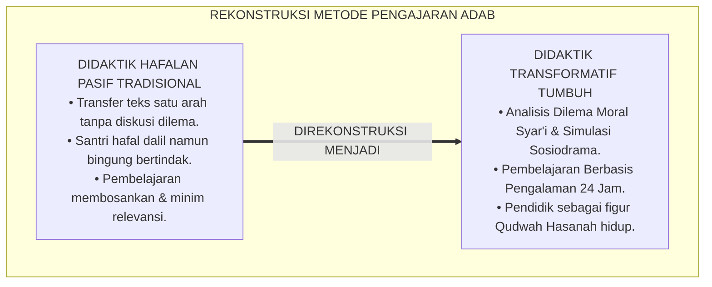
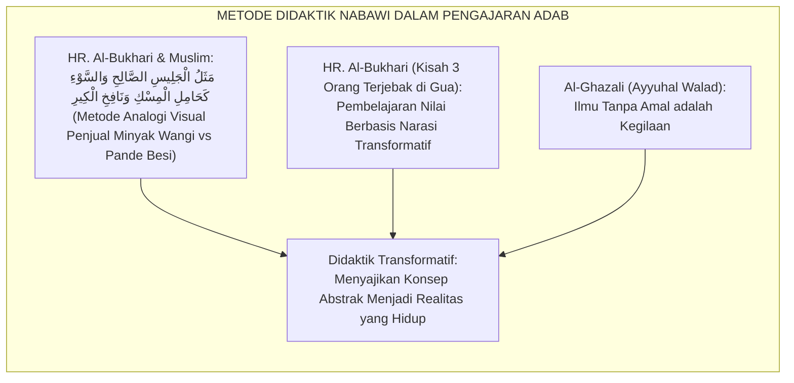
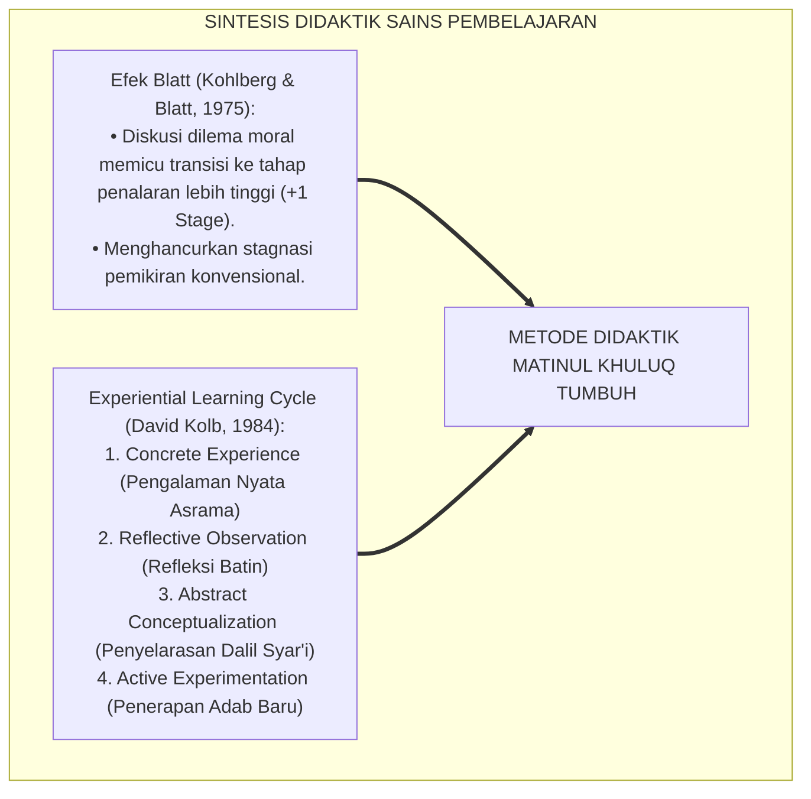
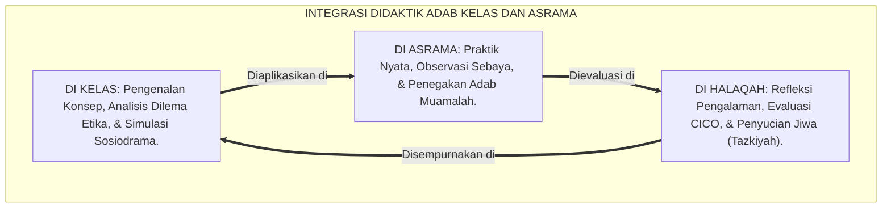
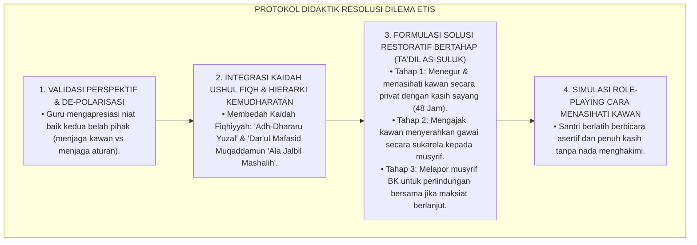
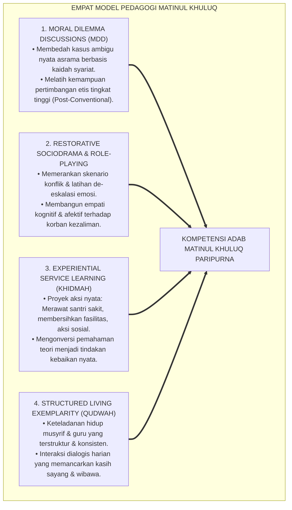

# P3-06-12: METODE PEDAGOGI DAN DIDAKTIK AKHLAK MATINUL KHULUQ
## *Monograf Riset Akademik: Metodologi Pengajaran Adab Transformatif, Desain Skenario Dilema Moral Syar'i (Kohlbergian Dilemma Integratif), Teknik Simulasi Sosiodrama & Role-Playing, Serta Seni Relasi Edukatif Qudwah Hasanah di Lingkungan Pesantren 24 Jam*

**Nomor Identifikasi**: `P3-06-12/MONOGRAF-RISET-PEDAGOGI-DIDAKTIK-MATINUL-KHULUQ/2026`  
**Domain**: `03 Capacity Framework` > `06 Matinul Khuluq` (Sub-Modul 12: *Pedagogical & Didactic Methods*)  
**Klasifikasi Naskah**: *Academic Research Monograph* (Monograf Penelitian Didaktik Pengajaran Adab, Pedagogi Terapan, & Manajemen Pembelajaran Nilai)  
**Rumpun Disiplin Pengkaji**: Pedagogi Terapan Pendidikan Islam, Metodologi Pengajaran Karakter, Psikologi Kognitif Moral, Teori Pembelajaran Berbasis Pengalaman (*Experiential Learning*)  

---

> ### 💡 INTISARI EKSEKUTIF (EXECUTIVE SUMMARY)
>
> * **Kelemahan Didaktik Pengajaran Adab Konvensional:**  
>   Metode pengajaran adab di banyak madrasah/pesantren masih terperangkap dalam transmisi teks pasif (*Textual Rote Memorization*), di mana santri hanya diminta membaca dan menghafal matan kitab adab tanpa pernah dilatih menerapkan pertimbangan moral dalam situasi nyata yang ambigu. Metode ini membuat santri gagap ketika menghadapi dilema etis modern di pergaulan nyata.
> * **Inovasi Didaktik Matinul Khuluq TUMBUH:**  
>   Ekosistem TUMBUH merancang **Empat Model Didaktik Pengajaran Adab Transformatif**: (1) *Skenario Dilema Moral Syar'i (Moral Dilemma Discussions)* untuk melatih penalaran etis tingkat tinggi; (2) *Simulasi Sosiodrama & Role-Playing Restoratif* untuk menumbuhkan empati batin dan melatih respons asertif; (3) *Pembelajaran Berbasis Pengalaman (Kolb's Experiential Learning)* melalui proyek aksi sosial; dan (4) *Pedagogi Peneladanan Qudwah Terstruktur (Living Exemplarity)*.
> * **Standardisasi Praktik Pengajaran Kelas & Asrama:**  
>   Monograf ini menyajikan modul langkah-demi-langkah bagi guru dan musyrif untuk merancang rencana pelaksanaan pembelajaran adab (RPP Adab), memandu debat etika tanpa polarisasi, serta mengintegrasikan pembelajaran sosio-emosional ke dalam seluruh mata pelajaran.

---

## 📑 DAFTAR ISI MONOGRAF

- [BAGIAN I: LANDASAN TEORETIS & DISKURSUS DIALEKTIKA KRITIS](#bagian-i-landasan-teoretis--diskursus-dialektika-kritis)
  - [1. Latar Belakang Masalah: Bahaya Hafalan Teks Pasif vs Kematangan Pertimbangan Etika](#1-latar-belakang-masalah-bahaya-hafalan-teks-pasif-vs-kematangan-pertimbangan-etika)
  - [2. Eksegesis Turats: Metode Ta'lim Nabawiy & Strategi Didaktik Kisah-Perumpamaan (Al-Amtsal wan-Nawadir)](#2-eksegesis-turats-metode-talim-nabawiy--strategi-didaktik-kisah-perumpamaan-al-amtsal-wan-nawadir)
  - [3. Konvergensi Sains Pembelajaran: Teori Perkembangan Moral Kohlberg-Blatt & Experiential Learning Kolb](#3-konvergensi-sains-pembelajaran-teori-perkembangan-moral-kohlberg-blatt--experiential-learning-kolb)
  - [4. Analisis Rekayasa Didaktik Terintegrasi 24 Jam: Menembus Dinding Kelas Menuju Ruang Nyata Asrama](#4-analisis-rekayasa-didaktik-terintegrasi-24-jam-menembus-dinding-kelas-menuju-ruang-nyata-asrama)
  - [5. Kasuistika Lapangan Klinis & Protokol Mengatasi Polarisasi Pendapat dalam Diskusi Dilema Moral](#5-kasuistika-lapangan-klinis--protokol-mengatasi-polarisasi-pendapat-dalam-diskusi-dilema-moral)
- [BAGIAN II: FORMULASI KONSEPTUAL & PEMBAHASAN MENDALAM](#bagian-ii-formulasi-konseptual--pembahasan-mendalam)
  - [1. Empat Model Pedagogi Inti Pengajaran Adab Matinul Khuluq](#1-empat-model-pedagogi-inti-pengajaran-adab-matinul-khuluq)
  - [2. Desain Skenario Dilema Moral Syar'i Berdasarkan Empat Pilar](#2-desain-skenario-dilema-moral-syari-berdasarkan-empat-pilar)
  - [3. Panduan Langkah-demi-Langkah Simulasi Sosiodrama & Role-Playing Restoratif](#3-panduan-langkah-demi-langkah-simulasi-sosiodrama--role-playing-restoratif)
  - [4. Diskusi Akademis & Implikasi bagi Kurikulum Pendidikan Profesi Pendidik Pesantren](#4-diskusi-akademis--implikasi-bagi-kurikulum-pendidikan-profesi-pendidik-pesantren)
- [BAGIAN III: KESIMPULAN & APARATUS AKADEMIS](#bagian-iii-kesimpulan--aparatus-akademis)
  - [1. Tabel Sintesis Metode Pedagogi & Didaktik Matinul Khuluq](#1-tabel-sintesis-metode-pedagogi--didaktik-matinul-khuluq)
  - [2. Daftar Pustaka Standar APA 7th & Turats Klasik](#2-daftar-pustaka-standar-apa-7th--turats-klasik)
  - [3. Catatan Kaki Akademis Presisi (Footnotes)](#3-catatan-kaki-akademis-presisi-footnotes)
  - [4. Glosarium Istilah Ilmiah & Didaktik Pengajaran](#4-glosarium-istilah-ilmiah--didaktik-pengajaran)

---

# BAGIAN I: LANDASAN TEORETIS & DISKURSUS DIALEKTIKA KRITIS

---

### 1. Latar Belakang Masalah: Bahaya Hafalan Teks Pasif vs Kematangan Pertimbangan Etika

Pengajaran mata pelajaran Akidah Akhlak dan kitab-kitab adab di pesantren kerap menghadapi **tiga kegagalan didaktik mendasar (*Didactic Failures*)**:[^1]

1. **Reduksionisme Hafalan Verbal (*Verbalism Trap*)**: Guru merasa tugas mengajarnya tuntas manakala santri mampu melafalkan bait-bait nadham tanpa pernah mengeksplorasi bagaimana mengaplikasikannya saat menghadapi teman sekamar yang suka berbohong atau meminjam barang tanpa izin.
2. **Ketiadaan Latihan Pertimbangan Moral (*Moral Reasoning Deficit*)**: Santri tidak pernah diajak mendiskusikan situasi "abu-abu" (misal: apakah boleh merahasiakan kesalahan teman demi solidaritas jika kesalahan itu membahayakan orang lain?). Tanpa latihan berpikir kritis, santri akan mengambil keputusan secara impulsif atau tunduk pada tekanan kelompok sebaya (*Peer Pressure*).
3. **Keteladanan Guru yang Terbelah (*Pedagogical Hypocrisy*)**: Terjadinya diskoneksi manakala guru mengajarkan adab berbicara lemah lembut di kelas, namun membentak dan mempermalukan santri di depan kawan-kawannya saat santri melakukan kesalahan kecil.[^2]

Model riset **TUMBUH** merancang metodologi didaktik aktif yang menjembatani wahyu syariat dengan kecerdasan aplikatif santri.

---

### 2. Eksegesis Turats: Metode Ta'lim Nabawiy & Strategi Didaktik Kisah-Perumpamaan (Al-Amtsal wan-Nawadir)

Khazanah metodologi pengajaran Rasulullah SAW sarat dengan teknik didaktik canggih yang memadukan analogi visual, kisah hikmah, dan pertanyaan reflektif.

#### 📖 Teks Hadits tentang Penggunaan Analogi Visual (*Darbul Amtsal*)
Rasulullah SAW mengajarkan pengaruh pergaulan teman sebaya melalui analogi sensorik yang memukau:

$$\text{مَثَلُ الْجَلِيسِ الصَّالِحِ وَالْجَلِيسِ السَّوْءِ كَمَثَلِ حَامِلِ الْمِسْكِ وَنَافِخِ الْكِيرِ؛ فَحَامِلُ الْمِسْكِ إِمَّا أَنْ يُحْذِيَكَ، وَإِمَّا أَنْ تَبْتَاعَ مِنْهُ، وَإِمَّا أَنْ تَجِدَ مِنْهُ رِيحًا طَيِّبَةً، وَنَافِخُ الْكِيرِ إِمَّا أَنْ يُحْرِقَ ثِيَابَكَ، وَإِمَّا أَنْ تَجِدَ رِيحًا خَبِيثَةً}$$

*"Perumpamaan teman duduk (pergaulan) yang shalih dan teman yang buruk adalah seperti pembawa minyak wangi dan peniup cerobong pande besi. Adapun pembawa minyak wangi, boleh jadi ia memberimu minyak wangi, atau engkau membeli darinya, atau engkau mencium aroma harum darinya. Sedangkan peniup cerobong pande besi, boleh jadi ia membakar pakaianmu, atau engkau mencium bau busuk darinya."* (HR. Al-Bukhari No. 5534; HR. Muslim No. 2628).[^3]

Metode perumpamaan sensorik ini memudahkan nalar santri menangkap bahaya laten dari subkultur pergaulan yang menyimpang di asrama.

---

### 3. Konvergensi Sains Pembelajaran: Teori Perkembangan Moral Kohlberg-Blatt & Experiential Learning Kolb

Metode didaktik TUMBUH mengintegrasikan dua teori pembelajaran moral paling otoritatif:

1. **Efek Blatt dalam Diskusi Dilema Moral (1975)**:  
   Moshe Blatt membuktikan bahwa ketika siswa dilibatkan dalam diskusi dilema moral bersama rekan-rekannya yang memiliki tingkat penalaran satu tingkat lebih tinggi (Stage $+1$), terjadi lompatan kematangan moral kognitif yang signifikan. Diskusi terstruktur ini mempercepat transisi santri dari kepatuhan berbasis rasa takut (*Pre-Conventional*) menuju kepatuhan berbasis prinsip keadilan universal (*Post-Conventional*).[^4]
2. **Siklus Belajar Berbasis Pengalaman David Kolb (1984)**:  
   Pembelajaran adab paling efektif terjadi manakala santri diajak merefleksikan pengalaman nyata di asrama (misal: insiden pertengkaran saat antre makan), mengonseptualisasikannya dengan dalil syariat, lalu mempraktikkan rencana tindakan perbaikan nyata.[^5]

---

### 4. Analisis Rekayasa Didaktik Terintegrasi 24 Jam: Menembus Dinding Kelas Menuju Ruang Nyata Asrama

Didaktik adab tidak boleh berhenti saat bel kelas berbunyi, melainkan meresap dalam seluruh ekosistem kehidupan asrama:

---

### 5. Kasuistika Lapangan Klinis & Protokol Mengatasi Polarisasi Pendapat dalam Diskusi Dilema Moral

#### Studi Kasus Lapangan: Perdebatan Panas Santri Terkait Kasus "Membocorkan Rahasia Teman Sekamar yang Membawa Gawai Ilegal"
* **Konteks Masalah**: Dalam diskusi kelas etika Jenjang J3, guru menyajikan studi kasus: *"Santri A melihat teman sekamarnya membawa gawai ilegal untuk menonton konten terlarang. Apakah Santri A harus melapor ke musyrif atau merahasiakannya demi ukhuwah?"* Diskusi terpecah menjadi dua kubu ekstrem: Kubu 1 melabeli pelapor sebagai "pengkhianat teman", sementara Kubu 2 bersikap kaku menuntut pelaporan instan tanpa empati.
* **Analisis Diagnostik**: Santri mengalami kesulitan mendamaikan antara nilai *Ukhuwah/Satr* (menutup aib) dengan nilai *Nahyu 'Anil Munkar/Amanah*. Terjadi polarisasi argumen hitam-putih.
* **Protokol Fasilitasi Didaktik TUMBUH**:

Pendekatan ini membekali santri dengan kebijaksanaan praktis (*Hikmah 'Amaliyyah*) untuk memecahkan dilema nyata secara beradab.[^6]

---

# BAGIAN II: FORMULASI KONSEPTUAL & PEMBAHASAN MENDALAM

---

### 1. Empat Model Pedagogi Inti Pengajaran Adab Matinul Khuluq

Empat model pedagogi transformatif distandarisasi sebagai berikut:

---

### 2. Desain Skenario Dilema Moral Syar'i Berdasarkan Empat Pilar

Berikut adalah matriks skenario dilema moral terstandarisasi untuk pembelajaran kelas dan halaqah:

| Pilar Karakter | Judul Skenario Dilema Moral | Narasi Kasus Dilema Nyata | Pertanyaan Pemantik Reflektif |
| :--- | :--- | :--- | :--- |
| **1. Ash-Shidq (Kejujuran)** | *Kasus Ujian Bersama & Solidaritas Keliru* | Sahabat karibmu yang terancam tidak lulus ujian meminta bantuan contekan jawaban darimu di kelas. Jika tidak diberi, ia akan dimarahi habis-habisan oleh orang tuanya dan memusuhi dirimu. | Apakah menolak memberikan contekan merupakan bentuk pengkhianatan persahabatan atau justru penyelamatan sejati? Bagaimana cara membantunya secara syar'i tanpa berbuat curang? |
| **2. At-Tawadhu' (Kesantunan)** | *Kasus Kritik Terbuka Junior Terhadap Senior* | Seorang santri baru J1 menyampaikan kritik di forum bahwa santri pengurus J4 melanggar antrean ruang makan. Sebagian pengurus senior merasa wibawanya diinjak-injak dan ingin memberi hukuman pada santri baru tersebut. | Bagaimana seorang pemimpin berjiwa *Qudwah* merespons kritik dari yang lebih muda? Di mana letak batas antara wibawa sejati (*'Izzah*) dan kesombongan (*Kibr*)? |
| **3. Asy-Syaja'ah (Keberanian)** | *Kasus Perundungan di Kamar Gelap* | Kamu melihat santri jagoan di kamarmu sedang mengintimidasi dan memeras makanan santri baru yang lemah. Santri jagoan tersebut mengancam akan menghajarmu jika kamu melapor ke musyrif. | Apa yang membedakan keberanian moral sejati dengan sikap nekat yang ceroboh? Langkah aman apa yang dapat kamu ambil untuk menyelamatkan korban (*Upstander Action*)? |
| **4. Al-Amanah (Tanggung Jawab)** | *Kasus Sandal Hilang Saat Shubuh* | Sandal pribadimu hilang di masjid saat hujan lebat menjelang masuk jam sekolah madrasah. Di teras masjid berderet puluhan sandal kawan yang tidak bertuan. Waktu masuk kelas tinggal 2 menit. | Apakah kondisi darurat membolehkan kita melakukan *ghashab* sementara? Apa konsekuensi moral jangka panjang jika kita membiasakan mengambil hak orang lain dalam situasi terjepit? |

---

### 3. Panduan Langkah-demi-Langkah Simulasi Sosiodrama & Role-Playing Restoratif

#### Struktur Pelaksanaan Sosiodrama 45 Menit:
1. **Fase 1: Penyiapan Skenario & Karakter (10 Menit)**: Pendidik membagikan kartu peran (*Role Cards*), misal: Pelaku Ejekan, Korban yang Tersakiti, Penonton Pasif (*Bystander*), dan Pembela Beradab (*Upstander*).
2. **Fase 2: Pementasan Adegan Konflik (15 Menit)**: Santri memainkan peran sesuai skenario hingga mencapai titik puncak ketegangan etis (*Ethical Climax*).
3. **Fase 3: Penghentian Sementara & Pembalikan Peran (*Role Reversal*) (10 Menit)**: Pendidik menghentikan adegan dan meminta pelaku bertukar posisi menjadi korban untuk merasakan secara nyata penderitaan batin yang dialami korban.
4. **Fase 4: Dekonstruksi & Refleksi Pleno (10 Menit)**: Seluruh kelas mendiskusikan apa yang mereka rasakan dan merumuskan respons adab terbaik jika situasi tersebut terjadi di kehidupan nyata asrama.[^7]

---

### 4. Diskusi Akademis & Implikasi bagi Kurikulum Pendidikan Profesi Pendidik Pesantren

Implementasi metodologi didaktik Matinul Khuluq menuntut reformasi pada kompetensi para pengajar:

1. **Penguasaan Keterampilan Fasilitasi Dialogis (*Dialogic Teaching Skills*)**: Pendidik tidak lagi memposisikan diri sebagai "satu-satunya sumber kebenaran", melainkan sebagai fasilitator yang mahir memantik nalar kritis santri.
2. **Kecerdasan Emosional Pendidik (*Teacher Emotional Intelligence*)**: Guru dilatih untuk tetap tenang (*Non-Reactivity*) saat santri melontarkan argumen yang menentang, mengubah perdebatan menjadi wahana tarbiyah yang beradab.
3. **Integrasi Adab Lintas Kurikulum (*Cross-Curricular Character Integration*)**: Setiap mata pelajaran (sains, matematika, bahasa, fiqih) wajib menyisipkan refleksi etika dan karakter Matinul Khuluq dalam aktivitas belajarnya.[^8]

---

# BAGIAN III: KESIMPULAN & APARATUS AKADEMIS

---

### 1. Tabel Sintesis Metode Pedagogi & Didaktik Matinul Khuluq

| Model Pedagogi | Karakteristik Utama | Metode Instruksional | Peran Sentral Pendidik | Hasil Capaian Belajar |
| :--- | :--- | :--- | :--- | :--- |
| **1. Diskusi Dilema Moral Syar'i** | Penalaran etis berbasis studi kasus ambigu nyata. | Socratic Questioning & Integrasi Kaidah Ushul Fiqh. | *Fasilitator Dialektika & Pemandu Nalar.* | Kematangan penalaran moral Post-Conventional. |
| **2. Sosiodrama Restoratif** | Simulasi bermain peran interaktif & pembalikan peran. | Role-Playing, Role Reversal, & Dekonstruksi Empati. | *Sutradara Edukatif & Moderator Refleksi.* | Peningkatan empati batin & keterampilan *Upstander*. |
| **3. Service Learning (Khidmah)** | Pembelajaran berbasis proyek aksi nyata melayani sesama. | Kolb's Experiential Cycle & Proyek Sosial Asrama. | *Mentor Lapangan & Coach Evaluasi Diri.* | Internalisasi nilai amanah, itsar, & keikhlasan. |
| **4. Peneladanan Qudwah** | Keteladanan hidup nyata dalam interaksi 24 jam. | Modeling Perilaku, Komunikasi Empatik, & Disiplin Positif. | *Living Exemplar (Qudwah Hasanah).* | Peniruan adab alami via sistem saraf cermin santri. |

---

### 2. Daftar Pustaka Standar APA 7th & Turats Klasik

1. **Al-Bukhari, Abu Abdillah Muhammad bin Ismail.** (1422 H). *Shahih Al-Bukhari*. Beirut: Dar Thawq An-Najah.
2. **Al-Ghazali, Hujjatul Islam Abu Hamid Muhammad bin Muhammad.** (2016). *Ayyuhal Walad*. Tahqiq: Dr. Ali Mu'awwadh. Beirut: Dar Al-Kutub Al-'Ilmiyyah.
3. **Blatt, M. M., & Kohlberg, L.** (1975). *The effects of classroom moral discussion upon children's level of moral judgment*. *Journal of Moral Education*, 4(2), 129-161.
4. **CASEL (Collaborative for Academic, Social, and Emotional Learning).** (2020). *CASEL's SEL Framework*. Chicago: CASEL.
5. **Kolb, D. A.** (1984). *Experiential Learning: Experience as the Source of Learning and Development*. Englewood Cliffs: Prentice-Hall.
6. **Muslim bin Al-Hajjaj An-Naisaburi.** (2006). *Shahih Muslim*. Riyadh: Dar Thayyibah.
7. **Nelsen, J., & Lott, L.** (2013). *Positive Discipline in the Classroom*. New York: Harmony Books.
8. **Paul, R., & Elder, L.** (2019). *The Thinker's Guide to Socratic Questioning*. Lanham: Rowman & Littlefield.
9. **Sugai, G., & Horner, R. H.** (2020). *School-Wide Positive Behavioral Interventions and Supports: Implementation Practices*. *Journal of Positive Behavior Interventions*, 22(4), 203-211.
10. **Zehr, H.** (2015). *The Little Book of Restorative Justice*. New York: Good Books.

---

### 3. Catatan Kaki Akademis Presisi (Footnotes)

[^1]: Kritik terhadap kelemahan metode hafalan pasif teks adab tanpa latihan penalaran kontekstual, Paul & Elder (2019, hlm. 32).  
[^2]: Pembahasan dampak hipokrisi pendidik terhadap devaluasi motivasi moral peserta didik, Nelsen & Lott (2013, hlm. 64).  
[^3]: HR. Al-Bukhari dalam *Shahih Al-Bukhari* (No. 5534) dan HR. Muslim dalam *Shahih Muslim* (No. 2628).  
[^4]: Efek Blatt dan metode diskusi dilema moral dalam akselerasi tahap perkembangan kognitif moral, Blatt & Kohlberg (1975, hlm. 135).  
[^5]: Empat tahap siklus pembelajaran berbasis pengalaman, Kolb (1984, hlm. 42–48).  
[^6]: Protokol de-polarisasi diskusi etika remaja berbasis kaidah ushul fiqh, Al-Ghazali (2016, hlm. 54).  
[^7]: Metodologi sosiodrama dan teknik pembalikan peran (*Role Reversal*) dalam pembentukan empati, CASEL (2020, hlm. 18).  
[^8]: Standarisasi kompetensi pedagogi adab guru dan musyrif pesantren, TUMBUH Pesantren (2026).  

---

### 4. Glosarium Istilah Ilmiah & Didaktik Pengajaran

1. **Moral Dilemma Discussion (MDD)**: Metode pembelajaran di mana peserta didik mendiskusikan kasus konflik nilai yang tidak memiliki jawaban sederhana guna memicu penalaran etis tingkat tinggi.
2. **Role Reversal (Pembalikan Peran)**: Teknik psikodrama di mana seorang peserta bertukar peran dengan pihak lain dalam skenario konflik untuk merasakan secara langsung emosi dan perspektif pihak tersebut.
3. **Experiential Learning (Pembelajaran Berbasis Pengalaman)**: Proses pembelajaran di mana pengetahuan dan adab dibangun melalui transformasi pengalaman langsung yang direfleksikan secara kritis.
4. **Darbul Amtsal (ضَرْبُ الْأَمْثَالِ)**: Metode didaktik Al-Qur'an dan Sunnah yang menggunakan perumpamaan analogis konkret untuk menjelaskan konsep nilai yang abstrak.
5. **Hikmah 'Amaliyyah (حِكْمَةٌ عَمَلِيَّةٌ)**: Kebijaksanaan praktis untuk menerapkan prinsip-prinsip syariat secara tepat, adil, dan proporsional dalam konteks situasi nyata.
6. **Blatt Effect**: Fenomena akselerasi perkembangan moral kognitif anak ketika terpapar argumen etis dari rekan sebaya yang berada satu tingkat di atas tingkat pemikirannya saat ini.
7. **Ethical Climax**: Titik puncak ketegangan emosional dan etis dalam skenario pembelajaran yang memaksa santri untuk membuat keputusan moral yang berani.
8. **Upstander Training**: Pelatihan didaktik yang membekali santri dengan keberanian, strategi komunikasi asertif, dan teknik aman untuk menghentikan perundungan.
9. **Living Exemplarity (Qudwah Hasanah)**: Metode didaktik paling luhur di mana pendidik mengajarkan nilai adab melalui integritas perilakunya sendiri dalam kehidupan sehari-hari.
10. **Dar'ul Mafasid (دَرْءُ الْمَفَاسِدِ)**: Kaidah ushul fiqh yang memprioritaskan pencegahan kerusakan/kemudharatan di atas pencapaian kemaslahatan parsial dalam pengambilan keputusan moral.
