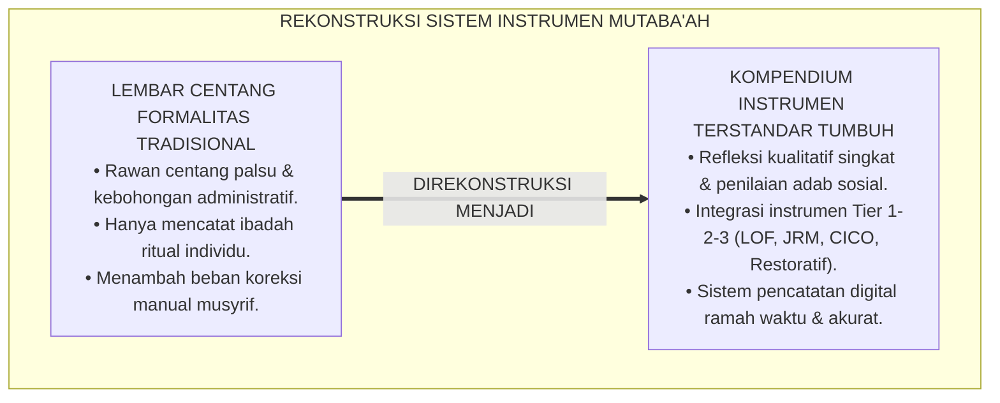
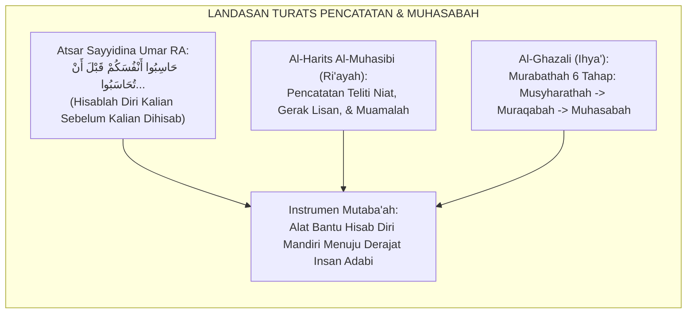
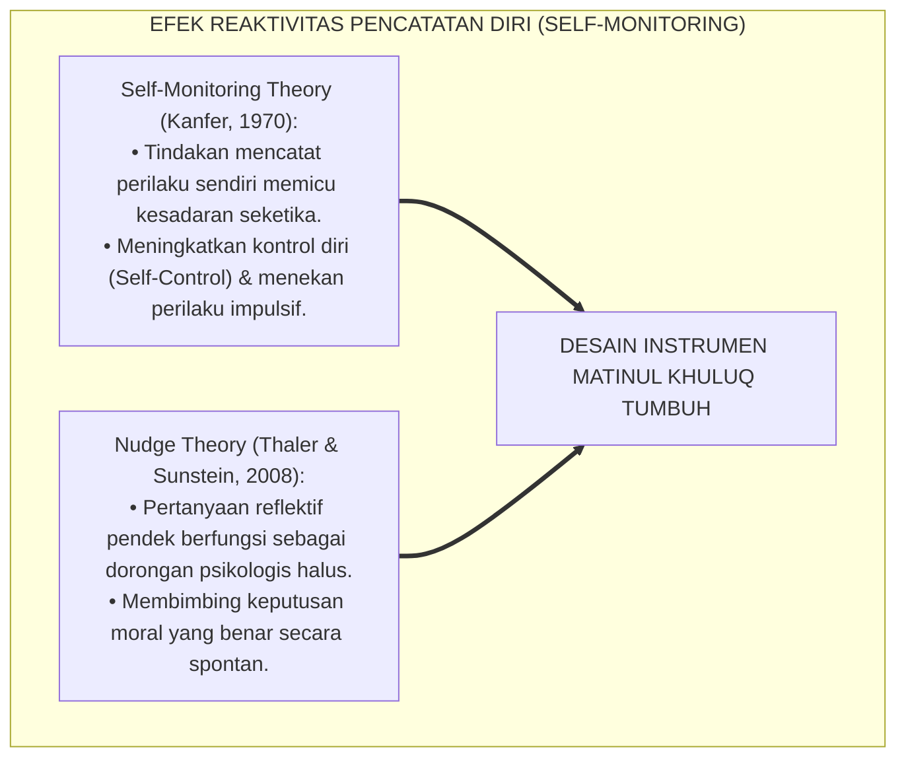
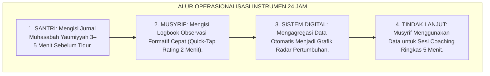
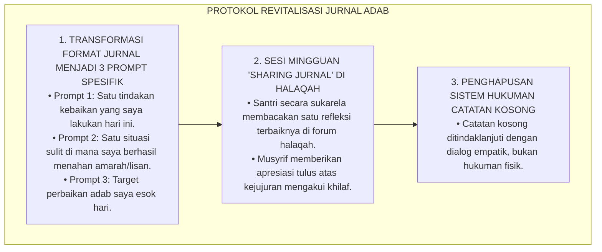
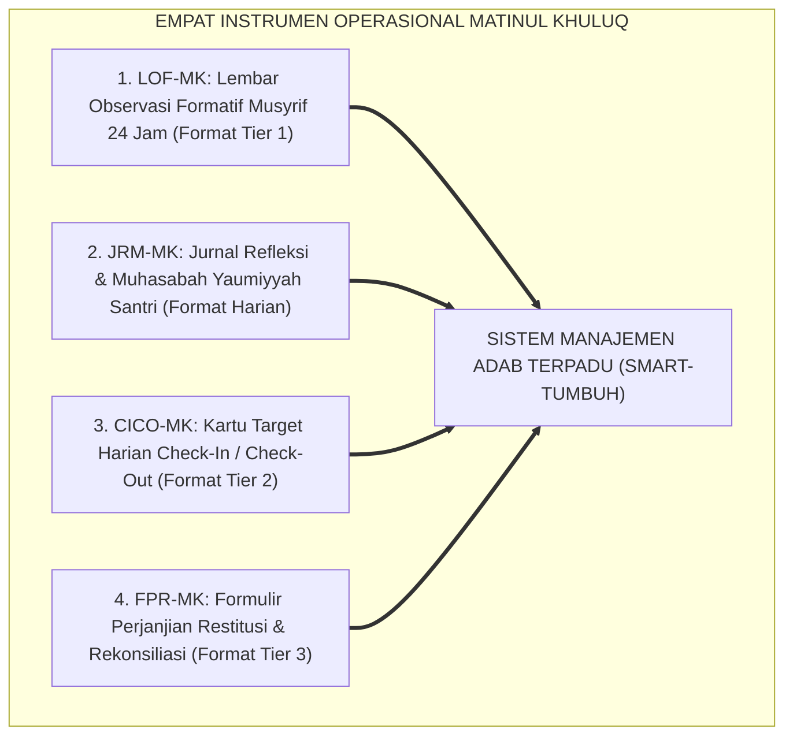

# P3-06-13: INSTRUMEN DAN LEMBAR MUTABA'AH MATINUL KHULUQ
## *Monograf Riset Akademik: Standardisasi Lembar Observasi Formatif, Jurnal Refleksi Harian Santri (Muhasabah Yaumiyyah), Kartu Target Intervensi CICO, Formulir Kesepakatan Restoratif (Ishlah al-Bain), Serta Integrasi Portofolio Adab Digital di Pesantren 24 Jam*

**Nomor Identifikasi**: `P3-06-13/MONOGRAF-RISET-INSTRUMEN-MUTABAAH-MATINUL-KHULUQ/2026`  
**Domain**: `03 Capacity Framework` > `06 Matinul Khuluq` (Sub-Modul 13: *Instruments & Mutaba'ah Sheets*)  
**Klasifikasi Naskah**: *Academic Research Monograph* (Monograf Penelitian Desain Instrumen Evaluasi, Dokumentasi Portofolio Adab, & Standarisasi Dokumen Lapangan)  
**Rumpun Disiplin Pengkaji**: Desain Instrumen Evaluasi Pendidikan, Dokumentasi Praktik Pengasuhan Asrama, Sistem Pencatatan Mutaba'ah Digital, Manajemen Disiplin Restoratif  

---

> ### 💡 INTISARI EKSEKUTIF (EXECUTIVE SUMMARY)
>
> * **Kelemahan Buku Mutaba'ah Manual Tradisional:**  
>   Buku mutaba'ah di pesantren sering kali hanya berisi daftar centang formalitas (*Checklist of Compliance*) yang rentan dipalsukan santri (*Faked Reporting*), hanya berfokus pada kuantitas ibadah mahdhah tanpa memotret kualitas akhlak muamalah, serta tidak memiliki tindak lanjut pembinaan yang sistemik manakala ditemukan tanda-tanda kemunduran karakter.
> * **Standardisasi Kompendium Instrumen Matinul Khuluq TUMBUH:**  
>   Ekosistem TUMBUH merumuskan **Empat Dokumen Instrumen Operasional Terpadu**: (1) *Lembar Observasi Formatif Musyrif 24 Jam (LOF-MK)* berbasis rubrik kriteria perilaku; (2) *Jurnal Refleksi & Muhasabah Yaumiyyah Santri (JRM-MK)* untuk melatih metakognisi spiritual; (3) *Kartu Target Harian Check-In/Check-Out (CICO-MK)* untuk intervensi Tier 2; dan (4) *Formulir Perjanjian Restitusi & Rekonsiliasi Restoratif (FPR-MK)* untuk penyelesaian sengketa Tier 3.
> * **Integrasi Portofolio Digital & Triad Akuntabilitas:**  
>   Seluruh instrumen dirancang dapat dioperasikan secara fisik (*Paper-Based*) maupun digital melalui aplikasi logbook pengasuhan, menghasilkan rekam jejak pertumbuhan adab longitudinal yang transparan bagi santri, musyrif, dan wali santri.

---

## 📑 DAFTAR ISI MONOGRAF

- [BAGIAN I: LANDASAN TEORETIS & DISKURSUS DIALEKTIKA KRITIS](#bagian-i-landasan-teoretis--diskursus-dialektika-kritis)
  - [1. Latar Belakang Masalah: Ilusi Lembar Centang Formalitas vs Otentisitas Refleksi Jiwa](#1-latar-belakang-masalah-ilusi-lembar-centang-formalitas-vs-otentisitas-refleksi-jiwa)
  - [2. Eksegesis Turats: Konsep Kitabatul A'mal & Muhasabatun Nafs Menurut Ulama Salaf](#2-eksegesis-turats-konsep-kitabatul-amal--muhasabatun-nafs-menurut-ulama-salaf)
  - [3. Konvergensi Sains Asesmen: Teori Desain Formulir Asesmen Otentik & Psikologi Pencatatan Diri](#3-konvergensi-sains-asesmen-teori-desain-formulir-asesmen-otentik--psikologi-pencatatan-diri)
  - [4. Analisis Rekayasa Alur Dokumentasi 24 Jam: Menjamin Keringanan Beban Administratif Musyrif](#4-analisis-rekayasa-alur-dokumentasi-24-jam-menjamin-keringanan-beban-administratif-musyrif)
  - [5. Kasuistika Lapangan Klinis & Protokol Mengatasi Pemalsuan Catatan Mutaba'ah Harian](#5-kasuistika-lapangan-klinis--protokol-mengatasi-pemalsuan-catatan-mutabaah-harian)
- [BAGIAN II: FORMULASI KONSEPTUAL & PEMBAHASAN MENDALAM](#bagian-ii-formulasi-konseptual--pembahasan-mendalam)
  - [1. Kompendium Master Empat Instrumen Lapangan Matinul Khuluq](#1-kompendium-master-empat-instrumen-lapangan-matinul-khuluq)
  - [2. Format Lengkap Lembar Observasi Formatif Musyrif (LOF-MK)](#2-format-lengkap-lembar-observasi-formatif-musyrif-lof-mk)
  - [3. Format Lengkap Jurnal Muhasabah Yaumiyyah Santri (JRM-MK)](#3-format-lengkap-jurnal-muhasabah-yaumiyyah-santri-jrm-mk)
  - [4. Format Kartu Target CICO & Formulir Kesepakatan Restoratif (FPR-MK)](#4-format-kartu-target-cico--formulir-kesepakatan-restoratif-fpr-mk)
- [BAGIAN III: KESIMPULAN & APARATUS AKADEMIS](#bagian-iii-kesimpulan--aparatus-akademis)
  - [1. Tabel Sintesis Kompendium Instrumen Matinul Khuluq](#1-tabel-sintesis-kompendium-instrumen-matinul-khuluq)
  - [2. Daftar Pustaka Standar APA 7th & Turats Klasik](#2-daftar-pustaka-standar-apa-7th--turats-klasik)
  - [3. Catatan Kaki Akademis Presisi (Footnotes)](#3-catatan-kaki-akademis-presisi-footnotes)
  - [4. Glosarium Istilah Ilmiah & Instrumen Mutaba'ah](#4-glosarium-istilah-ilmiah--instrumen-mutabaah)

---

# BAGIAN I: LANDASAN TEORETIS & DISKURSUS DIALEKTIKA KRITIS

---

### 1. Latar Belakang Masalah: Ilusi Lembar Centang Formalitas vs Otentisitas Refleksi Jiwa

Praktik penggunaan lembar mutaba'ah di pesantren sering kali mengalami **tiga disfungsi kritis (*Critical Dysfunctions*)**:[^1]

1. **Sindrom Centang Palsu (*Faked Checklist Syndrome*)**: Santri yang terbebani oleh target hafalan dan jadwal padat kerap mencentang seluruh kolom mutaba'ah secara tergesa-gesa 5 menit sebelum dikumpulkan kepada musyrif, tanpa melakukan evaluasi jujur terhadap dirinya sendiri.
2. **Ketiadaan Fokus pada Adab Sosial**: Lembar mutaba'ah konvensional 90% hanya memuat ibadah ritual individu (shalat rawatib, tilawah juz, puasa sunnah), sementara interaksi akhlak sosial (apakah hari ini berkata kasar, mengejek teman, atau melakukan ghashab) sama sekali tidak memiliki ruang pencatatan.
3. **Beban Administratif Musyrif yang Berlebihan (*Administrative Overload*)**: Musyrif dibebani tumpukan buku catatan tebal yang melelahkan untuk diperiksa secara manual satu per satu, sehingga mengurangi waktu berkualitas musyrif untuk berinteraksi hangat dengan santri binaannya.[^2]

Model riset **TUMBUH** merancang instrumen yang **ringkas, bermakna, fokus pada transformasi akhlak sosial, dan mudah dioperasikan secara digital maupun fisik**.



---

### 2. Eksegesis Turats: Konsep Kitabatul A'mal & Muhasabatun Nafs Menurut Ulama Salaf

Tradisi pencatatan amal dan refleksi batin berakar kokoh pada perintah wahyu dan atsar para sahabat Nabi SAW.



#### 📖 Atsar Monumental Sayyidina Umar bin Khattab RA
Sayyidina **Umar bin Khattab RA** berwasiat mengenai kewajiban hisab diri harian:

$$\text{حَاسِبُوا أَنْفُسَكُمْ قَبْلَ أَنْ تُحَاسَبُوا، وَزِنُوا أَنْفُسَكُمْ قَبْلَ أَنْ تُوزَنُوا؛ فَإِنَّهُ أَهْوَنُ عَلَيْكُمْ فِي الْحِسَابِ غَدًا أَنْ تُحَاسِبُوا أَنْفُسَكُمُ الْيَوْمَ}$$

*"Hisablah (evaluasilah) diri kalian sendiri sebelum kalian dihisab di akhirat kelak, dan timbanglah amal kalian sebelum amal kalian ditimbang; karena sesungguhnya akan lebih ringan hisab kalian di hari esok apabila kalian telah mengevaluasi diri kalian pada hari ini!"*[^3]

Wasiat ini menjadi landasan bahwa instrumen *Jurnal Muhasabah* dirancang bukan sebagai alat interogasi musyrif, melainkan sebagai sarana santri melatih kejujuran introspeksi di hadapan Allah SWT.

---

### 3. Konvergensi Sains Asesmen: Teori Desain Formulir Asesmen Otentik & Psikologi Pencatatan Diri

Sains psikometri modern menetapkan bahwa instrumen pencatatan diri (*Self-Monitoring Tools*) memiliki efek terapeutik langsung dalam mengubah kebiasaan:



1. **Teori Reaktivitas Pencatatan Diri (*Self-Monitoring Reactivity*)**:  
   Frederick Kanfer (1970) membuktikan bahwa tindakan sederhana mengamati dan mencatat perilaku sendiri secara jujur setiap malam secara otomatis menurunkan frekuensi perilaku buruk (seperti memaki atau malas) hingga 40%, bahkan sebelum adanya intervensi dari luar.[^4]
2. **Prinsip Nudge dalam Desain Formulir**:  
   Pertanyaan pada lembar refleksi tidak bernada interogatif yang menakutkan, melainkan menggunakan kalimat pemantik yang menginspirasi kebaikan (*Choice Architecture*).[^5]

---

### 4. Analisis Rekayasa Alur Dokumentasi 24 Jam: Menjamin Keringanan Beban Administratif Musyrif

Sistem instrumen TUMBUH dirancang dengan prinsip **Efisiensi Waktu Maksimal (*Maximum Time-Efficiency*)**:



Musyrif tidak lagi menghabiskan waktu berjam-jam mengoreksi buku catatan, melainkan langsung melihat santri mana yang membutuhkan perhatian khusus hari itu (*Targeted Support*).[^6]

---

### 5. Kasuistika Lapangan Klinis & Protokol Mengatasi Pemalsuan Catatan Mutaba'ah Harian

#### Studi Kasus Lapangan: Sindrom "Copy-Paste" Catatan Refleksi Kamar Tidur
* **Konteks Masalah**: Di sebuah kamar jenjang J2, musyrif menemukan bahwa seluruh santri sekamar menuliskan kalimat refleksi jurnal yang sama persis setiap malam ("Hari ini saya baik, tidak berbuat salah"), yang disalin dari ketua kamar agar cepat selesai dan bisa langsung tidur.
* **Analisis Diagnostik**: Format refleksi jurnal terlalu terbuka tanpa panduan pertanyaan spesifik, sehingga santri menganggapnya sebagai beban hafalan teks administratif belaka.
* **Protokol Revitalisasi Instrumen TUMBUH**:



Pendekatan ini mengembalikan fungsi jurnal sebagai wahana komunikasi jujur antara santri dan dirinya sendiri.[^7]

---

# BAGIAN II: FORMULASI KONSEPTUAL & PEMBAHASAN MENDALAM

---

### 1. Kompendium Master Empat Instrumen Lapangan Matinul Khuluq

Struktur kompendium instrumen distandarisasi ke dalam 4 format operasional:



---

### 2. Format Lengkap Lembar Observasi Formatif Musyrif (LOF-MK)

```markdown
================================================================================
KODE DOKUMEN: TUMBUH-INS-LOF-MK/2026
LEMBAR OBSERVASI FORMATIF MUSYRIF 24 JAM (LOF-MK)
Karakter: 06 Matinul Khuluq (Akhlak Mulia & Kokoh)
================================================================================
Nama Musyrif : ______________________    Kamar / Asrama : ______________________
Pekan Ke-    : _____ (Bulan: _______)    Jenjang Santri : [ ] J1  [ ] J2  [ ] J3  [ ] J4
--------------------------------------------------------------------------------
PETUNJUK PENGISIAN:
Berikan skor 1 s/d 4 pada setiap pilar berdasarkan observasi faktual perilaku:
1 = Perintisan (Emerging)   2 = Pembiasaan (Developing)
3 = Pemantapan (Proficient) 4 = Keteladanan (Qudwah Hasanah)
--------------------------------------------------------------------------------
No | Nama Santri | Shidq (1-4) | Tawadhu' (1-4) | Syaja'ah (1-4) | Amanah (1-4) | Catatan Perilaku Khusus (Anecdotal Notes)
---|-------------|-------------|----------------|----------------|--------------|-----------------------------------------
1. |             |             |                |                |              |
2. |             |             |                |                |              |
3. |             |             |                |                |              |
--------------------------------------------------------------------------------
Rencana Tindak Lanjut Pekanan:
[ ] Pembinaan Universal Tier 1    [ ] Rekomendasi CICO Tier 2    [ ] Mediasi BK Tier 3
Tanda Tangan Musyrif: ___________________   Tanggal: ___________________
================================================================================
```

---

### 3. Format Lengkap Jurnal Muhasabah Yaumiyyah Santri (JRM-MK)

```markdown
================================================================================
KODE DOKUMEN: TUMBUH-INS-JRM-MK/2026
JURNAL MUHASABAH YAUMIYYAH SANTRI (JRM-MK)
"Meniti Tangga Adab Menuju Insan Kamil yang Dicintai Allah"
================================================================================
Nama Santri : ______________________    Kelas / Jenjang : _____ / [J1/J2/J3/J4]
Kamar       : ______________________    Hari / Tanggal  : ______________________
--------------------------------------------------------------------------------
1. REFLEKSI TIGA PILAR HARIAN (Berikan tanda centang [V] secara jujur):
   a. Ash-Shidq   : [ ] Hari ini saya berkata jujur & tidak menyontek/berbohong.
   b. At-Tawadhu' : [ ] Hari ini lisan saya terjaga dari kata kasar/ejekan kawan.
   c. Al-Amanah   : [ ] Hari ini saya menjaga barang pribadi & tidak ghashab.

2. CATATAN REFLEKSI NALURIAH (Tuliskan 1-2 kalimat):
   * Satu kebaikan adab yang saya syukuri hari ini:
     ___________________________________________________________________________
   * Satu situasi sulit di mana saya harus menahan amarah / lisan:
     ___________________________________________________________________________
   * Target adab yang ingin saya tingkatkan esok hari:
     ___________________________________________________________________________

"Ya Allah, perbaikilah akhlakku sebagaimana Engkau telah memperbagus rupa fisikku."
Paraf Santri: ___________________         Paraf Musyrif: ___________________
================================================================================
```

---

### 4. Format Kartu Target CICO & Formulir Kesepakatan Restoratif (FPR-MK)

#### 1. Kartu Target Harian CICO (CICO-MK - Tier 2):
```markdown
================================================================================
KARTU TARGET HARIAN CHECK-IN / CHECK-OUT (CICO-MK)
Nama Santri: _________________  Musyrif Pendamping: _________________ Tanggal: _____
--------------------------------------------------------------------------------
Waktu Sesi       | Target 1: Lisan Santun | Target 2: Anti-Ghashab | Target 3: Disiplin
-----------------|------------------------|------------------------|--------------------
Sesi Pagi (Subuh)| [ ] 0  [ ] 1  [ ] 2    | [ ] 0  [ ] 1  [ ] 2    | [ ] 0  [ ] 1  [ ] 2
Sesi Madrasah    | [ ] 0  [ ] 1  [ ] 2    | [ ] 0  [ ] 1  [ ] 2    | [ ] 0  [ ] 1  [ ] 2
Sesi Sore/Maghrib| [ ] 0  [ ] 1  [ ] 2    | [ ] 0  [ ] 1  [ ] 2    | [ ] 0  [ ] 1  [ ] 2
Sesi Malam (CICO)| [ ] 0  [ ] 1  [ ] 2    | [ ] 0  [ ] 1  [ ] 2    | [ ] 0  [ ] 1  [ ] 2
--------------------------------------------------------------------------------
Total Poin: _____ / 24 Poin (Target Sukses Harian: >= 80% / 19 Poin)
Catatan Motivasi Musyrif: ______________________________________________________
================================================================================
```

#### 2. Formulir Perjanjian Restitusi & Rekonsiliasi (FPR-MK - Tier 3):
```markdown
================================================================================
KODE DOKUMEN: TUMBUH-INS-FPR-MK/2026
FORMULIR PERJANJIAN RESTITUSI & REKONSILIASI RESTORATIF (ISHLAH AL-BAIN)
================================================================================
Pihak Terkait:
Pelaku Adab  : ______________________ (Jenjang: _____)
Pihak Korban : ______________________ (Jenjang: _____)
Fasilitator  : ______________________ (Musyrif / Konselor BK)
--------------------------------------------------------------------------------
1. PENGAKUAN FAKTA & DAMPAK KESALAHAN:
   Pelaku mengakui tindakan adab yang mencederai ukhuwah berupa:
   _____________________________________________________________________________
   Dampak yang dialami oleh pihak korban dan komunitas:
   _____________________________________________________________________________

2. KESEPAKATAN RESTITUSI BERMAKNA (REPARATION PLAN):
   Sebagai bentuk tanggung jawab aktif dan pembersihan jiwa, pelaku berkomitmen:
   a. Meminta maaf secara tulus dan langsung di hadapan fasilitator.
   b. Melakukan tindakan perbaikan nyata berupa:
      __________________________________________________________________________
      Batas Waktu Pelaksanaan: ____________________

3. KOMITMEN BERSAMA & MONITORING:
   Kedua belah pihak sepakat untuk saling memaafkan dan membuka lembaran baru ukhuwah.
   Musyrif akan melakukan pemantauan selama 14 hari ke depan.

Tanda Tangan Pihak 1 (Pelaku)   : _____________________ Tanggal: _____________
Tanda Tangan Pihak 2 (Korban)   : _____________________ Tanggal: _____________
Tanda Tangan Fasilitator Musyrif: _____________________ Tanggal: _____________
================================================================================
```

---

# BAGIAN III: KESIMPULAN & APARATUS AKADEMIS

---

### 1. Tabel Sintesis Kompendium Instrumen Matinul Khuluq

| Nama Instrumen | Kode Dokumen | Sasaran Pengguna | Fungsi Utama | Format Operasional |
| :--- | :--- | :--- | :--- | :--- |
| **Lembar Observasi Formatif** | `LOF-MK` | Musyrif Asrama | Observasi harian 4 pilar adab seluruh santri kamar. | Fisik / Aplikasi Digital. |
| **Jurnal Muhasabah Yaumiyyah** | `JRM-MK` | Santri Pesantren | Refleksi diri batin & pencatatan target adab malam. | Buku Saku / Portal Santri. |
| **Kartu Target Harian CICO** | `CICO-MK` | Santri Tier 2 & Musyrif | Pemantauan terfokus 4 sesi harian santri berisiko. | Kartu Saku Fisik Harian. |
| **Formulir Kesepakatan Restoratif** | `FPR-MK` | Santri, Musyrif, BK, Wali | Dokumentasi resmi komitmen restitusi sengketa adab. | Dokumen Fisik Resmi Bermaterai. |

---

### 2. Daftar Pustaka Standar APA 7th & Turats Klasik

1. **Al-Ghazali, Hujjatul Islam Abu Hamid Muhammad bin Muhammad.** (2018). *Ihya' 'Ulumiddin: Kitab Al-Muhasabah wal Muraqabah*. Beirut: Dar Al-Kutub Al-'Ilmiyyah.
2. **Al-Muhasibi, Al-Harits bin Asad.** (1985). *Ar-Ri'ayah li Huquqillah*. Tahqiq: Dr. Abdul Qadir Ahmad 'Atha. Kairo: Dar Al-Kutub Al-Haditsah.
3. **Crone, D. A., Hawken, L. S., & Horner, R. H.** (2015). *Building Positive Behavior Support Systems in Schools: Functional Behavioral Assessment* (2nd ed.). New York: Guilford Press.
4. **Kanfer, F. H.** (1970). *Self-monitoring: Methodological limitations and clinical applications*. *Journal of Consulting and Clinical Psychology*, 35(2), 148-152.
5. **Nelsen, J., & Lott, L.** (2013). *Positive Discipline in the Classroom*. New York: Harmony Books.
6. **Sugai, G., & Horner, R. H.** (2020). *School-Wide Positive Behavioral Interventions and Supports: Implementation Practices*. *Journal of Positive Behavior Interventions*, 22(4), 203-211.
7. **Thaler, R. H., & Sunstein, C. R.** (2008). *Nudge: Improving Decisions About Health, Wealth, and Happiness*. New Haven: Yale University Press.
8. **Wiggins, G.** (1998). *Educative Assessment: Designing Assessments to Inform and Improve Student Performance*. San Francisco: Jossey-Bass.
9. **Zehr, H.** (2015). *The Little Book of Restorative Justice*. New York: Good Books.

---

### 3. Catatan Kaki Akademis Presisi (Footnotes)

[^1]: Kritik metodologis terhadap kelemahan lembar centang mutaba'ah formalitas, Wiggins (1998, hlm. 56).  
[^2]: Pembahasan kelelahan administratif pengasuh asrama dan dampaknya terhadap kualitas relasi santri, Sugai & Horner (2020, hlm. 208).  
[^3]: Diriwayatkan oleh Imam Ahmad dalam *Az-Zuhd* (hlm. 122) dan Imam Ibnu Abi Syaibah dalam *Al-Mushannaf* (No. 34459) dari Sayyidina Umar bin Khattab RA.  
[^4]: Teori efek reaktivitas pencatatan diri (*Self-Monitoring Reactivity*), Kanfer (1970, hlm. 150).  
[^5]: Konsep arsitektur pilihan (*Choice Architecture*) dalam desain formulir, Thaler & Sunstein (2008, hlm. 82).  
[^6]: Standar efisiensi sistem dokumentasi digital pengasuhan asrama PBIS, Crone, Hawken, & Horner (2015, hlm. 74).  
[^7]: Protokol bimbingan refleksi jurnal berbasis disiplin positif, Nelsen & Lott (2013, hlm. 235).  

---

### 4. Glosarium Istilah Ilmiah & Instrumen Mutaba'ah

1. **Lembar Observasi Formatif (LOF)**: Instrumen pengamatan berkala musyrif untuk mencatat performa adab santri secara kualitatif dan kuantitatif berbasis kriteria rubrik.
2. **Jurnal Muhasabah Yaumiyyah (JRM)**: Lembar refleksi harian mandiri yang diisi santri sebelum tidur untuk mengevaluasi niat, lisan, dan tindakan moralnya.
3. **Kartu Target CICO**: Lembar catatan portabel yang dibawa santri peserta program Tier 2 untuk dinilai skor perilakunya oleh guru dan musyrif pada 4 segmen waktu harian.
4. **Formulir Perjanjian Restitusi (FPR)**: Dokumen hukum syar'i dan administratif yang mencatat kesepakatan damai, pengakuan kesalahan, dan rencana perbaikan tindakan bagi santri pelanggar.
5. **Anecdotal Notes (Catatan Anekdot)**: Catatan deskriptif singkat mengenai peristiwa perilaku spesifik santri yang signifikan untuk keperluan analisis perkembangan karakter.
6. **Self-Monitoring Reactivity**: Perubahan positif perilaku yang terjadi secara spontan semata-mata karena individu secara sadar mengamati dan mencatat perilakunya sendiri.
7. **Nudge (Dorongan Halus)**: Elemen desain dalam instrumen atau lingkungan yang mengubah perilaku seseorang ke arah yang diharapkan tanpa paksaan atau ancaman sanksi.
8. **Ishlah al-Bain (إِصْلَاحُ ذَاتِ الْبَيْنِ)**: Proses pemulihan hubungan persaudaraan dan perdamaian tulus antara pihak-pihak yang berselisih di lingkungan asrama.
9. **Musyarathah (الْمُشَارَطَةُ)**: Tahap awal muhasabah di mana individu menetapkan syarat dan komitmen target amal adab yang harus dipenuhi sepanjang hari.
10. **Murabathah (الْمُرَابَطَةُ)**: Proses pembiasaan diri yang berkesinambungan melalui pengawalan jiwa secara konsisten dalam menjalankan komitmen syariat.
