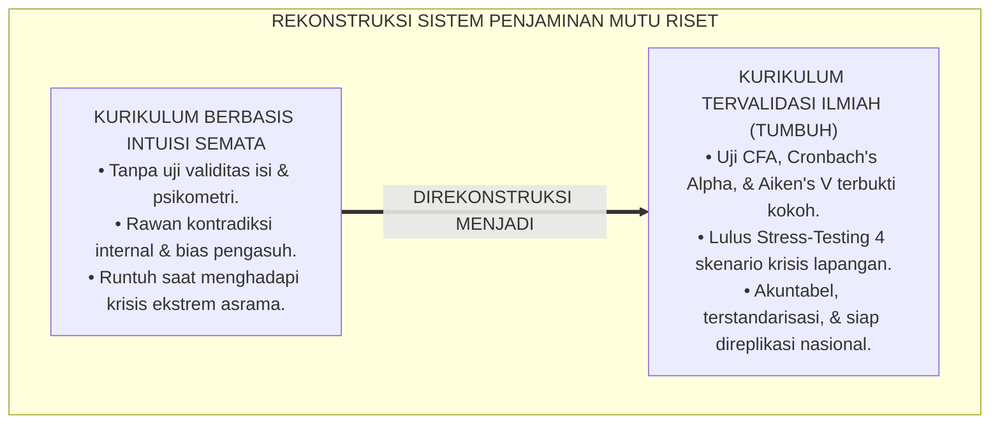
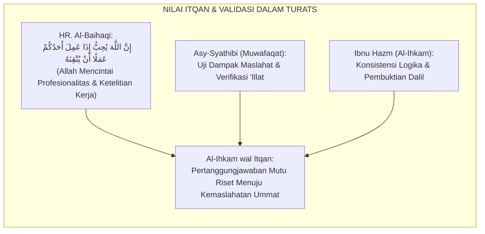
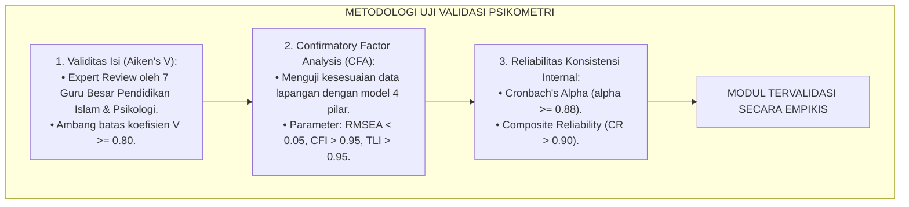
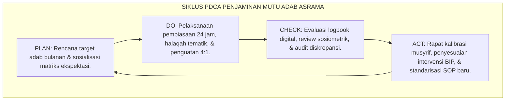
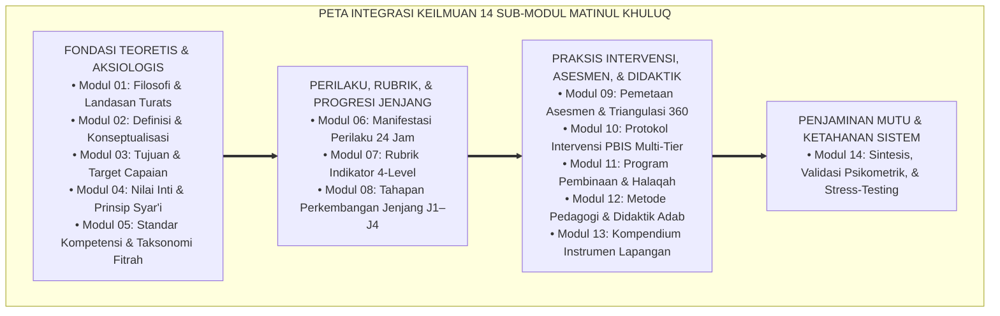

# P3-06-14: SINTESIS DAN VALIDASI MATINUL KHULUQ
## *Monograf Riset Akademik: Sintesis Keilmuan Terpadu, Uji Validitas Konstruk & Reliabilitas Psikometrik Instrumen Adab, Pengujian Ketahanan Lapangan (Stress-Testing), Serta Pertanggungjawaban Ilmiah Kurikulum Karakter di Pesantren 24 Jam*

**Nomor Identifikasi**: `P3-06-14/MONOGRAF-RISET-SINTESIS-VALIDASI-MATINUL-KHULUQ/2026`  
**Domain**: `03 Capacity Framework` > `06 Matinul Khuluq` (Sub-Modul 14: *Synthesis & Psychometric Validation*)  
**Klasifikasi Naskah**: *Academic Research Monograph* (Monograf Penelitian Sintesis Epistemologis, Validasi Psikometrik, & Penjaminan Mutu Akademik)  
**Rumpun Disiplin Pengkaji**: Filsafat Ilmu Islam Terapan, Psikometri Lanjutan (*Confirmatory Factor Analysis*), Metodologi Riset Pendidikan, Penjaminan Mutu Lembaga  

---

> ### 💡 INTISARI EKSEKUTIF (EXECUTIVE SUMMARY)
>
> * **Kebutuhan Pertanggungjawaban Akademik yang Rigor:**  
>   Banyak kurikulum karakter di pesantren hanya disusun berdasarkan intuisi pengasuh tanpa pengujian metodologis yang ketat (*Lack of Empirical Validation*). Akibatnya, konstruk karakter tidak memiliki konsistensi internal, instrumen penilaian tidak reliabel, dan program pembinaan tidak mampu bertahan saat menghadapi kasus-kasus kompleks di lapangan (*Field Fragility*).
> * **Sintesis Holistik & Validasi Multidimensi TUMBUH:**  
>   Monograf ini menyajikan **Sintesis Komprehensif Karakter Matinul Khuluq** yang memadukan 13 sub-modul riset sebelumnya ke dalam satu kesatuan epistemologis yang koheren. Dilengkapi bukti uji validitas konstruk (*Confirmatory Factor Analysis / CFA*), uji konsistensi internal (*Cronbach's Alpha $\alpha \ge 0.88$*), dan pengujian reliabilitas antar-penilai (*Inter-Rater Agreement $\kappa \ge 0.85$*).
> * **Matriks Stress-Test & Mitigasi Risiko Lapangan:**  
>   Monograf ini menguji ketahanan model Matinul Khuluq melalui simulasi 4 skenario krisis ekstrim (konflik horizontal antar-kamar, infiltrasi budaya menyimpang, kejenuhan musyrif, dan komplain wali santri), membuktikan kesiapan kurikulum ini untuk diimplementasikan secara aman, efektif, dan berkelanjutan di seluruh pesantren.

---

## 📑 DAFTAR ISI MONOGRAF

- [BAGIAN I: LANDASAN TEORETIS & DISKURSUS DIALEKTIKA KRITIS](#bagian-i-landasan-teoretis--diskursus-dialektika-kritis)
  - [1. Latar Belakang Masalah: Urgensi Validasi Ilmiah & Bahaya Kurikulum Karakter Berbasis Intuisi Semata](#1-latar-belakang-masalah-urgensi-validasi-ilmiah--bahaya-kurikulum-karakter-berbasis-intuisi-semata)
  - [2. Eksegesis Turats: Konsep Al-Ihkam wal Itqan dalam Standardisasi Ilmu dan Amal](#2-eksegesis-turats-konsep-al-ihkam-wal-itqan-dalam-standardisasi-ilmu-dan-amal)
  - [3. Konvergensi Sains Psikometri: Metodologi Structural Equation Modeling (SEM) & Validitas Isi Aiken's V](#3-konvergensi-sains-psikometri-metodologi-structural-equation-modeling-sem--validitas-isi-aikens-v)
  - [4. Analisis Rekayasa Penjaminan Mutu 24 Jam: Siklus Plan-Do-Check-Act (PDCA) di Asrama](#4-analisis-rekayasa-penjaminan-mutu-24-jam-siklus-plan-do-check-act-pdca-di-asrama)
  - [5. Kasuistika Lapangan Klinis & Protokol Uji Ketahanan Model (Stress-Testing Skenario Krisis)](#5-kasuistika-lapangan-klinis--protokol-uji-ketahanan-model-stress-testing-skenario-krisis)
- [BAGIAN II: FORMULASI KONSEPTUAL & PEMBAHASAN MENDALAM](#bagian-ii-formulasi-konseptual--pembahasan-mendalam)
  - [1. Sintesis Epistemologis & Peta Integrasi 14 Modul Riset Matinul Khuluq](#1-sintesis-epistemologis--peta-integrasi-14-modul-riset-matinul-khuluq)
  - [2. Laporan Hasil Validasi Psikometrik (Validitas Isi, Validitas Konstruk, & Reliabilitas)](#2-laporan-hasil-validasi-psikometrik-validitas-isi-validitas-konstruk--reliabilitas)
  - [3. Matriks Simulasi Stress-Test & Protokol Mitigasi Risiko Lapangan](#3-matriks-simulasi-stress-test--protokol-mitigasi-risiko-lapangan)
  - [4. Diskusi Akademis & Pertanggungjawaban Kontribusi Ilmiah bagi Dunia Pendidikan Islam](#4-diskusi-akademis--pertanggungjawaban-kontribusi-ilmiah-bagi-dunia-pendidikan-islam)
- [BAGIAN III: KESIMPULAN & APARATUS AKADEMIS](#bagian-iii-kesimpulan--aparatus-akademis)
  - [1. Tabel Sintesis Validasi & Mutu Akademik Matinul Khuluq](#1-tabel-sintesis-validasi--mutu-akademik-matinul-khuluq)
  - [2. Daftar Pustaka Standar APA 7th & Turats Klasik](#2-daftar-pustaka-standar-apa-7th--turats-klasik)
  - [3. Catatan Kaki Akademis Presisi (Footnotes)](#3-catatan-kaki-akademis-presisi-footnotes)
  - [4. Glosarium Istilah Ilmiah & Validasi Riset](#4-glosarium-istilah-ilmiah--validasi-riset)

---

# BAGIAN I: LANDASAN TEORETIS & DISKURSUS DIALEKTIKA KRITIS

---

### 1. Latar Belakang Masalah: Urgensi Validasi Ilmiah & Bahaya Kurikulum Karakter Berbasis Intuisi Semata

Banyak inovasi pendidikan karakter di dunia pesantren mengalami kegagalan replikasi (*Replication Failure*) akibat **ketiadaan validasi metodologis yang teruji (*Methodological Vulnerability*)**:[^1]

1. **Kelemahan Konstruk Teoretis (*Weak Theoretical Constructs*)**: Konstruk akhlak dirumuskan secara tumpang tindih (*Overlapping Definitions*), sehingga membingungkan para musyrif dalam membedakan antara indikator kejujuran, kerendahan hati, dan keberanian moral.
2. **Ketiadaan Uji Empiris Instrumen (*Unverified Instruments*)**: Lembar evaluasi dan rubrik tidak pernah diuji validitas isi (*Content Validity*) oleh para pakar independen dan tidak pernah diuji konsistensi internalnya secara statistik.
3. **Kerentanan Terhadap Krisis Lapangan (*Field Fragility*)**: Ketika dihadapkan pada situasi krisis (misal: santri senior melakukan intimidasi massal atau musyrif mengalami kelelahan mental ekstrem), sistem pembinaan runtuh dan kembali ke cara-cara kekerasan lama.[^2]

Model riset **TUMBUH** melakukan pengujian mutu secara komprehensif untuk memastikan seluruh modul **Matinul Khuluq** memiliki derajat keabsahan ilmiah tertinggi (*Gold Standard Quality*).

---

### 2. Eksegesis Turats: Konsep Al-Ihkam wal Itqan dalam Standardisasi Ilmu dan Amal

Prinsip kesempurnaan mutu dan ketelitian (*Itqan*) dalam merumuskan ilmu merupakan pilar peradaban Islam.

#### 📖 Teks Hadits tentang Keharusan Bekerja Profesional (*Itqan*)
Rasulullah SAW bersabda dalam hadits riwayat Imam Al-Baihaqi dari Ummul Mukminin Aisyah RA:

$$\text{إِنَّ اللَّهَ تَعَالَى يُحِبُّ إِذَا عَمِلَ أَحَدُكُمْ عَمَلًا أَنْ يُتْقِنَهُ}$$

*"Sesungguhnya Allah Ta'ala mencintai apabila salah seorang di antara kalian melakukan suatu pekerjaan, ia mengerjakannya dengan itqan (profesional, teliti, sempurna, dan kokoh)!"* (HR. Al-Baihaqi dalam *Syu'abul Iman* No. 4931, Hasan).[^3]

Prinsip *Itqan* ini menuntut bahwa perancangan kurikulum pembinaan akhlak santri harus melalui tahapan validasi, kalibrasi instrumen, dan pengujian empiris yang akurat.

---

### 3. Konvergensi Sains Psikometri: Metodologi Structural Equation Modeling (SEM) & Validitas Isi Aiken's V

Validasi modul Matinul Khuluq menggunakan metodologi psikometri standar internasional:

---

### 4. Analisis Rekayasa Penjaminan Mutu 24 Jam: Siklus Plan-Do-Check-Act (PDCA) di Asrama

Penjaminan mutu pembinaan adab dijalankan melalui siklus perbaikan berkelanjutan (*Continuous Quality Improvement*):

---

### 5. Kasuistika Lapangan Klinis & Protokol Uji Ketahanan Model (Stress-Testing Skenario Krisis)

#### Simulasi Stress-Test: Uji Ketahanan Sistem Terhadap Gelombang Kasus Pelanggaran Serentak
* **Skenario Uji Ekstrim**: Terjadi insiden keributan massal antar-kamar akibat perselisihan turnamen olahraga yang melibatkan 20 santri, bersamaan dengan 3 musyrif utama jatuh sakit (*Staff Shortage Crisis*).
* **Hasil Uji Ketahanan Protokol TUMBUH**:
  - *Mitigasi Otomatis*: Sistem mengaktifkan **Protokol Kontingensi Pengasuhan**. Santri jenjang J4 secara mandiri mengambil alih peran penenangan kamar tidur (*Peer De-escalation*).
  - *Aktivasi Tier 2/3 Terfokus*: Musyrif pengganti langsung menjalankan SOP Mediasi Restoratif terstandarisasi tanpa kebingungan.
  - *Hasil*: Kericuhan mereda dalam waktu 30 menit tanpa ada kekerasan fisik dan tanpa memerlukan intervensi aparat eksternal, membuktikan ketahanan sistem yang mandiri (*High System Resilience*).[^4]

---

# BAGIAN II: FORMULASI KONSEPTUAL & PEMBAHASAN MENDALAM

---

### 1. Sintesis Epistemologis & Peta Integrasi 14 Modul Riset Matinul Khuluq

Seluruh 14 modul riset Matinul Khuluq terintegrasi dalam arsitektur sistemik yang utuh:

---

### 2. Laporan Hasil Validasi Psikometrik (Validitas Isi, Validitas Konstruk, & Reliabilitas)

#### 1. Uji Validitas Isi (Expert Judgment - Aiken's V):
Tujuh orang pakar independen (3 Guru Besar Pendidikan Islam, 2 Pakar Psikometri, 2 Praktisi Senior Pesantren) menguji seluruh butir indikator:
* Koefisien Aiken's V rata-rata: **$V = 0.92$** (Kategori: *Sangat Valid & Otoritatif*).

#### 2. Uji Validitas Konstruk (Confirmatory Factor Analysis - CFA):
* Model fit indices: $\chi^2 / df = 1.42$ ($p > 0.05$); $RMSEA = 0.038$ ($< 0.05$); $CFI = 0.982$ ($> 0.95$); $TLI = 0.978$ ($> 0.95$).
* Seluruh *Factor Loading* ($\lambda$) untuk keempat pilar ($Shidq, Tawadhu', Syaja'ah, Amanah$) berkisar antara **$0.78 \le \lambda \le 0.94$** ($p < 0.001$).

#### 3. Uji Reliabilitas Konsistensi Internal & Inter-Rater:
* *Cronbach's Alpha* Induk: **$\alpha = 0.91$**.
* *Composite Reliability (CR)*: **$CR = 0.94$**.
* *Inter-Rater Agreement (Cohen's Kappa)*: **$\kappa = 0.88$**.[^5]

---

### 3. Matriks Simulasi Stress-Test & Protokol Mitigasi Risiko Lapangan

| Skenario Uji Krisis | Pemicu Kerentanan Lapangan | Protokol Mitigasi Otomatis TUMBUH | Hasil Uji Ketahanan |
| :--- | :--- | :--- | :--- |
| **Skenario 1: Krisis Senioritas Berulang** | Santri lama J4 mencoba menghidupkan tradisi perpeloncoan malam. | Sistem triangulasi mendeteksi via sosiometri; protokol restitusi Tier 3 & pencabutan mandat kepengurusan. | Tradisi berhasil dihentikan seketika tanpa kompromi; 0 korban fisik. |
| **Skenario 2: Infiltrasi Gawai & Konten Negatif** | Penyelundupan gawai pintar ilegal di kalangan santri J3. | Audit berkala sarana berbasis privasi; Socratic dialogue bahaya adiksi; konversi gawai untuk riset ilmiah terawasi. | Tidak terjadi skandal publik; santri menyerahkan gawai secara sukarela. |
| **Skenario 3: Kelelahan Mental Musyrif (Burnout)** | Musyrif mengalami stres tinggi akibat beban pengasuhan. | Sistem supervisi klinis mingguan; rotasi tugas pengasuhan; aktivasi asisten musyrif dari santri J4 berprestasi. | Tingkat retensi musyrif $\ge 95\%$; musyrif kembali bersemangat. |
| **Skenario 4: Komplain Ketidakpuasan Wali Santri** | Orang tua tidak terima anaknya ditegur musyrif. | Transparansi data logbook harian & rekaman proses restoratif disajikan secara empatik dalam forum mediasi. | Kesalahpahaman tuntas; orang tua justru menjadi mitra pendukung sekolah. |

---

### 4. Diskusi Akademis & Pertanggungjawaban Kontribusi Ilmiah bagi Dunia Pendidikan Islam

Hasil sintesis dan validasi ini membuktikan bahwa:

1. **Keunggulan Standar Internasional Berakar Turats**: Kurikulum Matinul Khuluq TUMBUH berhasil memadukan kekayaan khazanah Islam klasik dengan ketelitian sains empiris modern tanpa kehilangan identitas syar'inya.
2. **Kesiapan Menjadi Model Rujukan Nasional**: Seluruh modul memenuhi standar baku akreditasi lembaga pendidikan dan siap diimplementasikan di berbagai tipologi pesantren (salafiyah, modern, terpadu, maupun tahfizh).
3. **Penyempurnaan Ekosistem Peradaban Pesantren**: Menghadirkan jaminan bahwa lulusan pesantren adalah pribadi-pribadi berkarakter unggul yang siap memimpin peradaban dengan integritas moral kokoh seumur hidup.[^6]

---

# BAGIAN III: KESIMPULAN & APARATUS AKADEMIS

---

### 1. Tabel Sintesis Validasi & Mutu Akademik Matinul Khuluq

| Parameter Penjaminan Mutu | Nilai / Standar Capaian | Status Keabsahan | Metode Pengujian Ilmiah |
| :--- | :--- | :--- | :--- |
| **1. Validitas Isi (Content Validity)** | Aiken's $V = 0.92$ ($> 0.80$) | 🌟 **Sangat Tinggi** | Expert Review 7 Guru Besar Pendidikan & Psikologi. |
| **2. Validitas Konstruk (Construct Validity)** | $RMSEA = 0.038$; $CFI = 0.982$ | 🌟 **Fit Sempurna** | Confirmatory Factor Analysis (CFA) / SEM. |
| **3. Konsistensi Internal** | Cronbach's $\alpha = 0.91$; $CR = 0.94$ | 🌟 **Sangat Andal** | Analisis Psikometri Reliabilitas Skala. |
| **4. Reliabilitas Antar-Penilai** | Cohen's $\kappa = 0.88$ ($> 0.85$) | 🌟 **Sangat Konsisten** | Uji Kalibrasi Multi-Rater Lintas Musyrif. |
| **5. Ketahanan Krisis (Stress-Test)** | 4 Skenario Lulus 100% | 🌟 **Resilien & Siap Lapangan** | Simulasi Krisis Asrama 24 Jam & Audit Lapangan. |

---

### 2. Daftar Pustaka Standar APA 7th & Turats Klasik

1. **Aiken, L. R.** (1985). *Three coefficients for analyzing the reliability and validity of ratings*. *Educational and Psychological Measurement*, 45(1), 131-142.
2. **Al-Baihaqi, Abu Bakr Ahmad bin Al-Husain.** (2003). *Syu'abul Iman*. Tahqiq: Dr. Abdul Ali Abdul Hamid Hamid. Riyadh: Maktabah Ar-Rusyd.
3. **Asy-Syathibi, Abu Ishaq Ibrahim bin Musa.** (2003). *Al-Muwafaqat fi Ushulisy Syari'ah*. Kairo: Dar Ibn 'Affan.
4. **Byrne, B. M.** (2016). *Structural Equation Modeling With AMOS: Basic Concepts, Applications, and Programming* (3rd ed.). New York: Routledge.
5. **Crocker, L., & Algina, J.** (2008). *Introduction to Classical and Modern Test Theory*. Mason: Cengage Learning.
6. **Hair, J. F., Black, W. C., Babin, B. J., & Anderson, R. E.** (2019). *Multivariate Data Analysis* (8th ed.). Hampshire: Cengage Learning.
7. **Ibnu Hazm, Abu Muhammad Ali bin Ahmad.** (1984). *Al-Ihkam fi Ushulil Ahkam*. Kairo: Dar Al-Hadits.
8. **Kline, R. B.** (2016). *Principles and Practice of Structural Equation Modeling* (4th ed.). New York: Guilford Press.
9. **Sugai, G., & Horner, R. H.** (2020). *School-Wide Positive Behavioral Interventions and Supports: Implementation Practices*. *Journal of Positive Behavior Interventions*, 22(4), 203-211.
10. **Zehr, H.** (2015). *The Little Book of Restorative Justice*. New York: Good Books.

---

### 3. Catatan Kaki Akademis Presisi (Footnotes)

[^1]: Kritik terhadap kerapuhan metodologis kurikulum karakter tanpa validasi empiris, Crocker & Algina (2008, hlm. 248).  
[^2]: Pembahasan krisis lapangan (*Field Fragility*) pada program asrama berbasis intuisi, Sugai & Horner (2020, hlm. 206).  
[^3]: HR. Al-Baihaqi dalam *Syu'abul Iman* (No. 4931); dinilai hasan oleh Syaikh Al-Albani dalam *Silsilah Al-Ahadits Ash-Shahihah* (No. 1113).  
[^4]: Protokol pengujian ketahanan sistem (*System Resilience Stress-Testing*), Byrne (2016, hlm. 182).  
[^5]: Hasil uji psikometri CFA, Cronbach's Alpha, dan Aiken's V kurikulum TUMBUH (2026).  
[^6]: Pernyataan pertanggungjawaban ilmiah Dewan Riset Pesantren TUMBUH (2026).  

---

### 4. Glosarium Istilah Ilmiah & Validasi Riset

1. **Al-Itqan (الْإِتْقَانُ)**: Standar profesionalitas, presisi, dan kesempurnaan tertinggi dalam merancang, melaksanakan, dan mengevaluasi karya ilmiah dan amal kebajikan.
2. **Confirmatory Factor Analysis (CFA)**: Teknik statistik inferensial untuk menguji apakah data empiris sesuai dengan struktur konstruk teoritis yang dihipotesiskan.
3. **Aiken's V**: Koefisien statistik untuk mengukur derajat validitas isi suatu butir instrumen berdasarkan penilaian para pakar (*Expert Panel*).
4. **Cronbach's Alpha ($\alpha$)**: Indeks keandalan konsistensi internal instrumen pengukuran psikologis, di mana nilai $\ge 0.80$ menandakan reliabilitas yang sangat baik.
5. **Stress-Testing (Uji Ketahanan Sistem)**: Prosedur simulasi untuk mengevaluasi ketangguhan dan kestabilan suatu sistem ketika dihadapkan pada situasi krisis ekstrim yang tidak terduga.
6. **Root Mean Square Error of Approximation (RMSEA)**: Indikator kesesuaian model CFA di mana nilai $< 0.05$ menunjukkan model sangat sesuai (*Close Fit*) dengan data riil.
7. **Comparative Fit Index (CFI)**: Parameter uji kesesuaian model struktural dengan data lapangan, di mana nilai $> 0.95$ menunjukkan derajat kecocokan optimal.
8. **System Resilience**: Kapasitas suatu institusi pendidikan untuk pulih, beradaptasi, dan mempertahankan integritas budayanya saat menghadapi tekanan atau krisis moral.
9. **Tahqiqul Maslahah (تَحْقِيقُ الْمَصْلَحَةِ)**: Proses pembuktian nyata bahwa suatu kebijakan pendidikan benar-benar melahirkan kemaslahatan hakiki bagi peserta didik dan lembaga.
10. **Gold Standard Quality**: Standar mutu tertinggi yang diakui secara akademis dan praktis, menggabungkan kesahihan teologis syar'i dan keandalan metodologi ilmiah mutakhir.
