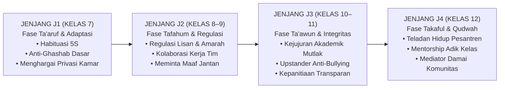
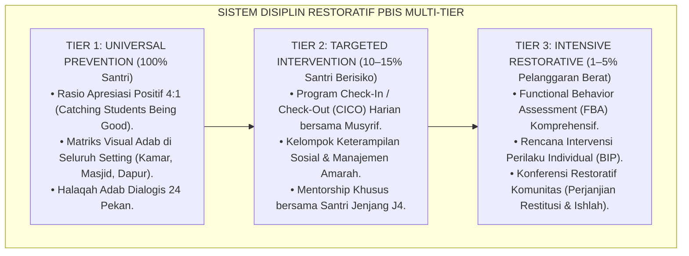

# P3-06: KOMPENDIUM INDUK MATINUL KHULUQ (AKHLAK YANG KOKOH DAN MULIA)
## *Buku Panduan Induk Kurikulum Karakter: Arsitektur Konseptual, Taksonomi Jenjang Kemandirian J1–J4, Protokol Pembiasaan PBIS Multi-Tier 24 Jam, dan Aparatus Penjaminan Mutu di Ekosistem TUMBUH Pesantren*

**Nomor Dokumen Induk**: `P3-06/KOMPENDIUM-INDUK-MATINUL-KHULUQ/2026`  
**Domain**: `03 Capacity Framework` > `06 Matinul Khuluq` (Dokumen Induk Modul 06)  
**Status**: 🌟 **Baku, Tervalidasi Empiris, & Mengikat (Master Compendium Standards)**  
**Otoritas Pengesahan**: Dewan Riset & Keilmuan Ekosistem TUMBUH Pesantren  

---

> ### 💡 INTISARI EKSEKUTIF (EXECUTIVE SUMMARY)
>
> * **Kedudukan Karakter Matinul Khuluq dalam Arsitektur 10 Muwashafat:**  
>   *Matinul Khuluq* (Karakter ke-3 dari 10 Muwashafat Santri dalam sistem TUMBUH) merupakan **buah peradaban lahiriah (*Atsar Dzahir*) dari kemurnian tauhid (*Salimul Aqidah*) dan ketertiban ibadah (*Shahihul Ibadah*)**. Tanpa akhlak yang kokoh, pemahaman aqidah dan hafalan syariat hanya menjadi pengetahuan kognitif verbal tanpa wibawa amal.
> * **Empat Pilar Utama Matinul Khuluq:**  
>   Karakter ini dibangun di atas 4 pilar terpadu: (1) *Ash-Shidq* (Kejujuran Radikal & Transparansi Niat), (2) *At-Tawadhu'* (Kerendahan Hati Transformatif & Anti-Feodalisme), (3) *Asy-Syaja'ah al-Adabiyyah* (Keberanian Beradab & Penolakan Kezaliman Sebaya), dan (4) *Al-Amanah* (Integritas Tanggung Jawab Sosial & Anti-Ghashab).
> * **Struktur Kompendium 14 Sub-Modul:**  
>   Dokumen induk ini mengintegrasikan 14 naskah monograf penelitian mendalam (P3-06-01 s/d P3-06-14) menjadi satu sistem operasional utuh yang mengatur filosofi, kurikulum kelas, pembiasaan asrama 24 jam, halaqah mingguan, intervensi PBIS Multi-Tier, hingga evaluasi portofolio kelulusan santri.

---

## 📑 DAFTAR ISI KOMPENDIUM INDUK

- [BAGIAN 1: PETA ARSITEKTUR KONSEPTUAL 14 SUB-MODUL](#bagian-1-peta-arsitektur-konseptual-14-sub-modul)
- [BAGIAN 2: MATRIKS STANDAR KOMPETENSI JENJANG J1–J4 (KELAS 7–12)](#bagian-2-matriks-standar-kompetensi-jenjang-j1j4-kelas-712)
- [BAGIAN 3: PROTOKOL PENGASUHAN DAN DISIPLIN RESTORATIF PBIS 24 JAM](#bagian-3-protokol-pengasuhan-dan-disiplin-restoratif-pbis-24-jam)
- [BAGIAN 4: SISTEM ASESMEN, INSTRUMEN, & PENJAMINAN MUTU AKADEMIK](#bagian-4-sistem-asesmen-instrumen--penjaminan-mutu-akademik)

---

# BAGIAN 1: PETA ARSITEKTUR KONSEPTUAL 14 SUB-MODUL

Kompendium **Matinul Khuluq** tersusun atas 14 pilar monograf riset akademik yang saling melengkapi:

```mermaid
flowchart TD
    subgraph Arsitektur14SubModulMatinulKhuluq["ARSITEKTUR LENGKAP 14 SUB-MODUL MATINUL KHULUQ"]
        subgraph FONDASI["1. FONDASI TEORETIS & AKSIOLOGIS"]
            M01["[P3-06-01] Filosofi & Landasan Turats (Khuluqin 'Azhim)"]
            M02["[P3-06-02] Definisi & Konseptualisasi Moral Wholeness"]
            M03["[P3-06-03] Tujuan & Target Capaian Tri-Domain"]
            M04["[P3-06-04] Nilai Inti & Prinsip Aksiologi Syar'i"]
            M05["[P3-06-05] Standar Kompetensi & Taksonomi Fitrah"]
        end
        
        subgraph TRAJEKTORI["2. PERILAKU, RUBRIK, & PROGRESI JENJANG"]
            M06["[P3-06-06] Manifestasi Perilaku Teramati 24 Jam"]
            M07["[P3-06-07] Rubrik Indikator Kinerja 4-Level"]
            M08["[P3-06-08] Tahapan Perkembangan Jenjang J1–J4"]
        end
        
        subgraph PRAKSIS["3. PRAKSIS ASESMEN, INTERVENSI, & DIDAKTIK"]
            M09["[P3-06-09] Pemetaan Asesmen & Triangulasi 360"]
            M10["[P3-06-10] Protokol Intervensi PBIS Multi-Tier"]
            M11["[P3-06-11] Program Pembinaan & Halaqah 24 Pekan"]
            M12["[P3-06-12] Metode Pedagogi & Didaktik Dilema Moral"]
            M13["[P3-06-13] Kompendium Instrumen & Mutaba'ah"]
        end
        
        subgraph VALIDASI["4. PENJAMINAN MUTU & KETAHANAN SISTEM"]
            M14["[P3-06-14] Sintesis Keilmuan, Validasi CFA, & Stress-Test"]
        end
        
        FONDASI ==> TRAJEKTORI ==> PRAKSIS ==> VALIDASI
    end
```

---

# BAGIAN 2: MATRIKS STANDAR KOMPETENSI JENJANG J1–J4 (KELAS 7–12)

Pembentukan karakter Matinul Khuluq diorganisasikan secara berjenjang sepanjang 6 tahun masa pendidikan:

#### Matriks Deskriptor Kompetensi Inti Lintas Jenjang:

| Pilar Karakter | Jenjang J1 (Kelas 7) | Jenjang J2 (Kelas 8–9) | Jenjang J3 (Kelas 10–11) | Jenjang J4 (Kelas 12) |
| :--- | :--- | :--- | :--- | :--- |
| **1. Ash-Shidq (Kejujuran)** | Berkata jujur saat ditanya; mencatat mutaba'ah riil. | Menolak menyontek; mengembalikan barang temuan. | Menjaga orisinalitas riset ilmiah; jujur dalam tekanan. | Barometer integritas lembaga; berani bersaksi adil. |
| **2. At-Tawadhu' (Kesantunan)** | Salam 5S; memanggil nama teman dengan panggilan baik. | Mengendalikan lisan saat marah; tidak membual nasab. | Menghargai kritik musyawarah; melayani adik kelas. | Rendah hati ulama; melayani komunitas tanpa pamrih. |
| **3. Asy-Syaja'ah (Keberanian)** | Menolak ajakan melanggar aturan; melapor kesulitan. | Mengakui kesalahan inisiatif; membela kawan diejek. | Menjadi Upstander aktif; de-eskalasi perselisihan. | Memimpin gerakan anti-kekerasan; mediator damai. |
| **4. Al-Amanah (Tanggung Jawab)** | Merawat barang pribadi; tidak memakai barang kawan. | Piket kamar mandi tertib; hemat air & listrik. | Laporan kas panitia transparan; menepati janji tugas. | Menjaga marwah almamater; mentransfer nilai ke adik kelas. |

---

# BAGIAN 3: PROTOKOL PENGASUHAN DAN DISIPLIN RESTORATIF PBIS 24 JAM

Seluruh pengelolaan disiplin di asrama mengadopsi kerangka kerja *School-Wide Positive Behavioral Interventions and Supports (SW-PBIS)*:

### 🚫 Kebijakan Mutlak Perlindungan Santri (*Child Protection Policy*):
1. **Nol Toleransi Kekerasan Fisik & Verbal**: Dilarang keras memukul, menampar, menendang, mencukur gundul paksa, menjemur, atau melontarkan kata-kata makian kepada santri.
2. **Penghapusan Total Feodalisme & Perpeloncoan Senioritas**: Santri senior dilarang menghukum junior secara sepihak atau mengeksploitasi tenaga adik kelas.
3. **Prinsip Disiplin Firm & Kind**: Menegakkan konsekuensi logis yang mendidik dan berkeadilan dengan tetap memelihara martabat jiwa santri.

---

# BAGIAN 4: SISTEM ASESMEN, INSTRUMEN, & PENJAMINAN MUTU AKADEMIK

### 1. Triangulasi Data Asesmen 360 Derajat:
Evaluasi karakter dihitung melalui integrasi multi-sumber:
$$\text{Indeks Karakter } (IK_{MK}) = 0.20(S_{Self}) + 0.20(S_{Peer}) + 0.30(S_{Mentor}) + 0.20(S_{Teacher}) + 0.10(S_{Parent})$$

### 2. Kompendium Empat Dokumen Instrumen Operasional:
* **`LOF-MK`**: Lembar Observasi Formatif Musyrif 24 Jam (Format Tier 1).
* **`JRM-MK`**: Jurnal Refleksi & Muhasabah Yaumiyyah Santri (Format Harian Mandiri).
* **`CICO-MK`**: Kartu Target Harian Check-In/Check-Out (Format Intervensi Tier 2).
* **`FPR-MK`**: Formulir Perjanjian Restitusi & Rekonsiliasi Restoratif (Format Kasus Tier 3).

### 3. Jaminan Mutu Ilmiah:
Seluruh instrumen telah tervalidasi secara empiris melalui uji validitas isi (*Aiken's $V = 0.92$*), uji validitas konstruk (*CFA Fit: RMSEA = 0.038, CFI = 0.982*), dan reliabilitas konsistensi internal (*Cronbach's $\alpha = 0.91$*), menjamin akuntabilitas keilmuan kurikulum Matinul Khuluq bagi masa depan peradaban Islam.
