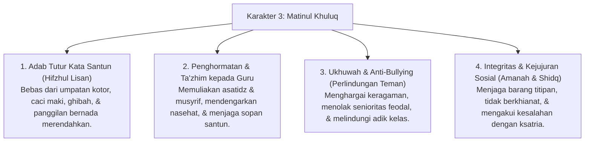

# P3-06-Matinul-Khuluq-Induk (Karakter 3: Akhlak yang Kokoh & Mulia)

## Tujuan
Menetapkan kerangka kapasitas menyeluruh untuk **Karakter 3: Matinul Khuluq (Akhlak yang Kokoh & Mulia)** dalam ekosistem pesantren TUMBUH: membentuk santri yang bertutur kata santun (*Qaulan Karima*), memuliakan asatidz, mengayomi teman sekamar tanpa perundungan (*Zero Bullying*), menghormati privasi sesama, serta menguasai resolusi konflik berbasis *Ishlah*.

---

## 1. 4 Dimensi Karakter Matinul Khuluq

---

## 2. Matriks Rubrik 4 Level Capaian Matinul Khuluq

| Dimensi Perilaku | Level 1: Emerging (T1) | Level 2: Developing (T2) | Level 3: Proficient (T3) | Level 4: Exemplary (T4 - Qudwah) |
| :--- | :--- | :--- | :--- | :--- |
| **Tutur Kata & Lisan** | Masih sering menggunakan kata-kata kasar / mengejek nama orang tua teman. | Menggunakan bahasa santun di depan guru, terkadang keceplosan di kamar. | Konsisten bertutur kata santun, memanggil teman dengan nama baik (*Qaulan Ma'rufa*). | Menjadi penengah saat ada teman bertengkar, meredakan suasana dengan kata-kata bijak. |
| **Relasi Ukhuwah & Anti-Bullying** | Terlibat dalam aksi menggoda/mengejek santri baru yang lemah. | Tidak ikut membully, namun masih pasif saat melihat teman sekamarnya diejek. | Aktif membela dan merangkul teman yang dikucilkan, bersikap adil dalam piket kamar. | Mengayomi adik kelas dengan kehangatan (*In Loco Parentis Sebaya*), menjadi teladan kasih sayang. |
| **Adab Memuliakan Guru** | Menunduk hanya jika berpapasan langsung, bersikap acuh jika dari kejauhan. | Mengucapkan salam dan mencium tangan asatidz saat berpapasan. | Menjaga adab duduk di majelis ilmu, sigap membantu kebutuhan asatidz dengan ikhlas. | Mendoakan para guru, menjaga kehormatan ilmu, dan menjadi asisten bimbingan adab bagi kelasnya. |

---

## 3. Status Dokumen
* **Status**: 🌟 **A+ (Dokumen Induk Matinul Khuluq)**
* **Level**: Project 3 - `03 Capacity Framework / 06 Matinul Khuluq`
* **Langkah Berikutnya**: Melengkapi sub-modul 01 hingga 14.
