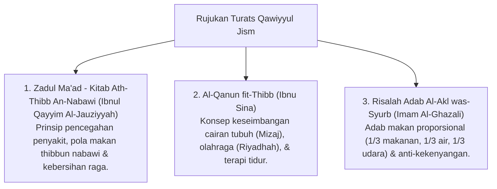

# P3-07-01-Filosofi-dan-Landasan-Turats (Qawiyyul Jism)

## Tujuan
Membedah landasan filosofis kekuatan fisik penuntut ilmu, amanah pemeliharaan raga (*Hifzhun Nafs & Jasad*), dan rujukan kitab Turats kedokteran Islam (*Thibb Nabawi*).

---

## 1. Landasan Nash Al-Qur'an & As-Sunnah

### 1. QS. Al-Baqarah [2]: 247
> وَزَادَهُ بَسْطَةً فِي الْعِلْمِ وَالْجِسْمِ
> *"Dan Allah telah menganugerahkan kepadanya kelebihan ilmu dan kekuatan fisik (jasmani)."*

### 2. HR. Muslim (No. 2664)
> الْمُؤْمِنُ الْقَوِيُّ خَيْرٌ وَأَحَبُّ إِلَى اللَّهِ مِنَ الْمُؤْمِنِ الضَّعِيفِ، وَفِي كُلٍّ خَيْرٌ
> *"Mukmin yang kuat lebih baik dan lebih dicintai oleh Allah daripada mukmin yang lemah, namun pada keduanya ada kebaikan."*

---

## 2. Rujukan Khazanah Turats Klasik

---

## 3. Status Dokumen
* **Status**: 🌟 **A+ (Tervalidasi & Siap Diimplementasikan)**
* **Level**: Project 3 - `03 Capacity Framework / 07 Qawiyyul Jism / 01 Philosophy`
