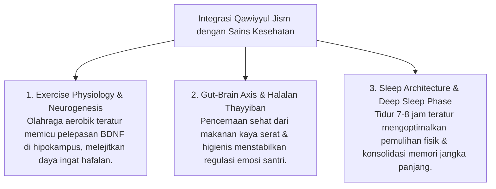

# P3-07-02-Definisi-dan-Konseptualisasi (Qawiyyul Jism)

## Tujuan
Menetapkan definisi operasional, batasan istilah, dan integrasi sains modern (*Exercise Physiology, Nutrition & Sleep Architecture*) dari karakter **Qawiyyul Jism**.

---

## 1. Definisi Operasional Baku

> **Qawiyyul Jism dalam Ekosistem TUMBUH adalah:**  
> *"Kapasitas fisik santri yang memiliki derajat kebugaran jasmani optimal, imunitas tangguh, pola hidup higienis (*Nazhafah*), kebiasaan konsumsi halal-thayyib bergizi, serta pola tidur teratur yang menopang ketahanan fisik dan mental dalam menuntut ilmu dan beribadah."*

---

## 2. Integrasi Konsep Sains & Kebugaran

---

## 3. Status Dokumen
* **Status**: 🌟 **A+ (Tervalidasi & Siap Diimplementasikan)**
* **Level**: Project 3 - `03 Capacity Framework / 07 Qawiyyul Jism / 02 Definition`
