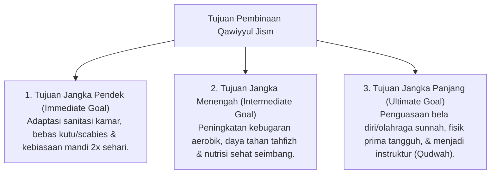

# P3-07-03-Tujuan-dan-Target-Capaian (Qawiyyul Jism)

## Tujuan
Menetapkan tujuan jangka pendek, menengah, dan panjang pembinaan karakter **Qawiyyul Jism** pada santri di lingkungan pesantren TUMBUH.

---

## 1. 3 Tingkatan Tujuan Pembinaan Jasmani

---

## 2. Target Capaian Kuantitatif & Kualitatif

1. **Target Kuantitatif**:
   - Angka kejadian penyakit kulit (Scabies) dan ISPA turun hingga **0%**.
   - 100% santri lulus uji kebugaran jasmani santri (Tes Lari 12 Menit / VO2 Max Kategori Baik).
2. **Target Kualitatif**:
   - Santri memiliki postur tubuh tegap, gesit dalam beraktivitas, dan bersemangat dalam menuntut ilmu tanpa rasa lesu.

---

## 3. Status Dokumen
* **Status**: 🌟 **A+ (Tervalidasi & Siap Diimplementasikan)**
* **Level**: Project 3 - `03 Capacity Framework / 07 Qawiyyul Jism / 03 Purpose`
