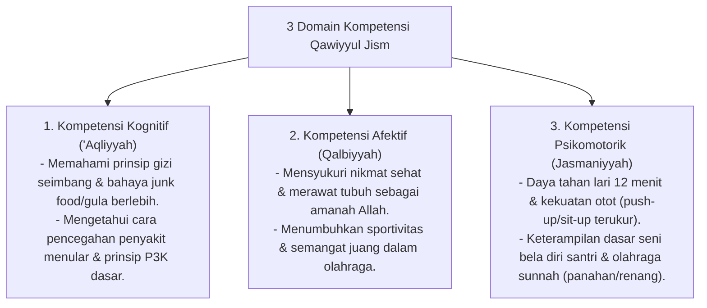

# P3-07-05-Standar-Kompetensi-dan-Taksonomi (Qawiyyul Jism)

## Tujuan
Menetapkan **Standar Capaian Pembelajaran & Taksonomi Kompetensi** karakter Qawiyyul Jism untuk seluruh jenjang santri di pesantren TUMBUH.

---

## 1. 3 Domain Kompetensi Qawiyyul Jism

---

## 2. Matriks Capaian Berjenjang Sesuai Tangga TUMBUH

* **Jenjang T1 (Kelas 7 / 10 Baru)**: Menjaga kebersihan diri (mandi 2x sehari, potong kuku), terbiasa senam pagi, dan adaptasi pola makan asrama.
* **Jenjang T2 (Kelas 8 / 11)**: Mampu lari 1500m tanpa henti, aktif dalam klub olahraga sore, menguasai jurus dasar bela diri santri.
* **Jenjang T3 (Kelas 9 / 12)**: Memiliki stamina prima, menguasai teknik P3K mandiri, menjaga kebugaran hafalan melalui olahraga teratur.
* **Jenjang T4 (Santri Akhir / Teladan)**: Menjadi kapten tim olahraga / instruktur senam pagi asrama (*Qudwah*), memimpin patroli kebersihan kamar.

---

## 3. Status Dokumen
* **Status**: 🌟 **A+ (Tervalidasi & Siap Diimplementasikan)**
* **Level**: Project 3 - `03 Capacity Framework / 07 Qawiyyul Jism / 05 Competencies`
