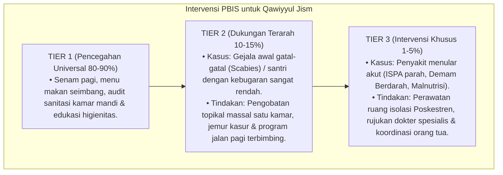

# P3-07-10-Protokol-Intervensi-dan-Pembiasaan (Qawiyyul Jism)

## Tujuan
Menetapkan protokol pembiasaan kesehatan asrama (*Health SOP*) dan pemetaan intervensi bertingkat (*PBIS Multi-Tier Intervention*) untuk pencegahan penyakit menular dan peningkatan kebugaran fisik santri.

---

## 1. Protokol Pembiasaan Rutin Asrama (Tier 1: Universal 100%)

1. **Jumat Bersih & Inspeksi Kuku (*Nail & Skin Check*)**:
   - Pemeriksaan kuku dan kebersihan kulit seluruh santri setiap hari Jumat pagi sebelum sholat Jumat.
2. **Senam Kebugaran & Olahraga Sore Terjadwal**:
   - Senam bersama 2x sepekan (Selasa & Jumat pagi) dan olahraga minat-bakat sore (16.00–17.15).
3. **Penyuluhan Gizi & Higienitas Bulanan Poskestren**:
   - Edukasi bahaya berbagi handuk/pakaian, teknik mencuci baju bersih, dan adab makan sehat.

---

## 2. Pemetaan Intervensi Khusus PBIS

---

## 3. Status Dokumen
* **Status**: 🌟 **A+ (Tervalidasi & Siap Diimplementasikan)**
* **Level**: Project 3 - `03 Capacity Framework / 07 Qawiyyul Jism / 10 Intervention Mapping`
