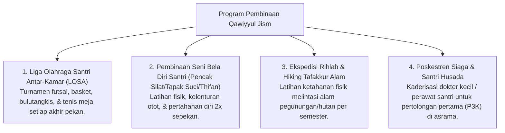

# P3-07-11-Program-Pembinaan-dan-Halaqah (Qawiyyul Jism)

## Tujuan
Menetapkan daftar program pembinaan fisik terstruktur, kompetisi olahraga, dan kegiatan kesehatan santri di pesantren TUMBUH.

---

## 1. 4 Program Unggulan Pembinaan Jasmani

---

## 2. Status Dokumen
* **Status**: 🌟 **A+ (Tervalidasi & Siap Diimplementasikan)**
* **Level**: Project 3 - `03 Capacity Framework / 07 Qawiyyul Jism / 11 Programs`
