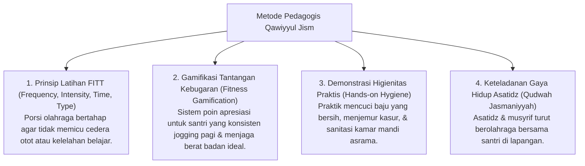

# P3-07-12-Metode-Pedagogi-dan-Didaktik-Jasmani (Qawiyyul Jism)

## Tujuan
Menetapkan metode pedagogis dan pendekatan didaktik kebugaran jasmani terukur (*Physical Education Pedagogy*) di pesantren.

---

## 1. 4 Metode Pedagogi Pengajaran Jasmani

---

## 2. Status Dokumen
* **Status**: 🌟 **A+ (Tervalidasi & Siap Diimplementasikan)**
* **Level**: Project 3 - `03 Capacity Framework / 07 Qawiyyul Jism / 12 Methods`
