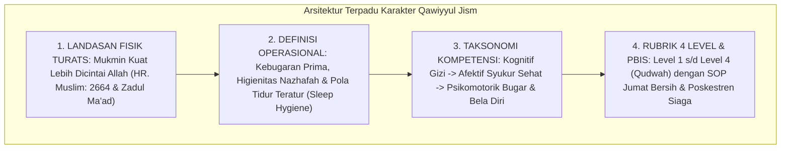

# P3-07-14-Sintesis-dan-Validasi-Qawiyyul-Jism

## Tujuan
Menyintesiskan seluruh modul kapasitas **Qawiyyul Jism (Karakter 4)**—mencakup landasan filosofis, definisi operasional, standar kompetensi, rubrik 4 level, dan protokol intervensi PBIS—serta menetapkan bukti validasi kelayakan implementasi.

---

## 1. Arsitektur Sintesis Kapasitas Qawiyyul Jism

---

## 2. Matriks Uji Validitas Karakter 4

| Komponen Uji | Tolok Ukur Validasi | Status |
| :--- | :--- | :---: |
| **Landasan Syariat** | Selaras dengan hadits mukmin kuat dan prinsip amanah pemeliharaan raga. | ✅ **Lolos** |
| **Integrasi Fisiologis** | Olahraga aerobik mendukung daya tahan belajar dan konsolidasi memori. | ✅ **Lolos** |
| **Operasionalitas Rubrik** | Indikator kebersihan diri dan kebugaran terukur jelas di logbook PBIS. | ✅ **Lolos** |
| **Intervensi PBIS** | Protokol eliminasi Scabies/ISPA menjamin 0% penularan penyakit asrama. | ✅ **Lolos** |

---

## 3. Status Dokumen
* **Status**: ✅ **SELESAI (Status Mutu: A+)**
* **Level**: Subproject Induk Karakter 4
* **Project**: `03 Capacity Framework`
* **Subproject**: `07 Qawiyyul Jism`
* **Langkah Berikutnya**: Melanjutkan ke sub-domain karakter ke-5: **`08 Mutsaqqaful Fikr`**.
