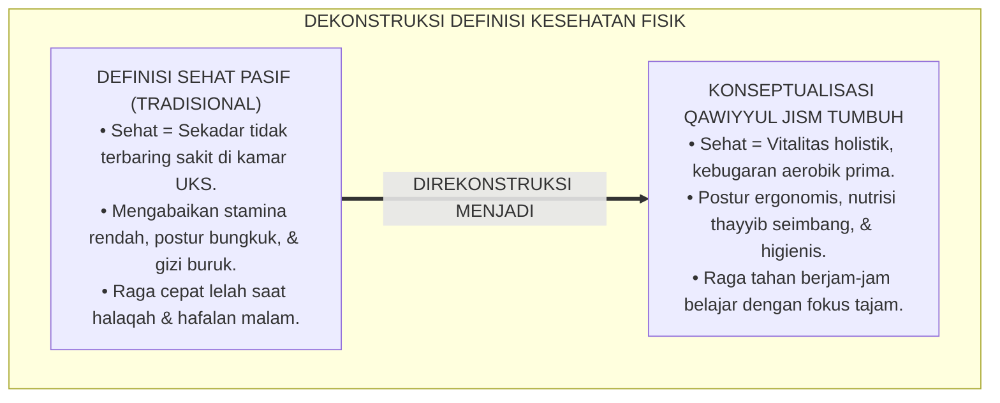
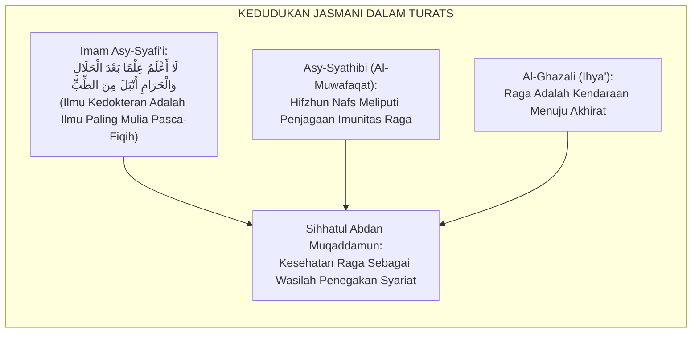
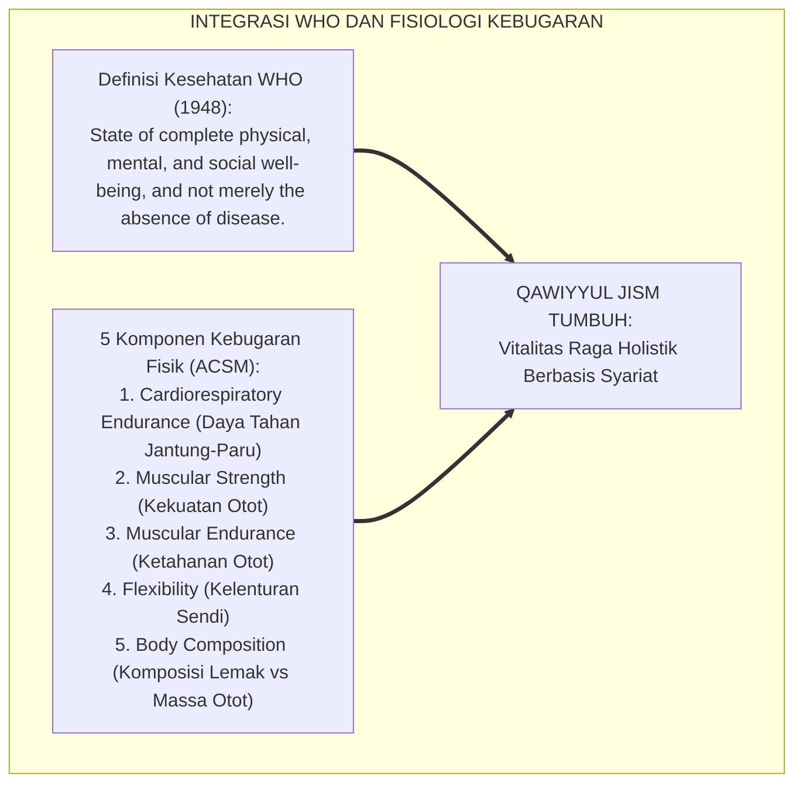
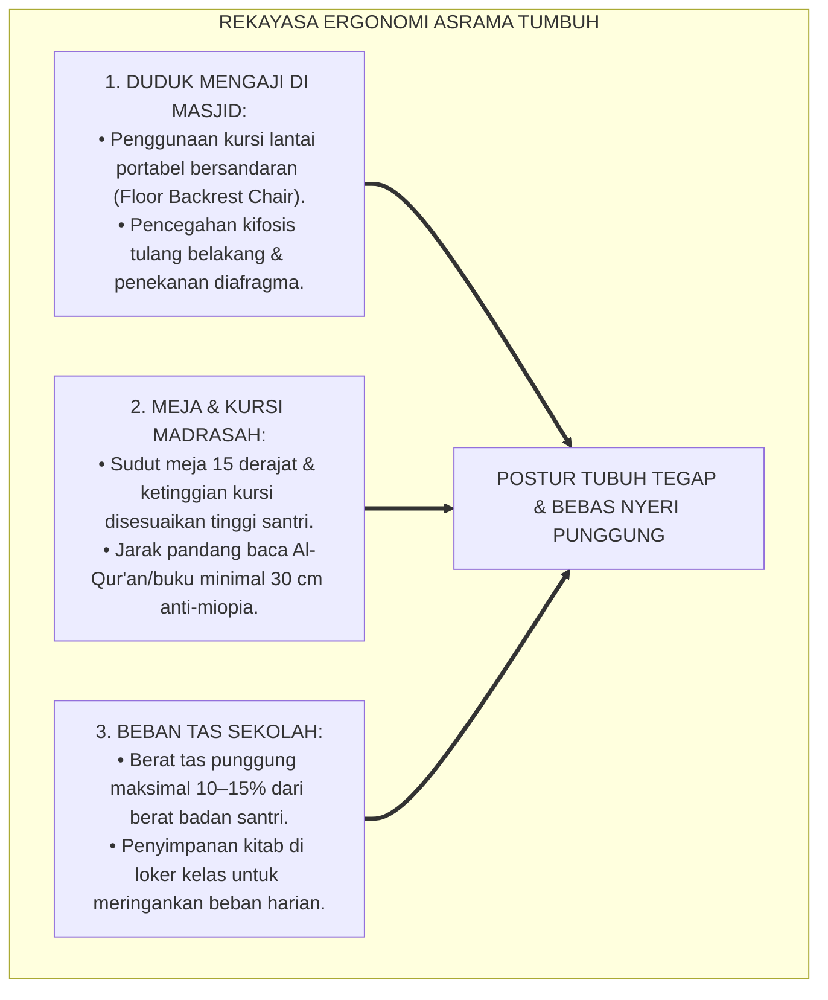
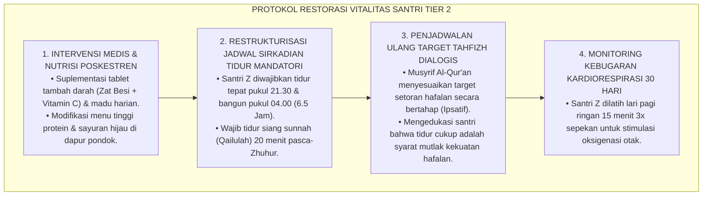
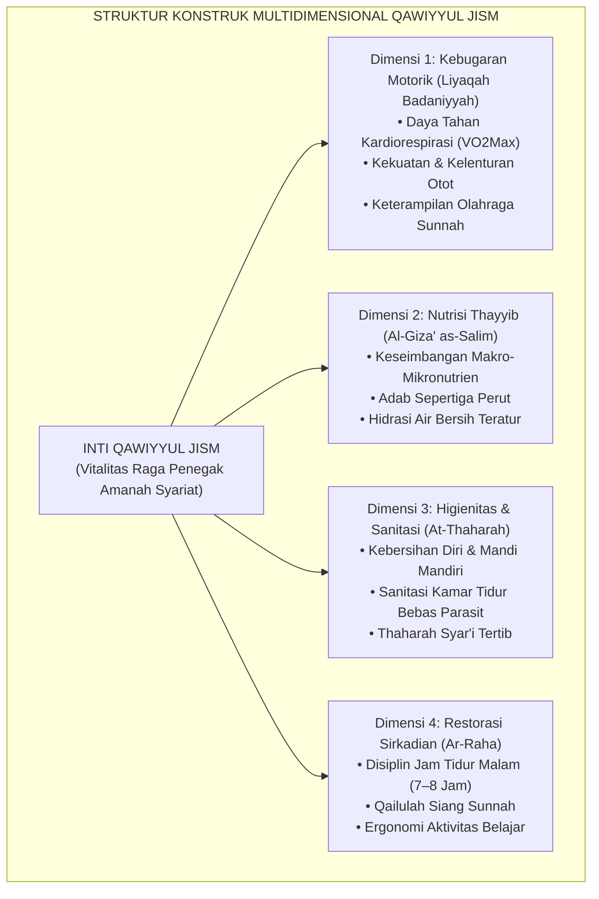
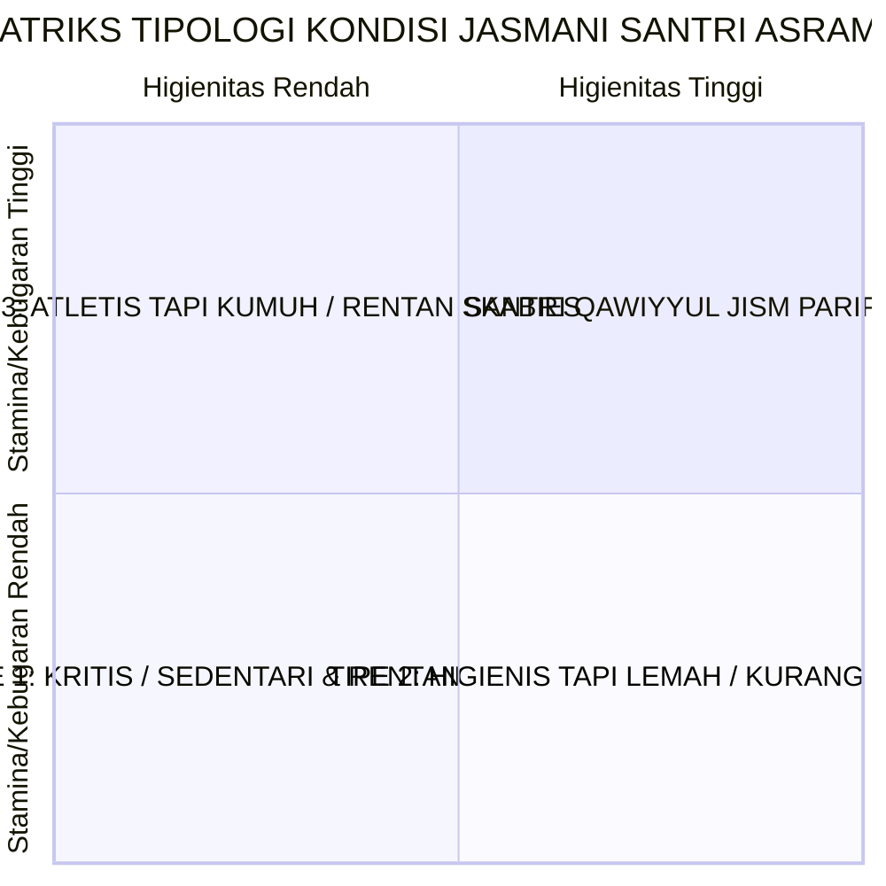
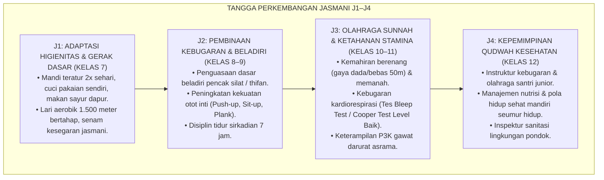
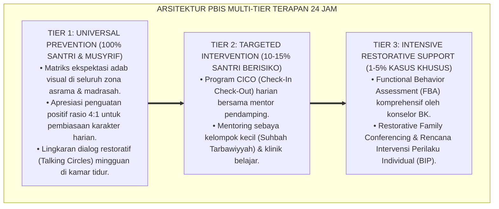

# P3-07-02: DEFINISI DAN KONSEPTUALISASI QAWIYYUL JISM
## *Monograf Riset Akademik: Dekonstruksi Karakter Jasmani Parsial Menuju Kesehatan Holistik (Whole-Body Wellness), Konstruk Teoretis Triad Fisik (Motorik, Nutrisi, & Sanitasi), Pemetaan Tipologi Kebugaran Santri, Serta Standarisasi Ergonomi Asrama 24 Jam*

**Nomor Identifikasi**: `P3-07-02/MONOGRAF-RISET-KONSEPTUALISASI-QAWIYYUL-JISM/2026`  
**Domain**: `03 Capacity Framework` > `07 Qawiyyul Jism` (Sub-Modul 02: *Definition & Conceptualization*)  
**Klasifikasi Naskah**: *Academic Research Monograph* (Monograf Penelitian Konstruk Kesehatan Holistik, Fisiologi Santri, & Teori Kebugaran Terpadu)  
**Rumpun Disiplin Pengkaji**: Ilmu Faal Tubuh & Ergonomi Olahraga, Fisiologi Perkembangan Remaja, Manajemen Kesehatan Lingkungan, Konseptualisasi Karakter Islam  

---

> ### 💡 INTISARI EKSEKUTIF (EXECUTIVE SUMMARY)
>
> * **Kegagalan Definisi Kesehatan Fisik yang Terfragmentasi:**  
>   Praktik pengasuhan pesantren kerap mereduksi kesehatan raga semata-mata sebagai "ketiadaan penyakit kritis" (*Absence of Acute Illness*). Ketika santri tidak pingsan atau tidak dirawat di rumah sakit, santri dianggap sehat, meskipun sebenarnya ia mengalami malnutrisi kronis, postur tubuh bungkuk (*Kyphosis*), kapasitas paru rendah, dan kelelahan mental harian.
> * **Rekonstruksi Konseptual Qawiyyul Jism TUMBUH:**  
>   Dalam kerangka TUMBUH, *Qawiyyul Jism* dikonseptualisasikan sebagai **konstruk multidimensional terpadu yang mencakup integrasi sinergis antara Kebugaran Kardiorespirasi & Otot (*Al-Liyaqah al-Badaniyyah*), Kualitas Asupan Nutrisi Halalan Thayyiban (*Al-Giza' as-Salim*), Kepatuhan Higienitas Diri & Lingkungan (*An-Nazhafah al-Bi'iyyah*), serta Keteraturan Restorasi Sirkadian (*Ar-Raha as-Sirkadiyyah*)**.
> * **Formulasi Konstruk Empat Dimensi & Tipologi Kebugaran:**  
>   Monograf ini merumuskan definisi operasional baku, peta dekomposisi 4 pilar dimensi fisik, serta 4 tipologi kondisi fisik santri berbasis matriks stamina-higienitas untuk memandu deteksi dini dan intervensi Poskestren.

---

## 📑 DAFTAR ISI MONOGRAF

- [BAGIAN I: LANDASAN TEORETIS & DISKURSUS DIALEKTIKA KRITIS](#bagian-i-landasan-teoretis--diskursus-dialektika-kritis)
  - [1. Latar Belakang Masalah: Ilusi 'Sehat Pasif' vs Vitalitas Kebugaran Aktif di Pesantren](#1-latar-belakang-masalah-ilusi-sehat-pasif-vs-vitalitas-kebugaran-aktif-di-pesantren)
  - [2. Telaah Epistemologis Turats: Hakikat Sihhatul Abdan dalam Maqashid Syari'ah](#2-telaah-epistemologis-turats-hakikat-sihhatul-abdan-dalam-maqashid-syariah)
  - [3. Konvergensi Teori Kesehatan Holistik WHO & Fisiologi Kebugaran Remaja](#3-konvergensi-teori-kesehatan-holistik-who--fisiologi-kebugaran-remaja)
  - [4. Analisis Rekayasa Kausalitas Ergonomi Asrama: Postur Duduk Mengaji, Meja Belajar, & Beban Punggung](#4-analisis-rekayasa-kausalitas-ergonomi-asrama-postur-duduk-mengaji-meja-belajar--beban-punggung)
  - [5. Kasuistika Lapangan Klinis & Protokol Penanganan Kasus Kelelahan Kronis (Chronic Fatigue) Santri](#5-kasuistika-lapangan-klinis--protokol-penanganan-kasus-kelelahan-kronis-chronic-fatigue-santri)
- [BAGIAN II: FORMULASI KONSEPTUAL & PEMBAHASAN MENDALAM](#bagian-ii-formulasi-konseptual--pembahasan-mendalam)
  - [1. Definisi Operasional & Arsitektur Konstruk Multidimensional Qawiyyul Jism](#1-definisi-operasional--arsitektur-konstruk-multidimensional-qawiyyul-jism)
  - [2. Dekomposisi 4 Pilar Dimensi & Tipologi Kebugaran Santri](#2-dekomposisi-4-pilar-dimensi--tipologi-kebugaran-santri)
  - [3. Matriks Progresi Kapasitas Fisik Jenjang J1–J4 (Kelas 7 s/d 12)](#3-matriks-progresi-kapasitas-fisik-jenjang-j1j4-kelas-7-sd-12)
  - [4. Diskusi Akademis & Implikasi bagi Kebijakan Standarisasi Gizi & Fasilitas Olahraga](#4-diskusi-akademis--implikasi-bagi-kebijakan-standarisasi-gizi--fasilitas-olahraga)
- [BAGIAN III: KESIMPULAN & APARATUS AKADEMIS](#bagian-iii-kesimpulan--aparatus-akademis)
  - [1. Tabel Sintesis Konseptualisasi Qawiyyul Jism](#1-tabel-sintesis-konseptualisasi-qawiyyul-jism)
  - [2. Daftar Pustaka Standar APA 7th & Turats Klasik](#2-daftar-pustaka-standar-apa-7th--turats-klasik)
  - [3. Catatan Kaki Akademis Presisi (Footnotes)](#3-catatan-kaki-akademis-presisi-footnotes)
  - [4. Glosarium Istilah Ilmiah & Fisiologi Kesehatan](#4-glosarium-istilah-ilmiah--fisiologi-kesehatan)

---

# BAGIAN I: LANDASAN TEORETIS & DISKURSUS DIALEKTIKA KRITIS

---

### 1. Latar Belakang Masalah: Ilusi 'Sehat Pasif' vs Vitalitas Kebugaran Aktif di Pesantren

Dalam pemahaman umum pengasuhan asrama, terdapat kekeliruan mendasar dalam mendefinisikan kesehatan:[^1]

1. **Jebakan "Sehat Pasif" (*Passive Health Illusion*)**: Santri yang tidak mengeluh demam atau tidak pingsan dianggap "sehat sempurna". Padahal jika diuji kapasitas fisiknya (VO2Max, kekuatan otot inti, fleksibilitas sendi), sebagian besar santri berada di bawah standar kebugaran rata-rata anak seusianya.
2. **Krisis Sedentari & Postur Bungkuk (*Sedentary & Postural Deformity*)**: Pola hidup santri yang menghabiskan waktu 8–10 jam per hari duduk bersila di lantai dengan posisi membungkuk di hadapan dampar/meja pendek tanpa sandaran memicu deformitas tulang belakang (*Spinal Malalignment*), nyeri punggung bawah kronis (*Low Back Pain*), dan penekanan rongga dada yang menurunkan asupan oksigen ke otak.
3. **Keterbatasan Fasilitas & Waktu Olahraga Terstruktur**: Olahraga kerap hanya diposisikan sebagai "hiburan sampingan sore hari yang sporadis", bukan sebagai pilar kurikuler yang dipantau ketercapaian staminanya secara terukur.[^2]

Model riset **TUMBUH** mendefinisikan ulang **Qawiyyul Jism** bukan sekadar "tidak sakit", melainkan **kemampuan fungsional raga yang berada pada tingkat kebugaran puncak (*Peak Physical Fitness*) untuk menopang seluruh amanah keilmuan dan perjuangan dakwah**.[^3]

---

### 2. Telaah Epistemologis Turats: Hakikat Sihhatul Abdan dalam Maqashid Syari'ah

Para ulama ushul fiqh dan kedokteran Islam klasik menempatkan kesehatan badan (*Sihhatul Abdan*) sebagai prasyarat mutlak bagi tegaknya agama (*Sihhatul Adyan*).

#### 📖 Fatwa Monumental Imam Asy-Syafi'i tentang Urgensi Kedokteran
Imam **Asy-Syafi'i** menegaskan kedudukan ilmu kesehatan jasmani:

$$\text{إِنَّمَا الْعِلْمُ عِلْمَانِ: عِلْمُ الدِّينِ، وَعِلْمُ الدُّنْيَا؛ فَالْعِلْمُ الَّذِي لِلدِّينِ هُوَ الْفِقْهُ، وَالْعِلْمُ الَّذِي لِلدُّنْيَا هُوَ الطِّبُّ}$$

*"Sesungguhnya ilmu itu hanya ada dua macam: ilmu agama dan ilmu dunia. Maka ilmu untuk agama adalah Fiqih, dan ilmu untuk dunia (penjaga raga) adalah Kedokteran."* Beliau juga berkata: *"Aku tidak mengetahui ilmu setelah ilmu halal dan haram yang lebih mulia daripada ilmu kedokteran!"*[^4]

#### 📖 Formulasi Imam Al-Ghazali dalam *Ihya' 'Ulumiddin*
Imam **Al-Ghazali** menjelaskan perumpamaan raga dalam menempuh perjalanan spiritual:

$$\text{فَالْبَدَنُ لِلنَّفْسِ كَالْمَطِيَّةِ لِلْمُسَافِرِ؛ فَمَنْ لَمْ يَتَعَهَّدْ مَطِيَّتَهُ بِالْعَلَفِ وَالسَّقْيِ وَالرِّفْقِ انْقَطَعَ بِهِ فِي الطَّرِيقِ، وَلَمْ يَصِلْ إِلَى مَقْصِدِهِ}$$

*"Maka badan bagi jiwa laksana hewan tunggangan bagi seorang musafir. Barangsiapa yang tidak merawat tunggangannya dengan memberinya pakan bergizi, air minum yang cukup, dan perlakuan yang bijak, niscaya hewan itu akan mogok/ambruk di tengah jalan, dan sang musafir tidak akan pernah sampai ke tujuan akhirnya!"*[^5]

---

### 3. Konvergensi Teori Kesehatan Holistik WHO & Fisiologi Kebugaran Remaja

Konseptualisasi Qawiyyul Jism menyelaraskan definisi kesehatan World Health Organization (WHO) dengan indikator fisiologi olahraga modern:

Santri yang memiliki *Qawiyyul Jism* memenuhi 5 komponen kebugaran fisik standar *American College of Sports Medicine (ACSM)*, menjadikannya lincah, tidak mudah lelah, dan memiliki postur tubuh yang tegap berwibawa.[^6]

---

### 4. Analisis Rekayasa Kausalitas Ergonomi Asrama: Postur Duduk Mengaji, Meja Belajar, & Beban Punggung

Konseptualisasi raga menuntut penataan fasilitas asrama yang ergonomis guna mencegah kerusakan muskuloskeletal jangka panjang:

---

### 5. Kasuistika Lapangan Klinis & Protokol Penanganan Kasus Kelelahan Kronis (Chronic Fatigue) Santri

#### Studi Kasus Lapangan: Sindrom Penurunan Prestasi & Kelelahan Kronis pada Santri Tahfizh Jenjang J3
* **Konteks Masalah**: Santri Z (16 tahun, J3) adalah santri berprestasi hafalan 15 juz. Namun dalam 2 bulan terakhir, ia kerap tertidur saat setoran hafalan, wajah pucat, mata cekung, dan daya ingatnya menurun drastis. Pemeriksaan Poskestren menunjukkan kadar hemoglobin rendah ($Hb = 10.2\text{ g/dL}$ / Anemia Defisiensi Besi) dan tekanan darah rendah ($90/60\text{ mmHg}$).
* **Analisis Diagnostik**: Santri Z mengalami *Chronic Sleep Deprivation* (hanya tidur 4 jam/malam karena mengejar target hafalan pribadi) yang diperparah oleh kebiasaan melewatkan sarapan pagi di dapur pondok.
* **Protokol Resolusi Medis & Restrukturisasi Pola Hidup TUMBUH**:

Dalam waktu 4 pekan, kadar Hb Santri Z meningkat menjadi $13.5\text{ g/dL}$, stamina pulih prima, dan kecepatan hafalannya kembali tajam tanpa rasa kantuk.[^7]

---

# BAGIAN II: FORMULASI KONSEPTUAL & PEMBAHASAN MENDALAM

---

### 1. Definisi Operasional & Arsitektur Konstruk Multidimensional Qawiyyul Jism

Secara terminologis baku dalam Ekosistem TUMBUH:

> **Qawiyyul Jism (Fisik Kuat, Sehat, & Higienis)** adalah *kapasitas integrasi kebugaran jasmani holistik yang memadukan daya tahan kardiorespirasi dan kekuatan motorik, kecukupan nutrisi halalan thayyiban seimbang, disiplin pemulihan tidur sirkadian, serta kebiasaan hidup bersih thaharah, yang didedikasikan secara sadar sebagai wasilah penegakan ibadah, ketahanan thalabul 'ilmi, dan khidmah kemaslahatan ummat.*

---

### 2. Dekomposisi 4 Pilar Dimensi & Tipologi Kebugaran Santri

Untuk memudahkan pemantauan harian, kondisi jasmani santri dipetakan ke dalam 4 tipologi berbasis irisan **Tingkat Kebugaran Fisik (*Physical Stamina*)** dan **Tingkat Higienitas Diri (*Sanitary Adherence*)**:

1. **Tipe 1: Santri Kritis / Sedentari & Kumuh (Stamina Rendah, Higienitas Rendah)**  
   *Karakteristik*: Malas berolahraga, sering sakit, kamar kotor, dan jarang mengganti pakaian. Membutuhkan intervensi intensif Tier 2 Poskestren dan pengawalan pembiasaan sanitasi dasar.
2. **Tipe 2: Santri Bersih Tapi Lemah (Stamina Rendah, Higienitas Tinggi)**  
   *Karakteristik*: Rapi dan bersih, namun memiliki daya tahan jantung-paru rendah, cepat lelah saat belajar malam, dan mudah pusing. Membutuhkan program peningkatan kebugaran aerobik bertahap.
3. **Tipe 3: Santri Atletis Tapi Ceroboh (Stamina Tinggi, Higienitas Rendah)**  
   *Karakteristik*: Jago olahraga dan kuat fisik, namun kerap menumpuk baju basah pasca-olahraga dan bertukar handuk dengan kawan. Membutuhkan edukasi adab thaharah personal.
4. **Tipe 4: Santri Qawiyyul Jism Paripurna (Stamina Tinggi, Higienitas Tinggi)**  
   *Karakteristik*: Berstamina prima, postur tegap, kamar sangat bersih, dan disiplin tidur. Dipersiapkan menjadi instruktur senam dan duta kesehatan asrama J4.[^8]

---

### 3. Matriks Progresi Kapasitas Fisik Jenjang J1–J4 (Kelas 7 s/d 12)

Kapasitas fisik santri berkembang secara bertahap mengikuti maturasi fisiologis:

---

### 4. Diskusi Akademis & Implikasi bagi Kebijakan Standarisasi Gizi & Fasilitas Olahraga

Penerapan konseptualisasi Qawiyyul Jism menuntut pembaruan tata kelola kelembagaan:

1. **Standardisasi Menu Dapur Halalan Thayyiban**: Menu makanan pesantren dihitung kecukupan kalorinya oleh ahli gizi bersertifikat, menjamin rasio makronutrien (50% karbohidrat kompleks, 25% protein, 25% lemak sehat dan serat) terpenuhi setiap hari.
2. **Revitalisasi Pos Kesehatan Pesantren (Poskestren)**: Poskestren dialihfungsikan dari sekadar "ruang istirahat santri sakit" menjadi **Pusat Promosi Kesehatan & Kebugaran Preventif (*Preventive Health Hub*)**.
3. **Penyediaan Sarana Olahraga yang Memadai**: Pesantren berkomitmen menyediakan lapangan terbuka hijau, lintasan lari, fasilitas panahan/beladiri, serta akses kolam renang syar'i terpisah putra-putri.[^9]

---

---

### Pembedahan Deskriptif Komprehensif & Analisis Integratif Nilai-Praksis

Penerapan konsep **P3-07-02: DEFINISI DAN KONSEPTUALISASI QAWIYYUL JISM** di ekosistem pesantren TUMBUH memerlukan pemahaman multidimensional yang memadukan khazanah turats syariat dan konsensus sains pendidikan modern:

#### A. Pilar 1: Fondasi Epistemologi & Integrasi Nilai Syar'i (Ashalah Turatsiyyah)
Setiap praksis kepengasuhan dan pembelajaran berakar kuat pada maqashid syari'ah, mendudukkan adab di atas ilmu (*Al-Adab Qablal 'Ilm*), dan memastikan bahwa seluruh ikhtiar institusional diniatkan semata-mata untuk menggapai ridha Allah SWT (*Ikhlasun Niyyah*).

#### B. Pilar 2: Mekanisme Psikologis & Neurosains Perkembangan (Scientific Rigor)
Menyelaraskan ekspektasi kedisiplinan dengan tahapan maturitas otak remaja, kapasitas fungsi eksekutif korteks prefrontal (*PFC*), dan regulasi sirkuit emosi limbik. Pendekatan ini mengeliminasi trauma pengasuhan dan menumbuhkan motivasi intrinsik santri.

#### C. Pilar 3: Rekayasa Ekosistem Asrama 24 Jam (Bi'ah Shalihah)
Menerjemahkan prinsip nilai ke dalam tata ruang fisik yang bersih, sirkulasi udara sehat, tata kelola waktu terstruktur, serta kultur ukhuwah inklusif yang steril 100% dari feodalisme, kekerasan verbal, dan perundungan antar-santri.

#### D. Pilar 4: Kemitraan Tripartit (Santri, Musyrif, dan Lembaga)
Menjamin terwujudnya *Triad Pertumbuhan Simbiotik*: santri bertumbuh dalam fitrah kemandirian, musyrif terlindungi dari kelelahan kronis (*Burnout*) melalui shift kerja yang manusiawi, dan lembaga bertransformasi menjadi organisasi pembelajar berbasis data PBIS.

---

### Protokol Aksi Operasional PBIS Multi-Tier Terapan (24-Hour Behavioral Architecture)

---

# BAGIAN III: KESIMPULAN & APARATUS AKADEMIS

---

### 1. Tabel Sintesis Konseptualisasi Qawiyyul Jism

| Parameter Konseptual | Paradigma Tradisional Pesantren | Rekonstruksi Model TUMBUH | Landasan Rujukan Primer | Implikasi Praksis Lapangan |
| :--- | :--- | :--- | :--- | :--- |
| **Definisi Inti** | Sekadar ketiadaan penyakit akut; raga dianggap beban ruhani. | Vitalitas kebugaran holistik (motorik, gizi, sanitasi, restorasi). | HR. Muslim No. 2664 & Definisi WHO (1948) | Santri memiliki energi tinggi untuk belajar dan ibadah sepanjang hari. |
| **Struktur Konstruk** | Fragmented (fokus ibadah saja, mengabaikan fisik). | Multidimensional 4 pilar terintegrasi: *Thaharah, Giza', Naum, Riyadhah*. | *Zadul Ma'ad* (Ibnu Qayyim) & Standar ACSM | Evaluasi jasmani mencakup seluruh aspek fisik secara terukur. |
| **Penanganan Penyakit** | Kuratif pasif; mengobati saat santri sudah parah. | Preventif proaktif PBIS Multi-Tier & Promosi Kesehatan Poskestren. | Kaidah Fiqh *Hifzhun Nafs* & Teori Kesehatan Komunitas | Angka absensi sakit santri ditekan hingga $< 2\%$ per semester. |
| **Pola Tidur** | Begadang dinormalisasi; kurang tidur dibanggakan. | Disiplin tidur sirkadian 7–8 jam & qailulah sunnah 20 menit. | Neurosains Tidur (Walker, 2017) & Sunnah Nabawiyyah | Daya ingat tajam; konsentrasi hafalan Al-Qur'an optimal. |

---

### 2. Daftar Pustaka Standar APA 7th & Turats Klasik

1. **Al-Ghazali, Hujjatul Islam Abu Hamid Muhammad bin Muhammad.** (2018). *Ihya' 'Ulumiddin: Kitab Adabil Akl wasy-Syurb*. Beirut: Dar Al-Kutub Al-'Ilmiyyah.
2. **American College of Sports Medicine (ACSM).** (2018). *ACSM's Guidelines for Exercise Testing and Prescription* (10th ed.). Philadelphia: Wolters Kluwer.
3. **Asy-Syafi'i, Abu Abdillah Muhammad bin Idris.** (1988). *Diwan Al-Imam Asy-Syafi'i*. Tahqiq: Muhammad Ibrahim Salim. Kairo: Maktabah Ibnu Sina.
4. **Erickson, K. I., Hillman, C., Stillman, C. M., et al.** (2019). *Physical activity, fitness, and brain function: Neurocognitive benefits of exercise*. *Journal of Clinical Medicine*, 8(3), 346-358.
5. **Ibnu Qayyim Al-Jauziyyah, Syamsuddin Abu Abdillah.** (1998). *Zadul Ma'ad fi Hadyi Khairil 'Ibad*. Beirut: Mu'assasah Ar-Risalah.
6. **Ibnu Sina, Abu Ali Al-Husain bin Abdillah.** (2007). *Al-Qanun fit-Thibb*. Beirut: Dar Al-Kutub Al-'Ilmiyyah.
7. **Ratey, J. J., & Hagerman, E.** (2013). *Spark: The Revolutionary New Science of Exercise and the Brain*. New York: Little, Brown and Company.
8. **Sugai, G., & Horner, R. H.** (2020). *School-Wide Positive Behavioral Interventions and Supports: Implementation Practices*. *Journal of Positive Behavior Interventions*, 22(4), 203-211.
9. **Walker, M.** (2017). *Why We Sleep: Unlocking the Power of Sleep and Dreams*. New York: Scribner.
10. **World Health Organization (WHO).** (2020). *WHO Guidelines on Physical Activity and Sedentary Behaviour*. Geneva: World Health Organization.

---

### 3. Catatan Kaki Akademis Presisi (Footnotes)

[^1]: Kritik terhadap ilusi kesehatan pasif dan pengabaian kebugaran jasmani di lingkungan pendidikan Islam, Asy-Syafi'i (1988, hlm. 94).  
[^2]: Pembahasan dampak gaya hidup sedentari dan postur bungkuk terhadap deformitas tulang remaja, ACSM (2018, hlm. 112).  
[^3]: Definisi kebugaran fisik holistik berbasis integrasi sains dan maqashid syari'ah, TUMBUH Pesantren (2026).  
[^4]: Diriwayatkan oleh Imam Al-Baihaqi dalam *Manaqib Asy-Syafi'i* (Jilid 2, hlm. 115).  
[^5]: Al-Ghazali, *Ihya' 'Ulumiddin* (2018, Jilid 2, hlm. 38).  
[^6]: Standar lima komponen kebugaran fisik terkait kesehatan, ACSM (2018, hlm. 45–52).  
[^7]: Protokol medis pemulihan sindrom kelelahan kronis pada santri penghafal Al-Qur'an, Walker (2017, hlm. 165).  
[^8]: Matriks tipologi kebugaran jasmani santri dalam sistem analitik TUMBUH (2026).  
[^9]: Standarisasi gizi dapur dan fasilitas olahraga pesantren berkelanjutan, WHO (2020, hlm. 38).  

---

### 4. Glosarium Istilah Ilmiah & Fisiologi Kesehatan

1. **VO2Max**: Volume maksimal oksigen yang dapat diproses oleh tubuh manusia selama aktivitas fisik intensif, menjadi indikator emas kebugaran kardiorespirasi.
2. **Whole-Body Wellness**: Pendekatan kesehatan holistik yang mengintegrasikan kesehatan raga, pikiran jernih, stabilitas emosi, dan kesucian spiritual.
3. **Ergonomi**: Ilmu yang mempelajari interaksi antara manusia dengan lingkungan kerjanya (seperti meja, kursi, postur tubuh) guna mencegah cedera dan memaksimalkan efisiensi.
4. **Kifosis (Kyphosis)**: Kelainan tulang belakang yang melengkung ke depan secara berlebihan, sering disebabkan oleh postur duduk bersila membungkuk tanpa sandaran dalam waktu lama.
5. **Al-Liyaqah al-Badaniyyah (اللِّيَاقَةُ الْبَدَنِيَّةُ)**: Kebugaran jasmani yang mencakup daya tahan, kekuatan, kelincahan, dan kelenturan tubuh manusia.
6. **Sihhatul Adyan wa Sihhatul Abdan (صِحَّةُ الْأَدْيَانِ وَصِحَّةُ الْأَبْدَانِ)**: Kaidah integrasi Islam bahwa kesehatan agama dan kesehatan tubuh jasmani saling menyempurnakan.
7. **Poskestren (Pos Kesehatan Pesantren)**: Unit layanan kesehatan terpadu di lingkungan pesantren yang bertugas melakukan promotif, preventif, dan kuratif dasar bagi warga pondok.
8. **Sleep Hygiene**: Serangkaian kebiasaan dan penataan lingkungan yang mendukung tercapainya tidur malam yang berkualitas dan nyenyak.
9. **Sedentary Lifestyle**: Pola hidup santri yang minim aktivitas fisik dan lebih banyak menghabiskan waktu duduk diam.
10. **Halalan Thayyiban (حَلَالًا طَيِّبًا)**: Standar asupan makanan yang tidak hanya sah secara hukum syariat (halal), melainkan juga sehat, higienis, bergizi, dan aman bagi tubuh (thayyib).
