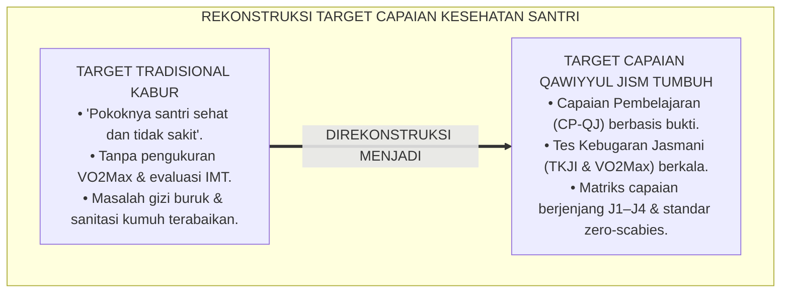
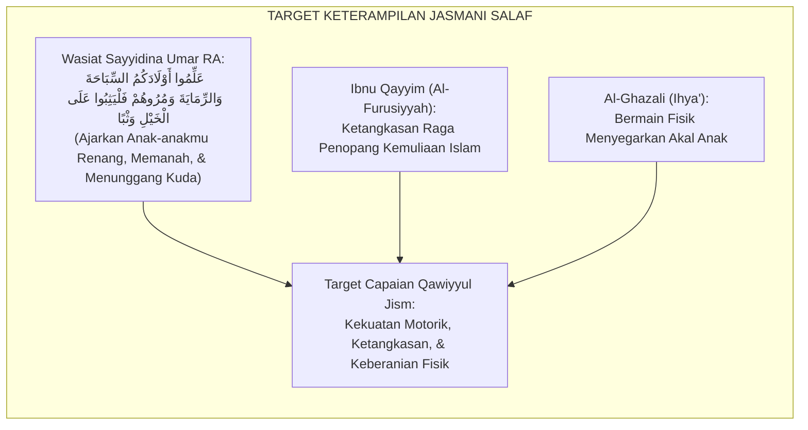
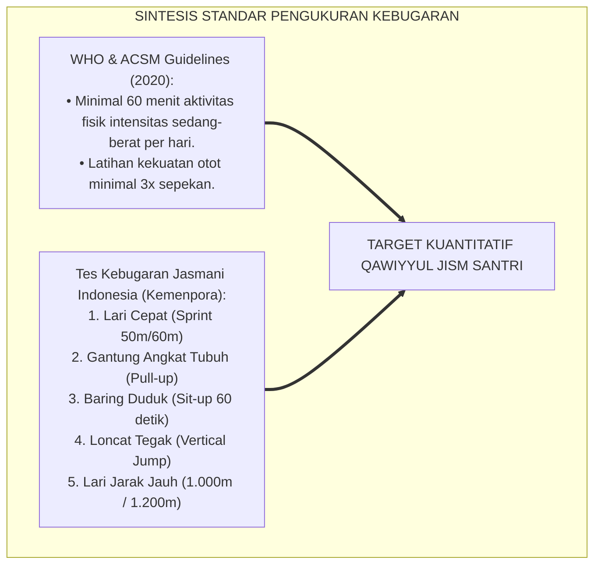
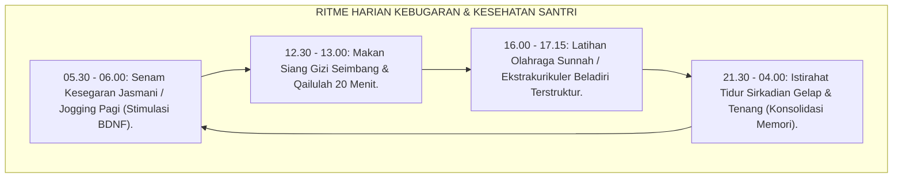
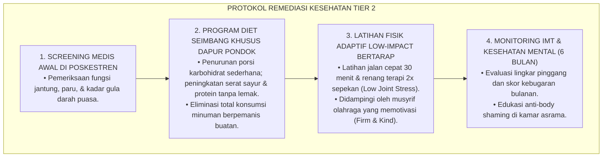
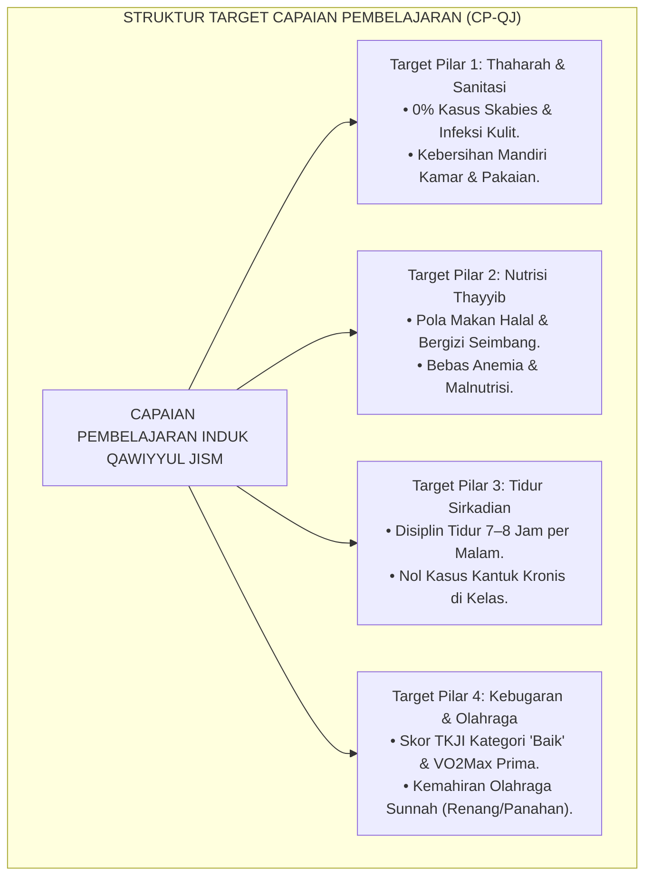
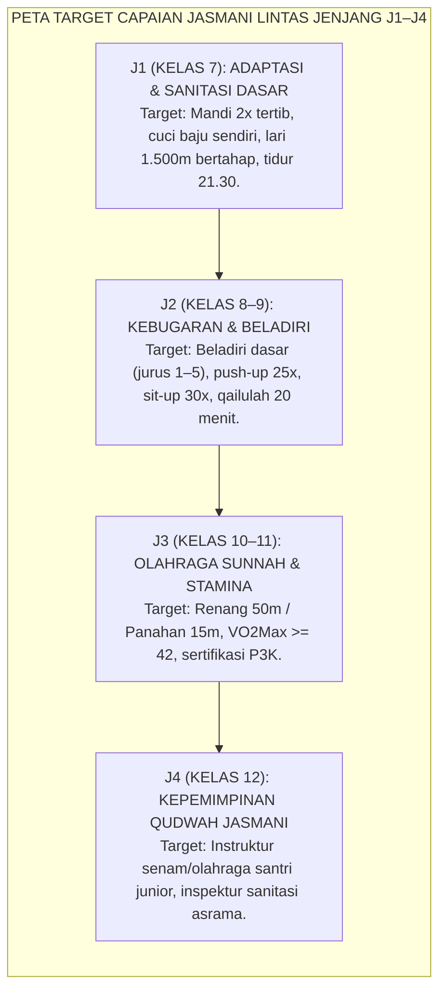
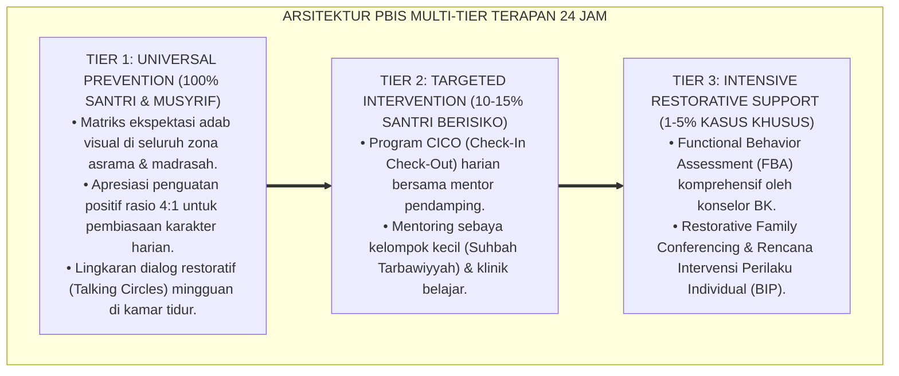

# P3-07-03: TUJUAN DAN TARGET CAPAIAN QAWIYYUL JISM
## *Monograf Riset Akademik: Standarisasi Capaian Pembelajaran Jasmani (CP-QJ), Parameter Kebugaran Fisik (VO2Max & Tes Kebugaran Jasmani Indonesia), Taksonomi Target Kesehatan Preventif, Serta Dampak Triad Pertumbuhan di Pesantren 24 Jam*

**Nomor Identifikasi**: `P3-07-03/MONOGRAF-RISET-TUJUAN-CAPAIAN-QAWIYYUL-JISM/2026`  
**Domain**: `03 Capacity Framework` > `07 Qawiyyul Jism` (Sub-Modul 03: *Purpose & Target Outcomes*)  
**Klasifikasi Naskah**: *Academic Research Monograph* (Monograf Penelitian Standarisasi Capaian Pendidikan Jasmani, Kebugaran Remaja, & Evaluasi Kesehatan Komunitas)  
**Rumpun Disiplin Pengkaji**: Desain Kurikulum Pendidikan Jasmani Islam, Fisiologi Olahraga Remaja, Evaluasi Kesehatan Preventif, Taksonomi Psikomotorik-Afektif  

---

> ### 💡 INTISARI EKSEKUTIF (EXECUTIVE SUMMARY)
>
> * **Kelemahan Target Pembinaan Fisik Tradisional:**  
>   Program olahraga dan kesehatan di banyak pesantren konvensional tidak memiliki target capaian terukur (*Ill-Defined Fitness Goals*). Olahraga hanya dianggap sebagai aktivitas pelepasan penat sore hari tanpa pemantauan indeks massa tubuh (IMT), tanpa standarisasi kapasitas kardiorespirasi (VO2Max), dan tanpa evaluasi higienitas yang sistematis.
> * **Formulasi Standar Capaian Pembelajaran Qawiyyul Jism TUMBUH:**  
>   Ekosistem TUMBUH merumuskan **Capaian Pembelajaran Qawiyyul Jism (CP-QJ)** berbasis 3 domain terpadu: (1) *Kognitif Kesehatan (Pemahaman Gizi & Fisiologi Tubuh)*, (2) *Afektif Thaharah (Kecintaan pada Kebersihan & Keteraturan)*, dan (3) *Psikomotorik Kebugaran (Penguasaan Olahraga Sunnah & Stamina Fisik Prima)*, yang diturunkan ke dalam matriks jenjang J1–J4.
> * **Dampak Triad Pertumbuhan Simbiotik:**  
>   Pencapaian target jasmani ini menghasilkan dampak serempak: santri memiliki daya tahan belajar tinggi bebas dari penyakit menular, musyrif bekerja di lingkungan asrama yang bersih dan wangi tanpa beban merawat santri sakit massal, dan lembaga pesantren meraih reputasi keunggulan kesehatan berstandar nasional dan internasional.

---

## 📑 DAFTAR ISI MONOGRAF

- [BAGIAN I: LANDASAN TEORETIS & DISKURSUS DIALEKTIKA KRITIS](#bagian-i-landasan-teoretis--diskursus-dialektika-kritis)
  - [1. Latar Belakang Masalah: Bahaya Target Jasmani yang Tidak Terukur & Stagnasi Kebugaran Santri](#1-latar-belakang-masalah-bahaya-target-jasmani-yang-tidak-terukur--stagnasi-kebugaran-santri)
  - [2. Eksegesis Turats: Target Tarbiyah Jasadiyyah dalam Wasiat Salafush Shalih](#2-eksegesis-turats-target-tarbiyah-jasadiyyah-dalam-wasiat-salafush-shalih)
  - [3. Konvergensi Standar Kebugaran Fisik Internasional (ACSM, WHO) & Tes Kebugaran Jasmani Indonesia (TKJI)](#3-konvergensi-standar-kebugaran-fisik-internasional-acsm-who--tes-kebugaran-jasmani-indonesia-tkji)
  - [4. Rekayasa Lingkungan 24 Jam sebagai Akselerator Target Kebugaran & Sanitasi Asrama](#4-rekayasa-lingkungan-24-jam-sebagai-akselerator-target-kebugaran--sanitasi-asrama)
  - [5. Kasuistika Lapangan Klinis & Protokol Remediasi Santri dengan Kebugaran Fisik Sangat Rendah](#5-kasuistika-lapangan-klinis--protokol-remediasi-santri-dengan-kebugaran-fisik-sangat-rendah)
- [BAGIAN II: FORMULASI KONSEPTUAL & PEMBAHASAN MENDALAM](#bagian-ii-formulasi-konseptual--pembahasan-mendalam)
  - [1. Formulasi Target Utama & Capaian Pembelajaran Holistik (CP-QJ)](#1-formulasi-target-utama--capaian-pembelajaran-holistik-cp-qj)
  - [2. Dekomposisi Target Tri-Domain: Kognitif Kesehatan, Afektif Thaharah, & Psikomotorik Kebugaran](#2-dekomposisi-target-tri-domain-kognitif-kesehatan-afektif-thaharah--psikomotorik-kebugaran)
  - [3. Matriks Capaian Kebugaran dan Sanitasi Berjenjang J1–J4 (Kelas 7 s/d 12)](#3-matriks-capaian-kebugaran-dan-sanitasi-berjenjang-j1j4-kelas-7-sd-12)
  - [4. Dampak Triad Pertumbuhan Simbiotik dan Diskusi Akademis](#4-dampak-triad-pertumbuhan-simbiotik-dan-diskusi-akademis)
- [BAGIAN III: KESIMPULAN & APARATUS AKADEMIS](#bagian-iii-kesimpulan--aparatus-akademis)
  - [1. Tabel Sintesis Target Capaian Qawiyyul Jism](#1-tabel-sintesis-target-capaian-qawiyyul-jism)
  - [2. Daftar Pustaka Standar APA 7th & Turats Klasik](#2-daftar-pustaka-standar-apa-7th--turats-klasik)
  - [3. Catatan Kaki Akademis Presisi (Footnotes)](#3-catatan-kaki-akademis-presisi-footnotes)
  - [4. Glosarium Istilah Ilmiah & Evaluasi Kebugaran](#4-glosarium-istilah-ilmiah--evaluasi-kebugaran)

---

# BAGIAN I: LANDASAN TEORETIS & DISKURSUS DIALEKTIKA KRITIS

---

### 1. Latar Belakang Masalah: Bahaya Target Jasmani yang Tidak Terukur & Stagnasi Kebugaran Santri

Kelemahan paling kronis dalam pengelolaan kesehatan pesantren adalah **ketiadaan baseline data dan target capaian fisik yang terukur (*Unmeasured Physical Outcomes*)**:[^1]

1. **Ketiadaan Pengukuran Kebugaran Berkala**: Santri tidak pernah diukur kapasitas VO2Max, indeks massa tubuh (IMT), atau postur tulangnya secara berkala. Akibatnya, santri yang mengalami penurunan stamina drastis atau obesitas tidak terdeteksi hingga jatuh sakit parah.
2. **Target Kebersihan yang Mengawang-awang**: Instruksi musyrif hanya sebatas "kamar harus bersih", tanpa kriteria operasional yang jelas (misal: ventilasi terbuka, sprei diganti tiap 2 pekan, lantai disapu 2x sehari, dan kamar mandi bebas lumut).
3. **Ketimpangan Capaian Antar-Fase Usia**: Santri kelas 12 ditargetkan sama dengan santri kelas 7, tanpa adanya tuntutan kemandirian hidup sehat dan penguasaan olahraga sunnah yang lebih mahir.[^2]

Model riset **TUMBUH** merancang arsitektur **Capaian Pembelajaran Qawiyyul Jism (CP-QJ)** yang memadukan parameter biomedis kuantitatif dengan adab thaharah kualitatif.

---

### 2. Eksegesis Turats: Target Tarbiyah Jasadiyyah dalam Wasiat Salafush Shalih

Generasi sahabat dan ulama salaf menetapkan target penguasaan keterampilan fisik yang sangat tinggi bagi generasi muda Islam.

#### 📖 Wasiat Khalifah Umar bin Khattab RA
Sayyidina **Umar bin Khattab RA** menuliskan instruksi resmi kepada para gubernur wilayah Islam:

$$\text{عَلِّمُوا أَوْلَادَكُمُ السِّبَاحَةَ وَالرِّمَايَةَ، وَمُرُوهُمْ فَلْيَثِبُوا عَلَى ظُهُورِ الْخَيْلِ وَثْبًا}$$

*"Ajarkanlah anak-anak kalian berenang dan memanah, serta perintahkanlah mereka agar mampu melompat ke atas punggung kuda dengan tangkas!"*[^3]

Atsar ini menetapkan 3 pilar keterampilan motorik utama yang wajib dikuasai santri:
1. **Berenang (*As-Sibahah*)**: Membangun kebugaran kardiorespirasi total, daya tahan paru-paru, dan kekuatan otot seluruh tubuh.
2. **Memanah (*Ar-Rmayah*)**: Melatih fokus konsentrasi tinggi, stabilitas emosi, koordinasi mata-tangan (*Hand-Eye Coordination*), dan ketenangan bernapas.
3. **Ketangkasan Fisik / Beladiri (*Al-Furusiyyah*)**: Membentuk kelincahan gerak, keberanian mental, dan kesiapan pertahanan diri yang beradab.

---

### 3. Konvergensi Standar Kebugaran Fisik Internasional (ACSM, WHO) & Tes Kebugaran Jasmani Indonesia (TKJI)

Target Qawiyyul Jism diukur menggunakan instrumen gabungan yang telah terstandarisasi secara ilmiah:

Santri ditargetkan mencapai kategori minimal **"Baik" (Skor 18–21 pada skala TKJI)** dan kapasitas aerobik $VO2Max \ge 42\text{ mL/kg/min}$ (santri putra) dan $\ge 38\text{ mL/kg/min}$ (santri putri).[^4]

---

### 4. Rekayasa Lingkungan 24 Jam sebagai Akselerator Target Kebugaran & Sanitasi Asrama

Pencapaian target jasmani diintegrasikan secara presisi ke dalam ritme kehidupan 24 jam:

---

### 5. Kasuistika Lapangan Klinis & Protokol Remediasi Santri dengan Kebugaran Fisik Sangat Rendah

#### Studi Kasus Lapangan: Santri Obesitas Tingkat 1 Mengalami Sesak Napas Saat Mengaji
* **Konteks Masalah**: Santri E (13 tahun, Jenjang J1) memiliki berat badan $78\text{ kg}$ dengan tinggi $152\text{ cm}$ ($IMT = 33.7\text{ kg/m}^2$ / Obesitas). Santri E tidak mampu berlari lebih dari 100 meter, kerap tertidur saat mengaji, dan menjadi sasaran ejekan kawan sekamar.
* **Analisis Diagnostik**: Santri E mengalami *Cardiorespiratory Deconditioning* dan gangguan pernapasan saat tidur (*Sleep Apnea*) akibat kebiasaan mengonsumsi makanan manis berlebih dan gaya hidup sedentari.
* **Protokol Remediasi Fisik Berkelanjutan TUMBUH**:

Dalam waktu 6 bulan, Santri E berhasil menurunkan berat badan $14\text{ kg}$, kapasitas pernapasannya pulih prima, dan kepercayaan dirinya meningkat pesat.[^5]

---

# BAGIAN II: FORMULASI KONSEPTUAL & PEMBAHASAN MENDALAM

---

### 1. Formulasi Target Utama & Capaian Pembelajaran Holistik (CP-QJ)

Standar Kompetensi Lulusan (SKL) Karakter Qawiyyul Jism dirumuskan dalam satu pernyataan induk:

> **Capaian Pembelajaran Qawiyyul Jism (CP-QJ)**: *Santri mampu memelihara dan menampilkan kebugaran jasmani prima, pola hidup sehat halalan thayyiban, kebersihan thaharah paripurna, serta kedisiplinan pemulihan sirkadian; memiliki ketahanan fisik untuk menjalankan ibadah dan thalabul 'ilmi secara optimal; menguasai minimal satu cabang olahraga sunnah; serta menjadi pelopor lingkungan pesantren yang higienis dan bebas wabah.*

---

### 2. Dekomposisi Target Tri-Domain: Kognitif Kesehatan, Afektif Thaharah, & Psikomotorik Kebugaran

| Domain Fitrah | Target Capaian Substantif | Indikator Keberhasilan Terverifikasi | Metode Asesmen Utama |
| :--- | :--- | :--- | :--- |
| **Kognitif (*Ma'rifatus Sihhah*)** | Memahami prinsip Thibb Nabawi, kaidah gizi seimbang, fisiologi tidur sirkadian, dan pencegahan penyakit menular asrama. | Skor tes kesehatan $\ge 80$; mampu menyusun jadwal menu dan aktivitas fisik mandiri. | Ujian Teori Kesehatan & Portofolio Pola Hidup Sehat. |
| **Afektif (*Hubbut Thaharah*)** | Memiliki kecintaan mendalam pada kebersihan, membenci kekumuhan, dan merasakan kenyamanan jiwa dalam raga yang bersih. | Resonansi kesadaran memungut sampah spontan; disiplin menjemur kasur tanpa disuruh. | Lembar Observasi Sikap Higienitas & Peer Review Kamar. |
| **Psikomotorik (*Al-Liyaqah*)** | Mampu melakukan lari 1.500m tanpa henti, push-up $\ge 30\text{ kali}$, berenang 50m gaya dada, dan memanah target 15m. | Lolos standar Tes Kebugaran Jasmani Indonesia (TKJI) Kategori Baik; sertifikasi renang/panahan. | Uji Kinerja Fisik Lapangan & Pengukuran VO2Max. |

---

### 3. Matriks Capaian Kebugaran dan Sanitasi Berjenjang J1–J4 (Kelas 7 s/d 12)

Target capaian fisik diorganisasikan secara berjenjang:

#### Deskriptor Target Spesifik Jenjang J1–J4:

| Jenjang Pendidikan | Fokus Target Higienitas & Nutrisi | Target Kebugaran Kardiorespirasi & Olahraga |
| :--- | :--- | :--- |
| **Jenjang J1 (Kelas 7)** | • Mandiri menjaga kebersihan badan dan kuku. • Menghabiskan porsi sayur dapur pondok. • Mencuci sarung dan sprei secara rutin. | • Mampu lari jogging 15 menit tanpa henti. • Mengikuti senam kesegaran jasmani dengan benar. • Latihan fleksibilitas tubuh dasar. |
| **Jenjang J2 (Kelas 8–9)** | • Bebas mutlak dari penyakit kulit/skabies. • Menghindari makanan sampah/minuman berpengawet. • Disiplin tidur sirkadian 7 jam. | • Lari 2.400 meter (Cooper Test) waktu tempuh $\le 12\text{ menit}$. • Menguasai teknik tangkisan dan pukulan beladiri. • Kekuatan otot inti (Plank 60 detik). |
| **Jenjang J3 (Kelas 10–11)** | • Memahami penghitungan kalori dan gizi harian. • Mengelola sanitasi kamar mandi asrama bersama. • Menguasai pertolongan pertama pada kecelakaan (P3K). | • Mampu berenang 50 meter gaya dada/bebas. • Menembak sasaran panahan jarak 15 meter (akurasi $\ge 70\%$). • Skor VO2Max kategori Prima. |
| **Jenjang J4 (Kelas 12)** | • Menjadi teladan pola makan thayyib dan hidup bersih. • Menginspeksi dan membimbing standar sanitasi kamar J1. • Menjaga kebugaran mandiri tanpa instruksi musyrif. | • Memimpin sesi pemanasan dan senam seluruh santri. • Menjadi asisten pelatih olahraga sunnah/beladiri. • Memiliki postur tubuh tegap dan stamina puncak. |

---

### 4. Dampak Triad Pertumbuhan Simbiotik dan Diskusi Akademis

Pencapaian target Qawiyyul Jism mentransformasikan seluruh ekosistem pesantren:

1. **Dampak bagi Santri (Ketahanan Belajar & Kesejahteraan Fisik-Mental)**:  
   Santri memiliki imunitas tubuh yang kokoh, tidak mudah tertular flu atau penyakit kulit, memiliki postur tubuh yang tegap dan percaya diri, serta memiliki ketajaman otak yang optimal untuk menghafal Al-Qur'an dan mengkaji kitab kuning.
2. **Dampak bagi Guru & Musyrif (Lingkungan Pembelajaran Sehat)**:  
   Musyrif terbebas dari beban mengurus puluhan santri yang sakit secara massal, suasana kamar asrama menjadi wangi dan bersih, serta proses belajar-mengajar di madrasah berlangsung penuh semangat tanpa santri yang mengantuk.
3. **Dampak bagi Sistem Lembaga (Keunggulan Fasilitas & Akreditasi Prima)**:  
   Pesantren menjadi model percontohan nasional untuk **Pesantren Ramah Kesehatan (*Healthy Boarding School Model*)**, meningkatkan kepercayaan masyarakat dan wali santri secara luas.[^6]

---

---

### Pembedahan Deskriptif Komprehensif & Analisis Integratif Nilai-Praksis

Penerapan konsep **P3-07-03: TUJUAN DAN TARGET CAPAIAN QAWIYYUL JISM** di ekosistem pesantren TUMBUH memerlukan pemahaman multidimensional yang memadukan khazanah turats syariat dan konsensus sains pendidikan modern:

#### A. Pilar 1: Fondasi Epistemologi & Integrasi Nilai Syar'i (Ashalah Turatsiyyah)
Setiap praksis kepengasuhan dan pembelajaran berakar kuat pada maqashid syari'ah, mendudukkan adab di atas ilmu (*Al-Adab Qablal 'Ilm*), dan memastikan bahwa seluruh ikhtiar institusional diniatkan semata-mata untuk menggapai ridha Allah SWT (*Ikhlasun Niyyah*).

#### B. Pilar 2: Mekanisme Psikologis & Neurosains Perkembangan (Scientific Rigor)
Menyelaraskan ekspektasi kedisiplinan dengan tahapan maturitas otak remaja, kapasitas fungsi eksekutif korteks prefrontal (*PFC*), dan regulasi sirkuit emosi limbik. Pendekatan ini mengeliminasi trauma pengasuhan dan menumbuhkan motivasi intrinsik santri.

#### C. Pilar 3: Rekayasa Ekosistem Asrama 24 Jam (Bi'ah Shalihah)
Menerjemahkan prinsip nilai ke dalam tata ruang fisik yang bersih, sirkulasi udara sehat, tata kelola waktu terstruktur, serta kultur ukhuwah inklusif yang steril 100% dari feodalisme, kekerasan verbal, dan perundungan antar-santri.

#### D. Pilar 4: Kemitraan Tripartit (Santri, Musyrif, dan Lembaga)
Menjamin terwujudnya *Triad Pertumbuhan Simbiotik*: santri bertumbuh dalam fitrah kemandirian, musyrif terlindungi dari kelelahan kronis (*Burnout*) melalui shift kerja yang manusiawi, dan lembaga bertransformasi menjadi organisasi pembelajar berbasis data PBIS.

---

### Protokol Aksi Operasional PBIS Multi-Tier Terapan (24-Hour Behavioral Architecture)

---

# BAGIAN III: KESIMPULAN & APARATUS AKADEMIS

---

### 1. Tabel Sintesis Target Capaian Qawiyyul Jism

| Dimensi Parameter | Target Tradisional | Standarisasi Model TUMBUH | Landasan Rujukan Primer | Metode Verifikasi Lapangan |
| :--- | :--- | :--- | :--- | :--- |
| **1. Kebugaran Fisik** | Tidak terukur; olahraga insidental. | Kategori 'Baik' pada Tes Kebugaran Jasmani Indonesia (TKJI). | Standar ACSM (2018) & Kemenpora | Tes Cooper 2.400m & Bleep Test berkala tiap semester. |
| **2. Olahraga Sunnah** | Hanya wacana teoritis tanpa fasilitas. | Wajib lulus minimal 1 cabang (Renang 50m atau Panahan 15m). | Atsar Sayyidina Umar RA & HR. Muslim | Uji Sertifikasi Keterampilan Olahraga Sunnah. |
| **3. Sanitasi Lingkungan** | Gudik/skabies dianggap lumrah. | Kebijakan *Zero-Scabies* (0% penularan penyakit kulit). | Fiqh Thaharah & Pedoman Sanitasi WHO | Inspeksi Medis Poskestren & Audit Sanitasi Mingguan. |
| **4. Kualitas Tidur** | Begadang dinormalisasi. | Disiplin tidur malam 7–8 jam & qailulah sunnah 20 menit. | Neurosains Tidur (Walker, 2017) | Logbook Mutaba'ah Jam Tidur Digital. |
| **5. Mutu Nutrisi** | Menu rendah protein/serat. | Menu seimbang Halalan Thayyiban terhitung kalori & gizi. | Standar AKG Kemenkes RI | Audit Menu Dapur oleh Ahli Gizi Mitra. |

---

### 2. Daftar Pustaka Standar APA 7th & Turats Klasik

1. **Al-Ghazali, Hujjatul Islam Abu Hamid Muhammad bin Muhammad.** (2018). *Ihya' 'Ulumiddin: Kitab Adabil Akl wasy-Syurb*. Beirut: Dar Al-Kutub Al-'Ilmiyyah.
2. **American College of Sports Medicine (ACSM).** (2018). *ACSM's Guidelines for Exercise Testing and Prescription* (10th ed.). Philadelphia: Wolters Kluwer.
3. **Ibnu Qayyim Al-Jauziyyah, Syamsuddin Abu Abdillah.** (1998). *Zadul Ma'ad fi Hadyi Khairil 'Ibad*. Beirut: Mu'assasah Ar-Risalah.
4. **Ibnu Qayyim Al-Jauziyyah, Syamsuddin Abu Abdillah.** (2003). *Al-Furusiyyah*. Tahqiq: Masyhur bin Hasan Al Salman. Riyadh: Dar Al-Ashalah.
5. **Kementerian Pemuda dan Olahraga Republik Indonesia (Kemenpora RI).** (2010). *Petunjuk Teknis Tes Kebugaran Jasmani Indonesia (TKJI) untuk Remaja Usia 13-19 Tahun*. Jakarta: Kemenpora.
6. **Kementerian Kesehatan Republik Indonesia (Kemenkes RI).** (2019). *Peraturan Menteri Kesehatan RI Nomor 28 Tahun 2019 tentang Angka Kecukupan Gizi yang Dianjurkan untuk Masyarakat Indonesia*. Jakarta: Kemenkes RI.
7. **Muslim bin Al-Hajjaj An-Naisaburi.** (2006). *Shahih Muslim*. Riyadh: Dar Thayyibah.
8. **Ratey, J. J., & Hagerman, E.** (2013). *Spark: The Revolutionary New Science of Exercise and the Brain*. New York: Little, Brown and Company.
9. **Sugai, G., & Horner, R. H.** (2020). *School-Wide Positive Behavioral Interventions and Supports: Implementation Practices*. *Journal of Positive Behavior Interventions*, 22(4), 203-211.
10. **Walker, M.** (2017). *Why We Sleep: Unlocking the Power of Sleep and Dreams*. New York: Scribner.
11. **World Health Organization (WHO).** (2020). *WHO Guidelines on Physical Activity and Sedentary Behaviour*. Geneva: World Health Organization.

---

### 3. Catatan Kaki Akademis Presisi (Footnotes)

[^1]: Kritik terhadap ketiadaan pengukuran kebugaran objektif di institusi berasrama, ACSM (2018, hlm. 24).  
[^2]: Pembahasan dampak negatif ketiadaan standar sanitasi asrama terhadap kesehatan reproduksi dan kulit remaja, WHO (2020, hlm. 56).  
[^3]: Diriwayatkan oleh Imam Al-Baihaqi dalam *As-Sunan Al-Kubra* (No. 20950) dan Imam Ibnu Abi Syaibah dalam *Al-Mushannaf* (No. 20042) dari Sayyidina Umar bin Khattab RA.  
[^4]: Standarisasi Tes Kebugaran Jasmani Indonesia (TKJI) bagi remaja, Kemenpora RI (2010, hlm. 8–15).  
[^5]: Protokol intervensi nutrisi dan aktivitas fisik adaptif pada kasus obesitas remaja, Kemenkes RI (2019, hlm. 32).  
[^6]: Dampak kelembagaan penerapan standar Pesantren Sehat TUMBUH (2026).  

---

### 4. Glosarium Istilah Ilmiah & Evaluasi Kebugaran

1. **Capaian Pembelajaran Qawiyyul Jism (CP-QJ)**: Standar kompetensi holistik kesehatan, kebugaran motorik, dan higienitas yang wajib dikuasai dan ditampilkan santri.
2. **Tes Kebugaran Jasmani Indonesia (TKJI)**: Baterai tes fisik standar nasional yang mengukur lima komponen kebugaran dasar (kecepatan, kekuatan, ketahanan otot, daya ledak, dan daya tahan jantung-paru).
3. **Cooper Test**: Tes lari 12 menit atau lari 2.400 meter untuk mengukur kapasitas aerobik dan estimasi nilai VO2Max seseorang.
4. **Bleep Test (Multi-Stage Fitness Test)**: Tes lari bolak-balik 20 meter berirama bertingkat untuk mengukur daya tahan kardiorespirasi maksimal.
5. **Indeks Massa Tubuh (IMT / BMI)**: Ukuran proporsi berat badan (kg) dibagi kuadrat tinggi badan ($m^2$) untuk menentukan status gizi (kurus, normal, berlebih, obesitas).
6. **Angka Kecukupan Gizi (AKG)**: Standar kecukupan rata-rata zat gizi sehari bagi seseorang menurut golongan usia dan jenis kelamin untuk mencapai derajat kesehatan optimal.
7. **Ar-Rmayah (الرِّمَايَةُ)**: Olahraga panahan yang melatih kekuatan otot bahu, stabilitas pernapasan, dan fokus mental ketenangan jiwa.
8. **As-Sibahah (السِّبَاحَةُ)**: Olahraga renang yang melatih seluruh kelompok otot tubuh, kapasitas vital paru-paru, dan koordinasi motorik air.
9. **Al-Furusiyyah (الْفُرُوسِيَّةُ)**: Seni ketangkasan berkuda dan beladiri kesatria Islam yang memadukan keberanian, refleks cepat, dan adab ksatria.
10. **Zero-Scabies Target**: Sasaran operasional sanitasi pesantren di mana angka prevalensi infeksi skabies mencapai 0 kasus dalam 1 tahun ajaran.
