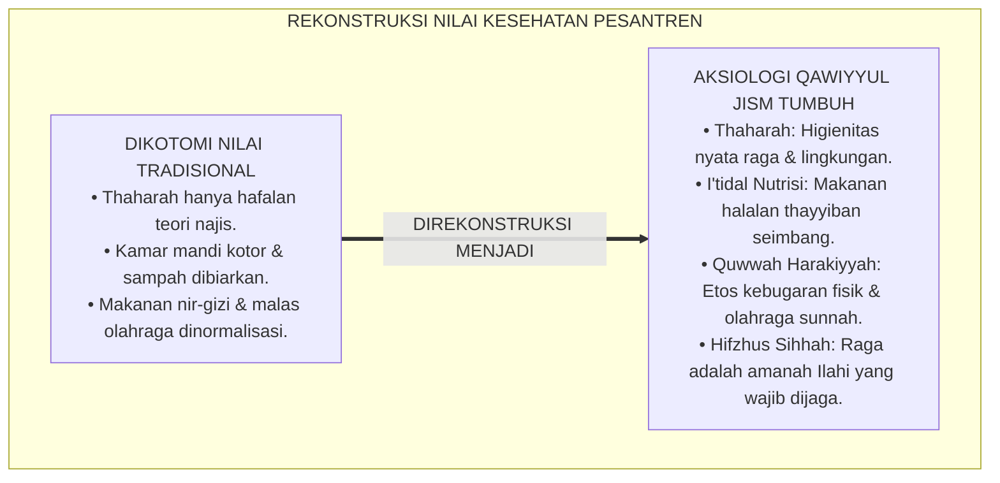
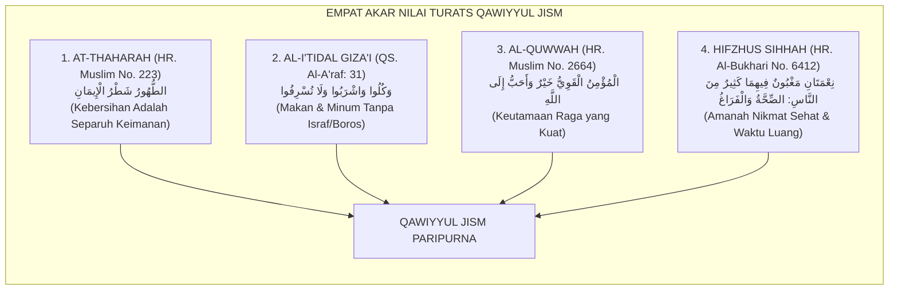
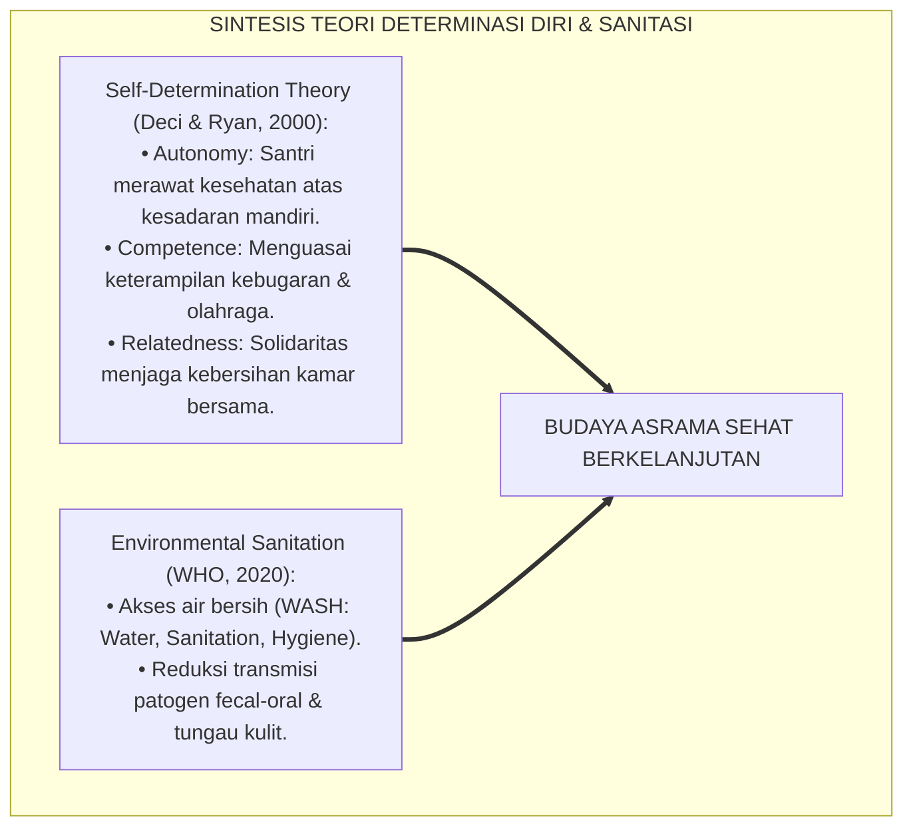
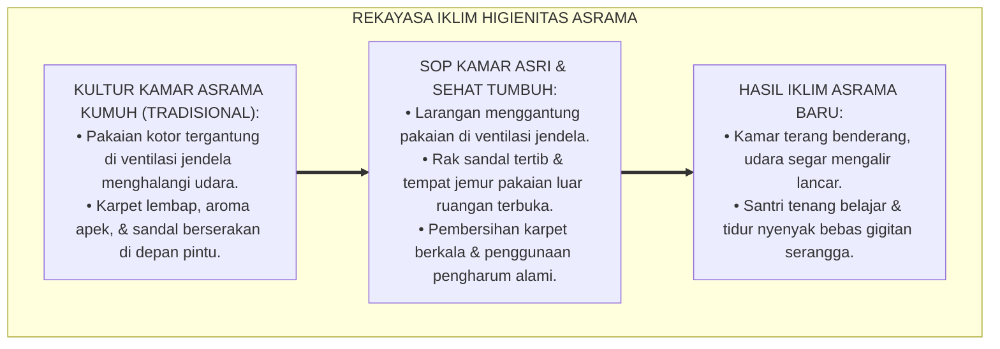
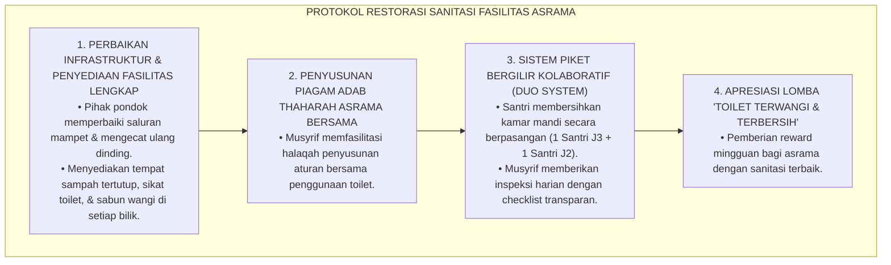
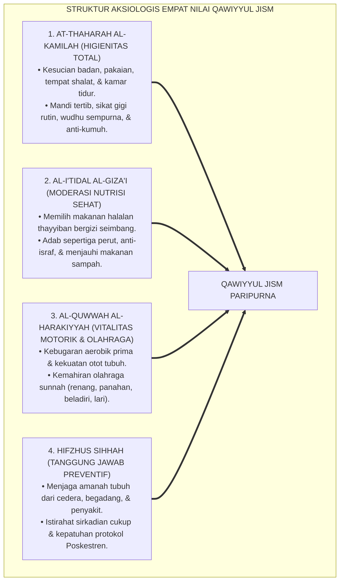
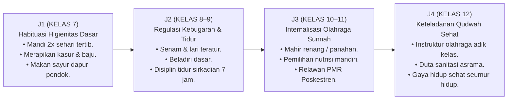
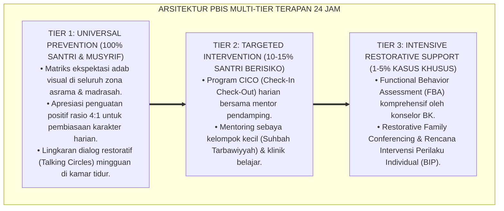

# P3-07-04: NILAI INTI DAN PRINSIP KESEHATAN QAWIYYUL JISM
## *Monograf Riset Akademik: Aksiologi Kesehatan Islam, Empat Nilai Inti Jasmani (Thaharah, I'tidal Nutrisi, Quwwah Harakiyyah, & Hifzhus Sihhah), Dialektika Asketisme vs Pemuliaan Raga, Serta Etika Kebersihan Ekologis di Pesantren 24 Jam*

**Nomor Identifikasi**: `P3-07-04/MONOGRAF-RISET-NILAI-PRINSIP-QAWIYYUL-JISM/2026`  
**Domain**: `03 Capacity Framework` > `07 Qawiyyul Jism` (Sub-Modul 04: *Core Values & Health Principles*)  
**Klasifikasi Naskah**: *Academic Research Monograph* (Monograf Penelitian Aksiologi Nilai Kesehatan Islam, Etika Biomedis Pesantren, & Ekologi Sanitasi)  
**Rumpun Disiplin Pengkaji**: Aksiologi Islam Terapan, Fiqh Thaharah & Ekologi, Etika Biomedis Pesantren, Sosiologi Kesehatan Komunitas  

---

> ### 💡 INTISARI EKSEKUTIF (EXECUTIVE SUMMARY)
>
> * **Distorsi Aksiologis Nilai Tubuh dalam Budaya Asrama:**  
>   Kerap terjadi kerancuan nilai di lingkungan pesantren: di satu sisi, kesucian batin dijunjung tinggi; namun di sisi lain, kebersihan fisik fasilitas bersama (kamar mandi berlumut, tumpukan pakaian kotor di kamar tidur, dan pembuangan sampah sembarangan) dianggap sebagai "hal sepele yang tidak berdosa". Kerancuan ini mencerminkan keterbelahan aksiologi antara kesucian spiritual dan higienitas material.
> * **Empat Nilai Inti Qawiyyul Jism TUMBUH:**  
>   Ekosistem TUMBUH menetapkan **Empat Nilai Inti Kesehatan Jasmani (*Al-Qiyam al-Arba'ah lis-Sihhah*)**: (1) *At-Thaharah al-Kamilah* (Kesucian & Kebersihan Holistik Raga-Lingkungan), (2) *Al-I'tidal al-Giza'i* (Moderasi Nutrisi Halalan Thayyiban & Anti-Israf), (3) *Al-Quwwah al-Harakiyyah* (Etos Vitalitas Gerak & Ketangkasan Motorik), dan (4) *Hifzhus Sihhah* (Tanggung Jawab Preventif Memelihara Amanah Tubuh).
> * **Harmonisasi Nilai dalam Triad Pertumbuhan:**  
>   Nilai-nilai ini mengikat seluruh warga pesantren: santri memelihara kebersihan diri sebagai cermin iman (*Syathrul Iman*), musyrif menjadi teladan hidup sehat (*Qudwah*), dan lembaga menyediakan infrastruktur sanitasi yang bersih, terawat, dan ramah lingkungan.

---

## 📑 DAFTAR ISI MONOGRAF

- [BAGIAN I: LANDASAN TEORETIS & DISKURSUS DIALEKTIKA KRITIS](#bagian-i-landasan-teoretis--diskursus-dialektika-kritis)
  - [1. Latar Belakang Masalah: Bahaya Dikotomi Kesucian Batin vs Kekumuhan Fisik Lahiriah](#1-latar-belakang-masalah-bahaya-dikotomi-kesucian-batin-vs-kekumuhan-fisik-lahiriah)
  - [2. Eksegesis Turats: Kajian Mendalam Empat Pilar Nilai Kesehatan Nabawiyyah](#2-eksegesis-turats-kajian-mendalam-empat-pilar-nilai-kesehatan-nabawiyyah)
  - [3. Konvergensi Sains Kesehatan Lingkungan & Teori Determinasi Diri (SDT)](#3-konvergensi-sains-kesehatan-lingkungan--teori-determinasi-diri-sdt)
  - [4. Analisis Rekayasa Lingkungan 24 Jam: Dari 'Kamar Bau' Menuju 'Kamar Wangi & Sehat'](#4-analisis-rekayasa-lingkungan-24-jam-dari-kamar-bau-menuju-kamar-wangi--sehat)
  - [5. Kasuistika Lapangan Klinis & Protokol Resolusi Krisis Kebersihan Kamar Mandi Asrama](#5-kasuistika-lapangan-klinis--protokol-resolusi-krisis-kebersihan-kamar-mandi-asrama)
- [BAGIAN II: FORMULASI KONSEPTUAL & PEMBAHASAN MENDALAM](#bagian-ii-formulasi-konseptual--pembahasan-mendalam)
  - [1. Eksplanasi Teoretis Empat Nilai Inti Qawiyyul Jism](#1-eksplanasi-teoretis-empat-nilai-inti-qawiyyul-jism)
  - [2. Matriks Dialektika: Membedakan Nilai Sejati vs Distorsi Perilaku Jasmani](#2-matriks-dialektika-membedakan-nilai-sejati-vs-distorsi-perilaku-jasmani)
  - [3. Matriks Progresi Internalisasi Nilai Kesehatan Jenjang J1–J4](#3-matriks-progresi-internalisasi-nilai-kesehatan-jenjang-j1j4)
  - [4. Diskusi Akademis: Implikasi Aksiologis bagi Kebijakan 'Green & Healthy Pesantren'](#4-diskusi-akademis-implikasi-aksiologis-bagi-kebijakan-green--healthy-pesantren)
- [BAGIAN III: KESIMPULAN & APARATUS AKADEMIS](#bagian-iii-kesimpulan--aparatus-akademis)
  - [1. Tabel Sintesis Nilai Inti & Prinsip Qawiyyul Jism](#1-tabel-sintesis-nilai-inti--prinsip-qawiyyul-jism)
  - [2. Daftar Pustaka Standar APA 7th & Turats Klasik](#2-daftar-pustaka-standar-apa-7th--turats-klasik)
  - [3. Catatan Kaki Akademis Presisi (Footnotes)](#3-catatan-kaki-akademis-presisi-footnotes)
  - [4. Glosarium Istilah Ilmiah & Aksiologi Kesehatan](#4-glosarium-istilah-ilmiah--aksiologi-kesehatan)

---

# BAGIAN I: LANDASAN TEORETIS & DISKURSUS DIALEKTIKA KRITIS

---

### 1. Latar Belakang Masalah: Bahaya Dikotomi Kesucian Batin vs Kekumuhan Fisik Lahiriah

Salah satu anomali paling memprihatinkan dalam kultur asrama tradisional adalah **pemisahan antara nilai thaharah syariat dengan etika kebersihan empiris (*Spiritual-Material Hygiene Disconnect*)**:[^1]

1. **Formalisme Fiqh Tanpa Higienitas**: Santri hafal rincian air dua qullah dan jenis-jenis najis, namun membiarkan bak mandi berlumut tebal, tidak menyiram toilet dengan bersih pasca-buang air (*Istinja' Deficit*), dan menumpuk pakaian kotor lembap di bawah ranjang.
2. **Normalisasi Gaya Hidup Israf (Boros) & Makanan Nir-Gizi**: Pola konsumsi yang didominasi mie instan berpengawet, gorengan minyak jelantah, dan minuman manis berlebih dibiarkan atas nama "kebersamaan santri", melanggar perintah Al-Qur'an tentang *Halalan Thayyiban* dan larangan *Israf* (berlebih-lebihan).
3. **Ketidakpedulian Terhadap Kebugaran Motorik (*Physical Passivity*)**: Sikap malas berolahraga atau menolak aktivitas fisik dianggap sebagai hal lumrah, padahal kelemahan fisik secara langsung memperlemah ketahanan belajar dan kekhusyukan qiyamul lail.[^2]

Model riset **TUMBUH** merekonstruksi aksiologi nilai kesehatan: **kebersihan raga, makanan bergizi, dan kebugaran fisik adalah bagian integral dari keimanan (*Iman in Action*)**.

---

### 2. Eksegesis Turats: Kajian Mendalam Empat Pilar Nilai Kesehatan Nabawiyyah

Empat nilai inti kesehatan jasmani berakar kuat pada nash-nash sharih Al-Qur'an dan Sunnah:

#### 📖 1. Nilai At-Thaharah al-Kamilah (Kesucian & Kebersihan Holistik)
Rasulullah SAW bersabda dalam Hadits Shahih Muslim dari Abu Malik Al-Asy'ari RA:

$$\text{الطُّهُورُ شَطْرُ الْإِيمَانِ}$$

*"Kesucian/kebersihan (Ath-Thuhur) itu adalah separuh dari keimanan."* (HR. Muslim No. 223).[^3]

Imam **Al-Ghazali** dalam *Ihya'* menjelaskan bahwa *Thaharah* memiliki empat tingkatan: (1) Menyucikan raga lahiriah dari hadats, najis, dan kotoran; (2) Menyucikan anggota tubuh dari maksiat; (3) Menyucikan kalbu dari akhlak tercela; dan (4) Menyucikan rahasia batin dari selain Allah. Tingkat pertama adalah fondasi bagi seluruh tingkat berikutnya.[^4]

#### 📖 2. Nilai Al-I'tidal al-Giza'i (Keseimbangan Nutrisi Halalan Thayyiban)
Allah SWT berfirman dalam QS. Al-A'raf [7]: 31:

$$\text{يَا بَنِي آدَمَ خُذُوا زِينَتَكُمْ عِنْدَ كُلِّ مَسْجِدٍ وَكُلُوا وَاشْرَبُوا وَلَا تُسْرِفُوا ۚ إِنَّهُ لَا يُحِبُّ الْمُسْرِفِينَ}$$

*"Wahai anak cucu Adam, pakailah pakaianmu yang bagus pada setiap (memasuki) masjid, makan dan minumlah kalian, dan janganlah berlebih-lebihan. Sesungguhnya Allah tidak menyukai orang-orang yang berlebih-lebihan."*[^5]

#### 📖 3. Nilai Hifzhus Sihhah (Tanggung Jawab Menjaga Amanah Tubuh)
Rasulullah SAW bersabda mengenai nikmat kesehatan dalam Hadits Shahih Al-Bukhari:

$$\text{نِعْمَتَانِ مَغْبُونٌ فِيهِمَا كَثِيرٌ مِنَ النَّاسِ: الصِّحَّةُ وَالْفَرَاغُ}$$

*"Dua kenikmatan yang banyak manusia tertipu (merugi dan lalai) di dalamnya adalah: **kesehatan (Ash-Shihhah) dan waktu luang (Al-Faragh)**."* (HR. Al-Bukhari No. 6412).[^6]

---

### 3. Konvergensi Sains Kesehatan Lingkungan & Teori Determinasi Diri (SDT)

Penerapan nilai-nilai kesehatan jasmani diselaraskan dengan teori motivasi intrinsik dan sains sanitasi:

1. **Teori Penentuan Diri (*Self-Determination Theory*)**:  
   Pembiasaan hidup bersih tidak boleh ditegakkan dengan ancaman hukuman (*Controlled Motivation*), melainkan ditumbuhkan melalui kepuasan psikologis santri yang merasakan betapa nyamannya hidup di kamar yang wangi, terang, dan rapi (*Autonomous Motivation*).[^7]
2. **Standar WASH (Water, Sanitation, Hygiene) WHO**:  
   Ketersediaan sabun di setiap wastafel, air mengalir yang memenuhi uji mikrobiologis laboratorium, dan toilet yang selalu wangi adalah hak dasar kesehatan santri.[^8]

---

### 4. Analisis Rekayasa Lingkungan 24 Jam: Dari 'Kamar Bau' Menuju 'Kamar Wangi & Sehat'

Penanaman nilai kesehatan menuntut penataan budaya visual dan penciuman (*Aromatherapy & Visual Order*) di asrama:

---

### 5. Kasuistika Lapangan Klinis & Protokol Resolusi Krisis Kebersihan Kamar Mandi Asrama

#### Studi Kasus Lapangan: Krisis Sanitasi Kamar Mandi yang Mengalami Vandalisme dan Kerusakan Saluran Air
* **Konteks Masalah**: Di sebuah kompleks asrama putra jenjang J2, toilet asrama kerap mampet karena santri membuang sampah plastik kemasan sampo ke dalam kloset, dinding kamar mandi penuh coretan, dan tidak ada santri yang mau membersihkannya saat jadwal piket.
* **Analisis Diagnostik**: Terjadi *Tragedy of the Commons* (karena menjadi milik bersama, tidak ada yang merasa bertanggung jawab merawatnya) yang diperparah oleh ketiadaan sarana tempat sampah tertutup dan alat pembersih yang memadai.
* **Protokol Resolusi Restoratif TUMBUH**:

Intervensi terpadu ini berhasil mengubah toilet asrama dari area yang dihindari menjadi fasilitas yang bersih, wangi, dan terawat secara mandiri oleh santri.[^9]

---

# BAGIAN II: FORMULASI KONSEPTUAL & PEMBAHASAN MENDALAM

---

### 1. Eksplanasi Teoretis Empat Nilai Inti Qawiyyul Jism

Empat nilai inti kesehatan jasmani diartikulasikan secara mendalam:

---

### 2. Matriks Dialektika: Membedakan Nilai Sejati vs Distorsi Perilaku Jasmani

| Nilai Inti Syar'i | Nilai Sejati (*Al-Haqq*) | Distorsi Berlebih (*Al-Ghuluww / Ifrath*) | Distorsi Kurang (*At-Tafrih / Tafrith*) |
| :--- | :--- | :--- | :--- |
| **At-Thaharah (Higienitas)** | Menjaga kebersihan diri dan lingkungan secara proporsional, wajar, dan teratur. | Perilaku was-was berlebihan (*Obsessive-Compulsive Waswas*) saat berwudhu hingga membuang air sia-sia. | Mengabaikan kebersihan raga (*Qadzārah*), bertukar pakaian kotor, dan membiarkan kamar kumuh/gudikan. |
| **Al-I'tidal (Nutrisi)** | Mengonsumsi makanan bergizi seimbang halalan thayyiban sesuai kebutuhan raga. | Obsesi diet ekstrem atau pantangan nir-dasar medis yang melemahkan stamina. | Kerakusan (*Syarah*), makan berlebihan hingga kekenyangan, dan jajan makanan berpengawet bahaya. |
| **Al-Quwwah (Kebugaran)** | Melatih kebugaran dan olahraga teratur untuk menunjang ibadah dan dakwah. | *Bodybuilding* narsisistik yang membanggakan otot atau olahraga berlebihan hingga melalaikan shalat. | Kemalasan fisik (*Khubul*), gaya hidup sedentari, dan menolak berolahraga sama sekali. |
| **Hifzhus Sihhah (Preventif)** | Disiplin tidur sirkadian 7–8 jam dan menjaga raga dari kelelahan kronis. | Kecemasan berlebih terhadap penyakit (*Hypochondria*) dan manja menolak beraktivitas. | Begadang sia-sia, memaksakan raga melampaui batas fitrah, dan menolak berobat saat sakit. |

---

### 3. Matriks Progresi Internalisasi Nilai Kesehatan Jenjang J1–J4

---

### 4. Diskusi Akademis: Implikasi Aksiologis bagi Kebijakan 'Green & Healthy Pesantren'

Penegakan aksiologi nilai Qawiyyul Jism menghadirkan visi peradaban baru bagi dunia pesantren:

1. **Pesantren Sebagai Pelopor Ekologi Islam (*Eco-Pesantren Movement*)**: Nilai kebersihan raga diperluas menjadi kesadaran ekologis menjaga kebersihan bumi Allah (pengelolaan sampah pilah, penghijauan kampus asrama, dan efisiensi air wudhu).
2. **Kemandirian Pangan Sehat (*Sustainable Food Autonomy*)**: Pesantren mengembangkan kebun sayur hidroponik dan peternakan mandiri untuk menyuplai bahan makanan dapur pondok yang 100% organik dan thayyib.
3. **Penyempurnaan Profil Lulusan Unggul**: Santri lulus dari pesantren dengan wajah cerah, tubuh atletis tegap, bugar lahir batin, dan siap memikul amanah kepemimpinan umat di kancah global.[^10]

---

---

### Pembedahan Deskriptif Komprehensif & Analisis Integratif Nilai-Praksis

Penerapan konsep **P3-07-04: NILAI INTI DAN PRINSIP KESEHATAN QAWIYYUL JISM** di ekosistem pesantren TUMBUH memerlukan pemahaman multidimensional yang memadukan khazanah turats syariat dan konsensus sains pendidikan modern:

#### A. Pilar 1: Fondasi Epistemologi & Integrasi Nilai Syar'i (Ashalah Turatsiyyah)
Setiap praksis kepengasuhan dan pembelajaran berakar kuat pada maqashid syari'ah, mendudukkan adab di atas ilmu (*Al-Adab Qablal 'Ilm*), dan memastikan bahwa seluruh ikhtiar institusional diniatkan semata-mata untuk menggapai ridha Allah SWT (*Ikhlasun Niyyah*).

#### B. Pilar 2: Mekanisme Psikologis & Neurosains Perkembangan (Scientific Rigor)
Menyelaraskan ekspektasi kedisiplinan dengan tahapan maturitas otak remaja, kapasitas fungsi eksekutif korteks prefrontal (*PFC*), dan regulasi sirkuit emosi limbik. Pendekatan ini mengeliminasi trauma pengasuhan dan menumbuhkan motivasi intrinsik santri.

#### C. Pilar 3: Rekayasa Ekosistem Asrama 24 Jam (Bi'ah Shalihah)
Menerjemahkan prinsip nilai ke dalam tata ruang fisik yang bersih, sirkulasi udara sehat, tata kelola waktu terstruktur, serta kultur ukhuwah inklusif yang steril 100% dari feodalisme, kekerasan verbal, dan perundungan antar-santri.

#### D. Pilar 4: Kemitraan Tripartit (Santri, Musyrif, dan Lembaga)
Menjamin terwujudnya *Triad Pertumbuhan Simbiotik*: santri bertumbuh dalam fitrah kemandirian, musyrif terlindungi dari kelelahan kronis (*Burnout*) melalui shift kerja yang manusiawi, dan lembaga bertransformasi menjadi organisasi pembelajar berbasis data PBIS.

---

### Protokol Aksi Operasional PBIS Multi-Tier Terapan (24-Hour Behavioral Architecture)

---

# BAGIAN III: KESIMPULAN & APARATUS AKADEMIS

---

### 1. Tabel Sintesis Nilai Inti & Prinsip Qawiyyul Jism

| Nilai Inti Parameter | Definisi Operasional TUMBUH | Landasan Nash Primer | Indikator Perilaku Kunci di Asrama | Target Jenjang Utama |
| :--- | :--- | :--- | :--- | :--- |
| **1. At-Thaharah** | Kesucian dan higienitas paripurna badan, pakaian, tempat tinggal, dan sarana umum. | HR. Muslim No. 223 & *Ihya' 'Ulumiddin* | Mandi 2x sehari, merapikan loker pakaian, toilet selalu wangi dan bersih. | J1 s/d J4 (Mendasari Seluruh Fase) |
| **2. Al-I'tidal Giza'i** | Pola konsumsi makanan halalan thayyiban bergizi seimbang tanpa israf. | QS. Al-A'raf: 31 & HR. At-Tirmidzi No. 2380 | Menghabiskan porsi sayur/buah dapur, adab sepertiga perut, anti-junk food. | J1 s/d J4 (Kultur Dapur & Kantin) |
| **3. Al-Quwwah** | Vitalitas kebugaran aerobik dan ketangkasan motorik penguasaan olahraga sunnah. | HR. Muslim No. 2664 & Atsar Sayyidina Umar RA | Lari aerobik rutin, mahir renang/panahan, skor TKJI kategori Baik. | J2 s/d J4 (Fokus Kebugaran) |
| **4. Hifzhus Sihhah** | Tanggung jawab memelihara amanah raga melalui tidur sirkadian dan pencegahan penyakit. | HR. Al-Bukhari No. 6412 & *Zadul Ma'ad* | Disiplin tidur malam 7–8 jam, qailulah sunnah, segera lapor Poskestren jika sakit. | J1 s/d J4 (Manajemen Ritme Hidup) |

---

### 2. Daftar Pustaka Standar APA 7th & Turats Klasik

1. **Al-Bukhari, Abu Abdillah Muhammad bin Ismail.** (1422 H). *Shahih Al-Bukhari*. Beirut: Dar Thawq An-Najah.
2. **Al-Ghazali, Hujjatul Islam Abu Hamid Muhammad bin Muhammad.** (2018). *Ihya' 'Ulumiddin: Kitab Asrarit Thaharah*. Beirut: Dar Al-Kutub Al-'Ilmiyyah.
3. **Deci, E. L., & Ryan, R. M.** (2000). *The "what" and "why" of goal pursuits: Human needs and the self-determination of behavior*. *Psychological Inquiry*, 11(4), 227-268.
4. **Ibnu Qayyim Al-Jauziyyah, Syamsuddin Abu Abdillah.** (1998). *Zadul Ma'ad fi Hadyi Khairil 'Ibad*. Beirut: Mu'assasah Ar-Risalah.
5. **Muslim bin Al-Hajjaj An-Naisaburi.** (2006). *Shahih Muslim*. Riyadh: Dar Thayyibah.
6. **Ratey, J. J., & Hagerman, E.** (2013). *Spark: The Revolutionary New Science of Exercise and the Brain*. New York: Little, Brown and Company.
7. **Sugai, G., & Horner, R. H.** (2020). *School-Wide Positive Behavioral Interventions and Supports: Implementation Practices*. *Journal of Positive Behavior Interventions*, 22(4), 203-211.
8. **Walker, M.** (2017). *Why We Sleep: Unlocking the Power of Sleep and Dreams*. New York: Scribner.
9. **World Health Organization (WHO).** (2020). *Water, Sanitation, and Hygiene (WASH) in Schools*. Geneva: WHO.
10. **Zehr, H.** (2015). *The Little Book of Restorative Justice*. New York: Good Books.

---

### 3. Catatan Kaki Akademis Presisi (Footnotes)

[^1]: Kritik terhadap dikotomi kesucian spiritual dan kekumuhan empiris dalam tradisi asrama, Al-Ghazali, *Ihya' 'Ulumiddin* (2018, Jilid 1, hlm. 128).  
[^2]: Pembahasan dampak negatif gaya hidup pasif terhadap ketahanan belajar santri, Ratey & Hagerman (2013, hlm. 72).  
[^3]: HR. Muslim dalam *Shahih Muslim* (No. 223), Bab *Fadhlul Wudhu'*.  
[^4]: Uraian empat tingkatan thaharah dalam pandangan tasawuf akhlaqi, Al-Ghazali (2018, Jilid 1, hlm. 130).  
[^5]: Al-Qur'an Surat Al-A'raf [7]: 31.  
[^6]: HR. Al-Bukhari dalam *Shahih Al-Bukhari* (No. 6412), Bab *Ar-Riqaq*.  
[^7]: Teori Penentuan Diri (SDT) dan motivasi intrinsik pembiasaan hidup sehat, Deci & Ryan (2000, hlm. 234).  
[^8]: Standar fasilitas WASH (Water, Sanitation, Hygiene) di lingkungan sekolah berasrama, WHO (2020, hlm. 18).  
[^9]: Protokol resolusi restoratif sanitasi fasilitas umum pesantren, Sugai & Horner (2020, hlm. 209).  
[^10]: Cetak biru gerakan Eco-Pesantren dan Pesantren Sehat Berkelanjutan TUMBUH (2026).  

---

### 4. Glosarium Istilah Ilmiah & Aksiologi Kesehatan

1. **At-Thaharah al-Kamilah (الطَّهَارَةُ الْكَامِلَةُ)**: Kesucian dan kebersihan menyeluruh yang menyatukan thaharah syar'i (bebas najis/hadats) dan higienitas material (bebas kotoran, kuman, dan bau).
2. **Al-I'tidal al-Giza'i (الِاعْتِدَالُ الْغِذَائِيُّ)**: Sikap proporsional dan moderat dalam pola konsumsi makanan yang memenuhi kecukupan gizi tanpa terjerembab pada kerakusan atau pemborosan.
3. **Al-Quwwah al-Harakiyyah (الْقُوَّةُ الْحَرَكِيَّةُ)**: Daya vitalitas motorik dan ketangkasan fisik yang terlatih untuk merespons tuntutan aktivitas jasmani dengan lincah dan kuat.
4. **Israf (الْإِسْرَافُ)**: Sikap melampaui batas kewajaran dalam makan, minum, atau membelanjakan harta yang berpotensi merusak kesehatan raga dan spiritual.
5. **WASH in Schools**: Inisiatif global penyediaan sarana air bersih (*Water*), fasilitas sanitasi toilet (*Sanitation*), dan edukasi kebiasaan higienis (*Hygiene*) di lingkungan pendidikan.
6. **Syathrul Iman (شَطْرُ الْإِيمَانِ)**: Penegasan Nabawi bahwa kebersihan lahiriah dan kesucian batiniah menempati posisi separuh dari keseluruhan bangunan keimanan Islam.
7. **Tragedy of the Commons**: Fenomena sosiologis di mana fasilitas bersama (seperti toilet umum) rusak dan kotor karena setiap individu merasa tidak memiliki kewajiban merawatnya.
8. **Eco-Pesantren**: Gerakan institusional pesantren yang mengintegrasikan ajaran Islam tentang pelestarian alam ke dalam tata kelola lingkungan, energi, dan sanitasi asrama.
9. **Autonomous Motivation**: Dorongan bertindak yang lahir dari kesadaran nilai batiniah dan keinginan tulus individu, bukan karena paksaan atau takut dihukum.
10. **Qadzārah (الْقَذَارَةُ)**: Segala bentuk kekotoran fisik, kekumuhan, atau bau tidak sedap yang wajib dihindari dan dibersihkan oleh seorang muslim.
