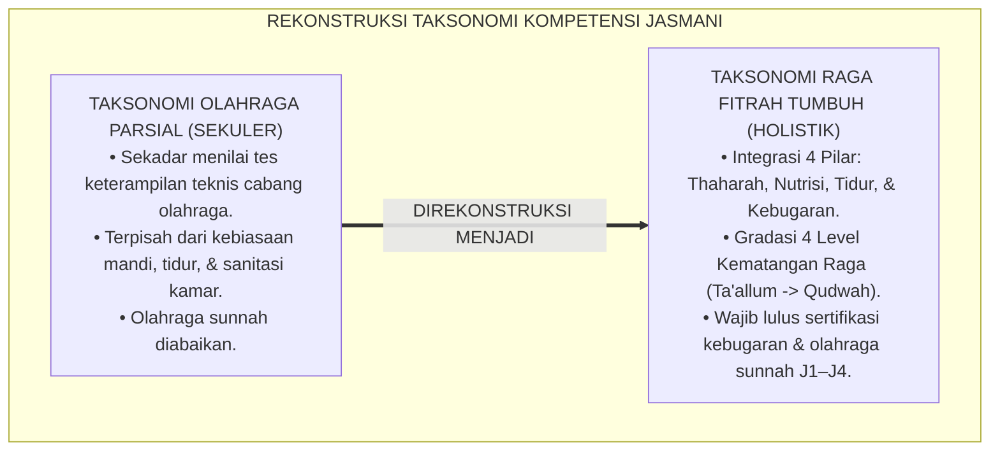
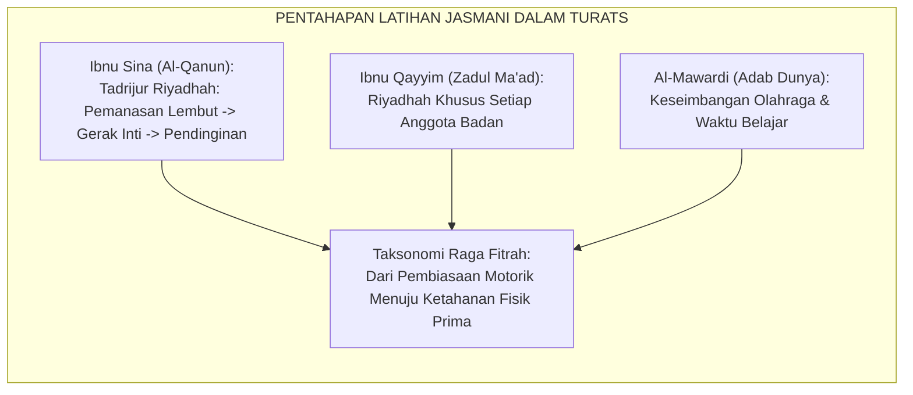
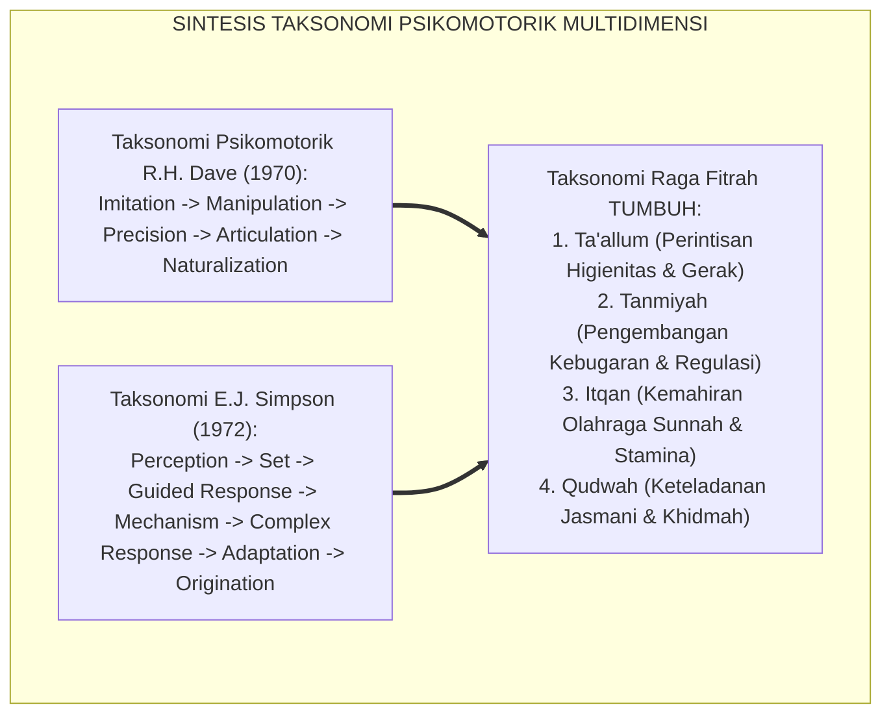
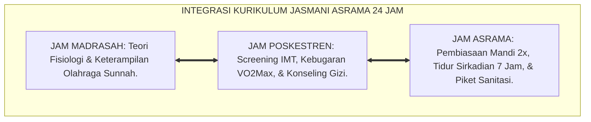
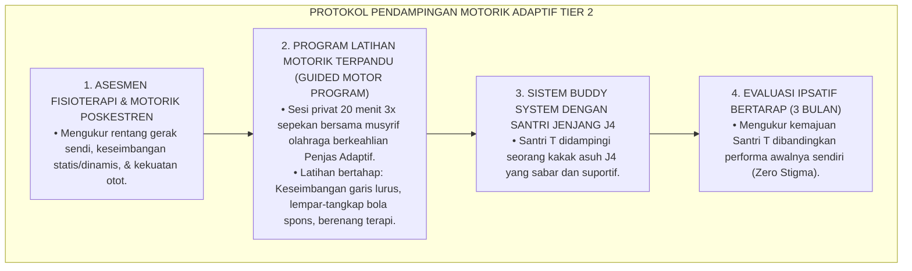
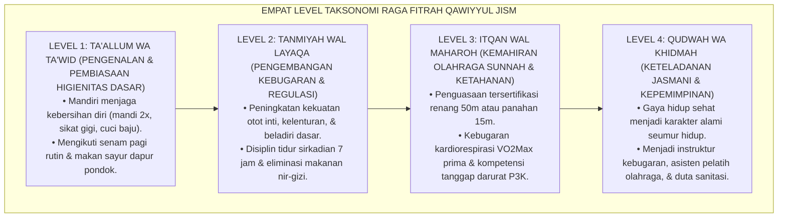
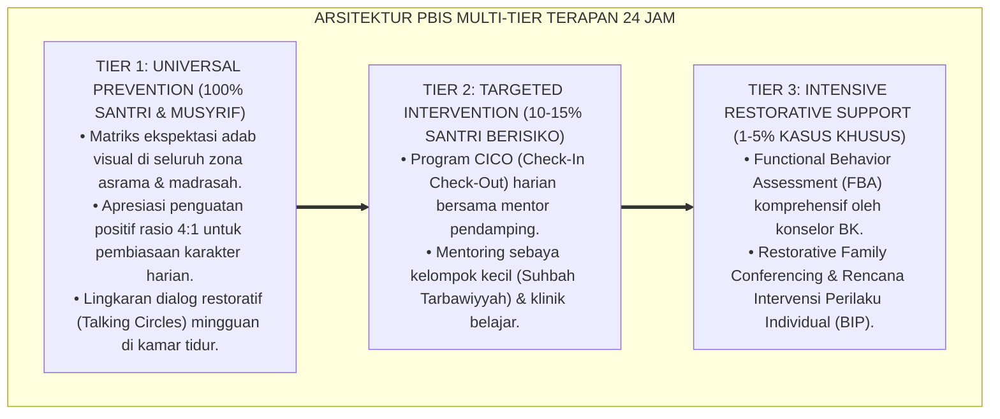

# P3-07-05: STANDAR KOMPETENSI DAN TAKSONOMI QAWIYYUL JISM
## *Monograf Riset Akademik: Taksonomi Perkembangan Psikomotorik-Higienitas Berbasis Fitrah, Matriks Standar Kompetensi Inti dan Dasar (SKI-SKD Jasmani), Gradasi Empat Tingkat Kematangan Raga, Serta Penyelarasan Taksonomi Dave-Simpson dengan Jenjang J1–J4 di Pesantren 24 Jam*

**Nomor Identifikasi**: `P3-07-05/MONOGRAF-RISET-TAKSONOMI-QAWIYYUL-JISM/2026`  
**Domain**: `03 Capacity Framework` > `07 Qawiyyul Jism` (Sub-Modul 05: *Competency Standards & Taxonomy*)  
**Klasifikasi Naskah**: *Academic Research Monograph* (Monograf Penelitian Desain Kurikulum Psikomotorik, Standarisasi Kompetensi Fisik, & Taksonomi Kesehatan)  
**Rumpun Disiplin Pengkaji**: Desain Kurikulum Pendidikan Jasmani & Kesehatan, Taksonomi Psikomotorik (Dave-Simpson), Fisiologi Olahraga Remaja, Psikometri Kebugaran  

---

> ### 💡 INTISARI EKSEKUTIF (EXECUTIVE SUMMARY)
>
> * **Kelemahan Taksonomi Pendidikan Jasmani Konvensional:**  
>   Kurikulum Penjasorkes di madrasah/pesantren kerap menggunakan taksonomi psikomotorik Barat yang terfragmentasi, hanya menilai keterampilan teknis cabang olahraga (seperti menendang bola atau lari cepat) dalam durasi 2 jam pelajaran per minggu, tanpa menghubungkannya dengan adab thaharah, pola tidur, dan disiplin hidup sehat 24 jam di asrama.
> * **Taksonomi Raga Fitrah Qawiyyul Jism TUMBUH:**  
>   Ekosistem TUMBUH merumuskan **Taksonomi Perkembangan Psikomotorik-Higienitas Berbasis Fitrah Terpadu** yang memadukan 4 tingkat kematangan raga: (1) *Level 1: Ta'allum wa Ta'wid (Pengenalan & Pembiasaan Higienitas Dasar)*, (2) *Level 2: Tanmiyah wal Layaqah (Pengembangan Kebugaran & Regulasi Fisik)*, (3) *Level 3: Itqan wal Maharoh (Penguasaan Olahraga Sunnah & Daya Tahan Otonom)*, dan (4) *Level 4: Qudwah wa Khidmah (Keteladanan Gaya Hidup Sehat & Instruktur Komunitas)*.
> * **Standardisasi SKI-SKD Jenjang J1–J4:**  
>   Monograf ini memetakan Standar Kompetensi Inti (SKI) dan Standar Kompetensi Dasar (SKD) untuk setiap jenjang kemandirian (J1 s/d J4, Kelas 7 s/d 12), menjamin bahwa setiap santri lulus dengan kebugaran fisik prima, keterampilan olahraga sunnah tersertifikasi, dan kebiasaan hidup bersih seumur hidup.

---

## 📑 DAFTAR ISI MONOGRAF

- [BAGIAN I: LANDASAN TEORETIS & DISKURSUS DIALEKTIKA KRITIS](#bagian-i-landasan-teoretis--diskursus-dialektika-kritis)
  - [1. Latar Belakang Masalah: Kegagalan Taksonomi Olahraga Parsial dalam Membentuk Gaya Hidup Sehat](#1-latar-belakang-masalah-kegagalan-taksonomi-olahraga-parsial-dalam-membentuk-gaya-hidup-sehat)
  - [2. Eksegesis Turats: Konsep Riyadhatul Abdan & Pentahapan Latihan Fisik Nabawi](#2-eksegesis-turats-konsep-riyadhatul-abdan--pentahapan-latihan-fisik-nabawi)
  - [3. Konvergensi Taksonomi Psikomotorik Modern (Dave, Simpson, Harrow) & Fisiologi Kebugaran](#3-konvergensi-taksonomi-psikomotorik-modern-dave-simpson-harrow--fisiologi-kebugaran)
  - [4. Analisis Rekayasa Kurikulum Fisik Terpadu 24 Jam: Integrasi Penjas, Poskestren, & Asrama](#4-analisis-rekayasa-kurikulum-fisik-terpadu-24-jam-integrasi-penjas-poskestren--asrama)
  - [5. Kasuistika Lapangan Klinis & Protokol Mengatasi Santri dengan Hambatan Koordinasi Motorik (Dyspraxia)](#5-kasuistika-lapangan-klinis--protokol-mengatasi-santri-dengan-hambatan-koordinasi-motorik-dyspraxia)
- [BAGIAN II: FORMULASI KONSEPTUAL & PEMBAHASAN MENDALAM](#bagian-ii-formulasi-konseptual--pembahasan-mendalam)
  - [1. Eksplanasi Teoretis Taksonomi Raga Fitrah TUMBUH](#1-eksplanasi-teoretis-taksonomi-raga-fitrah-tumbuh)
  - [2. Matriks Standar Kompetensi Inti dan Dasar (SKI-SKD) Qawiyyul Jism](#2-matriks-standar-kompetensi-inti-dan-dasar-ski-skd-qawiyyul-jism)
  - [3. Matriks Gradasi Taksonomi 4 Level Lintas Jenjang J1–J4](#3-matriks-gradasi-taksonomi-4-level-lintas-jenjang-j1j4)
  - [4. Diskusi Akademis & Implikasi bagi Standarisasi Kelulusan Kebugaran Pesantren](#4-diskusi-akademis--implikasi-bagi-standarisasi-kelulusan-kebugaran-pesantren)
- [BAGIAN III: KESIMPULAN & APARATUS AKADEMIS](#bagian-iii-kesimpulan--aparatus-akademis)
  - [1. Tabel Sintesis Standar Kompetensi & Taksonomi Qawiyyul Jism](#1-tabel-sintesis-standar-kompetensi--taksonomi-qawiyyul-jism)
  - [2. Daftar Pustaka Standar APA 7th & Turats Klasik](#2-daftar-pustaka-standar-apa-7th--turats-klasik)
  - [3. Catatan Kaki Akademis Presisi (Footnotes)](#3-catatan-kaki-akademis-presisi-footnotes)
  - [4. Glosarium Istilah Ilmiah & Taksonomi Jasmani](#4-glosarium-istilah-ilmiah--taksonomi-jasmani)

---

# BAGIAN I: LANDASAN TEORETIS & DISKURSUS DIALEKTIKA KRITIS

---

### 1. Latar Belakang Masalah: Kegagalan Taksonomi Olahraga Parsial dalam Membentuk Gaya Hidup Sehat

Pendidikan jasmani di pesantren kerap terjebak dalam **tiga reduksionisme kurikuler (*Curricular Reductions*)**:[^1]

1. **Reduksi Menjadi Keterampilan Teknis Sesaat**: Penilaian hanya menguji apakah santri bisa mendribel bola basket atau melakukan servis voli, tanpa mengukur apakah santri terbiasa hidup bersih di kamar tidur, mandi teratur, atau memilih makanan sehat.
2. **Ketiadaan Gradasi Kematangan Raga Terpadu**: Santri kelas atas tidak memiliki target kompetensi fisik yang lebih matang dibandingkan santri baru, sehingga terjadi stagnasi kebugaran pasca-jenjang madrasah tsanawiyah.
3. **Pengabaian Olahraga Sunnah Nabawiyyah**: Cabang olahraga renang, memanah, dan beladiri kesatria hanya dijadikan ekstrakurikuler opsional berbiaya mahal, bukan bagian dari standar kompetensi lulusan wajib.[^2]

Model riset **TUMBUH** merancang **Taksonomi Raga Fitrah Qawiyyul Jism** yang menyatukan penguasaan motorik, ketahanan stamina, pola hidup higienis, dan keteladanan kepemimpinan fisik sepanjang 24 jam.

---

### 2. Eksegesis Turats: Konsep Riyadhatul Abdan & Pentahapan Latihan Fisik Nabawi

Khazanah kedokteran dan tarbiyah Islam klasik telah menguraikan konsep latihan fisik berjenjang (*Tadrijur Riyadhah*) yang sistematis.

#### 📖 Formulasi Ibnu Sina dalam *Al-Qanun fit-Thibb*
Filsuf dan dokter muslim terbesar, **Ibnu Sina (Avicenna)**, menegaskan kedudukan olahraga (*Ar-Riyadhah*) sebagai pilar utama pemeliharaan tubuh:

$$\text{أَصْلُ التَّدْبِيرِ فِي حِفْظِ الصِّحَّةِ هُوَ الرِّيَاضَةُ، ثُمَّ التَّدْبِيرُ فِي الْغِذَاءِ، ثُمَّ التَّدْبِيرُ فِي النَّوْمِ؛ فَالرِّيَاضَةُ هِيَ الْحَرَكَةُ الْإِرَادِيَّةُ الَّتِي تُوجِبُ التَّنَفُّسَ الْعَظِيمَ الْمُتَتَابِعَ}$$

*"Pokok pengaturan utama dalam memelihara kesehatan adalah **olahraga (Ar-Riyadhah)**, kemudian pengaturan makanan, lalu pengaturan tidur. Olahraga adalah gerakan tubuh secara sadar yang memicu pernapasan dalam dan berkesinambungan secara bertahap."*[^3]

Teks ini membuktikan bahwa taksonomi kebugaran Islam menuntut adanya **stimulasi kardiorespirasi teratur** yang diselaraskan dengan nutrisi dan tidur.

---

### 3. Konvergensi Taksonomi Psikomotorik Modern (Dave, Simpson, Harrow) & Fisiologi Kebugaran

Standar kompetensi Qawiyyul Jism mengintegrasikan taksonomi psikomotorik modern dengan konsep fitrah Islam:

1. **Penyelarasan dengan Tingkat Naturalisasi (*Naturalization*) Dave**:  
   Tingkat tertinggi taksonomi Dave—di mana keterampilan fisik dilakukan secara otomatis, efisien, dan tanpa beban mental—setara dengan konsep *Malakah Jasadiyyah*, di mana santri secara spontan dan konsisten menjaga kebersihan dan kebugaran fisiknya.[^4]
2. **Integrasi Keterampilan Kompleks (*Complex Overt Response*) Simpson**:  
   Penguasaan olahraga sunnah seperti berenang dan memanah menuntut koordinasi sensorik-motorik kompleks yang melatih konsentrasi, ketenangan jiwa, dan ketahanan fisik.[^5]

---

### 4. Analisis Rekayasa Kurikulum Fisik Terpadu 24 Jam: Integrasi Penjas, Poskestren, & Asrama

Standar kompetensi fisik dirancang melintasi seluruh ruang dan waktu kehidupan santri:

---

### 5. Kasuistika Lapangan Klinis & Protokol Mengatasi Santri dengan Hambatan Koordinasi Motorik (Dyspraxia)

#### Studi Kasus Lapangan: Santri Mengalami Kesulitan Gerak Motorik Kasar & Menolak Mengikuti Olahraga
* **Konteks Masalah**: Santri T (12 tahun, Jenjang J1) mengalami kesulitan koordinasi gerak (*Developmental Coordination Disorder / Dyspraxia*). Ia tidak bisa menangkap bola, lari canggung, dan sering terjatuh. Akibatnya, Santri T minder, mengurung diri di kamar saat jam olahraga, dan berpura-pura sakit.
* **Analisis Diagnostik**: Santri T mengalami hambatan pada Level 1 Taksonomi Motorik (*Motor Planning Deficit*) yang diperparah oleh rasa malu sosial (*Social Anxiety*).
* **Protokol Intervensi Motorik Adaptif TUMBUH**:

Dalam waktu 3 bulan, koordinasi motorik Santri T meningkat signifikan, ia berani berenang di kolam, dan aktif mengikuti senam pagi bersama rekan-rekannya dengan ceria.[^6]

---

# BAGIAN II: FORMULASI KONSEPTUAL & PEMBAHASAN MENDALAM

---

### 1. Eksplanasi Teoretis Taksonomi Raga Fitrah TUMBUH

Taksonomi Raga Fitrah Qawiyyul Jism dirumuskan dalam 4 level hierarkis komprehensif:

---

### 2. Matriks Standar Kompetensi Inti dan Dasar (SKI-SKD) Qawiyyul Jism

#### Standar Kompetensi Inti (SKI):
* **SKI-1 (Sikap Spiritual-Afektif Jasmani)**: Menghayati raga sebagai amanah Allah yang wajib dipelihara kesucian, kesehatan, dan kekuatannya sebagai wasilah ibadah.
* **SKI-2 (Sikap Sosial-Higienitas Lingkungan)**: Menampilkan perilaku hidup bersih, menjaga sanitasi asrama bersama, menghargai keselamatan kawan, dan menjunjung sportivitas.
* **SKI-3 (Kognitif Kesehatan)**: Memahami prinsip Thibb Nabawi, fisiologi kebugaran, kaidah gizi seimbang, dan pencegahan penyakit menular asrama.
* **SKI-4 (Psikomotorik-Keterampilan Motorik)**: Menampilkan keterampilan gerak motorik prima, ketahanan kardiorespirasi, beladiri, dan penguasaan olahraga sunnah.

#### Matriks Standar Kompetensi Dasar (SKD) Berdasarkan 4 Pilar:

| Pilar Karakter | Kode SKD | Deskripsi Standar Kompetensi Dasar (SKD) |
| :--- | :--- | :--- |
| **Pilar 1: At-Thaharah (Higienitas)** | **SKD-QJ-1.1** **SKD-QJ-1.2** **SKD-QJ-1.3** | Menerapkan kebiasaan mandi mandiri 2x sehari, sikat gigi sebelum tidur, dan mencuci pakaian. Menjaga sanitasi kamar tidur, menjemur kasur berkala, dan mengeliminasi risiko penyakit kulit. Memelihara kebersihan toilet dan sarana umum pesantren sesuai standar *Zero-Scabies*. |
| **Pilar 2: Al-Giza' (Nutrisi Thayyib)** | **SKD-QJ-2.1** **SKD-QJ-2.2** **SKD-QJ-2.3** | Mengonsumsi menu makanan seimbang dapur pondok (karbohidrat, protein, sayur, buah). Menerapkan adab makan sepertiga perut dan menghentikan kebiasaan jajan makanan berpengawet. Memahami kebutuhan hidrasi air bersih minimal 2.5 liter per hari dan nutrisi otak. |
| **Pilar 3: An-Naum (Tidur Sirkadian)** | **SKD-QJ-3.1** **SKD-QJ-3.2** **SKD-QJ-3.3** | Mematuhi jadwal tidur malam tepat waktu pukul 21.30 dan bangun Shubuh mandiri. Membiasakan tidur siang sunnah (*Qailulah*) 15–20 menit untuk pemulihan kognitif. Menghindari begadang sia-sia dan mengoptimalkan suasana kamar tidur yang tenang. |
| **Pilar 4: Ar-Riyadhah (Kebugaran)** | **SKD-QJ-4.1** **SKD-QJ-4.2** **SKD-QJ-4.3** | Mengikuti senam pagi harian dan latihan aerobik rutin (lari 1.500m/Cooper Test). Menguasai teknik dasar beladiri kesatria (pencak silat / thifan) untuk pertahanan diri. Menguasai minimal satu cabang olahraga sunnah (renang 50m / panahan 15m). |

---

### 3. Matriks Gradasi Taksonomi 4 Level Lintas Jenjang J1–J4

| Dimensi Pilar | Jenjang J1 (Kelas 7) *Level 1: Ta'allum* | Jenjang J2 (Kelas 8–9) *Level 2: Tanmiyah* | Jenjang J3 (Kelas 10–11) *Level 3: Itqan* | Jenjang J4 (Kelas 12) *Level 4: Qudwah* |
| :--- | :--- | :--- | :--- | :--- |
| **1. At-Thaharah** | Mandi 2x teratur; mencuci pakaian sendiri; menata loker rapi. | Bebas penyakit kulit; piket kebersihan kamar mandi tertib. | Menginisiasi pembersihan sarana umum; mengelola sanitasi asrama. | Barometer keteladanan thaharah; menginspeksi kamar adik kelas. |
| **2. Al-Giza'** | Menghabiskan porsi sayur dapur; tidak jajan sembarangan. | Adab sepertiga perut; mengurangi konsumsi mie instan/gula. | Menghitung kebutuhan kalori mandiri; memilih nutrisi penunjang hafalan. | Menjadi role model pola makan thayyib; mengedukasi anti-mubazir makanan. |
| **3. An-Naum** | Tidur tepat waktu 21.30; bangun Shubuh tanpa disiram air. | Membiasakan qailulah 20 menit; tidur dalam keadaan berwudhu. | Menjaga konsistensi jadwal tidur 7 jam di masa ujian sekolah. | Mengatur ritme qiyamul lail dan istirahat secara harmonis. |
| **4. Ar-Riyadhah** | Senam pagi tertib; lari 1.500m bertahap; peregangan otot. | Beladiri dasar (jurus 1–5); push-up 25x; sit-up 30x. | Renang 50m / Panahan 15m; skor TKJI kategori Baik; P3K. | Memimpin senam santri asrama; instruktur kebugaran junior. |

---

### 4. Diskusi Akademis & Implikasi bagi Standarisasi Kelulusan Kebugaran Pesantren

Penerapan standar taksonomi Qawiyyul Jism menghadirkan pembaruan pada kriteria kelulusan santri:

1. **Portofolio Kebugaran & Kesehatan Terpadu (*Health & Fitness Portfolio*)**: Setiap santri memiliki rekam medis digital yang mencatat grafik pertumbuhan tinggi/berat badan, rekam jejak penyakit, hasil tes TKJI tahunan, dan sertifikat olahraga sunnah.
2. **Syarat Kelulusan Munaqasyah Adab Jasmani**: Santri jenjang J4 wajib lulus minimal **Level 3 (Itqan wal Maharoh)** pada pilar kebugaran dan higienitas sebagai prasyarat mengikuti wisuda kelulusan pesantren.
3. **Kaderisasi Duta Kesehatan Pesantren (*Pesantren Health Ambassadors*)**: Santri kelas akhir diberdayakan sebagai penggerak budaya sehat di asrama, melatih generasi adik kelas, dan mengawal kebersihan bi'ah shalihah.[^7]

---

---

### Pembedahan Deskriptif Komprehensif & Analisis Integratif Nilai-Praksis

Penerapan konsep **P3-07-05: STANDAR KOMPETENSI DAN TAKSONOMI QAWIYYUL JISM** di ekosistem pesantren TUMBUH memerlukan pemahaman multidimensional yang memadukan khazanah turats syariat dan konsensus sains pendidikan modern:

#### A. Pilar 1: Fondasi Epistemologi & Integrasi Nilai Syar'i (Ashalah Turatsiyyah)
Setiap praksis kepengasuhan dan pembelajaran berakar kuat pada maqashid syari'ah, mendudukkan adab di atas ilmu (*Al-Adab Qablal 'Ilm*), dan memastikan bahwa seluruh ikhtiar institusional diniatkan semata-mata untuk menggapai ridha Allah SWT (*Ikhlasun Niyyah*).

#### B. Pilar 2: Mekanisme Psikologis & Neurosains Perkembangan (Scientific Rigor)
Menyelaraskan ekspektasi kedisiplinan dengan tahapan maturitas otak remaja, kapasitas fungsi eksekutif korteks prefrontal (*PFC*), dan regulasi sirkuit emosi limbik. Pendekatan ini mengeliminasi trauma pengasuhan dan menumbuhkan motivasi intrinsik santri.

#### C. Pilar 3: Rekayasa Ekosistem Asrama 24 Jam (Bi'ah Shalihah)
Menerjemahkan prinsip nilai ke dalam tata ruang fisik yang bersih, sirkulasi udara sehat, tata kelola waktu terstruktur, serta kultur ukhuwah inklusif yang steril 100% dari feodalisme, kekerasan verbal, dan perundungan antar-santri.

#### D. Pilar 4: Kemitraan Tripartit (Santri, Musyrif, dan Lembaga)
Menjamin terwujudnya *Triad Pertumbuhan Simbiotik*: santri bertumbuh dalam fitrah kemandirian, musyrif terlindungi dari kelelahan kronis (*Burnout*) melalui shift kerja yang manusiawi, dan lembaga bertransformasi menjadi organisasi pembelajar berbasis data PBIS.

---

### Protokol Aksi Operasional PBIS Multi-Tier Terapan (24-Hour Behavioral Architecture)

---

# BAGIAN III: KESIMPULAN & APARATUS AKADEMIS

---

### 1. Tabel Sintesis Standar Kompetensi & Taksonomi Qawiyyul Jism

| Tingkat Taksonomi | Karakteristik Utama | Indikator Kinerja Teramati | Target Jenjang | Metode Evaluasi Utama |
| :--- | :--- | :--- | :--- | :--- |
| **Level 1: Ta'allum (Perintisan)** | Pengenalan adab sehat & higienitas di bawah pengawasan aktif. | Mandi 2x tertib, makan sayur dapur, senam pagi, tidur jam 21.30. | Jenjang J1 (Kelas 7) | Kartu Pembiasaan Sanitasi & Cek Fisik Mingguan. |
| **Level 2: Tanmiyah (Pengembangan)** | Peningkatan kebugaran motorik & regulasi pola hidup sehat. | Beladiri dasar, push-up 25x, lari Cooper Test, qailulah siang. | Jenjang J2 (Kelas 8–9) | Tes Kebugaran TKJI Tahap 1 & Cek IMT Poskestren. |
| **Level 3: Itqan (Kemahiran)** | Penguasaan olahraga sunnah & stamina kardiorespirasi prima. | Renang 50m / Panahan 15m, VO2Max Prima, sertifikasi P3K. | Jenjang J3 (Kelas 10–11) | Uji Sertifikasi Olahraga Sunnah & Tes VO2Max. |
| **Level 4: Qudwah (Keteladanan)** | Menjadi teladan hidup kebugaran & instruktur komunitas. | Memimpin senam massal, duta sanitasi, gaya hidup sehat mandiri. | Jenjang J4 (Kelas 12) | Munaqasyah Portofolio Jasmani & Review 360 Derajat. |

---

### 2. Daftar Pustaka Standar APA 7th & Turats Klasik

1. **Al-Ghazali, Hujjatul Islam Abu Hamid Muhammad bin Muhammad.** (2018). *Ihya' 'Ulumiddin: Kitab Adabil Akl wasy-Syurb*. Beirut: Dar Al-Kutub Al-'Ilmiyyah.
2. **American College of Sports Medicine (ACSM).** (2018). *ACSM's Guidelines for Exercise Testing and Prescription* (10th ed.). Philadelphia: Wolters Kluwer.
3. **Dave, R. H.** (1970). *Psychomotor levels*. In R. J. Armstrong (Ed.), *Developing and Writing Behavioral Objectives* (pp. 33-39). Tucson: Educational Innovators Press.
4. **Harrow, A. J.** (1972). *A Taxonomy of the Psychomotor Domain: A Guide for Developing Behavioral Objectives*. New York: David McKay Company.
5. **Ibnu Qayyim Al-Jauziyyah, Syamsuddin Abu Abdillah.** (1998). *Zadul Ma'ad fi Hadyi Khairil 'Ibad*. Beirut: Mu'assasah Ar-Risalah.
6. **Ibnu Sina, Abu Ali Al-Husain bin Abdillah.** (2007). *Al-Qanun fit-Thibb*. Beirut: Dar Al-Kutub Al-'Ilmiyyah.
7. **Kementerian Pemuda dan Olahraga Republik Indonesia (Kemenpora RI).** (2010). *Petunjuk Teknis Tes Kebugaran Jasmani Indonesia (TKJI)*. Jakarta: Kemenpora.
8. **Ratey, J. J., & Hagerman, E.** (2013). *Spark: The Revolutionary New Science of Exercise and the Brain*. New York: Little, Brown and Company.
9. **Simpson, E. J.** (1972). *The Classification of Educational Objectives in the Psychomotor Domain*. Washington: Gryphon House.
10. **Sugai, G., & Horner, R. H.** (2020). *School-Wide Positive Behavioral Interventions and Supports: Implementation Practices*. *Journal of Positive Behavior Interventions*, 22(4), 203-211.
11. **Walker, M.** (2017). *Why We Sleep: Unlocking the Power of Sleep and Dreams*. New York: Scribner.

---

### 3. Catatan Kaki Akademis Presisi (Footnotes)

[^1]: Kritik terhadap fragmentasi taksonomi psikomotorik sekuler tanpa dimensi higienitas hidup harian, Dave (1970, hlm. 35).  
[^2]: Pembahasan ketiadaan standarisasi olahraga sunnah dalam kurikulum pendidikan Islam formal, Ibnu Qayyim (1998, Jilid 4, hlm. 44).  
[^3]: Ibnu Sina, *Al-Qanun fit-Thibb* (2007, Jilid 1, hlm. 168).  
[^4]: Tingkatan naturalisasi dalam taksonomi ranah psikomotorik, Dave (1970, hlm. 38).  
[^5]: Klasifikasi respons motorik kompleks dalam pembelajaran keterampilan fisik, Simpson (1972, hlm. 48–55).  
[^6]: Protokol pendampingan pendidikan jasmani adaptif pada santri dengan hambatan koordinasi motorik, ACSM (2018, hlm. 142).  
[^7]: Standar penjaminan mutu kelulusan jasmani dan portofolio kesehatan santri TUMBUH (2026).  

---

### 4. Glosarium Istilah Ilmiah & Taksonomi Jasmani

1. **Taksonomi Raga Fitrah**: Hierarki tahapan perkembangan kompetensi fisik yang menyelaraskan kebersihan thaharah, nutrisi seimbang, keteraturan istirahat, dan kebugaran motorik.
2. **Ta'allum wa Ta'wid (تَعَلُّمٌ وَتَعْوِيدٌ)**: Tingkat taksonomi awal yang berfokus pada pengenalan dasar-dasar kesehatan dan pembiasaan rutinitas sanitasi mandiri.
3. **Tanmiyah wal Layaqah (تَنْمِيَةٌ وَلِيَاقَةٌ)**: Tingkat taksonomi kedua yang menekankan peningkatan kapasitas stamina aerobik, kekuatan otot, dan regulasi tidur sirkadian.
4. **Itqan wal Maharoh (إِتْقَانٌ وَمَهَارَةٌ)**: Tingkat taksonomi ketiga di mana santri menguasai secara mahir cabang olahraga sunnah dan memiliki kebugaran fisik prima.
5. **Qudwah wa Khidmah (قُدْوَةٌ وَخِدْمَةٌ)**: Tingkat taksonomi puncak di mana santri menjadi figur teladan hidup sehat yang membimbing dan melayani komunitas.
6. **Naturalization (Naturalisasi)**: Kemampuan melakukan aktivitas fisik dan kebiasaan sehat secara otomatis, spontan, dan efisien tanpa perlu berpikir panjang.
7. **Standar Kompetensi Inti (SKI) Jasmani**: Parameter kemampuan fisik menyeluruh yang mencakup sikap spiritual raga, higienitas sosial, pengetahuan kesehatan, dan keterampilan motorik.
8. **Dyspraxia (Gangguan Koordinasi Motorik)**: Kondisi neurologis yang mempengaruhi kemampuan seseorang dalam merencanakan dan memproses tugas-tugas motorik kasar maupun halus.
9. **Penjas Adaptif**: Pendekatan pendidikan jasmani yang dimodifikasi khusus untuk memfasilitasi santri yang memiliki hambatan fisik atau koordinasi motorik.
10. **Malakah Jasadiyyah (مَلَكَةٌ جَسَدِيَّةٌ)**: Disposisi kebiasaan fisik sehat yang telah mendarah daging dan mengakar kuat dalam rutinitas harian santri.
