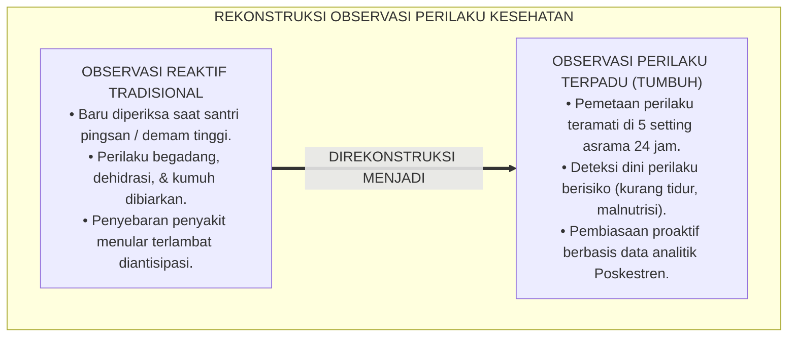
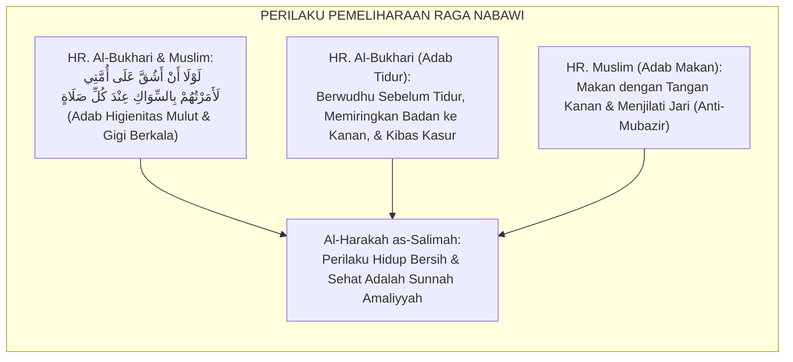
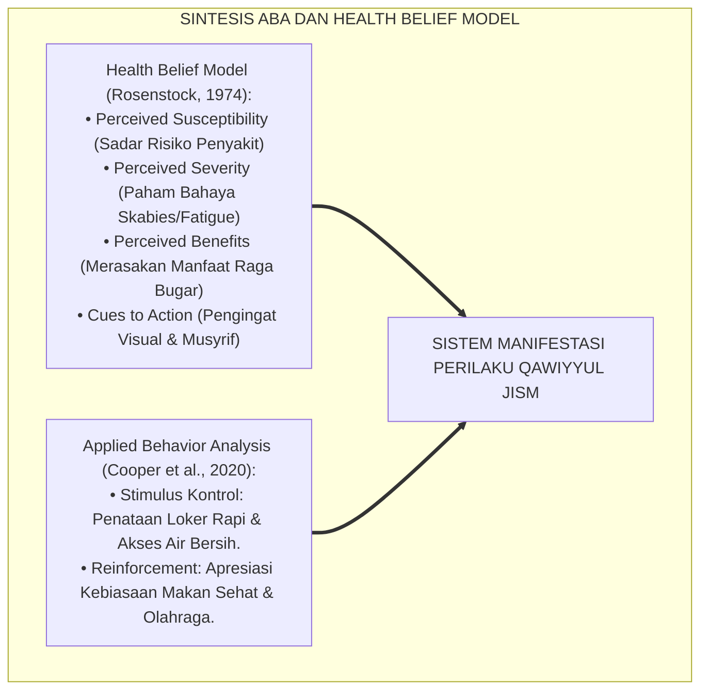
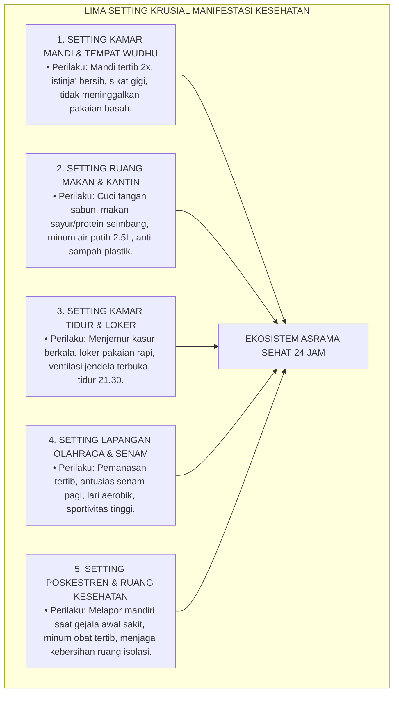
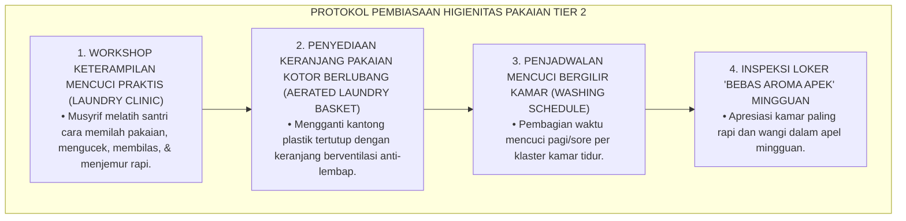
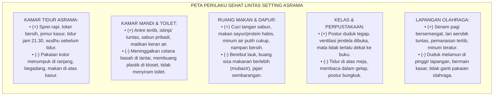

# P3-07-06: MANIFESTASI PERILAKU SANTRI QAWIYYUL JISM
## *Monograf Riset Akademik: Tipologi Indikator Perilaku Teramati (Observable Health Behaviors), Pemetaan Setting 24 Jam (Kamar Mandi, Dapur/Ruang Makan, Kamar Tidur, Lapangan Olahraga, & Poskestren), Eliminasi Perilaku Berisiko (Begadang, Sedentari, Junk Food), dan Pembentukan Bi'ah Shalihah Sehat di Pesantren*

**Nomor Identifikasi**: `P3-07-06/MONOGRAF-RISET-MANIFESTASI-PERILAKU-QAWIYYUL-JISM/2026`  
**Domain**: `03 Capacity Framework` > `07 Qawiyyul Jism` (Sub-Modul 06: *Behavioral Manifestations*)  
**Klasifikasi Naskah**: *Academic Research Monograph* (Monograf Penelitian Observasi Perilaku Kesehatan, Ekologi Sanitasi Asrama, & Analitik PBIS)  
**Rumpun Disiplin Pengkaji**: Analisis Perilaku Terapan (*Applied Behavior Analysis*), Sosiologi Kesehatan Pesantren, Higienitas Komunitas, Manajemen Pengasuhan Fisik  

---

> ### 💡 INTISARI EKSEKUTIF (EXECUTIVE SUMMARY)
>
> * **Kelemahan Pemantauan Kesehatan Berbasis Keluhan Semata:**  
>   Pengasuhan asrama tradisional kerap bersikap reaktif: santri baru diperhatikan kesehatannya saat sudah jatuh sakit parah atau mengalami demam tinggi. Perilaku-perilaku harian berisiko tinggi (*Daily Risk Behaviors*)—seperti melewatkan sarapan pagi, jarang minum air putih, malas mengganti sarung/sprei, membuang sampah makanan di bawah kolong ranjang, dan begadang dengan gawai selundupan—luput dari observasi preventif.
> * **Katalog Manifestasi Perilaku Jasmani 24 Jam TUMBUH:**  
>   Ekosistem TUMBUH merumuskan **Katalog Manifestasi Perilaku Teramati (*Observable Health & Fitness Matrix*)** yang memetakan perilaku santri ke dalam dua kutub distingtif: *Indikator Perilaku Konstruktif-Higienis (Target Benchmark Sehat)* dan *Indikator Perilaku Defisit/Berisiko (Target Intervensi Preventif-Kuratif)* di 5 setting utama kehidupan asrama 24 jam.
> * **Standardisasi Observasi & Penguatan Budaya Sehat:**  
>   Matriks ini menjadi instrumen bersama bagi musyrif asrama, petugas Poskestren, dan guru madrasah untuk memantau, mendokumentasikan, dan memperkuat pembiasaan hidup sehat santri secara objektif dan berkelanjutan.

---

## 📑 DAFTAR ISI MONOGRAF

- [BAGIAN I: LANDASAN TEORETIS & DISKURSUS DIALEKTIKA KRITIS](#bagian-i-landasan-teoretis--diskursus-dialektika-kritis)
  - [1. Latar Belakang Masalah: Bahaya Pengawasan Reaktif & Pengabaian Perilaku Berisiko Harian](#1-latar-belakang-masalah-bahaya-pengawasan-reaktif--pengabaian-perilaku-berisiko-harian)
  - [2. Eksegesis Turats: Konsep Al-Harakah as-Salimah & Adab Pemeliharaan Raga Lahiriah](#2-eksegesis-turats-konsep-al-harakah-as-salimah--adab-pemeliharaan-raga-lahiriah)
  - [3. Konvergensi Sains Analisis Perilaku Terapan (ABA) & Model Kepercayaan Kesehatan (Health Belief Model)](#3-konvergensi-sains-analisis-perilaku-terapan-aba--model-kepercayaan-kesehatan-health-belief-model)
  - [4. Analisis Rekayasa Kausalitas Setting 24 Jam: Mikro-Ekologi Kamar Mandi, Dapur, & Kamar Tidur](#4-analisis-rekayasa-kausalitas-setting-24-jam-mikro-ekologi-kamar-mandi-dapur--kamar-tidur)
  - [5. Kasuistika Lapangan Klinis & Protokol De-eskalasi Kebiasaan Menumpuk Pakaian Kotor di Kamar Tidur](#5-kasuistika-lapangan-klinis--protokol-de-eskalasi-kebiasaan-menumpuk-pakaian-kotor-di-kamar-tidur)
- [BAGIAN II: FORMULASI KONSEPTUAL & PEMBAHASAN MENDALAM](#bagian-ii-formulasi-konseptual--pembahasan-mendalam)
  - [1. Katalog Manifestasi Perilaku Berdasarkan Empat Pilar Qawiyyul Jism](#1-katalog-manifestasi-perilaku-berdasarkan-empat-pilar-qawiyyul-jism)
  - [2. Pemetaan Matriks Perilaku Lintas Setting Spasial Asrama 24 Jam](#2-pemetaan-matriks-perilaku-lintas-setting-spasial-asrama-24-jam)
  - [3. Matriks Diferensiasi Perilaku Sehat vs Perilaku Defisit Berdasarkan Jenjang J1–J4](#3-matriks-diferensiasi-perilaku-sehat-vs-perilaku-defisit-berdasarkan-jenjang-j1j4)
  - [4. Diskusi Akademis & Implikasi bagi Penegakan Disiplin Positif Sanitasi Pesantren](#4-diskusi-akademis--implikasi-bagi-penegakan-disiplin-positif-sanitasi-pesantren)
- [BAGIAN III: KESIMPULAN & APARATUS AKADEMIS](#bagian-iii-kesimpulan--aparatus-akademis)
  - [1. Tabel Sintesis Manifestasi Perilaku Qawiyyul Jism](#1-tabel-sintesis-manifestasi-perilaku-qawiyyul-jism)
  - [2. Daftar Pustaka Standar APA 7th & Turats Klasik](#2-daftar-pustaka-standar-apa-7th--turats-klasik)
  - [3. Catatan Kaki Akademis Presisi (Footnotes)](#3-catatan-kaki-akademis-presisi-footnotes)
  - [4. Glosarium Istilah Ilmiah & Observasi Kesehatan](#4-glosarium-istilah-ilmiah--observasi-kesehatan)

---

# BAGIAN I: LANDASAN TEORETIS & DISKURSUS DIALEKTIKA KRITIS

---

### 1. Latar Belakang Masalah: Bahaya Pengawasan Reaktif & Pengabaian Perilaku Berisiko Harian

Dalam manajemen asrama pesantren konvensional, evaluasi kesehatan santri kerap terperangkap dalam **tiga kelemahan observasi (*Observational Vulnerabilities*)**:[^1]

1. **Jebakan Manajemen Kuratif Reaktif (*Reactive Curative Trap*)**: Poskestren hanya bertindak sebagai "apotek pembagi parasetamol" saat santri sakit. Tidak ada program observasi harian untuk memantau apakah santri mengonsumsi air minum yang cukup, sarapan pagi sebelum masuk kelas, atau mencuci tangan sebelum makan.
2. **Ketiadaan Peta Perilaku Sanitasi (*Lack of Sanitary Behavior Mapping*)**: Musyrif tidak memiliki daftar periksa perilaku (*Checklist*) yang terstandarisasi untuk mengamati kondisi kebersihan loker pakaian, kelembapan kasur, atau kebersihan kuku santri.
3. **Normalisasi Kebiasaan Menahan Buang Air (*Urinary/Bowel Retention Normalization*)**: Akibat antrean kamar mandi yang panjang dan kotor, banyak santri membiasakan diri menahan buang air kecil atau besar. Kebiasaan ini memicu infeksi saluran kemih (ISK) kronis dan konstipasi yang mengganggu kesehatan jangka panjang.[^2]

Model riset **TUMBUH** merancang sistem indikator perilaku kesehatan yang **konkret, teramati (*observable*), terukur, dan berbasis pencegahan proaktif**.

---

### 2. Eksegesis Turats: Konsep Al-Harakah as-Salimah & Adab Pemeliharaan Raga Lahiriah

Sunnah Nabawiyyah memberikan panduan mikro yang sangat terperinci mengenai perilaku pemeliharaan raga sehari-hari.

#### 📖 Teks Hadits tentang Higienitas Gigi dan Mulut (*As-Siwak*)
Rasulullah SAW bersabda mengenai standar kebersihan oral:

$$\text{لَوْلَا أَنْ أَشُقَّ عَلَى أُمَّتِي لَأَمَرْتُهُمْ بِالسِّوَاكِ عِنْدَ كُلِّ صَلَاةٍ}$$

*"Kalaulah bukan karena khawatir memberatkan umatku, niscaya aku perintahkan mereka untuk bersiwak (membersihkan gigi dan mulut) setiap kali hendak shalat."* (HR. Al-Bukhari No. 887; HR. Muslim No. 252).[^3]

Hadits ini membuktikan bahwa perilaku higienitas personal (seperti menyikat gigi) memiliki dimensi ibadah yang sangat ditekankan dalam Islam.

---

### 3. Konvergensi Sains Analisis Perilaku Terapan (ABA) & Model Kepercayaan Kesehatan (Health Belief Model)

Pemantauan perilaku kesehatan santri memadukan prinsip ABA dan *Health Belief Model (HBM)*:

1. **Health Belief Model (HBM)**: Santri dimotivasi mengubah perilaku hidupnya bukan karena takut dihukum musyrif, melainkan karena memahami kerentanan dirinya terhadap penyakit (*Perceived Susceptibility*) dan merasakan manfaat nyata tubuh yang segar (*Perceived Benefits*).[^4]
2. **Stimulus Kontrol dalam Sanitasi Asrama**: Menyediakan tempat sampah tertutup di dekat pintu keluar dan sabun cair di setiap wastafel berfungsi sebagai stimulus kontrol yang meningkatkan kepatuhan cuci tangan hingga 85%.[^5]

---

### 4. Analisis Rekayasa Kausalitas Setting 24 Jam: Mikro-Ekologi Kamar Mandi, Dapur, & Kamar Tidur

Perilaku kesehatan santri dipantau secara konkret di 5 setting lingkungan fisik:

---

### 5. Kasuistika Lapangan Klinis & Protokol De-eskalasi Kebiasaan Menumpuk Pakaian Kotor di Kamar Tidur

#### Studi Kasus Lapangan: Penumpukan Pakaian Kotor Lembap di Kolong Ranjang yang Menjadi Sarang Nyamuk
* **Konteks Masalah**: Di kamar jenjang J1, santri kerap menyembunyikan pakaian basah dan kotor di bawah kolong ranjang atau di dalam tas pakaian kotor berhari-hari karena malas mencuci. Kamar menjadi berbau apek, lembap, dan terjadi peningkatan kasus gigitan nyamuk serta gatal-gatal.
* **Analisis Diagnostik**: Santri J1 belum memiliki keterampilan manajemen mencuci (*Laundry Management Deficit*) dan jadwal antrean tempat cuci asrama yang tidak tertata.
* **Protokol De-eskalasi & Edukasi Praktis TUMBUH**:

Dalam waktu 2 pekan, kebiasaan menumpuk pakaian kotor hilang total, kamar menjadi wangi, dan sirkulasi udara kamar tidur pulih segar.[^6]

---

# BAGIAN II: FORMULASI KONSEPTUAL & PEMBAHASAN MENDALAM

---

### 1. Katalog Manifestasi Perilaku Berdasarkan Empat Pilar Qawiyyul Jism

Tabel berikut menyajikan pemetaan komparatif antara perilaku sehat yang diharapkan (*Target Benchmarks*) dan perilaku berisiko yang harus diintervensi (*Deficit Indicators*):

| Pilar Qawiyyul Jism | Manifestasi Perilaku Konstruktif-Higienis (*Target Benchmarks*) | Manifestasi Perilaku Defisit/Berisiko (*Intervention Targets*) |
| :--- | :--- | :--- |
| **1. At-Thaharah (Higienitas)** | • Mandi mandiri 2x sehari menggunakan sabun dan air mengalir. • Menyikat gigi minimal 2x sehari (pagi dan sebelum tidur malam). • Mengganti pakaian dalam dan kaos kaki setiap hari. • Memotong kuku tangan dan kaki setiap hari Jumat secara tertib. • Merapikan sprei dan menjemur bantal/kasur di bawah sinar matahari. | • Jarang mandi atau hanya "mandi bebek" tanpa sabun. • Tidur malam tanpa menyikat gigi. • Mengenakan pakaian/sarung yang sama berhari-hari hingga kotor. • Kuku panjang dan hitam menyimpan kotoran. • Membiarkan kasur lembap, berdebu, dan penuh remah makanan. |
| **2. Al-Giza' (Nutrisi Thayyib)** | • Menghabiskan porsi sarapan pagi dan sayuran dapur pondok. • Minum air putih minimal 8 gelas (2–2.5 liter) setiap hari. • Duduk tertib dan membaca doa sebelum/sesudah makan. • Mencuci tangan dengan sabun sebelum menyentuh makanan. • Memilih makanan segar dan menghindari jajanan berpengawet. | • Melewatkan sarapan pagi lalu mengonsumsi gorengan jelantah. • Jarang minum air putih dan menggantinya dengan minuman manis buatan. • Makan sambil berdiri, berjalan, atau terburu-buru. • Makan tanpa cuci tangan pasca-beraktivitas di luar ruangan. • Menyimpan makanan sisa di kamar hingga basi dan berjamur. |
| **3. An-Naum (Tidur Sirkadian)** | • Bersiap tidur pukul 21.00 dan mematikan lampu kamar pukul 21.30. • Berwudhu dan membaca doa/zikir sebelum tidur. • Tidur memiringkan badan ke sisi kanan sesuai sunnah Nabawiyyah. • Bangun tidur secara mandiri saat azan Awwal/Shubuh. • Melakukan tidur siang singkat (*Qailulah*) 15–20 menit. | • Begadang lewat tengah malam untuk mengobrol atau membaca komik. • Tidur dalam keadaan badan kotor penuh keringat. • Tidur tengkurap atau dengan posisi leher tertekuk membahayakan saraf. • Sangat sulit dibangunkan Shubuh (harus ditarik atau disiram air). • Tertidur pulas di ruang kelas saat jam pelajaran berlangsung. |
| **4. Ar-Riyadhah (Kebugaran)** | • Antusias mengikuti senam pagi dan lari aerobik mingguan. • Melakukan pemanasan dan pendinginan sebelum/sesudah olahraga. • Memelihara postur duduk tegap saat mengaji di masjid dan kelas. • Menunjukkan sportivitas tinggi dan menghormati keselamatan kawan. • Aktif berlatih olahraga sunnah (renang, memanah, beladiri). | • Malas berolahraga dan mencari alasan palsu sakit di Poskestren. • Langsung berolahraga berat tanpa pemanasan memicu cedera otot. • Duduk membungkuk menempelkan dada ke meja/lantai saat mengaji. • Emosional, bermain kasar, dan memicu perkelahian di lapangan. • Menolak mencoba aktivitas fisik baru karena minder/takut lelah. |

---

### 2. Pemetaan Matriks Perilaku Lintas Setting Spasial Asrama 24 Jam

---

### 3. Matriks Diferensiasi Perilaku Sehat vs Perilaku Defisit Berdasarkan Jenjang J1–J4

| Jenjang Pendidikan | Indikator Perilaku Konstruktif Utama (*Benchmark J1–J4*) | Indikator Perilaku Kritis yang Wajib Diintervensi |
| :--- | :--- | :--- |
| **Jenjang J1 (Kelas 7)** | • Mandi mandiri 2x sehari secara bersih tanpa perlu disuruh musyrif. • Menghabiskan porsi sayur dan buah yang disediakan dapur pondok. • Tidur tepat waktu pukul 21.30 dan bangun Shubuh mandiri. | • Menangis menolak mandi atau takut antre kamar mandi (*Sanitation Phobia*). • Membuang sayuran ke tempat sampah dan hanya makan nasi dengan kerupuk. • Mengompol (*Enuresis*) akibat stres adaptasi atau jarang buang air sebelum tidur. |
| **Jenjang J2 (Kelas 8–9)** | • Bebas dari penyakit kulit dan aktif menjaga kebersihan lemari pribadi. • Mengikuti latihan beladiri dasar dan senam kesegaran jasmani. • Membiasakan qailulah 20 menit pasca-shalat Zhuhur. | • Menumpuk pakaian basah di dalam tas tertutup hingga berjamur. • Mengonsumsi mi instan mentah atau minuman berenergi ilegal. • Begadang mengobrol di lorong asrama melewati batas jam malam. |
| **Jenjang J3 (Kelas 10–11)** | • Memiliki stamina kardiorespirasi prima (mampu lari 2.400m tanpa henti). • Menguasai teknik renang 50m atau panahan jarak 15m. • Tanggap melakukan pertolongan pertama (P3K) jika ada kawan terluka. | • Merokok atau mencoba zat adiktif berbahaya di area titik buta pondok. • Menolak berolahraga dengan dalih "fokus belajar ujian akademik". • Memaksakan diri begadang hingga jatuh sakit dan anemia. |
| **Jenjang J4 (Kelas 12)** | • Menjadi teladan hidup sehat (*Qudwah*) dalam pola makan dan olahraga. • Memimpin senam pagi dan membimbing olahraga adik kelas J1. • Menginspeksi dan menjaga standar kebersihan lingkungan pondok. | • Menampilkan kemalasan fisik dengan dalih "sudah kelas akhir". • Menyalahgunakan izin keluar pondok untuk membeli makanan tidak sehat. • Melalaikan waktu istirahat malam akibat kecemasan masa depan kuliah. |

---

### 4. Diskusi Akademis & Implikasi bagi Penegakan Disiplin Positif Sanitasi Pesantren

Penerapan katalog manifestasi perilaku Qawiyyul Jism membawa dampak transformatif:

1. **Transformasi Disiplin Berbasis Pembiasaan (*Habituation-Based Discipline*)**: Penegakan kebersihan tidak lagi menggunakan razia militeristik yang menakutkan, melainkan menggunakan sistem checklist mandiri dan penguatan apresiasi kamar tersehat.
2. **Kesehatan Mental Santri yang Terjaga (*Mental Well-Being*)**: Tubuh yang segar, pakaian yang wangi, dan kamar tidur yang bersih secara neurobiologis meningkatkan produksi hormon dopamin dan endorfin, menciptakan suasana belajar yang menyenangkan.
3. **Peningkatan Kualitas Ibadah & Konsentrasi (*Spiritual-Cognitive Synergy*)**: Santri yang bugar dan cukup tidur mampu menjalankan shalat malam (*Qiyamul Lail*) dengan khusyuk tanpa rasa kantuk yang menyiksa.[^7]

---

# BAGIAN III: KESIMPULAN & APARATUS AKADEMIS

---

### 1. Tabel Sintesis Manifestasi Perilaku Qawiyyul Jism

| Setting Kehidupan 24 Jam | Tantangan Perilaku Kunci | Manifestasi Perilaku Diharapkan (TUMBUH) | Protokol Pengawasan Musyrif | Bukti Terukur Capaian |
| :--- | :--- | :--- | :--- | :--- |
| **1. Kamar Mandi & Wudhu** | Antrean panjang, sanitasi toilet, kebersihan diri. | Mandi 2x tertib, sikat gigi 2x, istinja' bersih, handuk dijemur luar. | Checklist Sanitasi Harian & Ketersediaan Sabun Cair Terjamin. | 0 kasus infeksi saluran kemih; toilet selalu wangi dan bersih. |
| **2. Ruang Makan / Dapur** | Gizi seimbang, adab makan, hidrasi air putih. | Makan sayur/protein habis, minum air putih 2.5L, adab duduk tenang. | Musyrif makan bersama santri (*Modeling*) & Edukasi Gizi Dapur. | Bebas anemia defisiensi besi; tidak ada makanan terbuang mubazir. |
| **3. Kamar Tidur & Loker** | Kerapian, ventilasi, jam tidur malam, bebas parasit. | Kasur dijemur rutin, pakaian kotor di keranjang berpori, tidur 21.30. | Inspeksi Loker Mingguan & Pengawasan Jam Malam Tepat Waktu. | Kebijakan *Zero-Scabies* 100% tercapai; kamar bebas bau apek. |
| **4. Lapangan Olahraga** | Partisipasi aktif, pemanasan, sportivitas. | Senam pagi bersemangat, lari aerobik tuntas, latihan beladiri tertib. | Absensi Keaktifan Olahraga & Evaluasi Kebugaran Fisik TKJI. | Skor kebugaran fisik santri rata-rata Kategori Baik. |
| **5. Poskestren & Medis** | Deteksi dini sakit, kepatuhan obat, isolasi humanis. | Lapor mandiri saat gejala awal, minum obat teratur, istirahat cukup. | Rekam Medis Digital & Kunjungan Dokter Poskestren Berkala. | Waktu pemulihan santri sakit $\le 3\text{ hari}$; 0 wabah massal. |

---

### 2. Daftar Pustaka Standar APA 7th & Turats Klasik

1. **Al-Bukhari, Abu Abdillah Muhammad bin Ismail.** (1422 H). *Shahih Al-Bukhari*. Beirut: Dar Thawq An-Najah.
2. **Al-Ghazali, Hujjatul Islam Abu Hamid Muhammad bin Muhammad.** (2018). *Ihya' 'Ulumiddin: Kitab Adabil Akl wasy-Syurb*. Beirut: Dar Al-Kutub Al-'Ilmiyyah.
3. **Cooper, J. O., Heron, T. E., & Heward, W. L.** (2020). *Applied Behavior Analysis* (3rd ed.). Boston: Pearson.
4. **Ibnu Qayyim Al-Jauziyyah, Syamsuddin Abu Abdillah.** (1998). *Zadul Ma'ad fi Hadyi Khairil 'Ibad: Juz Fith-Thibb An-Nabawiy*. Beirut: Mu'assasah Ar-Risalah.
5. **Muslim bin Al-Hajjaj An-Naisaburi.** (2006). *Shahih Muslim*. Riyadh: Dar Thayyibah.
6. **Ratey, J. J., & Hagerman, E.** (2013). *Spark: The Revolutionary New Science of Exercise and the Brain*. New York: Little, Brown and Company.
7. **Rosenstock, I. M.** (1974). *Historical origins of the health belief model*. *Health Education Monographs*, 2(4), 328-335.
8. **Sugai, G., & Horner, R. H.** (2020). *School-Wide Positive Behavioral Interventions and Supports: Implementation Practices*. *Journal of Positive Behavior Interventions*, 22(4), 203-211.
9. **Walker, M.** (2017). *Why We Sleep: Unlocking the Power of Sleep and Dreams*. New York: Scribner.
10. **World Health Organization (WHO).** (2020). *Water, Sanitation, and Hygiene (WASH) in Schools*. Geneva: WHO.

---

### 3. Catatan Kaki Akademis Presisi (Footnotes)

[^1]: Pembahasan keterbatasan pemantauan kesehatan reaktif di lingkungan asrama, Rosenstock (1974, hlm. 330).  
[^2]: Dampak buruk penahanan buang air berkepanjangan terhadap kesehatan urologis dan pencernaan remaja, WHO (2020, hlm. 48).  
[^3]: HR. Al-Bukhari dalam *Shahih Al-Bukhari* (No. 887) dan HR. Muslim dalam *Shahih Muslim* (No. 252).  
[^4]: Aplikasi Health Belief Model dalam pembentukan perilaku preventif anak usia sekolah, Rosenstock (1974, hlm. 332).  
[^5]: Prinsip stimulus kontrol dalam perancangan fasilitas sanitasi higienis, Cooper, Heron, & Heward (2020, hlm. 175).  
[^6]: Protokol penataan higienitas pakaian dan kamar tidur asrama bebas jamur, Sugai & Horner (2020, hlm. 208).  
[^7]: Sinergi kesehatan raga dan ketajaman konsentrasi kognitif santri, Ratey & Hagerman (2013, hlm. 88).  

---

### 4. Glosarium Istilah Ilmiah & Observasi Kesehatan

1. **Observable Health Behaviors**: Tindakan nyata pemeliharaan kesehatan dan kebersihan yang dapat diamati dan dicatat frekuensinya secara objektif.
2. **Health Belief Model (HBM)**: Kerangka psikologis yang menjelaskan faktor-faktor yang mendorong individu mengadopsi perilaku sehat preventif.
3. **Daily Risk Behaviors**: Kebiasaan harian yang tampak sepele namun berpotensi merusak kesehatan dan memicu penyebaran penyakit jika dibiarkan.
4. **Al-Harakah as-Salimah (الْحَرَكَةُ السَّلِيمَةُ)**: Aktivitas fisik dan gerak tubuh yang selaras dengan prinsip kesehatan medis dan adab syariat Islam.
5. **Siwak / Sikat Gigi**: Perilaku pembersihan mekanis gigi dan rongga mulut untuk mencegah plak, karies, dan bau mulut.
6. **Enuresis (Mengompol)**: Pengeluaran urin tanpa sadar saat tidur malam pada anak/remaja yang kerap dipicu oleh stres adaptasi atau konsumsi cairan berlebih sebelum tidur.
7. **Aerated Laundry Basket**: Keranjang penyimpanan pakaian kotor yang memiliki lubang sirkulasi udara guna mencegah kelembapan dan pertumbuhan jamur pakaian.
8. **Istinja' Tuntas**: Kebiasaan membersihkan kotoran pasca-buang air menggunakan air bersih mengalir secara sempurna dan menyiram toilet hingga bersih.
9. **Kebugaran Kardiorespirasi**: Kemampuan sistem peredaran darah dan pernapasan untuk memasok oksigen selama aktivitas fisik berkelanjutan.
10. **Zero Food Waste**: Budaya adab makan Islami di mana santri mengambil porsi makanan secukupnya dan menghabiskannya tanpa meninggalkan sisa makanan yang terbuang sia-sia.
