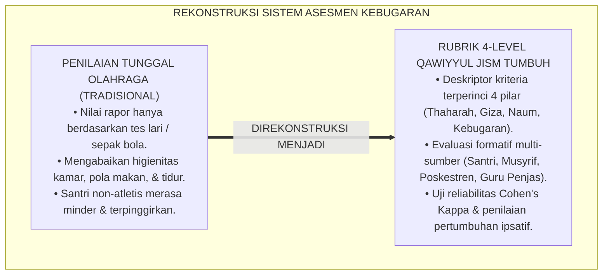
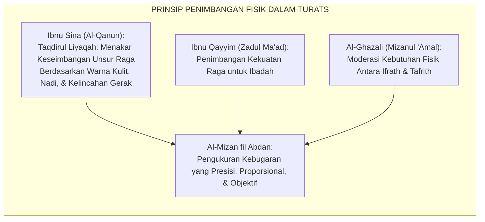
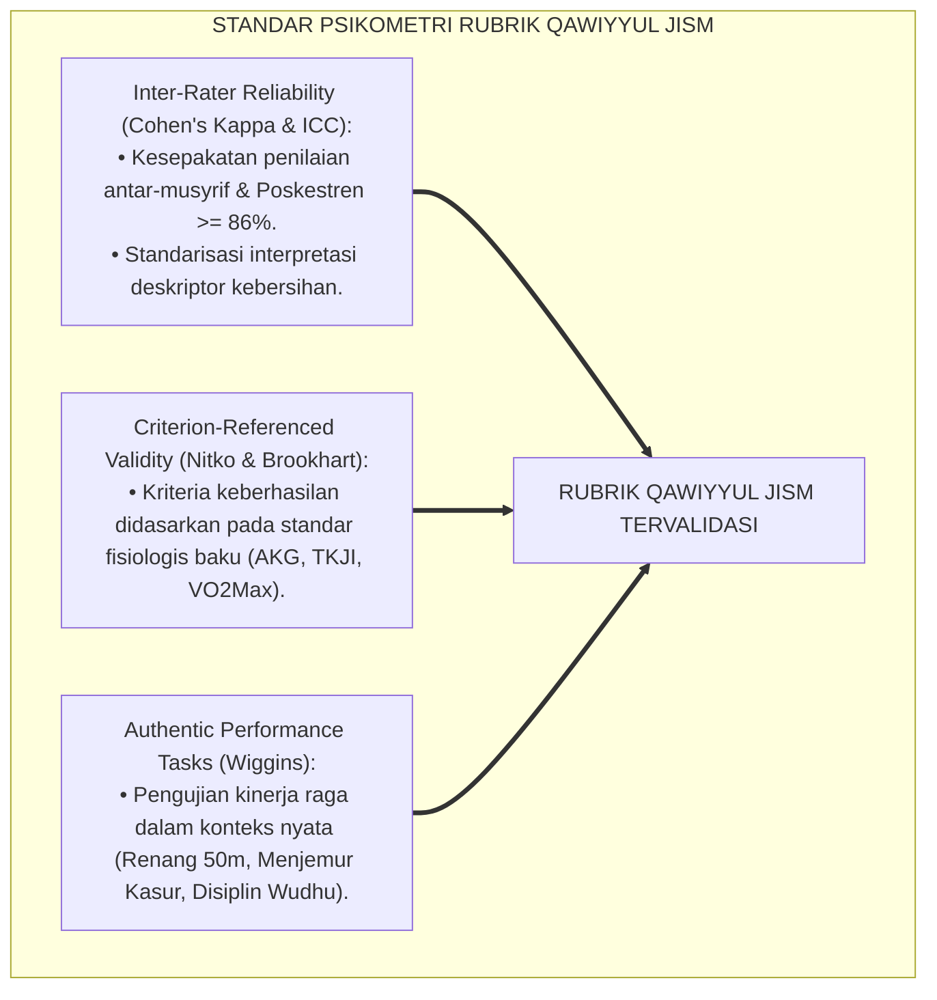
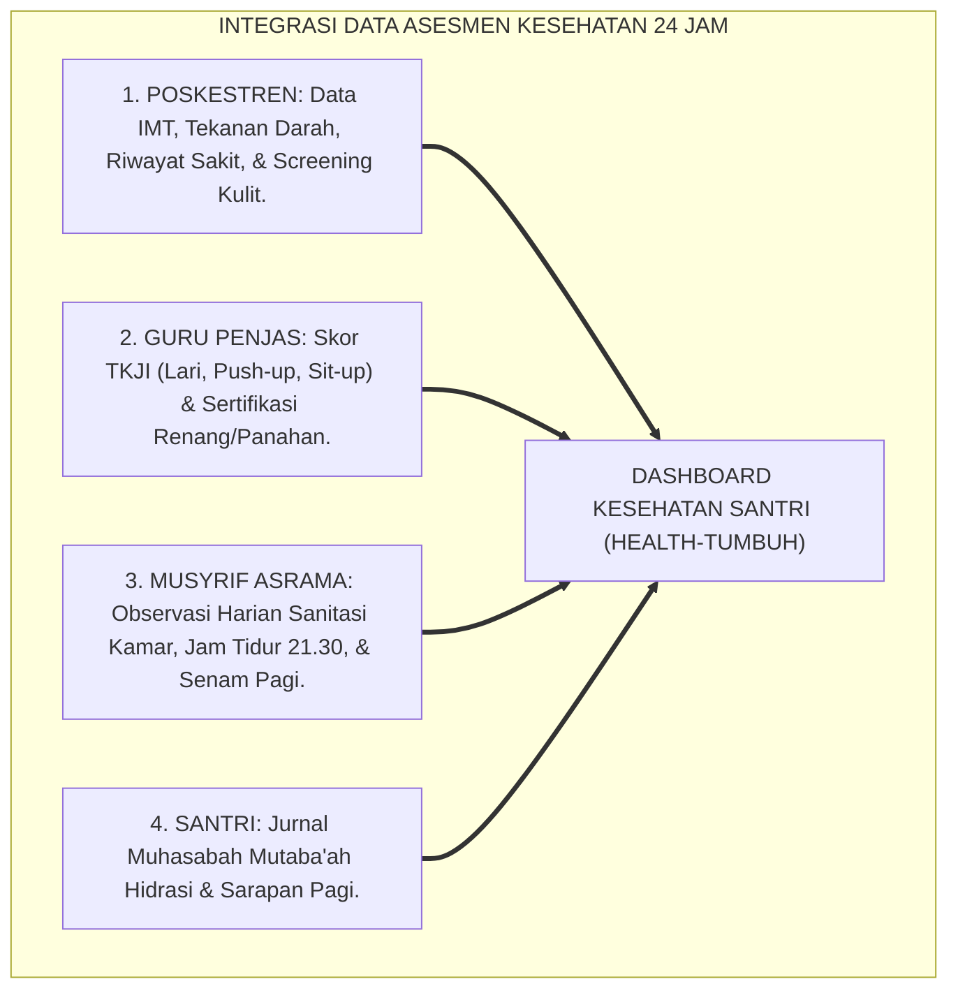
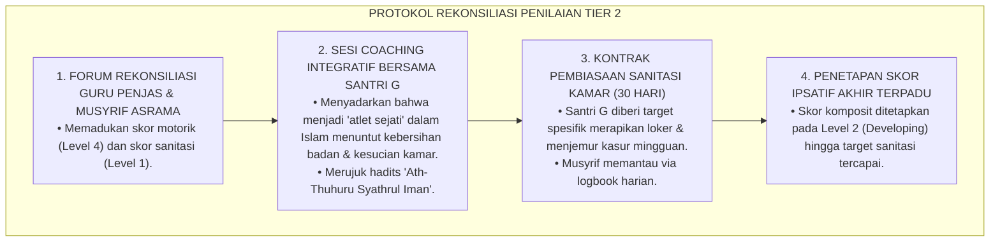
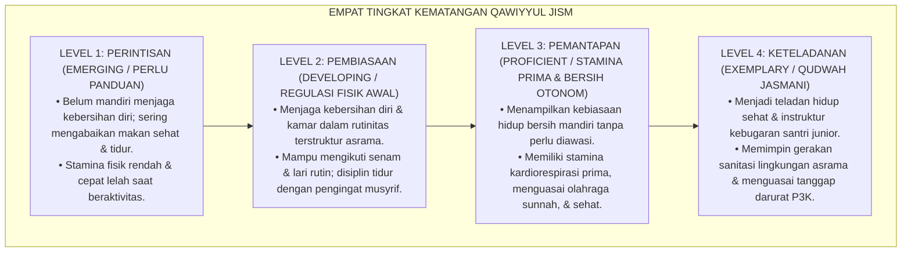
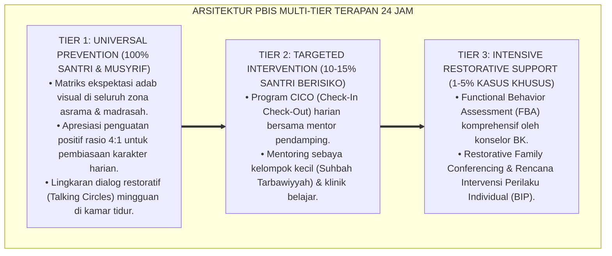

# P3-07-07: RUBRIK INDIKATOR PERILAKU 4-LEVEL QAWIYYUL JISM
## *Monograf Riset Akademik: Perancangan Rubrik Asesmen Kinerja Fisik & Sanitasi Berbasis Kriteria (Criterion-Referenced Rubrics), Gradasi Deskriptor 4 Level Kematangan Jasmani, Protokol Pengujian Reliabilitas Inter-Rater, Serta Skoring Indeks Kebugaran Terpadu di Pesantren 24 Jam*

**Nomor Identifikasi**: `P3-07-07/MONOGRAF-RISET-RUBRIK-4LEVEL-QAWIYYUL-JISM/2026`  
**Domain**: `03 Capacity Framework` > `07 Qawiyyul Jism` (Sub-Modul 07: *4-Level Behavior Rubric*)  
**Klasifikasi Naskah**: *Academic Research Monograph* (Monograf Penelitian Asesmen Kinerja Fisik, Psikometri Rubrik Sanitasi, & Evaluasi Kebugaran)  
**Rumpun Disiplin Pengkaji**: Psikometri Pendidikan Jasmani, Desain Rubrik Kinerja Otentik, Evaluasi Kesehatan Asrama, Metodologi Observasi Klinis  

---

> ### 💡 INTISARI EKSEKUTIF (EXECUTIVE SUMMARY)
>
> * **Krisis Instrumen Penilaian Fisik & Kesehatan Tradisional:**  
>   Penilaian mata pelajaran Penjasorkes atau kesehatan santri di pesantren kerap direduksi menjadi sekadar tes lari sekali waktu di akhir semester atau nilai tebakan guru tanpa instrumen observasi higienitas 24 jam. Santri yang mahir sepak bola otomatis mendapat nilai A, meskipun di kamar asrama ia jorok, menderita skabies, dan memiliki kebiasaan tidur yang buruk.
> * **Arsitektur Rubrik 4-Level Qawiyyul Jism TUMBUH:**  
>   Ekosistem TUMBUH merumuskan **Rubrik Asesmen Kinerja & Sanitasi 4-Level Berbasis Kriteria Faktual (*Criterion-Referenced Health & Fitness Rubrics*)** untuk keempat pilar Qawiyyul Jism: (1) *Level 1: Perintisan / Perlu Bimbingan (Emerging / Inisiatif Rendah)*, (2) *Level 2: Pembiasaan / Berkembang Mandiri Terbatas (Developing / Regulasi Fisik Awal)*, (3) *Level 3: Pemantapan / Kebugaran & Higienitas Otonom (Proficient / Stamina Prima & Bersih)*, dan (4) *Level 4: Keteladanan / Qudwah Jasmani (Exemplary / Instruktur & Duta Kesehatan)*.
> * **Metodologi Pengujian & Evaluasi Ipsatif:**  
>   Monograf ini menetapkan protokol kalibrasi penilai lintas musyrif-Poskestren (*Cohen's Kappa $\ge 0.86$*), algoritma pembobotan skor komposit ($IK_{QJ}$), serta implementasi evaluasi ipsatif longitudinal sepanjang 6 tahun jenjang J1–J4.

---

## 📑 DAFTAR ISI MONOGRAF

- [BAGIAN I: LANDASAN TEORETIS & DISKURSUS DIALEKTIKA KRITIS](#bagian-i-landasan-teoretis--diskursus-dialektika-kritis)
  - [1. Latar Belakang Masalah: Bahaya Reduksionisme Penilaian Kebugaran & Ilusi Nilai Olahraga Rapor](#1-latar-belakang-masalah-bahaya-reduksionisme-penilaian-kebugaran--ilusi-nilai-olahraga-rapor)
  - [2. Eksegesis Turats: Konsep Al-Mizan fil Abdan & Ketelitian dalam Menakar Kesehatan Manusia](#2-eksegesis-turats-konsep-al-mizan-fil-abdan--ketelitian-dalam-menakar-kesehatan-manusia)
  - [3. Konvergensi Sains Psikometri: Teori Generalisabilitas, Validitas Kriteria, & Authentic Rubric Design](#3-konvergensi-sains-psikometri-teori-generalisabilitas-validitas-kriteria--authentic-rubric-design)
  - [4. Rekayasa Sistem Asesmen 24 Jam: Integrasi Data Poskestren, Guru Penjas, & Musyrif Asrama](#4-rekayasa-sistem-asesmen-24-jam-integrasi-data-poskestren-guru-penjas--musyrif-asrama)
  - [5. Kasuistika Lapangan Klinis & Protokol Resolusi Anomali Penilaian Kebugaran Santri](#5-kasuistika-lapangan-klinis--protokol-resolusi-anomali-penilaian-kebugaran-santri)
- [BAGIAN II: FORMULASI KONSEPTUAL & PEMBAHASAN MENDALAM](#bagian-ii-formulasi-konseptual--pembahasan-mendalam)
  - [1. Arsitektur Komprehensif Rubrik 4-Level Karakter Qawiyyul Jism](#1-arsitektur-komprehensif-rubrik-4-level-karakter-qawiyyul-jism)
  - [2. Matriks Rinci Deskriptor Kinerja 4 Level Berdasarkan Empat Pilar Inti](#2-matriks-rinci-deskriptor-kinerja-4-level-berdasarkan-empat-pilar-inti)
  - [3. Panduan Pembobotan, Skoring Ipsatif, dan Penentuan Kelayakan Kebugaran Jenjang J1–J4](#3-panduan-pembobotan-skoring-ipsatif-dan-penentuan-kelayakan-kebugaran-jenjang-j1j4)
  - [4. Diskusi Akademis & Implikasi bagi Tata Kelola Penjaminan Mutu Kesehatan Pesantren](#4-diskusi-akademis--implikasi-bagi-tata-kelola-penjaminan-mutu-kesehatan-pesantren)
- [BAGIAN III: KESIMPULAN & APARATUS AKADEMIS](#bagian-iii-kesimpulan--aparatus-akademis)
  - [1. Tabel Sintesis Struktur Rubrik 4-Level Qawiyyul Jism](#1-tabel-sintesis-struktur-rubrik-4-level-qawiyyul-jism)
  - [2. Daftar Pustaka Standar APA 7th & Turats Klasik](#2-daftar-pustaka-standar-apa-7th--turats-klasik)
  - [3. Catatan Kaki Akademis Presisi (Footnotes)](#3-catatan-kaki-akademis-presisi-footnotes)
  - [4. Glosarium Istilah Ilmiah & Psikometri Kebugaran](#4-glosarium-istilah-ilmiah--psikometri-kebugaran)

---

# BAGIAN I: LANDASAN TEORETIS & DISKURSUS DIALEKTIKA KRITIS

---

### 1. Latar Belakang Masalah: Bahaya Reduksionisme Penilaian Kebugaran & Ilusi Nilai Olahraga Rapor

Dalam evaluasi jasmani di lingkungan pesantren konvensional, penilaian kerap menghadapi **tiga distorsi metodologis (*Methodological Distortions*)**:[^1]

1. **Ilusi Nilai Olahraga Rapor (*The PE Grade Illusion*)**: Nilai rapor mata pelajaran olahraga 90% hanya mencerminkan partisipasi di lapangan atau nilai ujian teori tertulis, tanpa memotret kondisi riil kebugaran jantung-paru santri, status nutrisi, dan kebiasaan tidurnya.
2. **Ketiadaan Deskriptor Kinerja Sanitasi (*Lack of Sanitary Descriptors*)**: Musyrif menilai kebersihan kamar hanya dengan impresi "rapi" atau "kotor" tanpa rubrik deskriptif yang jelas (seperti status sprei, ada/tidaknya pakaian menggantung di jendela, kebersihan lantai, dan kelembapan kasur).
3. **Pengabaian Perkembangan Longitudinal Individu (*Absence of Longitudinal Tracking*)**: Santri yang memiliki postur tubuh kurus atau gemuk dinilai secara seragam dengan santri atletis (*Norm-Referenced Bias*), memicu keputusasaan dan demotivasi pada santri yang memiliki hambatan fisik awal.[^2]

Model riset **TUMBUH** merancang **Rubrik 4-Level Berbasis Kriteria Faktual (*Criterion-Referenced Rubrics*)** yang memandu santri untuk bertumbuh secara ipsatif dari tahap perintisan menuju derajat kebugaran prima dan keteladanan jasmani.

---

### 2. Eksegesis Turats: Konsep Al-Mizan fil Abdan & Ketelitian dalam Menakar Kesehatan Manusia

Khazanah kedokteran Islam klasik menuntut ketelitian tinggi dalam menakar keseimbangan unsur-unsur tubuh manusia (*Mizajul Badan*).

#### 📖 Formulasi Ibnu Sina tentang Diagnosis Kebugaran Fisik
Imam **Ibnu Sina** dalam *Al-Qanun fit-Thibb* menjelaskan bahwa penilaian kapasitas fisik harus didasarkan pada tanda-tanda vital yang teramati (*Ad-Dala'il al-Kulliyyah*):

$$\text{وَدَلَائِلُ صِحَّةِ الْبَدَنِ وَلِيَاقَتِهِ تُعْرَفُ مِنْ: حُسْنِ اللَّوْنِ، وَاعْتِدَالِ النَّبْضِ، وَخِفَّةِ الْحَرَكَةِ، وَجَوْدَةِ النَّوْمِ، وَشَهْوَةِ الْغِذَاءِ الْمُعْتَدِلَةِ، وَقُوَّةِ الِاحْتِمَالِ فِي الْأَعْمَالِ الشَّاقَّةِ}$$

*"Dan tanda-tanda kesehatan badan serta kebugarannya diketahui dari: **cerahnya warna kulit/wajah, keteraturan denyut nadi, ringannya pergerakan tubuh (kelincahan), kualitas tidur yang nyenyak, nafsu makan yang proporsional, serta tingginya daya tahan dalam menjalankan tugas-tugas yang berat**."*[^3]

Teks ini menjadi landasan bahwa rubrik penilaian Qawiyyul Jism harus mencakup spektrum vitalitas fisik yang utuh.

---

### 3. Konvergensi Sains Psikometri: Teori Generalisabilitas, Validitas Kriteria, & Authentic Rubric Design

Pengembangan rubrik Qawiyyul Jism memadukan standar psikometri keolahragaan dan kesehatan komunitas:

---

### 4. Rekayasa Sistem Asesmen 24 Jam: Integrasi Data Poskestren, Guru Penjas, & Musyrif Asrama

Asesmen Qawiyyul Jism dioperasionalkan melalui integrasi data lintas unit pesantren:

---

### 5. Kasuistika Lapangan Klinis & Protokol Resolusi Anomali Penilaian Kebugaran Santri

#### Studi Kasus Lapangan: Santri Dinilai Sangat Bagus di Kelas Olahraga Tetapi Kamar Asramanya Sangat Kumuh
* **Konteks Masalah**: Santri G (15 tahun, Jenjang J2) mendapat nilai 95 pada tes lari dan sepak bola oleh guru Penjas. Namun, musyrif asrama menemukan bahwa kasur Santri G penuh noda, lokernya berbau busuk karena tumpukan kaos kaki kotor, dan ia jarang menyikat gigi sebelum tidur. Terjadi **Disparitas Skor Ekstrem**.
* **Analisis Diagnostik**: Terjadi *Fragmented Physical Competency*. Santri G memiliki bakat motorik alami (*Athletic Talent*), namun memiliki defisit kesadaran adab thaharah dan higienitas lingkungan.
* **Protokol Rekonsiliasi & Bimbingan Terpadu TUMBUH**:

Pendekatan ini berhasil membentuk kesadaran pada Santri G bahwa kekuatan fisik tidak ada artinya tanpa kesucian raga dan lingkungan.[^4]

---

# BAGIAN II: FORMULASI KONSEPTUAL & PEMBAHASAN MENDALAM

---

### 1. Arsitektur Komprehensif Rubrik 4-Level Karakter Qawiyyul Jism

Empat level kematangan karakter Qawiyyul Jism distandarisasi sebagai berikut:

---

### 2. Matriks Rinci Deskriptor Kinerja 4 Level Berdasarkan Empat Pilar Inti

#### Matriks Rubrik Analitik Qawiyyul Jism:

| Pilar Karakter | Level 1: Perintisan (*Emerging*) | Level 2: Pembiasaan (*Developing*) | Level 3: Pemantapan (*Proficient*) | Level 4: Keteladanan (*Exemplary/Qudwah*) |
| :--- | :--- | :--- | :--- | :--- |
| **1. At-Thaharah (Higienitas)** | Mandi hanya 1x sehari jika tidak disuruh; kuku panjang/kotor; menumpuk pakaian basah di kamar; rentan terjangkit skabies. | Mandi teratur 2x sehari; menyikat gigi sebelum tidur; mencuci pakaian tepat waktu; kamar tidur cukup rapi dan bebas jamur. | Menjaga kebersihan badan, pakaian, dan ranjang secara inisiatif; menjemur kasur berkala; bebas 100% dari penyakit kulit. | Menjadi barometer keteladanan thaharah; menginspeksi dan membimbing kebersihan kamar adik kelas; merawat fasilitas sanitasi umum. |
| **2. Al-Giza' (Nutrisi Thayyib)** | Kerap melewatkan sarapan; membuang sayuran dapur; sering mengonsumsi mie instan/minuman berpemanis buatan secara berlebih. | Menghabiskan porsi makanan dapur pondok; minum air putih minimal 6–8 gelas per hari; menerapkan adab makan sepertiga perut. | Memilih asupan gizi seimbang secara mandiri; memahami nutrisi penunjang daya ingat; menghindari makanan sampah (*Junk Food*). | Menjadi role model pola makan thayyib; mengedukasi santri junior tentang anti-mubazir makanan (*Zero Waste*); tubuh bebas anemia. |
| **3. An-Naum (Tidur Sirkadian)** | Sering begadang melewati jam 22.00; tidur dalam keadaan berkeringat; sangat sulit dibangunkan Shubuh; mengantuk berat di kelas. | Bersiap tidur pukul 21.00 dan tidur pukul 21.30; membiasakan tidur siang (*Qailulah* 15–20 menit); bangun Shubuh mandiri. | Menjaga konsistensi jadwal tidur 7–8 jam per malam; berwudhu sebelum tidur; bangun malam untuk tahajjud dengan stamina segar. | Mengatur ritme qiyamul lail dan istirahat secara harmonis; mengondisikan ketenangan kamar tidur asrama; stamina prima sepanjang hari. |
| **4. Ar-Riyadhah (Kebugaran)** | Malas mengikuti senam pagi; tidak mampu lari 800 meter tanpa berhenti; postur tubuh bungkuk (*Kyphosis*); menolak olahraga. | Mengikuti senam pagi dan lari aerobik dengan tertib; menguasai teknik dasar beladiri (pencak silat); postur duduk tegap. | Memiliki skor TKJI Kategori 'Baik'; lulus uji renang 50m / panahan 15m; memiliki ketahanan fisik tinggi saat beraktivitas padat. | Memimpin pemanasan dan senam seluruh santri; menjadi asisten pelatih olahraga sunnah; menguasai keterampilan P3K darurat asrama. |

---

### 3. Panduan Pembobotan, Skoring Ipsatif, dan Penentuan Kelayakan Kebugaran Jenjang J1–J4

#### Rumus Perhitungan Indeks Karakter Qawiyyul Jism ($IK_{QJ}$):
Skor komposit dihitung melalui triangulasi multi-sumber:

$$IK_{QJ} = (0.15 \times S_{Self}) + (0.15 \times S_{Peer}) + (0.35 \times S_{Mentor}) + (0.20 \times S_{Penjas}) + (0.15 \times S_{Poskestren})$$

*Keterangan*:
* $S_{Self}$: Skor Refleksi Mutaba'ah Hidup Sehat Santri (Skala 1.00 s/d 4.00)
* $S_{Peer}$: Skor Observasi Higienitas Teman Sekamar (Skala 1.00 s/d 4.00)
* $S_{Mentor}$: Skor Observasi Musyrif Sanitasi & Jam Tidur 24 Jam (Skala 1.00 s/d 4.00)
* $S_{Penjas}$: Skor Kebugaran Fisik & Olahraga Sunnah Guru Penjas (Skala 1.00 s/d 4.00)
* $S_{Poskestren}$: Skor Rekam Medis, IMT, & Higienitas Poskestren (Skala 1.00 s/d 4.00)

#### Standar Kenaikan Jenjang Kemandirian Jasmani:
* **Kenaikan J1 ke J2**: Santri wajib mencapai minimal **$IK_{QJ} \ge 2.00$ (Level Pembiasaan)** & Bebas Skabies.
* **Kenaikan J2 ke J3**: Santri wajib mencapai minimal **$IK_{QJ} \ge 2.75$** & Lulus Uji Kebugaran TKJI Kategori Sedang-Baik.
* **Kenaikan J3 ke J4**: Santri wajib mencapai minimal **$IK_{QJ} \ge 3.25$ (Level Pemantapan)** & Lulus Sertifikasi 1 Olahraga Sunnah.
* **Kelulusan Paripurna (J4)**: Santri wajib mencapai rata-rata **$IK_{QJ} \ge 3.50$ (Level Qudwah Jasmani)** & Sertifikasi P3K Asrama.[^5]

---

### 4. Diskusi Akademis & Implikasi bagi Tata Kelola Penjaminan Mutu Kesehatan Pesantren

Implementasi rubrik 4-level Qawiyyul Jism menghasilkan standar baru evaluasi pesantren:

1. **Penilaian Kesehatan Berkelanjutan (*Continuous Health Assessment*)**: Status kesehatan dan kebugaran santri dipantau secara real-time melalui dashboard Poskestren, bukan hanya saat menjelang ujian.
2. **Penghapusan Diskriminasi Fisik (*Anti-Body Shaming Culture*)**: Santri yang memiliki postur gemuk atau kurus dibimbing dengan program kebugaran personal berbasis empati (*Supportive Fitness Plan*), menciptakan rasa aman dan dihargai.
3. **Akuntabilitas Mutu Asrama bagi Wali Santri**: Wali santri menerima laporan grafik pertumbuhan fisik, status gizi, dan capaian kebugaran anak secara berkala, memberikan ketenangan batin yang nyata.[^6]

---

---

### Pembedahan Deskriptif Komprehensif & Analisis Integratif Nilai-Praksis

Penerapan konsep **P3-07-07: RUBRIK INDIKATOR PERILAKU 4-LEVEL QAWIYYUL JISM** di ekosistem pesantren TUMBUH memerlukan pemahaman multidimensional yang memadukan khazanah turats syariat dan konsensus sains pendidikan modern:

#### A. Pilar 1: Fondasi Epistemologi & Integrasi Nilai Syar'i (Ashalah Turatsiyyah)
Setiap praksis kepengasuhan dan pembelajaran berakar kuat pada maqashid syari'ah, mendudukkan adab di atas ilmu (*Al-Adab Qablal 'Ilm*), dan memastikan bahwa seluruh ikhtiar institusional diniatkan semata-mata untuk menggapai ridha Allah SWT (*Ikhlasun Niyyah*).

#### B. Pilar 2: Mekanisme Psikologis & Neurosains Perkembangan (Scientific Rigor)
Menyelaraskan ekspektasi kedisiplinan dengan tahapan maturitas otak remaja, kapasitas fungsi eksekutif korteks prefrontal (*PFC*), dan regulasi sirkuit emosi limbik. Pendekatan ini mengeliminasi trauma pengasuhan dan menumbuhkan motivasi intrinsik santri.

#### C. Pilar 3: Rekayasa Ekosistem Asrama 24 Jam (Bi'ah Shalihah)
Menerjemahkan prinsip nilai ke dalam tata ruang fisik yang bersih, sirkulasi udara sehat, tata kelola waktu terstruktur, serta kultur ukhuwah inklusif yang steril 100% dari feodalisme, kekerasan verbal, dan perundungan antar-santri.

#### D. Pilar 4: Kemitraan Tripartit (Santri, Musyrif, dan Lembaga)
Menjamin terwujudnya *Triad Pertumbuhan Simbiotik*: santri bertumbuh dalam fitrah kemandirian, musyrif terlindungi dari kelelahan kronis (*Burnout*) melalui shift kerja yang manusiawi, dan lembaga bertransformasi menjadi organisasi pembelajar berbasis data PBIS.

---

### Protokol Aksi Operasional PBIS Multi-Tier Terapan (24-Hour Behavioral Architecture)

---

# BAGIAN III: KESIMPULAN & APARATUS AKADEMIS

---

### 1. Tabel Sintesis Struktur Rubrik 4-Level Qawiyyul Jism

| Parameter Evaluasi | Pola Penilaian Konvensional | Standarisasi Rubrik TUMBUH | Landasan Rujukan Primer | Implikasi Praksis Lapangan |
| :--- | :--- | :--- | :--- | :--- |
| **1. Bentuk Instrumen** | Nilai angka tunggal tes lari / hafalan teori. | Rubrik Analitik Kinerja & Sanitasi 4-Level Berbasis Kriteria. | *Al-Qanun fit-Thibb* & Standar ACSM (2018) | Umpan balik diagnostik kebugaran yang terperinci dan aplikatif. |
| **2. Sumber Penilai** | Hanya guru olahraga 2 jam seminggu. | Triangulasi 5 Sumber: Santri, Sebaya, Musyrif, Penjas, Poskestren. | Teori Generalisabilitas Psikometri | Penilaian mencakup seluruh siklus hidup 24 jam santri. |
| **3. Reliabilitas Data** | Subjektif; nilai berdasarkan kedekatan/bakat atletis. | Terkalibrasi berkala (*Inter-Rater Reliability Cohen's Kappa $\ge 0.86$*). | Standar Psikometri Kebugaran Internasional | Konsistensi penegakan standar kesehatan di seluruh asrama. |
| **4. Orientasi Asesmen** | Penilaian sumatif yang mengabaikan santri non-atletis. | Asesmen ipsatif yang mengukur kemajuan pertumbuhan diri. | Model Evaluasi Ipsatif & PBIS Multi-Tier | Santri termotivasi meningkatkan kebugaran tanpa rasa minder. |
| **5. Dampak Lulusan** | Fisik lemah dan mudah sakit pasca-lulus. | Lulusan bugar prima, higienis, dan mahir olahraga sunnah. | Standar Kelulusan Holistik TUMBUH (2026) | Alumni siap memimpin dakwah dan profesi dengan stamina tinggi. |

---

### 2. Daftar Pustaka Standar APA 7th & Turats Klasik

1. **Al-Ghazali, Hujjatul Islam Abu Hamid Muhammad bin Muhammad.** (2018). *Ihya' 'Ulumiddin: Kitab Adabil Akl wasy-Syurb*. Beirut: Dar Al-Kutub Al-'Ilmiyyah.
2. **American College of Sports Medicine (ACSM).** (2018). *ACSM's Guidelines for Exercise Testing and Prescription* (10th ed.). Philadelphia: Wolters Kluwer.
3. **Brookhart, S. M.** (2018). *How to Create and Use Rubrics for Formative Assessment and Grading*. Alexandria: ASCD.
4. **Cohen, J.** (1960). *A coefficient of agreement for nominal scales*. *Educational and Psychological Measurement*, 20(1), 37-46.
5. **Ibnu Qayyim Al-Jauziyyah, Syamsuddin Abu Abdillah.** (1998). *Zadul Ma'ad fi Hadyi Khairil 'Ibad: Juz Fith-Thibb An-Nabawiy*. Beirut: Mu'assasah Ar-Risalah.
6. **Ibnu Sina, Abu Ali Al-Husain bin Abdillah.** (2007). *Al-Qanun fit-Thibb*. Beirut: Dar Al-Kutub Al-'Ilmiyyah.
7. **Kementerian Pemuda dan Olahraga Republik Indonesia (Kemenpora RI).** (2010). *Petunjuk Teknis Tes Kebugaran Jasmani Indonesia (TKJI)*. Jakarta: Kemenpora.
8. **Ratey, J. J., & Hagerman, E.** (2013). *Spark: The Revolutionary New Science of Exercise and the Brain*. New York: Little, Brown and Company.
9. **Sugai, G., & Horner, R. H.** (2020). *School-Wide Positive Behavioral Interventions and Supports: Implementation Practices*. *Journal of Positive Behavior Interventions*, 22(4), 203-211.
10. **Wiggins, G.** (1998). *Educative Assessment: Designing Assessments to Inform and Improve Student Performance*. San Francisco: Jossey-Bass.

---

### 3. Catatan Kaki Akademis Presisi (Footnotes)

[^1]: Kritik terhadap reduksionisme evaluasi kebugaran jasmani di institusi pendidikan formal, Brookhart (2018, hlm. 28).  
[^2]: Pembahasan bias evaluasi berbasis norma (*Norm-Referenced Bias*) pada siswa dengan keragaman postur tubuh, ACSM (2018, hlm. 64).  
[^3]: Ibnu Sina, *Al-Qanun fit-Thibb* (2007, Jilid 1, hlm. 172).  
[^4]: Protokol rekonsiliasi dan bimbingan terpadu kasus disparitas kebugaran-sanitasi, Sugai & Horner (2020, hlm. 210).  
[^5]: Standar formula indeks karakter kebugaran dan kelayakan jenjang kemandirian jasmani TUMBUH (2026).  
[^6]: Dampak sistemik penjaminan mutu kesehatan dan kebugaran santri berbasis data, TUMBUH Pesantren (2026).  

---

### 4. Glosarium Istilah Ilmiah & Psikometri Kebugaran

1. **Criterion-Referenced Health Rubric**: Rubrik penilaian kesehatan yang mengukur performa santri berdasarkan kriteria biologis dan higienitas baku, bukan dengan membandingkan antar-santri.
2. **Indeks Karakter Qawiyyul Jism ($IK_{QJ}$)**: Skor komposit terbobot yang merefleksikan tingkat kebugaran motorik, nutrisi, tidur, dan higienitas santri dari triangulasi multi-sumber.
3. **Mizajul Badan (مِزَاجُ الْبَدَنِ)**: Konsep kedokteran Islam klasik mengenai kondisi keseimbangan temperamen dan unsur fisiologis tubuh yang menentukan status kesehatan individu.
4. **Ad-Dala'il al-Kulliyyah (الدَّلَائِلُ الْكُلِّيَّةُ)**: Tanda-tanda klinis menyeluruh (warna kulit, denyut nadi, kelincahan, kualitas tidur) yang digunakan untuk mendiagnosis vitalitas raga.
5. **Fitness Deconditioning**: Penurunan drastis kapasitas fungsional jantung, paru-paru, dan otot akibat gaya hidup sedentari atau penyakit berkepanjangan.
6. **Supportive Fitness Plan**: Rencana bimbingan aktivitas fisik personal yang dirancang ramah dan memotivasi santri dengan hambatan berat badan atau stamina.
7. **P3K Asrama**: Keterampilan Pertolongan Pertama Pada Kecelakaan yang wajib dikuasai santri untuk menangani cedera ringan, pingsan, luka bakar, atau gigitan serangga.
8. **Slow-Wave Sleep**: Tahapan tidur nyenyak gelombang lambat yang sangat krusial bagi pelepasan hormon pertumbuhan dan pemulihan energi fisik raga.
9. **Zero-Scabies Certification**: Sertifikat akreditasi sanitasi kamar tidur asrama yang menyatakan bahwa seluruh penghuni kamar bebas 100% dari parasit skabies.
10. **Qudwah Jasmani (قُدْوَةٌ جَسَدِيَّةٌ)**: Derajat tertinggi (Level 4) di mana santri menjadi figur teladan hidup sehat, instruktur senam/olahraga, dan duta sanitasi bagi lingkungan.
