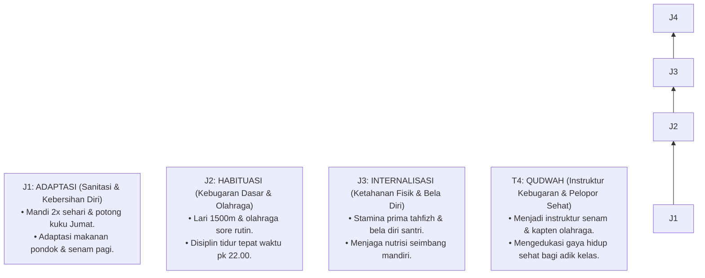

# P3-07-08-Tahapan-Perkembangan-Tangga-J1-J4 (Qawiyyul Jism)

## Tujuan
Memetakan tahapan perkembangan karakter **Qawiyyul Jism** melintasi jenjang **Jenjang Kemandirian TUMBUH (J1–J4) (T1, T2, T3, T4)**.

---

## 1. Roadmap Perkembangan Fisik Santri

---

## 2. Status Dokumen
* **Status**: 🌟 **A+ (Tervalidasi & Siap Diimplementasikan)**
* **Level**: Project 3 - `03 Capacity Framework / 07 Qawiyyul Jism / 08 Development Levels`
