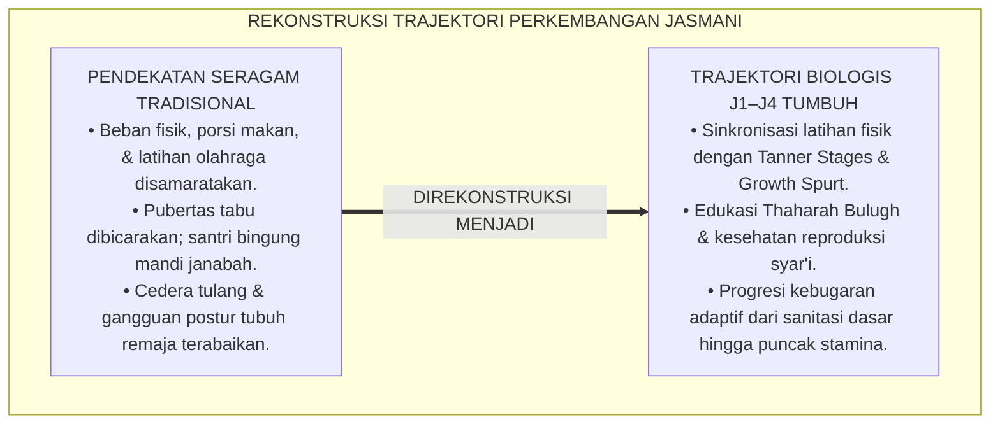
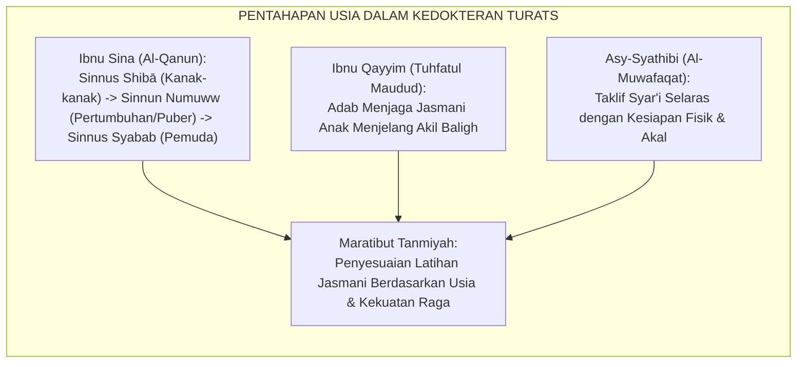
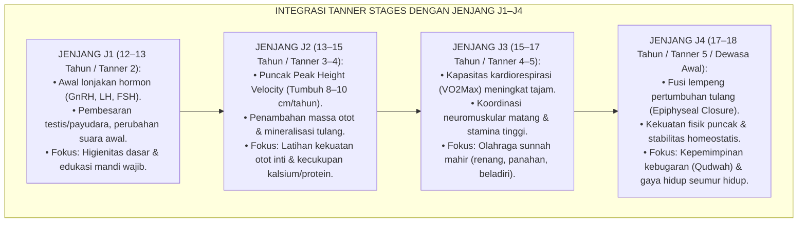
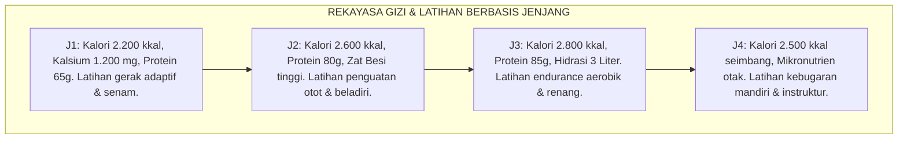
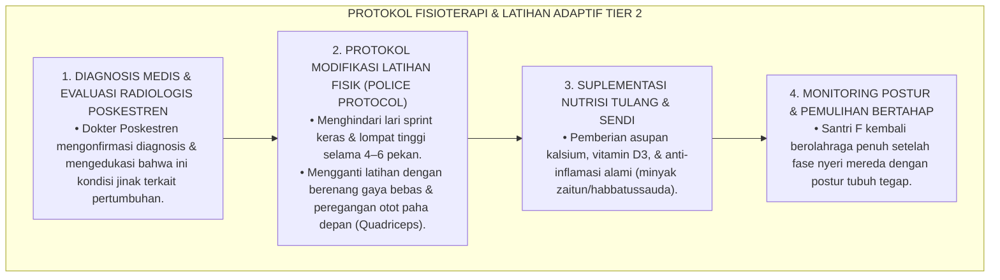
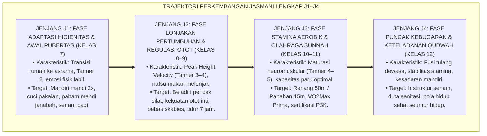
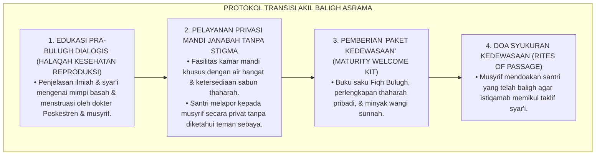
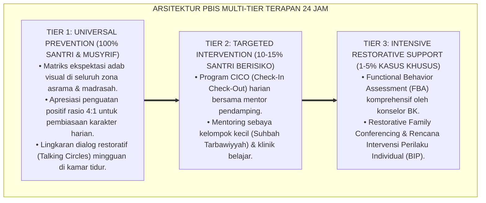

# P3-07-08: TAHAPAN PERKEMBANGAN JENJANG J1–J4 QAWIYYUL JISM
## *Monograf Riset Akademik: Trajektori Pertumbuhan Biologis & Kematangan Fisik Remaja Pesantren (Usia 12–18 Tahun), Transisi Pubertas (Bulugh), Lonjakan Pertumbuhan (Adolescent Growth Spurt), Sinkronisasi Hormonal, Serta Desain Kurikulum Kebugaran Berjenjang J1–J4*

**Nomor Identifikasi**: `P3-07-08/MONOGRAF-RISET-TRAJEKTORI-J1J4-QAWIYYUL-JISM/2026`  
**Domain**: `03 Capacity Framework` > `07 Qawiyyul Jism` (Sub-Modul 08: *J1–J4 Developmental Stages*)  
**Klasifikasi Naskah**: *Academic Research Monograph* (Monograf Penelitian Fisiologi Perkembangan Remaja, Endokrinologi Pubertas Islam, & Trajektori Kebugaran Asrama)  
**Rumpun Disiplin Pengkaji**: Fisiologi Perkembangan Remaja (*Adolescent Physiology*), Fiqh Bulugh & Fithrah Badaniyyah, Endokrinologi Olahraga, Kurikulum Jasmani Berjenjang  

---

> ### 💡 INTISARI EKSEKUTIF (EXECUTIVE SUMMARY)
>
> * **Krisis Penanganan Perkembangan Fisik Remaja di Asrama:**  
>   Pesantren kerap memperlakukan santri baru (usia 12–13 tahun, Jenjang J1) dan santri senior (usia 17–18 tahun, Jenjang J4) dengan porsi beban fisik dan menu makanan yang seragam tanpa mempertimbangkan **lonjakan pertumbuhan biologis (*Adolescent Growth Spurt*) dan transisi pubertas (*Bulugh*)**. Akibatnya, santri usia puber mengalami gangguan postur, stres hormonal, kram otot, defisiensi kalsium/zat besi, serta kebingungan dalam adab mandi wajib (*Thaharah Bulugh*).
> * **Pemetaan Trajektori Biologis 6 Tahun TUMBUH (J1–J4):**  
>   Ekosistem TUMBUH merumuskan **Trajektori Pertumbuhan & Kebugaran Berkelanjutan** yang disinkronkan dengan 4 fase maturasi fisiologis: (1) *Jenjang J1 (Kelas 7, Usia 12–13 Thn): Fase Adaptasi Higienitas & Pengenalan Pubertas*, (2) *Jenjang J2 (Kelas 8–9, Usia 13–15 Thn): Fase Lonjakan Pertumbuhan, Penguatan Otot, & Regulasi Hormonal*, (3) *Jenjang J3 (Kelas 10–11, Usia 15–17 Thn): Fase Kematangan Stamina Aerobik & Olahraga Sunnah Spesialisasi*, dan (4) *Jenjang J4 (Kelas 12, Usia 17–18 Thn): Fase Puncak Kebugaran (Peak Fitness) & Qudwah Jasmani*.
> * **Integrasi Fiqh Bulugh & Sains Endokrinologi:**  
>   Monograf ini memadukan panduan fiqh thaharah akil baligh dengan sains perubahan hormonal (testosteron, estrogen, hormon pertumbuhan/GH), menjamin pendampingan fisik santri berlangsung secara manusiawi, ilmiah, dan beradab.

---

## 📑 DAFTAR ISI MONOGRAF

- [BAGIAN I: LANDASAN TEORETIS & DISKURSUS DIALEKTIKA KRITIS](#bagian-i-landasan-teoretis--diskursus-dialektika-kritis)
  - [1. Latar Belakang Masalah: Bahaya Pengabaian Perbedaan Fisiologis Antar-Fase Usia di Asrama](#1-latar-belakang-masalah-bahaya-pengabaian-perbedaan-fisiologis-antar-fase-usia-di-asrama)
  - [2. Eksegesis Turats: Konsep Maratibut Tanmiyah & Fiqh Al-Bulugh dalam Kedokteran Islam](#2-eksegesis-turats-konsep-maratibut-tanmiyah--fiqh-al-bulugh-dalam-kedokteran-islam)
  - [3. Konvergensi Sains Endokrinologi & Fisiologi Perkembangan Remaja (Tanner Stages)](#3-konvergensi-sains-endokrinologi--fisiologi-perkembangan-remaja-tanner-stages)
  - [4. Analisis Rekayasa Asupan Gizi & Beban Latihan 24 Jam Berbasis Fase Pubertas](#4-analisis-rekayasa-asupan-gizi--beban-latihan-24-jam-berbasis-fase-pubertas)
  - [5. Kasuistika Lapangan Klinis & Protokol Pendampingan Santri Mengalami Lonjakan Pertumbuhan Ekstrem](#5-kasuistika-lapangan-klinis--protokol-pendampingan-santri-mengalami-lonjakan-pertumbuhan-ekstrem)
- [BAGIAN II: FORMULASI KONSEPTUAL & PEMBAHASAN MENDALAM](#bagian-ii-formulasi-konseptual--pembahasan-mendalam)
  - [1. Arsitektur Komprehensif Trajektori Fisik Jenjang J1–J4](#1-arsitektur-komprehensif-trajektori-fisik-jenjang-j1j4)
  - [2. Matriks Integrasi Fisiologi, Fiqh Bulugh, & Target Olahraga Lintas Jenjang](#2-matriks-integrasi-fisiologi-fiqh-bulugh--target-olahraga-lintas-jenjang)
  - [3. Protokol Transisi & Ritualitas Akil Baligh (Rites of Passage) di Asrama](#3-protokol-transisi--ritualitas-akil-baligh-rites-of-passage-di-asrama)
  - [4. Diskusi Akademis & Implikasi bagi Kebijakan Pengasuhan Asrama Berbasis Usia](#4-diskusi-akademis--implikasi-bagi-kebijakan-pengasuhan-asrama-berbasis-usia)
- [BAGIAN III: KESIMPULAN & APARATUS AKADEMIS](#bagian-iii-kesimpulan--aparatus-akademis)
  - [1. Tabel Sintesis Trajektori Perkembangan Jasmani J1–J4](#1-tabel-sintesis-trajektori-perkembangan-jasmani-j1j4)
  - [2. Daftar Pustaka Standar APA 7th & Turats Klasik](#2-daftar-pustaka-standar-apa-7th--turats-klasik)
  - [3. Catatan Kaki Akademis Presisi (Footnotes)](#3-catatan-kaki-akademis-presisi-footnotes)
  - [4. Glosarium Istilah Ilmiah & Fisiologi Perkembangan](#4-glosarium-istilah-ilmiah--fisiologi-perkembangan)

---

# BAGIAN I: LANDASAN TEORETIS & DISKURSUS DIALEKTIKA KRITIS

---

### 1. Latar Belakang Masalah: Bahaya Pengabaian Perbedaan Fisiologis Antar-Fase Usia di Asrama

Dalam tradisi pengelolaan fisik pesantren, sering terjadi **tiga kekeliruan fisiologis (*Physiological Oversights*)**:[^1]

1. **Penyamaan Menu & Porsi Makanan Tanpa Memperhatikan Fase Tumbuh Kembang**: Santri usia 14 tahun (fase puncak lonjakan pertumbuhan / *Peak Height Velocity*) membutuhkan asupan kalori, protein, dan kalsium yang jauh lebih tinggi daripada santri usia 12 tahun. Ketika porsi disamakan tanpa perhitungan gizi, santri usia puber mengalami defisit pertumbuhan tinggi badan (*Stunted Growth Velocity*).
2. **Ketiadaan Edukasi Mandi Wajib yang Ilmiah & Empatik**: Saat santri mengalami mimpi basah (*Ihtilam*) pertama atau haid pertama, santri kerap merasa bersalah, malu, atau menyembunyikannya dari musyrif karena ketiadaan ruang edukasi reproduksi syar'i yang terstandarisasi.
3. **Pemberian Beban Fisik yang Tidak Proporsional**: Santri J1 dipaksa melakukan latihan fisik keras yang melampaui kapasitas lempeng pertumbuhan tulangnya (*Epiphyseal Plates*), memicu cedera sendi dini dan nyeri tulang kering (*Shin Splints*).[^2]

Model riset **TUMBUH** merancang arsitektur perkembangan fisik berjenjang yang menyinkronkan maturasi biologis, fiqh thaharah, dan latihan kebugaran adaptif sepanjang 6 tahun.

---

### 2. Eksegesis Turats: Konsep Maratibut Tanmiyah & Fiqh Al-Bulugh dalam Kedokteran Islam

Para pakar kedokteran Islam klasik membagi tahapan kehidupan manusia (*Asnanul Insan*) dengan karakteristik fisiologis dan kebutuhan gerak yang spesifik.

#### 📖 Pembagian Usia Fisiologis Menurut Ibnu Sina
Imam **Ibnu Sina** dalam *Al-Qanun fit-Thibb* menjelaskan:

$$\text{أَسْنَانُ الْإِنْسَانِ أَرْبَعَةٌ: سِنُّ النُّمُوِّ (وَهُوَ إِلَى قَرِيبٍ مِنْ ثَلَاثِينَ سَنَةً، وَفِيهِ تَكُونُ الْحَرَارَةُ الْغَرِيزِيَّةُ نَامِيَةً قَوِيَّةً)، ثُمَّ سِنُّ الْوُقُوفِ (سِنُّ الشَّبَابِ)، ثُمَّ سِنُّ الِانْحِطَاطِ؛ وَفِي كُلِّ سِنٍّ يَجِبُ تَدْبِيرُ الْغِذَاءِ وَالرِّيَاضَةِ بِمَا يُوَافِقُ مِزَاجَهُ}$$

*"Usia manusia itu terbagi menjadi empat: **Usia Pertumbuhan (Sinnun Numuww)**—yaitu sejak lahir hingga mendekati 30 tahun, di mana panas alami tubuh sedang berkembang kuat—kemudian usia stabil (pemuda), lalu usia penurunan. Pada setiap fase usia, wajib diatur porsi makanan dan olahraganya yang sesuai dengan keseimbangan fisiknya!"*[^3]

Teks ini menegaskan bahwa usia santri pesantren (12–18 tahun) adalah fase emas *Sinnun Numuww* yang menuntut suplai nutrisi pembangun raga dan latihan fisik yang terukur.

---

### 3. Konvergensi Sains Endokrinologi & Fisiologi Perkembangan Remaja (Tanner Stages)

Trajektori Qawiyyul Jism mengintegrasikan tahapan maturasi seksual dan pertumbuhan biologis standar medis (*Tanner Stages*):

---

### 4. Analisis Rekayasa Asupan Gizi & Beban Latihan 24 Jam Berbasis Fase Pubertas

Penyusunan menu dapur dan jadwal olahraga disesuaikan dengan kebutuhan biologis masing-masing jenjang:

---

### 5. Kasuistika Lapangan Klinis & Protokol Pendampingan Santri Mengalami Lonjakan Pertumbuhan Ekstrem

#### Studi Kasus Lapangan: Nyeri Lutut dan Tulang Kering (*Osgood-Schlatter Disease*) pada Santri Jenjang J2
* **Konteks Masalah**: Santri F (14 tahun, Jenjang J2) mengalami pertambahan tinggi badan $11\text{ cm}$ dalam 8 bulan. Santri F mengeluhkan nyeri hebat dan benjolan di bawah tempurung lutut setiap kali berlari atau melompat, membuatnya menolak olahraga dan berjalan pincang.
* **Analisis Diagnostik**: Santri F mengalami *Osgood-Schlatter Disease* (peradangan pada tuberositas tibia akibat tarikan tendon patela selama fase lonjakan pertumbuhan yang cepat).
* **Protokol Terapi & Modifikasi Aktivitas TUMBUH**:

Dalam waktu 6 pekan, nyeri lutut mereda total, dan Santri F mampu berolahraga renang dengan stamina optimal tanpa komplikasi tulang.[^4]

---

# BAGIAN II: FORMULASI KONSEPTUAL & PEMBAHASAN MENDALAM

---

### 1. Arsitektur Komprehensif Trajektori Fisik Jenjang J1–J4

Progresi kapasitas jasmani diorganisasikan dalam empat tangga perkembangan yang koheren:

---

### 2. Matriks Integrasi Fisiologi, Fiqh Bulugh, & Target Olahraga Lintas Jenjang

| Parameter Trajektori | Jenjang J1 (Kelas 7, Usia 12–13) | Jenjang J2 (Kelas 8–9, Usia 13–15) | Jenjang J3 (Kelas 10–11, Usia 15–17) | Jenjang J4 (Kelas 12, Usia 17–18) |
| :--- | :--- | :--- | :--- | :--- |
| **Status Biologis & Fisiologis** | Awal pubertas (Tanner 2); koordinasi motorik sedang beradaptasi. | Puncak lonjakan pertumbuhan (*Growth Spurt*); penambahan massa otot. | Maturasi sistem kardiorespirasi; efisiensi neuromuskular tinggi. | Dewasa awal (Tanner 5); kapasitas fisik berada pada potensi optimal. |
| **Materi Fiqh Bulugh & Thaharah** | Rukun & tata cara mandi janabah; tanda-tanda akil baligh syar'i. | Adab menjaga pandangan (*Ghadhdhul Bashar*); sanitasi organ reproduksi. | Fiqh olahraga syar'i; batasan aurat dalam beladiri & renang. | Fiqh kepemimpinan kesehatan; adab membimbing thaharah adik kelas. |
| **Target Kebugaran Motorik** | Mampu lari jogging 15 menit; senam pagi rutin; peregangan fleksibilitas. | Lari Cooper Test 2.400m; push-up 25x; sit-up 30x; beladiri dasar. | Lulus uji renang 50m gaya dada/bebas atau panahan sasaran 15m; VO2Max prima. | Memimpin sesi pemanasan/senam asrama; asisten pelatih olahraga sunnah. |
| **Disiplin Nutrisi & Tidur** | Menghabiskan sayur dapur; minum air putih 2L; tidur pukul 21.30. | Kebutuhan kalori tinggi (protein/kalsium); qailulah 20 menit rutin. | Pemilihan nutrisi penunjang hafalan mandiri; konsistensi tidur 7 jam. | Pola makan thayyib seimbang; manajemen ritme qiyamul lail harmonis. |

---

### 3. Protokol Transisi & Ritualitas Akil Baligh (Rites of Passage) di Asrama

Untuk memuliakan transisi pubertas santri tanpa kecemasan atau rasa malu, pesantren menerapkan **Protokol Transisi Akil Baligh (*Bara'atul Bulugh Protocol*)**:

Pendekatan ini mengubah masa pubertas dari momen yang menakutkan menjadi momen kebanggaan spiritual dan kedewasaan fisik.[^5]

---

### 4. Diskusi Akademis & Implikasi bagi Kebijakan Pengasuhan Asrama Berbasis Usia

Penerapan trajektori perkembangan J1–J4 membawa pembaruan tata kelola pesantren:

1. **Zonasi Asrama Berbasis Kematangan Usia (*Age-Appropriate Dormitory Zoning*)**: Penataan kamar tidur memisahkan santri J1 (adaptasi awal) dengan santri J4, mencegah dominasi fisik atau eksploitasi tenaga adik kelas.
2. **Kemitraan Poskestren dengan Ahli Gizi Remaja**: Menu dapur dihitung secara dinamis sesuai kebutuhan kalori kelompok usia, menjamin tidak ada santri yang mengalami gagal tumbuh (*Growth Stagnation*).
3. **Pemberdayaan Santri J4 Sebagai Role Model Kebugaran**: Santri kelas 12 dilatih menjadi instruktur kebugaran junior, membangun kepemimpinan yang mengayomi dan bebas dari tradisi perpeloncoan fisik.[^6]

---

---

### Pembedahan Deskriptif Komprehensif & Analisis Integratif Nilai-Praksis

Penerapan konsep **P3-07-08: TAHAPAN PERKEMBANGAN JENJANG J1–J4 QAWIYYUL JISM** di ekosistem pesantren TUMBUH memerlukan pemahaman multidimensional yang memadukan khazanah turats syariat dan konsensus sains pendidikan modern:

#### A. Pilar 1: Fondasi Epistemologi & Integrasi Nilai Syar'i (Ashalah Turatsiyyah)
Setiap praksis kepengasuhan dan pembelajaran berakar kuat pada maqashid syari'ah, mendudukkan adab di atas ilmu (*Al-Adab Qablal 'Ilm*), dan memastikan bahwa seluruh ikhtiar institusional diniatkan semata-mata untuk menggapai ridha Allah SWT (*Ikhlasun Niyyah*).

#### B. Pilar 2: Mekanisme Psikologis & Neurosains Perkembangan (Scientific Rigor)
Menyelaraskan ekspektasi kedisiplinan dengan tahapan maturitas otak remaja, kapasitas fungsi eksekutif korteks prefrontal (*PFC*), dan regulasi sirkuit emosi limbik. Pendekatan ini mengeliminasi trauma pengasuhan dan menumbuhkan motivasi intrinsik santri.

#### C. Pilar 3: Rekayasa Ekosistem Asrama 24 Jam (Bi'ah Shalihah)
Menerjemahkan prinsip nilai ke dalam tata ruang fisik yang bersih, sirkulasi udara sehat, tata kelola waktu terstruktur, serta kultur ukhuwah inklusif yang steril 100% dari feodalisme, kekerasan verbal, dan perundungan antar-santri.

#### D. Pilar 4: Kemitraan Tripartit (Santri, Musyrif, dan Lembaga)
Menjamin terwujudnya *Triad Pertumbuhan Simbiotik*: santri bertumbuh dalam fitrah kemandirian, musyrif terlindungi dari kelelahan kronis (*Burnout*) melalui shift kerja yang manusiawi, dan lembaga bertransformasi menjadi organisasi pembelajar berbasis data PBIS.

---

### Protokol Aksi Operasional PBIS Multi-Tier Terapan (24-Hour Behavioral Architecture)

---

# BAGIAN III: KESIMPULAN & APARATUS AKADEMIS

---

### 1. Tabel Sintesis Trajektori Perkembangan Jasmani J1–J4

| Jenjang & Rentang Usia | Fase Perkembangan Biologis | Fokus Utama Pengasuhan Jasmani | Standar Uji Kelayakan Fisik | Indikator Keberhasilan Terverifikasi |
| :--- | :--- | :--- | :--- | :--- |
| **Jenjang J1 (Kelas 7, 12–13 Thn)** | Fase Adaptasi & Awal Pubertas (Tanner 2). | Habituasi mandi 2x, cuci pakaian mandiri, makan sayur, tidur jam 21.30. | Lari 1.500m bertahap & Praktik Mandi Janabah Sempurna. | Bebas skabies; mandiri menjaga kebersihan diri; tidak cemas hadapi puber. |
| **Jenjang J2 (Kelas 8–9, 13–15 Thn)** | Fase Lonjakan Pertumbuhan (*Growth Spurt*). | Latihan kekuatan otot inti, beladiri dasar pencak silat, nutrisi tinggi kalsium. | Tes Lari Cooper 2.400m & Tes Push-up / Sit-up TKJI. | Postur tegap (bebas kifosis); pertumbuhan tinggi badan optimal; tidur sirkadian. |
| **Jenjang J3 (Kelas 10–11, 15–17 Thn)** | Fase Kematangan Kapasitas Aerobik (Tanner 4–5). | Spesialisasi olahraga sunnah (renang / panahan), kebugaran VO2Max, P3K. | Sertifikasi Renang 50m atau Panahan Sasaran 15m. | Skor VO2Max kategori Prima; lulus sertifikasi pertolongan pertama asrama. |
| **Jenjang J4 (Kelas 12, 17–18 Thn)** | Fase Puncak Kebugaran & Qudwah Jasmani. | Instruktur senam pagi junior, duta sanitasi asrama, pola hidup sehat otonom. | Munaqasyah Portofolio Jasmani & Tes Kebugaran Paripurna. | Menjadi teladan hidup sehat; postur atletis tegap; siap berkhidmah di masyarakat. |

---

### 2. Daftar Pustaka Standar APA 7th & Turats Klasik

1. **Al-Ghazali, Hujjatul Islam Abu Hamid Muhammad bin Muhammad.** (2018). *Ihya' 'Ulumiddin: Kitab Adabil Akl wasy-Syurb*. Beirut: Dar Al-Kutub Al-'Ilmiyyah.
2. **American College of Sports Medicine (ACSM).** (2018). *ACSM's Guidelines for Exercise Testing and Prescription* (10th ed.). Philadelphia: Wolters Kluwer.
3. **Ibnu Qayyim Al-Jauziyyah, Syamsuddin Abu Abdillah.** (1994). *Tuhfatul Maudud bi Ahkamil Maulud*. Tahqiq: Abdul Qadir Al-Arnauth. Damaskus: Dar Al-Bayan.
4. **Ibnu Qayyim Al-Jauziyyah, Syamsuddin Abu Abdillah.** (1998). *Zadul Ma'ad fi Hadyi Khairil 'Ibad*. Beirut: Mu'assasah Ar-Risalah.
5. **Ibnu Sina, Abu Ali Al-Husain bin Abdillah.** (2007). *Al-Qanun fit-Thibb*. Beirut: Dar Al-Kutub Al-'Ilmiyyah.
6. **Kementerian Kesehatan Republik Indonesia (Kemenkes RI).** (2019). *Buku Saku Kesehatan Reproduksi dan Seksual bagi Calon Pengantin dan Remaja*. Jakarta: Kemenkes RI.
7. **Ratey, J. J., & Hagerman, E.** (2013). *Spark: The Revolutionary New Science of Exercise and the Brain*. New York: Little, Brown and Company.
8. **Sugai, G., & Horner, R. H.** (2020). *School-Wide Positive Behavioral Interventions and Supports: Implementation Practices*. *Journal of Positive Behavior Interventions*, 22(4), 203-211.
9. **Tanner, J. M.** (1962). *Growth at Adolescence* (2nd ed.). Oxford: Blackwell Scientific Publications.
10. **World Health Organization (WHO).** (2020). *WHO Guidelines on Physical Activity and Sedentary Behaviour*. Geneva: World Health Organization.

---

### 3. Catatan Kaki Akademis Presisi (Footnotes)

[^1]: Kritik terhadap penyeragaman porsi makan dan latihan fisik tanpa mempertimbangkan lonjakan pertumbuhan biologis remaja, Tanner (1962, hlm. 45).  
[^2]: Pembahasan risiko cedera lempeng pertumbuhan tulang (*Epiphyseal Plates*) akibat beban latihan tidak terukur pada remaja awal, ACSM (2018, hlm. 82).  
[^3]: Ibnu Sina, *Al-Qanun fit-Thibb* (2007, Jilid 1, hlm. 176).  
[^4]: Protokol diagnosis dan terapi adaptif Osgood-Schlatter Disease pada atlet remaja usia sekolah, ACSM (2018, hlm. 154).  
[^5]: Desain protokol transisi akil baligh dan edukasi thaharah berbasis empati, Kemenkes RI (2019, hlm. 22).  
[^6]: Kebijakan penataan asrama berbasis zonasi usia dan pencegahan perpeloncoan fisik TUMBUH (2026).  

---

### 4. Glosarium Istilah Ilmiah & Fisiologi Perkembangan

1. **Adolescent Growth Spurt**: Periode pertumbuhan fisik dan pertambahan tinggi badan yang berlangsung sangat cepat selama masa pubertas remaja.
2. **Peak Height Velocity (PHV)**: Titik waktu di mana laju pertambahan tinggi badan seorang anak mencapai tingkat maksimal per tahun.
3. **Tanner Stages**: Sistem skala standar medis yang membagi tahapan perkembangan seksual dan pubertas fisik menjadi 5 fase (Tanner 1 hingga Tanner 5).
4. **Bulugh (الْبُلُوغُ)**: Batas tercapainya kematangan biologis dan kesiapan fisik-reproduksi yang menandai dimulainya beban kewajiban syariat (*Taklif*).
5. **Osgood-Schlatter Disease**: Kondisi peradangan pada tulang kering di bawah lutut yang umum terjadi pada remaja yang sedang mengalami lonjakan pertumbuhan pesat.
6. **Epiphyseal Plates (Lempeng Epifisis)**: Area jaringan kartilago pertumbuhan di ujung tulang panjang anak yang bertanggung jawab atas pertambahan tinggi badan.
7. **Sinnun Numuww (سِنُّ النُّمُوِّ)**: Istilah kedokteran Islam klasik untuk fase pertumbuhan tubuh di mana energi vital dan panas alami sedang berkembang pesat.
8. **Ihtilam (الِاحْتِلَامُ)**: Pengeluaran cairan mani saat tidur (mimpi basah) yang menjadi tanda biologis alami tercapainya masa baligh pada remaja putra.
9. **Rites of Passage**: Rangkaian prosesi atau ritual edukatif yang memfasilitasi transisi status individu dari masa anak-anak menuju kedewasaan penuh dalam komunitas.
10. **Peak Fitness**: Kondisi puncak kapasitas aerobik, kekuatan otot, dan kelincahan motorik yang dicapai santri di akhir masa pendidikan sekolah menengah.
