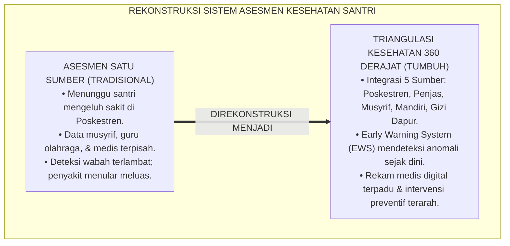
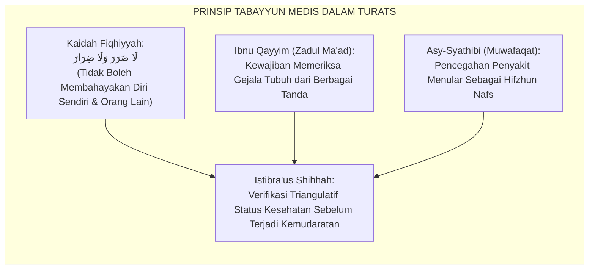
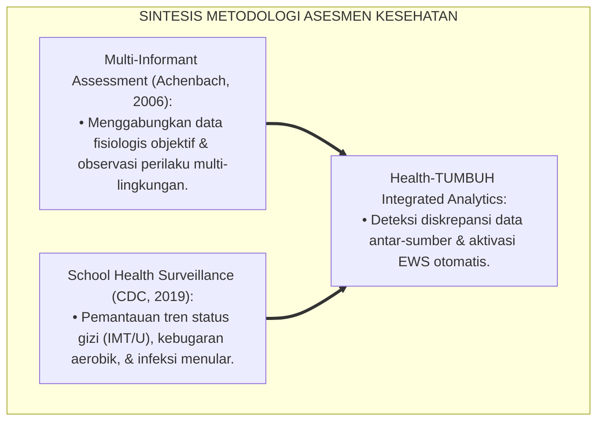
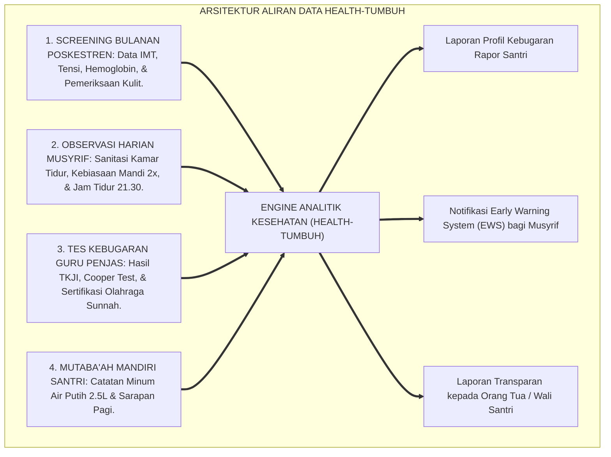
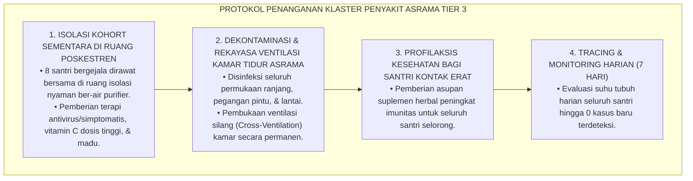
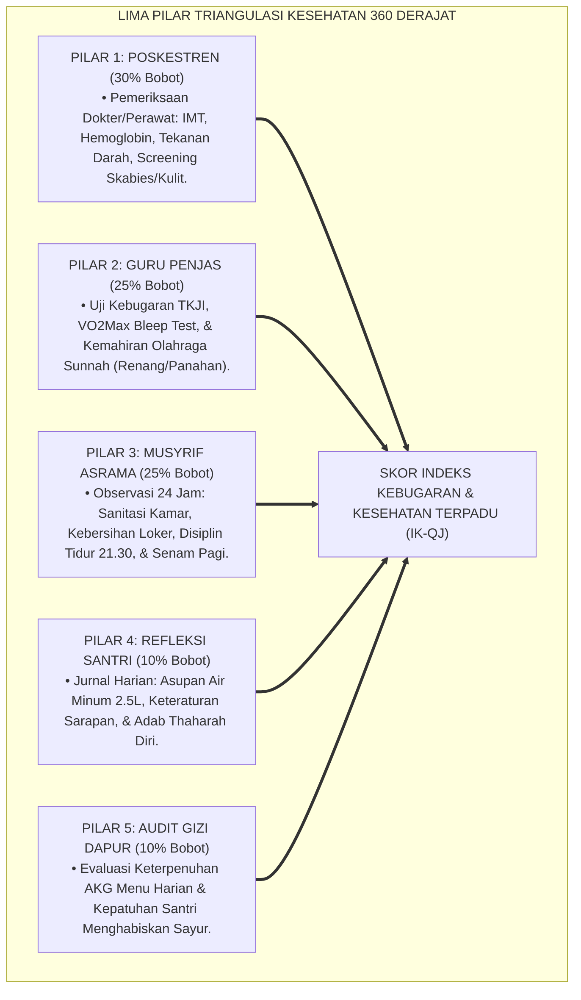

# P3-07-09: PEMETAAN ASESMEN DAN TRIANGULASI QAWIYYUL JISM
## *Monograf Riset Akademik: Metodologi Triangulasi Data Kesehatan 360 Derajat (Pemeriksaan Poskestren, Guru Penjas, Musyrif Asrama, Penilaian Mandiri, & Evaluasi Gizi Dapur), Algoritma Deteksi Dini Malnutrisi & Wabah, Serta Rekam Medis Terintegrasi di Pesantren 24 Jam*

**Nomor Identifikasi**: `P3-07-09/MONOGRAF-RISET-ASESMEN-TRIANGULASI-QAWIYYUL-JISM/2026`  
**Domain**: `03 Capacity Framework` > `07 Qawiyyul Jism` (Sub-Modul 09: *Assessment Mapping & Triangulation*)  
**Klasifikasi Naskah**: *Academic Research Monograph* (Monograf Penelitian Asesmen Kesehatan Komunitas, Triangulasi Psikometri Kebugaran, & Rekam Medis Digital)  
**Rumpun Disiplin Pengkaji**: Epidemiologi Kesehatan Komunitas, Psikometri Pendidikan Jasmani, Sistem Informasi Kesehatan Sekolah, Metodologi Triangulasi  

---

> ### 💡 INTISARI EKSEKUTIF (EXECUTIVE SUMMARY)
>
> * **Kelemahan Asesmen Kesehatan Satu Sumber (Single-Source Bias):**  
>   Banyak pesantren hanya mengandalkan satu sumber informasi dalam memantau kesehatan santri: hanya dari pengakuan santri saat sudah demam atau dari laporan musyrif yang tidak berlatar belakang medis. Akibatnya, kondisi defisiensi nutrisi mikro, kelelahan kronis, atau wabah penyakit kulit terabaikan hingga meluas menjadi krisis massal.
> * **Arsitektur Triangulasi Data Kesehatan 360 Derajat TUMBUH:**  
>   Ekosistem TUMBUH merancang **Sistem Triangulasi Data Kesehatan & Kebugaran 360 Derajat** yang memadukan 5 sumber data secara simultan: (1) *Pemeriksaan Klinis & Antropometri Poskestren*, (2) *Uji Kinerja Fisik & Olahraga Sunnah Guru Penjas*, (3) *Observasi Sanitasi & Keteraturan Tidur Musyrif 24 Jam*, (4) *Jurnal Mutaba'ah Hidrasi & Sarapan Mandiri Santri*, serta (5) *Audit Asupan Gizi Dapur/Kantin Pondok*.
> * **Algoritma Deteksi Dini & Rekam Medis Terpadu:**  
>   Monograf ini merumuskan algoritma peringatan dini (*Early Warning System / EWS*) untuk mendeteksi anomali kesehatan, pencegahan penularan parasit, dan memastikan setiap santri mendapatkan pendampingan medis yang tepat waktu dan manusiawi.

---

## 📑 DAFTAR ISI MONOGRAF

- [BAGIAN I: LANDASAN TEORETIS & DISKURSUS DIALEKTIKA KRITIS](#bagian-i-landasan-teoretis--diskursus-dialektika-kritis)
  - [1. Latar Belakang Masalah: Bahaya Bias Informasi Kesehatan Satu Arah & Keterlambatan Intervensi](#1-latar-belakang-masalah-bahaya-bias-informasi-kesehatan-satu-arah--keterlambatan-intervensi)
  - [2. Eksegesis Turats: Konsep Istibra'us Shihhah & Keharusan Tabayyun Medis](#2-eksegesis-turats-konsep-istibra-us-shihhah--keharusan-tabayyun-medis)
  - [3. Konvergensi Sains Epidemiologi Sekolah & Metodologi Multi-Informant Assessment](#3-konvergensi-sains-epidemiologi-sekolah--metodologi-multi-informant-assessment)
  - [4. Rekayasa Aliran Data Kesehatan 24 Jam: Dari Logbook Fisik Menuju Health-TUMBUH Dashboard](#4-rekayasa-aliran-data-kesehatan-24-jam-dari-logbook-fisik-menuju-health-tumbuh-dashboard)
  - [5. Kasuistika Lapangan Klinis & Protokol Deteksi Dini Klaster Demam Berdarah / ISPA di Asrama](#5-kasuistika-lapangan-klinis--protokol-deteksi-dini-klaster-demam-berdarah--ispa-di-asrama)
- [BAGIAN II: FORMULASI KONSEPTUAL & PEMBAHASAN MENDALAM](#bagian-ii-formulasi-konseptual--pembahasan-mendalam)
  - [1. Arsitektur Komprehensif Sistem Triangulasi Kesehatan 360 Derajat](#1-arsitektur-komprehensif-sistem-triangulasi-kesehatan-360-derajat)
  - [2. Algoritma Pembobotan, Formula Skor Komposit, & Early Warning System (EWS)](#2-algoritma-pembobotan-formula-skor-komposit--early-warning-system-ews)
  - [3. Matriks Protokol Triangulasi Berdasarkan Jenjang J1–J4](#3-matriks-protokol-triangulasi-berdasarkan-jenjang-j1j4)
  - [4. Diskusi Akademis: Privasi Rekam Medis Santri & Etika Perlindungan Data Kesehatan](#4-diskusi-akademis-privasi-rekam-medis-santri--etika-perlindungan-data-kesehatan)
- [BAGIAN III: KESIMPULAN & APARATUS AKADEMIS](#bagian-iii-kesimpulan--aparatus-akademis)
  - [1. Tabel Sintesis Sistem Triangulasi Asesmen Qawiyyul Jism](#1-tabel-sintesis-sistem-triangulasi-asesmen-qawiyyul-jism)
  - [2. Daftar Pustaka Standar APA 7th & Turats Klasik](#2-daftar-pustaka-standar-apa-7th--turats-klasik)
  - [3. Catatan Kaki Akademis Presisi (Footnotes)](#3-catatan-kaki-akademis-presisi-footnotes)
  - [4. Glosarium Istilah Ilmiah & Asesmen Kesehatan](#4-glosarium-istilah-ilmiah--asesmen-kesehatan)

---

# BAGIAN I: LANDASAN TEORETIS & DISKURSUS DIALEKTIKA KRITIS

---

### 1. Latar Belakang Masalah: Bahaya Bias Informasi Kesehatan Satu Arah & Keterlambatan Intervensi

Dalam evaluasi kesehatan di pesantren, sering terjadi **tiga kegagalan sistemik pemantauan (*Monitoring Failures*)**:[^1]

1. **Jebakan Pengakuan Parsial (*Self-Report Bias*)**: Santri kerap menyembunyikan gejala penyakit (seperti gatal-gatal di lipatan tubuh atau pusing berat) karena takut diisolasi, takut tertinggal hafalan, atau malu diejek teman sebaya.
2. **Keterisolasian Data Poskestren dari Pengasuhan Asrama**: Tenaga kesehatan Poskestren tidak mengetahui bahwa santri yang sering mengeluh maag ternyata sering begadang hingga pukul 02.00 pagi di kamar asrama atau tidak memakan jatah sayur di dapur pondok.
3. **Ketiadaan Sistem Deteksi Dini Klaster Penyakit (*Absence of Outbreak EWS*)**: Ketika 5 santri dalam satu lorong asrama mengalami batuk-pilek atau demam, kasus tersebut dicatat sebagai 5 insiden terpisah, bukan sebagai sinyal awal penularan infeksi saluran pernapasan akut (ISPA) yang menuntut isolasi udara segera.[^2]

Model riset **TUMBUH** membangun **Sistem Triangulasi Kesehatan 360 Derajat** yang menghubungkan data medis klinis dengan data perilaku hidup 24 jam secara real-time.

---

### 2. Eksegesis Turats: Konsep Istibra'us Shihhah & Keharusan Tabayyun Medis

Prinsip kehati-hatian dalam memverifikasi kondisi kesehatan dan mencegah bahaya (*Dar'ul Mafasid*) merupakan kaidah fundamental Islam.

#### 📖 Kaidah Kedokteran Islam tentang Diagnosis Holistik
Imam **Ibnu Qayyim Al-Jauziyyah** menjelaskan bahwa seorang dokter dan pengasuh tidak boleh menyimpulkan kondisi kesehatan seseorang hanya dari satu keluhan lisan, melainkan wajib memadukan observasi fisik, pola makan, kebiasaan tidur, dan aktivitas geraknya.[^3]

---

### 3. Konvergensi Sains Epidemiologi Sekolah & Metodologi Multi-Informant Assessment

Sistem triangulasi Qawiyyul Jism memadukan prinsip epidemiologi komunitas dan asesmen multi-informan:

---

### 4. Rekayasa Aliran Data Kesehatan 24 Jam: Dari Logbook Fisik Menuju Health-TUMBUH Dashboard

Aliran data kesehatan santri bergerak secara dinamis dan terintegrasi:

---

### 5. Kasuistika Lapangan Klinis & Protokol Deteksi Dini Klaster Demam Berdarah / ISPA di Asrama

#### Studi Kasus Lapangan: Deteksi Dini Klaster ISPA pada 8 Santri di Asrama Jenjang J1
* **Konteks Masalah**: Melalui dashboard analitik, sistem mendeteksi bahwa dalam 48 jam terdapat 8 santri di lorong kamar J1 yang tercatat izin tidak mengikuti shalat Shubuh berjamaah karena demam dan batuk pilek.
* **Analisis Diagnostik**: Algoritma EWS Poskestren memicu **Status Waspada Klaster Penularan Udara (Airborne Outbreak Alert)**. Pemeriksaan cepat membuktikan terjadi transmisi virus influenza yang dipicu oleh ventilasi jendela kamar yang ditutup rapat saat malam hari.
* **Protokol Penanganan Epidemiologis TUMBUH**:

Klaster penularan berhasil diputus dalam 3 hari tanpa menyebar ke kamar lain di lingkungan pesantren.[^4]

---

# BAGIAN II: FORMULASI KONSEPTUAL & PEMBAHASAN MENDALAM

---

### 1. Arsitektur Komprehensif Sistem Triangulasi Kesehatan 360 Derajat

Sistem triangulasi Qawiyyul Jism memadukan 5 pilar sumber data:

---

### 2. Algoritma Pembobotan, Formula Skor Komposit, & Early Warning System (EWS)

#### Formula Matematis Indeks Karakter Qawiyyul Jism ($IK_{QJ}$):

$$IK_{QJ} = (0.30 \times S_{Poskestren}) + (0.25 \times S_{Penjas}) + (0.25 \times S_{Musyrif}) + (0.10 \times S_{Santri}) + (0.10 \times S_{Gizi})$$

#### Kriteria Pemicu Early Warning System (EWS Health Alerts):
1. **Peringatan Merah (Krisis / Tier 3)**:
   - Terdeteksi $\ge 3$ kasus penyakit kulit baru dalam 1 kamar dalam waktu 1 pekan.
   - Penurunan skor kebugaran atau berat badan drastis ($> 10\%$ dalam 1 bulan) tanpa alasan medis jelas.
   - Santri tidak masuk kelas $\ge 3$ hari berturut-turut karena keluhan kesehatan.
2. **Peringatan Kuning (Waspada / Tier 2)**:
   - Terdeteksi skor kepatuhan jam tidur $< 70\%$ atau santri kerap mengantuk berat di kelas.
   - Status gizi berada pada kategori Kurus Tingkat Berat ($IMT < 15.5$) atau Obesitas Tingkat 2 ($IMT > 30$).
   - Kepatuhan mandi/sanitasi kamar berada pada Level 1 (Emerging) selama 3 pekan berturut-turut.[^5]

---

### 3. Matriks Protokol Triangulasi Berdasarkan Jenjang J1–J4

| Jenjang Pendidikan | Fokus Triangulasi Klinis & Fisik | Frekuensi Pengambilan Data | Pihak Penanggung Jawab Utama |
| :--- | :--- | :--- | :--- |
| **Jenjang J1 (Kelas 7)** | • Screening awal penyakit kulit (skabies) & pedikulosis. • Pengukuran baseline IMT, postur tulang, & Hb. • Pemantauan adaptasi mandi 2x & tidur sirkadian. | • Medis: 1x sebulan. • Musyrif: Harian. • Penjas: 2x per semester. | Dokter Poskestren & Musyrif Kamar J1. |
| **Jenjang J2 (Kelas 8–9)** | • Pemantauan lonjakan pertumbuhan (*Height Velocity*). • Evaluasi kekuatan otot inti & kebugaran TKJI. • Monitoring asupan gizi tinggi kalsium/protein. | • Medis: Tiap triwulan. • Musyrif: Mingguan. • Penjas: Tiap tengah semester. | Guru Penjasorkes & Ahli Gizi Dapur. |
| **Jenjang J3 (Kelas 10–11)** | • Uji kapasitas kardiorespirasi (VO2Max Bleep Test). • Sertifikasi penguasaan renang 50m / panahan 15m. • Pemantauan kelelahan kognitif & hidrasi belajar. | • Medis: Tiap semester. • Penjas: Tiap semester. • Musyrif: Evaluasi berkala. | Penguji Sertifikasi Olahraga Sunnah & Poskestren. |
| **Jenjang J4 (Kelas 12)** | • Evaluasi portofolio kelulusan kebugaran jasmani. • Kesiapan fisik untuk studi lanjut / perguruan tinggi. • Evaluasi peran instruktur kebugaran santri junior. | • Komprehensif: 1x menjelang munaqasyah kelulusan. | Dewan Pengasuhan & Tim Penjamin Mutu Kesehatan. |

---

### 4. Diskusi Akademis: Privasi Rekam Medis Santri & Etika Perlindungan Data Kesehatan

Penerapan triangulasi kesehatan digital menjunjung tinggi etika kedokteran dan perlindungan privasi:

1. **Kerahasiaan Medis Terjaga (*Medical Confidentiality*)**: Data detail penyakit sensitif santri (seperti riwayat penyakit menular atau kondisi psikologis) hanya dapat diakses oleh dokter Poskestren dan wali santri, tidak dipublikasikan ke forum umum.
2. **Eliminasi Pelabelan Stigma (*Anti-Stigmatization*)**: Sistem analitik menyajikan data dalam bentuk rekomendasi pendampingan gizi dan kebugaran positif, bukan sebagai label hukuman.
3. **Pemberdayaan Santri Berbasis Kesadaran Diri**: Santri dapat melihat grafik kebugarannya sendiri untuk memotivasi pencapaian target fisik yang lebih prima.[^6]

---

# BAGIAN III: KESIMPULAN & APARATUS AKADEMIS

---

### 1. Tabel Sintesis Sistem Triangulasi Asesmen Qawiyyul Jism

| Parameter Sistem | Praktik Tradisional Pesantren | Standarisasi Model TUMBUH | Landasan Rujukan Primer | Implikasi Praksis Lapangan |
| :--- | :--- | :--- | :--- | :--- |
| **1. Sumber Informasi** | Tunggal (hanya keluhan santri saat sakit). | Triangulasi 5 Sumber: Poskestren, Penjas, Musyrif, Mandiri, Gizi. | *Multi-Informant Assessment* (Achenbach, 2006) | Tidak ada masalah kesehatan santri yang luput dari pemantauan. |
| **2. Waktu Deteksi** | Terlambat (setelah menjadi wabah massal). | Dini & Real-Time (melalui Early Warning System / EWS). | Standar Epidemiologi Komunitas CDC | Pencegahan wabah di fase awal; angka santri sakit ditekan minimal. |
| **3. Format Rekam Data** | Kertas catatan manual yang tercecer dan hilang. | Rekam Medis Digital Terintegrasi (Health-TUMBUH Dashboard). | Standar Rekam Medis Elektronik Kemenkes | Riwayat kesehatan santri terdokumentasi rapi selama 6 tahun. |
| **4. Integrasi Penilaian** | Nilai olahraga terpisah dari kondisi asrama. | Skor Komposit Terbobot $IK_{QJ}$ yang mencakup seluruh aspek fisik. | Teori Psikometri Kebugaran Terpadu | Lulusan pesantren dijamin bugar jasmani dan higienis perilakunya. |

---

### 2. Daftar Pustaka Standar APA 7th & Turats Klasik

1. **Achenbach, T. M.** (2006). *As others see us: Clinical and research implications of cross-informant correlations for psychopathology*. *Current Directions in Psychological Science*, 15(2), 94-98.
2. **American College of Sports Medicine (ACSM).** (2018). *ACSM's Guidelines for Exercise Testing and Prescription* (10th ed.). Philadelphia: Wolters Kluwer.
3. **Centers for Disease Control and Prevention (CDC).** (2019). *School Health Surveillance and Disease Outbreak Management Guidelines*. Atlanta: CDC.
4. **Ibnu Qayyim Al-Jauziyyah, Syamsuddin Abu Abdillah.** (1998). *Zadul Ma'ad fi Hadyi Khairil 'Ibad: Juz Fith-Thibb An-Nabawiy*. Beirut: Mu'assasah Ar-Risalah.
5. **Ibnu Sina, Abu Ali Al-Husain bin Abdillah.** (2007). *Al-Qanun fit-Thibb*. Beirut: Dar Al-Kutub Al-'Ilmiyyah.
6. **Kementerian Kesehatan Republik Indonesia (Kemenkes RI).** (2022). *Peraturan Menteri Kesehatan RI tentang Standar Pelayanan Minimal Pos Kesehatan Pesantren*. Jakarta: Kemenkes RI.
7. **Ratey, J. J., & Hagerman, E.** (2013). *Spark: The Revolutionary New Science of Exercise and the Brain*. New York: Little, Brown and Company.
8. **Sugai, G., & Horner, R. H.** (2020). *School-Wide Positive Behavioral Interventions and Supports: Implementation Practices*. *Journal of Positive Behavior Interventions*, 22(4), 203-211.
9. **Walker, M.** (2017). *Why We Sleep: Unlocking the Power of Sleep and Dreams*. New York: Scribner.
10. **World Health Organization (WHO).** (2020). *Water, Sanitation, and Hygiene (WASH) in Schools*. Geneva: WHO.

---

### 3. Catatan Kaki Akademis Presisi (Footnotes)

[^1]: Kritik terhadap pelaporan kesehatan satu arah di lingkungan sekolah berasrama, Achenbach (2006, hlm. 96).  
[^2]: Pembahasan kegagalan deteksi dini wabah penyakit menular di asrama padat hunian, CDC (2019, hlm. 34).  
[^3]: Ibnu Qayyim Al-Jauziyyah, *Zadul Ma'ad fi Hadyi Khairil 'Ibad* (1998, Jilid 4, hlm. 88).  
[^4]: Protokol penanganan dan tracing klaster infeksi saluran pernapasan akut di lingkungan asrama, Kemenkes RI (2022, hlm. 15).  
[^5]: Spesifikasi algoritma Early Warning System (EWS) kesehatan santri TUMBUH (2026).  
[^6]: Standar etika kerahasiaan data rekam medis elektronik pesantren, WHO (2020, hlm. 62).  

---

### 4. Glosarium Istilah Ilmiah & Asesmen Kesehatan

1. **Triangulasi Data Kesehatan 360 Derajat**: Metode pengumpulan dan validasi status kesehatan santri melalui 5 sudut pandang independen (medis, olahraga, asrama, mandiri, dapur).
2. **Early Warning System (EWS) Medis**: Sistem algoritma deteksi dini yang secara otomatis memberi sinyal peringatan jika ditemukan anomali data kesehatan santri.
3. **Multi-Informant Assessment**: Pendekatan psikometri yang menggunakan beragam informan untuk memperoleh gambaran komprehensif mengenai kondisi perilaku dan fisik individu.
4. **Antropometri**: Pengukuran dimensi tubuh manusia (tinggi badan, berat badan, lingkar lengan, lipatan kulit) untuk menilai status gizi dan pertumbuhan.
5. **Istibra'us Shihhah (اسْتِبْرَاءُ الصِّحَّةِ)**: Upaya proaktif memastikan dan memverifikasi kebersihan raga dari bibit penyakit dan zat perusak tubuh.
6. **Cross-Ventilation (Ventilasi Silang)**: Penataan jendela dan ventilasi yang berhadapan untuk menciptakan aliran udara segar alami di kamar tidur asrama.
7. **Cohort Isolation**: Tindakan merawat santri yang terinfeksi penyakit menular sejenis di satu ruang isolasi bersama yang terstandarisasi.
8. **Bleep Test (Multi-Stage Fitness Test)**: Uji lari bertingkat untuk mengukur daya tahan kardiorespirasi maksimal ($VO2Max$) secara akurat.
9. **Health-TUMBUH Dashboard**: Aplikasi basis data terpadu pesantren yang mengolah rekam medis, status kebugaran, dan catatan sanitasi harian santri.
10. **Medical Confidentiality**: Kewajiban moral dan hukum untuk menjaga kerahasiaan data rekam medis santri dari pihak yang tidak berwenang.
