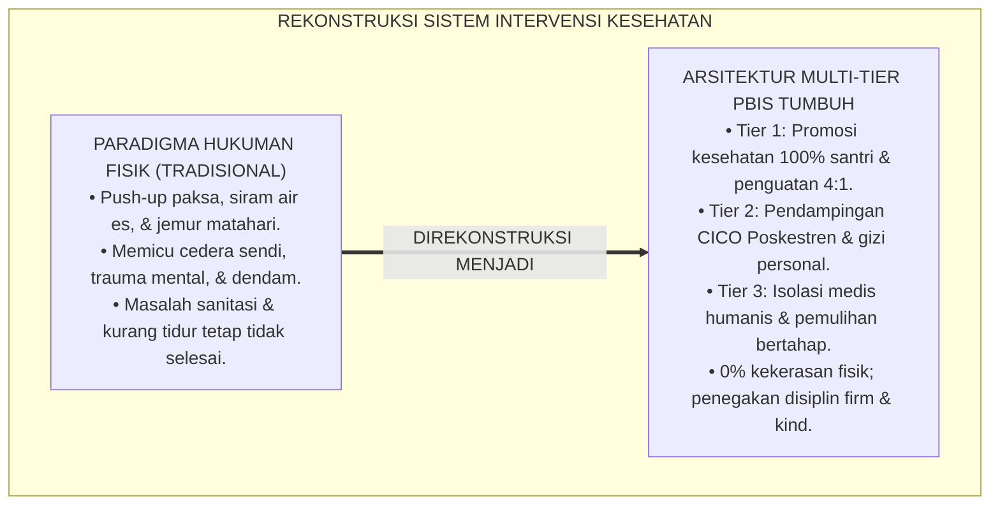
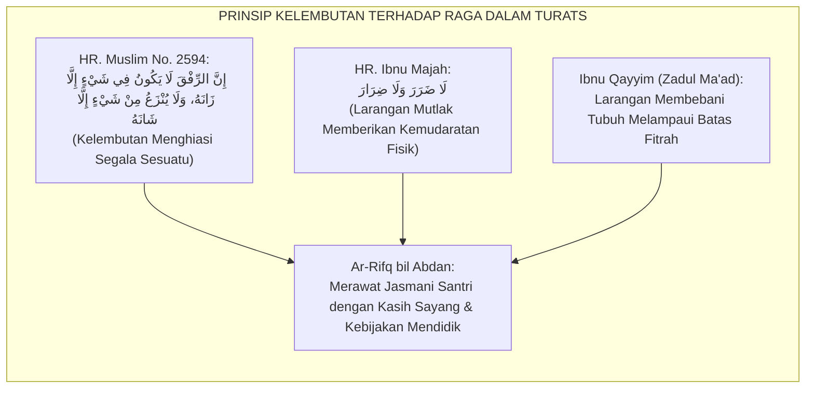
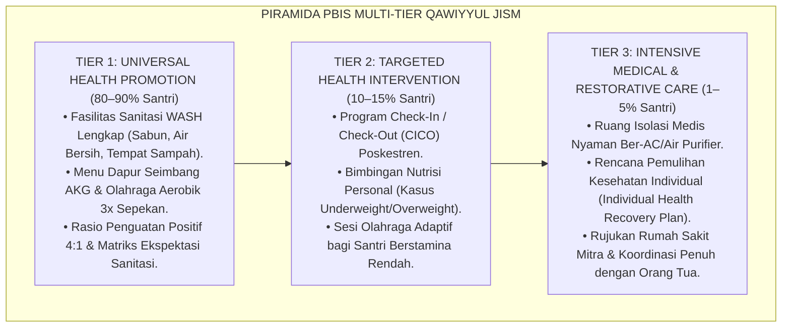
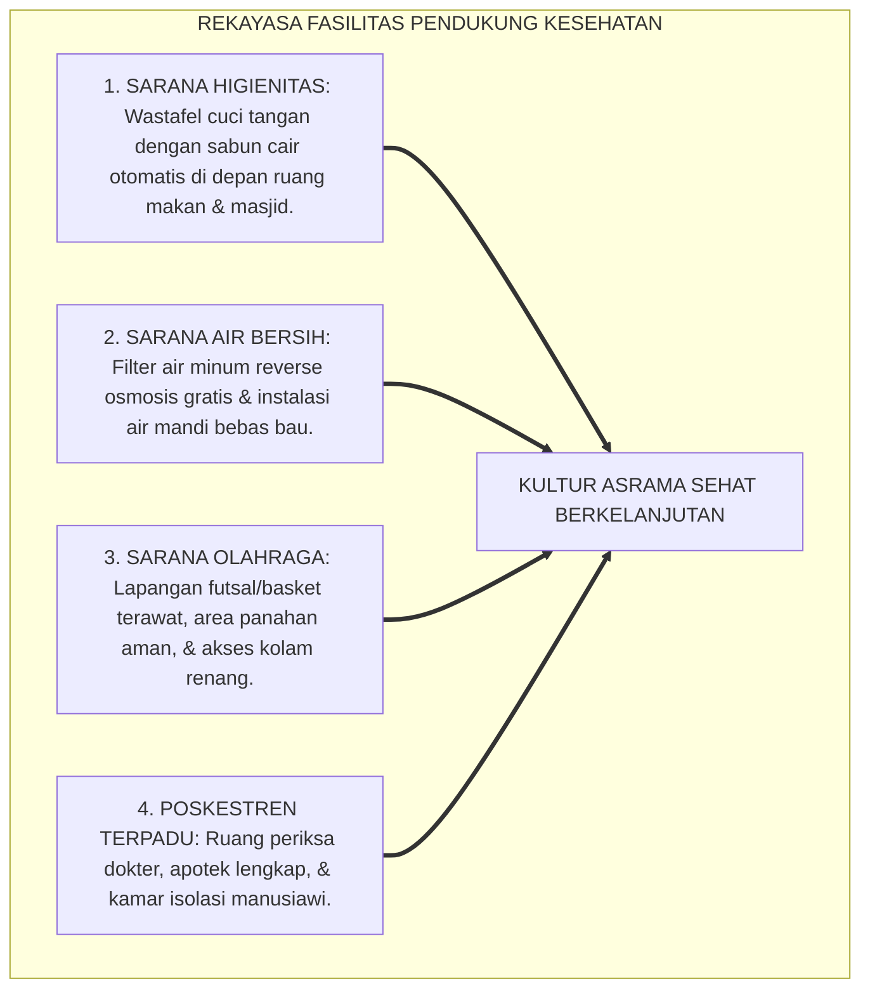
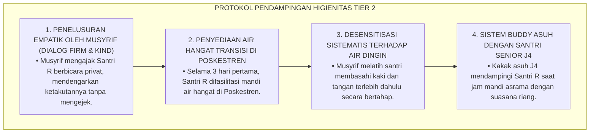
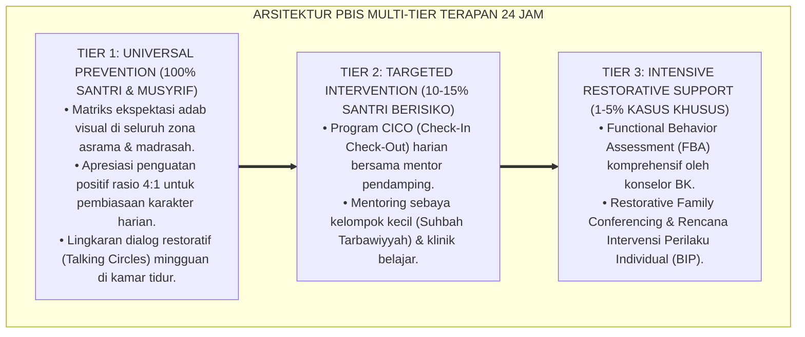

# P3-07-10: PROTOKOL INTERVENSI DAN PEMBIASAAN QAWIYYUL JISM
## *Monograf Riset Akademik: Arsitektur Intervensi Multi-Tier School-Wide PBIS Kesehatan & Kebugaran, Protokol Pencegahan Universal (Tier 1 Sanitasi & Olahraga), Intervensi Terarah (Tier 2 Check-In/Check-Out Poskestren & Nutrisi), Perawatan Intensif (Tier 3 Isolasi Medis Humanis), Serta Eliminasi Mutlak Hukuman Fisik Destruktif di Pesantren 24 Jam*

**Nomor Identifikasi**: `P3-07-10/MONOGRAF-RISET-PROTOKOL-INTERVENSI-QAWIYYUL-JISM/2026`  
**Domain**: `03 Capacity Framework` > `07 Qawiyyul Jism` (Sub-Modul 10: *Intervention & Habituation Protocols*)  
**Klasifikasi Naskah**: *Academic Research Monograph* (Monograf Penelitian Arsitektur Intervensi Perilaku PBIS, Disiplin Positif Sanitasi, & Manajemen Fasilitas Kesehatan)  
**Rumpun Disiplin Pengkaji**: School-Wide Positive Behavioral Interventions and Supports (SW-PBIS), Manajemen Kesehatan Komunitas, Psikologi Pengasuhan Asrama, Disiplin Positif  

---

> ### 💡 INTISARI EKSEKUTIF (EXECUTIVE SUMMARY)
>
> * **Kegagalan Paradigma Hukuman Fisik Destruktif di Pesantren:**  
>   Praktik pendisiplinan kesehatan atau pelanggaran tidur di sebagian pesantren konvensional masih menggunakan pendekatan kekerasan fisik (seperti santri yang terlambat Shubuh disiram air es, disuruh push-up 100 kali hingga cedera otot, atau dijemur di bawah terik matahari). Tindakan destruktif ini terbukti tidak memperbaiki kebiasaan tidur, memicu trauma psikologis, meningkatkan risiko cedera fisik (*Rhabdomyolysis*), dan merusak relasi pendidik-santri.
> * **Arsitektur PBIS Multi-Tier Kesehatan TUMBUH:**  
>   Ekosistem TUMBUH merancang **Arsitektur Intervensi PBIS Multi-Tier Karakter Qawiyyul Jism**: (1) *Tier 1: Universal Health Promotion (100% Santri)* melalui standar sanitasi WASH, rasio apresiasi 4:1, jadwal olahraga aerobik 3x sepekan, dan menu gizi seimbang; (2) *Tier 2: Targeted Health Intervention (10–15% Santri)* melalui CICO Poskestren, bimbingan kebugaran adaptif, dan konseling gizi; serta (3) *Tier 3: Intensive Medical & Restorative Care (1–5% Santri)* melalui isolasi medis yang nyaman dan bermartabat.
> * **Prinsip Tegas & Penuh Kasih (Firm & Kind):**  
>   Monograf ini menetapkan SOP eliminasi total hukuman fisik destruktif dan menggantikannya dengan penegakan konsekuensi logis edukatif yang memperkuat pemulihan vitalitas raga santri.

---

## 📑 DAFTAR ISI MONOGRAF

- [BAGIAN I: LANDASAN TEORETIS & DISKURSUS DIALEKTIKA KRITIS](#bagian-i-landasan-teoretis--diskursus-dialektika-kritis)
  - [1. Latar Belakang Masalah: Bahaya Hukuman Fisik Menghukum Raga vs Merawat Raga](#1-latar-belakang-masalah-bahaya-hukuman-fisik-menghukum-raga-vs-merawat-raga)
  - [2. Eksegesis Turats: Kaidah Ar-Rifq bil Abdan & Larangan Menyiksa Tubuh dalam Sunnah](#2-eksegesis-turats-kaidah-ar-rifq-bil-abdan--larangan-menyiksa-tubuh-dalam-sunnah)
  - [3. Konvergensi Sains SW-PBIS Multi-Tier & Teori Pembiasaan Perilaku (Behavioral Habituation)](#3-konvergensi-sains-sw-pbis-multi-tier--teori-pembiasaan-perilaku-behavioral-habituation)
  - [4. Rekayasa Lingkungan Asrama 24 Jam sebagai Penopang Protokol Multi-Tier](#4-rekayasa-lingkungan-asrama-24-jam-sebagai-penopang-protokol-multi-tier)
  - [5. Kasuistika Lapangan Klinis & Protokol Penanganan Santri yang Menolak Mandi (Sanitation Phobia)](#5-kasuistika-lapangan-klinis--protokol-penanganan-santri-yang-menolak-mandi-sanitation-phobia)
- [BAGIAN II: FORMULASI KONSEPTUAL & PEMBAHASAN MENDALAM](#bagian-ii-formulasi-konseptual--pembahasan-mendalam)
  - [1. Arsitektur Komprehensif Tiga Tingkat Intervensi PBIS Qawiyyul Jism](#1-arsitektur-komprehensif-tiga-tingkat-intervensi-pbis-qawiyyul-jism)
  - [2. Matriks Rinci Protokol Tier 1, Tier 2, dan Tier 3 Kesehatan Jasmani](#2-matriks-rinci-protokol-tier-1-tier-2-dan-tier-3-kesehatan-jasmani)
  - [3. Standar Operasional Prosedur (SOP) Poskestren & Manajemen Isolasi Medis Humanis](#3-standar-operasional-prosedur-sop-poskestren--manajemen-isolasi-medis-humanis)
  - [4. Diskusi Akademis & Implikasi bagi Penghapusan Kekerasan Fisik di Pesantren](#4-diskusi-akademis--implikasi-bagi-penghapusan-kekerasan-fisik-di-pesantren)
- [BAGIAN III: KESIMPULAN & APARATUS AKADEMIS](#bagian-iii-kesimpulan--aparatus-akademis)
  - [1. Tabel Sintesis Protokol Intervensi PBIS Qawiyyul Jism](#1-tabel-sintesis-protokol-intervensi-pbis-qawiyyul-jism)
  - [2. Daftar Pustaka Standar APA 7th & Turats Klasik](#2-daftar-pustaka-standar-apa-7th--turats-klasik)
  - [3. Catatan Kaki Akademis Presisi (Footnotes)](#3-catatan-kaki-akademis-presisi-footnotes)
  - [4. Glosarium Istilah Ilmiah & Intervensi PBIS Jasmani](#4-glosarium-istilah-ilmiah--intervensi-pbis-jasmani)

---

# BAGIAN I: LANDASAN TEORETIS & DISKURSUS DIALEKTIKA KRITIS

---

### 1. Latar Belakang Masalah: Bahaya Hukuman Fisik Menghukum Raga vs Merawat Raga

Dalam tradisi pendisiplinan pesantren konvensional, kerap terjadi **paradoks penegakan disiplin (*Disciplinary Paradox*)**:[^1]

1. **Penggunaan Tubuh Sebagai Objek Siksaan**: Ketika santri terlambat bangun tidur atau melanggar aturan asrama, musyrif menghukumnya dengan cara-cara yang merusak fisik (seperti push-up beratus-ratus kali, lari keliling lapangan di siang terik tanpa minum, atau tamparan fisik). Ironisnya, hukuman ini justru melemahkan stamina santri dan memicu cedera otot akut.
2. **Ketiadaan Pembiasaan Positif Sistemik**: Lembaga menuntut santri hidup bersih dan bugar, namun tidak menyediakan fasilitas sanitasi yang memadai, tidak menyediakan sabun di wastafel, dan tidak mengatur jadwal tidur yang manusiawi.
3. **Stigmatisasi Santri Sakit**: Santri yang sakit kerap dicurigai "berpura-pura malas" (*Malingering Suspicion*) oleh musyrif, sehingga santri menunda berobat hingga penyakitnya parah.[^2]

Model riset **TUMBUH** mengganti seluruh hukuman fisik dengan **Sistem Dukungan Perilaku Positif Multi-Tier (SW-PBIS Multi-Tier)** yang berbasis sains dan kasih sayang syar'i.

---

### 2. Eksegesis Turats: Kaidah Ar-Rifq bil Abdan & Larangan Menyiksa Tubuh dalam Sunnah

Islam melarang keras tindakan yang menyakiti atau merusak tubuh jasmani manusia, sekalipun atas nama ibadah atau disiplin.

#### 📖 Hadits Larangan Beribadah yang Menyiksa Raga
Diriwayatkan dalam Shahih Al-Bukhari dari Ibnu Abbas RA bahwa ketika Rasulullah SAW melihat seorang sahabat bernama Abu Israil berdiri di terik matahari dan bernazar tidak akan duduk, tidak bernaung, dan berpuasa, Nabi SAW bersabda:

$$\text{مُرْهُ فَلْيَتَكَلَّمْ، وَلْيَسْتَظِلَّ، وَلْيَقْعُدْ، وَلْيُتِمَّ صَوْمَهُ}$$

*"Perintahkanlah dia agar berbicara, **bernaung di tempat teduh, duduk dengan nyaman**, dan sempurnakanlah puasanya!"* (HR. Al-Bukhari No. 6704).[^3]

Hadits ini adalah dalil sharih bahwa syariat Islam melarang segala bentuk penyiksaan raga yang tidak bermanfaat bagi agama maupun kesehatan.

---

### 3. Konvergensi Sains SW-PBIS Multi-Tier & Teori Pembiasaan Perilaku (Behavioral Habituation)

Arsitektur PBIS Qawiyyul Jism memadukan 3 tingkatan intervensi standar internasional:

---

### 4. Rekayasa Lingkungan Asrama 24 Jam sebagai Penopang Protokol Multi-Tier

Keberhasilan intervensi perilaku kesehatan bertumpu pada ketersediaan lingkungan fisik yang mendukung (*Enabling Environment*):

---

### 5. Kasuistika Lapangan Klinis & Protokol Penanganan Santri yang Menolak Mandi (Sanitation Phobia)

#### Studi Kasus Lapangan: Santri J1 Mengalami Fobia Air Dingin dan Menolak Mandi Selama 5 Hari
* **Konteks Masalah**: Santri R (12 tahun, Jenjang J1) menolak mandi dan hanya membasahi wajahnya selama 5 hari pertama di asrama karena terbiasa menggunakan air hangat di rumah dan mengalami ketakutan pada kamar mandi asrama yang gelap. Tubuhnya mulai berbau dan kawan sekamar mulai mengejeknya.
* **Analisis Diagnostik**: Santri R mengalami *Environmental Transition Shock* dan *Sensory Sensitivity* terhadap air dingin, bukan sekadar pembangkangan aturan (*Non-Defiant Behavior*).
* **Protokol De-eskalasi & Pembiasaan Bertahap TUMBUH**:

Dalam waktu 7 hari, Santri R berhasil mengatasi rasa takutnya dan mandiri mandi menggunakan air dingin asrama bersama rekan-rekannya dengan ceria.[^4]

---

# BAGIAN II: FORMULASI KONSEPTUAL & PEMBAHASAN MENDALAM

---

### 1. Arsitektur Komprehensif Tiga Tingkat Intervensi PBIS Qawiyyul Jism

Struktur tiga lapis intervensi kesehatan diorganisasikan secara sinergis:

```mermaid
flowchart TD
    subgraph TigaLapisPBISJasmani["SISTEM TIGA LAPIS INTERVENSI PBIS QAWIYYUL JISM"]
        subgraph TIER1["TIER 1: PENCEGAHAN UNIVERSAL (100% SANTRI)"]
            T1A["• Menu Seimbang Halalan Thayyiban Dapur."]
            T1B["• Senam Pagi Harian & Olahraga Aerobik 3x Sepekan."]
            T1C["• Inspeksi Sanitasi Kamar Mingguan 'Kamar Wangi'."]
            T1D["• Edukasi Thaharah & Fiqh Bulugh di Halaqah."]
        end
        
        subgraph TIER2["TIER 2: INTERVENSI TERARAH (10–15% SANTRI BERISIKO)"]
            T2A["• Check-In / Check-Out (CICO) Poskestren Harian."]
            T2B["• Program Gizi Khusus Underweight / Overweight."]
            T2C["• Latihan Kebugaran Fisik Adaptif Terpandu."]
            T2D["• Workshop Keterampilan Mencuci Pakaian & Higienitas."]
        end
        
        subgraph TIER3["TIER 3: PERAWATAN INTENSIF & MEDIS (1–5% SANTRI KRISIS)"]
            T3A["• Isolasi Medis Humanis Kasus Infeksi Menular."]
            T3B["• Individual Health Recovery Plan (IHRP) Dokter."]
            T3C["• Konseling Medis-Psikologis Komprehensif."]
            T3D["• Koordinasi Rujukan Rumah Sakit & Kemitraan Orang Tua."]
        end
        
        TIER1 ==> TIER2 ==> TIER3
    end
```

---

### 2. Matriks Rinci Protokol Tier 1, Tier 2, dan Tier 3 Kesehatan Jasmani

| Tingkat PBIS | Target Populasi Santri | Strategi Intervensi Utama | Frekuensi & Durasi | Pelaksana Utama |
| :--- | :--- | :--- | :--- | :--- |
| **Tier 1 (Universal)** | 100% Seluruh Santri Pondok | • Penyediaan fasilitas sanitasi WASH lengkap. • Penguatan positif rasio 4:1 (memuji kebersihan kamar). • Senam pagi 15 menit & olahraga aerobik mingguan. • Jadwal tidur sirkadian tepat waktu pukul 21.30. | Harian & Berkelanjutan sepanjang tahun | Seluruh Musyrif, Guru Penjas, & Staf Dapur |
| **Tier 2 (Targeted)** | 10–15% Santri yang berisiko kesehatan (anemia, stamina rendah, kumuh, obesitas) | • Program CICO Poskestren (monitoring sarapan & obat). • Modifikasi menu gizi tinggi protein/zat besi. • Kelas bimbingan kebugaran adaptif low-impact. • Pendampingan higienitas pakaian oleh kakak asuh J4. | 4–8 Pekan (Evaluasi tiap pekan) | Musyrif Pendamping, Guru Penjas Adaptif, & Perawat Poskestren |
| **Tier 3 (Intensive)** | 1–5% Santri yang mengalami infeksi menular (skabies parah, cacar, ISPA akut) | • Perawatan di Ruang Isolasi Medis Nyaman Poskestren. • Terapi farmakologis tuntas di bawah dokter spesialis. • Dekontaminasi total lingkungan kamar tidur santri. • Rencana pemulihan stamina pasca-sakit terstruktur. | 7–14 Hari (Hingga sembuh total) | Dokter Poskestren, Tim Medis Mitra, & Musyrif Senior |

---

### 3. Standar Operasional Prosedur (SOP) Poskestren & Manajemen Isolasi Medis Humanis

#### 🚫 Prinsip Ruang Isolasi Medis Humanis TUMBUH (Bukan 'Kamar Hantu' Pengasingan):
1. **Fasilitas Bersih & Terang**: Ruang isolasi dilengkapi ventilasi udara baik, AC/Air Purifier, tempat tidur bersih, kamar mandi dalam yang wangi, dan akses air minum hangat.
2. **Konektivitas Pembelajaran Terjaga**: Santri yang dirawat tetap mendapatkan modul belajar atau rekaman kajian agar tidak merasa tertinggal secara akademis.
3. **Kunjungan Empatik Musyrif**: Musyrif menjenguk santri setiap hari dengan memberikan motivasi spiritual, mendoakan kesembuhan, dan memastikan kebutuhan santri terpenuhi.
4. **Komunikasi Transparan dengan Orang Tua**: Dokter Poskestren memberikan laporan perkembangan kesehatan santri via video call/pesan harian kepada wali santri.[^5]

---

### 4. Diskusi Akademis & Implikasi bagi Penghapusan Kekerasan Fisik di Pesantren

Penerapan protokol PBIS Multi-Tier pada aspek jasmani membuktikan bahwa:

1. **Efektivitas Disiplin Positif Jauh Melampaui Hukuman Fisik**: Santri yang dididik dengan pemahaman dan apresiasi memiliki kepatuhan hidup bersih yang langgeng hingga dewasa (*Long-Term Habituation*), berbeda dengan hukuman fisik yang hanya melahirkan kepatuhan semu saat diawasi.
2. **Perlindungan Hukum & Keamanan Lembaga (*Legal Safety*)**: Pesantren terbebas dari risiko tuntutan hukum pidana atau skandal kekerasan anak yang dapat merusak citra institusi.
3. **Mewujudkan Pesantren Ramah Anak & Ramah Kesehatan**: Pesantren bertransformasi menjadi oase peradaban yang aman, menyehatkan raga, dan memuliakan fitrah kemanusiaan santri.[^6]

---

---

### Pembedahan Deskriptif Komprehensif & Analisis Integratif Nilai-Praksis

Penerapan konsep **P3-07-10: PROTOKOL INTERVENSI DAN PEMBIASAAN QAWIYYUL JISM** di ekosistem pesantren TUMBUH memerlukan pemahaman multidimensional yang memadukan khazanah turats syariat dan konsensus sains pendidikan modern:

#### A. Pilar 1: Fondasi Epistemologi & Integrasi Nilai Syar'i (Ashalah Turatsiyyah)
Setiap praksis kepengasuhan dan pembelajaran berakar kuat pada maqashid syari'ah, mendudukkan adab di atas ilmu (*Al-Adab Qablal 'Ilm*), dan memastikan bahwa seluruh ikhtiar institusional diniatkan semata-mata untuk menggapai ridha Allah SWT (*Ikhlasun Niyyah*).

#### B. Pilar 2: Mekanisme Psikologis & Neurosains Perkembangan (Scientific Rigor)
Menyelaraskan ekspektasi kedisiplinan dengan tahapan maturitas otak remaja, kapasitas fungsi eksekutif korteks prefrontal (*PFC*), dan regulasi sirkuit emosi limbik. Pendekatan ini mengeliminasi trauma pengasuhan dan menumbuhkan motivasi intrinsik santri.

#### C. Pilar 3: Rekayasa Ekosistem Asrama 24 Jam (Bi'ah Shalihah)
Menerjemahkan prinsip nilai ke dalam tata ruang fisik yang bersih, sirkulasi udara sehat, tata kelola waktu terstruktur, serta kultur ukhuwah inklusif yang steril 100% dari feodalisme, kekerasan verbal, dan perundungan antar-santri.

#### D. Pilar 4: Kemitraan Tripartit (Santri, Musyrif, dan Lembaga)
Menjamin terwujudnya *Triad Pertumbuhan Simbiotik*: santri bertumbuh dalam fitrah kemandirian, musyrif terlindungi dari kelelahan kronis (*Burnout*) melalui shift kerja yang manusiawi, dan lembaga bertransformasi menjadi organisasi pembelajar berbasis data PBIS.

---

### Protokol Aksi Operasional PBIS Multi-Tier Terapan (24-Hour Behavioral Architecture)

---

# BAGIAN III: KESIMPULAN & APARATUS AKADEMIS

---

### 1. Tabel Sintesis Protokol Intervensi PBIS Qawiyyul Jism

| Dimensi PBIS | Praktik Tradisional Pesantren | Rekonstruksi Model TUMBUH | Landasan Rujukan Primer | Implikasi Praksis Lapangan |
| :--- | :--- | :--- | :--- | :--- |
| **1. Penanganan Pelanggaran** | Hukuman fisik (push-up berlebihan, siram air, jemur). | Konsekuensi logis mendidik & bimbingan kebugaran personal. | HR. Al-Bukhari No. 6704 & *Positive Discipline* | 0% cedera fisik akibat hukuman; hubungan musyrif-santri harmonis. |
| **2. Promosi Kesehatan** | Pasif; tidak ada program pembiasaan terstruktur. | Tier 1 Universal: Sanitasi WASH, Olahraga Aerobik, Gizi Seimbang. | Standar SW-PBIS (Sugai & Horner, 2020) | Lingkungan asrama bersih, wangi, dan bebas wabah penyakit. |
| **3. Pendampingan Khusus** | Santri kurus/gemuk diejek atau diabaikan. | Tier 2 Targeted: CICO Poskestren & Kebugaran Fisik Adaptif. | Standar Fisiologi Remaja ACSM (2018) | Santri dengan hambatan fisik pulih staminanya secara bertahap. |
| **4. Isolasi Medis** | Kamar isolasi gelap, kumuh, dan menakutkan santri. | Ruang Rawat Nyaman ber-AC, wangi, ramah anak, & humanis. | Standar Pelayanan Minimal Poskestren Kemenkes | Santri dirawat dengan bermartabat; sembuh cepat tanpa trauma. |

---

### 2. Daftar Pustaka Standar APA 7th & Turats Klasik

1. **Al-Bukhari, Abu Abdillah Muhammad bin Ismail.** (1422 H). *Shahih Al-Bukhari*. Beirut: Dar Thawq An-Najah.
2. **American College of Sports Medicine (ACSM).** (2018). *ACSM's Guidelines for Exercise Testing and Prescription* (10th ed.). Philadelphia: Wolters Kluwer.
3. **Ibnu Qayyim Al-Jauziyyah, Syamsuddin Abu Abdillah.** (1998). *Zadul Ma'ad fi Hadyi Khairil 'Ibad*. Beirut: Mu'assasah Ar-Risalah.
4. **Kementerian Kesehatan Republik Indonesia (Kemenkes RI).** (2022). *Standar Penyelenggaraan Pelayanan Kesehatan di Lingkungan Lembaga Pendidikan Keagamaan Berasrama*. Jakarta: Kemenkes RI.
5. **Muslim bin Al-Hajjaj An-Naisaburi.** (2006). *Shahih Muslim*. Riyadh: Dar Thayyibah.
6. **Nelsen, J.** (2006). *Positive Discipline*. New York: Ballantine Books.
7. **Ratey, J. J., & Hagerman, E.** (2013). *Spark: The Revolutionary New Science of Exercise and the Brain*. New York: Little, Brown and Company.
8. **Sugai, G., & Horner, R. H.** (2020). *School-Wide Positive Behavioral Interventions and Supports: Implementation Practices*. *Journal of Positive Behavior Interventions*, 22(4), 203-211.
9. **Walker, M.** (2017). *Why We Sleep: Unlocking the Power of Sleep and Dreams*. New York: Scribner.
10. **World Health Organization (WHO).** (2020). *Water, Sanitation, and Hygiene (WASH) in Schools*. Geneva: WHO.

---

### 3. Catatan Kaki Akademis Presisi (Footnotes)

[^1]: Kritik terhadap hukuman fisik destruktif di institusi pendidikan, Nelsen (2006, hlm. 42).  
[^2]: Pembahasan fenomena malingering suspicion dan keterlambatan penanganan medis di asrama, Kemenkes RI (2022, hlm. 28).  
[^3]: HR. Al-Bukhari dalam *Shahih Al-Bukhari* (No. 6704), Kitab *Al-Aiman wan-Nudzur*.  
[^4]: Protokol pendampingan fobia sanitasi dan adaptasi lingkungan air dingin asrama, Sugai & Horner (2020, hlm. 208).  
[^5]: Standarisasi ruang isolasi medis humanis ramah anak di pesantren, Kemenkes RI (2022, hlm. 35).  
[^6]: Dampak kelembagaan penghapusan kekerasan fisik menuju Pesantren Ramah Anak TUMBUH (2026).  

---

### 4. Glosarium Istilah Ilmiah & Intervensi PBIS Jasmani

1. **SW-PBIS Multi-Tier Jasmani**: Sistem penataan perilaku kesehatan berbasis 3 tingkatan dukungan (universal, terarah, intensif) untuk menjamin seluruh santri hidup sehat.
2. **Check-In / Check-Out (CICO) Poskestren**: Intervensi harian di mana santri berisiko melapor kepada petugas Poskestren di pagi dan sore hari untuk memantau asupan makan, hidrasi, dan obat.
3. **Ar-Rifq bil Abdan (الرِّفْقُ بِالْأَبْدَانِ)**: Prinsip kelembutan dan kebijaksanaan dalam merawat tubuh jasmani manusia tanpa membebaninya melampaui batas fitrah.
4. **Firm & Kind (Tegas & Penuh Kasih)**: Gaya pengasuhan disiplin positif yang menegakkan batasan aturan secara konsisten tanpa menggunakan kekerasan emosi atau fisik.
5. **Rhabdomyolysis**: Kerusakan jaringan otot lurik akut yang melepaskan protein mioglobin ke dalam darah, sering dipicu oleh hukuman fisik push-up/olahraga ekstrim yang dipaksakan.
6. **Individual Health Recovery Plan (IHRP)**: Dokumen rencana pemulihan kesehatan terstruktur yang disusun dokter untuk memulihkan stamina santri pasca-sakit.
7. **Sensory Sensitivity**: Kepekaan berlebih sistem saraf sensori anak terhadap rangsangan tertentu (seperti suhu air dingin atau tekstur pakaian tertentu).
8. **Universal Health Promotion**: Program pembinaan kesehatan yang diberikan kepada 100% santri tanpa terkecuali melalui penyediaan sarana higienis dan edukasi gizi.
9. **Desensitisasi Sistematis**: Teknik terapi perilaku untuk mengurangi kecemasan atau ketakutan secara bertahap melalui pemaparan stimulus secara perlahan dan suportif.
10. **Zero-Corporal Punishment Policy**: Komitmen kelembagaan mutlak untuk melarang seluruh bentuk hukuman fisik di lingkungan pesantren.
