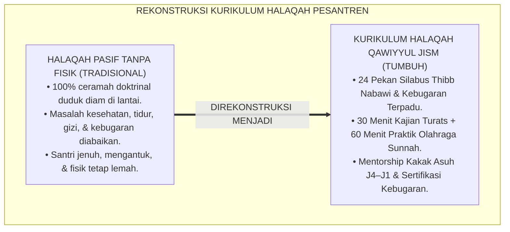
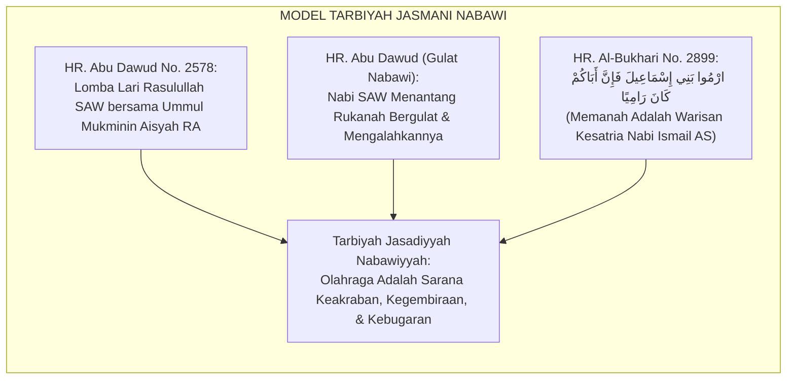
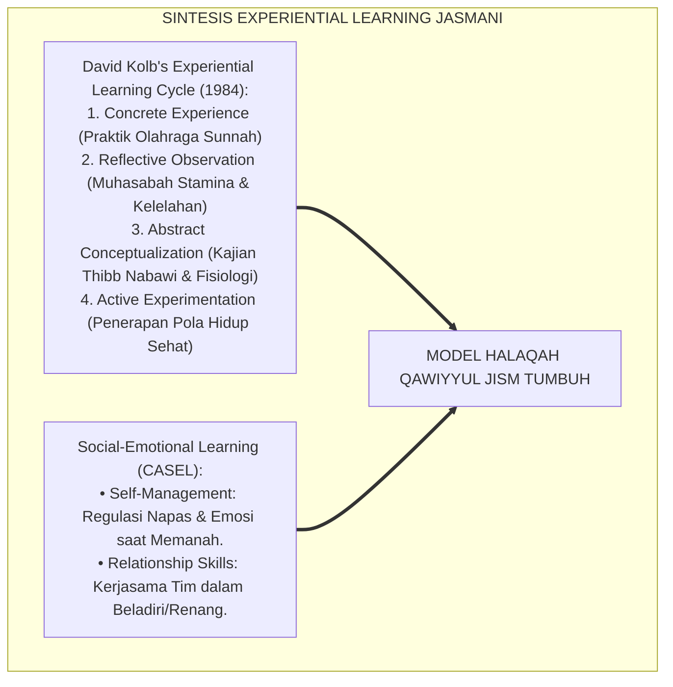
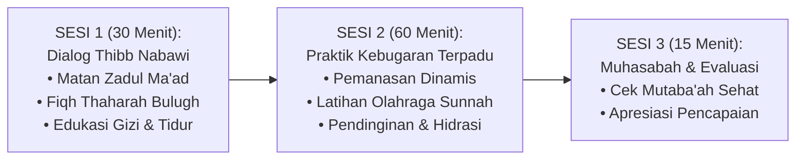
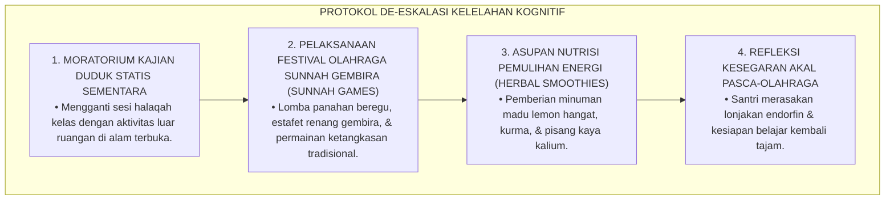
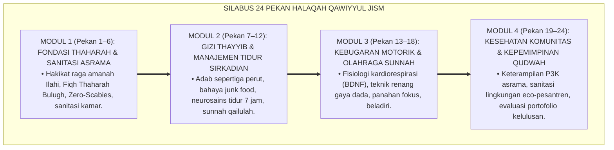
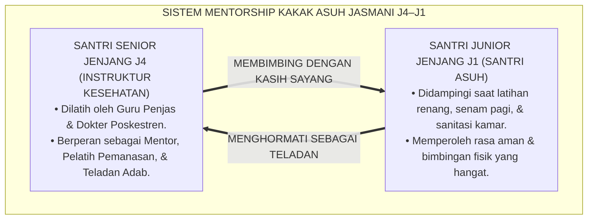
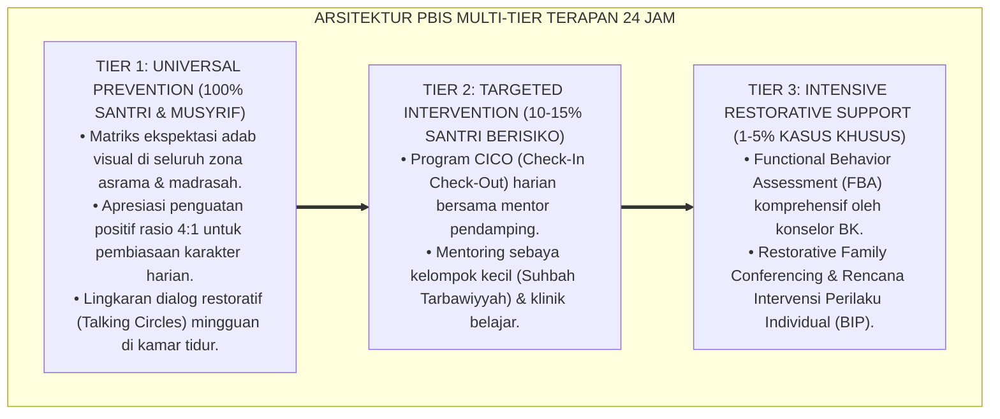

# P3-07-11: PROGRAM PEMBINAAN DAN HALAQAH QAWIYYUL JISM
## *Monograf Riset Akademik: Kurikulum Terpadu Halaqah Thibb Nabawi & Kebugaran 24 Pekan, Silabus Olahraga Sunnah (Renang, Memanah, Beladiri, & Lari), Program Mentorship Olahraga Antar-Jenjang (Kakak Asuh J4–J1), Serta Ekosistem Pembinaan Jasmani di Pesantren 24 Jam*

**Nomor Identifikasi**: `P3-07-11/MONOGRAF-RISET-PROGRAM-HALAQAH-QAWIYYUL-JISM/2026`  
**Domain**: `03 Capacity Framework` > `07 Qawiyyul Jism` (Sub-Modul 11: *Coaching Program & Halaqah Curriculum*)  
**Klasifikasi Naskah**: *Academic Research Monograph* (Monograf Penelitian Desain Kurikulum Halaqah Kesehatan, Silabus Olahraga Sunnah, & Mentorship Komunitas)  
**Rumpun Disiplin Pengkaji**: Desain Kurikulum Pesantren, Pembinaan Olahraga Sunnah, Pedagogi Kesehatan Remaja, Mentorship Sebaya (*Peer Mentorship*)  

---

> ### 💡 INTISARI EKSEKUTIF (EXECUTIVE SUMMARY)
>
> * **Kelemahan Kurikulum Halaqah yang Mengabaikan Dimensi Fisik:**  
>   Program halaqah mingguan di pesantren konvensional hampir 100% didominasi oleh materi doktrinal aqidah, fiqh ibadah ritual, atau hafalan Al-Qur'an, tanpa pernah membahas fikih kesehatan reproduksi, adab thaharah praktis, gizi halalan thayyiban, atau manajemen tidur sirkadian. Dimensi jasmani dianggap "urusan duniawi rendahan" yang tidak layak dibahas di forum halaqah.
> * **Kurikulum Terpadu Halaqah Kesehatan & Kebugaran 24 Pekan TUMBUH:**  
>   Ekosistem TUMBUH merancang **Kurikulum Halaqah Thibb Nabawi & Kebugaran Jasmani Terstruktur 24 Pekan (1 Tahun Ajaran Penuh)** yang memadukan telaah teks Turats (*Zadul Ma'ad, Kitab Asrarit Thaharah, Al-Qanun fit-Thibb*) dengan praktik kebugaran langsung dan sertifikasi 4 cabang olahraga sunnah (renang, memanah, beladiri kesatria, dan lari aerobik).
> * **Program Mentorship Olahraga Antar-Jenjang (Kakak Asuh J4–J1):**  
>   Monograf ini mengintegrasikan santri jenjang J4 sebagai instruktur kebugaran dan kakak pendamping (*Fitness Mentors*) bagi santri baru jenjang J1, memastikan terjadinya transfer adab hidup bersih, sportivitas, dan rasa percaya diri tanpa feodalisme senioritas.

---

## 📑 DAFTAR ISI MONOGRAF

- [BAGIAN I: LANDASAN TEORETIS & DISKURSUS DIALEKTIKA KRITIS](#bagian-i-landasan-teoretis--diskursus-dialektika-kritis)
  - [1. Latar Belakang Masalah: Bahaya Halaqah 'Disembodied' yang Mengabaikan Raga](#1-latar-belakang-masalah-bahaya-halaqah-disembodied-yang-mengabaikan-raga)
  - [2. Eksegesis Turats: Model Pembinaan Jasmani Rasulullah SAW Bersama Para Sahabat](#2-eksegesis-turats-model-pembinaan-jasmani-rasulullah-saw-bersama-para-sahabat)
  - [3. Konvergensi Sains Pendidikan Jasmani & Teori Pembelajaran Berbasis Pengalaman (Experiential Learning)](#3-konvergensi-sains-pendidikan-jasmani--teori-pembelajaran-berbasis-pengalaman-experiential-learning)
  - [4. Rekayasa Sesi Halaqah Terpadu: 30 Menit Dialog Thibb Nabawi + 60 Menit Latihan Fisik](#4-rekayasa-sesi-halaqah-terpadu-30-menit-dialog-thibb-nabawi--60-menit-latihan-fisik)
  - [5. Kasuistika Lapangan Klinis & Protokol De-eskalasi Kejenuhan Fisik Santri Melalui Olahraga Gembira](#5-kasuistika-lapangan-klinis--protokol-de-eskalasi-kejenuhan-fisik-santri-melalui-olahraga-gembira)
- [BAGIAN II: FORMULASI KONSEPTUAL & PEMBAHASAN MENDALAM](#bagian-ii-formulasi-konseptual--pembahasan-mendalam)
  - [1. Silabus Lengkap Kurikulum Halaqah Kesehatan & Kebugaran 24 Pekan](#1-silabus-lengkap-kurikulum-halaqah-kesehatan--kebugaran-24-pekan)
  - [2. Panduan Kurikuler Empat Cabang Olahraga Sunnah (Renang, Memanah, Beladiri, & Lari)](#2-panduan-kurikuler-empat-cabang-olahraga-sunnah-renang-memanah-beladiri--lari)
  - [3. Arsitektur Mentorship Olahraga Antar-Jenjang (Kakak Asuh J4–J1)](#3-arsitektur-mentorship-olahraga-antar-jenjang-kakak-asuh-j4j1)
  - [4. Diskusi Akademis & Implikasi bagi Kebijakan Transformasi Halaqah Pesantren](#4-diskusi-akademis--implikasi-bagi-kebijakan-transformasi-halaqah-pesantren)
- [BAGIAN III: KESIMPULAN & APARATUS AKADEMIS](#bagian-iii-kesimpulan--aparatus-akademis)
  - [1. Tabel Sintesis Program Pembinaan Halaqah Qawiyyul Jism](#1-tabel-sintesis-program-pembinaan-halaqah-qawiyyul-jism)
  - [2. Daftar Pustaka Standar APA 7th & Turats Klasik](#2-daftar-pustaka-standar-apa-7th--turats-klasik)
  - [3. Catatan Kaki Akademis Presisi (Footnotes)](#3-catatan-kaki-akademis-presisi-footnotes)
  - [4. Glosarium Istilah Ilmiah & Pembinaan Jasmani](#4-glosarium-istilah-ilmiah--pembinaan-jasmani)

---

# BAGIAN I: LANDASAN TEORETIS & DISKURSUS DIALEKTIKA KRITIS

---

### 1. Latar Belakang Masalah: Bahaya Halaqah 'Disembodied' yang Mengabaikan Raga

Praktek pembinaan kelompok kecil (halaqah/usrah) di banyak pesantren kerap mengalami **keterasingan ragawi (*Disembodied Halaqah Trap*)**:[^1]

1. **Halaqah Serba Teori Duduk Melingkar**: Santri dipaksa duduk diam bersila selama 2 jam mendengarkan ceramah, tanpa pernah diajarkan cara memotong kuku yang benar, cara mengecek kebersihan loker, atau melakukan peregangan postur tubuh.
2. **Ketiadaan Kurikulum Olahraga Terprogram**: Olahraga sunnah (seperti renang dan panahan) hanya digaungkan sebagai slogan kebanggaan sejarah, namun tidak pernah dimasukkan ke dalam silabus mingguan yang terstruktur dengan instruktur bersertifikat.
3. **Ketidakhadiran Pembinaan Pola Tidur & Gizi**: Masalah santri yang kelelahan belajar, wajah pucat akibat anemia, atau kebiasaan jajan sembarangan tidak pernah dibahas solusinya dalam forum halaqah.[^2]

Model riset **TUMBUH** merekonstruksi konsep halaqah: **halaqah adalah wahana tarbiyah holistik yang membina jiwa, akal, dan raga secara terpadu (*Tarbiyah Jasad-Aql-Ruh*)**.

---

### 2. Eksegesis Turats: Model Pembinaan Jasmani Rasulullah SAW Bersama Para Sahabat

Rasulullah SAW secara langsung melatih fisik para sahabat melalui perlombaan dan olahraga gembira.

#### 📖 Hadits Perintah Latihan Memanah
Rasulullah SAW bersabda ketika melewati sekelompok sahabat suku Aslam yang sedang berlatih memanah:

$$\text{ارْمُوا بَنِي إِسْمَاعِيلَ، فَإِنَّ أَبَاكُمْ كَانَ رَامِيًا، ارْمُوا وَأَنَا مَعَ بَنِي فُلَانٍ}$$

*"Memanahlah wahai keturunan Nabi Ismail, karena sesungguhnya nenek moyang kalian adalah seorang pemanah ulung! Memanahlah, dan aku bersama kelompok ini!"* (HR. Al-Bukhari No. 2899).[^3]

Teks ini menegaskan bahwa latihan keterampilan jasmani adalah bagian dari sunnah yang dipraktekkan dan didampingi langsung oleh Nabi SAW.

---

### 3. Konvergensi Sains Pendidikan Jasmani & Teori Pembelajaran Berbasis Pengalaman (Experiential Learning)

Kurikulum pembinaan Qawiyyul Jism memadukan model pembelajaran Kolb dan teori psikologi olahraga:

---

### 4. Rekayasa Sesi Halaqah Terpadu: 30 Menit Dialog Thibb Nabawi + 60 Menit Latihan Fisik

Format halaqah dirancang dinamis memadukan olah pikir dan olah raga:

---

### 5. Kasuistika Lapangan Klinis & Protokol De-eskalasi Kejenuhan Fisik Santri Melalui Olahraga Gembira

#### Studi Kasus Lapangan: Santri Mengalami Sindrom Burnout Belajar & Kelesuan Fisik Menjelang Ujian Semester
* **Konteks Masalah**: Santri jenjang J2 menunjukkan gejala kelelahan mental (*Academic Burnout*), wajah kuyu, mudah tersinggung, dan mengeluhkan sakit kepala pasca-menghafal Al-Qur'an 8 jam sehari.
* **Analisis Diagnostik**: Santri mengalami penumpukan hormon stres (*Kortisol*) akibat ketiadaan aktivitas pelepasan motorik dan kurangnya paparan sinar matahari pagi.
* **Protokol De-eskalasi Melalui 'Fun Sunnah Sports Festival' TUMBUH**:

Dalam waktu 24 jam pasca-festival olahraga gembira, tingkat stres santri turun drastis, daya ingat pulih segar, dan suasana halaqah kembali bersemangat.[^4]

---

# BAGIAN II: FORMULASI KONSEPTUAL & PEMBAHASAN MENDALAM

---

### 1. Silabus Lengkap Kurikulum Halaqah Kesehatan & Kebugaran 24 Pekan

Silabus 24 pekan diorganisasikan ke dalam 4 modul tematik (6 pekan per modul):

#### Rincian Distribusi Tema Mingguan:
* **Pekan 1–2**: Filosofi Jasmani dalam Islam & Takhrij Hadits *Al-Mu'minul Qawiyy*.
* **Pekan 3–4**: Fiqh Akil Baligh, Mandi Janabah, dan Sanitasi Organ Reproduksi Syar'i.
* **Pekan 5–6**: Manajemen Kamar Tidur Bebas Tungau & Praktik Mencuci Pakaian Higienis.
* **Pekan 7–8**: Konsep Makanan *Halalan Thayyiban* & Menakar Keseimbangan Gizi Dapur.
* **Pekan 9–10**: Bahaya Makanan Sampah (*Junk Food*) & Praktik Adab Makan Sepertiga Perut.
* **Pekan 11–12**: Neurosains Tidur Sirkadian & Menghilangkan Kebiasaan Begadang.
* **Pekan 13–14**: Teori Kebugaran Tubuh (VO2Max & BDNF) & Latihan Senam Aerobik.
* **Pekan 15–16**: Pelatihan Keterampilan Renang 50 Meter (Gaya Dada & Pernapasan Air).
* **Pekan 17–18**: Pelatihan Keterampilan Panahan Tradisional (Fokus Mental & Kekuatan Bahu).
* **Pekan 19–20**: Pelatihan Beladiri Kesatria (Pencak Silat / Thifan) & Refleks Bertahan.
* **Pekan 21–22**: Pelatihan Pertolongan Pertama Pada Kecelakaan (P3K) & Tanggap Darurat Asrama.
* **Pekan 23–24**: Munaqasyah Kebugaran Jasmani & Proyek Bhakti Sanitasi Lingkungan Pesantren.

---

### 2. Panduan Kurikuler Empat Cabang Olahraga Sunnah (Renang, Memanah, Beladiri, & Lari)

| Cabang Olahraga Sunnah | Dimensi Keterampilan Motorik yang Dilatih | Manfaat Fisiologis & Kognitif | Standar Kelulusan Minimal (Jenjang J3–J4) |
| :--- | :--- | :--- | :--- |
| **1. Berenang (*As-Sibahah*)** | Koordinasi lengan-tungkai, pernapasan ritmis, gaya dada/bebas. | Meningkatkan kapasitas paru-paru ($VO2Max$), melatih seluruh otot tubuh tanpa beban sendi. | Mampu berenang sejauh 50 meter tanpa jeda dengan teknik syar'i terpisah putra/putri. |
| **2. Memanah (*Ar-Rmayah*)** | Kekuatan otot punggung/bahu (*Latissimus dorsi*), stabilitas postur, pelepasan anak panah (*Release*). | Melatih fokus konsentrasi tinggi, ketenangan bernapas, menekan impulsivitas emosi. | Menembak target sasaran jarak 15 meter dengan skor akurasi minimal $\ge 70\%$ (6 anak panah). |
| **3. Beladiri Kesatria (*Al-Furusiyyah*)** | Kuda-kuda kokoh, tangkisan, pukulan, kuncian, kelincahan menghindar (*Agility*). | Membentuk refleks pertahanan diri cepat, keberanian mental, dan sportivitas beradab. | Menguasai 5 jurus dasar pencak silat / thifan dan lulus uji tanding adab terkontrol. |
| **4. Lari Aerobik (*Al-Jary*)** | Daya tahan kardiorespirasi, efisiensi langkah, irama pernapasan hidung. | Memicu sekresi hormon BDNF di hippocampus, mempercepat daya ingat dan ketahanan stamina. | Menempuh jarak 2.400 meter (Cooper Test) dalam waktu $\le 12\text{ menit}$ (putra) / $\le 14\text{ menit}$ (putri). |

---

### 3. Arsitektur Mentorship Olahraga Antar-Jenjang (Kakak Asuh J4–J1)

Untuk mengeliminasi feodalisme senioritas dan menumbuhkan ukhuwah, pembinaan kebugaran menerapkan sistem kakak asuh:

Prinsip Mentorship: **Santri senior dilarang menghukum fisik santri junior; tugas santri senior adalah mengajari, memotivasi, dan mencontohkan**.[^5]

---

### 4. Diskusi Akademis & Implikasi bagi Kebijakan Transformasi Halaqah Pesantren

Transformasi halaqah terpadu Qawiyyul Jism menghasilkan capaian institusional:

1. **Eliminasi Kebosanan & Kejenuhan Halaqah (*Enhanced Engagement*)**: Santri menanti-nantikan sesi halaqah mingguan karena memadukan ilmu hikmah dan aktivitas olahraga yang menyenangkan.
2. **Kaderisasi Instruktur Kebugaran Beradab**: Lulusan pesantren tidak hanya cakap berceramah di mimbar, melainkan juga memiliki sertifikasi kepelatihan olahraga sunnah dan pertolongan medis darurat.
3. **Penyempurnaan Bi'ah Shalihah Asrama**: Budaya hidup sehat, wangi, dan bugar menjadi denyut nadi kehidupan pesantren sehari-hari.[^6]

---

---

### Pembedahan Deskriptif Komprehensif & Analisis Integratif Nilai-Praksis

Penerapan konsep **P3-07-11: PROGRAM PEMBINAAN DAN HALAQAH QAWIYYUL JISM** di ekosistem pesantren TUMBUH memerlukan pemahaman multidimensional yang memadukan khazanah turats syariat dan konsensus sains pendidikan modern:

#### A. Pilar 1: Fondasi Epistemologi & Integrasi Nilai Syar'i (Ashalah Turatsiyyah)
Setiap praksis kepengasuhan dan pembelajaran berakar kuat pada maqashid syari'ah, mendudukkan adab di atas ilmu (*Al-Adab Qablal 'Ilm*), dan memastikan bahwa seluruh ikhtiar institusional diniatkan semata-mata untuk menggapai ridha Allah SWT (*Ikhlasun Niyyah*).

#### B. Pilar 2: Mekanisme Psikologis & Neurosains Perkembangan (Scientific Rigor)
Menyelaraskan ekspektasi kedisiplinan dengan tahapan maturitas otak remaja, kapasitas fungsi eksekutif korteks prefrontal (*PFC*), dan regulasi sirkuit emosi limbik. Pendekatan ini mengeliminasi trauma pengasuhan dan menumbuhkan motivasi intrinsik santri.

#### C. Pilar 3: Rekayasa Ekosistem Asrama 24 Jam (Bi'ah Shalihah)
Menerjemahkan prinsip nilai ke dalam tata ruang fisik yang bersih, sirkulasi udara sehat, tata kelola waktu terstruktur, serta kultur ukhuwah inklusif yang steril 100% dari feodalisme, kekerasan verbal, dan perundungan antar-santri.

#### D. Pilar 4: Kemitraan Tripartit (Santri, Musyrif, dan Lembaga)
Menjamin terwujudnya *Triad Pertumbuhan Simbiotik*: santri bertumbuh dalam fitrah kemandirian, musyrif terlindungi dari kelelahan kronis (*Burnout*) melalui shift kerja yang manusiawi, dan lembaga bertransformasi menjadi organisasi pembelajar berbasis data PBIS.

---

### Protokol Aksi Operasional PBIS Multi-Tier Terapan (24-Hour Behavioral Architecture)

---

# BAGIAN III: KESIMPULAN & APARATUS AKADEMIS

---

### 1. Tabel Sintesis Program Pembinaan Halaqah Qawiyyul Jism

| Komponen Program | Pola Halaqah Tradisional | Kurikulum Terpadu TUMBUH | Landasan Rujukan Primer | Target Capaian Santri |
| :--- | :--- | :--- | :--- | :--- |
| **1. Materi Kajian** | Hanya doktrin teoritis ibadah ritual. | Integrasi 24 Pekan: Thibb Nabawi, Gizi, Tidur, & Fisiologi. | *Zadul Ma'ad* & *Al-Qanun fit-Thibb* | Santri melek literasi kesehatan medis dan syar'i. |
| **2. Format Sesi** | 100% duduk diam di lantai kelas/masjid. | 30 Menit Kajian Hikmah + 60 Menit Olahraga Sunnah Terpadu. | *Experiential Learning* (Kolb, 1984) | Santri antusias; pikiran segar dan raga bugar. |
| **3. Olahraga Sunnah** | Tidak ada kurikulum; olahraga sporadis. | Silabus 4 Cabang: Renang, Memanah, Beladiri, & Lari. | Atsar Sayyidina Umar RA & HR. Al-Bukhari | Sertifikasi kemahiran minimal 1 cabang olahraga sunnah. |
| **4. Pola Pendampingan** | Senioritas menghukum junior. | Mentorship Kakak Asuh J4–J1 (Qudwah & Pelatih Kasih Sayang). | Konsep Qudwah Hasanah & PBIS | Budaya asrama hangat bebas dari perpeloncoan fisik. |

---

### 2. Daftar Pustaka Standar APA 7th & Turats Klasik

1. **Abu Dawud As-Sijistani, Sulaiman bin Al-Asy'ats.** (2009). *Sunan Abi Dawud*. Tahqiq: Syu'aib Al-Arnauth. Damaskus: Dar Ar-Risalah Al-'Alamiyyah.
2. **Al-Bukhari, Abu Abdillah Muhammad bin Ismail.** (1422 H). *Shahih Al-Bukhari*. Beirut: Dar Thawq An-Najah.
3. **American College of Sports Medicine (ACSM).** (2018). *ACSM's Guidelines for Exercise Testing and Prescription* (10th ed.). Philadelphia: Wolters Kluwer.
4. **Ibnu Qayyim Al-Jauziyyah, Syamsuddin Abu Abdillah.** (1998). *Zadul Ma'ad fi Hadyi Khairil 'Ibad*. Beirut: Mu'assasah Ar-Risalah.
5. **Ibnu Qayyim Al-Jauziyyah, Syamsuddin Abu Abdillah.** (2003). *Al-Furusiyyah*. Tahqiq: Masyhur bin Hasan Al Salman. Riyadh: Dar Al-Ashalah.
6. **Ibnu Sina, Abu Ali Al-Husain bin Abdillah.** (2007). *Al-Qanun fit-Thibb*. Beirut: Dar Al-Kutub Al-'Ilmiyyah.
7. **Kolb, D. A.** (1984). *Experiential Learning: Experience as the Source of Learning and Development*. Englewood Cliffs: Prentice-Hall.
8. **Ratey, J. J., & Hagerman, E.** (2013). *Spark: The Revolutionary New Science of Exercise and the Brain*. New York: Little, Brown and Company.
9. **Sugai, G., & Horner, R. H.** (2020). *School-Wide Positive Behavioral Interventions and Supports: Implementation Practices*. *Journal of Positive Behavior Interventions*, 22(4), 203-211.
10. **Walker, M.** (2017). *Why We Sleep: Unlocking the Power of Sleep and Dreams*. New York: Scribner.

---

### 3. Catatan Kaki Akademis Presisi (Footnotes)

[^1]: Kritik terhadap model pembinaan halaqah terisolasi yang mengabaikan kebugaran fisik raga, Ratey & Hagerman (2013, hlm. 94).  
[^2]: Pembahasan dampak positif integrasi aktivitas fisik luar ruangan dalam menurunkan kejenuhan akademik santri, Kolb (1984, hlm. 52).  
[^3]: HR. Al-Bukhari dalam *Shahih Al-Bukhari* (No. 2899), Kitab *Al-Jihad was-Siyar*.  
[^4]: Protokol pemulihan kelelahan kognitif santri melalui aktivitas olahraga sunnah gembira, ACSM (2018, hlm. 118).  
[^5]: Desain sistem mentorship olahraga kakak asuh bebas kekerasan senioritas, Sugai & Horner (2020, hlm. 209).  
[^6]: Transformasi kurikulum halaqah dan pembinaan kebugaran holistik TUMBUH Pesantren (2026).  

---

### 4. Glosarium Istilah Ilmiah & Pembinaan Jasmani

1. **Kurikulum Halaqah Qawiyyul Jism**: Silabus pembinaan kelompok kecil 24 pekan yang menyatukan kajian Thibb Nabawi dengan praktik kebugaran fisik langsung.
2. **As-Sibahah (السِّبَاحَةُ)**: Olahraga renang yang melatih daya tahan kardiorespirasi, fleksibilitas sendi, dan koordinasi motorik air.
3. **Ar-Rmayah (الرِّمَايَةُ)**: Olahraga panahan yang melatih konsentrasi visual, stabilitas emosi batiniah, dan kekuatan otot bahu.
4. **Al-Furusiyyah (الْفُرُوسِيَّةُ)**: Seni ketangkasan beladiri kesatria Islam yang memadukan refleks cepat, kelincahan, dan adab ksatria.
5. **Experiential Learning Cycle**: Siklus pembelajaran berbasis pengalaman nyata (pengalaman konkret, observasi reflektif, konseptualisasi abstrak, eksperimen aktif).
6. **Peer Fitness Mentorship**: Pendekatan pembinaan di mana santri senior mendampingi dan melatih keterampilan fisik santri junior dengan penuh kasih sayang.
7. **Burnout Kognitif**: Kondisi kelelahan mental dan penurunan fungsi memori akibat beban belajar intensif tanpa diimbangi relaksasi fisik dan tidur cukup.
8. **Endorfin**: Hormon neurotransmiter alami yang dilepaskan otak saat berolahraga yang memicu perasaan bahagia dan mengurangi rasa sakit.
9. **Sunnah Games Festival**: Ajang kompetisi olahraga sunnah yang dikemas secara riang gembira untuk menyegarkan kembali fisik dan mental santri.
10. **P3K Asrama Terpadu**: Keterampilan medis pertolongan pertama yang wajib dikuasai santri untuk menangani kegawatdaruratan kecelakaan di asrama.
