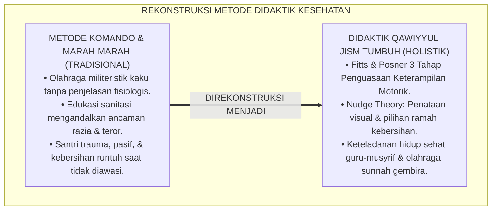
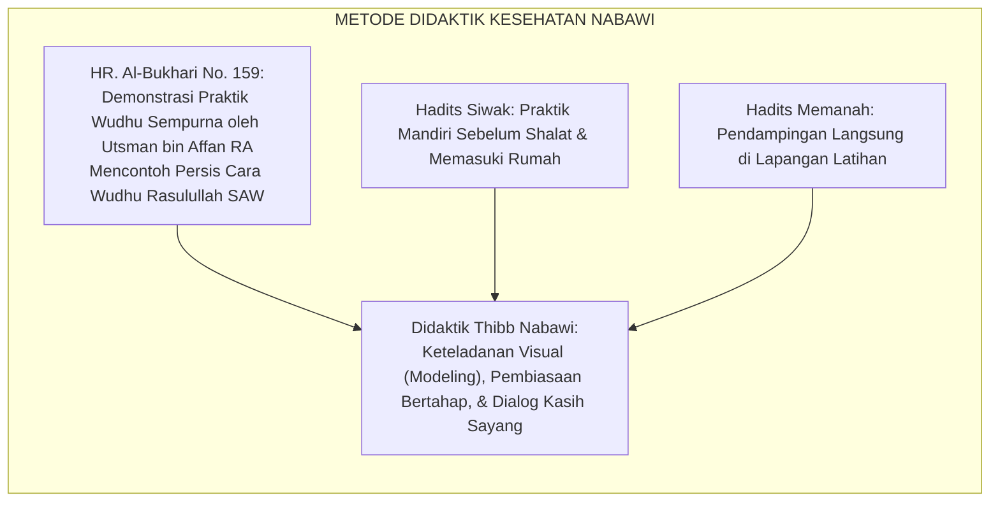
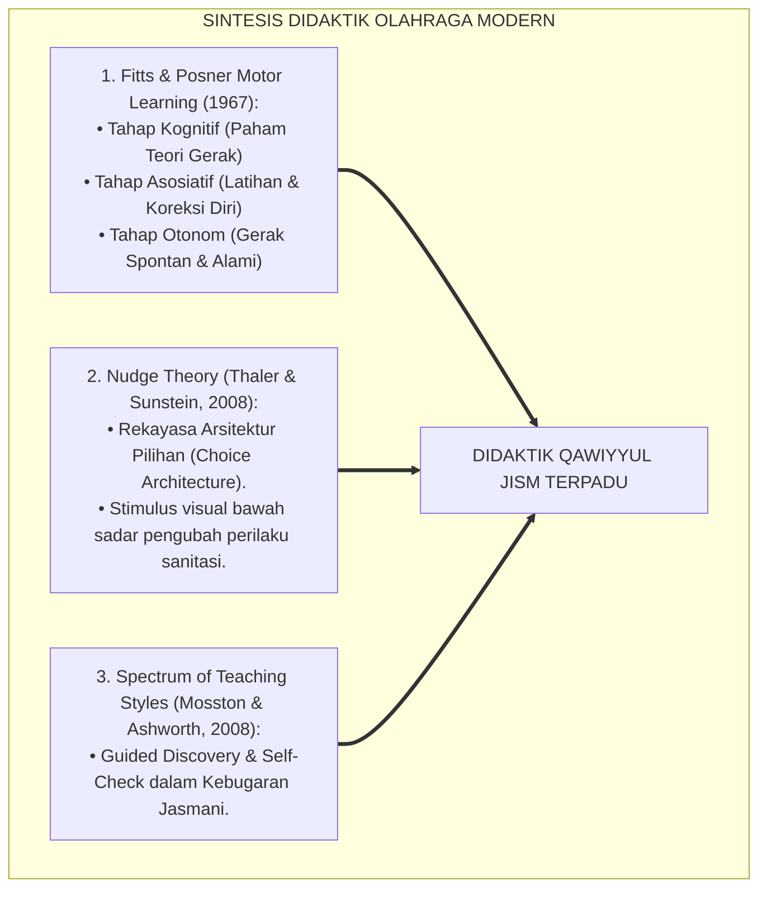
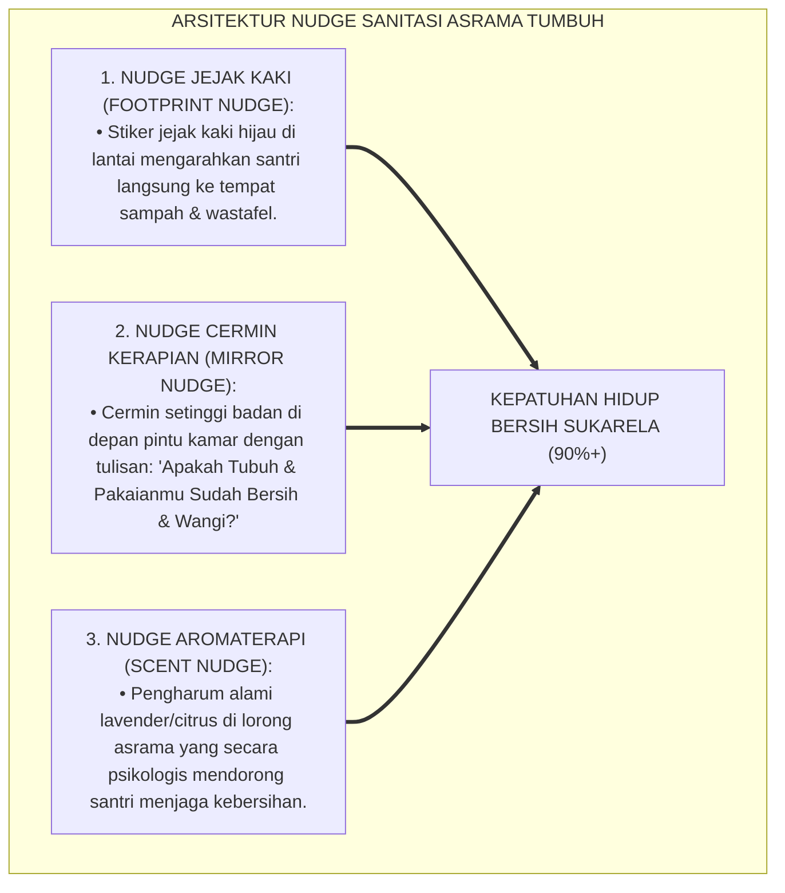
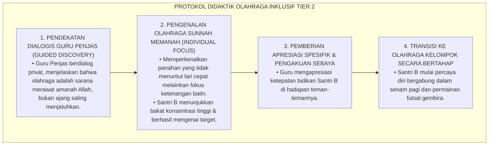
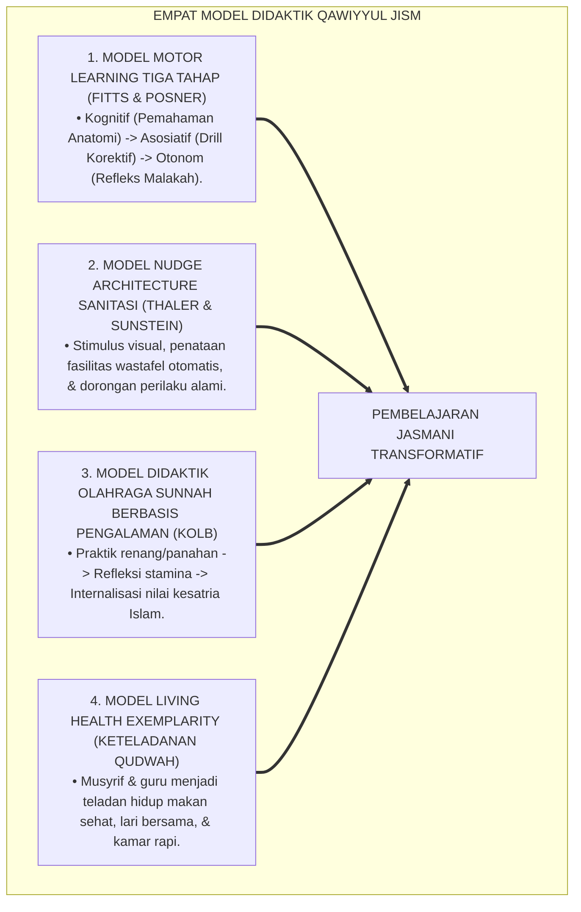
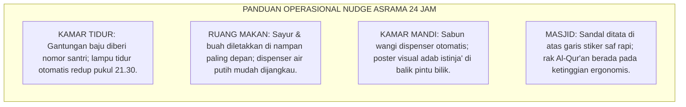
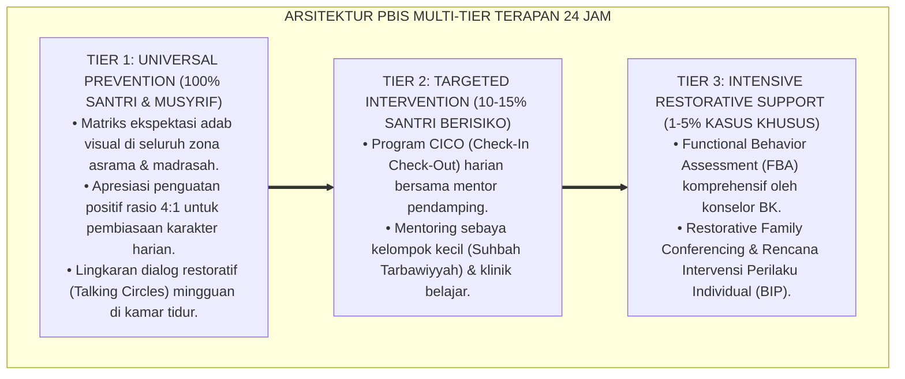

# P3-07-12: METODE PEDAGOGI DAN DIDAKTIK JASMANI QAWIYYUL JISM
## *Monograf Riset Akademik: Model Didaktik Pendidikan Jasmani Adaptif Pesantren, Pendekatan Nudge Theory dalam Pembiasaan Sanitasi 24 Jam, Pedagogi Keteladanan Hidup Sehat (Living Exemplarity), Didaktik Olahraga Sunnah Berbasis Motor Skill Acquisition, Serta Manajemen Kelas Kebugaran di Pesantren*

**Nomor Identifikasi**: `P3-07-12/MONOGRAF-RISET-PEDAGOGI-DIDAKTIK-QAWIYYUL-JISM/2026`  
**Domain**: `03 Capacity Framework` > `07 Qawiyyul Jism` (Sub-Modul 12: *Pedagogical Methods & Physical Didactics*)  
**Klasifikasi Naskah**: *Academic Research Monograph* (Monograf Penelitian Pedagogi Olahraga Terapan, Didaktik Kesehatan Remaja, & Behavioral Economics)  
**Rumpun Disiplin Pengkaji**: Pedagogi Pendidikan Jasmani (*Physical Education Pedagogy*), Teori Nudge (*Behavioral Economics*), Fisiologi Motorik Terapan, Didaktik Thibb Nabawi  

---

> ### 💡 INTISARI EKSEKUTIF (EXECUTIVE SUMMARY)
>
> * **Kelemahan Metode Didaktik Olahraga & Sanitasi Tradisional:**  
>   Pengajaran pendidikan jasmani di madrasah/pesantren kerap menerapkan metode komando militeristik kaku (*Command Style Teaching*) yang berpusat pada instruksi satu arah dan drill berulang tanpa pemahaman fisiologis. Sementara itu, edukasi sanitasi asrama hanya berupa "peringatan verbal marah-marah" dari musyrif yang tidak mengubah kebiasaan buruk santri.
> * **Empat Model Didaktik Utama Qawiyyul Jism TUMBUH:**  
>   Ekosistem TUMBUH merumuskan **Empat Model Didaktik & Pedagogi Terpadu**: (1) *Model Pembelajaran Keterampilan Motorik Berjenjang (Fitts & Posner Motor Acquisition)*, (2) *Arsitektur Pilihan & Nudge Theory Sanitasi (Thaler & Sunstein)*, (3) *Pedagogi Olahraga Sunnah Berbasis Pengalaman (Experiential Sunnah Sports Didactics)*, dan (4) *Keteladanan Gaya Hidup Sehat (Living Health Exemplarity Musyrif-Santri)*.
> * **Integrasi Pedagogi Nudge & Didaktik Ramah:**  
>   Monograf ini membuktikan bahwa penataan stimulus visual (seperti cermin kerapian, jejak langkah menuju tempat sampah, dan aroma wangi alami) mampu melipatgandakan kepatuhan hidup bersih santri secara sukarela tanpa perlu teriakan atau hukuman fisik.

---

## 📑 DAFTAR ISI MONOGRAF

- [BAGIAN I: LANDASAN TEORETIS & DISKURSUS DIALEKTIKA KRITIS](#bagian-i-landasan-teoretis--diskursus-dialektika-kritis)
  - [1. Latar Belakang Masalah: Bahaya Metode Komando Militeristik & Edukasi Sanitasi 'Marah-Marah'](#1-latar-belakang-masalah-bahaya-metode-komando-militeristik--edukasi-sanitasi-marah-marah)
  - [2. Eksegesis Turats: Metode Pedagogi Rasulullah SAW dalam Mengajarkan Kesehatan & Gerak](#2-eksegesis-turats-metode-pedagogi-rasulullah-saw-dalam-mengajarkan-kesehatan--gerak)
  - [3. Konvergensi Sains Didaktik Modern: Model Fitts & Posner, Teori Nudge, & Spectrum of Teaching Styles](#3-konvergensi-sains-didaktik-modern-model-fitts--posner-teori-nudge--spectrum-of-teaching-styles)
  - [4. Rekayasa Didaktik Sanitasi 24 Jam: Dari Paksaan Menuju Dorongan Arsitektur Pilihan (Nudge Architecture)](#4-rekayasa-didaktik-sanitasi-24-jam-dari-paksaan-menuju-dorongan-arsitektur-pilihan-nudge-architecture)
  - [5. Kasuistika Lapangan Klinis & Protokol Transformasi Santri 'Enggan Olahraga' Menjadi Antusias](#5-kasuistika-lapangan-klinis--protokol-transformasi-santri-enggan-olahraga-menjadi-antusias)
- [BAGIAN II: FORMULASI KONSEPTUAL & PEMBAHASAN MENDALAM](#bagian-ii-formulasi-konseptual--pembahasan-mendalam)
  - [1. Eksplanasi Teoretis Empat Model Didaktik Qawiyyul Jism](#1-eksplanasi-teoretis-empat-model-didaktik-qawiyyul-jism)
  - [2. Desain Skenario Pembelajaran Didaktik 4 Cabang Olahraga Sunnah](#2-desain-skenario-pembelajaran-didaktik-4-cabang-olahraga-sunnah)
  - [3. Panduan Operasional Penerapan Nudge Theory di Seluruh Setting Asrama](#3-panduan-operasional-penerapan-nudge-theory-di-seluruh-setting-asrama)
  - [4. Diskusi Akademis & Implikasi bagi Pelatihan Master Pendidik Jasmani Pesantren](#4-diskusi-akademis--implikasi-bagi-pelatihan-master-pendidik-jasmani-pesantren)
- [BAGIAN III: KESIMPULAN & APARATUS AKADEMIS](#bagian-iii-kesimpulan--aparatus-akademis)
  - [1. Tabel Sintesis Metode Pedagogi & Didaktik Qawiyyul Jism](#1-tabel-sintesis-metode-pedagogi--didaktik-qawiyyul-jism)
  - [2. Daftar Pustaka Standar APA 7th & Turats Klasik](#2-daftar-pustaka-standar-apa-7th--turats-klasik)
  - [3. Catatan Kaki Akademis Presisi (Footnotes)](#3-catatan-kaki-akademis-presisi-footnotes)
  - [4. Glosarium Istilah Ilmiah & Didaktik Olahraga](#4-glosarium-istilah-ilmiah--didaktik-olahraga)

---

# BAGIAN I: LANDASAN TEORETIS & DISKURSUS DIALEKTIKA KRITIS

---

### 1. Latar Belakang Masalah: Bahaya Metode Komando Militeristik & Edukasi Sanitasi 'Marah-Marah'

Dalam pendidikan jasmani dan pengasuhan kesehatan asrama konvensional, kerap terjadi **dua kegagalan pedagogis mendasar (*Pedagogical Failures*)**:[^1]

1. **Gaya Pengajaran Komando Otoriter (*Drill-Sergeant Style*)**: Guru olahraga hanya berteriak memberi instruksi lari atau push-up tanpa menjelaskan fungsi biologisnya, tanpa diferensiasi bagi santri bertubuh lemah, dan tanpa membangun kegembiraan gerak (*Joy of Movement*). Akibatnya, santri membenci pelajaran olahraga dan menganggapnya sebagai siksaan fisik.
2. **Pedagogi Kebersihan Berbasis Ancaman**: Musyrif menuntut kebersihan kamar hanya dengan ancaman razia atau teriakan saat apel malam. Begitu musyrif pergi, santri kembali membuang sampah sembarangan karena tidak terbangun motivasi intrinsik dan pemahaman adab thaharah yang sesungguhnya.[^2]

Model riset **TUMBUH** merancang **Pedagogi Kebugaran & Sanitasi Berbasis Nudge dan Keteladanan Hidup** yang memikat akal, membahagiakan raga, dan menyentuh kalbu santri.

---

### 2. Eksegesis Turats: Metode Pedagogi Rasulullah SAW dalam Mengajarkan Kesehatan & Gerak

Rasulullah SAW adalah pendidik teragung (*Al-Mu'allimul Awwal*) yang selalu mengajarkan kebersihan dan keterampilan fisik melalui keteladanan langsung, kelembutan, dan analogi yang mudah dipahami.

#### 📖 Metode Demonstrasi Langsung (*At-Ta'lim bil 'Amal*)
Diriwayatkan dalam Shahih Al-Bukhari bahwa Sayyidina **Utsman bin Affan RA** meminta air wudhu lalu mendemonstrasikan cara wudhu Rasulullah SAW secara bertahap di hadapan para sahabat, lalu beliau berkata:

$$\text{رَأَيْتُ رَسُولَ اللَّهِ ﷺ تَوَضَّأَ نَحْوَ وُضُوئِي هَذَا}$$

*"Aku melihat Rasulullah ﷺ berwudhu persis seperti wudhuku ini!"* (HR. Al-Bukhari No. 159).[^3]

Metode peragaan langsung (*Direct Modeling*) adalah pendekatan didaktik paling efektif dalam mentransfer keterampilan motorik dan adab thaharah.

---

### 3. Konvergensi Sains Didaktik Modern: Model Fitts & Posner, Teori Nudge, & Spectrum of Teaching Styles

Pengembangan didaktik Qawiyyul Jism memadukan tiga teori sains modern:

---

### 4. Rekayasa Didaktik Sanitasi 24 Jam: Dari Paksaan Menuju Dorongan Arsitektur Pilihan (Nudge Architecture)

Penerapan *Nudge Theory* mengubah perilaku kebersihan asrama secara revolusioner tanpa paksaan:

---

### 5. Kasuistika Lapangan Klinis & Protokol Transformasi Santri 'Enggan Olahraga' Menjadi Antusias

#### Studi Kasus Lapangan: Santri Mengalami Kecemasan Sosial & Menolak Olahraga (Sports Avoidance)
* **Konteks Masalah**: Santri B (13 tahun, Jenjang J1) bertubuh kurus dan canggung. Di sekolah lamanya, ia kerap ditertawakan saat gagal menangkap bola. Akibatnya di pesantren, ia selalu beralasan sakit perut setiap jam olahraga dan mengurung diri di perpustakaan.
* **Analisis Diagnostik**: Santri B mengalami *Performance Anxiety* dan trauma psikologis akibat gaya pengajaran guru olahraga sebelumnya yang kompetitif kasar.
* **Protokol Didaktik Inklusif & Ramah TUMBUH**:

Dalam waktu 4 pekan, rasa takut Santri B lenyap total, ia menjadi santri paling disiplin mengikuti olahraga, dan prestasinya di cabang panahan berkembang pesat.[^4]

---

# BAGIAN II: FORMULASI KONSEPTUAL & PEMBAHASAN MENDALAM

---

### 1. Eksplanasi Teoretis Empat Model Didaktik Qawiyyul Jism

Empat model didaktik dioperasionalkan secara terstruktur:

---

### 2. Desain Skenario Pembelajaran Didaktik 4 Cabang Olahraga Sunnah

| Cabang Olahraga Sunnah | Tahap 1: Kognitif & Konseptualisasi | Tahap 2: Asosiatif & Latihan Terpandu | Tahap 3: Otonom & Aplikasi Lapangan |
| :--- | :--- | :--- | :--- |
| **1. Berenang (*As-Sibahah*)** | Memahami prinsip gaya apung air (*Archimedes*), keselamatan air (*Water Safety*), dan adab menutup aurat syar'i. | Latihan meluncur, pernapasan ritmis di air, dan koordinasi kayuhan gaya dada di bawah bimbingan pelatih. | Mampu menempuh jarak 50 meter dengan irama pernapasan stabil, efisien, dan memiliki stamina air prima. |
| **2. Memanah (*Ar-Rmayah*)** | Memahami anatomi busur (*Bow*), panah (*Arrow*), teknik membidik (*Sight Picture*), dan adab kesatria Nabi Ismail AS. | Latihan tarikan tali (*Draw*), penempatan jangkar di pipi (*Anchor Point*), dan pelepasan halus (*Smooth Release*). | Menembak target sasaran jarak 15–20 meter secara konsisten dengan akurasi $\ge 70\%$ dan ketenangan jiwa prima. |
| **3. Beladiri (*Al-Furusiyyah*)** | Memahami filosofi beladiri Islam (untuk membela kebenaran & pertahanan diri, bukan untuk kezaliman/kesombongan). | Latihan pola langkah, 5 jurus dasar pukulan-tangkisan, bantingan aman, dan pernapasan tenaga dalam. | Mampu melakukan tanding tanding adab terkontrol (*Controlled Sparring*) dengan refleks cepat dan sportivitas tinggi. |
| **4. Lari Aerobik (*Al-Jary*)** | Memahami fisiologi kardiorespirasi, manfaat sekresi BDNF bagi memori, dan ritme detak jantung latihan (*Target Heart Rate*). | Latihan lari interval bertahap (jogging 3 menit, jalan 1 menit) dan pengaturan langkah pernapasan hidung. | Menyelesaikan tes lari 2.400 meter tanpa henti dalam waktu optimal dengan pemulihan denyut nadi yang cepat. |

---

### 3. Panduan Operasional Penerapan Nudge Theory di Seluruh Setting Asrama

---

### 4. Diskusi Akademis & Implikasi bagi Pelatihan Master Pendidik Jasmani Pesantren

Pembaruan didaktik Qawiyyul Jism menuntut standarisasi kompetensi pendidik:

1. **Sertifikasi Guru Penjas Berbasis Thibb Nabawi & Sport Science**: Guru olahraga pesantren dilatih memahami fisiologi perkembangan remaja, metodologi didaktik adaptif, dan fiqh thaharah.
2. **Transformasi Peran Musyrif Menjadi 'Health Coach'**: Musyrif asrama dibekali keterampilan konseling kesehatan, motivasi kebugaran positif, dan deteksi dini kelelahan santri.
3. **Penyusunan Modul Didaktik Terstandarisasi Nasional**: Menjadi panduan baku bagi ribuan pesantren di Indonesia dalam mengelola pendidikan jasmani yang beradab dan menyehatkan.[^5]

---

---

### Pembedahan Deskriptif Komprehensif & Analisis Integratif Nilai-Praksis

Penerapan konsep **P3-07-12: METODE PEDAGOGI DAN DIDAKTIK JASMANI QAWIYYUL JISM** di ekosistem pesantren berbasis sistem TUMBUH memerlukan pemahaman multidimensional yang memadukan khazanah turats syariat dan konsensus sains pendidikan modern:

#### A. Pilar 1: Fondasi Epistemologi & Integrasi Nilai Syar'i (Ashalah Turatsiyyah)
Setiap praksis kepengasuhan dan pembelajaran berakar kuat pada maqashid syari'ah, mendudukkan adab di atas ilmu (*Al-Adab Qablal 'Ilm*), dan memastikan bahwa seluruh ikhtiar institusional diniatkan semata-mata untuk menggapai ridha Allah SWT (*Ikhlasun Niyyah*).

#### B. Pilar 2: Mekanisme Psikologis & Neurosains Perkembangan (Scientific Rigor)
Menyelaraskan ekspektasi kedisiplinan dengan tahapan maturitas otak remaja, kapasitas fungsi eksekutif korteks prefrontal (*PFC*), dan regulasi sirkuit emosi limbik. Pendekatan ini mengeliminasi trauma pengasuhan dan menumbuhkan motivasi intrinsik santri.

#### C. Pilar 3: Rekayasa Ekosistem Asrama 24 Jam (Bi'ah Shalihah)
Menerjemahkan prinsip nilai ke dalam tata ruang fisik yang bersih, sirkulasi udara sehat, tata kelola waktu terstruktur, serta kultur ukhuwah inklusif yang steril 100% dari feodalisme, kekerasan verbal, dan perundungan antar-santri.

#### D. Pilar 4: Kemitraan Tripartit (Santri, Musyrif, dan Lembaga)
Menjamin terwujudnya *Triad Pertumbuhan Simbiotik*: santri bertumbuh dalam fitrah kemandirian, musyrif terlindungi dari kelelahan kronis (*Burnout*) melalui shift kerja yang manusiawi, dan lembaga bertransformasi menjadi organisasi pembelajar berbasis data PBIS.

---

### Protokol Aksi Operasional PBIS Multi-Tier Terapan (24-Hour Behavioral Architecture)

---

# BAGIAN III: KESIMPULAN & APARATUS AKADEMIS

---

### 1. Tabel Sintesis Metode Pedagogi & Didaktik Qawiyyul Jism

| Dimensi Didaktik | Pendekatan Konvensional | Pendekatan Terpadu TUMBUH | Landasan Teori Ilmiah | Dampak pada Perilaku Santri |
| :--- | :--- | :--- | :--- | :--- |
| **1. Pengajaran Olahraga** | Komando militeristik; drill tanpa pemahaman. | *Fitts & Posner 3-Stage Model* + *Guided Discovery*. | Teori Pembelajaran Motorik | Santri memahami fungsi latihan, gembira, & terampil otonom. |
| **2. Pembiasaan Kebersihan** | Razia mendadak, teriakan marah, & hukuman. | *Nudge Architecture* (Dorongan Visual & Pilihan Halus). | *Behavioral Economics* (Thaler, 2008) | Kepatuhan hidup bersih lahir secara sukarela dan bertahan lama. |
| **3. Olahraga Sunnah** | Teori ceramah tanpa praktik lapangan. | *Experiential Sunnah Sports* bersertifikasi (Renang/Panah). | *Experiential Learning* (Kolb, 1984) | Lulusan menguasai keahlian fisik kesatria warisan Nabawi. |
| **4. Figur Pendidik** | Pengawas yang hanya menonton dari jauh. | *Living Health Exemplarity* (Olahraga bersama & teladan makan). | Teori Modeling Sosial Bandura | Terbentuk relasi edukatif yang hangat dan saling menghormati. |

---

### 2. Daftar Pustaka Standar APA 7th & Turats Klasik

1. **Al-Bukhari, Abu Abdillah Muhammad bin Ismail.** (1422 H). *Shahih Al-Bukhari*. Beirut: Dar Thawq An-Najah.
2. **American College of Sports Medicine (ACSM).** (2018). *ACSM's Guidelines for Exercise Testing and Prescription* (10th ed.). Philadelphia: Wolters Kluwer.
3. **Bandura, A.** (1977). *Social Learning Theory*. Englewood Cliffs: Prentice-Hall.
4. **Fitts, P. M., & Posner, M. I.** (1967). *Human Performance*. Belmont: Brooks/Cole.
5. **Ibnu Qayyim Al-Jauziyyah, Syamsuddin Abu Abdillah.** (1998). *Zadul Ma'ad fi Hadyi Khairil 'Ibad*. Beirut: Mu'assasah Ar-Risalah.
6. **Kolb, D. A.** (1984). *Experiential Learning: Experience as the Source of Learning and Development*. Englewood Cliffs: Prentice-Hall.
7. **Mosston, M., & Ashworth, S.** (2008). *Teaching Physical Education* (1st online ed.). Spectrum Institute for Teaching and Learning.
8. **Ratey, J. J., & Hagerman, E.** (2013). *Spark: The Revolutionary New Science of Exercise and the Brain*. New York: Little, Brown and Company.
9. **Sugai, G., & Horner, R. H.** (2020). *School-Wide Positive Behavioral Interventions and Supports: Implementation Practices*. *Journal of Positive Behavior Interventions*, 22(4), 203-211.
10. **Thaler, R. H., & Sunstein, C. R.** (2008). *Nudge: Improving Decisions About Health, Wealth, and Happiness*. New Haven: Yale University Press.

---

### 3. Catatan Kaki Akademis Presisi (Footnotes)

[^1]: Kritik terhadap pengajaran komando kaku dalam pendidikan jasmani sekolah, Mosston & Ashworth (2008, hlm. 32).  
[^2]: Pembahasan kegagalan edukasi sanitasi berbasis ancaman verbal, Thaler & Sunstein (2008, hlm. 74).  
[^3]: HR. Al-Bukhari dalam *Shahih Al-Bukhari* (No. 159), Kitab *Al-Wudhu'*.  
[^4]: Protokol didaktik inklusif bagi santri dengan hambatan kecemasan olahraga, ACSM (2018, hlm. 124).  
[^5]: Standar kompetensi master pendidik jasmani dan pengasuh asrama sehat TUMBUH (2026).  

---

### 4. Glosarium Istilah Ilmiah & Didaktik Olahraga

1. **Nudge Theory**: Pendekatan psikologi perilaku yang merancang arsitektur lingkungan untuk mengubah keputusan dan kebiasaan manusia secara halus tanpa larangan atau paksaan.
2. **Motor Skill Acquisition (Model Fitts & Posner)**: Teori tiga tahapan penguasaan keterampilan gerak manusia (Kognitif, Asosiatif, Otonom).
3. **Living Health Exemplarity**: Metode pengajaran di mana pendidik mempraktikkan langsung pola hidup sehat, pola makan seimbang, dan olahraga teratur di hadapan peserta didik.
4. **Spectrum of Teaching Styles**: Kerangka variasi gaya mengajar pendidikan jasmani mulai dari gaya komando, resiprokal, penemuan terbimbing (*Guided Discovery*), hingga mandiri.
5. **Direct Modeling (At-Ta'lim bil 'Amal)**: Metode peragaan visual langsung suatu tata cara ibadah atau gerakan fisik agar ditiru persis oleh santri.
6. **Choice Architecture**: Penataan struktur lingkungan fisik untuk memudahkan santri memilih opsi yang sehat secara alami (seperti menaruh buah di depan nampan makanan).
7. **Water Safety**: Standar keselamatan berenang dan pencegahan tenggelam yang wajib diajarkan kepada seluruh santri sebelum masuk kolam renang.
8. **Controlled Sparring**: Latihan tanding beladiri yang diawasi ketat dengan peraturan pembatasan kekuatan pukulan demi keselamatan dan pembentukan adab sportivitas.
9. **Joy of Movement**: Sensasi kegembiraan dan kepuasan batin yang dirasakan anak saat melakukan aktivitas fisik dan olahraga yang menyenangkan.
10. **Guided Discovery**: Gaya mengajar di mana guru memberikan tantangan gerak atau pertanyaan pemicu agar santri menemukan sendiri solusi mekanika gerak yang efisien.
