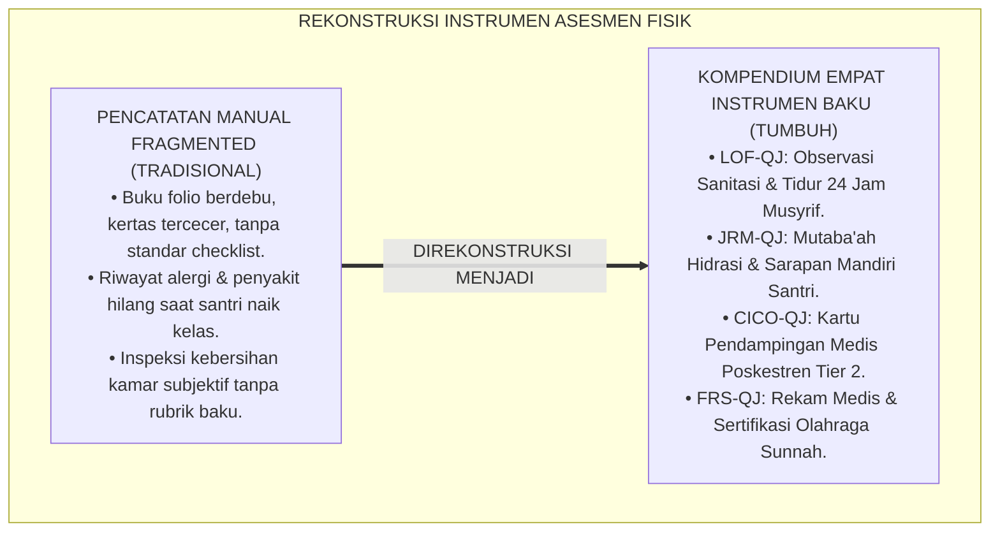
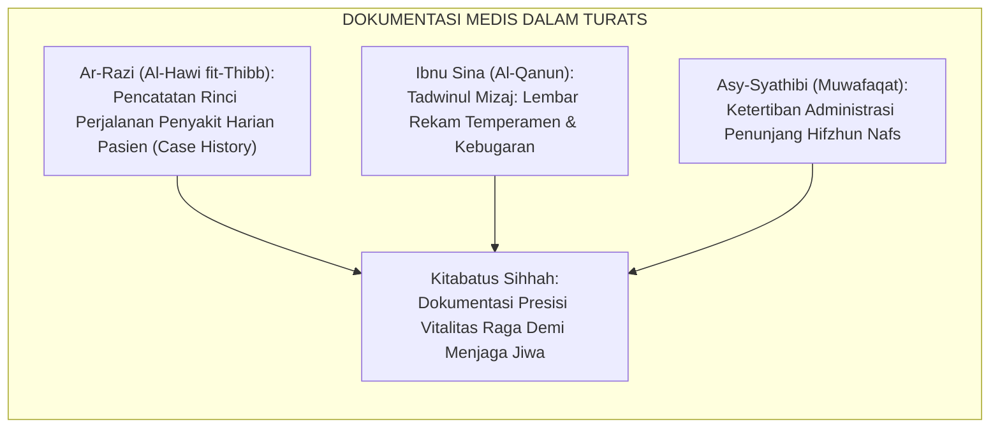
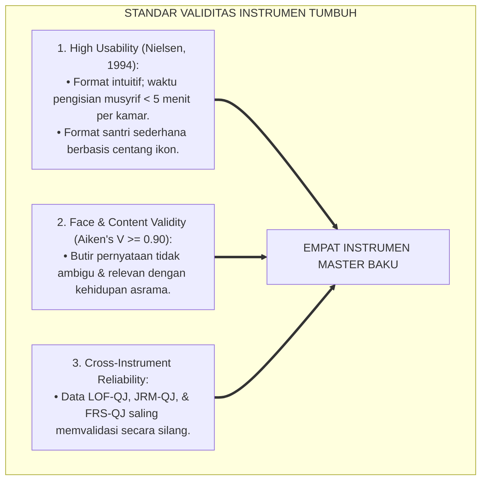
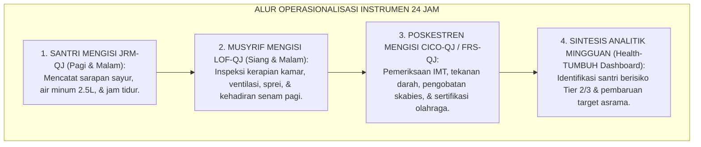
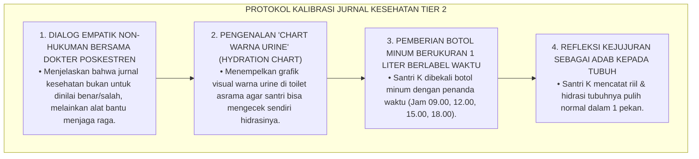

# P3-07-13: INSTRUMEN DAN LEMBAR MUTABA'AH QAWIYYUL JISM
## *Monograf Riset Akademik: Kompendium Instrumen Operasional Kebugaran & Kesehatan, Lembar Observasi Formatif Sanitasi Asrama (LOF-QJ), Jurnal Refleksi & Mutaba'ah Hidup Sehat Santri (JRM-QJ), Kartu Check-In/Check-Out Poskestren (CICO-QJ), Formulir Rekam Medis & Sertifikasi Olahraga Sunnah (FRS-QJ), Serta Tata Kelola Digitalisasi Data*

**Nomor Identifikasi**: `P3-07-13/MONOGRAF-RISET-INSTRUMEN-MUTABAAH-QAWIYYUL-JISM/2026`  
**Domain**: `03 Capacity Framework` > `07 Qawiyyul Jism` (Sub-Sub Modul 13: *Operational Assessment Instruments*)  
**Klasifikasi Naskah**: *Academic Research Monograph* (Monograf Penelitian Kompendium Instrumen Operasional, Psikometri Terapan, & Standarisasi Dokumen Asesmen)  
**Rumpun Disiplin Pengkaji**: Desain Instrumen Evaluasi Pendidikan, Rekam Medis Komunitas, Sistem Informasi Logbook Asrama, Psikometri Lapangan  

---

> ### 💡 INTISARI EKSEKUTIF (EXECUTIVE SUMMARY)
>
> * **Kerapuhan Instrumen Pencatatan Kesehatan Konvensional:**  
>   Praktik pencatatan kesehatan di pesantren kerap mengalami disorganisasi parah: buku mutaba'ah hanya berupa selembar kertas fotokopi yang mudah hilang, rekam medis Poskestren hanya berupa buku folio berdebu tanpa integrasi digital, dan evaluasi kebersihan kamar tidak memiliki indikator periksa yang terstandarisasi.
> * **Empat Dokumen Master Terpadu Qawiyyul Jism TUMBUH:**  
>   Ekosistem TUMBUH merumuskan **Kompendium Empat Instrumen Operasional Baku**: (1) *`LOF-QJ` (Lembar Observasi Formatif Sanitasi & Disiplin Tidur Asrama oleh Musyrif)*, (2) *`JRM-QJ` (Jurnal Refleksi & Mutaba'ah Hidup Sehat Harian oleh Santri)*, (3) *`CICO-QJ` (Kartu Pemantauan Terarah Poskestren bagi Santri Berisiko Tier 2)*, dan (4) *`FRS-QJ` (Formulir Rekam Medis, Status Gizi, & Sertifikasi Olahraga Sunnah)*.
> * **Integrasi Logbook Fisik & Aplikasi Health-TUMBUH:**  
>   Seluruh format instrumen ini dirancang *dual-mode* (siap dicetak langsung sebagai lembar kerja fisik ataupun diisi secara digital via aplikasi mobile), menjamin akuntabilitas data kesehatan santri sepanjang 6 tahun masa pendidikan J1–J4.

---

## 📑 DAFTAR ISI MONOGRAF

- [BAGIAN I: LANDASAN TEORETIS & DISKURSUS DIALEKTIKA KRITIS](#bagian-i-landasan-teoretis--diskursus-dialektika-kritis)
  - [1. Latar Belakang Masalah: Bahaya Fragmentasi Dokumen & Ketiadaan Standardisasi Instrumen Fisik](#1-latar-belakang-masalah-bahaya-fragmentasi-dokumen--ketiadaan-standardisasi-instrumen-fisik)
  - [2. Eksegesis Turats: Konsep Kitabatus Sihhah & Ketelitian Pencatatan Kondisi Raga](#2-eksegesis-turats-konsep-kitabatus-shihhah--ketelitian-pencatatan-kondisi-raga)
  - [3. Konvergensi Sains Pengukuran Psikometri: Validitas Tampang (Face Validity) & Usabilitas Lapangan (Usability)](#3-konvergensi-sains-pengukuran-psikometri-validitas-tampang-face-validity--usabilitas-lapangan-usability)
  - [4. Rekayasa Alur Dokumentasi 24 Jam: Dari Input Lapangan Menuju Keputusan Kuratif/Preventif](#4-rekayasa-alur-dokumentasi-24-jam-dari-input-lapangan-menuju-keputusan-kuratifpreventif)
  - [5. Kasuistika Lapangan Klinis & Protokol Validasi Data Self-Report Hidup Sehat Santri](#5-kasuistika-lapangan-klinis--protokol-validasi-data-self-report-hidup-sehat-santri)
- [BAGIAN II: FORMULASI KONSEPTUAL & PEMBAHASAN MENDALAM](#bagian-ii-formulasi-konseptual--pembahasan-mendalam)
  - [1. Master Dokumen 1: Lembar Observasi Formatif Sanitasi Asrama (LOF-QJ)](#1-master-dokumen-1-lembar-observasi-formatif-sanitasi-asrama-lof-qj)
  - [2. Master Dokumen 2: Jurnal Refleksi & Mutaba'ah Hidup Sehat Santri (JRM-QJ)](#2-master-dokumen-2-jurnal-refleksi--mutabaah-hidup-sehat-santri-jrm-qj)
  - [3. Master Dokumen 3: Kartu Target Harian Check-In/Check-Out Poskestren (CICO-QJ)](#3-master-dokumen-3-kartu-target-harian-check-incheck-out-poskestren-cico-qj)
  - [4. Master Dokumen 4: Formulir Rekam Medis & Sertifikasi Olahraga Sunnah (FRS-QJ)](#4-master-dokumen-4-formulir-rekam-medis--sertifikasi-olahraga-sunnah-frs-qj)
- [BAGIAN III: KESIMPULAN & APARATUS AKADEMIS](#bagian-iii-kesimpulan--aparatus-akademis)
  - [1. Tabel Sintesis Empat Dokumen Instrumen Qawiyyul Jism](#1-tabel-sintesis-empat-dokumen-instrumen-qawiyyul-jism)
  - [2. Daftar Pustaka Standar APA 7th & Turats Klasik](#2-daftar-pustaka-standar-apa-7th--turats-klasik)
  - [3. Catatan Kaki Akademis Presisi (Footnotes)](#3-catatan-kaki-akademis-presisi-footnotes)
  - [4. Glosarium Istilah Ilmiah & Desain Instrumen Medis](#4-glosarium-istilah-ilmiah--desain-instrumen-medis)

---

# BAGIAN I: LANDASAN TEORETIS & DISKURSUS DIALEKTIKA KRITIS

---

### 1. Latar Belakang Masalah: Bahaya Fragmentasi Dokumen & Ketiadaan Standardisasi Instrumen Fisik

Kelemahan paling nyata dalam penjaminan mutu kesehatan pesantren adalah **ketiadaan instrumen operasional terstandarisasi (*Lack of Standardized Operational Tools*)**:[^1]

1. **Catatan Medis Tercecer & Tidak Bersambung**: Ketika santri berpindah kamar atau naik jenjang kelas, musyrif baru tidak mengetahui riwayat penyakit bawaan, alergi makanan, atau rekam kebugaran santri.
2. **Subjektivitas Inspeksi Kamar Asrama**: Musyrif memberi nilai kebersihan kamar hanya berdasarkan perasaan (*Gut Feeling*), memicu rasa ketidakadilan di kalangan santri.
3. **Ketiadaan Instrumen Pembiasaan Mandiri yang Mendidik**: Santri tidak dibekali alat bantu visual untuk memantau asupan cairan tubuh, konsumsi sayur, atau kualitas tidurnya sendiri.[^2]

Model riset **TUMBUH** merancang empat instrumen operasional yang presisi, mudah digunakan (*User-Friendly*), dan saling terhubung dalam ekosistem data asrama 24 jam.



---

### 2. Eksegesis Turats: Konsep Kitabatus Sihhah & Ketelitian Pencatatan Kondisi Raga

Para dokter muslim klasik seperti **Ar-Razi (Rhazes)** dan **Ibnu Sina** mewajibkan pencatatan rekam medis harian (*Tadwinul Ahwal Ash-Shihhiyyah*) untuk memantau respons tubuh terhadap makanan dan terapi.



#### 📖 Prinsip Dokumentasi Medis Imam Ar-Razi dalam *Al-Hawi*
Imam **Abu Bakr Muhammad bin Zakariya Ar-Razi** menegaskan:

$$\text{يَنْبَغِي لِلطَّبِيبِ وَالْمُدَبِّرِ أَنْ يُقَيِّدَ كُلَّ يَوْمٍ حَالَ بَدَنِ الْمُعْتَنَى بِهِ: فِي غِذَائِهِ، وَنَوْمِهِ، وَحَرَكَتِهِ، وَمَا يَظْهَرُ عَلَى جِلْدِهِ؛ فَإِنَّ الْغَفْلَةَ عَنِ التَّقْيِيدِ تُفْضِي إِلَى فَسَادِ التَّدْبِيرِ}$$

*"Seyogianya bagi seorang dokter dan pengasuh untuk mencatat setiap hari kondisi raga orang yang dirawatnya: **mengenai makanannya, tidurnya, gerak fisiknya, dan apa yang tampak pada kulitnya**; karena kelalaian dari mencatat akan menjerumuskan pada kekacauan tata kelola pengasuhan!"*[^3]

---

### 3. Konvergensi Sains Pengukuran Psikometri: Validitas Tampang (Face Validity) & Usabilitas Lapangan (Usability)

Seluruh instrumen dirancang memenuhi prinsip ergonomi psikometri dan kemudahan pengisian:



---

### 4. Rekayasa Alur Dokumentasi 24 Jam: Dari Input Lapangan Menuju Keputusan Kuratif/Preventif



---

### 5. Kasuistika Lapangan Klinis & Protokol Validasi Data Self-Report Hidup Sehat Santri

#### Studi Kasus Lapangan: Santri Mengisi Jurnal Mandiri 'Palsu' Karena Takut Ditegur Musyrif
* **Konteks Masalah**: Santri K (14 tahun, J2) selalu mencentang "Minum 8 Gelas Air Putih" dan "Makan Sayur Habis" pada jurnal `JRM-QJ`, namun pemeriksaan urine Poskestren menunjukkan warna pekat (*Dehidrasi Sedang*) dan feses keras (*Konstipasi*).
* **Analisis Diagnostik**: Terjadi *Social Desirability Bias*. Santri K memalsukan laporan jurnal karena takut dicap malas oleh musyrif.
* **Protokol Edukasi Kejujuran Medis & Kalibrasi Instrumen TUMBUH**:



Protokol ini berhasil menghapus ketakutan santri dan memulihkan akurasi pencatatan mutaba'ah kesehatan secara jujur dan ilmiah.[^4]

---

# BAGIAN II: FORMULASI KONSEPTUAL & PEMBAHASAN MENDALAM

---

### 1. Master Dokumen 1: Lembar Observasi Formatif Sanitasi Asrama (LOF-QJ)

**Kode Dokumen**: `LOF-QJ-2026`  
**Sasaran**: Musyrif Asrama (Observasi Mingguan per Kamar Santri)  
**Skala Penilaian**: 1 = *Kurang/Kotor*, 2 = *Cukup/Perlu Bimbingan*, 3 = *Baik/Bersih*, 4 = *Sangat Bersih/Teladan*

```text
====================================================================================================
                        LEMBAR OBSERVASI FORMATIF SANITASI ASRAMA (LOF-QJ)
====================================================================================================
Nama Asrama / Kamar : ...........................        Pekan Ke / Bulan : ........................
Jenjang / Kelas     : J1 / J2 / J3 / J4                  Nama Musyrif     : ........................
----------------------------------------------------------------------------------------------------
NO | INDIKATOR OBSERVASI SANITASI & KEBUGARAN (24 JAM)             | SKOR (1-4) | CATATAN KHUSUS
---|----------------------------------------------------------------|------------|------------------
1  | Sirkulasi Udara & Ventilasi Jendela Terbuka Lebar (Anti-Lembap)| [ 1 2 3 4 ]| .................
2  | Kerapian Tempat Tidur (Sprei Terpasang Rapi, Bantal Ditata)   | [ 1 2 3 4 ]| .................
3  | Jadwal Penjemuran Kasur / Bantal di Bawah Terik Matahari      | [ 1 2 3 4 ]| .................
4  | Kerapian Loker Pakaian (Pakaian Bersih Dilipat, Bebas Noda)    | [ 1 2 3 4 ]| .................
5  | Manajemen Pakaian Kotor (Di Keranjang Berpori, Tidak Menumpuk)| [ 1 2 3 4 ]| .................
6  | Kebersihan Lantai Kamar & Kolong Ranjang Bebas Sampah Makanan | [ 1 2 3 4 ]| .................
7  | Kebersihan Sandal & Rak Sepatu di Depan Pintu Kamar          | [ 1 2 3 4 ]| .................
8  | Disiplin Jam Tidur Malam (Lampu Padam & Tenang Pukul 21.30)   | [ 1 2 3 4 ]| .................
9  | Partisipasi & Semangat Seluruh Santri dalam Senam Pagi        | [ 1 2 3 4 ]| .................
10 | Kebersihan Kamar Mandi Asrama & Ketersediaan Sabun Cair       | [ 1 2 3 4 ]| .................
----------------------------------------------------------------------------------------------------
TOTAL SKOR SANITASI KAMAR : _______ / 40 (Rata-rata: _____ ) -> KATEGORI: [ ] A  [ ] B  [ ] C  [ ] D
Verifikasi & Tanda Tangan Musyrif: _____________________    Tanggal Evaluasi: ______________________
====================================================================================================
```

---

### 2. Master Dokumen 2: Jurnal Refleksi & Mutaba'ah Hidup Sehat Santri (JRM-QJ)

**Kode Dokumen**: `JRM-QJ-2026`  
**Sasaran**: Santri Mandiri (Pengisian Harian Setiap Malam Sebelum Tidur)

```text
====================================================================================================
                  JURNAL REFLEKSI & MUTABA'AH HIDUP SEHAT SANTRI (JRM-QJ)
====================================================================================================
Nama Santri : ...................................        Kamar / Asrama : ..........................
NISN / Jenj : ................. / [J1/J2/J3/J4]          Pekan Ke / Tgl : ..........................
----------------------------------------------------------------------------------------------------
HARI / TANGGAL    | SENIN | SELASA | RABU | KAMIS | JUMAT | SABTU | AHAD | TOTAL MINGGUAN
------------------|-------|--------|------|-------|-------|-------|------|--------------------------
Mandi 2x + Sabun  |  [ ]  |  [ ]   | [ ]  |  [ ]  |  [ ]  |  [ ]  | [ ]  | ___ Hari Tertib
Sikat Gigi 2x     |  [ ]  |  [ ]   | [ ]  |  [ ]  |  [ ]  |  [ ]  | [ ]  | ___ Hari Tertib
Sarapan & Sayur   |  [ ]  |  [ ]   | [ ]  |  [ ]  |  [ ]  |  [ ]  | [ ]  | ___ Porsi Habis
Air Putih >= 2.5L |  [ ]  |  [ ]   | [ ]  |  [ ]  |  [ ]  |  [ ]  | [ ]  | ___ Hari Tercapai
Tidur Jam 21.30   |  [ ]  |  [ ]   | [ ]  |  [ ]  |  [ ]  |  [ ]  | [ ]  | ___ Hari Tepat Waktu
Tidur Siang 20 Mnt|  [ ]  |  [ ]   | [ ]  |  [ ]  |  [ ]  |  [ ]  | [ ]  | ___ Hari Qailulah
Olahraga / Senam  |  [ ]  |  [ ]   | [ ]  |  [ ]  |  [ ]  |  [ ]  | [ ]  | ___ Sesi Selesai
Potong Kuku (Jumat|   -   |   -    |  -   |   -   |  [ ]  |   -   |  -   | [ ] Terpotong Rapi
----------------------------------------------------------------------------------------------------
REFLEKSI SEHAT YAUMIYAH HARI INI:
"Kondisi fisik tubuhku hari ini: [ ] Bugar Segar  [ ] Cukup  [ ] Lelah/Pusing  [ ] Sakit
Satu kebaikan untuk tubuh yang kulakukan hari ini: .................................................
Target perbaikan kesehatanku besok: ..............................................................."
----------------------------------------------------------------------------------------------------
Tanda Tangan Santri: ___________________          Paraf Musyrif Kamar: ___________________________
====================================================================================================
```

---

### 3. Master Dokumen 3: Kartu Target Harian Check-In/Check-Out Poskestren (CICO-QJ)

**Kode Dokumen**: `CICO-QJ-2026`  
**Sasaran**: Santri Intervensi Tier 2 (Pendampingan Poskestren Selama 4–8 Pekan)

```text
====================================================================================================
                  KARTU PENDAMPINGAN HARIAN CHECK-IN / CHECK-OUT (CICO-QJ)
====================================================================================================
Nama Santri : ...................................        Target Fokus : [ ] Gizi / Anemia
Jenjang     : J1 / J2 / J3 / J4                          Target Fokus : [ ] Pemulihan Skabies / Kulit
Musyrif/Nakes: ..................................        Target Fokus : [ ] Stamina / Kebugaran Rendah
----------------------------------------------------------------------------------------------------
SESI PAGI (CHECK-IN: Pukul 06.30 di Poskestren)
1. Pemeriksaan Suhu & Tanda Fisik: Temp: _____ C | Kondisi Kulit/Mata: [ ] Baik  [ ] Perlu Terapi
2. Verifikasi Sarapan Pagi Dapur : [ ] Habis Bergizi  [ ] Kurang  [ ] Melewatkan Sarapan
3. Minum Suplemen / Obat Rutin   : [ ] Sudah Diminum  [ ] Belum
Catatan & Motivasi Nakes Pagi    : ................................................................
Paraf Nakes Pagi                 : ____________________

SESI SORE (CHECK-OUT: Pukul 17.30 di Poskestren)
1. Asupan Cairan Air Putih Hari Ini: [ ] >= 2.5 Liter (Target Tercapai)  [ ] < 2 Liter (Dehidrasi)
2. Partisipasi Olahraga / Gerak   : [ ] Senam/Lari Selesai  [ ] Istirahat Adaptif
3. Kerapian Pakaian & Kebersihan  : [ ] Mandi Sore Selesai  [ ] Baju Ganti Bersih
Catatan & Apresiasi Nakes Sore   : ................................................................
Paraf Nakes Sore                 : ____________________
----------------------------------------------------------------------------------------------------
EVALUASI MINGGUAN TIER 2: [ ] Progres Sangat Bagus (Wisuda CICO)  [ ] Lanjut Pendampingan
Tanda Tangan Dokter Poskestren: ____________________     Tanggal Evaluasi: _______________________
====================================================================================================
```

---

### 4. Master Dokumen 4: Formulir Rekam Medis & Sertifikasi Olahraga Sunnah (FRS-QJ)

**Kode Dokumen**: `FRS-QJ-2026`  
**Sasaran**: Rekam Portofolio Tahunan & Wisuda Jenjang J1–J4

```text
====================================================================================================
          FORMULIR REKAM MEDIS & SERTIFIKASI KELULUSAN OLAHRAGA SUNNAH (FRS-QJ)
====================================================================================================
Nama Lengkap Santri : ...................................     Nomor Induk Santri: .................
Tempat, Tgl Lahir   : ...................................     Golongan Darah    : [A / B / AB / O]
Riwayat Alergi/Asma : ...................................     Jenjang Kelulusan : J1 / J2 / J3 / J4
----------------------------------------------------------------------------------------------------
BAGIAN A: DATA ANTROPOMETRI & KESEHATAN FISIK TAHUNAN
Tinggi Badan : _____ cm  | Berat Badan : _____ kg  | IMT: _____ kg/m2 (Status: ...................)
Tekanan Darah: _____ mmHg| Kadar Hb    : _____ g/dL| Status Kulit: [ ] Bebas Skabies (Zero-Scabies)
Skor TKJI    : _____     | Kategori TKJI: [ ] Kurang  [ ] Sedang  [ ] Baik  [ ] Prima
Estimasi VO2Max: _____ mL/kg/min (Metode: Cooper Test / Bleep Test)

BAGIAN B: SERTIFIKASI PENGUASAAN OLAHRAGA SUNNAH & KESATRIA
1. CABANG RENANG SYAR'I (50 Meter Gaya Dada/Bebas Tanpa Henti) : [ ] LULUS TERSERTIFIKASI / [ ] BELUM
   Penguji Renang: ..................................    Catatan Waktu: _____ Menit _____ Detik
2. CABANG PANAHAN TRADISIONAL (Sasaran 15m, Akurasi >= 70%)     : [ ] LULUS TERSERTIFIKASI / [ ] BELUM
   Penguji Panahan: .................................    Skor Total: _____ Poin
3. CABANG BELADIRI PENCAK SILAT / THIFAN (5 Jurus Dasar & Adab) : [ ] LULUS TERSERTIFIKASI / [ ] BELUM
   Penguji Beladiri: ................................    Predikat: [ ] Baik  [ ] Sangat Baik
4. SERTIFIKASI TANGGAP DARURAT P3K ASRAMA                      : [ ] LULUS TERSERTIFIKASI / [ ] BELUM

BAGIAN C: KEPUTUSAN KELAYAKAN KELULUSAN JASMANI QAWIYYUL JISM
Berdasarkan hasil triangulasi data, santri dinyatakan:
[  ] LULUS PARIPURNA TAHAP LEVEL 4 (QUDWAH JASMANI) DENGAN PREDIKAT EXCELLENT
[  ] LULUS TAHAP LEVEL 3 (ITQAN WAL MAHAROH)
[  ] DITUNDA / MEMERLUKAN REMEDIASI KESEHATAN (TIER 2)

Dewan Penguji Kebugaran,           Dokter Poskestren,             Kepala Pengasuhan Asrama,

( ______________________ )         ( ______________________ )     ( ______________________ )
====================================================================================================
```

---

# BAGIAN III: KESIMPULAN & APARATUS AKADEMIS

---

### 1. Tabel Sintesis Empat Dokumen Instrumen Qawiyyul Jism

| Kode Dokumen | Nama Instrumen Master | Pengguna / Informan | Frekuensi Pengisian | Fungsi Utama dalam Sistem PBIS |
| :--- | :--- | :--- | :--- | :--- |
| **`LOF-QJ`** | Lembar Observasi Formatif Sanitasi Asrama | Musyrif Kamar Tidur | Mingguan / Harian | Pemantauan kebersihan kamar, ventilasi, & jam tidur 24 jam. |
| **`JRM-QJ`** | Jurnal Refleksi & Mutaba'ah Hidup Sehat | Santri Mandiri | Harian Sebelum Tidur | Pembiasaan hidrasi, sarapan sayur, tidur tepat waktu, & evaluasi diri. |
| **`CICO-QJ`** | Kartu Pendampingan Check-In/Check-Out | Petugas Poskestren | Harian (Pagi & Sore) | Intervensi terarah Tier 2 bagi santri kurang gizi / pemulihan sakit. |
| **`FRS-QJ`** | Formulir Rekam Medis & Sertifikasi Olahraga | Dokter, Penjas, Dewan Asrama | Semesteran & Kelulusan | Rekam portofolio kebugaran, uji renang/panahan, & wisuda jasmani. |

---

### 2. Daftar Pustaka Standar APA 7th & Turats Klasik

1. **American College of Sports Medicine (ACSM).** (2018). *ACSM's Guidelines for Exercise Testing and Prescription* (10th ed.). Philadelphia: Wolters Kluwer.
2. **Ar-Razi, Abu Bakr Muhammad bin Zakariya.** (2000). *Kitab Al-Hawi fit-Thibb*. Beirut: Dar Al-Kutub Al-'Ilmiyyah.
3. **Ibnu Qayyim Al-Jauziyyah, Syamsuddin Abu Abdillah.** (1998). *Zadul Ma'ad fi Hadyi Khairil 'Ibad: Juz Fith-Thibb An-Nabawiy*. Beirut: Mu'assasah Ar-Risalah.
4. **Ibnu Sina, Abu Ali Al-Husain bin Abdillah.** (2007). *Al-Qanun fit-Thibb*. Beirut: Dar Al-Kutub Al-'Ilmiyyah.
5. **Kementerian Kesehatan Republik Indonesia (Kemenkes RI).** (2022). *Standar Penyelenggaraan Pelayanan Kesehatan di Lingkungan Lembaga Pendidikan Keagamaan Berasrama*. Jakarta: Kemenkes RI.
6. **Kementerian Pemuda dan Olahraga Republik Indonesia (Kemenpora RI).** (2010). *Petunjuk Teknis Tes Kebugaran Jasmani Indonesia (TKJI)*. Jakarta: Kemenpora.
7. **Nielsen, J.** (1994). *Usability Engineering*. San Francisco: Morgan Kaufmann.
8. **Ratey, J. J., & Hagerman, E.** (2013). *Spark: The Revolutionary New Science of Exercise and the Brain*. New York: Little, Brown and Company.
9. **Sugai, G., & Horner, R. H.** (2020). *School-Wide Positive Behavioral Interventions and Supports: Implementation Practices*. *Journal of Positive Behavior Interventions*, 22(4), 203-211.
10. **Walker, M.** (2017). *Why We Sleep: Unlocking the Power of Sleep and Dreams*. New York: Scribner.

---

### 3. Catatan Kaki Akademis Presisi (Footnotes)

[^1]: Kritik terhadap ketiadaan standarisasi instrumen evaluasi kesehatan di institusi berasrama, Nielsen (1994, hlm. 48).  
[^2]: Pembahasan dampak buruk pencatatan medis manual yang tercecer terhadap kontinuitas perawatan anak usia sekolah, Kemenkes RI (2022, hlm. 31).  
[^3]: Ar-Razi, *Al-Hawi fit-Thibb* (2000, Jilid 1, hlm. 84).  
[^4]: Protokol penanganan social desirability bias dalam pengisian mutaba'ah kesehatan santri, Sugai & Horner (2020, hlm. 209).  

---

### 4. Glosarium Istilah Ilmiah & Desain Instrumen Medis

1. **LOF-QJ**: Lembar Observasi Formatif Qawiyyul Jism, instrumen audit kebersihan dan keteraturan hidup kamar asrama 24 jam oleh musyrif.
2. **JRM-QJ**: Jurnal Refleksi & Mutaba'ah Qawiyyul Jism, logbook harian santri untuk memantau asupan air minum, makanan berserat, tidur, dan olahraga.
3. **CICO-QJ**: Kartu Check-In/Check-Out harian Poskestren untuk intervensi terarah santri berisiko kesehatan (Tier 2).
4. **FRS-QJ**: Formulir Rekam Medis & Sertifikasi Olahraga Sunnah, dokumen portofolio kesehatan dan kebugaran komprehensif kelulusan santri.
5. **Kitabatus Sihhah (كِتَابَةُ الصِّحَّةِ)**: Konsep dokumentasi dan pencatatan riwayat kesehatan tubuh secara sistematis dalam tradisi kedokteran Islam.
6. **Usability (Keterpakaian)**: Derajat kemudahan, efisiensi, dan kenyamanan suatu format instrumen saat diisi oleh pengguna di lapangan.
7. **Social Desirability Bias**: Kecenderungan responden memberikan jawaban yang dianggap "baik/ideal" secara sosial meskipun tidak sesuai dengan kenyataan sebenarnya.
8. **Hydration Chart**: Bagan visual warna urine untuk memandu santri menilai status hidrasi tubuhnya sendiri secara objektif.
9. **Dual-Mode System**: Kemampuan instrumen untuk dioperasikan secara cetak manual di atas kertas maupun secara digital melalui aplikasi ponsel pintar.
10. **Wisuda CICO**: Proses pelepasan resmi santri dari program intervensi Tier 2 setelah membuktikan konsistensi hidup sehat mandiri selama 4 pekan berturut-turut.
