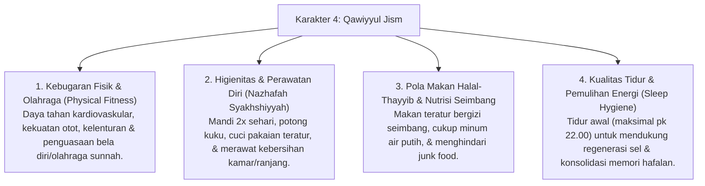

# P3-07-Qawiyyul-Jism-Induk (Karakter 4: Jasmani yang Kuat, Bugar & Sehat)

## Tujuan
Menetapkan kerangka kapasitas menyeluruh untuk **Karakter 4: Qawiyyul Jism (Jasmani yang Kuat, Bugar & Sehat)** dalam ekosistem pesantren TUMBUH: membentuk santri yang memiliki kebugaran jasmani prima (*Physical Fitness*), imunitas kuat, menjaga higienitas diri dan asrama (*Nazhafah*), mengonsumsi makanan halal-thayyib, menguasai olahraga bela diri/sunnah, serta terbebas dari penyakit menular khas asrama (Scabies/ISPA).

---

## 1. 4 Dimensi Karakter Qawiyyul Jism

---

## 2. Matriks Rubrik 4 Level Capaian Qawiyyul Jism

| Dimensi Perilaku | Level 1: Emerging (T1) | Level 2: Developing (T2) | Level 3: Proficient (T3) | Level 4: Exemplary (T4 - Qudwah) |
| :--- | :--- | :--- | :--- | :--- |
| **Higienitas & Kebersihan Diri** | Malas mandi, menggantung pakaian kotor sembarangan, kuku panjang & kotor. | Mandi teratur 2x sehari, namun sesekali menumpuk pakaian kotor di lemari. | Mandi tertib, mencuci baju teratur, kuku terpotong rapi setiap hari Jumat. | Menjadi teladan kebersihan diri, mengedukasi rekan sekamar tentang pencegahan penyakit kulit. |
| **Kebugaran & Olahraga** | Cepat lelah saat jalan ke masjid, malas mengikuti senam/olahraga asrama. | Mengikuti senam/olahraga rutin, namun belum memiliki inisiatif olahraga mandiri. | Bugar, aktif berolahraga sore (futsal/panahan/bela diri), memiliki stamina hafalan prima. | Menjadi instruktur senam pagi/kapten tim olahraga, memotivasi seluruh santri untuk aktif bergerak. |
| **Pola Makan & Tidur Sehat** | Sering jajan sembarangan, kurang minum air putih, begadang hingga larut malam. | Makan di dapur asrama teratur, namun sesekali masih begadang mengobrol. | Menjaga pola makan gizi seimbang, minum air putih 2 liter/hari, tidur tertib pk 22.00. | Menginspirasi gaya hidup sehat dan disiplin istirahat bagi seluruh rekan sekamarnya. |

---

## 3. Status Dokumen
* **Status**: 🌟 **A+ (Dokumen Induk Qawiyyul Jism)**
* **Level**: Project 3 - `03 Capacity Framework / 07 Qawiyyul Jism`
* **Langkah Berikutnya**: Melengkapi sub-modul 01 hingga 14.
