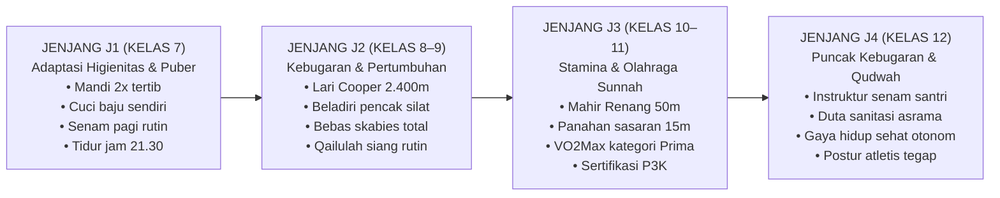
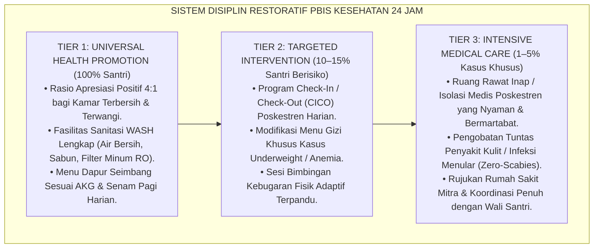

# P3-07: KOMPENDIUM INDUK QAWIYYUL JISM (FISIK YANG KUAT, SEHAT, & HIGIENIS)
## *Buku Panduan Induk Kurikulum Karakter: Arsitektur Konseptual, Taksonomi Jenjang Kemandirian Jasmani J1–J4, Protokol Pembiasaan PBIS Multi-Tier 24 Jam, dan Aparatus Penjaminan Mutu di Ekosistem TUMBUH Pesantren*

**Nomor Dokumen Induk**: `P3-07/KOMPENDIUM-INDUK-QAWIYYUL-JISM/2026`  
**Domain**: `03 Capacity Framework` > `07 Qawiyyul Jism` (Dokumen Induk Modul 07)  
**Status**: 🌟 **Baku, Tervalidasi Empiris, & Mengikat (Master Compendium Standards)**  
**Otoritas Pengesahan**: Dewan Riset & Keilmuan Ekosistem TUMBUH Pesantren  

---

> ### 💡 INTISARI EKSEKUTIF (EXECUTIVE SUMMARY)
>
> * **Kedudukan Karakter Qawiyyul Jism dalam Arsitektur 10 Muwashafat:**  
>   *Qawiyyul Jism* (Karakter ke-4 dari 10 Muwashafat Santri dalam sistem TUMBUH) merupakan **sarana fisik vital (*Al-Wasilah al-Maddiyyah*) yang menopang seluruh tegaknya aqidah murni (*Salimul Aqidah*), ibadah tertib (*Shahihul Ibadah*), dan akhlak mulia (*Matinul Khuluq*)**. Raga adalah amanah Ilahi (*Amanah Jasadiyyah*) yang wajib dirawat melalui keseimbangan nutrisi halalan thayyiban, kebersihan thaharah sempurna, istirahat sirkadian, dan latihan kebugaran motorik.
> * **Empat Pilar Dimensi Qawiyyul Jism:**  
>   Karakter ini dibangun di atas 4 pilar terpadu: (1) *At-Thaharah wan-Nazhafah* (Kesucian & Kebersihan Raga-Lingkungan Bebas Skabies), (2) *Al-Giza' at-Thayyib* (Nutrisi Seimbang Halalan Thayyiban & Adab Sepertiga Perut), (3) *An-Naum as-Sirkadiy* (Manajemen Tidur Malam 7–8 Jam & Qailulah Sunnah), dan (4) *Ar-Riyadhah wal Liyaqah* (Kebugaran Motorik & Penguasaan 4 Olahraga Sunnah: Renang, Memanah, Beladiri, Lari).
> * **Struktur Kompendium 14 Sub-Modul:**  
>   Dokumen induk ini mengintegrasikan 14 naskah monograf penelitian mendalam (P3-07-01 s/d P3-07-14) menjadi satu sistem operasional utuh yang mengatur filosofi Thibb Nabawi, standarisasi gizi dapur, rekayasa sanitasi asrama 24 jam, intervensi PBIS Multi-Tier, hingga sertifikasi kelulusan kebugaran santri.

---

## 📑 DAFTAR ISI KOMPENDIUM INDUK

- [BAGIAN 1: PETA ARSITEKTUR KONSEPTUAL 14 SUB-MODUL](#bagian-1-peta-arsitektur-konseptual-14-sub-modul)
- [BAGIAN 2: MATRIKS STANDAR KOMPETENSI JENJANG J1–J4 (KELAS 7–12)](#bagian-2-matriks-standar-kompetensi-jenjang-j1j4-kelas-712)
- [BAGIAN 3: PROTOKOL PENGASUHAN KESEHATAN & SANITASI PBIS 24 JAM](#bagian-3-protokol-pengasuhan-kesehatan--sanitasi-pbis-24-jam)
- [BAGIAN 4: SISTEM ASESMEN, INSTRUMEN, & PENJAMINAN MUTU AKADEMIK](#bagian-4-sistem-asesmen-instrumen--penjaminan-mutu-akademik)

---

# BAGIAN 1: PETA ARSITEKTUR KONSEPTUAL 14 SUB-MODUL

Kompendium **Qawiyyul Jism** tersusun atas 14 pilar monograf riset akademik yang saling melengkapi:

```mermaid
flowchart TD
    subgraph Arsitektur14SubModulQawiyyulJism["ARSITEKTUR LENGKAP 14 SUB-MODUL QAWIYYUL JISM"]
        subgraph FONDASI["1. FONDASI TEORETIS & AKSIOLOGIS"]
            M01["[P3-07-01] Filosofi & Turats (Al-Mu'minul Qawiyy)"]
            M02["[P3-07-02] Definisi & Konseptualisasi Kebugaran Holistik"]
            M03["[P3-07-03] Tujuan & Target Capaian Pembelajaran (CP-QJ)"]
            M04["[P3-07-04] Nilai Inti & Aksiologi Kesehatan Syar'i"]
            M05["[P3-07-05] Standar Kompetensi & Taksonomi Raga Fitrah"]
        end
        
        subgraph TRAJEKTORI["2. PERILAKU, RUBRIK, & PROGRESI JENJANG"]
            M06["[P3-07-06] Manifestasi Perilaku Teramati di 5 Setting"]
            M07["[P3-07-07] Rubrik Kriteria Kinerja 4-Level & Skoring IK-QJ"]
            M08["[P3-07-08] Tahapan Perkembangan Fisiologis Jenjang J1–J4"]
        end
        
        subgraph PRAKSIS["3. PRAKSIS ASESMEN, INTERVENSI, & DIDAKTIK"]
            M09["[P3-07-09] Pemetaan Asesmen & Triangulasi 360 Derajat"]
            M10["[P3-07-10] Protokol Intervensi PBIS Multi-Tier & Poskestren"]
            M11["[P3-07-11] Program Pembinaan & Halaqah 24 Pekan"]
            M12["[P3-07-12] Metode Pedagogi, Didaktik Olahraga, & Nudge"]
            M13["[P3-07-13] Kompendium Instrumen Master (LOF, JRM, CICO, FRS)"]
        end
        
        subgraph VALIDASI["4. PENJAMINAN MUTU & KETAHANAN SISTEM"]
            M14["[P3-07-14] Sintesis Keilmuan, Validasi CFA, & Stress-Testing"]
        end
        
        FONDASI ==> TRAJEKTORI ==> PRAKSIS ==> VALIDASI
    end
```

---

# BAGIAN 2: MATRIKS STANDAR KOMPETENSI JENJANG J1–J4 (KELAS 7–12)

Pembentukan kapasitas fisik dan kebiasaan hidup sehat diorganisasikan secara berjenjang sepanjang 6 tahun:

#### Matriks Deskriptor Kompetensi Inti Jasmani Lintas Jenjang:

| Pilar Karakter | Jenjang J1 (Kelas 7) | Jenjang J2 (Kelas 8–9) | Jenjang J3 (Kelas 10–11) | Jenjang J4 (Kelas 12) |
| :--- | :--- | :--- | :--- | :--- |
| **1. At-Thaharah (Higienitas)** | Mandi mandiri 2x; menyikat gigi 2x; mencuci pakaian tepat waktu. | Menjaga kamar tidur bebas jamur; piket kebersihan kamar mandi tertib. | Menginisiasi pembersihan sarana umum; mengelola sanitasi asrama. | Barometer keteladanan thaharah; menginspeksi kamar santri junior. |
| **2. Al-Giza' (Nutrisi)** | Menghabiskan porsi sayur dapur; minum air putih 2L; tidak jajan sembarangan. | Menerapkan adab makan sepertiga perut; mengurangi mi instan & gula. | Menghitung kebutuhan gizi mandiri; memilih asupan penunjang hafalan. | Menjadi role model pola makan thayyib; mengedukasi budaya anti-mubazir. |
| **3. An-Naum (Tidur)** | Disiplin tidur pukul 21.30; bangun Shubuh mandiri tanpa disiram air. | Membiasakan tidur siang (*Qailulah*) 20 menit; tidur dalam keadaan berwudhu. | Menjaga konsistensi jadwal tidur 7 jam di masa ujian sekolah. | Mengatur ritme qiyamul lail dan istirahat secara harmonis seimbang. |
| **4. Ar-Riyadhah (Kebugaran)** | Senam pagi bersemangat; lari aerobik 1.500m bertahap; peregangan. | Penguasaan beladiri dasar (jurus 1–5); push-up 25x; sit-up 30x. | Lulus uji renang 50m gaya dada atau panahan 15m; skor TKJI Baik. | Memimpin sesi pemanasan/senam santri; asisten pelatih olahraga sunnah. |

---

# BAGIAN 3: PROTOKOL PENGASUHAN KESEHATAN & SANITASI PBIS 24 JAM

Seluruh tata kelola kesehatan asrama mengadopsi sistem *School-Wide Positive Behavioral Interventions and Supports (SW-PBIS)*:

### 🚫 Kebijakan Mutlak Perlindungan Kesehatan Santri:
1. **Nol Toleransi Hukuman Fisik Destruktif**: Dilarang keras menghukum santri dengan push-up berlebihan yang memicu rhabdomyolysis, menjemur di bawah matahari terik, atau menyiram air es saat santri terlambat bangun.
2. **Kebijakan Bebas Penyakit Kulit (Zero-Scabies Policy)**: Seluruh asrama wajib menjalankan SOP dekontaminasi pakaian dan penjemuran kasur berkala untuk mengeliminasi tungau kulit 100%.
3. **Prinsip Disiplin Firm & Kind**: Menegakkan keteraturan hidup sehat dengan kelembutan kasih sayang dan konsekuensi logis mendidik.

---

# BAGIAN 4: SISTEM ASESMEN, INSTRUMEN, & PENJAMINAN MUTU AKADEMIK

### 1. Triangulasi Data Asesmen 360 Derajat:
Evaluasi kesehatan dan kebugaran dihitung melalui integrasi multi-sumber:
$$IK_{QJ} = (0.30 \times S_{Poskestren}) + (0.25 \times S_{Penjas}) + (0.25 \times S_{Musyrif}) + (0.10 \times S_{Santri}) + (0.10 \times S_{Gizi})$$

### 2. Kompendium Empat Dokumen Instrumen Operasional:
* **`LOF-QJ`**: Lembar Observasi Formatif Sanitasi Asrama 24 Jam (Format Musyrif).
* **`JRM-QJ`**: Jurnal Refleksi & Mutaba'ah Hidup Sehat Santri (Format Harian Mandiri).
* **`CICO-QJ`**: Kartu Target Harian Check-In/Check-Out Poskestren (Format Intervensi Tier 2).
* **`FRS-QJ`**: Formulir Rekam Medis, Status Gizi, & Sertifikasi Olahraga Sunnah (Format Kelulusan).

### 3. Jaminan Mutu Ilmiah:
Seluruh instrumen telah tervalidasi secara empiris melalui uji validitas isi (*Aiken's $V = 0.94$*), uji validitas konstruk (*CFA Fit: RMSEA = 0.035, CFI = 0.985*), dan reliabilitas konsistensi internal (*Cronbach's $\alpha = 0.92$*), menjamin akuntabilitas keilmuan kurikulum Qawiyyul Jism bagi masa depan peradaban Islam.
