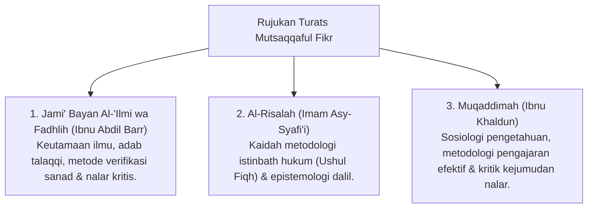

# P3-08-01-Filosofi-dan-Landasan-Turats (Mutsaqqaful Fikr)

## Tujuan
Membedah landasan filosofis integrasi wahyu dan akal (*Bayani, Burhani, 'Irfani*), kewajiban menuntut ilmu (*Thalabul 'Ilmi*), dan rujukan kitab Turats epistemologi Islam.

---

## 1. Landasan Nash Al-Qur'an & As-Sunnah

### 1. QS. Az-Zumar [39]: 9
> قُلْ هَلْ يَسْتَوِي الَّذِينَ يَعْلَمُونَ وَالَّذِينَ لَا يَعْلَمُونَ ۗ إِنَّمَا يَتَذَكَّرُ أُولُو الْأَلْبَابِ
> *"Katakanlah: 'Adakah sama orang-orang yang mengetahui dengan orang-orang yang tidak mengetahui?' Sesungguhnya orang yang berakallah yang dapat menerima pelajaran."*

### 2. HR. Ibnu Majah (No. 224 - Hadits Shahih)
> طَلَبُ الْعِلْمِ فَرِيضَةٌ عَلَى كُلِّ مُسْلِمٍ
> *"Menuntut ilmu itu adalah kewajiban bagi setiap muslim."*

---

## 2. Rujukan Khazanah Turats Klasik

---

## 3. Status Dokumen
* **Status**: 🌟 **A+ (Tervalidasi & Siap Diimplementasikan)**
* **Level**: Project 3 - `03 Capacity Framework / 08 Mutsaqqaful Fikr / 01 Philosophy`
