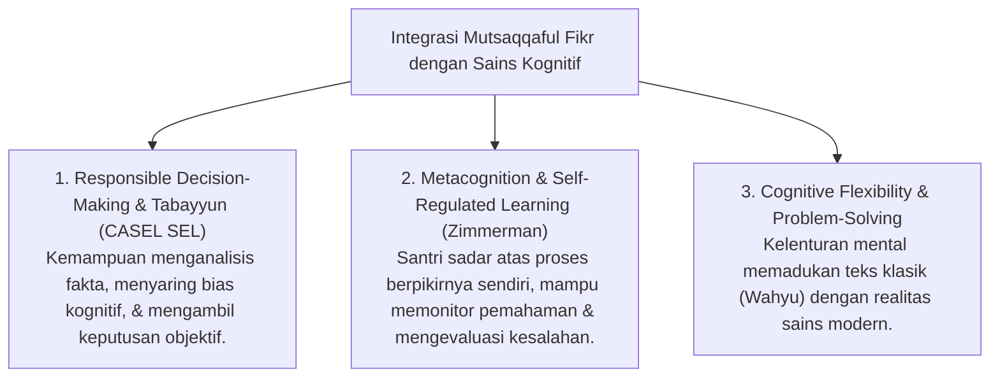

# P3-08-02-Definisi-dan-Konseptualisasi (Mutsaqqaful Fikr)

## Tujuan
Menetapkan definisi operasional, batasan istilah, dan integrasi sains modern (*Critical Thinking, Information Literacy, & Cognitive Flexibility - CASEL SEL*) dari karakter **Mutsaqqaful Fikr**.

---

## 1. Definisi Operasional Baku

> **Mutsaqqaful Fikr dalam Ekosistem TUMBUH adalah:**  
> *"Kapasitas intelektual santri yang memiliki keluasan wawasan syariat dan sains kontemporer, ketajaman nalar kritis (*Critical Thinking*), kemahiran berbahasa Arab-Inggris aktif, kualitas hafalan Al-Qur'an dan matan yang mutqin, serta kemampuan memecahkan masalah keumatan berbasis prinsip hikmah dan tabayyun."*

---

## 2. Integrasi Konsep Sains & CASEL SEL

---

## 3. Status Dokumen
* **Status**: 🌟 **A+ (Tervalidasi & Siap Diimplementasikan)**
* **Level**: Project 3 - `03 Capacity Framework / 08 Mutsaqqaful Fikr / 02 Definition`
