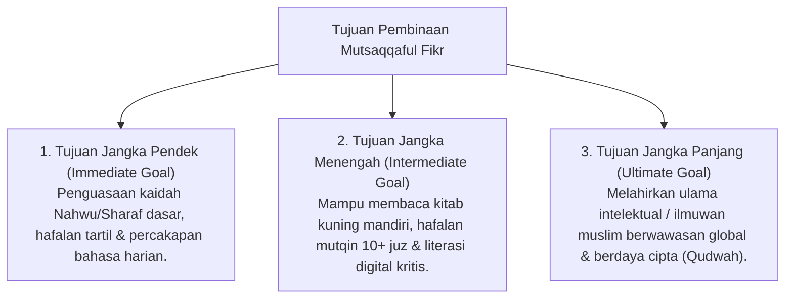

# P3-08-03-Tujuan-dan-Target-Capaian (Mutsaqqaful Fikr)

## Tujuan
Menetapkan tujuan jangka pendek, menengah, dan panjang pembinaan karakter **Mutsaqqaful Fikr** pada santri di lingkungan pesantren TUMBUH.

---

## 1. 3 Tingkatan Tujuan Pembinaan Intelektual

---

## 2. Target Capaian Kuantitatif & Kualitatif

1. **Target Kuantitatif**:
   - 100% santri lulus ujian tahfizh mutqin sesuai target jenjang tangganya.
   - Santri membaca dan mereview minimal **12 buku non-pelajaran per tahun**.
2. **Target Kualitatif**:
   - Santri memiliki pemikiran yang terbuka, tidak mudah terprovokasi hoax, dan mampu berargumentasi secara ilmiah dan santun.

---

## 3. Status Dokumen
* **Status**: 🌟 **A+ (Tervalidasi & Siap Diimplementasikan)**
* **Level**: Project 3 - `03 Capacity Framework / 08 Mutsaqqaful Fikr / 03 Purpose`
