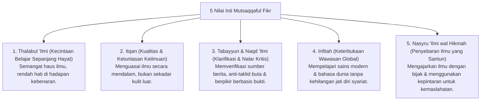

# P3-08-04-Nilai-Inti-dan-Prinsip-Intelektual (Mutsaqqaful Fikr)

## Tujuan
Merumuskan nilai-nilai inti (*Core Values*) dan etika keilmuan yang menjiwai karakter **Mutsaqqaful Fikr** dalam kehidupan santri.

---

## 1. 5 Nilai Inti Mutsaqqaful Fikr

---

## 2. Status Dokumen
* **Status**: 🌟 **A+ (Tervalidasi & Siap Diimplementasikan)**
* **Level**: Project 3 - `03 Capacity Framework / 08 Mutsaqqaful Fikr / 04 Core Values`
