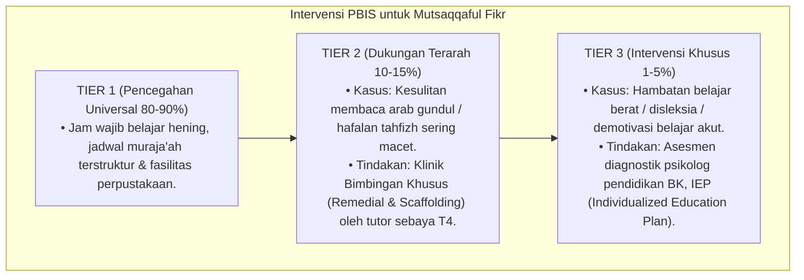

# P3-08-10-Protokol-Intervensi-dan-Pembiasaan (Mutsaqqaful Fikr)

## Tujuan
Menetapkan protokol pembiasaan belajar asrama (*Study SOP*) dan pemetaan intervensi bertingkat (*PBIS Multi-Tier Intervention*) untuk mendukung capaian intelektual seluruh santri.

---

## 1. Protokol Pembiasaan Rutin Asrama (Tier 1: Universal 100%)

1. **Jam Wajib Belajar Malam Mandiri & Terbimbing (20.00–21.30)**:
   - Suasana hening total di seluruh gedung asrama, musyrif berkeliling mendampingi belajar.
2. **Kaidah Zona Wajib Bahasa (*Language Zone Enforcement*)**:
   - Penerapan sistem giliran pekanan (Pekan Bahasa Arab & Pekan Bahasa Inggris) di seluruh area pondok.
3. **Pemberian Kosakata Baru Pagi (*Daily Vocabulary*)**:
   - Pemberian 3 kosakata baru setiap selesai sholat Shubuh oleh bagian bahasa.

---

## 2. Pemetaan Intervensi Khusus PBIS

---

## 3. Status Dokumen
* **Status**: 🌟 **A+ (Tervalidasi & Siap Diimplementasikan)**
* **Level**: Project 3 - `03 Capacity Framework / 08 Mutsaqqaful Fikr / 10 Intervention Mapping`
