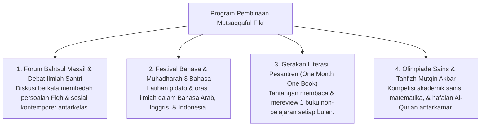

# P3-08-11-Program-Pembinaan-dan-Halaqah (Mutsaqqaful Fikr)

## Tujuan
Menetapkan daftar program pembinaan akademik terstruktur, forum ilmiah, dan kegiatan literasi santri di pesantren TUMBUH.

---

## 1. 4 Program Unggulan Pembinaan Intelektual

---

## 2. Status Dokumen
* **Status**: 🌟 **A+ (Tervalidasi & Siap Diimplementasikan)**
* **Level**: Project 3 - `03 Capacity Framework / 08 Mutsaqqaful Fikr / 11 Programs`
