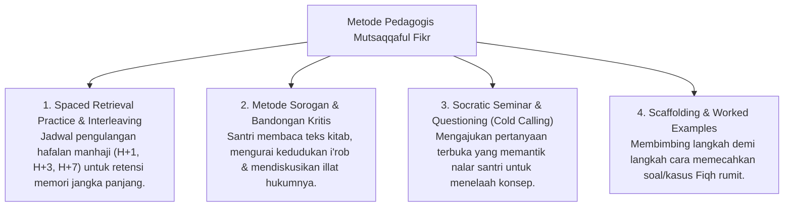

# P3-08-12-Metode-Pedagogi-dan-Didaktik-Intelektual (Mutsaqqaful Fikr)

## Tujuan
Menetapkan metode pedagogi dan pendekatan didaktik interaktif dalam melatihkan daya nalar kritis dan retensi hafalan mutqin bagi santri.

---

## 1. 4 Metode Pedagogi Pengajaran Intelektual

---

## 2. Status Dokumen
* **Status**: 🌟 **A+ (Tervalidasi & Siap Diimplementasikan)**
* **Level**: Project 3 - `03 Capacity Framework / 08 Mutsaqqaful Fikr / 12 Methods`
