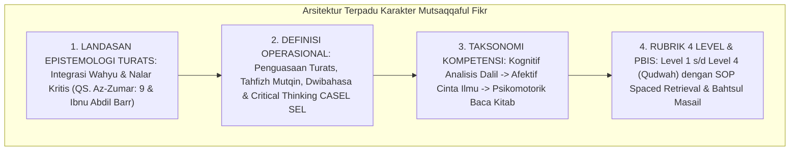

# P3-08-14-Sintesis-dan-Validasi-Mutsaqqaful-Fikr

## Tujuan
Menyintesiskan seluruh modul kapasitas **Mutsaqqaful Fikr (Karakter 5)**—mencakup landasan epistemologis, definisi operasional, standar kompetensi, rubrik 4 level, dan protokol intervensi PBIS—serta menetapkan bukti validasi kelayakan implementasi.

---

## 1. Arsitektur Sintesis Kapasitas Mutsaqqaful Fikr

---

## 2. Matriks Uji Validitas Karakter 5

| Komponen Uji | Tolok Ukur Validasi | Status |
| :--- | :--- | :---: |
| **Kekuatan Epistemologi** | Mengintegrasikan khazanah Turats salaf dengan literasi sains modern. | ✅ **Lolos** |
| **Integrasi Kognitif** | Menerapkan sains memori (*Spaced Retrieval*) untuk hafalan mutqin. | ✅ **Lolos** |
| **Operasionalitas Rubrik** | Indikator tahfizh dan literasi terukur jelas di portofolio PBIS santri. | ✅ **Lolos** |
| **Intervensi PBIS** | Protokol klinik belajar Tier 2 efektif mengatasi kesulitan belajar santri. | ✅ **Lolos** |

---

## 3. Status Dokumen
* **Status**: ✅ **SELESAI (Status Mutu: A+)**
* **Level**: Subproject Induk Karakter 5
* **Project**: `03 Capacity Framework`
* **Subproject**: `08 Mutsaqqaful Fikr`
* **Langkah Berikutnya**: Melanjutkan ke sub-domain karakter ke-6: **`09 Mujahadatun Linafsih`**.
