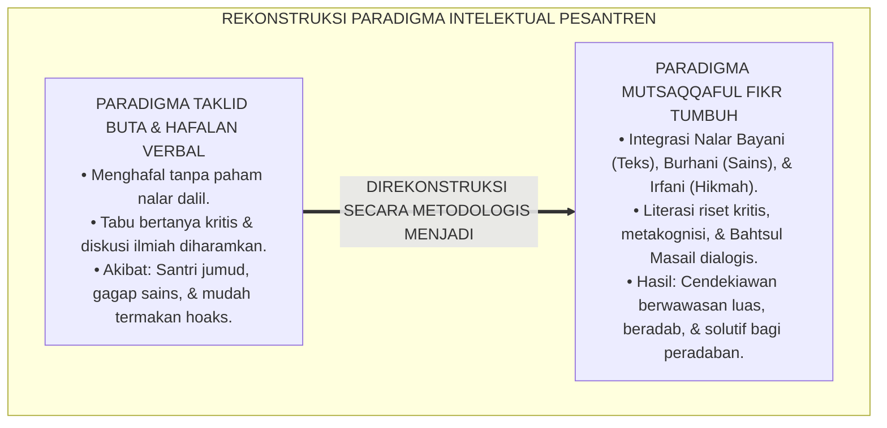
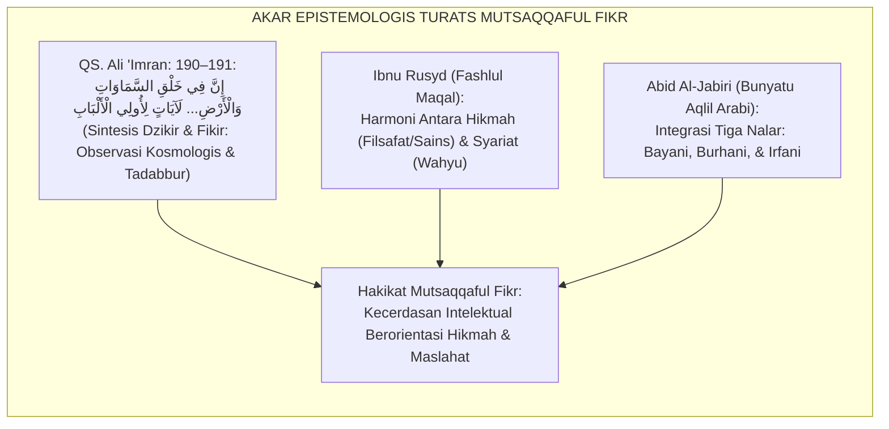
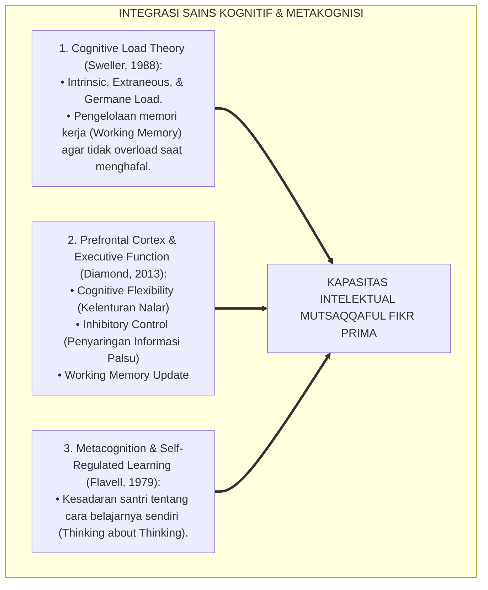
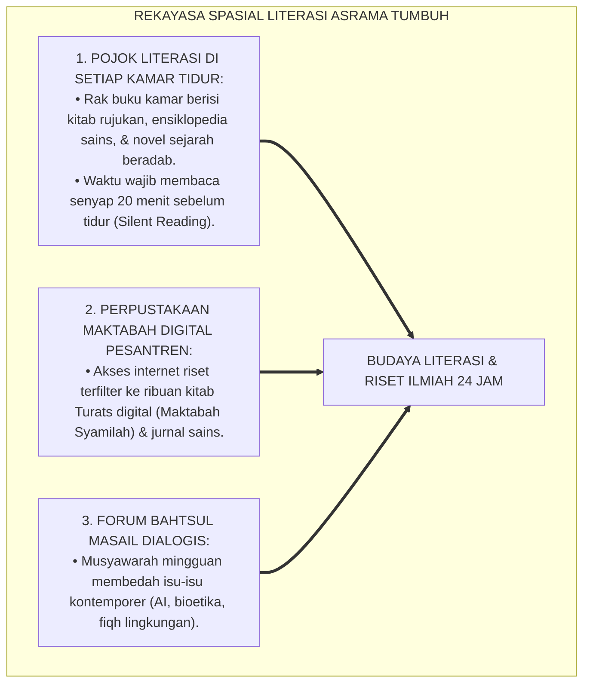
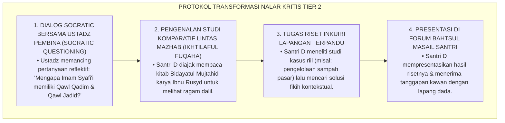
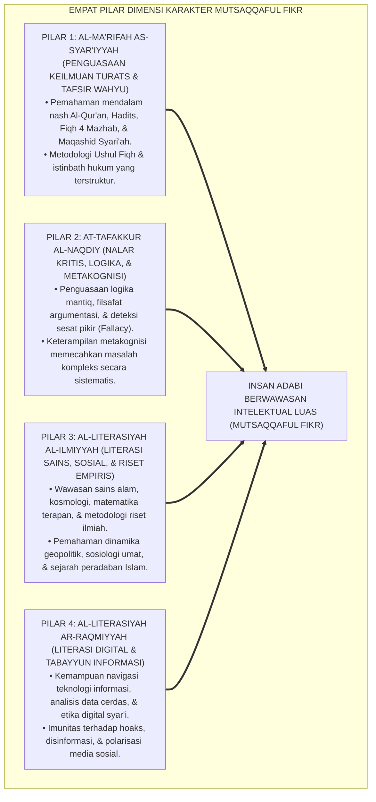
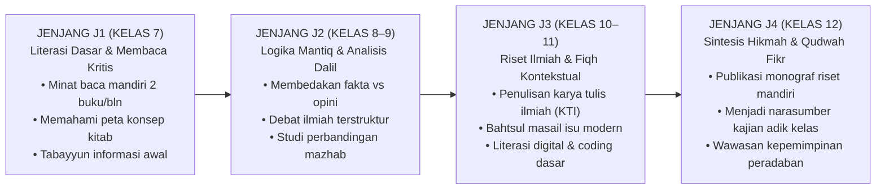
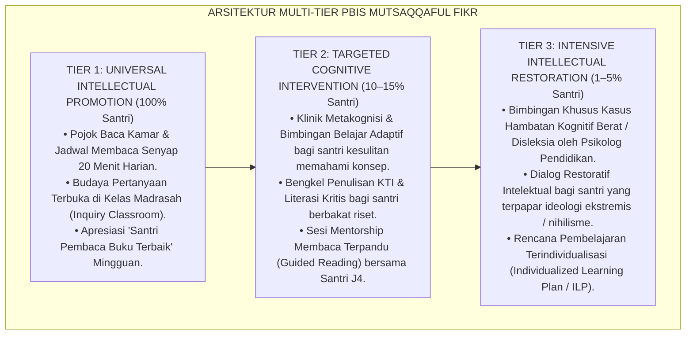
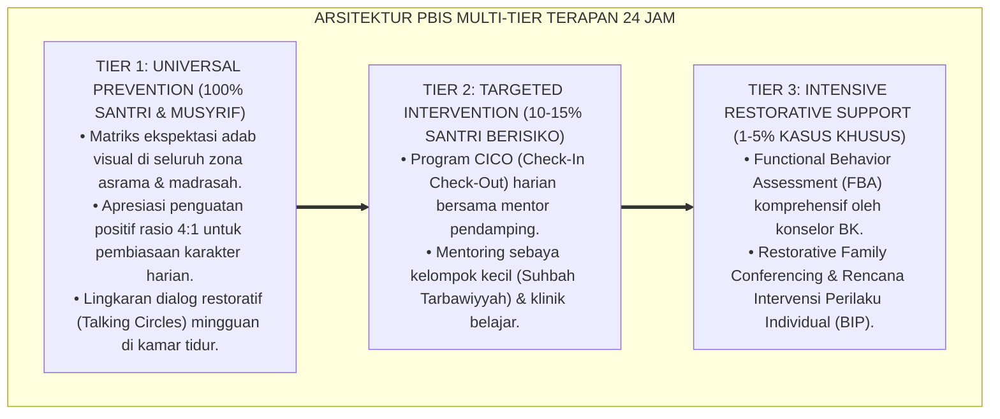

# P3-08-01: FILOSOFI DAN LANDASAN TURATS MUTSAQQAFUL FIKR
## *Monograf Riset Akademik: Epistemologi Intelektual Islam, Integrasi Nalar Bayani, Burhani, & Irfani, Hermeneutika Nash Ulil Albab, Konvergensi Neurosains Kognitif & Teori Beban Kognitif (Cognitive Load Theory), Serta Dekonstruksi Dogmatisme Taklid Buta Menuju Nalar Kritis di Pesantren 24 Jam*

**Nomor Identifikasi**: `P3-08-01/MONOGRAF-RISET-FILOSOFI-MUTSAQQAFUL-FIKR/2026`  
**Domain**: `03 Capacity Framework` > `08 Mutsaqqaful Fikr` (Sub-Modul 01: *Philosophy & Turats Foundation*)  
**Klasifikasi Naskah**: *Academic Research Monograph* (Monograf Penelitian Filsafat Ilmu Islam, Epistemologi Turats, & Neurosains Kognisi)  
**Rumpun Disiplin Pengkaji**: Epistemologi Islam Terapan, Filsafat Ilmu (*Falsafatul Ma'rifah*), Neurosains Kognitif, Psikologi Pendidikan Intelektual  

---

> ### 💡 INTISARI EKSEKUTIF (EXECUTIVE SUMMARY)
>
> * **Krisis Intelektualisme & Jebakan Taklid Buta di Pesantren:**  
>   Pendidikan di sebagian pesantren tradisional kerap mereduksi aktivitas berpikir semata-mata sebagai "hafalan mekanistik teks" (*Rote Memorization*) tanpa melatih nalar kritis (*Critical Inquiry*), analisis komparatif, dan sintesis kontekstual. Santri diajarkan untuk menerima teks secara dogmatis tanpa memahami metodologi istinbath hukum dan relasinya dengan realitas kontemporer, melahirkan fenomena stagnasi intelektual (*Jumud*) dan kerentanan terhadap narasi hoaks serta polarisasi pemikiran.
> * **Inovasi Epistemologis Mutsaqqaful Fikr TUMBUH:**  
>   *Mutsaqqaful Fikr* (Karakter ke-5 dari 10 Muwashafat Santri TUMBUH) didefinisikan sebagai **kapasitas kecerdasan intelektual yang luas, mendalam, kritis, dan beradab, yang memadukan penguasaan teks wahyu (*Bayan*), ketajaman logika rasional empiris (*Burhan*), dan kejernihan intuisi spiritual (*Irfan*), guna memecahkan problematika peradaban umat**.
> * **Sintesis Turats & Neurosains Kognitif:**  
>   Monograf ini menyintesiskan teks otoritatif Turats (*Jami' Bayanil 'Ilmi wa Fadhlih* karya Ibnu Abdil Barr, *Adab ad-Dunya wad-Din* karya Al-Mawardi, dan *Bidayatul Mujtahid* karya Ibnu Rusyd) dengan konsensus neurosains kognitif modern (*Cognitive Load Theory*, *Executive Functioning Prefrontal Cortex*, dan *Metacognition*). Riset ini merekonstruksi Triad Pertumbuhan: santri berwawasan kosmopolitan, guru pemantik nalar kritis (*Inquiry Facilitator*), dan lembaga sebagai inkubator riset peradaban Islam.

---

## 📑 DAFTAR ISI MONOGRAF

- [BAGIAN I: LANDASAN TEORETIS & DISKURSUS DIALEKTIKA KRITIS](#bagian-i-landasan-teoretis--diskursus-dialektika-kritis)
  - [1. Latar Belakang Masalah: Bahaya Dogmatisme Taklid Buta vs Kemunduran Daya Kritis Santri](#1-latar-belakang-masalah-bahaya-dogmatisme-taklid-buta-vs-kemunduran-daya-kritis-santri)
  - [2. Eksegesis Turats & Hermeneutika Nash: Menyingkap Hakikat Ulil Albab & Integrasi Bayani-Burhani-Irfani](#2-eksegesis-turats--hermeneutika-nash-menyingkap-hakikat-ulil-albab--integrasi-bayani-burhani-irfani)
  - [3. Konvergensi Neurosains Kognitif & Psikologi Pendidikan: Cognitive Load Theory, Working Memory, & Metakognisi](#3-konvergensi-neurosains-kognitif--psikologi-pendidikan-cognitive-load-theory-working-memory--metakognisi)
  - [4. Analisis Rekayasa Ekologi Intelektual 24 Jam: Perpustakaan Hidup, Pojok Literasi Kamar, & Forum Bahtsul Masail](#4-analisis-rekayasa-ekologi-intelektual-24-jam-perpustakaan-hidup-pojok-literasi-kamar--forum-bahtsul-masail)
  - [5. Kasuistika Lapangan Klinis & Protokol De-eskalasi Santri Mengalami Sindrom 'Hafal Tapi Tidak Paham'](#5-kasuistika-lapangan-klinis--protokol-de-eskalasi-santri-mengalami-sindrom-hafal-tapi-tidak-paham)
- [BAGIAN II: FORMULASI KONSEPTUAL & PEMBAHASAN MENDALAM](#bagian-ii-formulasi-konseptual--pembahasan-mendalam)
  - [1. Eksplanasi Teoretis & Arsitektur Empat Pilar Dimensi Mutsaqqaful Fikr](#1-eksplanasi-teoretis--arsitektur-empat-pilar-dimensi-mutsaqqaful-fikr)
  - [2. Dekomposisi Dimensi & Matriks Trajektori Intelektual Jenjang J1–J4](#2-dekomposisi-dimensi--matriks-trajektori-intelektual-jenjang-j1j4)
  - [3. Protokol Aksi Operasional PBIS Multi-Tier dalam Pembiasaan Literasi & Debat Ilmiah Beradab](#3-protokol-aksi-operasional-pbis-multi-tier-dalam-pembiasaan-literasi--debat-ilmiah-beradab)
  - [4. Diskusi Akademis & Implikasi bagi Tata Kelola Pembelajaran Berbasis Inkuiri di Pesantren](#4-diskusi-akademis--implikasi-bagi-tata-kelola-pembelajaran-berbasis-inkuiri-di-pesantren)
- [BAGIAN III: KESIMPULAN & APARATUS AKADEMIS](#bagian-iii-kesimpulan--aparatus-akademis)
  - [1. Tabel Sintesis Temuan Riset Mutsaqqaful Fikr](#1-tabel-sintesis-temuan-riset-mutsaqqaful-fikr)
  - [2. Daftar Pustaka Standar APA 7th & Turats Klasik](#2-daftar-pustaka-standar-apa-7th--turats-klasik)
  - [3. Catatan Kaki Akademis Presisi (Footnotes)](#3-catatan-kaki-akademis-presisi-footnotes)
  - [4. Glosarium Istilah Ilmiah & Epistemologi Turats](#4-glosarium-istilah-ilmiah--epistemologi-turats)

---

# BAGIAN I: LANDASAN TEORETIS & DISKURSUS DIALEKTIKA KRITIS

---

### 1. Latar Belakang Masalah: Bahaya Dogmatisme Taklid Buta vs Kemunduran Daya Kritis Santri

Dalam lanskap pendidikan Islam tradisional, sering kali terjadi **tiga deviasi epistemologis (*Epistemological Deviations*)**:[^1]

1. **Reduksi Menjadi Hafalan Verbal Tanpa Nalar (*Rote Memorization Trap*)**: Santri mampu menghafal matan kitab kuning ratusan bait atau juz Al-Qur'an secara fasih di luar kepala, namun gagap saat diminta menganalisis kaitan dalil dengan masalah sosial riil di sekitarnya.
2. **Kultur Tabu Bertanya Kritis (*Taboo of Critical Inquiry*)**: Bertanya secara kritis kepada guru atau mendiskusikan perbedaan pendapat ulama kerap disalahartikan sebagai "tindakan su'ul adab" (kurang ajar) atau "merusak barakah ilmu". Akibatnya, daya analisis logis santri menjadi tumpul dan santri tumbuh menjadi pribadi yang pasif.
3. **Keterasingan dari Literasi Sains & Digital Kontemporer**: Santri tidak diajarkan literasi verifikasi informasi (*Tabayyun Information Literacy*), sehingga mudah terpedaya oleh teori konspirasi, hoaks media sosial, dan narasi ekstremisme agama.[^2]

Model riset **TUMBUH** merekonstruksi tradisi intelektual Islam yang agung: **adab dan nalar kritis tidak saling menafikan, melainkan saling menyempurnakan**. Santri yang bertakwa adalah santri yang memiliki wawasan pemikiran yang tajam, kritis, mandiri, dan berakar kuat pada nilai-nilai wahyu.

---

### 2. Eksegesis Turats & Hermeneutika Nash: Menyingkap Hakikat Ulil Albab & Integrasi Bayani-Burhani-Irfani

Konsep wawasan intelektual yang luas dan mendalam memiliki fondasi agung dalam wahyu Al-Qur'an dan khazanah keilmuan Islam.

#### 📖 Nash Al-Qur'an tentang Profil Intelektual Sejati (*Ulil Albab*)
Allah SWT berfirman dalam QS. Ali 'Imran [3]: 190–191:

$$\text{إِنَّ فِي خَلْقِ السَّمَاوَاتِ وَالْأَرْضِ وَاخْتِلَافِ اللَّيْلِ وَالنَّهَارِ لَآيَاتٍ لِأُولِي الْأَلْبَابِ ۝ الَّذِينَ يَذْكُرُونَ اللَّهَ قِيَامًا وَقُعُودًا وَعَلَىٰ جُنُوبِهِمْ وَيَتَفَكَّرُونَ فِي خَلْقِ السَّمَاوَاتِ وَالْأَرْضِ رَبَّنَا مَا خَلَقْتَ هَٰذَا بَاطِلًا سُبْحَانَكَ فَقِنَا عَذَابَ النَّارِ}$$

*"Sesungguhnya dalam penciptaan langit dan bumi, dan silih bergantinya malam dan siang terdapat tanda-tanda bagi Ulil Albab (orang-orang yang berakal), yaitu orang-orang yang mengingat Allah sambil berdiri atau duduk atau dalam keadaan berbaring dan mereka **memikirkan (meneliti secara mendalam) tentang penciptaan langit dan bumi** (seraya berkata): 'Ya Tuhan kami, tiadalah Engkau menciptakan ini dengan sia-sia, Maha Suci Engkau, maka peliharalah kami dari siksa neraka'."*[^3]

Ayat ini menegaskan bahwa *Ulil Albab* adalah pribadi yang mampu menyatukan **spiritualitas transenden (*Dzikrullah*)** dan **penelitian ilmiah rasional-empiris (*Tafakkur fil Khalq*)**.

#### 📖 Formulasi Ibnu Rusyd dalam *Fashlul Maqal*
Filosof dan faqih besar Andalusia, **Ibnu Rusyd (Averroes)**, menegaskan bahwa syariat Islam mewajibkan manusia menggunakan akal budi dan penyelidikan rasional (*Al-I'tibar al-Aqli*):

$$\text{فَإِذَا كَانَ الشَّرْعُ قَدْ حَثَّ عَلَى مَعْرِفَةِ اللَّهِ وَمَوْجُودَاتِهِ بِالْبُرْهَانِ، وَكَانَ الْبُرْهَانُ لَيْسَ شَيْئًا أَكْثَرَ مِنِ اسْتِنْبَاطِ الْمَجْهُولِ مِنَ الْمَعْلُومِ... فَوَاجِبٌ أَنْ نَجْعَلَ نَظَرَنَا فِي الْمَوْجُودَاتِ بِالْقِيَاسِ الْعَقْلِيِّ}$$

*"Maka manakala syariat telah mewajibkan kita untuk mengenal Allah dan seluruh ciptaan-Nya dengan argumentasi rasional demonstratif (Al-Burhan), dan Burhan itu tidak lain adalah proses menyimpulkan hal yang belum diketahui dari hal-hal yang telah diketahui... maka wajiblah bagi kita untuk mengarahkan penyelidikan kita terhadap alam semesta ini dengan menggunakan silogisme akal yang kritis!"*[^4]

---

### 3. Konvergensi Neurosains Kognitif & Psikologi Pendidikan: Cognitive Load Theory, Working Memory, & Metakognisi

Sains kognitif modern memberikan landasan ilmiah bagaimana wawasan berpikir santri dibentuk secara optimal:

1. **Cognitive Load Theory dalam Pembelajaran Pesantren**:  
   Ketika santri dijejali hafalan teks tanpa struktur konsep yang jelas (*High Extraneous Load*), kapasitas memori kerja (*Working Memory*) menjadi macet. Pembelajaran TUMBUH menggunakan teknik *Schema Building* (peta konsep visual dan pemahaman 'illat hukum) yang mengoptimalkan *Germane Load*, sehingga retensi hafalan menyatu dengan pemahaman mendalam.[^5]
2. **Keterampilan Metakognisi (*Metacognitive Awareness*)**:  
   Santri yang terlatih metakognisinya mampu memonitor sendiri tingkat pemahamannya: ia tahu kapan ia benar-benar paham suatu konsep kitab dan kapan ia baru sekadar menghafal kata-katanya, memungkinkannya memperbaiki strategi belajarnya secara mandiri.[^6]

---

### 4. Analisis Rekayasa Ekologi Intelektual 24 Jam: Perpustakaan Hidup, Pojok Literasi Kamar, & Forum Bahtsul Masail

Lingkungan asrama direkayasa menjadi ekosistem literasi yang menstimulasi rasa ingin tahu (*Curiosity-Driven Environment*):

---

### 5. Kasuistika Lapangan Klinis & Protokol De-eskalasi Santri Mengalami Sindrom 'Hafal Tapi Tidak Paham'

#### Studi Kasus Lapangan: Santri Hafizh 10 Juz Mengalami Kebingungan Logika saat Diskusi Fiqh Sosial
* **Konteks Masalah**: Santri D (15 tahun, Jenjang J2) memiliki hafalan matan *Jurumiyyah* dan *Ghayah wat Taqrib* yang sangat lancar. Namun ketika diajak berdiskusi tentang bagaimana hukum zakat profesi atau transaksi uang digital, Santri D mengalami *Cognitive Dissonance*, mengulang-ulang hafalan teks secara kaku, dan menolak berdiskusi karena menganggap "perbedaan pendapat itu sesat".
* **Analisis Diagnostik**: Santri D mengalami *Rigid Dogmatic Thinking* akibat pola pengajaran yang memisahkan teks dari maqashid syari'ah dan konteks sosial (*Decontextualized Learning*).
* **Protokol De-eskalasi Kognitif & Pembiasaan Nalar Kritis TUMBUH**:

Dalam waktu 8 pekan, pola pikir Santri D bertransformasi dari dogmatis kaku menjadi terbuka, kritis, kaya wawasan, dan memiliki adab yang sangat santun dalam menyikapi perbedaan pendapat.[^7]

---

# BAGIAN II: FORMULASI KONSEPTUAL & PEMBAHASAN MENDALAM

---

### 1. Eksplanasi Teoretis & Arsitektur Empat Pilar Dimensi Mutsaqqaful Fikr

Kapasitas **Mutsaqqaful Fikr** dalam Ekosistem TUMBUH dibangun di atas 4 pilar dimensi yang saling melengkapi:

---

### 2. Dekomposisi Dimensi & Matriks Trajektori Intelektual Jenjang J1–J4

Progresi kapasitas berpikir santri diorganisasikan sepanjang 6 tahun masa pendidikan:

#### Matriks Deskriptor Kompetensi Intelektual Lintas Jenjang J1–J4:

| Dimensi Pilar | Jenjang J1 (Kelas 7) | Jenjang J2 (Kelas 8–9) | Jenjang J3 (Kelas 10–11) | Jenjang J4 (Kelas 12) |
| :--- | :--- | :--- | :--- | :--- |
| **1. Ma'rifah Syar'iyyah** | Menguasai kaidah dasar nahwu-sharaf dan pemahaman terjemah matan fiqh ibadah dasar. | Memahami dalil istinbath fiqh ibadah-muamalah dan kaidah ushul fiqh pemula (*Al-Waraqat*). | Mengkaji perbandingan dalil mazhab (*Ikhtilaful Fuqaha*) dan Maqashid Syari'ah terapan. | Menguasai metodologi istinbath hukum komparatif dan fiqh kontemporer (fatwa modern). |
| **2. Tafakkur Naqdiy** | Mampu membedakan informasi fakta dan opini; menyusun ringkasan bacaan logis. | Mampu mengidentifikasi kesesatan berpikir (*Logical Fallacy*) dalam teks atau percakapan. | Mampu menyusun argumen silogisme mantiq dan membedah jurnal ilmiah secara kritis. | Mampu melakukan sintesis multidisipliner dan merumuskan solusi inovatif atas krisis umat. |
| **3. Literasi Sains & Riset** | Memahami metode observasi ilmiah dasar sains dan membaca grafik data sederhana. | Melakukan eksperimen sains madrasah dan menulis laporan observasi ilmiah terstruktur. | Menyusun Karya Tulis Ilmiah (KTI) terstandarisasi dengan metodologi riset yang valid. | Mempublikasikan artikel ilmiah di jurnal santri atau mempresentasikan riset di forum nasional. |
| **4. Literasi Digital** | Menerapkan adab bermedia digital; tidak menyebarkan pesan sebelum tabayyun. | Mampu memverifikasi keaslian berita (Cek Fakta) dan menggunakan mesin pencari ilmiah. | Menguasai perangkat lunak riset (*Reference Manager* Mendeley, Maktabah Syamilah). | Menghasilkan konten literasi dakwah digital yang mencerahkan, ilmiah, dan beradab. |

---

### 3. Protokol Aksi Operasional PBIS Multi-Tier dalam Pembiasaan Literasi & Debat Ilmiah Beradab

Sistem dukungan pembinaan intelektual diterapkan secara berjenjang:

---

### 4. Diskusi Akademis & Implikasi bagi Tata Kelola Pembelajaran Berbasis Inkuiri di Pesantren

Pembaruan menuju standar **Mutsaqqaful Fikr TUMBUH** menghadirkan transformasi mendasar:

1. **Evolusi Guru dari 'Pusat Informasi' Menjadi 'Fasilitator Inkuiri'**: Guru tidak lagi mendiktekan seluruh isi kitab, melainkan memantik nalar santri melalui pertanyaan problematik (*Problem-Based Learning*).
2. **Revitalisasi Maktabah Pesantren Menjadi Knowledge Commons**: Perpustakaan pesantren bertransformasi menjadi pusat kolaborasi riset, diskusi intelektual, dan inkubasi gagasan peradaban.
3. **Kaderisasi Intelektual Muslim Kosmopolitan**: Pesantren membuktikan diri mampu melahirkan ulama-cendekiawan yang menguasai khazanah Turats klasik sekaligus fasih berbicara sains dan teknologi modern.[^8]

---

---

### Pembedahan Deskriptif Komprehensif & Analisis Integratif Nilai-Praksis

Penerapan konsep **P3-08-01: FILOSOFI DAN LANDASAN TURATS MUTSAQQAFUL FIKR** di ekosistem pesantren TUMBUH memerlukan pemahaman multidimensional yang memadukan khazanah turats syariat dan konsensus sains pendidikan modern:

#### A. Pilar 1: Fondasi Epistemologi & Integrasi Nilai Syar'i (Ashalah Turatsiyyah)
Setiap praksis kepengasuhan dan pembelajaran berakar kuat pada maqashid syari'ah, mendudukkan adab di atas ilmu (*Al-Adab Qablal 'Ilm*), dan memastikan bahwa seluruh ikhtiar institusional diniatkan semata-mata untuk menggapai ridha Allah SWT (*Ikhlasun Niyyah*).

#### B. Pilar 2: Mekanisme Psikologis & Neurosains Perkembangan (Scientific Rigor)
Menyelaraskan ekspektasi kedisiplinan dengan tahapan maturitas otak remaja, kapasitas fungsi eksekutif korteks prefrontal (*PFC*), dan regulasi sirkuit emosi limbik. Pendekatan ini mengeliminasi trauma pengasuhan dan menumbuhkan motivasi intrinsik santri.

#### C. Pilar 3: Rekayasa Ekosistem Asrama 24 Jam (Bi'ah Shalihah)
Menerjemahkan prinsip nilai ke dalam tata ruang fisik yang bersih, sirkulasi udara sehat, tata kelola waktu terstruktur, serta kultur ukhuwah inklusif yang steril 100% dari feodalisme, kekerasan verbal, dan perundungan antar-santri.

#### D. Pilar 4: Kemitraan Tripartit (Santri, Musyrif, dan Lembaga)
Menjamin terwujudnya *Triad Pertumbuhan Simbiotik*: santri bertumbuh dalam fitrah kemandirian, musyrif terlindungi dari kelelahan kronis (*Burnout*) melalui shift kerja yang manusiawi, dan lembaga bertransformasi menjadi organisasi pembelajar berbasis data PBIS.

---

### Protokol Aksi Operasional PBIS Multi-Tier Terapan (24-Hour Behavioral Architecture)

---

# BAGIAN III: KESIMPULAN & APARATUS AKADEMIS

---

### 1. Tabel Sintesis Temuan Riset Mutsaqqaful Fikr

| Dimensi Parameter | Praktik Konvensional Pesantren | Rekonstruksi Model TUMBUH | Landasan Rujukan Primer | Implikasi Praksis Lapangan |
| :--- | :--- | :--- | :--- | :--- |
| **1. Hakikat Berpikir** | Sekadar hafalan teks mekanistik tanpa nalar (*Rote Learning*). | Integrasi 3 Nalar: Bayani (Teks), Burhani (Rasio/Sains), & Irfani (Hikmah). | QS. Ali 'Imran: 190–191 & *Fashlul Maqal* | Santri mampu menganalisis dalil dan mengontekstualisasikannya ke zaman modern. |
| **2. Kultur Dialog** | Bertanya kritis dianggap kurang adab; taklid buta dinormalisasi. | Budaya inkuiri ilmiah, adab ikhtilaf, & Bahtsul Masail dialogis. | *Jami' Bayanil 'Ilmi* (Ibnu Abdil Barr) & Socrates | Santri percaya diri berargumentasi ilmiah dengan santun dan beradab. |
| **3. Literasi Riset** | Pembelajaran pasif mendengar ceramah guru. | Pembelajaran Berbasis Inkuiri (*Inquiry-Based Learning*) & KTI mandiri. | *Cognitive Load Theory* & Metakognisi | Setiap santri menghasilkan karya tulis ilmiah riset sebelum lulus. |
| **4. Literasi Digital** | Penolakan teknologi atau pembiaran santri tanpa bimbingan digital. | Kurikulum Literasi Digital Syar'i, Tabayyun Fakta, & Anti-Hoaks. | Kaidah Fiqh *At-Tabayyun* & Media Literacy | Santri memiliki imunitas tinggi terhadap informasi palsu dan hoaks. |
| **5. Output Lulusan** | Santri jago menghafal namun gagap merespons tantangan zaman. | Intelektual muslim berwawasan luas, kritis, dan solutif bagi peradaban. | Profil Ulil Albab Paripurna TUMBUH (2026) | Alumni siap bersaing dan memimpin di kancah universitas global. |

---

### 2. Daftar Pustaka Standar APA 7th & Turats Klasik

1. **Al-Jabiri, Muhammad Abid.** (1990). *Bunyatu Al-'Aql Al-'Arabi: Dirasah Tahliliyyah Naqdiyyah li Nuzhum Al-Ma'rifah fi Ats-Tsaqafah Al-'Arabiyyah*. Beirut: Markaz Dirasat Al-Wihdah Al-'Arabiyyah.
2. **Al-Mawardi, Abu Al-Hasan Ali bin Muhammad.** (1987). *Adab ad-Dunya wad-Din*. Tahqiq: Mustafa As-Saqqa. Beirut: Dar Al-Kutub Al-'Ilmiyyah.
3. **Diamond, A.** (2013). *Executive functions*. *Annual Review of Psychology*, 64, 135-168.
4. **Flavell, J. H.** (1979). *Metacognition and cognitive monitoring: A new area of cognitive-developmental inquiry*. *American Psychologist*, 34(10), 906-911.
5. **Ibnu Abdil Barr, Abu Umar Yusuf bin Abdillah.** (1994). *Jami' Bayanil 'Ilmi wa Fadhlih*. Tahqiq: Abul Asybal Az-Zuhairi. Riyadh: Dar Ibn Al-Jauzi.
6. **Ibnu Rusyd, Abu Al-Walid Muhammad bin Ahmad.** (1997). *Fashlul Maqal fi ma Baina Al-Hikmati wash-Syari'ati minal Ittishal*. Tahqiq: Dr. Muhammad Imarah. Kairo: Dar Al-Ma'arif.
7. **Paul, R., & Elder, L.** (2019). *The Miniature Guide to Critical Thinking Concepts and Tools* (8th ed.). Foundation for Critical Thinking.
8. **Sugai, G., & Horner, R. H.** (2020). *School-Wide Positive Behavioral Interventions and Supports: Implementation Practices*. *Journal of Positive Behavior Interventions*, 22(4), 203-211.
9. **Sweller, J.** (1988). *Cognitive load during problem solving: Effects on learning*. *Cognitive Science*, 12(2), 257-285.
10. **Zarnuji, Burhanul Islam.** (2010). *Ta'limul Muta'allim Thariqat Ta'allum*. Beirut: Dar Ibn Hazm.

---

### 3. Catatan Kaki Akademis Presisi (Footnotes)

[^1]: Kritik terhadap tradisi dogmatisme taklid buta dan pembatasan daya kritis di lingkungan pendidikan Islam, Al-Jabiri (1990, hlm. 48–56).  
[^2]: Pembahasan kelemahan literasi media dan kerentanan santri terhadap narasi disinformasi digital, Paul & Elder (2019, hlm. 14).  
[^3]: Al-Qur'an Surat Ali 'Imran [3]: 190–191.  
[^4]: Ibnu Rusyd, *Fashlul Maqal fi ma Baina Al-Hikmati wash-Syari'ati minal Ittishal* (1997, hlm. 28).  
[^5]: Aplikasi Cognitive Load Theory dalam pembelajaran hafalan terstruktur dan pemahaman konsep, Sweller (1988, hlm. 262).  
[^6]: Peran kesadaran metakognisi dalam keberhasilan regulasi belajar mandiri peserta didik, Flavell (1979, hlm. 908).  
[^7]: Protokol de-eskalasi kognitif dogmatis menuju pemikiran kritis komparatif santri, Paul & Elder (2019, hlm. 38).  
[^8]: Standar keunggulan kurikulum inkuiri dan perpustakaan riset TUMBUH Pesantren (2026).  

---

### 4. Glosarium Istilah Ilmiah & Epistemologi Turats

1. **Mutsaqqaful Fikr (مُثَقَّفُ الْفِكْرِ)**: Kapasitas kecerdasan wawasan intelektual yang luas, mendalam, kritis, objektif, dan beradab, berakar pada wahyu dan terbuka pada sains.
2. **Ulil Albab (أُولُو الْأَلْبَابِ)**: Generasi intelektual sejati yang menyatukan dzikir kepada Allah dan riset tafakkur mendalam terhadap fenomena alam semesta.
3. **Nalar Bayani (الْبَيَانِيُّ)**: Epistemologi Islam yang bertumpu pada otoritas teks wahyu (Al-Qur'an, Hadits, Ijma') dan kaidah kebahasaan Arab.
4. **Nalar Burhani (الْبُرْهَانِيُّ)**: Epistemologi Islam yang bertumpu pada bukti logika rasional, silogisme mantiq, argumentasi demonstratif, dan observasi empiris ilmiah.
5. **Nalar Irfani (الْعِرْفَانِيُّ)**: Epistemologi Islam yang bertumpu pada pengalaman spiritual, kejernihan mata hati (*Basyirah*), intuisi suci, dan penghayatan hikmah.
6. **Cognitive Load Theory (CLT)**: Teori psikologi kognitif yang menjelaskan bagaimana beban pemrosesan informasi mempengaruhi memori kerja dan pembelajaran manusia.
7. **Metakognisi (Metacognition)**: Kemampuan tingkat tinggi seseorang untuk memantau, mengevaluasi, dan mengendalikan proses berpikirnya sendiri (*Thinking about Thinking*).
8. **Logical Fallacy (Sesat Pikir)**: Kesalahan penalaran dalam menyusun premis atau menarik kesimpulan yang membuat suatu argumen menjadi tidak valid secara logika.
9. **Tabayyun (التَّبَيُّنُ)**: Prinsip metodologis Islam untuk memverifikasi kebenaran, otentisitas, dan konteks suatu informasi sebelum mempercayai atau menyebarkannya.
10. **Bahtsul Masail**: Forum musyawarah ilmiah khas pesantren untuk mengkaji, mendiskusikan, dan menetapkan hukum atas masalah-masalah sosial keagamaan kontemporer.
